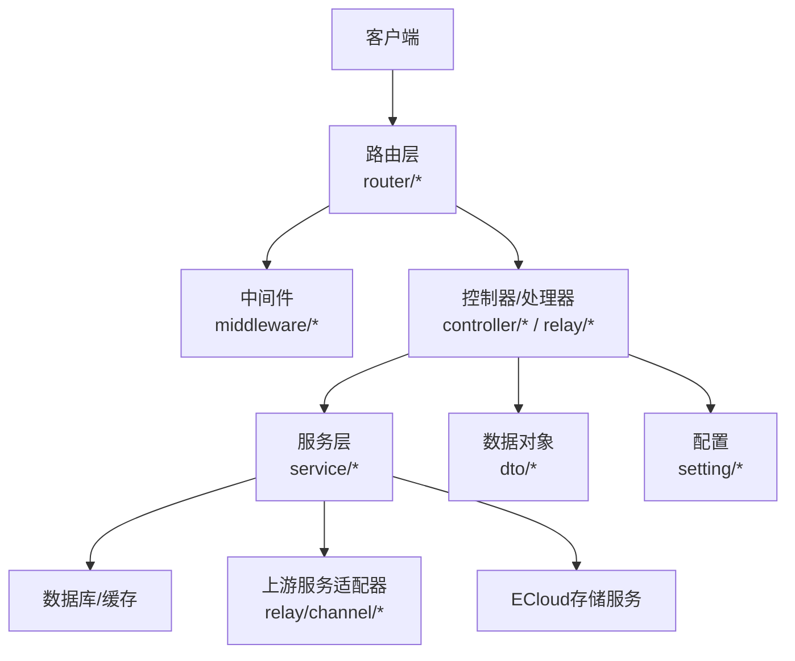
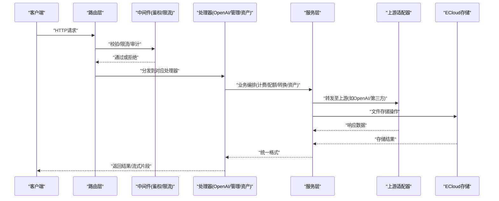
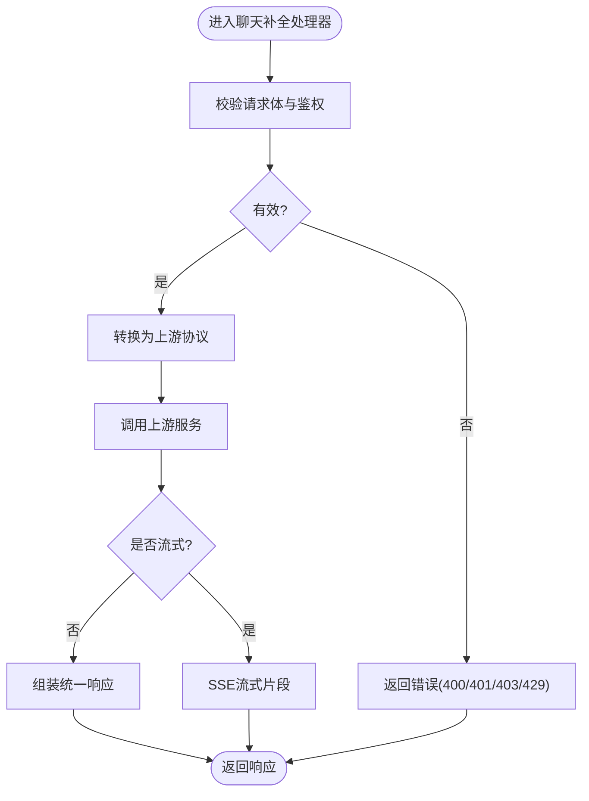
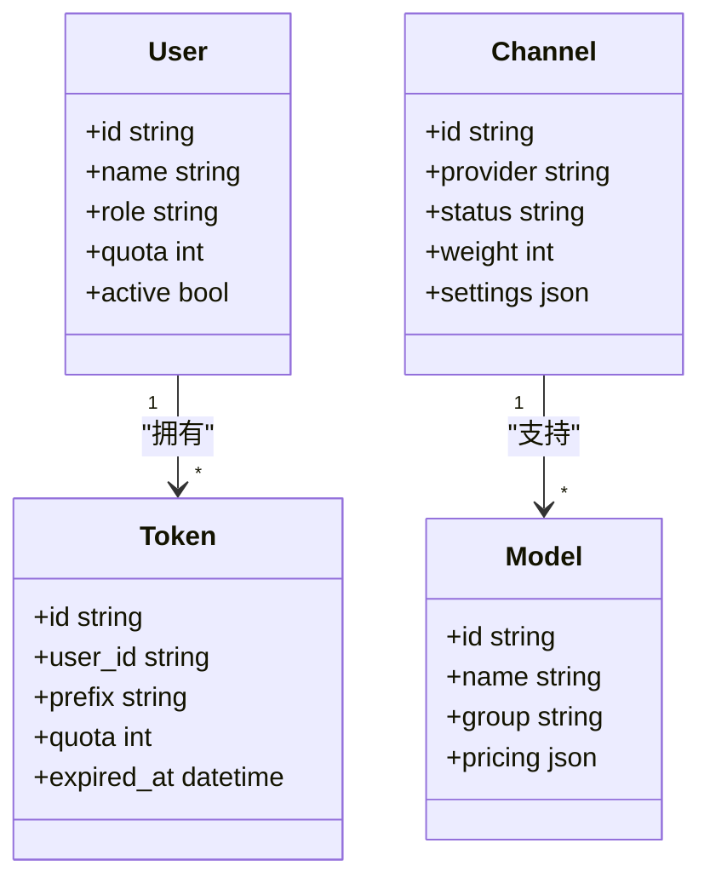
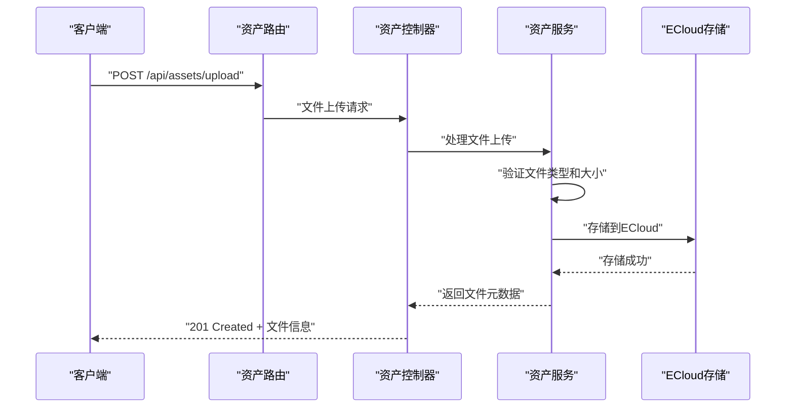
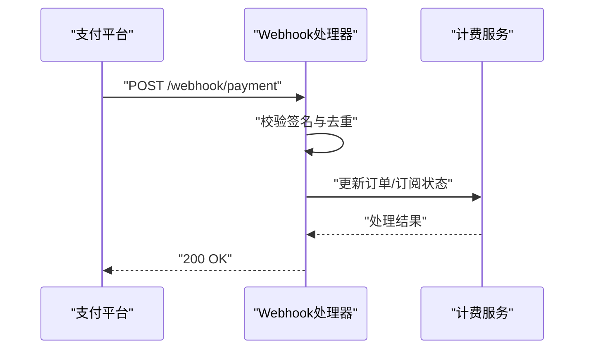
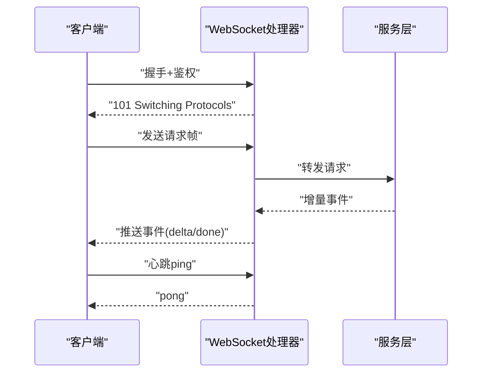
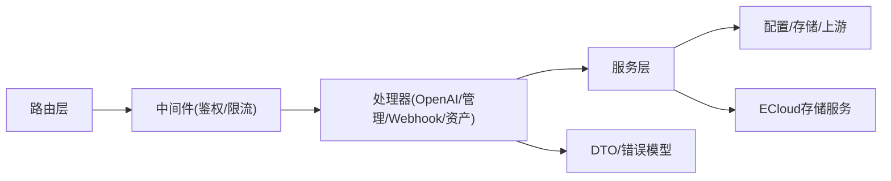

# API参考

<cite>
**本文引用的文件**   
- [main.go](file://main.go)
- [router/api-router.go](file://router/api-router.go)
- [router/relay-router.go](file://router/relay-router.go)
- [router/web-router.go](file://router/web-router.go)
- [router/asset-router.go](file://router/asset-router.go)
- [controller/asset.go](file://controller/asset.go)
- [service/asset.go](file://service/asset.go)
- [service/asset_ecloud.go](file://service/asset_ecloud.go)
- [model/asset.go](file://model/asset.go)
- [middleware/auth.go](file://middleware/auth.go)
- [middleware/rate-limit.go](file://middleware/rate-limit.go)
- [common/limiter/limiter.go](file://common/limiter/limiter.go)
- [dto/openai_request.go](file://dto/openai_request.go)
- [dto/openai_response.go](file://dto/openai_response.go)
- [dto/request_common.go](file://dto/request_common.go)
- [dto/error.go](file://dto/error.go)
- [relay/chat_completions_via_responses.go](file://relay/chat_completions_via_responses.go)
- [relay/responses_handler.go](file://relay/responses_handler.go)
- [relay/websocket.go](file://relay/websocket.go)
- [service/http.go](file://service/http.go)
- [setting/config/config.go](file://setting/config/config.go)
- [docs/openapi/relay.json](file://docs/openapi/relay.json)
- [docs/openapi/api.json](file://docs/openapi/api.json)
</cite>

## 更新摘要
**已进行的更改**
- 新增资产管理API端点文档，包括资产上传、下载、管理和ECloud集成
- 更新路由结构以反映新的资产路由配置
- 添加ECloud存储服务集成的详细说明
- 扩展控制器和服务层文档以包含资产管理功能
- 更新依赖关系分析以包含新的资产模块

## 目录
1. [简介](#简介)
2. [项目结构](#项目结构)
3. [核心组件](#核心组件)
4. [架构总览](#架构总览)
5. [详细组件分析](#详细组件分析)
6. [依赖关系分析](#依赖关系分析)
7. [性能考虑](#性能考虑)
8. [故障排查指南](#故障排查指南)
9. [结论](#结论)
10. [附录](#附录)

## 简介
本API参考文档面向开发者，系统化记录本项目的RESTful API、OpenAI兼容接口、管理API与Webhook接口的使用方法。内容涵盖HTTP方法与URL模式、请求/响应体结构、认证方式、WebSocket实时交互、错误处理策略、安全与速率限制、版本信息、常见用例、客户端实现指南、性能优化技巧以及调试与监控方法。重点覆盖：
- OpenAI兼容API（聊天补全、Responses、图像、音频等）
- 管理API（用户、令牌、渠道、模型、计费、订阅等）
- **资产管理API（资产上传、下载、存储、ECloud集成）**
- Webhook接口（支付回调、任务状态通知等）
- WebSocket实时通信（流式事件、双向消息）

## 项目结构
后端采用Go语言构建，路由层按功能域划分，中间件负责鉴权、限流、日志、CORS等横切关注点；DTO层定义请求/响应数据结构；Relay层实现多上游适配与协议转换；Service层封装业务逻辑；Setting层提供配置项。**新增的资产管理模块提供了完整的文件存储和ECloud集成能力**。

**图表来源**
- [router/api-router.go:1-200](file://router/api-router.go#L1-L200)
- [router/relay-router.go:1-200](file://router/relay-router.go#L1-L200)
- [router/asset-router.go:1-200](file://router/asset-router.go#L1-L200)
- [middleware/auth.go:1-200](file://middleware/auth.go#L1-L200)
- [relay/websocket.go:1-200](file://relay/websocket.go#L1-L200)

**章节来源**
- [main.go:1-200](file://main.go#L1-L200)
- [router/api-router.go:1-200](file://router/api-router.go#L1-L200)
- [router/relay-router.go:1-200](file://router/relay-router.go#L1-L200)
- [router/web-router.go:1-200](file://router/web-router.go#L1-L200)
- [router/asset-router.go:1-200](file://router/asset-router.go#L1-L200)

## 核心组件
- 路由与网关
  - REST管理API路由：统一注册管理端点，包含用户、令牌、渠道、模型、计费、订阅、系统信息等。
  - OpenAI兼容路由：暴露与OpenAI一致的聊天补全、Responses、Embedding、图像、音频等接口。
  - **资产路由：专门处理文件上传、下载、管理和ECloud集成的端点**。
  - Web路由：前端控制台与静态资源。
- 中间件
  - 鉴权：支持Bearer Token、Cookie会话、OAuth等。
  - 限流：基于IP、用户、模型等多维度的令牌桶/滑动窗口限流。
  - 其他：CORS、Gzip、请求体大小限制、审计日志、请求ID注入。
- 数据对象（DTO）
  - OpenAI兼容请求/响应结构，通用请求头、分页、错误格式等。
  - **资产相关的数据结构，包括文件元数据、存储信息和访问控制**。
- Relay与适配器
  - 将内部请求转换为各上游厂商的协议，并回写统一响应格式。
- 服务层
  - 业务编排：计费、配额、Token计数、工具调用结算、任务轮询等。
  - **资产服务：文件处理、存储管理、ECloud集成、权限控制**。
- 配置
  - 运行时配置加载、开关控制、速率限制参数、上游密钥管理等。

**章节来源**
- [router/api-router.go:1-200](file://router/api-router.go#L1-L200)
- [router/relay-router.go:1-200](file://router/relay-router.go#L1-L200)
- [router/asset-router.go:1-200](file://router/asset-router.go#L1-L200)
- [controller/asset.go:1-200](file://controller/asset.go#L1-L200)
- [service/asset.go:1-200](file://service/asset.go#L1-L200)
- [service/asset_ecloud.go:1-200](file://service/asset_ecloud.go#L1-L200)
- [middleware/auth.go:1-200](file://middleware/auth.go#L1-L200)
- [middleware/rate-limit.go:1-200](file://middleware/rate-limit.go#L1-L200)
- [dto/openai_request.go:1-200](file://dto/openai_request.go#L1-L200)
- [dto/openai_response.go:1-200](file://dto/openai_response.go#L1-L200)
- [dto/request_common.go:1-200](file://dto/request_common.go#L1-L200)
- [dto/error.go:1-200](file://dto/error.go#L1-L200)
- [relay/websocket.go:1-200](file://relay/websocket.go#L1-L200)
- [service/http.go:1-200](file://service/http.go#L1-L200)
- [setting/config/config.go:1-200](file://setting/config/config.go#L1-L200)

## 架构总览
整体采用"路由→中间件→控制器/处理器→服务层→上游适配器"的分层架构。OpenAI兼容接口通过Relay层进行协议转换，管理API直接由控制器处理业务逻辑。**资产管理功能通过专门的控制器和服务层处理文件操作和ECloud集成**。WebSocket用于实时流式输出与事件推送。

**图表来源**
- [router/api-router.go:1-200](file://router/api-router.go#L1-L200)
- [router/relay-router.go:1-200](file://router/relay-router.go#L1-L200)
- [router/asset-router.go:1-200](file://router/asset-router.go#L1-L200)
- [middleware/auth.go:1-200](file://middleware/auth.go#L1-L200)
- [middleware/rate-limit.go:1-200](file://middleware/rate-limit.go#L1-L200)
- [relay/websocket.go:1-200](file://relay/websocket.go#L1-L200)

## 详细组件分析

### OpenAI兼容API
- 接口范围
  - 聊天补全：POST /v1/chat/completions
  - Responses：POST /v1/responses
  - Embedding：POST /v1/embeddings
  - 图像生成/编辑：POST /v1/images/generations, POST /v1/images/edits
  - 音频：POST /v1/audio/transcriptions, POST /v1/audio/speech
- 认证方式
  - Bearer Token：Authorization: Bearer <token>
  - Cookie会话：适用于控制台内调用
- 请求/响应模式
  - 遵循OpenAI标准字段，如model、messages、stream、temperature等
  - 响应支持JSON与流式SSE
- 错误处理
  - 统一错误码与message字段，包含code、message、param、type等
- 速率限制
  - 基于用户、模型、IP的多维度限流，超限返回429
- 版本信息
  - 路径前缀/v1，向后兼容旧版路径

**图表来源**
- [relay/chat_completions_via_responses.go:1-200](file://relay/chat_completions_via_responses.go#L1-L200)
- [relay/responses_handler.go:1-200](file://relay/responses_handler.go#L1-L200)
- [dto/openai_request.go:1-200](file://dto/openai_request.go#L1-L200)
- [dto/openai_response.go:1-200](file://dto/openai_response.go#L1-L200)
- [dto/error.go:1-200](file://dto/error.go#L1-L200)
- [middleware/rate-limit.go:1-200](file://middleware/rate-limit.go#L1-L200)

**章节来源**
- [dto/openai_request.go:1-200](file://dto/openai_request.go#L1-L200)
- [dto/openai_response.go:1-200](file://dto/openai_response.go#L1-L200)
- [relay/chat_completions_via_responses.go:1-200](file://relay/chat_completions_via_responses.go#L1-L200)
- [relay/responses_handler.go:1-200](file://relay/responses_handler.go#L1-L200)
- [middleware/rate-limit.go:1-200](file://middleware/rate-limit.go#L1-L200)

### 管理API
- 接口范围
  - 用户管理：创建、更新、删除、查询、角色与权限
  - 令牌管理：创建、撤销、配额设置
  - 渠道管理：上游渠道配置、健康检查、权重与亲和性
  - 模型管理：模型元数据、定价、分组
  - 计费与用量：账单、结算、配额扣减
  - 订阅与支付：订阅计划、支付回调、退款
  - 系统信息：实例状态、监控指标、任务调度
- 认证方式
  - 管理员令牌或会话Cookie
- 请求/响应模式
  - 统一JSON结构，分页、排序、过滤
- 错误处理
  - 标准化错误体，含错误码与描述
- 速率限制
  - 管理端点更严格的限流策略

**图表来源**
- [router/api-router.go:1-200](file://router/api-router.go#L1-L200)
- [dto/request_common.go:1-200](file://dto/request_common.go#L1-L200)
- [dto/error.go:1-200](file://dto/error.go#L1-L200)

**章节来源**
- [router/api-router.go:1-200](file://router/api-router.go#L1-L200)
- [dto/request_common.go:1-200](file://dto/request_common.go#L1-L200)
- [dto/error.go:1-200](file://dto/error.go#L1-L200)

### 资产管理API
- 接口范围
  - 资产上传：POST /api/assets/upload - 支持多文件上传、分片上传、断点续传
  - 资产下载：GET /api/assets/{id}/download - 支持流式下载、限速下载
  - 资产列表：GET /api/assets - 支持分页、搜索、过滤
  - 资产详情：GET /api/assets/{id} - 获取文件元数据和访问信息
  - 资产删除：DELETE /api/assets/{id} - 软删除和物理删除
  - 资产预览：GET /api/assets/{id}/preview - 图片、文档在线预览
  - ECloud集成：POST /api/assets/ecloud/* - 云存储同步和管理
- 认证方式
  - 需要有效的用户令牌或管理员权限
  - 支持基于角色的访问控制(RBAC)
- 请求/响应模式
  - 文件上传使用multipart/form-data
  - 响应包含文件元数据、存储位置、访问URL
  - 支持异步处理和进度跟踪
- 错误处理
  - 文件类型验证、大小限制、权限检查
  - 统一的错误响应格式
- 存储支持
  - 本地文件系统存储
  - ECloud云存储服务集成
  - 支持CDN加速和缓存

**图表来源**
- [router/asset-router.go:1-200](file://router/asset-router.go#L1-L200)
- [controller/asset.go:1-200](file://controller/asset.go#L1-L200)
- [service/asset.go:1-200](file://service/asset.go#L1-L200)
- [service/asset_ecloud.go:1-200](file://service/asset_ecloud.go#L1-L200)

**章节来源**
- [router/asset-router.go:1-200](file://router/asset-router.go#L1-L200)
- [controller/asset.go:1-200](file://controller/asset.go#L1-L200)
- [service/asset.go:1-200](file://service/asset.go#L1-L200)
- [service/asset_ecloud.go:1-200](file://service/asset_ecloud.go#L1-L200)
- [model/asset.go:1-200](file://model/asset.go#L1-L200)

### Webhook接口
- 用途
  - 支付回调（Stripe、Creem、Waffo等）
  - 任务状态通知（异步任务完成、失败）
  - **资产状态同步（ECloud存储事件、文件变更通知）**
- 认证与签名
  - 使用平台提供的签名验证（如X-Signature、X-Hub-Signature）
  - **支持资产相关的Webhook签名验证**
- 幂等性与重试
  - 服务端需保证幂等处理，重复回调不重复计费
  - **资产事件确保文件状态一致性**
- 错误处理
  - 返回2xx表示成功，否则触发重试；建议记录原始payload便于排查

**图表来源**
- [router/api-router.go:1-200](file://router/api-router.go#L1-L200)
- [service/http.go:1-200](file://service/http.go#L1-L200)

**章节来源**
- [router/api-router.go:1-200](file://router/api-router.go#L1-L200)
- [service/http.go:1-200](file://service/http.go#L1-L200)

### WebSocket实时交互
- 连接建立
  - WS /ws?token=... 或 /ws?session=...
  - **支持资产上传进度实时更新**
- 消息格式
  - JSON事件：type、payload、timestamp等
  - 支持文本、二进制（媒体）、心跳
  - **资产操作事件：upload.progress、upload.complete、download.start等**
- 事件类型
  - connect、ping、pong、chat.delta、chat.done、error、reconnect
  - **asset.upload.progress、asset.download.status、asset.sync.status**
- 交互模式
  - 客户端发送请求帧，服务端按事件推送增量结果
  - 断线自动重连与状态同步

**图表来源**
- [relay/websocket.go:1-200](file://relay/websocket.go#L1-L200)
- [middleware/auth.go:1-200](file://middleware/auth.go#L1-L200)

**章节来源**
- [relay/websocket.go:1-200](file://relay/websocket.go#L1-L200)
- [middleware/auth.go:1-200](file://middleware/auth.go#L1-L200)

## 依赖关系分析
- 路由依赖中间件：所有API均经过鉴权与限流中间件
- 处理器依赖服务层：业务逻辑解耦，便于扩展与测试
- 服务层依赖配置与外部服务：读取配置、调用上游、访问存储
- **资产服务依赖ECloud存储服务和文件系统**
- DTO与错误模型贯穿全链路：确保一致的数据结构与错误语义

**图表来源**
- [router/api-router.go:1-200](file://router/api-router.go#L1-L200)
- [router/asset-router.go:1-200](file://router/asset-router.go#L1-L200)
- [middleware/auth.go:1-200](file://middleware/auth.go#L1-L200)
- [middleware/rate-limit.go:1-200](file://middleware/rate-limit.go#L1-L200)
- [dto/request_common.go:1-200](file://dto/request_common.go#L1-L200)
- [dto/error.go:1-200](file://dto/error.go#L1-L200)

**章节来源**
- [router/api-router.go:1-200](file://router/api-router.go#L1-L200)
- [router/asset-router.go:1-200](file://router/asset-router.go#L1-L200)
- [middleware/auth.go:1-200](file://middleware/auth.go#L1-L200)
- [middleware/rate-limit.go:1-200](file://middleware/rate-limit.go#L1-L200)
- [dto/request_common.go:1-200](file://dto/request_common.go#L1-L200)
- [dto/error.go:1-200](file://dto/error.go#L1-L200)

## 性能考虑
- 流式传输：优先使用SSE或WebSocket减少首字节延迟
- 缓存策略：对只读元数据（模型列表、定价）启用缓存
- **资产缓存：文件元数据缓存、CDN加速、浏览器缓存**
- 并发与池化：合理设置goroutine池与连接池大小
- 压缩：开启Gzip以减少带宽占用
- **大文件处理：分块上传、断点续传、内存优化**
- 限流与熔断：防止雪崩，保护上游稳定性
- 监控与指标：暴露Prometheus指标，采集QPS、延迟、错误率
- **ECloud优化：连接池复用、请求合并、错误重试**

## 故障排查指南
- 常见问题
  - 鉴权失败：检查Token有效性、过期时间、作用域
  - 限流触发：查看限流规则与配额，适当调整阈值
  - 上游超时：检查网络、证书、上游健康状态
  - 签名校验失败：核对Webhook签名算法与密钥
  - **资产上传失败：检查文件大小限制、类型验证、存储空间**
  - **ECloud连接问题：验证API密钥、网络连接、权限配置**
- 调试工具
  - 启用调试日志与请求ID追踪
  - 使用OpenAPI规范文件进行契约测试
  - 使用浏览器开发者工具或curl抓包分析
  - **资产操作日志：上传进度、下载统计、错误追踪**
- 监控方法
  - 收集系统指标（CPU、内存、GC）
  - 应用层指标（请求耗时、错误分类、上游延迟）
  - **资产监控：存储空间使用、上传下载速度、错误率**

**章节来源**
- [middleware/auth.go:1-200](file://middleware/auth.go#L1-L200)
- [middleware/rate-limit.go:1-200](file://middleware/rate-limit.go#L1-L200)
- [docs/openapi/relay.json:1-200](file://docs/openapi/relay.json#L1-L200)
- [docs/openapi/api.json:1-200](file://docs/openapi/api.json#L1-L200)

## 结论
本项目提供了完整的OpenAI兼容API、管理API、资产管理API与Webhook接口，具备完善的鉴权、限流、错误处理与监控能力。通过分层架构与适配器模式，实现了多上游的统一接入与灵活扩展。**新增的资产管理功能提供了强大的文件存储和ECloud集成能力，支持企业级文件管理需求**。建议在生产环境中启用严格的安全策略、合理的限流与全面的监控，以确保系统的稳定性与可观测性。

## 附录
- 版本与兼容性
  - OpenAI兼容路径前缀为/v1，保持向后兼容
  - 弃用接口将在后续版本中逐步移除，请关注变更日志
  - **资产管理API v1.0，支持向后兼容的文件操作**
- 客户端实现指南
  - 使用SDK或HTTP客户端时，务必处理流式响应与错误重试
  - 对于WebSocket，实现自动重连与心跳保活
  - **资产上传实现：支持分块上传、进度跟踪、错误重试**
- 速率限制与配额
  - 根据业务需求配置用户级与模型级限流
  - 结合计费与配额系统进行精细化管控
  - **资产操作限流：上传频率、下载带宽、存储空间限制**
- 安全考虑
  - 强制HTTPS，禁用不安全协议
  - 最小权限原则分配Token作用域
  - 定期轮换密钥与证书
  - **文件安全：病毒扫描、类型验证、访问控制**
- ECloud集成配置
  - 支持多种云存储服务提供商
  - 配置API密钥、Bucket名称、访问区域
  - 启用SSL加密和访问日志