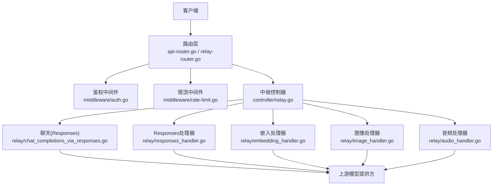
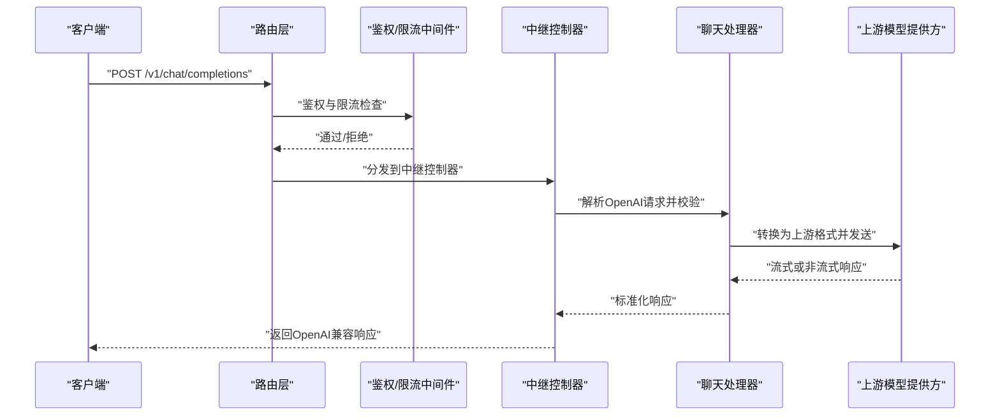
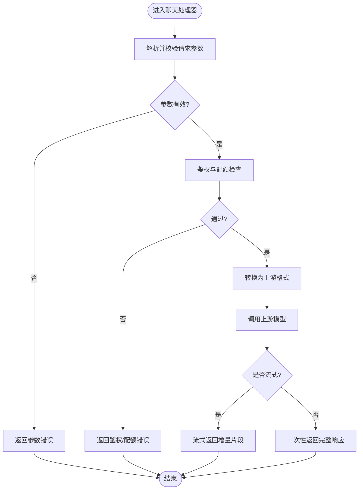
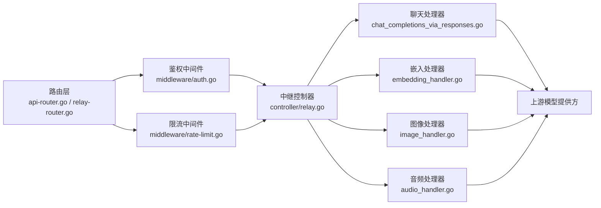

# OpenAI兼容API

<cite>
**本文引用的文件**   
- [main.go](file://main.go)
- [router/api-router.go](file://router/api-router.go)
- [router/relay-router.go](file://router/relay-router.go)
- [controller/relay.go](file://controller/relay.go)
- [relay/chat_completions_via_responses.go](file://relay/chat_completions_via_responses.go)
- [relay/responses_handler.go](file://relay/responses_handler.go)
- [relay/embedding_handler.go](file://relay/embedding_handler.go)
- [relay/image_handler.go](file://relay/image_handler.go)
- [relay/audio_handler.go](file://relay/audio_handler.go)
- [dto/openai_request.go](file://dto/openai_request.go)
- [dto/openai_response.go](file://dto/openai_response.go)
- [middleware/auth.go](file://middleware/auth.go)
- [middleware/rate-limit.go](file://middleware/rate-limit.go)
- [common/limiter/limiter.go](file://common/limiter/limiter.go)
- [setting/rate_limit.go](file://setting/rate_limit.go)
- [service/error.go](file://service/error.go)
- [constant/api_type.go](file://constant/api_type.go)
- [docs/openapi/relay.json](file://docs/openapi/relay.json)
</cite>

## 目录
1. [简介](#简介)
2. [项目结构](#项目结构)
3. [核心组件](#核心组件)
4. [架构总览](#架构总览)
5. [详细组件分析](#详细组件分析)
6. [依赖分析](#依赖分析)
7. [性能考虑](#性能考虑)
8. [故障排查指南](#故障排查指南)
9. [结论](#结论)
10. [附录](#附录)

## 简介
本文件为OpenAI兼容API的完整技术文档，覆盖聊天补全、图像生成、音频处理、嵌入等接口。内容包含HTTP方法、URL模式、请求/响应模式、认证方式与参数校验说明；提供流式响应处理、速率限制策略与安全注意事项；并给出客户端集成指南与最佳实践（重试机制、错误处理）。

## 项目结构
本项目采用“路由层 -> 控制器/处理器 -> 适配转发 -> 上游服务”的分层架构：
- 路由层负责统一入口与鉴权、限流等横切关注点
- 控制器/处理器负责OpenAI协议解析、参数校验与业务编排
- 适配转发层将请求转换为各上游模型提供方格式并调用
- DTO定义OpenAI兼容的请求与响应结构

图表来源
- [router/api-router.go](file://router/api-router.go)
- [router/relay-router.go](file://router/relay-router.go)
- [controller/relay.go](file://controller/relay.go)
- [middleware/auth.go](file://middleware/auth.go)
- [middleware/rate-limit.go](file://middleware/rate-limit.go)

章节来源
- [main.go](file://main.go)
- [router/api-router.go](file://router/api-router.go)
- [router/relay-router.go](file://router/relay-router.go)

## 核心组件
- 路由与入口
  - API路由注册与OpenAI兼容路径映射
  - 中继路由用于统一转发到不同能力处理器
- 控制器与处理器
  - 聊天补全（兼容OpenAI Responses与Chat Completions）
  - 嵌入（Embeddings）
  - 图像（Images）
  - 音频（Audio）
- 数据模型
  - OpenAI兼容请求/响应DTO
- 横切能力
  - 鉴权、限流、错误码标准化

章节来源
- [controller/relay.go](file://controller/relay.go)
- [relay/chat_completions_via_responses.go](file://relay/chat_completions_via_responses.go)
- [relay/responses_handler.go](file://relay/responses_handler.go)
- [relay/embedding_handler.go](file://relay/embedding_handler.go)
- [relay/image_handler.go](file://relay/image_handler.go)
- [relay/audio_handler.go](file://relay/audio_handler.go)
- [dto/openai_request.go](file://dto/openai_request.go)
- [dto/openai_response.go](file://dto/openai_response.go)

## 架构总览
下图展示一次OpenAI兼容聊天请求从客户端到上游模型的端到端流程，包括鉴权、限流、协议转换与流式返回。

图表来源
- [router/api-router.go](file://router/api-router.go)
- [router/relay-router.go](file://router/relay-router.go)
- [controller/relay.go](file://controller/relay.go)
- [middleware/auth.go](file://middleware/auth.go)
- [middleware/rate-limit.go](file://middleware/rate-limit.go)
- [relay/chat_completions_via_responses.go](file://relay/chat_completions_via_responses.go)

## 详细组件分析

### 聊天补全（Chat Completions / Responses）
- 端点与方法
  - POST /v1/chat/completions
  - POST /v1/responses（如启用Responses兼容）
- 认证
  - 使用Authorization: Bearer <token>
  - 支持多租户与密钥校验
- 请求体关键字段
  - model, messages, stream, temperature, max_tokens, top_p, frequency_penalty, presence_penalty, tools, tool_choice, response_format等
- 响应体关键字段
  - id, object, created, model, choices[].message.content, usage等
- 流式响应
  - 设置stream=true时，服务端以事件流形式返回增量片段
  - 客户端需按SSE或流式协议消费
- 典型错误
  - 401 未授权、403 权限不足、429 速率限制、500/502/503 上游错误

图表来源
- [relay/chat_completions_via_responses.go](file://relay/chat_completions_via_responses.go)
- [relay/responses_handler.go](file://relay/responses_handler.go)
- [dto/openai_request.go](file://dto/openai_request.go)
- [dto/openai_response.go](file://dto/openai_response.go)

章节来源
- [relay/chat_completions_via_responses.go](file://relay/chat_completions_via_responses.go)
- [relay/responses_handler.go](file://relay/responses_handler.go)
- [dto/openai_request.go](file://dto/openai_request.go)
- [dto/openai_response.go](file://dto/openai_response.go)

### 嵌入（Embeddings）
- 端点与方法
  - POST /v1/embeddings
- 请求体关键字段
  - model, input（字符串或数组）, encoding_format, dimensions（如支持）
- 响应体关键字段
  - data[].embedding, usage等
- 适用场景
  - 文本向量检索、相似度计算、语义搜索

章节来源
- [relay/embedding_handler.go](file://relay/embedding_handler.go)
- [dto/openai_request.go](file://dto/openai_request.go)
- [dto/openai_response.go](file://dto/openai_response.go)

### 图像（Images）
- 端点与方法
  - POST /v1/images/generations
- 请求体关键字段
  - model, prompt, n, size, response_format, style, user等
- 响应体关键字段
  - data[].url或data[].b64_json, usage等
- 注意
  - 大体积响应建议优先使用URL返回
  - 流式通常不支持图像生成

章节来源
- [relay/image_handler.go](file://relay/image_handler.go)
- [dto/openai_request.go](file://dto/openai_request.go)
- [dto/openai_response.go](file://dto/openai_response.go)

### 音频（Audio）
- 端点与方法
  - POST /v1/audio/transcriptions（转录）
  - POST /v1/audio/translations（翻译）
  - POST /v1/audio/speech（语音合成TTS）
- 请求体关键字段
  - model, file（上传文件或base64）、language、prompt、response_format、voice、speed等
- 响应体关键字段
  - text（转录/翻译）、audio（二进制或URL）等
- 注意
  - 文件上传大小限制与超时配置需合理设置

章节来源
- [relay/audio_handler.go](file://relay/audio_handler.go)
- [dto/openai_request.go](file://dto/openai_request.go)
- [dto/openai_response.go](file://dto/openai_response.go)

### 通用错误与状态码
- 常见状态码
  - 200 成功
  - 400 请求参数错误
  - 401 未授权（缺少或无效令牌）
  - 403 权限不足（模型不可用/配额不足）
  - 429 速率限制（触发限流）
  - 500/502/503 上游服务错误或网关异常
- 错误体结构
  - error.code, error.message, error.param, error.type等

章节来源
- [service/error.go](file://service/error.go)
- [dto/openai_response.go](file://dto/openai_response.go)

## 依赖分析
- 路由与中间件
  - 路由层统一挂载鉴权与限流中间件，确保所有OpenAI兼容端点受保护
- 控制器与处理器
  - 中继控制器根据路径分发至具体处理器（聊天、嵌入、图像、音频）
- 数据模型
  - OpenAI兼容DTO贯穿请求解析与响应标准化
- 外部依赖
  - 上游模型提供方（OpenAI、第三方等）

图表来源
- [router/api-router.go](file://router/api-router.go)
- [router/relay-router.go](file://router/relay-router.go)
- [controller/relay.go](file://controller/relay.go)
- [middleware/auth.go](file://middleware/auth.go)
- [middleware/rate-limit.go](file://middleware/rate-limit.go)
- [relay/chat_completions_via_responses.go](file://relay/chat_completions_via_responses.go)
- [relay/embedding_handler.go](file://relay/embedding_handler.go)
- [relay/image_handler.go](file://relay/image_handler.go)
- [relay/audio_handler.go](file://relay/audio_handler.go)

章节来源
- [constant/api_type.go](file://constant/api_type.go)

## 性能考虑
- 流式响应
  - 聊天补全支持流式输出，降低首字节延迟，提升交互体验
  - 客户端应实现增量拼接与错误恢复
- 缓存与复用
  - 对相同请求可考虑应用层缓存（如短文本摘要、固定模板）
- 并发与连接池
  - 上游调用应使用连接池与合理的超时/重试策略
- 资源限制
  - 合理设置请求体大小上限与响应超时，避免内存溢出
- 监控与指标
  - 记录QPS、P95/P99延迟、错误率与上游健康状态

[本节为通用指导，不直接分析具体文件]

## 故障排查指南
- 鉴权失败
  - 检查Authorization头是否正确携带Bearer令牌
  - 确认令牌未被禁用且具备所需模型权限
- 速率限制
  - 观察429响应，调整客户端重试退避策略
  - 检查全局与模型级限流配置
- 上游错误
  - 查看5xx错误日志，定位上游服务可用性
  - 必要时切换通道或降级模型
- 参数校验
  - 核对必填字段与类型约束，参考DTO定义
- 流式处理
  - 确保客户端正确解析SSE事件，处理断连重连

章节来源
- [middleware/auth.go](file://middleware/auth.go)
- [middleware/rate-limit.go](file://middleware/rate-limit.go)
- [common/limiter/limiter.go](file://common/limiter/limiter.go)
- [setting/rate_limit.go](file://setting/rate_limit.go)
- [service/error.go](file://service/error.go)

## 结论
本OpenAI兼容API通过统一路由与中间件保障安全与稳定性，借助处理器与DTO实现协议标准化，并以适配器对接多种上游模型。建议客户端遵循流式处理、指数退避重试与完善的错误处理策略，以获得稳定高效的集成体验。

[本节为总结性内容，不直接分析具体文件]

## 附录

### 端点清单与示例
- 聊天补全
  - POST /v1/chat/completions
  - 请求示例（JSON）
    - {
        "model": "gpt-4o",
        "messages": [{"role":"user","content":"你好"}],
        "stream": false,
        "temperature": 0.7,
        "max_tokens": 512
      }
  - 响应示例（JSON）
    - {
        "id": "chatcmpl-xxx",
        "object": "chat.completion",
        "created": 1710000000,
        "model": "gpt-4o",
        "choices": [{"index":0,"message":{"role":"assistant","content":"你好！有什么可以帮你的？"},"finish_reason":"stop"}],
        "usage": {"prompt_tokens":10,"completion_tokens":20,"total_tokens":30}
      }
- 嵌入
  - POST /v1/embeddings
  - 请求示例（JSON）
    - {
        "model": "text-embedding-ada-002",
        "input": ["这是一段测试文本"],
        "encoding_format": "float"
      }
  - 响应示例（JSON）
    - {
        "data":[{"object":"embedding","embedding":[...],"index":0}],
        "usage":{"prompt_tokens":8,"total_tokens":8}
      }
- 图像生成
  - POST /v1/images/generations
  - 请求示例（JSON）
    - {
        "model": "dall-e-3",
        "prompt": "一只在草地上奔跑的金毛犬",
        "n": 1,
        "size": "1024x1024",
        "response_format": "url"
      }
  - 响应示例（JSON）
    - {
        "data":[{"url":"https://...","index":0}],
        "usage":{"prompt_tokens":10,"completion_tokens":0,"total_tokens":10}
      }
- 音频转录
  - POST /v1/audio/transcriptions
  - 请求示例（multipart/form-data）
    - model=whisper-1, file=<音频文件>, language=zh
  - 响应示例（JSON）
    - {
        "text": "这是一段转录结果"
      }

[本节为概念性示例，不直接分析具体文件]

### 认证与授权
- 认证方式
  - Authorization: Bearer <token>
- 授权范围
  - 基于令牌与模型权限控制，支持分组与配额管理
- 安全建议
  - 最小权限原则、定期轮换令牌、HTTPS传输

章节来源
- [middleware/auth.go](file://middleware/auth.go)
- [constant/api_type.go](file://constant/api_type.go)

### 速率限制策略
- 策略维度
  - 全局限流、用户/令牌级限流、模型级限流
- 配置项
  - 窗口时间、最大请求数、突发阈值
- 客户端行为
  - 遇到429时实施指数退避与重试上限

章节来源
- [middleware/rate-limit.go](file://middleware/rate-limit.go)
- [common/limiter/limiter.go](file://common/limiter/limiter.go)
- [setting/rate_limit.go](file://setting/rate_limit.go)

### 流式响应处理
- 协议
  - SSE（Server-Sent Events）
- 客户端要点
  - 逐条解析事件、合并增量内容、处理中断与错误
- 服务端要点
  - 保持长连接、及时刷新缓冲、优雅关闭

章节来源
- [relay/chat_completions_via_responses.go](file://relay/chat_completions_via_responses.go)
- [relay/responses_handler.go](file://relay/responses_handler.go)

### 客户端集成指南与最佳实践
- 重试机制
  - 指数退避、幂等性判断、最大重试次数
- 错误处理
  - 区分网络错误、鉴权错误、业务错误与上游错误
- 性能优化
  - 连接复用、批量请求（如嵌入）、合理超时
- 监控与日志
  - 记录关键指标与错误堆栈，便于定位问题

[本节为通用指导，不直接分析具体文件]

### OpenAPI规范
- 提供OpenAI兼容接口的OpenAPI描述文件，便于自动生成客户端代码与文档

章节来源
- [docs/openapi/relay.json](file://docs/openapi/relay.json)