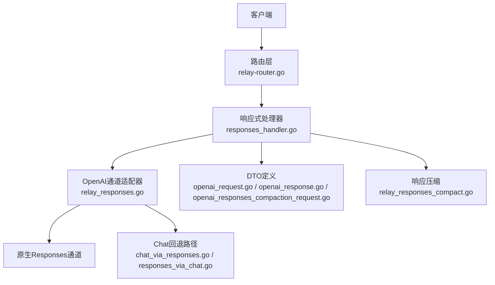
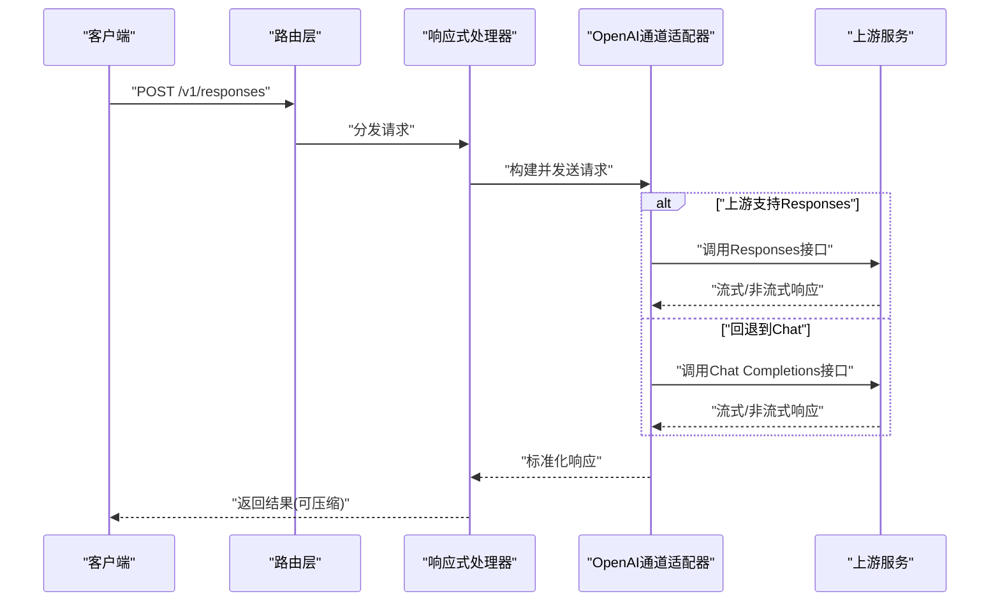
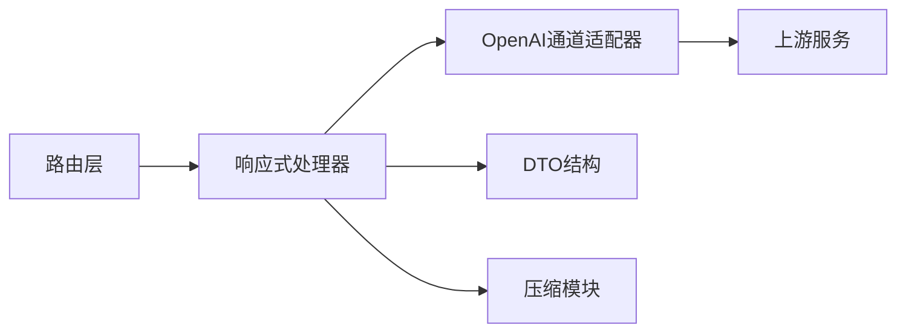

# Responses API

<cite>
**本文引用的文件**   
- [responses_handler.go](file://relay/responses_handler.go)
- [relay_responses.go](file://relay/channel/openai/relay_responses.go)
- [chat_via_responses.go](file://relay/channel/openai/chat_via_responses.go)
- [responses_via_chat.go](file://relay/channel/openai/responses_via_chat.go)
- [relay_responses_compact.go](file://relay/channel/openai/relay_responses_compact.go)
- [openai_request.go](file://dto/openai_request.go)
- [openai_response.go](file://dto/openai_response.go)
- [openai_responses_compaction_request.go](file://dto/openai_responses_compaction_request.go)
- [relay-router.go](file://router/relay-router.go)
- [api.json](file://docs/openapi/api.json)
- [relay.json](file://docs/openapi/relay.json)
</cite>

## 目录
1. [简介](#简介)
2. [项目结构](#项目结构)
3. [核心组件](#核心组件)
4. [架构总览](#架构总览)
5. [详细组件分析](#详细组件分析)
6. [依赖关系分析](#依赖关系分析)
7. [性能考量](#性能考量)
8. [故障排除指南](#故障排除指南)
9. [结论](#结论)
10. [附录](#附录)

## 简介
本文件为Responses API的完整技术文档，面向开发者与集成方。内容涵盖：
- Responses API与传统聊天补全（Chat Completions）的区别与优势
- 请求格式规范（消息类型、工具调用、函数执行等）
- 响应压缩、增量更新与状态管理
- 与传统API的迁移指南与兼容性说明
- 最佳实践、性能对比与故障排除建议
- 支持的模型与功能特性

Responses API在本项目中通过统一的转发层实现，既可直接对接支持Responses的原生通道，也可在需要时回退到Chat Completions模式，从而兼顾能力与兼容性。

## 项目结构
- 路由层负责将 /v1/responses 请求分发至处理逻辑
- 响应式处理器统一解析请求、编排下游通道、处理流式与非流式响应
- OpenAI通道适配器提供原生Responses支持与Chat回退路径
- DTO定义请求/响应结构与压缩相关字段
- OpenAPI文档提供接口契约参考

图表来源
- [relay-router.go](file://router/relay-router.go)
- [responses_handler.go](file://relay/responses_handler.go)
- [relay_responses.go](file://relay/channel/openai/relay_responses.go)
- [chat_via_responses.go](file://relay/channel/openai/chat_via_responses.go)
- [responses_via_chat.go](file://relay/channel/openai/responses_via_chat.go)
- [relay_responses_compact.go](file://relay/channel/openai/relay_responses_compact.go)
- [openai_request.go](file://dto/openai_request.go)
- [openai_response.go](file://dto/openai_response.go)
- [openai_responses_compaction_request.go](file://dto/openai_responses_compaction_request.go)

章节来源
- [relay-router.go](file://router/relay-router.go)
- [responses_handler.go](file://relay/responses_handler.go)
- [relay_responses.go](file://relay/channel/openai/relay_responses.go)
- [openai_request.go](file://dto/openai_request.go)
- [openai_response.go](file://dto/openai_response.go)
- [openai_responses_compaction_request.go](file://dto/openai_responses_compaction_request.go)

## 核心组件
- 响应式处理器：统一接收 /v1/responses 请求，校验参数、选择通道、处理流式与非流式响应、统计用量
- OpenAI通道适配器：封装对上游Responses接口的调用，并具备回退到Chat Completions的能力
- 压缩模块：根据请求配置对响应进行压缩或合并，减少传输与渲染开销
- DTO结构体：定义消息、工具、函数、压缩选项等数据结构

章节来源
- [responses_handler.go](file://relay/responses_handler.go)
- [relay_responses.go](file://relay/channel/openai/relay_responses.go)
- [relay_responses_compact.go](file://relay/channel/openai/relay_responses_compact.go)
- [openai_request.go](file://dto/openai_request.go)
- [openai_response.go](file://dto/openai_response.go)
- [openai_responses_compaction_request.go](file://dto/openai_responses_compaction_request.go)

## 架构总览
Responses API的整体流程如下：
- 客户端发起 /v1/responses 请求
- 路由层识别并转发至响应式处理器
- 处理器解析请求，选择OpenAI通道适配器
- 若上游支持Responses则直接调用；否则回退到Chat Completions路径
- 响应按是否启用压缩进行处理，并以流式或非流式返回
- 最终返回给客户端，同时记录用量与审计信息

图表来源
- [relay-router.go](file://router/relay-router.go)
- [responses_handler.go](file://relay/responses_handler.go)
- [relay_responses.go](file://relay/channel/openai/relay_responses.go)
- [chat_via_responses.go](file://relay/channel/openai/chat_via_responses.go)
- [responses_via_chat.go](file://relay/channel/openai/responses_via_chat.go)

## 详细组件分析

### 响应式处理器（responses_handler.go）
职责与要点：
- 解析 /v1/responses 请求体，校验必填字段与参数范围
- 选择下游通道（优先Responses，必要时回退Chat）
- 处理流式与非流式响应，维护会话上下文与状态
- 应用响应压缩策略，控制输出大小与延迟
- 统计用量、记录审计日志、错误码规范化

关键流程（简化）：
- 输入校验 → 通道选择 → 调用下游 → 响应转换 → 压缩 → 返回

章节来源
- [responses_handler.go](file://relay/responses_handler.go)

### OpenAI通道适配器（relay_responses.go）
职责与要点：
- 封装对上游Responses接口的调用
- 处理流式事件、错误重试、超时控制
- 当上游不支持Responses时，自动切换到Chat Completions路径
- 统一返回结构，屏蔽上游差异

章节来源
- [relay_responses.go](file://relay/channel/openai/relay_responses.go)

### Chat回退路径（chat_via_responses.go / responses_via_chat.go）
职责与要点：
- chat_via_responses：将Responses语义映射为Chat Completions请求
- responses_via_chat：将Chat Completions响应转换为Responses语义
- 保证功能一致性，确保工具调用、函数执行等行为对齐

章节来源
- [chat_via_responses.go](file://relay/channel/openai/chat_via_responses.go)
- [responses_via_chat.go](file://relay/channel/openai/responses_via_chat.go)

### 响应压缩（relay_responses_compact.go）
职责与要点：
- 根据请求中的压缩选项，对响应进行合并、去重、摘要
- 支持增量更新场景下的压缩策略，降低带宽与渲染压力
- 保持语义完整性，避免丢失关键状态信息

章节来源
- [relay_responses_compact.go](file://relay/channel/openai/relay_responses_compact.go)

### DTO结构（openai_request.go / openai_response.go / openai_responses_compaction_request.go）
职责与要点：
- 定义消息类型（文本、图像、音频等）、工具定义、函数调用参数
- 定义Responses请求与响应的字段，包括压缩选项、状态字段
- 明确各字段的类型、可选性与默认值

章节来源
- [openai_request.go](file://dto/openai_request.go)
- [openai_response.go](file://dto/openai_response.go)
- [openai_responses_compaction_request.go](file://dto/openai_responses_compaction_request.go)

### 路由与OpenAPI（relay-router.go / api.json / relay.json）
职责与要点：
- 路由注册 /v1/responses 端点，绑定处理器
- OpenAPI文档描述接口契约、参数、响应结构
- 便于生成客户端SDK与自动化测试

章节来源
- [relay-router.go](file://router/relay-router.go)
- [api.json](file://docs/openapi/api.json)
- [relay.json](file://docs/openapi/relay.json)

## 依赖关系分析
Responses API的关键依赖关系如下：
- 路由层依赖响应式处理器
- 响应式处理器依赖OpenAI通道适配器与DTO
- OpenAI通道适配器依赖上游Responses或Chat Completions
- 压缩模块依赖DTO中的压缩配置

图表来源
- [relay-router.go](file://router/relay-router.go)
- [responses_handler.go](file://relay/responses_handler.go)
- [relay_responses.go](file://relay/channel/openai/relay_responses.go)
- [relay_responses_compact.go](file://relay/channel/openai/relay_responses_compact.go)
- [openai_request.go](file://dto/openai_request.go)
- [openai_response.go](file://dto/openai_response.go)
- [openai_responses_compaction_request.go](file://dto/openai_responses_compaction_request.go)

章节来源
- [relay-router.go](file://router/relay-router.go)
- [responses_handler.go](file://relay/responses_handler.go)
- [relay_responses.go](file://relay/channel/openai/relay_responses.go)
- [relay_responses_compact.go](file://relay/channel/openai/relay_responses_compact.go)
- [openai_request.go](file://dto/openai_request.go)
- [openai_response.go](file://dto/openai_response.go)
- [openai_responses_compaction_request.go](file://dto/openai_responses_compaction_request.go)

## 性能考量
- 流式传输：优先使用流式响应以降低首字节延迟
- 响应压缩：在长对话或多轮交互中启用压缩以减少带宽
- 回退路径：当上游不支持Responses时，自动回退到Chat，避免阻塞
- 缓存与限流：结合系统级限流与缓存策略提升吞吐
- 资源隔离：不同通道与任务间隔离，避免相互影响

[本节为通用指导，不直接分析具体文件]

## 故障排除指南
常见问题与排查步骤：
- 请求参数错误：检查消息类型、工具定义、函数参数是否符合DTO规范
- 上游不可用：确认上游Responses接口可用性，必要时启用Chat回退
- 流式中断：检查网络稳定性与超时配置，增加重试机制
- 压缩异常：验证压缩选项与响应长度，避免过度压缩导致数据丢失
- 权限与鉴权：确认令牌有效且具备相应模型访问权限

章节来源
- [responses_handler.go](file://relay/responses_handler.go)
- [relay_responses.go](file://relay/channel/openai/relay_responses.go)
- [relay_responses_compact.go](file://relay/channel/openai/relay_responses_compact.go)
- [openai_request.go](file://dto/openai_request.go)
- [openai_response.go](file://dto/openai_response.go)
- [openai_responses_compaction_request.go](file://dto/openai_responses_compaction_request.go)

## 结论
Responses API在本项目中实现了统一、可扩展的响应式接口，既能充分利用上游Responses能力，又能在必要时回退到Chat Completions以保证兼容性与可用性。通过响应压缩、流式传输与完善的错误处理，系统在性能与稳定性方面具备良好表现。建议在生产环境中启用压缩与监控，并结合OpenAPI文档进行自动化测试与持续集成。

[本节为总结性内容，不直接分析具体文件]

## 附录

### 与传统聊天补全的区别与优势
- 语义更丰富：Responses API提供更丰富的消息类型与结构化输出
- 工具调用更完善：原生支持工具定义与函数执行，便于扩展能力
- 增量更新更友好：流式与压缩策略更适合实时交互场景
- 兼容性更强：自动回退到Chat Completions，保障跨模型可用

章节来源
- [responses_handler.go](file://relay/responses_handler.go)
- [relay_responses.go](file://relay/channel/openai/relay_responses.go)
- [chat_via_responses.go](file://relay/channel/openai/chat_via_responses.go)
- [responses_via_chat.go](file://relay/channel/openai/responses_via_chat.go)

### 请求格式规范（消息类型、工具调用、函数执行）
- 消息类型：文本、图像、音频等多模态消息
- 工具定义：声明外部工具与函数，供模型调用
- 函数执行：模型触发函数后，服务端执行并回填结果
- 压缩选项：控制响应压缩策略，平衡带宽与延迟

章节来源
- [openai_request.go](file://dto/openai_request.go)
- [openai_response.go](file://dto/openai_response.go)
- [openai_responses_compaction_request.go](file://dto/openai_responses_compaction_request.go)

### 响应压缩、增量更新与状态管理
- 响应压缩：按需合并与摘要，减少传输量
- 增量更新：流式事件逐步推送，提升用户体验
- 状态管理：维护会话上下文，确保多轮对话一致性

章节来源
- [relay_responses_compact.go](file://relay/channel/openai/relay_responses_compact.go)
- [responses_handler.go](file://relay/responses_handler.go)

### 与传统API的迁移指南与兼容性说明
- 优先使用Responses API以获得更好体验
- 在不支持Responses的上游自动回退到Chat Completions
- 注意字段映射与行为差异，必要时调整客户端逻辑

章节来源
- [chat_via_responses.go](file://relay/channel/openai/chat_via_responses.go)
- [responses_via_chat.go](file://relay/channel/openai/responses_via_chat.go)

### 最佳实践与性能对比
- 启用流式响应与压缩以提升性能
- 合理设置超时与重试策略
- 监控上游可用性并动态切换路径

[本节为通用指导，不直接分析具体文件]

### 支持的模型与功能特性
- 支持的模型：依据上游通道能力决定
- 功能特性：多模态消息、工具调用、函数执行、流式响应、压缩

章节来源
- [relay_responses.go](file://relay/channel/openai/relay_responses.go)
- [openai_request.go](file://dto/openai_request.go)
- [openai_response.go](file://dto/openai_response.go)