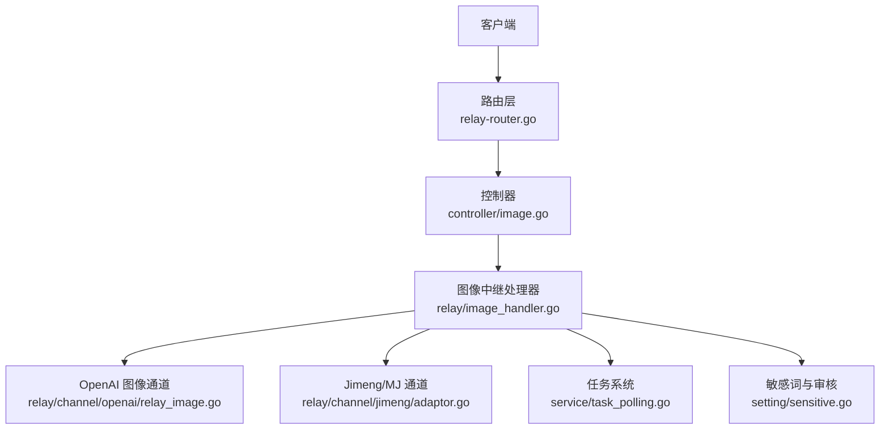
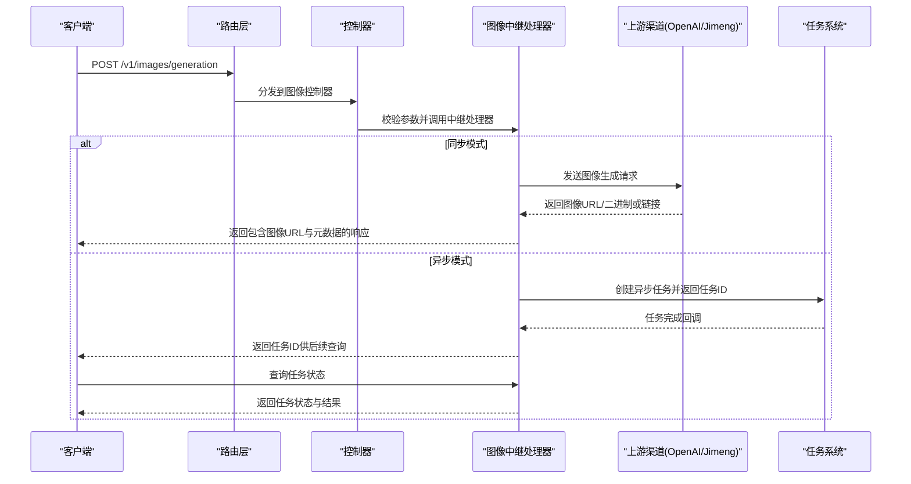
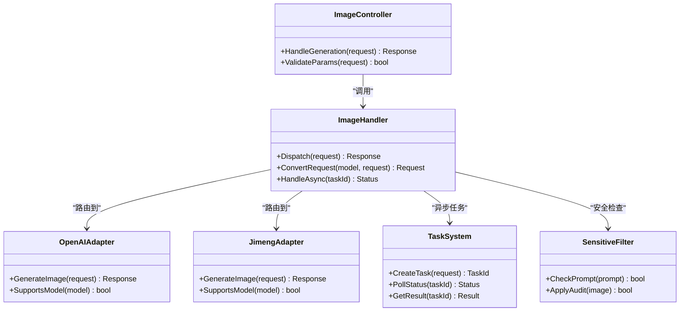

# 图像生成接口

<cite>
**本文引用的文件**   
- [controller/image.go](file://controller/image.go)
- [dto/openai_image.go](file://dto/openai_image.go)
- [relay/image_handler.go](file://relay/image_handler.go)
- [router/relay-router.go](file://router/relay-router.go)
- [setting/sensitive.go](file://setting/sensitive.go)
- [service/task_polling.go](file://service/task_polling.go)
- [constant/midjourney.go](file://constant/midjourney.go)
- [relay/channel/jimeng/adaptor.go](file://relay/channel/jimeng/adaptor.go)
- [relay/channel/openai/relay_image.go](file://relay/channel/openai/relay_image.go)
</cite>

## 目录
1. [简介](#简介)
2. [项目结构](#项目结构)
3. [核心组件](#核心组件)
4. [架构总览](#架构总览)
5. [详细组件分析](#详细组件分析)
6. [依赖关系分析](#依赖关系分析)
7. [性能考虑](#性能考虑)
8. [故障排查指南](#故障排查指南)
9. [结论](#结论)
10. [附录](#附录)

## 简介
本文件为“图像生成接口”的权威API文档，聚焦于POST /v1/images/generation端点。内容涵盖：
- 请求格式：提示词prompt、尺寸、数量、风格等参数说明
- 响应格式：生成的图像URL、元数据与使用统计
- 多模型调用示例：DALL-E、Midjourney等
- 异步任务处理、状态查询与错误处理机制
- 安全过滤、内容审核与版权保护相关配置

该接口通过统一的OpenAI兼容路径对外暴露，内部根据模型路由到不同渠道（如OpenAI、Jimeng/Midjourney等），并支持同步与异步两种模式。

## 项目结构
与图像生成相关的代码主要分布在以下模块：
- 控制器层：接收HTTP请求，校验参数，委派给服务层
- DTO定义：统一请求/响应数据结构
- 中继处理器：将请求适配到具体上游渠道
- 路由注册：将/v1/images/generation映射到对应处理器
- 设置与安全：敏感词过滤、内容审核策略
- 任务系统：异步任务创建、轮询与状态更新

**图表来源** 
- [router/relay-router.go](file://router/relay-router.go)
- [controller/image.go](file://controller/image.go)
- [relay/image_handler.go](file://relay/image_handler.go)
- [relay/channel/openai/relay_image.go](file://relay/channel/openai/relay_image.go)
- [relay/channel/jimeng/adaptor.go](file://relay/channel/jimeng/adaptor.go)
- [service/task_polling.go](file://service/task_polling.go)
- [setting/sensitive.go](file://setting/sensitive.go)

**章节来源**
- [router/relay-router.go](file://router/relay-router.go)
- [controller/image.go](file://controller/image.go)
- [relay/image_handler.go](file://relay/image_handler.go)

## 核心组件
- 控制器image.go：解析请求体、鉴权、限流、参数校验，并转发至中继处理器
- 中继处理器image_handler.go：选择目标渠道、转换请求、处理同步/异步返回
- DTO openai_image.go：定义图像生成请求/响应的字段与约束
- 渠道适配器：OpenAI与Jimeng/Midjourney的具体实现
- 任务系统：异步任务的创建、轮询、结果回写
- 安全设置：敏感词过滤、内容审核开关与策略

**章节来源**
- [controller/image.go](file://controller/image.go)
- [relay/image_handler.go](file://relay/image_handler.go)
- [dto/openai_image.go](file://dto/openai_image.go)
- [relay/channel/openai/relay_image.go](file://relay/channel/openai/relay_image.go)
- [relay/channel/jimeng/adaptor.go](file://relay/channel/jimeng/adaptor.go)
- [service/task_polling.go](file://service/task_polling.go)
- [setting/sensitive.go](file://setting/sensitive.go)

## 架构总览
下图展示了从客户端发起图像生成请求到最终返回结果的完整流程，包括同步直返与异步任务两种路径。

**图表来源** 
- [router/relay-router.go](file://router/relay-router.go)
- [controller/image.go](file://controller/image.go)
- [relay/image_handler.go](file://relay/image_handler.go)
- [relay/channel/openai/relay_image.go](file://relay/channel/openai/relay_image.go)
- [relay/channel/jimeng/adaptor.go](file://relay/channel/jimeng/adaptor.go)
- [service/task_polling.go](file://service/task_polling.go)

## 详细组件分析

### 端点定义与路由
- 端点：POST /v1/images/generation
- 路由注册位置：relay-router.go中注册图像生成路由
- 控制器：controller/image.go负责请求解析与校验
- 中继处理器：relay/image_handler.go负责渠道选择与请求转换

**章节来源**
- [router/relay-router.go](file://router/relay-router.go)
- [controller/image.go](file://controller/image.go)
- [relay/image_handler.go](file://relay/image_handler.go)

### 请求格式（POST /v1/images/generation）
以下为通用请求字段说明（基于OpenAI兼容格式，具体以DTO定义为准）：
- model: 字符串，指定使用的图像生成模型（如dall-e-3、mj-v6等）
- prompt: 字符串，图像描述提示词（必填）
- n: 整数，生成图像数量（默认1）
- size: 字符串，图像尺寸（如1024x1024、1024x1792等）
- style: 字符串，风格参数（如vivid、natural等，取决于模型）
- quality: 字符串，质量等级（如standard、hd）
- response_format: 字符串，返回格式（url或b64_json）
- user: 字符串，可选的用户标识，用于计费与审计
- extra: 对象，扩展字段，可包含特定渠道的参数（如Midjourney的seed、aspect等）

注意：
- 不同模型的可用参数存在差异，请根据所选model参考相应渠道文档
- 部分渠道可能要求额外的认证或签名参数，需按渠道适配器要求提供

**章节来源**
- [dto/openai_image.go](file://dto/openai_image.go)
- [relay/channel/openai/relay_image.go](file://relay/channel/openai/relay_image.go)
- [relay/channel/jimeng/adaptor.go](file://relay/channel/jimeng/adaptor.go)

### 响应格式
成功响应通常包含：
- data: 数组，每个元素代表一张生成的图像
  - url: 字符串，图像访问链接（当response_format=url时）
  - b64_json: 字符串，Base64编码的图像数据（当response_format=b64_json时）
  - metadata: 对象，包含生成元数据（如model、size、style、seed等）
- usage: 对象，使用统计信息（如请求数、图像数、token消耗等）
- id: 字符串，请求唯一标识
- created: 时间戳，请求创建时间

失败响应遵循标准错误格式，包含error.code与error.message。

**章节来源**
- [dto/openai_image.go](file://dto/openai_image.go)
- [relay/image_handler.go](file://relay/image_handler.go)

### 多模型调用示例
- DALL-E（OpenAI）
  - model: dall-e-3
  - 常用参数：prompt、n、size、quality、response_format
  - 特点：高质量写实与艺术风格，支持多种尺寸
- Midjourney（Jimeng/MJ）
  - model: mj-v6或对应版本
  - 常用参数：prompt、n、size、style、seed、aspect
  - 特点：强艺术风格，适合创意与概念图

示例请求（JSON）：
{
  "model": "dall-e-3",
  "prompt": "一只在夕阳下奔跑的金毛犬，电影感光影",
  "n": 1,
  "size": "1024x1024",
  "quality": "standard",
  "response_format": "url"
}

**章节来源**
- [relay/channel/openai/relay_image.go](file://relay/channel/openai/relay_image.go)
- [relay/channel/jimeng/adaptor.go](file://relay/channel/jimeng/adaptor.go)
- [constant/midjourney.go](file://constant/midjourney.go)

### 异步任务处理
对于耗时较长的生成任务（如Midjourney），系统采用异步模式：
- 请求返回任务ID（task_id）
- 客户端通过任务ID查询状态与结果
- 任务完成后，服务端推送或客户端轮询获取结果

状态码说明：
- pending: 任务排队中
- processing: 任务处理中
- completed: 任务完成
- failed: 任务失败

**章节来源**
- [service/task_polling.go](file://service/task_polling.go)
- [relay/image_handler.go](file://relay/image_handler.go)

### 错误处理机制
常见错误类型：
- 参数校验错误：缺少必填字段、参数值非法
- 渠道调用失败：上游服务不可用、配额不足、网络异常
- 内容审核拦截：触发敏感词或违规内容
- 异步任务失败：任务超时、上游返回错误

错误响应格式：
{
  "error": {
    "code": "INVALID_REQUEST",
    "message": "提示词为空"
  }
}

**章节来源**
- [relay/image_handler.go](file://relay/image_handler.go)
- [setting/sensitive.go](file://setting/sensitive.go)

### 安全过滤与内容审核
- 敏感词过滤：启用后可自动检测并拦截违规提示词
- 内容审核：结合外部审核服务进行图像内容审查
- 版权保护：支持水印添加、来源标记、使用限制等策略

配置项建议：
- sensitive.enabled: 是否启用敏感词过滤
- audit.enabled: 是否启用内容审核
- watermark.enabled: 是否启用图像水印
- copyright.restrict: 版权限制策略（如禁止商用）

**章节来源**
- [setting/sensitive.go](file://setting/sensitive.go)

## 依赖关系分析
图像生成接口的依赖关系如下：
- 控制器依赖DTO进行参数绑定与校验
- 中继处理器依赖渠道适配器进行请求转换与响应处理
- 任务系统依赖持久化存储与消息队列
- 安全模块依赖配置中心与外部审核服务

**图表来源** 
- [controller/image.go](file://controller/image.go)
- [relay/image_handler.go](file://relay/image_handler.go)
- [relay/channel/openai/relay_image.go](file://relay/channel/openai/relay_image.go)
- [relay/channel/jimeng/adaptor.go](file://relay/channel/jimeng/adaptor.go)
- [service/task_polling.go](file://service/task_polling.go)
- [setting/sensitive.go](file://setting/sensitive.go)

**章节来源**
- [controller/image.go](file://controller/image.go)
- [relay/image_handler.go](file://relay/image_handler.go)
- [relay/channel/openai/relay_image.go](file://relay/channel/openai/relay_image.go)
- [relay/channel/jimeng/adaptor.go](file://relay/channel/jimeng/adaptor.go)
- [service/task_polling.go](file://service/task_polling.go)
- [setting/sensitive.go](file://setting/sensitive.go)

## 性能考虑
- 连接池管理：合理配置上游渠道的连接池大小，避免资源耗尽
- 缓存策略：对相同参数的请求进行缓存，减少重复计算
- 异步处理：长耗时任务采用异步模式，提升吞吐量
- 限流控制：对用户和模型级别进行限流，防止滥用
- 监控告警：关键指标监控（成功率、延迟、错误率）与告警

## 故障排查指南
常见问题与解决方案：
- 参数错误：检查必填字段与参数格式
- 渠道不可用：确认上游服务状态与认证配置
- 内容审核拦截：调整提示词或关闭敏感词过滤测试
- 异步任务失败：查看任务日志与上游返回错误
- 性能问题：检查连接池、缓存命中率与限流配置

调试建议：
- 启用详细日志记录
- 使用测试工具模拟请求
- 逐步排查各组件状态

**章节来源**
- [relay/image_handler.go](file://relay/image_handler.go)
- [service/task_polling.go](file://service/task_polling.go)
- [setting/sensitive.go](file://setting/sensitive.go)

## 结论
图像生成接口提供了统一的OpenAI兼容API，支持多种模型与灵活的参数配置。通过异步任务机制与完善的安全策略，能够满足不同场景下的图像生成需求。建议在生产环境中合理配置限流、缓存与监控，确保系统的稳定性与性能。

## 附录
- 相关常量定义：midjourney.go中的模型常量
- 渠道适配器实现：openai与jimeng的具体逻辑
- 任务系统接口：task_polling.go中的任务管理方法

**章节来源**
- [constant/midjourney.go](file://constant/midjourney.go)
- [relay/channel/openai/relay_image.go](file://relay/channel/openai/relay_image.go)
- [relay/channel/jimeng/adaptor.go](file://relay/channel/jimeng/adaptor.go)
- [service/task_polling.go](file://service/task_polling.go)