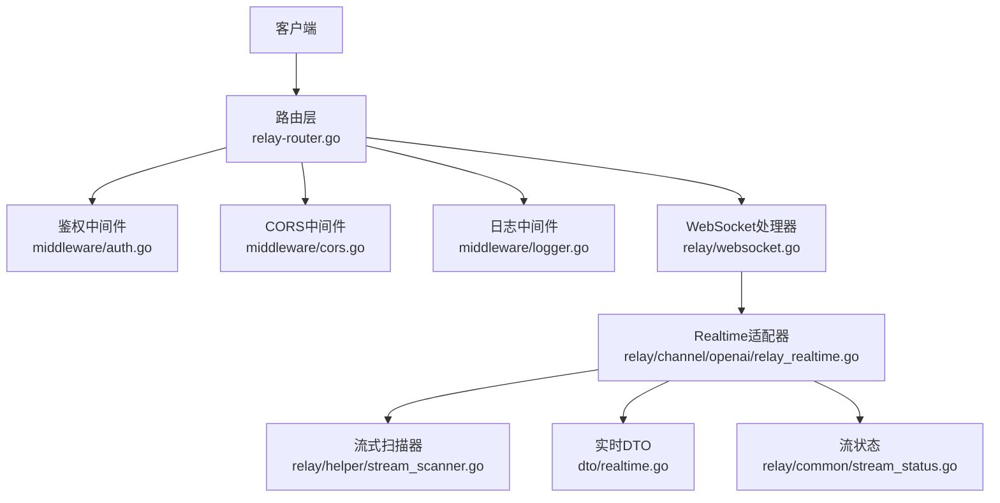
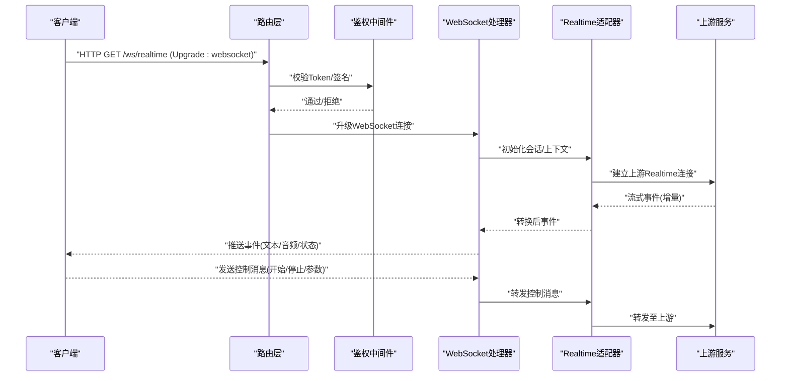
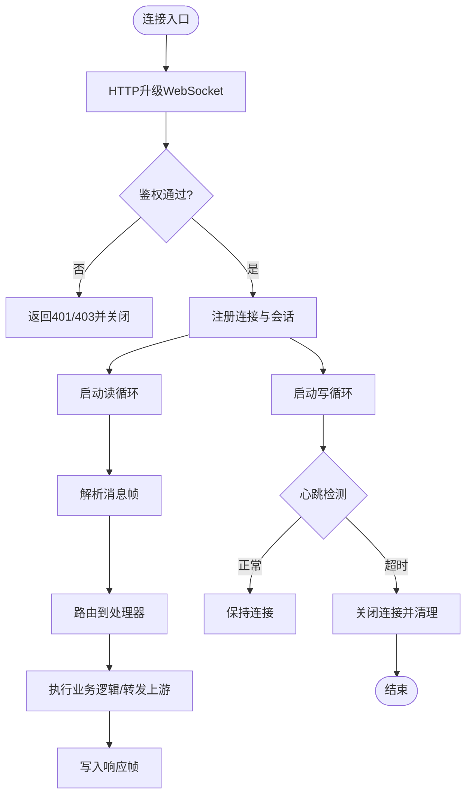
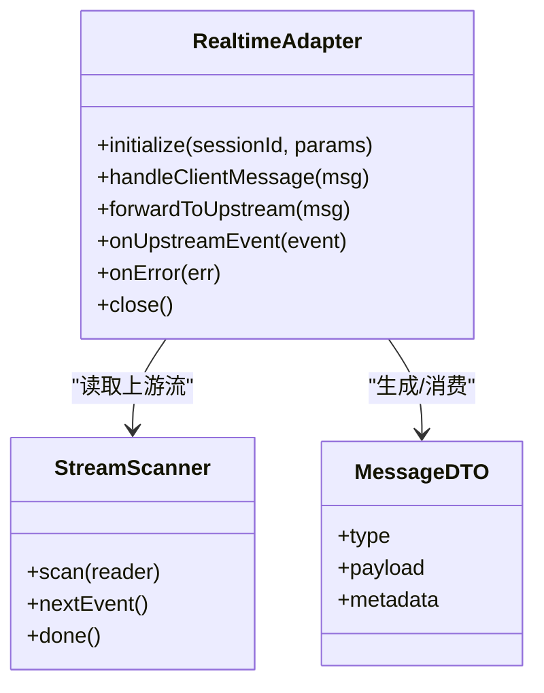
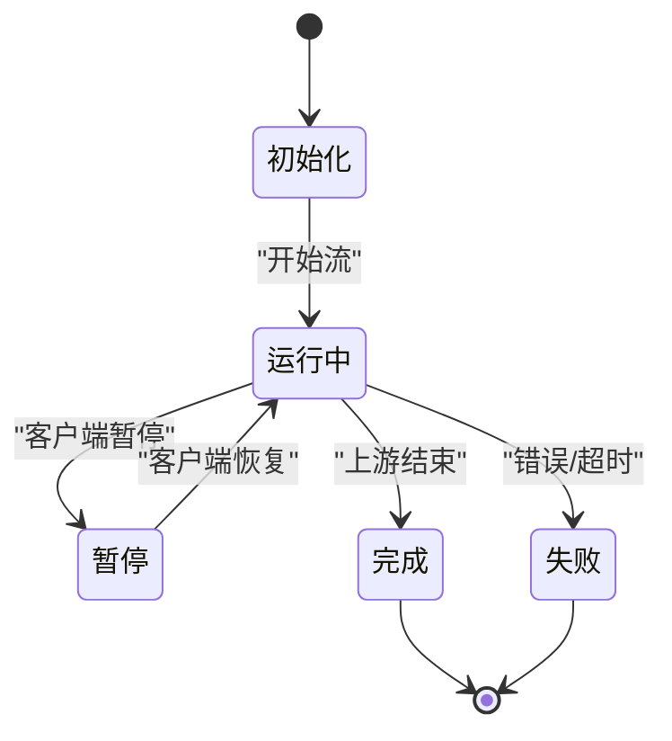
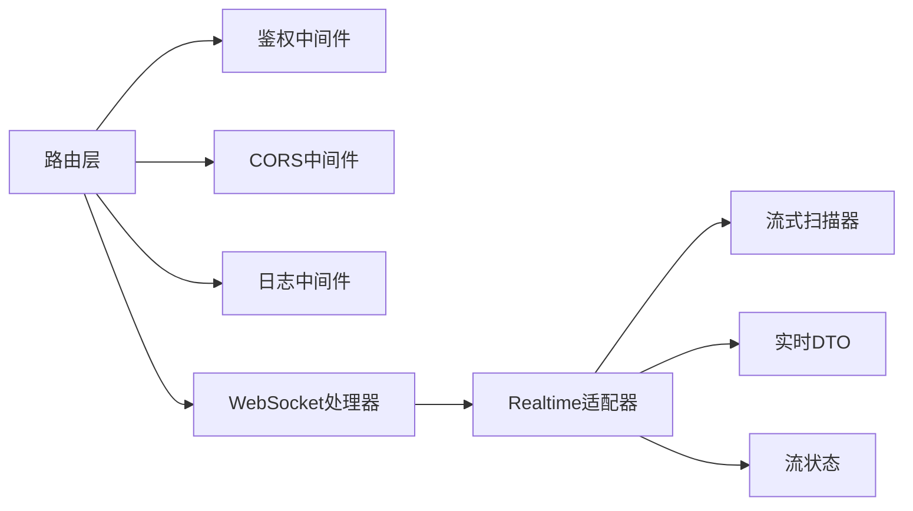

# 实时通信接口

<cite>
**本文引用的文件**   
- [main.go](file://main.go)
- [relay-router.go](file://router/relay-router.go)
- [websocket.go](file://relay/websocket.go)
- [relay_realtime.go](file://relay/channel/openai/relay_realtime.go)
- [realtime.go](file://dto/realtime.go)
- [stream_scanner.go](file://relay/helper/stream_scanner.go)
- [stream_status.go](file://relay/common/stream_status.go)
- [performance_config.go](file://common/performance_config.go)
- [rate-limit.go](file://common/rate-limit.go)
- [auth.go](file://middleware/auth.go)
- [cors.go](file://middleware/cors.go)
- [logger.go](file://middleware/logger.go)
- [go.mod](file://go.mod)
</cite>

## 目录
1. [简介](#简介)
2. [项目结构](#项目结构)
3. [核心组件](#核心组件)
4. [架构总览](#架构总览)
5. [详细组件分析](#详细组件分析)
6. [依赖关系分析](#依赖关系分析)
7. [性能与并发](#性能与并发)
8. [故障排查指南](#故障排查指南)
9. [结论](#结论)
10. [附录：客户端集成示例](#附录客户端集成示例)

## 简介
本文件为“实时通信接口”的权威API文档，聚焦WebSocket连接建立、消息格式、事件处理、实时对话与流式传输、双向通信机制、连接管理（心跳检测与重连策略）、错误处理、超时控制与资源清理，以及性能优化、并发处理与负载均衡配置。内容基于代码库中的路由、中间件、WebSocket实现、OpenAI Realtime通道适配与通用流式扫描器进行系统化梳理，帮助开发者快速、正确地集成与运维。

## 项目结构
与实时通信相关的关键路径与职责如下：
- 路由层：统一注册WebSocket与REST接口，鉴权与CORS等中间件挂载
- WebSocket层：连接生命周期管理、消息收发、心跳与重连支持
- 通道适配层：以OpenAI Realtime为例，将上游协议转换为内部统一模型
- DTO与常量：定义实时消息结构与状态码
- 流式处理：通用流式扫描器用于增量解析与转发
- 中间件：鉴权、限流、日志、CORS等横切关注点
- 配置与监控：性能参数、速率限制、系统指标

**图表来源** 
- [relay-router.go](file://router/relay-router.go)
- [websocket.go](file://relay/websocket.go)
- [relay_realtime.go](file://relay/channel/openai/relay_realtime.go)
- [stream_scanner.go](file://relay/helper/stream_scanner.go)
- [realtime.go](file://dto/realtime.go)
- [stream_status.go](file://relay/common/stream_status.go)
- [auth.go](file://middleware/auth.go)
- [cors.go](file://middleware/cors.go)
- [logger.go](file://middleware/logger.go)

**章节来源**
- [main.go](file://main.go)
- [relay-router.go](file://router/relay-router.go)

## 核心组件
- 路由与中间件
  - 负责挂载鉴权、CORS、日志、限流等中间件，并注册WebSocket与REST端点
- WebSocket处理器
  - 负责握手升级、连接注册、读写循环、心跳检测、断线重连触发
- Realtime通道适配
  - 将上游OpenAI Realtime协议映射到内部统一消息模型，驱动流式转发
- 流式扫描器
  - 对上游流式响应进行增量解析，按事件类型分发到客户端
- DTO与状态
  - 定义实时消息字段、事件类型与流状态枚举

**章节来源**
- [websocket.go](file://relay/websocket.go)
- [relay_realtime.go](file://relay/channel/openai/relay_realtime.go)
- [stream_scanner.go](file://relay/helper/stream_scanner.go)
- [realtime.go](file://dto/realtime.go)
- [stream_status.go](file://relay/common/stream_status.go)

## 架构总览
下图展示从客户端到上游服务的完整调用链，包括鉴权、WebSocket升级、Realtime适配与流式转发。

**图表来源** 
- [relay-router.go](file://router/relay-router.go)
- [auth.go](file://middleware/auth.go)
- [websocket.go](file://relay/websocket.go)
- [relay_realtime.go](file://relay/channel/openai/relay_realtime.go)

## 详细组件分析

### WebSocket连接与消息处理
- 连接建立
  - 客户端发起HTTP请求并携带Upgrade头完成握手；鉴权通过后升级为WebSocket
  - 服务端维护连接句柄，分配会话ID，注册读/写协程
- 消息格式
  - 采用JSON帧，包含事件类型、会话标识、负载数据与可选元数据
  - 支持文本、音频片段、工具调用、状态更新等事件
- 事件处理
  - 读循环接收客户端消息，解析后路由到对应处理器
  - 写循环将上游或业务事件序列化后推送给客户端
- 心跳与保活
  - 周期性Ping/Pong或心跳帧，超时未响应则判定断开
- 重连策略
  - 客户端侧指数退避重试；服务端侧在连接异常时释放资源并记录审计日志

**图表来源** 
- [websocket.go](file://relay/websocket.go)
- [auth.go](file://middleware/auth.go)

**章节来源**
- [websocket.go](file://relay/websocket.go)
- [auth.go](file://middleware/auth.go)

### Realtime通道适配（OpenAI）
- 协议映射
  - 将OpenAI Realtime的事件模型映射为内部统一消息结构
- 流式转发
  - 使用流式扫描器对上游增量数据进行解析，按事件类型分发给客户端
- 双向通信
  - 客户端控制消息（如开始/停止、参数变更）经适配器转发至上游
- 错误与状态
  - 捕获上游错误并转换为标准错误帧，附带可诊断信息

**图表来源** 
- [relay_realtime.go](file://relay/channel/openai/relay_realtime.go)
- [stream_scanner.go](file://relay/helper/stream_scanner.go)
- [realtime.go](file://dto/realtime.go)

**章节来源**
- [relay_realtime.go](file://relay/channel/openai/relay_realtime.go)
- [stream_scanner.go](file://relay/helper/stream_scanner.go)
- [realtime.go](file://dto/realtime.go)

### 流式扫描器与状态机
- 流式扫描器
  - 提供非阻塞增量读取能力，按事件边界拆分数据
  - 支持错误恢复与EOF处理
- 流状态
  - 定义运行中、暂停、完成、失败等状态，便于前端渲染与用户交互

**图表来源** 
- [stream_scanner.go](file://relay/helper/stream_scanner.go)
- [stream_status.go](file://relay/common/stream_status.go)

**章节来源**
- [stream_scanner.go](file://relay/helper/stream_scanner.go)
- [stream_status.go](file://relay/common/stream_status.go)

### 鉴权与CORS
- 鉴权
  - 支持Token、签名等方式，确保仅授权客户端可建立实时连接
- CORS
  - 允许跨域访问，配置允许的源、方法与头部

**章节来源**
- [auth.go](file://middleware/auth.go)
- [cors.go](file://middleware/cors.go)

## 依赖关系分析
- 模块耦合
  - 路由层依赖中间件与WebSocket处理器
  - WebSocket处理器依赖Realtime适配器与流式扫描器
  - 适配器依赖DTO与状态枚举
- 外部依赖
  - 网络库（WebSocket、HTTP）
  - JSON编解码
  - 日志与监控

**图表来源** 
- [relay-router.go](file://router/relay-router.go)
- [websocket.go](file://relay/websocket.go)
- [relay_realtime.go](file://relay/channel/openai/relay_realtime.go)
- [stream_scanner.go](file://relay/helper/stream_scanner.go)
- [realtime.go](file://dto/realtime.go)
- [stream_status.go](file://relay/common/stream_status.go)
- [auth.go](file://middleware/auth.go)
- [cors.go](file://middleware/cors.go)
- [logger.go](file://middleware/logger.go)

**章节来源**
- [go.mod](file://go.mod)

## 性能与并发
- 连接池与协程
  - 每个连接独立读写协程，避免阻塞；合理设置缓冲通道大小
- 流式处理
  - 使用流式扫描器减少内存峰值，按需解析事件
- 限流与配额
  - 全局与用户级速率限制，防止滥用与过载
- 超时控制
  - 连接、请求与心跳均设置超时，及时回收资源
- 负载均衡
  - 多实例部署时，结合反向代理与健康检查，保证高可用

**章节来源**
- [performance_config.go](file://common/performance_config.go)
- [rate-limit.go](file://common/rate-limit.go)

## 故障排查指南
- 常见问题
  - 握手失败：检查鉴权、CORS与端口可达性
  - 频繁断线：确认心跳间隔与超时配置，检查网络抖动
  - 消息乱序：核对事件顺序与流状态机
  - 内存泄漏：检查未关闭的连接与未释放的资源
- 诊断手段
  - 启用详细日志与请求ID追踪
  - 采集系统指标与连接数、QPS、延迟分布
  - 使用抓包工具验证帧内容与编码

**章节来源**
- [logger.go](file://middleware/logger.go)

## 结论
本实时通信接口以WebSocket为核心，结合Realtime适配器与流式扫描器，实现了高效、可扩展的双向通信与流式传输。通过完善的鉴权、限流、心跳与错误处理机制，保障在高并发场景下的稳定性与性能。建议在生产环境配合负载均衡与健康检查，持续监控关键指标并进行容量规划。

## 附录：客户端集成示例

### JavaScript集成要点
- 连接建立
  - 使用WebSocket API，设置URL与子协议（如需），在onopen中发送初始握手消息
- 消息格式
  - 发送JSON帧，包含事件类型、会话ID与负载；接收时按事件类型分发处理
- 事件处理
  - onmessage中解析事件，更新UI或触发回调；onerror/onclose中处理异常与重连
- 心跳与重连
  - 客户端定时发送心跳；断线后指数退避重试，最多重试次数与最大间隔上限
- 资源清理
  - 页面卸载或会话结束时主动关闭连接，释放监听器与定时器

参考路径
- [websocket.go](file://relay/websocket.go)
- [realtime.go](file://dto/realtime.go)

### Python集成要点
- 连接建立
  - 使用websockets或httpx+WebSocket库，建立连接并发送认证信息
- 消息格式
  - 构造JSON帧，遵循服务端定义的字段与事件类型
- 事件处理
  - 异步读取消息，按事件类型分发到处理器；支持取消与超时
- 心跳与重连
  - 定期发送心跳；捕获异常并重试，使用指数退避策略
- 资源清理
  - 使用上下文管理器确保连接关闭与资源释放

参考路径
- [websocket.go](file://relay/websocket.go)
- [stream_scanner.go](file://relay/helper/stream_scanner.go)