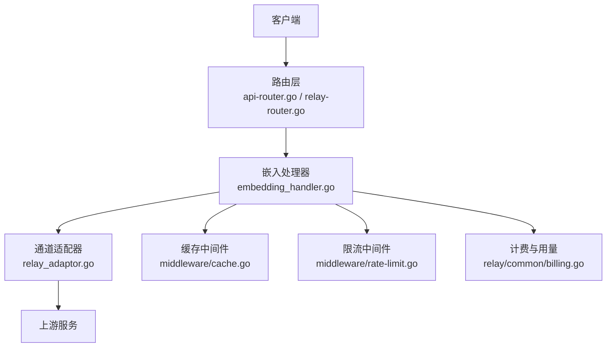
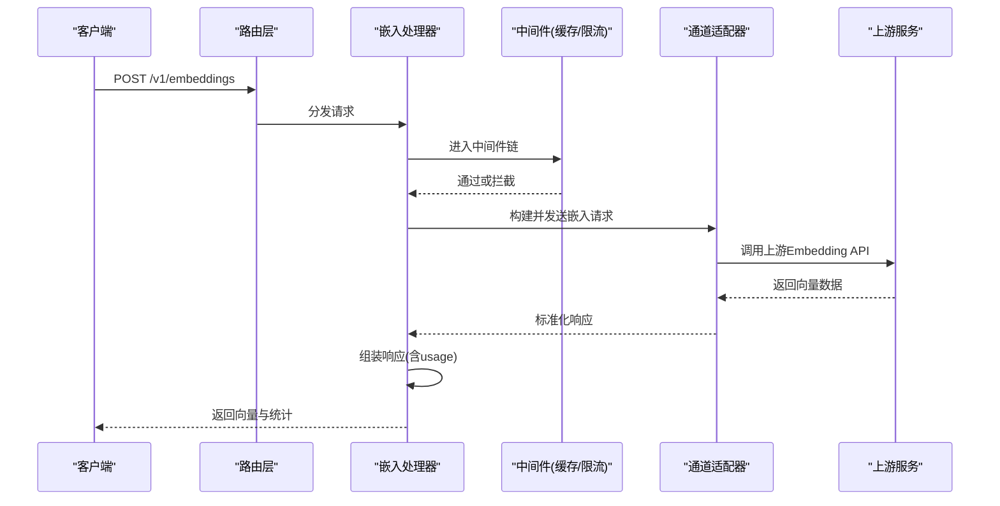
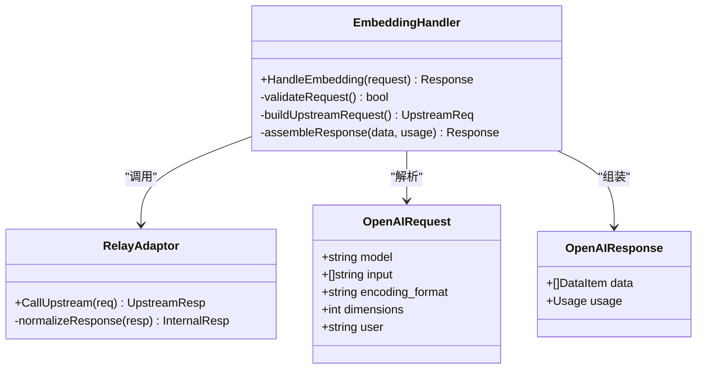
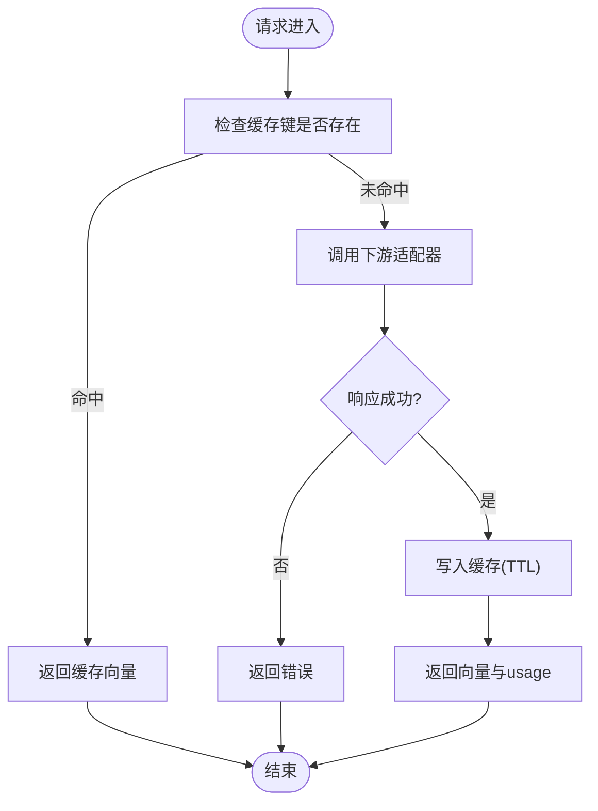
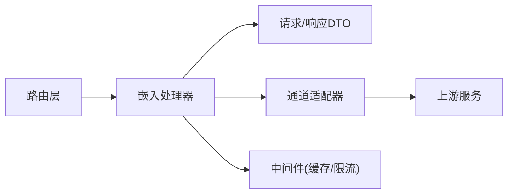

# 嵌入向量接口

<cite>
**本文引用的文件**   
- [embedding_handler.go](file://relay/embedding_handler.go)
- [embedding.go](file://dto/embedding.go)
- [api-router.go](file://router/api-router.go)
- [relay-router.go](file://router/relay-router.go)
- [openai_request.go](file://dto/openai_request.go)
- [openai_response.go](file://dto/openai_response.go)
- [cache.go](file://middleware/cache.go)
- [rate-limit.go](file://middleware/rate-limit.go)
- [performance.go](file://common/performance_config.go)
- [relay_adaptor.go](file://relay/relay_adaptor.go)
- [relay_info.go](file://relay/common/relay_info.go)
- [billing.go](file://relay/common/billing.go)
</cite>

## 目录
1. [简介](#简介)
2. [项目结构](#项目结构)
3. [核心组件](#核心组件)
4. [架构总览](#架构总览)
5. [详细组件分析](#详细组件分析)
6. [依赖分析](#依赖分析)
7. [性能考虑](#性能考虑)
8. [故障排查指南](#故障排查指南)
9. [结论](#结论)
10. [附录](#附录)

## 简介
本文件为“POST /v1/embeddings”嵌入向量接口的详细API文档。内容涵盖请求格式、响应格式、模型选择与编码格式、批量处理策略、缓存机制、性能优化建议、内存管理与分布式部署注意事项，并提供语义搜索、文本分类、相似度计算等典型应用场景的示例说明。

## 项目结构
该接口位于路由层与中继（Relay）层的交汇处：
- 路由层负责将HTTP请求分发到对应的处理器
- 处理器负责解析请求、调用下游通道适配器、组装响应
- DTO定义请求与响应的数据结构
- 中间件提供缓存、限流、统计等功能

图表来源
- [api-router.go](file://router/api-router.go)
- [relay-router.go](file://router/relay-router.go)
- [embedding_handler.go](file://relay/embedding_handler.go)
- [relay_adaptor.go](file://relay/relay_adaptor.go)
- [cache.go](file://middleware/cache.go)
- [rate-limit.go](file://middleware/rate-limit.go)
- [billing.go](file://relay/common/billing.go)

章节来源
- [api-router.go](file://router/api-router.go)
- [relay-router.go](file://router/relay-router.go)
- [embedding_handler.go](file://relay/embedding_handler.go)

## 核心组件
- 请求与响应DTO：定义输入输出字段、校验规则与默认值
- 嵌入处理器：统一解析请求、调用下游、组装响应、记录用量
- 通道适配器：对接不同上游Embedding服务
- 中间件：缓存、限流、统计、安全等横切能力

章节来源
- [embedding.go](file://dto/embedding.go)
- [openai_request.go](file://dto/openai_request.go)
- [openai_response.go](file://dto/openai_response.go)
- [embedding_handler.go](file://relay/embedding_handler.go)
- [relay_adaptor.go](file://relay/relay_adaptor.go)

## 架构总览
下图展示了从客户端请求到返回向量的完整流程，包括缓存命中、限流拦截、下游适配与计费统计。

图表来源
- [embedding_handler.go](file://relay/embedding_handler.go)
- [relay_adaptor.go](file://relay/relay_adaptor.go)
- [cache.go](file://middleware/cache.go)
- [rate-limit.go](file://middleware/rate-limit.go)

## 详细组件分析

### 请求格式：POST /v1/embeddings
- 端点路径：/v1/embeddings
- 方法：POST
- 认证：根据系统鉴权配置（如Token、会话等）
- 请求体关键字段（基于OpenAI兼容风格）：
  - model：字符串，必填。指定使用的Embedding模型
  - input：数组或字符串，必填。待嵌入的文本；支持单条或多条文本
  - encoding_format：可选。编码格式，常见值为float（浮点向量）
  - dimensions：可选。期望向量维度，若上游支持可裁剪或提示
  - user：可选。用户标识，用于审计与配额
- 其他字段：遵循OpenAI Embeddings请求规范扩展（如batch_size、timeout等由系统配置控制）

章节来源
- [openai_request.go](file://dto/openai_request.go)
- [embedding.go](file://dto/embedding.go)

### 响应格式
- data：数组，每个元素包含：
  - embedding：数组，数值型向量
  - index：整数，对应input中的索引
  - object：固定字符串，表示对象类型
- usage：使用统计，包含：
  - prompt_tokens：输入token数
  - total_tokens：总token数
- 错误：当请求失败时返回标准错误结构（code、message等）

章节来源
- [openai_response.go](file://dto/openai_response.go)
- [embedding.go](file://dto/embedding.go)

### 处理器与适配器
- 处理器职责：
  - 解析并校验请求参数
  - 调用通道适配器进行下游请求
  - 组装响应并附加usage统计
  - 触发缓存写入（若开启且命中）
- 适配器职责：
  - 将统一请求转换为上游特定协议
  - 将上游响应标准化为内部结构

图表来源
- [embedding_handler.go](file://relay/embedding_handler.go)
- [relay_adaptor.go](file://relay/relay_adaptor.go)
- [openai_request.go](file://dto/openai_request.go)
- [openai_response.go](file://dto/openai_response.go)

章节来源
- [embedding_handler.go](file://relay/embedding_handler.go)
- [relay_adaptor.go](file://relay/relay_adaptor.go)

### 缓存机制
- 缓存键生成：通常基于model、input、encoding_format等稳定字段
- 命中策略：相同请求直接返回缓存结果，减少下游调用
- 失效策略：按TTL或主动失效；大文本或高频更新场景需谨慎
- 存储后端：内存或外部缓存（Redis等），受系统配置影响

图表来源
- [cache.go](file://middleware/cache.go)
- [embedding_handler.go](file://relay/embedding_handler.go)

章节来源
- [cache.go](file://middleware/cache.go)

### 限流与配额
- 模型级限流：防止单一模型过载
- 用户级限流：保障公平性与稳定性
- 配额控制：结合计费与用量统计，限制每日/每月额度

章节来源
- [rate-limit.go](file://middleware/rate-limit.go)
- [billing.go](file://relay/common/billing.go)

### 使用统计与计费
- usage字段统计prompt_tokens与total_tokens
- 计费表达式与比率配置决定费用计算
- 日志与监控便于追踪与分析

章节来源
- [openai_response.go](file://dto/openai_response.go)
- [billing.go](file://relay/common/billing.go)

## 依赖分析
- 路由层依赖处理器：将/v1/embeddings映射到嵌入处理器
- 处理器依赖DTO：解析请求与组装响应
- 处理器依赖适配器：与上游服务通信
- 中间件依赖系统配置：缓存、限流、性能指标

图表来源
- [api-router.go](file://router/api-router.go)
- [relay-router.go](file://router/relay-router.go)
- [embedding_handler.go](file://relay/embedding_handler.go)
- [relay_adaptor.go](file://relay/relay_adaptor.go)

章节来源
- [api-router.go](file://router/api-router.go)
- [relay-router.go](file://router/relay-router.go)
- [embedding_handler.go](file://relay/embedding_handler.go)
- [relay_adaptor.go](file://relay/relay_adaptor.go)

## 性能考虑
- 批量处理：
  - 合理设置batch_size，避免单次请求过大导致超时或内存压力
  - 对长文本进行分片或截断，确保在模型上下文窗口内
- 缓存策略：
  - 对重复文本启用缓存，显著降低延迟与成本
  - 针对高熵文本（随机串）禁用缓存，避免污染缓存命中率
- 并发与线程池：
  - 使用连接池与并发限制，平衡吞吐与资源占用
  - 监控goroutine/线程数量，防止泄漏
- 内存管理：
  - 及时释放大对象引用，避免GC抖动
  - 使用流式或分块处理超大输入
- 网络与超时：
  - 设置合理的超时与重试策略，提升鲁棒性
  - 监控上游延迟与错误率，动态调整参数

[本节为通用指导，不直接分析具体文件]

## 故障排查指南
- 常见问题：
  - 模型不存在或不可用：检查model字段与上游可用性
  - 输入过长：确认文本长度与模型限制，必要时分片
  - 缓存未命中：检查缓存键生成逻辑与TTL配置
  - 限流触发：查看限流规则与配额设置
- 诊断步骤：
  - 查看请求日志与响应码
  - 检查usage统计是否合理
  - 验证缓存命中情况
  - 观察上游错误信息

章节来源
- [embedding_handler.go](file://relay/embedding_handler.go)
- [openai_response.go](file://dto/openai_response.go)

## 结论
POST /v1/embeddings接口提供了统一的嵌入向量服务能力，支持多模型、批量处理、缓存与限流，适用于语义搜索、文本分类、相似度计算等多种场景。通过合理的参数配置与性能优化，可在保证质量的同时获得良好的延迟与成本表现。

[本节为总结，不直接分析具体文件]

## 附录

### 应用场景示例
- 语义搜索：
  - 将查询与文档分别向量化，计算余弦相似度排序
  - 建议使用归一化向量与近似最近邻检索库
- 文本分类：
  - 将类别描述与样本文本向量化，计算相似度作为分类依据
  - 可结合阈值与置信度评估
- 相似度计算：
  - 计算两篇文本的向量夹角，衡量语义相似程度
  - 注意尺度与方向一致性

[本节为概念性说明，不直接分析具体文件]

### 向量化策略与最佳实践
- 文本预处理：
  - 去除无关字符、统一大小写、规范化标点
  - 对长文本分段并聚合结果（如平均或加权）
- 模型选择：
  - 根据任务需求选择专用Embedding模型
  - 关注维度与精度权衡
- 编码格式：
  - float为常用格式，兼顾精度与体积
  - 如需压缩可考虑量化或二进制编码

[本节为概念性说明，不直接分析具体文件]

### 分布式部署考虑
- 无状态设计：
  - 处理器与适配器无状态，便于水平扩展
- 共享缓存：
  - 使用集中式缓存（如Redis）提高命中率
- 负载均衡：
  - 均匀分发请求，避免热点节点
- 监控与告警：
  - 收集延迟、错误率、QPS等指标
  - 设置阈值告警与自动扩缩容

[本节为概念性说明，不直接分析具体文件]