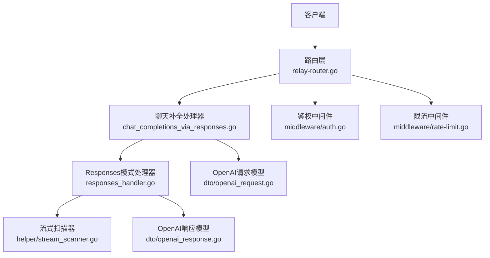
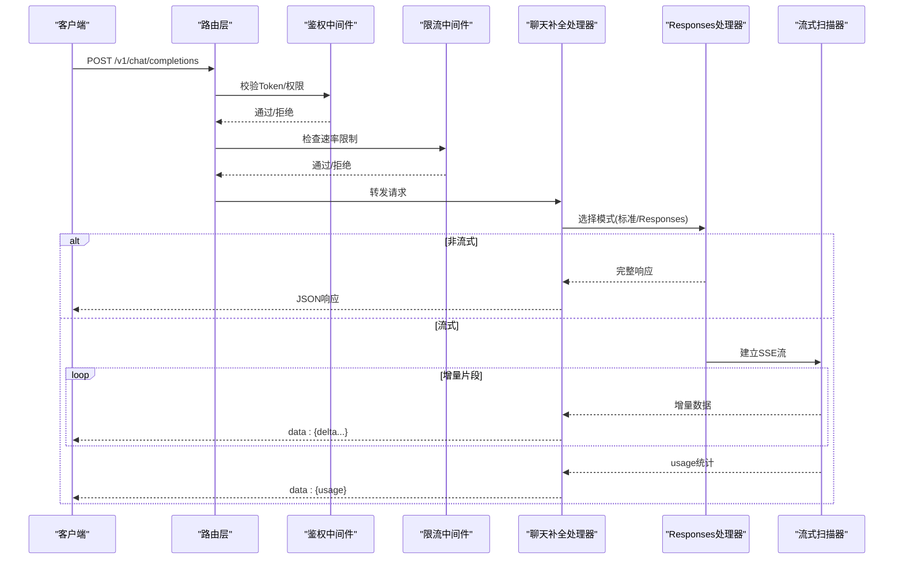
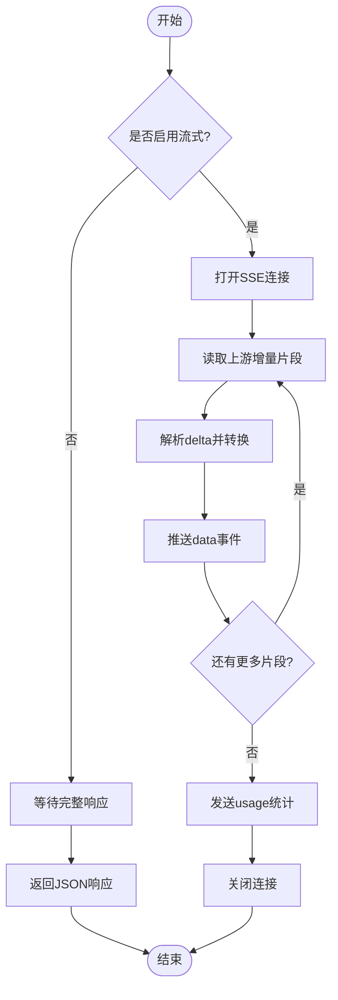
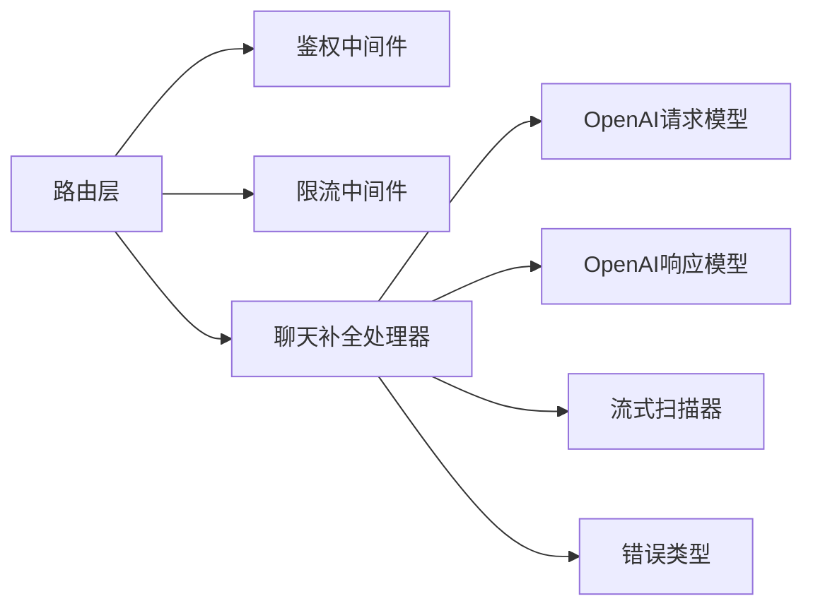

# 聊天补全接口

<cite>
**本文引用的文件**   
- [relay-router.go](file://router/relay-router.go)
- [openai_request.go](file://dto/openai_request.go)
- [openai_response.go](file://dto/openai_response.go)
- [chat_completions_via_responses.go](file://relay/chat_completions_via_responses.go)
- [responses_handler.go](file://relay/responses_handler.go)
- [stream_scanner.go](file://relay/helper/stream_scanner.go)
- [rate-limit.go](file://middleware/rate-limit.go)
- [auth.go](file://middleware/auth.go)
- [error.go](file://types/error.go)
- [api.json](file://docs/openapi/api.json)
</cite>

## 目录
1. [简介](#简介)
2. [项目结构](#项目结构)
3. [核心组件](#核心组件)
4. [架构总览](#架构总览)
5. [详细组件分析](#详细组件分析)
6. [依赖关系分析](#依赖关系分析)
7. [性能考量](#性能考量)
8. [故障排查指南](#故障排查指南)
9. [结论](#结论)
10. [附录](#附录)

## 简介
本文件为“聊天补全接口”（POST /v1/chat/completions）的完整API文档。内容涵盖请求格式、响应格式、流式SSE输出、错误处理、速率限制与安全验证机制，以及与OpenAI API的兼容性与差异点说明。读者无需深入源码即可理解接口的使用方式与行为特征。

## 项目结构
该接口位于路由层与中继层之间：
- 路由层负责将HTTP请求分发到对应的处理器。
- 中继层负责将OpenAI风格的请求转换为后端各渠道的实际调用，并统一返回OpenAI风格响应。
- DTO层定义请求与响应的数据结构。
- 中间件层提供鉴权、限流、日志等通用能力。

**图表来源** 
- [relay-router.go](file://router/relay-router.go)
- [chat_completions_via_responses.go](file://relay/chat_completions_via_responses.go)
- [responses_handler.go](file://relay/responses_handler.go)
- [stream_scanner.go](file://relay/helper/stream_scanner.go)
- [openai_request.go](file://dto/openai_request.go)
- [openai_response.go](file://dto/openai_response.go)
- [auth.go](file://middleware/auth.go)
- [rate-limit.go](file://middleware/rate-limit.go)

**章节来源**
- [relay-router.go](file://router/relay-router.go)
- [openai_request.go](file://dto/openai_request.go)
- [openai_response.go](file://dto/openai_response.go)

## 核心组件
- 路由注册：将 /v1/chat/completions 映射到聊天补全处理器。
- 请求模型：messages数组、model、temperature、max_tokens、stream等字段定义。
- 响应模型：choices数组、usage统计、finish_reason、id、object等字段定义。
- 流式处理：基于SSE的增量输出，支持事件流解析与合并。
- 中间件：鉴权、限流、请求体大小限制、CORS等。

**章节来源**
- [relay-router.go](file://router/relay-router.go)
- [openai_request.go](file://dto/openai_request.go)
- [openai_response.go](file://dto/openai_response.go)
- [stream_scanner.go](file://relay/helper/stream_scanner.go)
- [auth.go](file://middleware/auth.go)
- [rate-limit.go](file://middleware/rate-limit.go)

## 架构总览
聊天补全接口的整体流程如下：
- 客户端发起POST /v1/chat/completions请求，携带OpenAI风格参数。
- 路由层进入鉴权与限流中间件。
- 聊天补全处理器接收请求，校验参数，选择目标渠道。
- 根据配置决定使用标准Chat Completions或Responses模式。
- 非流式：等待完整响应后返回JSON。
- 流式：通过SSE逐块推送增量内容，并在末尾发送usage统计。

**图表来源** 
- [relay-router.go](file://router/relay-router.go)
- [chat_completions_via_responses.go](file://relay/chat_completions_via_responses.go)
- [responses_handler.go](file://relay/responses_handler.go)
- [stream_scanner.go](file://relay/helper/stream_scanner.go)
- [auth.go](file://middleware/auth.go)
- [rate-limit.go](file://middleware/rate-limit.go)

## 详细组件分析

### 请求格式（POST /v1/chat/completions）
- 路径：/v1/chat/completions
- 方法：POST
- Content-Type：application/json
- 必填字段：
  - model：字符串，指定使用的模型名称。
  - messages：数组，包含多轮对话消息，每条消息包含role与content。
- 可选字段：
  - temperature：数值，控制随机性；默认值依实现而定。
  - max_tokens：整数，最大生成token数。
  - stream：布尔值，是否启用流式响应。
  - top_p、n、stop、presence_penalty、frequency_penalty等：与OpenAI兼容的参数。
  - response_format：对象，用于约束输出格式（如JSON）。
  - tools/function_call：函数调用相关参数（若启用工具）。
- messages数组元素：
  - role：system、user、assistant等。
  - content：字符串或结构化内容（视模型支持）。

示例请求（多轮对话）：
- 包含system提示、用户问题、助手回答、再次用户追问等。
- 可设置temperature、max_tokens、stream等参数。

**章节来源**
- [openai_request.go](file://dto/openai_request.go)
- [api.json](file://docs/openapi/api.json)

### 响应格式
- object：通常为“chat.completion”或“chat.completion.chunk”（流式）。
- id：请求唯一标识。
- choices：数组，包含至少一个选项：
  - index：选项索引。
  - message：包含role与content的助手回复。
  - finish_reason：结束原因（如stop、length、tool_calls等）。
  - delta：流式模式下每个片段的增量内容。
- usage：统计信息：
  - prompt_tokens：输入token数。
  - completion_tokens：输出token数。
  - total_tokens：总token数。
- system_fingerprint：系统指纹（可选）。

流式响应（SSE）：
- 每行以“data: ”开头，内容为JSON片段。
- 最后一个片段通常包含usage统计。
- 客户端需按顺序拼接delta.content以得到完整回复。

**章节来源**
- [openai_response.go](file://dto/openai_response.go)
- [stream_scanner.go](file://relay/helper/stream_scanner.go)

### 流式SSE处理
- 服务端通过SSE持续推送增量数据。
- 客户端应维护连接状态，处理网络中断重连。
- 流式扫描器负责解析上游响应并转换为OpenAI风格的增量事件。

**图表来源** 
- [chat_completions_via_responses.go](file://relay/chat_completions_via_responses.go)
- [responses_handler.go](file://relay/responses_handler.go)
- [stream_scanner.go](file://relay/helper/stream_scanner.go)

**章节来源**
- [chat_completions_via_responses.go](file://relay/chat_completions_via_responses.go)
- [responses_handler.go](file://relay/responses_handler.go)
- [stream_scanner.go](file://relay/helper/stream_scanner.go)

### 错误处理
- 常见错误码：
  - 401：未授权或Token无效。
  - 403：权限不足。
  - 429：请求过于频繁（速率限制）。
  - 500：服务器内部错误。
  - 503：服务不可用（上游渠道失败）。
- 错误响应体包含code、message、param等字段，便于客户端定位问题。
- 建议客户端对429进行指数退避重试，对5xx进行有限次重试。

**章节来源**
- [error.go](file://types/error.go)
- [rate-limit.go](file://middleware/rate-limit.go)

### 速率限制与安全验证
- 鉴权：通过Header中的Authorization字段传递Bearer Token。
- 限流：基于用户、IP、模型等多维度限制QPS或并发数。
- 请求体大小限制：防止过大请求导致资源耗尽。
- CORS：跨域请求需正确配置。
- 审计日志：记录关键操作以便追踪。

**章节来源**
- [auth.go](file://middleware/auth.go)
- [rate-limit.go](file://middleware/rate-limit.go)

### 与OpenAI API的兼容性
- 完全兼容OpenAI Chat Completions的请求与响应格式。
- 支持stream=true时的SSE增量输出。
- 支持response_format、tools等高级特性（取决于后端模型能力）。
- 差异点：
  - 某些模型可能不支持全部参数（如function_call）。
  - usage统计可能在流式结束时才返回。
  - 部分渠道可能对max_tokens有额外限制。

**章节来源**
- [openai_request.go](file://dto/openai_request.go)
- [openai_response.go](file://dto/openai_response.go)
- [api.json](file://docs/openapi/api.json)

## 依赖关系分析
- 路由层依赖中间件进行鉴权与限流。
- 聊天补全处理器依赖DTO模型进行参数校验。
- Responses处理器与流式扫描器协作处理增量输出。
- 错误类型定义集中管理，便于统一处理。

**图表来源** 
- [relay-router.go](file://router/relay-router.go)
- [openai_request.go](file://dto/openai_request.go)
- [openai_response.go](file://dto/openai_response.go)
- [stream_scanner.go](file://relay/helper/stream_scanner.go)
- [error.go](file://types/error.go)

**章节来源**
- [relay-router.go](file://router/relay-router.go)
- [openai_request.go](file://dto/openai_request.go)
- [openai_response.go](file://dto/openai_response.go)
- [stream_scanner.go](file://relay/helper/stream_scanner.go)
- [error.go](file://types/error.go)

## 性能考量
- 流式响应可降低首字节延迟，提升用户体验。
- 合理设置max_tokens避免过长输出占用资源。
- 使用缓存策略减少重复请求开销。
- 监控上游渠道延迟与错误率，动态调整负载均衡。

## 故障排查指南
- 检查Authorization头是否正确。
- 确认模型名称有效且可用。
- 查看错误响应中的code与message定位问题。
- 对于429错误，实施指数退避重试。
- 使用调试工具捕获请求与响应，分析参数与返回值。

**章节来源**
- [error.go](file://types/error.go)
- [rate-limit.go](file://middleware/rate-limit.go)

## 结论
POST /v1/chat/completions接口提供了与OpenAI完全兼容的聊天补全能力，支持多轮对话、流式输出、函数调用等高级特性。通过合理的参数配置与错误处理，可实现稳定高效的AI对话体验。

## 附录
- 参考OpenAI官方文档以了解最新参数变化。
- 在实际部署中，建议开启监控与告警，确保服务稳定性。
- 定期更新依赖与模型配置，以获得最佳性能与功能支持。