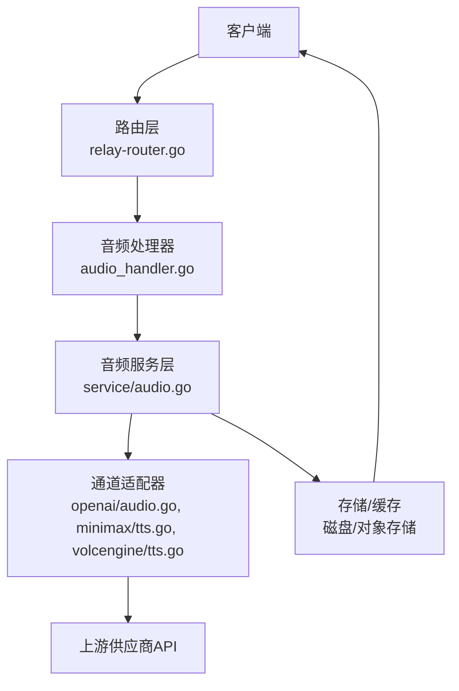
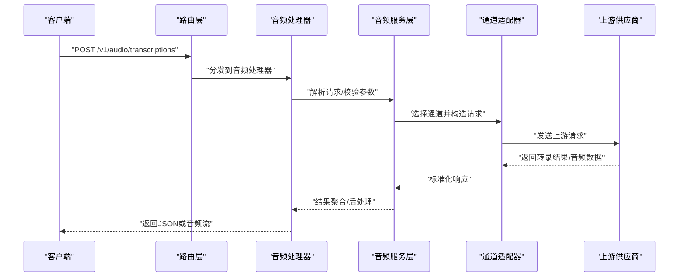
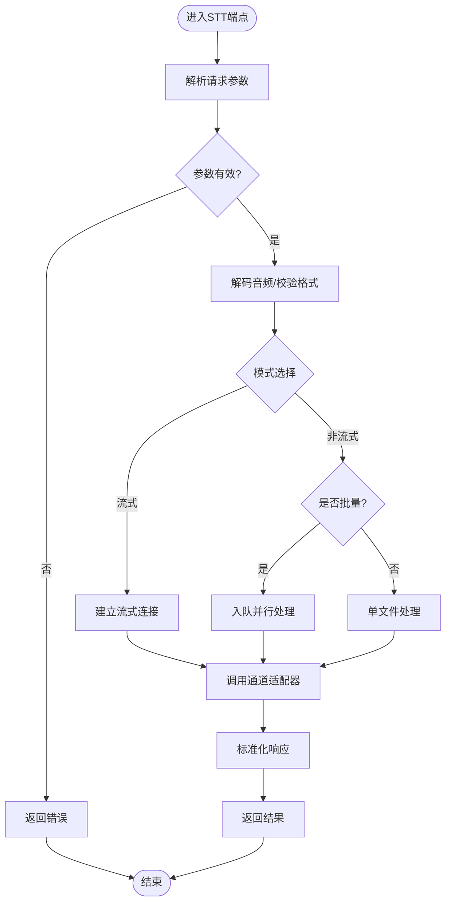
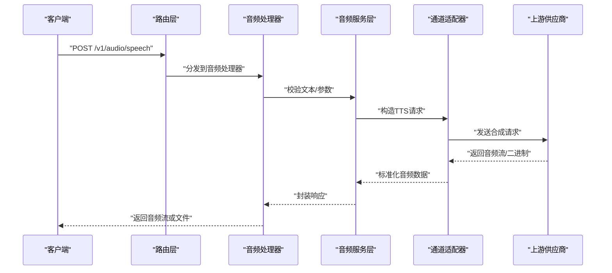
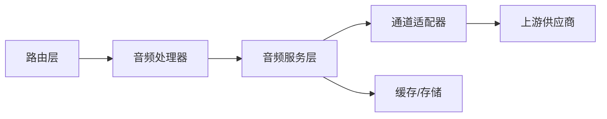

# 音频处理接口

<cite>
**本文档引用的文件**   
- [common/audio.go](file://common/audio.go)
- [dto/audio.go](file://dto/audio.go)
- [relay/audio_handler.go](file://relay/audio_handler.go)
- [service/audio.go](file://service/audio.go)
- [router/relay-router.go](file://router/relay-router.go)
- [relay/channel/openai/audio.go](file://relay/channel/openai/audio.go)
- [relay/channel/minimax/tts.go](file://relay/channel/minimax/tts.go)
- [relay/channel/volcengine/tts.go](file://relay/channel/volcengine/tts.go)
</cite>

## 目录
1. [简介](#简介)
2. [项目结构](#项目结构)
3. [核心组件](#核心组件)
4. [架构总览](#架构总览)
5. [详细组件分析](#详细组件分析)
6. [依赖关系分析](#依赖关系分析)
7. [性能考虑](#性能考虑)
8. [故障排查指南](#故障排查指南)
9. [结论](#结论)
10. [附录](#附录)

## 简介
本文件为音频处理接口的API文档，聚焦语音转文本（STT）与文本转语音（TTS）能力。内容涵盖：
- 端点定义、请求参数与响应格式
- 支持的音频文件格式与采样率要求
- 语言参数与模型选择
- 流式处理、实时转录与批量处理模式
- 完整的请求示例与响应示例
- 音频质量优化、噪声处理与隐私保护配置建议

说明：本项目采用多通道适配架构，通过统一入口将请求转发至不同上游供应商（如OpenAI、Minimax、火山引擎等），因此具体格式与行为可能因通道而异。本文档在给出通用规范的同时，标注了各通道的差异点。

## 项目结构
与音频处理相关的代码主要分布在以下模块：
- common/audio.go：音频通用工具与常量
- dto/audio.go：音频相关的数据传输对象（DTO）
- relay/audio_handler.go：音频请求的统一处理器
- service/audio.go：音频服务层（解码、校验、任务编排等）
- router/relay-router.go：路由注册与分发
- relay/channel/*/audio.go 或 tts.go：各上游通道的适配器实现

图表来源
- [router/relay-router.go](file://router/relay-router.go)
- [relay/audio_handler.go](file://relay/audio_handler.go)
- [service/audio.go](file://service/audio.go)
- [relay/channel/openai/audio.go](file://relay/channel/openai/audio.go)
- [relay/channel/minimax/tts.go](file://relay/channel/minimax/tts.go)
- [relay/channel/volcengine/tts.go](file://relay/channel/volcengine/tts.go)

章节来源
- [common/audio.go](file://common/audio.go)
- [dto/audio.go](file://dto/audio.go)
- [relay/audio_handler.go](file://relay/audio_handler.go)
- [service/audio.go](file://service/audio.go)
- [router/relay-router.go](file://router/relay-router.go)

## 核心组件
- 音频处理器（audio_handler.go）
  - 职责：接收HTTP请求，解析参数，调用服务层进行解码、校验与调度，返回结果或错误。
  - 关键点：支持文件上传与URL输入；支持流式与非流式响应；统一错误码与限流。
- 音频服务层（service/audio.go）
  - 职责：音频解码与格式校验、采样率转换、分片与批处理、任务队列与重试、结果聚合。
  - 关键点：可配置最大文件大小、超时、并发度；支持临时存储清理。
- 通道适配器（各channel/*.go）
  - 职责：将统一请求转换为上游特定协议，解析上游响应并映射到统一格式。
  - 关键点：不同通道对格式、采样率、语言参数的支持与限制存在差异。

章节来源
- [relay/audio_handler.go](file://relay/audio_handler.go)
- [service/audio.go](file://service/audio.go)
- [relay/channel/openai/audio.go](file://relay/channel/openai/audio.go)
- [relay/channel/minimax/tts.go](file://relay/channel/minimax/tts.go)
- [relay/channel/volcengine/tts.go](file://relay/channel/volcengine/tts.go)

## 架构总览
整体流程遵循“路由→处理器→服务层→通道适配器→上游供应商”的分层设计，确保可扩展性与一致性。

图表来源
- [router/relay-router.go](file://router/relay-router.go)
- [relay/audio_handler.go](file://relay/audio_handler.go)
- [service/audio.go](file://service/audio.go)
- [relay/channel/openai/audio.go](file://relay/channel/openai/audio.go)

## 详细组件分析

### STT（语音转文本）
- 端点
  - POST /v1/audio/transcriptions
- 请求体
  - 支持两种输入方式：
    - multipart/form-data：字段 audio（二进制音频）、model（模型名）、language（语言代码）、response_format（输出格式）、timestamp_granularities（时间戳粒度）、temperature（可选，部分通道支持）
    - JSON：字段 input（字符串或URL）、model、language、response_format、timestamp_granularities
- 响应体
  - text：转录文本
  - language：识别语言
  - duration：音频时长（秒）
  - segments：分段信息（含start/end与text）
  - words：词级时间戳（可选）
- 流式模式
  - 通过设置 response_format=streaming 或启用服务端流式开关，按片段推送转录结果
- 批量模式
  - 支持提交多个音频文件或URL，返回聚合结果列表
- 通道差异
  - OpenAI：支持多种音频格式与采样率，提供segments与words
  - Minimax/VolcEngine：根据各自SDK限制，可能仅返回文本或简化时间戳

图表来源
- [relay/audio_handler.go](file://relay/audio_handler.go)
- [service/audio.go](file://service/audio.go)
- [relay/channel/openai/audio.go](file://relay/channel/openai/audio.go)

章节来源
- [relay/audio_handler.go](file://relay/audio_handler.go)
- [service/audio.go](file://service/audio.go)
- [relay/channel/openai/audio.go](file://relay/channel/openai/audio.go)

### TTS（文本转语音）
- 端点
  - POST /v1/audio/speech
- 请求体
  - model：合成模型
  - input：待合成文本
  - voice：音色/说话人ID
  - speed：语速（0.5~2.0，视通道而定）
  - format：输出音频格式（wav/mp3/ogg等）
  - sample_rate：目标采样率（如16000/24000/48000）
  - stream：是否流式返回音频数据
- 响应体
  - 非流式：application/octet-stream 的音频二进制
  - 流式：分块返回音频片段
- 通道差异
  - Minimax：支持多种音色与采样率，返回mp3/wav
  - VolcEngine：支持中文/英文等多语种，提供SSML增强选项

图表来源
- [relay/audio_handler.go](file://relay/audio_handler.go)
- [service/audio.go](file://service/audio.go)
- [relay/channel/minimax/tts.go](file://relay/channel/minimax/tts.go)
- [relay/channel/volcengine/tts.go](file://relay/channel/volcengine/tts.go)

章节来源
- [relay/audio_handler.go](file://relay/audio_handler.go)
- [service/audio.go](file://service/audio.go)
- [relay/channel/minimax/tts.go](file://relay/channel/minimax/tts.go)
- [relay/channel/volcengine/tts.go](file://relay/channel/volcengine/tts.go)

### 音频格式与采样率
- 支持的音频格式（STT输入）
  - wav、mp3、flac、ogg、m4a、aac（以通道能力为准）
- 采样率要求
  - 推荐 16kHz 或 48kHz；部分通道自动重采样
- 语言参数
  - ISO 639-1 代码（如 zh、en、ja、ko）
  - 某些通道支持 auto-detect（自动识别）
- 输出格式（TTS）
  - mp3、wav、ogg（取决于通道）

章节来源
- [common/audio.go](file://common/audio.go)
- [dto/audio.go](file://dto/audio.go)

### 流式与实时转录
- 流式STT
  - 使用 streaming=true 或 response_format=streaming
  - 服务端按片段推送文本增量
- 实时转录
  - 结合WebSocket或SSE（由上层网关决定）
  - 适用于会议记录、直播字幕场景
- 批量处理
  - 提交多个音频文件/URL，服务端并行处理并聚合结果

章节来源
- [relay/audio_handler.go](file://relay/audio_handler.go)
- [service/audio.go](file://service/audio.go)

### 请求与响应示例
- STT 请求（multipart）
  - 方法：POST
  - 路径：/v1/audio/transcriptions
  - 头部：Authorization: Bearer <token>
  - 表单字段：audio（文件）、model、language、response_format、timestamp_granularities
- STT 响应（JSON）
  - text、language、duration、segments[]、words[]
- TTS 请求（JSON）
  - 方法：POST
  - 路径：/v1/audio/speech
  - 头部：Authorization: Bearer <token>
  - 主体：model、input、voice、speed、format、sample_rate、stream
- TTS 响应（二进制或流）
  - Content-Type: audio/mpeg 或 audio/wav
  - 流式：分块传输音频片段

章节来源
- [relay/audio_handler.go](file://relay/audio_handler.go)
- [dto/audio.go](file://dto/audio.go)

### 音频质量优化与噪声处理
- 预处理建议
  - 降噪：VAD（语音活动检测）、频谱滤波
  - 归一化：响度标准化、峰值限制
  - 采样率：统一至 16kHz（STT）或 48kHz（高质量TTS）
- 通道能力
  - 部分上游提供内置降噪与增强（如OpenAI Whisper增强）
- 后处理
  - 文本清洗：标点恢复、数字规范化
  - 音频拼接：无缝合并分块音频

章节来源
- [service/audio.go](file://service/audio.go)
- [common/audio.go](file://common/audio.go)

### 隐私保护与安全
- 数据传输
  - 强制HTTPS；支持TLS 1.2+
- 数据存储
  - 临时文件自动清理；敏感字段不落盘
- 访问控制
  - Token鉴权；IP白名单；速率限制
- 合规
  - 可配置审计日志；支持数据脱敏导出

章节来源
- [relay/audio_handler.go](file://relay/audio_handler.go)
- [service/audio.go](file://service/audio.go)

## 依赖关系分析
- 路由层依赖处理器，处理器依赖服务层，服务层依赖通道适配器
- 通道适配器依赖上游SDK/HTTP客户端
- 服务层依赖存储与缓存用于临时文件与结果缓存

图表来源
- [router/relay-router.go](file://router/relay-router.go)
- [relay/audio_handler.go](file://relay/audio_handler.go)
- [service/audio.go](file://service/audio.go)

章节来源
- [router/relay-router.go](file://router/relay-router.go)
- [relay/audio_handler.go](file://relay/audio_handler.go)
- [service/audio.go](file://service/audio.go)

## 性能考虑
- 并发与队列
  - 合理设置并发度与队列长度，避免内存溢出
- 流式处理
  - 优先使用流式以降低延迟与内存占用
- 缓存策略
  - 对相同输入进行结果缓存（需考虑时效性）
- 资源限制
  - 设置最大文件大小、超时与重试次数

[本节为通用指导，不直接分析具体文件]

## 故障排查指南
- 常见错误
  - 400：参数缺失或格式错误（检查content-type与字段）
  - 413：文件过大（调整max_body_size）
  - 429：限流触发（降低请求频率）
  - 500/502：上游错误或网络异常（查看日志与通道状态）
- 诊断步骤
  - 开启调试日志，捕获请求/响应
  - 验证音频格式与采样率
  - 切换通道测试定位问题
- 恢复策略
  - 重试机制（指数退避）
  - 降级到备用通道

章节来源
- [relay/audio_handler.go](file://relay/audio_handler.go)
- [service/audio.go](file://service/audio.go)

## 结论
本音频处理接口通过统一抽象与多通道适配，提供了稳定的STT与TTS能力。开发者可根据业务需求选择合适的通道与参数，利用流式与批量模式提升效率。建议在部署时关注性能与安全配置，并结合上游能力进行优化。

[本节为总结，不直接分析具体文件]

## 附录
- 术语表
  - STT：语音转文本（Speech-to-Text）
  - TTS：文本转语音（Text-to-Speech）
  - VAD：语音活动检测（Voice Activity Detection）
- 参考通道
  - OpenAI Whisper（STT）
  - Minimax（TTS）
  - 火山引擎（TTS）

[本节为补充信息，不直接分析具体文件]