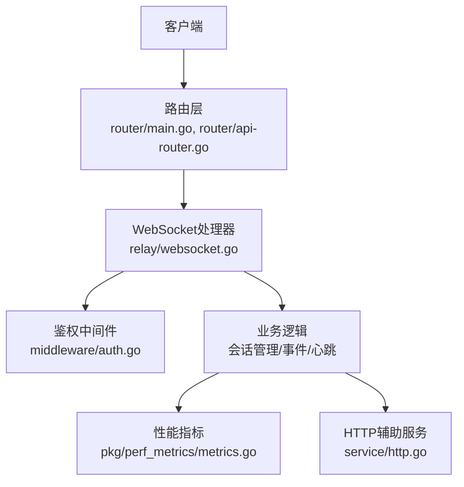
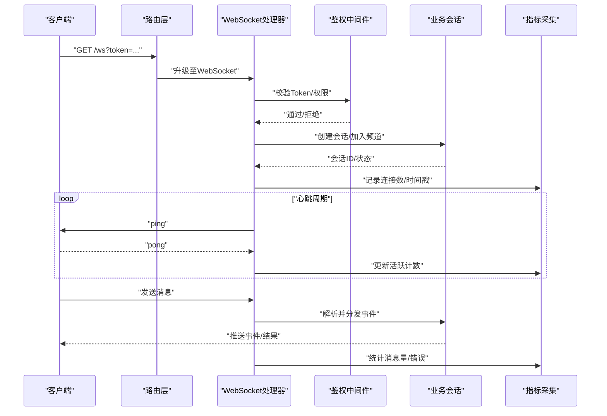
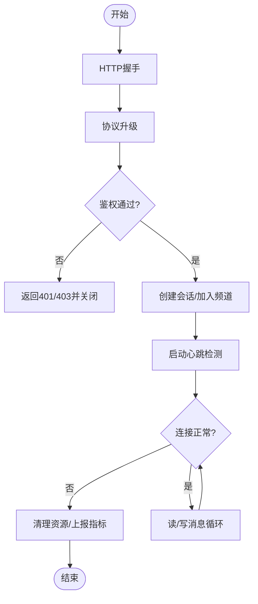
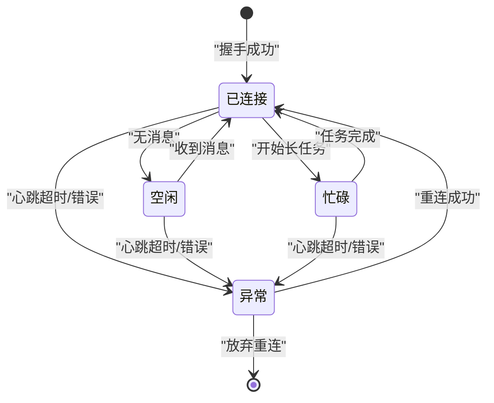
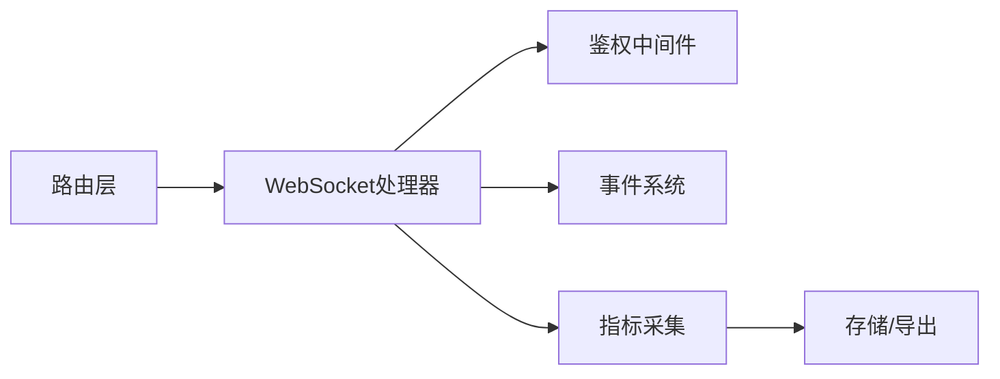

# WebSocket API

<cite>
**本文引用的文件**   
- [main.go](file://main.go)
- [router/main.go](file://router/main.go)
- [router/api-router.go](file://router/api-router.go)
- [relay/websocket.go](file://relay/websocket.go)
- [dto/realtime.go](file://dto/realtime.go)
- [common/custom-event.go](file://common/custom-event.go)
- [middleware/auth.go](file://middleware/auth.go)
- [service/http.go](file://service/http.go)
- [pkg/perf_metrics/metrics.go](file://pkg/perf_metrics/metrics.go)
</cite>

## 目录
1. [简介](#简介)
2. [项目结构](#项目结构)
3. [核心组件](#核心组件)
4. [架构总览](#架构总览)
5. [详细组件分析](#详细组件分析)
6. [依赖关系分析](#依赖关系分析)
7. [性能考虑](#性能考虑)
8. [故障排查指南](#故障排查指南)
9. [结论](#结论)
10. [附录](#附录)

## 简介
本文件为项目的WebSocket API提供完整的技术文档，覆盖连接建立、消息格式、事件类型与状态管理、连接生命周期、心跳机制、错误重连与断线处理、监控指标与性能优化、客户端集成与调试等。读者可据此快速完成前后端实时通信的对接与排障。

## 项目结构
本项目采用分层与按功能域组织的方式：
- 路由层：负责HTTP与WebSocket路由注册与分发
- 中间件层：鉴权、限流、日志、CORS等横切关注点
- 业务层：WebSocket会话管理、消息编解码、事件广播
- DTO与常量：统一的数据结构与事件定义
- 监控与指标：性能指标采集与导出

**图示来源** 
- [router/main.go](file://router/main.go)
- [router/api-router.go](file://router/api-router.go)
- [relay/websocket.go](file://relay/websocket.go)
- [middleware/auth.go](file://middleware/auth.go)
- [pkg/perf_metrics/metrics.go](file://pkg/perf_metrics/metrics.go)
- [service/http.go](file://service/http.go)

**章节来源**
- [main.go](file://main.go)
- [router/main.go](file://router/main.go)
- [router/api-router.go](file://router/api-router.go)

## 核心组件
- WebSocket处理器：负责握手、鉴权、读写循环、心跳检测、断线恢复与事件分发
- 事件系统：基于自定义事件模型，支持扩展与多订阅者广播
- 数据对象：统一的请求/响应结构与实时事件类型
- 指标采集：连接数、消息吞吐、延迟、错误率等关键指标

**章节来源**
- [relay/websocket.go](file://relay/websocket.go)
- [common/custom-event.go](file://common/custom-event.go)
- [dto/realtime.go](file://dto/realtime.go)

## 架构总览
下图展示了从客户端发起WebSocket连接到服务端处理的核心流程，包括鉴权、会话建立、心跳与事件通道。

**图示来源** 
- [router/api-router.go](file://router/api-router.go)
- [relay/websocket.go](file://relay/websocket.go)
- [middleware/auth.go](file://middleware/auth.go)
- [pkg/perf_metrics/metrics.go](file://pkg/perf_metrics/metrics.go)

## 详细组件分析

### WebSocket连接与生命周期
- 连接建立
  - 客户端通过HTTP GET发起WebSocket握手，携带鉴权参数（如token）
  - 路由层将请求转发给WebSocket处理器进行协议升级
  - 鉴权中间件验证令牌与权限，通过后建立会话上下文
- 会话管理
  - 成功鉴权后分配唯一会话ID，维护连接状态（已连接/空闲/忙碌/异常）
  - 支持频道/房间级别的订阅与广播
- 断开处理
  - 网络异常或客户端主动关闭时触发清理流程，释放资源并上报指标
  - 支持自动重连策略（指数退避、最大重试次数）

**图示来源** 
- [relay/websocket.go](file://relay/websocket.go)
- [middleware/auth.go](file://middleware/auth.go)

**章节来源**
- [relay/websocket.go](file://relay/websocket.go)
- [middleware/auth.go](file://middleware/auth.go)

### 消息格式与事件类型
- 通用消息结构
  - type: 事件类型标识（如 connect、message、ping、pong、error、subscribe、unsubscribe）
  - id: 消息唯一标识（用于请求-响应匹配）
  - payload: 业务负载（随事件类型变化）
  - meta: 元数据（如时间戳、来源、版本）
- 常见事件
  - connect: 连接建立确认，包含会话信息与可用能力
  - message: 双向消息传输，payload为具体业务数据
  - ping/pong: 心跳保活，确保连接存活
  - error: 错误通知，包含错误码与描述
  - subscribe/unsubscribe: 频道订阅与取消
- 示例（以JSON为例）
  - 连接建立
    - {"type":"connect","id":"c1","payload":{"session_id":"s1","capabilities":["chat","stream"]},"meta":{"ts":1710000000}}
  - 发送消息
    - {"type":"message","id":"m1","payload":{"content":"你好"},"meta":{"ts":1710000001}}
  - 心跳
    - {"type":"ping","id":"p1"}
    - {"type":"pong","id":"p1"}
  - 错误
    - {"type":"error","id":"e1","payload":{"code":"AUTH_FAILED","message":"令牌无效"}}

**章节来源**
- [dto/realtime.go](file://dto/realtime.go)
- [common/custom-event.go](file://common/custom-event.go)

### 心跳机制与状态管理
- 心跳策略
  - 服务端周期性发送ping，客户端需在限定时间内回复pong
  - 连续N次未收到pong则判定连接失效，触发重连或清理
- 状态机
  - 已连接：握手成功，心跳正常
  - 空闲：无活动消息但心跳正常
  - 忙碌：正在处理长任务（如流式生成）
  - 异常：心跳失败或业务错误，进入重连或关闭流程

**图示来源** 
- [relay/websocket.go](file://relay/websocket.go)

**章节来源**
- [relay/websocket.go](file://relay/websocket.go)

### 错误重连与断线处理
- 客户端重连策略
  - 指数退避：初始间隔t，每次失败乘以倍数k，上限maxDelay
  - 最大重试次数：超过阈值后停止并重试上层逻辑
  - 抖动随机化：避免雪崩效应
- 服务端处理
  - 断线时保留最近状态（可选），便于恢复
  - 清理资源、释放锁、移除订阅
  - 上报错误指标与审计日志

**章节来源**
- [relay/websocket.go](file://relay/websocket.go)

### 事件监听与数据处理
- 事件总线
  - 基于自定义事件模型，支持多订阅者与异步分发
  - 事件优先级与过滤规则
- 数据处理
  - 输入校验与转换
  - 业务编排与下游调用
  - 输出序列化与错误封装

**章节来源**
- [common/custom-event.go](file://common/custom-event.go)
- [dto/realtime.go](file://dto/realtime.go)

## 依赖关系分析
- 路由层依赖WebSocket处理器与鉴权中间件
- WebSocket处理器依赖事件系统与指标采集
- 指标采集依赖全局配置与存储后端

**图示来源** 
- [router/api-router.go](file://router/api-router.go)
- [relay/websocket.go](file://relay/websocket.go)
- [middleware/auth.go](file://middleware/auth.go)
- [pkg/perf_metrics/metrics.go](file://pkg/perf_metrics/metrics.go)

**章节来源**
- [router/api-router.go](file://router/api-router.go)
- [relay/websocket.go](file://relay/websocket.go)
- [middleware/auth.go](file://middleware/auth.go)
- [pkg/perf_metrics/metrics.go](file://pkg/perf_metrics/metrics.go)

## 性能考虑
- 连接池管理
  - 限制单进程最大连接数，防止资源耗尽
  - 使用缓冲通道减少阻塞
  - 定期回收空闲连接
- 消息批处理
  - 合并小消息批量发送
  - 控制单条消息大小上限
- 指标与监控
  - 连接数、活跃连接、消息吞吐、平均延迟、错误率
  - 告警阈值与可视化面板
- 优化建议
  - 启用压缩（谨慎评估CPU开销）
  - 合理设置心跳间隔与超时
  - 使用零拷贝或内存池减少GC压力

[本节为通用指导，不直接分析具体文件]

## 故障排查指南
- 常见问题
  - 握手失败：检查URL、端口、代理与CORS配置
  - 鉴权失败：核对Token有效期、签名与权限
  - 心跳超时：检查网络延迟、防火墙与负载均衡器超时设置
  - 消息丢失：确认顺序保证与重放策略
- 诊断步骤
  - 查看服务端日志与指标
  - 抓包分析握手与心跳
  - 复现最小用例定位问题
- 工具推荐
  - 浏览器开发者工具的Network面板
  - curl/wscat测试连接
  - Wireshark/tcpdump抓包

**章节来源**
- [relay/websocket.go](file://relay/websocket.go)
- [middleware/auth.go](file://middleware/auth.go)

## 结论
本WebSocket API提供了稳定可靠的实时通信能力，涵盖连接生命周期、心跳保活、事件驱动与指标监控。通过合理的重连策略与性能优化，可在高并发场景下保持低延迟与高吞吐。建议结合监控与日志完善可观测性，持续优化用户体验。

[本节为总结，不直接分析具体文件]

## 附录

### 客户端集成指南
- 连接建立
  - 使用WebSocket库创建连接，附加鉴权参数
  - 处理onopen、onmessage、onclose、onerror事件
- 心跳实现
  - 定时发送ping，接收pong并重置定时器
  - 心跳失败触发重连
- 消息处理
  - 根据type分派到对应处理器
  - 对payload进行校验与转换
- 重连策略
  - 指数退避+抖动+最大重试
  - 恢复订阅与状态

[本节为通用指导，不直接分析具体文件]

### 监控指标清单
- 连接指标：新建连接数、当前活跃连接、断线次数
- 消息指标：入站/出站消息数、平均/峰值大小、错误数
- 延迟指标：握手耗时、心跳往返、端到端延迟
- 资源指标：内存占用、goroutine数量、CPU使用率

**章节来源**
- [pkg/perf_metrics/metrics.go](file://pkg/perf_metrics/metrics.go)

### 调试工具使用
- 命令行工具
  - wscat：连接、发送消息、观察响应
  - curl：模拟握手与鉴权参数
- 浏览器工具
  - Network面板：查看WebSocket帧与时间线
  - Console：打印事件与错误信息
- 服务端工具
  - 日志级别调整，开启详细调试
  - 指标面板观察趋势与异常

[本节为通用指导，不直接分析具体文件]