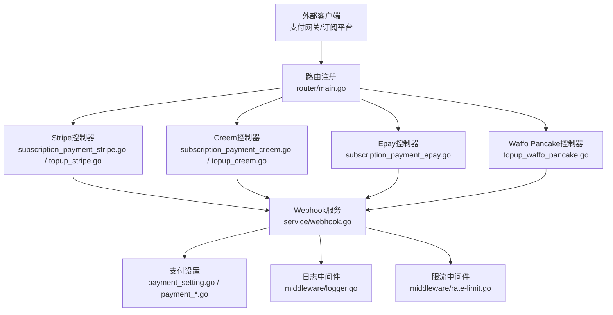
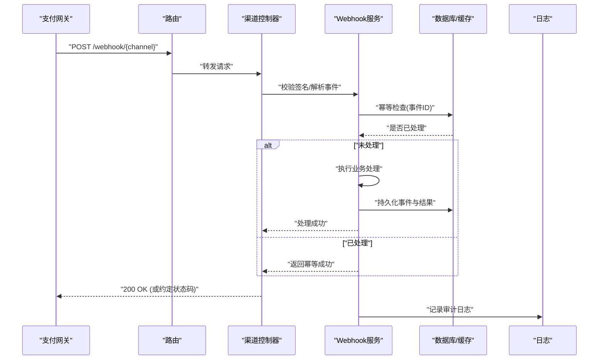
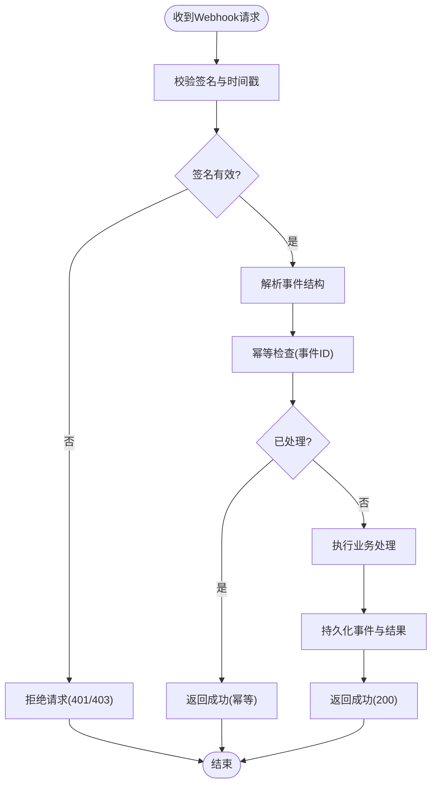
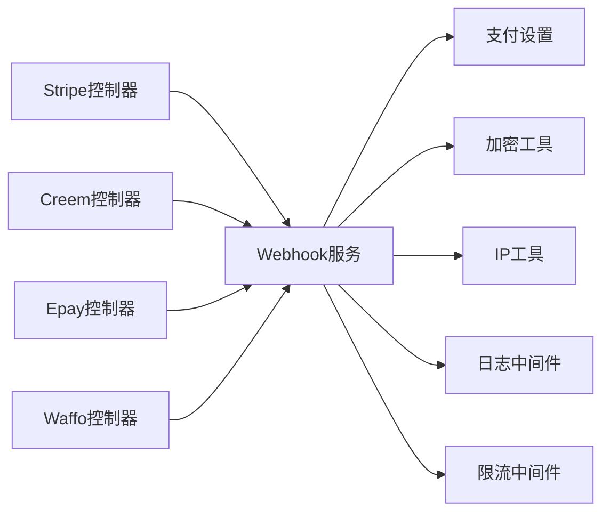

# Webhook接口

<cite>
**本文引用的文件**   
- [main.go](file://main.go)
- [router/main.go](file://router/main.go)
- [controller/payment_webhook_availability.go](file://controller/payment_webhook_availability.go)
- [controller/subscription_payment_stripe.go](file://controller/subscription_payment_stripe.go)
- [controller/subscription_payment_epay.go](file://controller/subscription_payment_epay.go)
- [controller/subscription_payment_creem.go](file://controller/subscription_payment_creem.go)
- [controller/topup_stripe.go](file://controller/topup_stripe.go)
- [controller/topup_creem.go](file://controller/topup_creem.go)
- [controller/topup_waffo_pancake.go](file://controller/topup_waffo_pancake.go)
- [service/webhook.go](file://service/webhook.go)
- [setting/operation_setting/payment_setting.go](file://setting/operation_setting/payment_setting.go)
- [setting/payment_stripe.go](file://setting/payment_stripe.go)
- [setting/payment_creem.go](file://setting/payment_creem.go)
- [setting/payment_waffo_pancake.go](file://setting/payment_waffo_pancake.go)
- [middleware/logger.go](file://middleware/logger.go)
- [middleware/rate-limit.go](file://middleware/rate-limit.go)
- [common/crypto.go](file://common/crypto.go)
- [common/ip.go](file://common/ip.go)
</cite>

## 目录
1. [简介](#简介)
2. [项目结构](#项目结构)
3. [核心组件](#核心组件)
4. [架构总览](#架构总览)
5. [详细组件分析](#详细组件分析)
6. [依赖关系分析](#依赖关系分析)
7. [性能考虑](#性能考虑)
8. [故障排除指南](#故障排除指南)
9. [结论](#结论)
10. [附录](#附录)

## 简介
本文件为Webhook接口的权威API文档，覆盖支付回调、订阅状态变更与系统事件通知等端点。内容包含：
- Webhook签名验证流程与要求
- 事件类型定义与请求格式
- 响应规范与幂等性建议
- 错误处理策略与重试机制
- 安全配置（密钥、IP白名单）与调试方法
- Webhook处理器实现指南与常见问题排查

## 项目结构
Webhook相关能力分布在控制器层、服务层与设置层：
- 路由注册：统一入口将Webhook路径挂载到HTTP服务器
- 控制器：按支付渠道拆分处理逻辑（Stripe、Creem、Epay、Waffo Pancake等）
- 服务层：通用Webhook校验、签名验证、事件分发与持久化
- 设置层：各支付渠道的密钥、回调URL、签名算法等配置项
- 中间件：日志记录、限流、请求体限制等横切关注点

图表来源
- [router/main.go:1-200](file://router/main.go#L1-L200)
- [controller/subscription_payment_stripe.go:1-300](file://controller/subscription_payment_stripe.go#L1-L300)
- [controller/subscription_payment_creem.go:1-300](file://controller/subscription_payment_creem.go#L1-L300)
- [controller/subscription_payment_epay.go:1-300](file://controller/subscription_payment_epay.go#L1-L300)
- [controller/topup_stripe.go:1-300](file://controller/topup_stripe.go#L1-L300)
- [controller/topup_creem.go:1-300](file://controller/topup_creem.go#L1-L300)
- [controller/topup_waffo_pancake.go:1-300](file://controller/topup_waffo_pancake.go#L1-L300)
- [service/webhook.go:1-300](file://service/webhook.go#L1-L300)
- [setting/operation_setting/payment_setting.go:1-200](file://setting/operation_setting/payment_setting.go#L1-L200)
- [setting/payment_stripe.go:1-200](file://setting/payment_stripe.go#L1-L200)
- [setting/payment_creem.go:1-200](file://setting/payment_creem.go#L1-L200)
- [setting/payment_waffo_pancake.go:1-200](file://setting/payment_waffo_pancake.go#L1-L200)

章节来源
- [router/main.go:1-200](file://router/main.go#L1-L200)
- [main.go:1-200](file://main.go#L1-L200)

## 核心组件
- 路由与可用性检查
  - 提供Webhook可用性与健康检查端点，便于集成方探测回调可达性
- 支付回调控制器
  - 针对Stripe、Creem、Epay、Waffo Pancake等渠道分别实现回调解析与业务处理
- Webhook服务
  - 统一签名验证、事件分发、幂等去重、日志与指标上报
- 设置与配置
  - 集中管理各渠道密钥、回调URL、签名算法、超时与重试参数

章节来源
- [controller/payment_webhook_availability.go:1-200](file://controller/payment_webhook_availability.go#L1-L200)
- [service/webhook.go:1-300](file://service/webhook.go#L1-L300)
- [setting/operation_setting/payment_setting.go:1-200](file://setting/operation_setting/payment_setting.go#L1-L200)

## 架构总览
Webhook调用链路从外部支付/订阅平台发起，经路由分发至对应渠道控制器，再由服务层完成签名校验、事件解析与业务落库，最终返回标准响应以驱动对方重试策略。

图表来源
- [router/main.go:1-200](file://router/main.go#L1-L200)
- [controller/subscription_payment_stripe.go:1-300](file://controller/subscription_payment_stripe.go#L1-L300)
- [controller/topup_stripe.go:1-300](file://controller/topup_stripe.go#L1-L300)
- [service/webhook.go:1-300](file://service/webhook.go#L1-L300)

## 详细组件分析

### 路由与可用性检查
- 功能要点
  - 暴露Webhook健康检查端点，用于集成方验证回调可达性与基本连通性
  - 支持按渠道维度返回可用性状态
- 使用建议
  - 在部署后优先调用可用性检查，确认回调地址可被目标平台访问
  - 结合监控告警对可用性进行持续巡检

章节来源
- [controller/payment_webhook_availability.go:1-200](file://controller/payment_webhook_availability.go#L1-L200)

### Stripe订阅回调
- 端点说明
  - 订阅生命周期事件（创建、更新、取消、到期等）通过Stripe Webhook推送
- 签名验证
  - 基于Stripe提供的签名头与时间戳窗口进行校验，拒绝过期或篡改请求
- 事件处理
  - 根据事件类型映射到订阅状态机，更新用户订阅状态与计费周期
- 幂等与重试
  - 基于事件ID进行幂等存储；重复事件直接返回成功
- 响应要求
  - 成功返回200；失败返回非200以触发平台重试

章节来源
- [controller/subscription_payment_stripe.go:1-300](file://controller/subscription_payment_stripe.go#L1-L300)
- [service/webhook.go:1-300](file://service/webhook.go#L1-L300)

### Stripe充值回调
- 端点说明
  - 充值订单状态变更（支付成功、失败、退款等）回调
- 签名验证
  - 同订阅回调，严格校验签名与时间戳
- 事件处理
  - 根据订单号匹配充值单，更新余额与流水
- 幂等与重试
  - 事件ID幂等；失败时由平台自动重试

章节来源
- [controller/topup_stripe.go:1-300](file://controller/topup_stripe.go#L1-L300)
- [service/webhook.go:1-300](file://service/webhook.go#L1-L300)

### Creem订阅与充值回调
- 端点说明
  - 订阅与充值两类事件均通过Creem Webhook推送
- 签名验证
  - 使用Creem约定的签名算法与头部字段进行校验
- 事件处理
  - 订阅事件更新订阅状态；充值事件更新账户余额与交易流水
- 幂等与重试
  - 事件ID幂等；失败返回非200触发重试

章节来源
- [controller/subscription_payment_creem.go:1-300](file://controller/subscription_payment_creem.go#L1-L300)
- [controller/topup_creem.go:1-300](file://controller/topup_creem.go#L1-L300)
- [service/webhook.go:1-300](file://service/webhook.go#L1-L300)

### Epay订阅回调
- 端点说明
  - 订阅生命周期事件回调
- 签名验证
  - 依据Epay签名规则校验请求完整性与时序
- 事件处理
  - 同步订阅状态，必要时触发续费或降级流程
- 幂等与重试
  - 事件ID幂等；失败返回非200

章节来源
- [controller/subscription_payment_epay.go:1-300](file://controller/subscription_payment_epay.go#L1-L300)
- [service/webhook.go:1-300](file://service/webhook.go#L1-L300)

### Waffo Pancake充值回调
- 端点说明
  - 充值订单状态变更回调
- 签名验证
  - 使用Waffo Pancake签名算法校验
- 事件处理
  - 匹配充值单并更新余额与流水
- 幂等与重试
  - 事件ID幂等；失败返回非200

章节来源
- [controller/topup_waffo_pancake.go:1-300](file://controller/topup_waffo_pancake.go#L1-L300)
- [service/webhook.go:1-300](file://service/webhook.go#L1-L300)

### Webhook服务（通用）
- 功能要点
  - 统一签名验证、事件解析、幂等去重、审计日志与指标上报
  - 提供可扩展的事件分发器，便于新增渠道
- 关键流程
  - 接收请求 -> 校验签名 -> 解析事件 -> 幂等检查 -> 执行业务 -> 持久化 -> 返回响应

图表来源
- [service/webhook.go:1-300](file://service/webhook.go#L1-L300)

章节来源
- [service/webhook.go:1-300](file://service/webhook.go#L1-L300)

## 依赖关系分析
- 控制器依赖服务层进行签名校验与事件分发
- 服务层依赖设置模块获取渠道密钥与算法参数
- 中间件负责日志、限流与请求体限制
- IP白名单与可信代理用于来源校验与防伪造

图表来源
- [controller/subscription_payment_stripe.go:1-300](file://controller/subscription_payment_stripe.go#L1-L300)
- [controller/subscription_payment_creem.go:1-300](file://controller/subscription_payment_creem.go#L1-L300)
- [controller/subscription_payment_epay.go:1-300](file://controller/subscription_payment_epay.go#L1-L300)
- [controller/topup_stripe.go:1-300](file://controller/topup_stripe.go#L1-L300)
- [controller/topup_creem.go:1-300](file://controller/topup_creem.go#L1-L300)
- [controller/topup_waffo_pancake.go:1-300](file://controller/topup_waffo_pancake.go#L1-L300)
- [service/webhook.go:1-300](file://service/webhook.go#L1-L300)
- [setting/operation_setting/payment_setting.go:1-200](file://setting/operation_setting/payment_setting.go#L1-L200)
- [common/crypto.go:1-200](file://common/crypto.go#L1-L200)
- [common/ip.go:1-200](file://common/ip.go#L1-L200)
- [middleware/logger.go:1-200](file://middleware/logger.go#L1-L200)
- [middleware/rate-limit.go:1-200](file://middleware/rate-limit.go#L1-L200)

章节来源
- [service/webhook.go:1-300](file://service/webhook.go#L1-L300)
- [setting/operation_setting/payment_setting.go:1-200](file://setting/operation_setting/payment_setting.go#L1-L200)

## 性能考虑
- 幂等存储采用键值索引（事件ID），避免重复计算与写入
- 异步处理：复杂业务逻辑建议入队异步执行，快速返回200
- 连接池与超时：对外部依赖（数据库、缓存、第三方API）设置合理超时与重试上限
- 限流保护：对Webhook入口启用限流，防止恶意刷量
- 日志采样：高吞吐场景下对审计日志进行采样，降低IO压力

[本节为通用指导，不直接分析具体文件]

## 故障排除指南
- 签名验证失败
  - 核对渠道密钥、签名算法与时间戳窗口
  - 检查请求头是否完整（如时间戳、签名值）
- 事件未处理或重复
  - 查看幂等存储中是否存在相同事件ID
  - 确认业务处理是否抛出异常导致回滚
- 回调不可达
  - 使用可用性检查端点验证网络连通性
  - 检查防火墙、反向代理与域名解析
- 日志与调试
  - 开启详细日志，捕获请求体与响应体摘要
  - 使用测试工具模拟回调，逐步定位问题

章节来源
- [middleware/logger.go:1-200](file://middleware/logger.go#L1-L200)
- [controller/payment_webhook_availability.go:1-200](file://controller/payment_webhook_availability.go#L1-L200)
- [service/webhook.go:1-300](file://service/webhook.go#L1-L300)

## 结论
本Webhook体系以“渠道控制器 + 通用服务层”的分层设计实现高内聚、低耦合的回调处理能力。通过统一的签名验证、幂等去重与审计日志，确保支付与订阅事件的可靠性与可追溯性。建议在生产环境完善监控告警、限流与灰度发布策略，持续提升稳定性与可观测性。

[本节为总结性内容，不直接分析具体文件]

## 附录

### 安全配置清单
- 密钥管理
  - 各渠道密钥应通过环境变量或密钥管理服务注入
  - 定期轮换密钥，保留历史版本用于过渡期兼容
- IP白名单
  - 仅允许支付平台的公网IP段访问Webhook入口
  - 结合可信代理与X-Forwarded-For校验来源
- 传输安全
  - 强制HTTPS，禁用弱加密套件
  - 校验证书链，避免中间人攻击
- 请求限制
  - 限制请求体大小与速率
  - 对异常请求进行拦截与告警

章节来源
- [setting/operation_setting/payment_setting.go:1-200](file://setting/operation_setting/payment_setting.go#L1-L200)
- [setting/payment_stripe.go:1-200](file://setting/payment_stripe.go#L1-L200)
- [setting/payment_creem.go:1-200](file://setting/payment_creem.go#L1-L200)
- [setting/payment_waffo_pancake.go:1-200](file://setting/payment_waffo_pancake.go#L1-L200)
- [common/ip.go:1-200](file://common/ip.go#L1-L200)
- [middleware/rate-limit.go:1-200](file://middleware/rate-limit.go#L1-L200)

### 事件类型与示例
- 订阅事件
  - 常见类型：创建、更新、取消、到期、续费失败
  - 关键字段：事件ID、订阅ID、状态、时间戳、签名
- 充值事件
  - 常见类型：支付成功、支付失败、退款、部分退款
  - 关键字段：事件ID、订单号、金额、币种、状态、时间戳、签名
- 系统事件
  - 常见类型：渠道健康状态变化、配置更新通知
  - 关键字段：事件ID、类型、详情、时间戳、签名

[本节为概念性说明，不直接分析具体文件]

### 错误处理与重试策略
- 服务端错误
  - 返回非200状态码，触发平台重试
  - 记录错误上下文（事件ID、渠道、错误码）
- 幂等策略
  - 基于事件ID去重，避免重复处理
- 重试退避
  - 指数退避与抖动，避免雪崩
- 死信队列
  - 多次重试失败的事件进入死信队列，人工介入

章节来源
- [service/webhook.go:1-300](file://service/webhook.go#L1-L300)

### 处理器实现指南
- 步骤
  - 注册路由与可用性检查端点
  - 实现渠道控制器，解析请求并调用服务层
  - 在服务层实现签名验证、事件解析与幂等检查
  - 配置渠道密钥与回调URL
  - 添加日志与监控埋点
- 最佳实践
  - 快速返回200，复杂逻辑异步处理
  - 严格校验签名与时间戳
  - 完善的错误码与审计日志

章节来源
- [router/main.go:1-200](file://router/main.go#L1-L200)
- [service/webhook.go:1-300](file://service/webhook.go#L1-L300)
- [setting/operation_setting/payment_setting.go:1-200](file://setting/operation_setting/payment_setting.go#L1-L200)