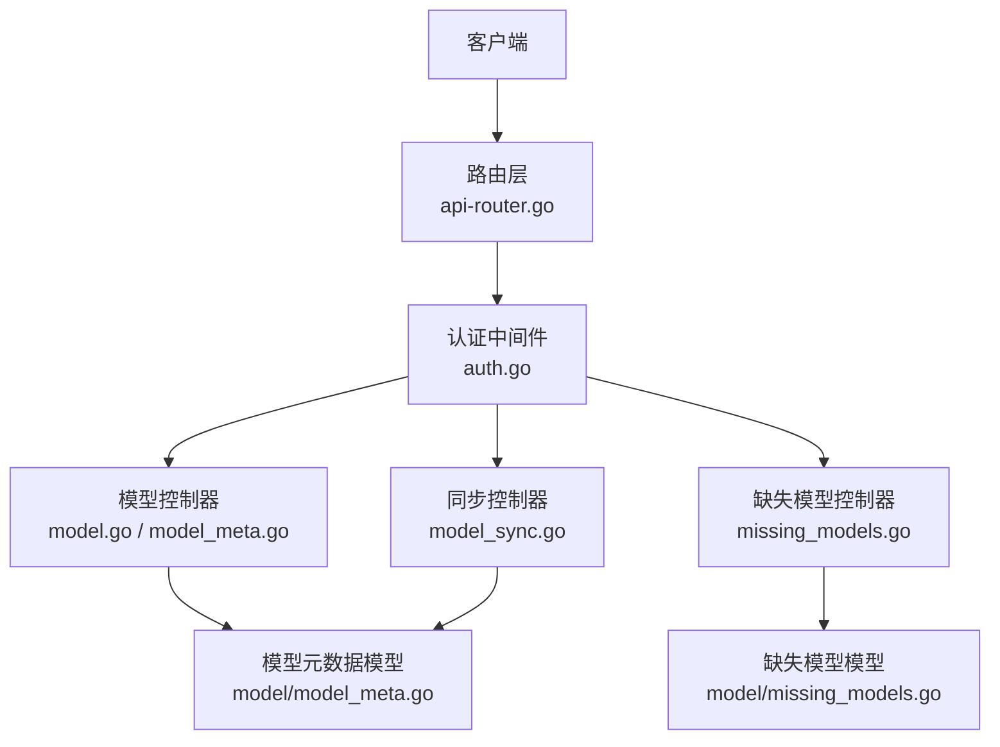
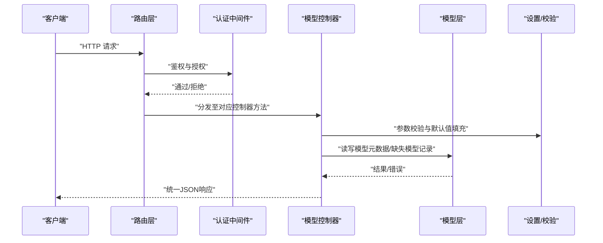
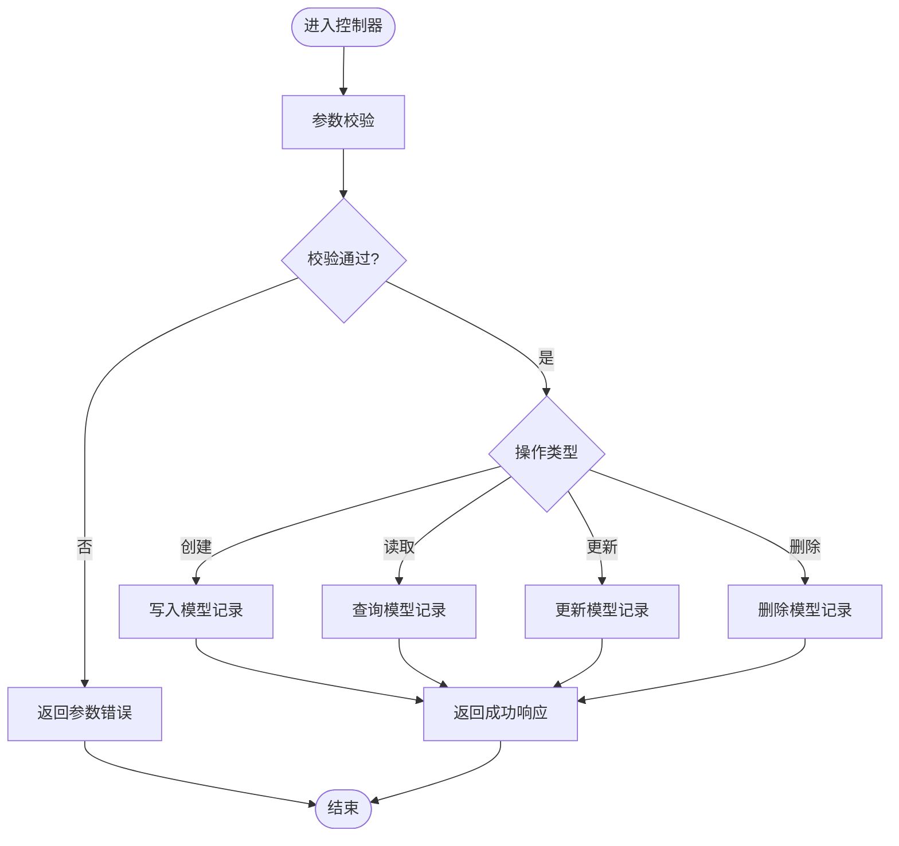
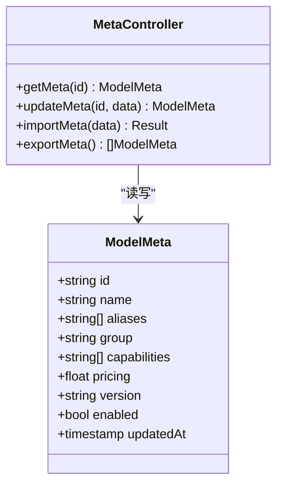
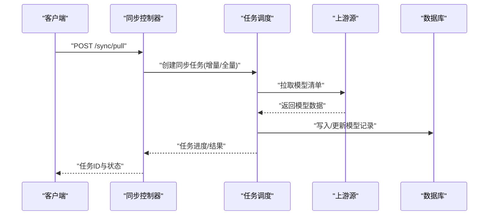
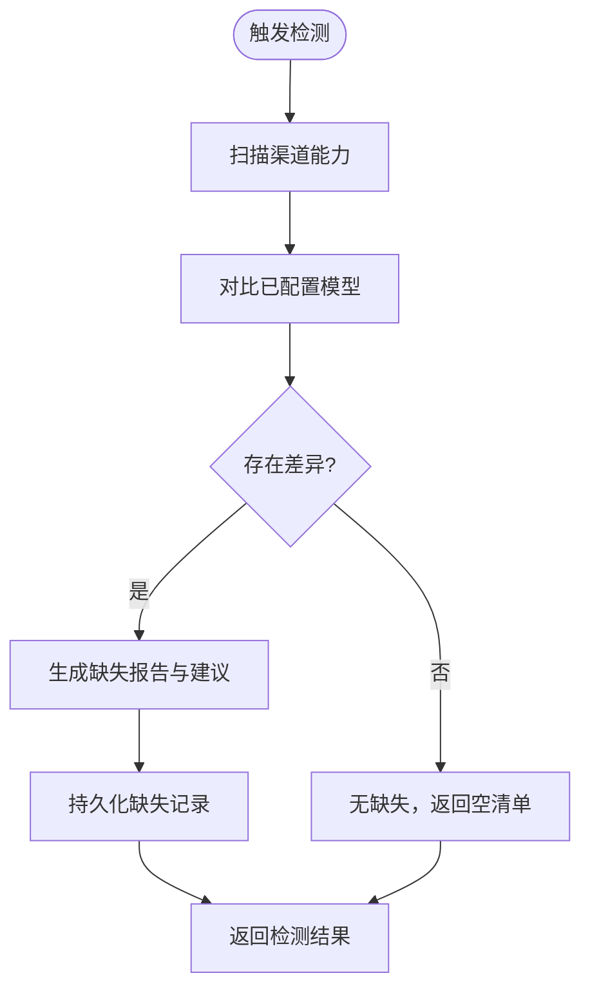
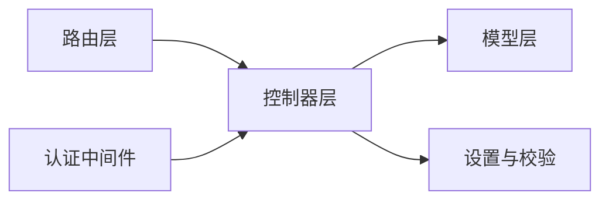

# 模型管理API

<cite>
**本文引用的文件**   
- [controller/model.go](file://controller/model.go)
- [controller/model_meta.go](file://controller/model_meta.go)
- [controller/model_sync.go](file://controller/model_sync.go)
- [controller/missing_models.go](file://controller/missing_models.go)
- [model/model_meta.go](file://model/model_meta.go)
- [model/missing_models.go](file://model/missing_models.go)
- [router/api-router.go](file://router/api-router.go)
- [middleware/auth.go](file://middleware/auth.go)
- [setting/model_setting/global.go](file://setting/model_setting/global.go)
</cite>

## 目录
1. [简介](#简介)
2. [项目结构](#项目结构)
3. [核心组件](#核心组件)
4. [架构总览](#架构总览)
5. [详细组件分析](#详细组件分析)
6. [依赖关系分析](#依赖关系分析)
7. [性能考虑](#性能考虑)
8. [故障排查指南](#故障排查指南)
9. [结论](#结论)
10. [附录](#附录)

## 简介
本文件为“模型管理API”的权威文档，覆盖模型的CRUD、元数据管理、模型同步、缺失模型检测、配置验证、批量操作、版本管理、状态监控与性能指标、同步策略以及最佳实践与自动化部署建议。读者可据此快速集成前端或运维脚本，完成模型全生命周期管理。

## 项目结构
模型管理相关能力由控制器层（controller）、模型层（model）、路由注册（router）与中间件（middleware）共同实现：
- 控制器层负责HTTP请求解析、鉴权校验、参数校验、调用服务逻辑并返回统一响应。
- 模型层定义持久化结构与数据库访问方法。
- 路由层将URL路径绑定到具体控制器方法。
- 中间件提供认证、授权、限流等横切能力。

**图示来源**
- [router/api-router.go](file://router/api-router.go)
- [middleware/auth.go](file://middleware/auth.go)
- [controller/model.go](file://controller/model.go)
- [controller/model_meta.go](file://controller/model_meta.go)
- [controller/model_sync.go](file://controller/model_sync.go)
- [controller/missing_models.go](file://controller/missing_models.go)
- [model/model_meta.go](file://model/model_meta.go)
- [model/missing_models.go](file://model/missing_models.go)

**章节来源**
- [router/api-router.go](file://router/api-router.go)
- [middleware/auth.go](file://middleware/auth.go)

## 核心组件
- 模型CRUD控制器：提供模型的创建、读取、更新、删除与列表查询接口。
- 模型元数据控制器：维护模型的名称、别名、分组、能力标签、定价、版本等元信息。
- 模型同步控制器：支持从上游源拉取或推送模型清单，触发增量/全量同步任务。
- 缺失模型检测控制器：扫描可用渠道与已配置模型差异，输出缺失清单与修复建议。
- 模型设置与验证：基于全局模型设置进行参数校验与默认值填充。
- 权限与认证：通过中间件对请求进行身份与权限校验，确保仅授权用户可执行敏感操作。

**章节来源**
- [controller/model.go](file://controller/model.go)
- [controller/model_meta.go](file://controller/model_meta.go)
- [controller/model_sync.go](file://controller/model_sync.go)
- [controller/missing_models.go](file://controller/missing_models.go)
- [setting/model_setting/global.go](file://setting/model_setting/global.go)

## 架构总览
下图展示了模型管理API的请求处理流程，包括鉴权、路由分发、控制器处理、模型持久化与缓存交互。

**图示来源**
- [router/api-router.go](file://router/api-router.go)
- [middleware/auth.go](file://middleware/auth.go)
- [controller/model.go](file://controller/model.go)
- [controller/model_meta.go](file://controller/model_meta.go)
- [controller/model_sync.go](file://controller/model_sync.go)
- [controller/missing_models.go](file://controller/missing_models.go)
- [model/model_meta.go](file://model/model_meta.go)
- [model/missing_models.go](file://model/missing_models.go)

## 详细组件分析

### 模型CRUD接口
- 功能概述
  - 创建模型：新增一条模型记录，包含基础信息与元数据。
  - 读取模型：按ID或条件获取单条或多条模型记录。
  - 更新模型：修改模型属性与元数据，支持部分更新。
  - 删除模型：软删除或硬删除模型记录。
  - 列表查询：分页、过滤、排序与字段投影。
- 典型HTTP模式
  - POST /api/models：创建模型
  - GET /api/models/{id}：获取模型详情
  - PUT /api/models/{id}：更新模型
  - DELETE /api/models/{id}：删除模型
  - GET /api/models：列表查询（支持分页、过滤、排序）
- 请求/响应要点
  - 请求体需包含必填字段与格式校验；服务端返回统一结构，包含数据、分页信息与错误码。
  - 列表接口支持常见过滤键（如分组、能力标签、状态）。
- 权限控制
  - 读操作通常允许受信任角色；写操作需要管理员或模型管理员角色。
- 错误处理
  - 参数非法返回400；资源不存在返回404；权限不足返回403；并发冲突返回409。

**图示来源**
- [controller/model.go](file://controller/model.go)

**章节来源**
- [controller/model.go](file://controller/model.go)

### 模型元数据管理
- 功能概述
  - 维护模型名称、别名、分组、能力标签、定价策略、版本、启用状态等元数据。
  - 支持批量导入/导出与模板化配置。
- 典型HTTP模式
  - GET /api/models/meta：获取模型元数据集合
  - PUT /api/models/meta/{id}：更新模型元数据
  - POST /api/models/meta/import：批量导入元数据
  - GET /api/models/meta/export：导出当前元数据
- 配置验证
  - 依据全局模型设置进行字段校验、默认值填充与约束检查。
- 权限控制
  - 元数据变更通常需要更高权限（如管理员）。

**图示来源**
- [controller/model_meta.go](file://controller/model_meta.go)
- [model/model_meta.go](file://model/model_meta.go)

**章节来源**
- [controller/model_meta.go](file://controller/model_meta.go)
- [model/model_meta.go](file://model/model_meta.go)
- [setting/model_setting/global.go](file://setting/model_setting/global.go)

### 模型同步
- 功能概述
  - 支持从上游源（如渠道、远端仓库）拉取模型清单，或向目标推送本地变更。
  - 支持增量与全量同步策略，具备幂等性与冲突解决机制。
- 典型HTTP模式
  - POST /api/models/sync/pull：从上游拉取模型清单
  - POST /api/models/sync/push：推送本地变更到上游
  - GET /api/models/sync/tasks：查询同步任务状态
  - GET /api/models/sync/tasks/{taskId}：获取任务详情
- 同步策略
  - 增量：仅同步变更项，减少网络与IO开销。
  - 全量：覆盖式同步，保证一致性但成本较高。
  - 冲突：以时间戳或版本号为准，保留最新或指定策略。
- 权限控制
  - 同步操作通常需要管理员或同步操作员角色。

**图示来源**
- [controller/model_sync.go](file://controller/model_sync.go)

**章节来源**
- [controller/model_sync.go](file://controller/model_sync.go)

### 缺失模型检测
- 功能概述
  - 扫描渠道能力与已配置模型差异，输出缺失模型清单与修复建议。
  - 支持定时任务与手动触发。
- 典型HTTP模式
  - POST /api/models/missing/detect：触发缺失检测
  - GET /api/models/missing/list：获取缺失清单
  - GET /api/models/missing/stats：统计缺失情况
- 输出内容
  - 缺失模型ID、建议来源、优先级、影响范围与修复步骤。
- 权限控制
  - 检测与查看清单通常需要管理员或审计员角色。

**图示来源**
- [controller/missing_models.go](file://controller/missing_models.go)
- [model/missing_models.go](file://model/missing_models.go)

**章节来源**
- [controller/missing_models.go](file://controller/missing_models.go)
- [model/missing_models.go](file://model/missing_models.go)

### 批量操作接口
- 功能概述
  - 支持批量创建、更新、删除与导入导出，提升运维效率。
- 典型HTTP模式
  - POST /api/models/batch/create：批量创建
  - POST /api/models/batch/update：批量更新
  - POST /api/models/batch/delete：批量删除
  - POST /api/models/batch/import：批量导入
  - GET /api/models/batch/export：批量导出
- 注意事项
  - 批量操作需限制单次大小与速率，避免阻塞系统。
  - 失败回滚或部分成功策略需明确。

**章节来源**
- [controller/model.go](file://controller/model.go)
- [controller/model_meta.go](file://controller/model_meta.go)

### 版本管理
- 功能概述
  - 模型元数据包含版本号，支持历史版本回溯与发布策略。
- 典型HTTP模式
  - GET /api/models/{id}/versions：获取版本列表
  - POST /api/models/{id}/publish：发布新版本
  - GET /api/models/{id}/versions/{version}：获取特定版本详情
- 策略
  - 语义化版本控制；发布前进行完整性校验。

**章节来源**
- [controller/model_meta.go](file://controller/model_meta.go)
- [model/model_meta.go](file://model/model_meta.go)

### 状态监控与性能指标
- 功能概述
  - 暴露模型健康状态、同步任务进度、错误率与延迟指标。
- 典型HTTP模式
  - GET /api/models/status：模型状态概览
  - GET /api/models/metrics：性能指标（QPS、延迟、错误率）
  - GET /api/models/sync/tasks/{taskId}/metrics：任务级指标
- 采集方式
  - 内存计数器与定期上报，支持外部监控系统抓取。

**章节来源**
- [controller/model_sync.go](file://controller/model_sync.go)
- [controller/model_meta.go](file://controller/model_meta.go)

## 依赖关系分析
- 控制器依赖模型层进行数据持久化。
- 路由层将URL映射到控制器方法。
- 中间件提供认证与授权，保护敏感接口。
- 设置模块提供配置校验与默认值。

**图示来源**
- [router/api-router.go](file://router/api-router.go)
- [middleware/auth.go](file://middleware/auth.go)
- [controller/model.go](file://controller/model.go)
- [controller/model_meta.go](file://controller/model_meta.go)
- [controller/model_sync.go](file://controller/model_sync.go)
- [controller/missing_models.go](file://controller/missing_models.go)
- [model/model_meta.go](file://model/model_meta.go)
- [model/missing_models.go](file://model/missing_models.go)
- [setting/model_setting/global.go](file://setting/model_setting/global.go)

**章节来源**
- [router/api-router.go](file://router/api-router.go)
- [middleware/auth.go](file://middleware/auth.go)

## 性能考虑
- 批量操作应限制批次大小与并发度，避免内存峰值过高。
- 同步任务采用异步队列与重试机制，降低阻塞风险。
- 列表查询使用分页与索引优化，减少全表扫描。
- 指标采集使用轻量计数器，避免频繁锁竞争。
- 缓存热点数据（如模型元数据），提高读性能。

[本节为通用指导，不直接分析具体文件]

## 故障排查指南
- 常见问题
  - 参数校验失败：检查请求体字段类型与必填项。
  - 权限不足：确认用户角色与资源权限分配。
  - 同步失败：检查上游连通性、认证凭据与网络策略。
  - 缺失模型持续出现：核对渠道能力与模型配置一致性。
- 诊断步骤
  - 查看任务日志与错误码。
  - 检查模型状态与版本一致性。
  - 使用指标接口定位瓶颈与异常点。

**章节来源**
- [controller/model_sync.go](file://controller/model_sync.go)
- [controller/missing_models.go](file://controller/missing_models.go)

## 结论
模型管理API提供了完整的模型生命周期管理能力，涵盖CRUD、元数据、同步、缺失检测、批量操作与版本管理。通过清晰的权限控制与性能优化策略，可满足生产环境的稳定运行需求。建议结合自动化部署与监控告警，实现高效运维。

[本节为总结性内容，不直接分析具体文件]

## 附录
- 最佳实践
  - 使用语义化版本管理模型发布。
  - 通过批量导入模板标准化模型配置。
  - 定期执行缺失模型检测，保持渠道与模型一致。
  - 对敏感接口启用强鉴权与审计日志。
- 自动化部署
  - 使用CI/CD流水线触发模型同步与验证。
  - 通过配置中心管理模型设置与开关。
  - 结合容器编排进行水平扩展与弹性伸缩。

[本节为通用指导，不直接分析具体文件]