# 渠道管理API

<cite>
**本文引用的文件**
- [router/channel-router.go](file://router/channel-router.go)
- [controller/channel.go](file://controller/channel.go)
- [controller/channel-test.go](file://controller/channel-test.go)
- [controller/channel_upstream_update.go](file://controller/channel_upstream_update.go)
- [model/channel.go](file://model/channel.go)
- [dto/channel_settings.go](file://dto/channel_settings.go)
- [service/channel.go](file://service/channel.go)
- [middleware/auth.go](file://middleware/auth.go)
- [constant/channel.go](file://constant/channel.go)
- [types/error.go](file://types/error.go)
- [common/performance_config.go](file://common/performance_config.go)
</cite>

## 目录
1. [简介](#简介)
2. [项目结构](#项目结构)
3. [核心组件](#核心组件)
4. [架构总览](#架构总览)
5. [详细组件分析](#详细组件分析)
6. [依赖分析](#依赖分析)
7. [性能考虑](#性能考虑)
8. [故障排除指南](#故障排除指南)
9. [结论](#结论)
10. [附录](#附录)

## 简介
本文件为“渠道管理API”的权威文档，覆盖渠道的CRUD、渠道测试、渠道认证、上游更新、配置校验、批量操作、高级查询、状态管理与错误处理、以及性能监控接口。读者可据此完成渠道全生命周期管理、集成与排障。

## 项目结构
渠道管理相关代码主要分布在以下模块：
- 路由层：定义HTTP端点与路径映射
- 控制器层：请求解析、鉴权、参数校验、调用服务层
- 服务层：业务编排、数据访问、缓存与并发控制
- 模型与DTO：数据结构定义与校验规则
- 中间件：认证、限流、审计等横切能力
- 常量与错误类型：统一的状态码与错误语义

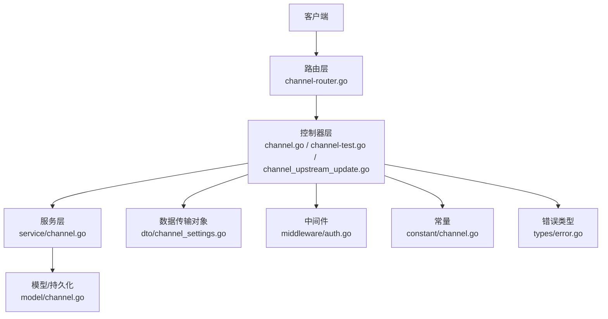

**图表来源**
- [router/channel-router.go](file://router/channel-router.go)
- [controller/channel.go](file://controller/channel.go)
- [controller/channel-test.go](file://controller/channel-test.go)
- [controller/channel_upstream_update.go](file://controller/channel_upstream_update.go)
- [service/channel.go](file://service/channel.go)
- [model/channel.go](file://model/channel.go)
- [dto/channel_settings.go](file://dto/channel_settings.go)
- [middleware/auth.go](file://middleware/auth.go)
- [constant/channel.go](file://constant/channel.go)
- [types/error.go](file://types/error.go)

**章节来源**
- [router/channel-router.go](file://router/channel-router.go)
- [controller/channel.go](file://controller/channel.go)
- [controller/channel-test.go](file://controller/channel-test.go)
- [controller/channel_upstream_update.go](file://controller/channel_upstream_update.go)
- [service/channel.go](file://service/channel.go)
- [model/channel.go](file://model/channel.go)
- [dto/channel_settings.go](file://dto/channel_settings.go)
- [middleware/auth.go](file://middleware/auth.go)
- [constant/channel.go](file://constant/channel.go)
- [types/error.go](file://types/error.go)

## 核心组件
- 路由注册：集中声明渠道相关RESTful端点，绑定到对应控制器方法
- 控制器：负责鉴权、参数校验、调用服务层、返回统一响应
- 服务层：实现渠道CRUD、测试连通性、认证流程、上游同步、批量操作、高级查询
- 模型与DTO：定义渠道实体字段、校验规则、默认值与枚举
- 中间件：统一认证、权限控制、限流、审计日志
- 常量与错误：渠道类型、状态、错误码与消息模板

**章节来源**
- [router/channel-router.go](file://router/channel-router.go)
- [controller/channel.go](file://controller/channel.go)
- [service/channel.go](file://service/channel.go)
- [model/channel.go](file://model/channel.go)
- [dto/channel_settings.go](file://dto/channel_settings.go)
- [middleware/auth.go](file://middleware/auth.go)
- [constant/channel.go](file://constant/channel.go)
- [types/error.go](file://types/error.go)

## 架构总览
渠道管理API采用分层架构：
- 路由层将HTTP请求分发至控制器
- 控制器进行鉴权与参数校验后委托服务层执行业务逻辑
- 服务层协调模型、缓存、外部系统（如上游API）完成操作
- 统一的错误与响应格式贯穿全链路

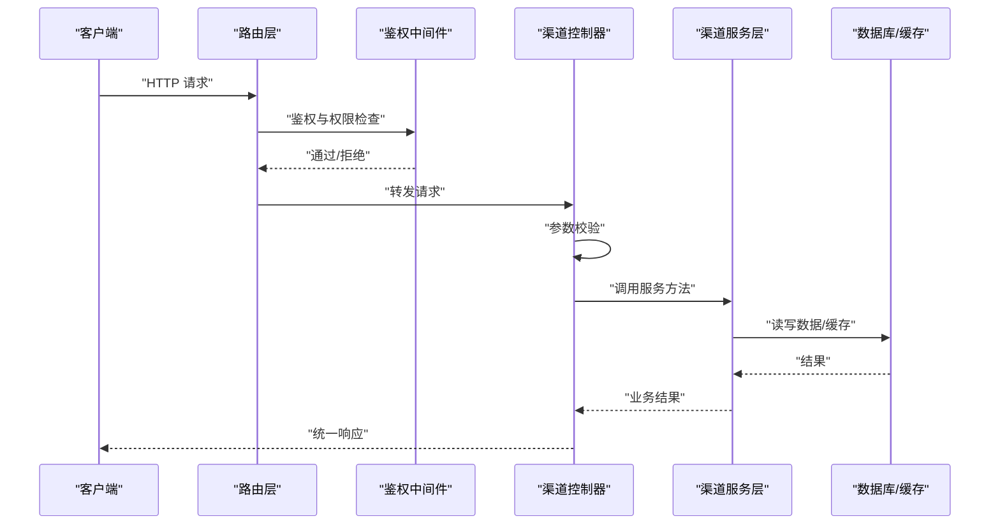

**图表来源**
- [router/channel-router.go](file://router/channel-router.go)
- [middleware/auth.go](file://middleware/auth.go)
- [controller/channel.go](file://controller/channel.go)
- [service/channel.go](file://service/channel.go)
- [model/channel.go](file://model/channel.go)

## 详细组件分析

### 渠道CRUD接口
- 创建渠道
  - HTTP方法与路径：POST /api/channels
  - 请求体：渠道配置DTO（包含名称、类型、密钥、基础URL、超时、重试、代理等）
  - 响应：创建成功的渠道对象或错误信息
  - 权限：需要管理员或具备渠道写权限的角色
  - 校验：必填字段、格式校验、唯一性约束
- 更新渠道
  - HTTP方法与路径：PUT /api/channels/{id}
  - 请求体：可更新的字段集合
  - 响应：更新后的渠道对象或错误信息
  - 权限：同上
  - 校验：增量更新时的字段合法性
- 删除渠道
  - HTTP方法与路径：DELETE /api/channels/{id}
  - 响应：删除成功或错误信息
  - 权限：同上
  - 前置条件：渠道未被任务引用或处于禁用状态
- 获取渠道详情
  - HTTP方法与路径：GET /api/channels/{id}
  - 响应：渠道完整信息或错误信息
  - 权限：具备渠道读权限即可
- 列表查询
  - HTTP方法与路径：GET /api/channels
  - 查询参数：分页、排序、过滤（类型、状态、关键词）
  - 响应：分页结果集

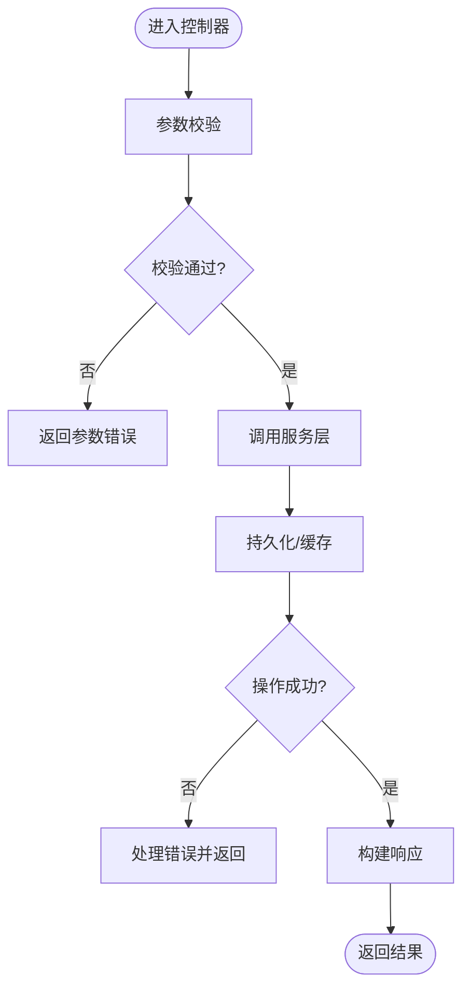

**图表来源**
- [controller/channel.go](file://controller/channel.go)
- [service/channel.go](file://service/channel.go)
- [dto/channel_settings.go](file://dto/channel_settings.go)
- [model/channel.go](file://model/channel.go)

**章节来源**
- [controller/channel.go](file://controller/channel.go)
- [service/channel.go](file://service/channel.go)
- [dto/channel_settings.go](file://dto/channel_settings.go)
- [model/channel.go](file://model/channel.go)

### 渠道测试接口
- 功能：验证渠道连通性与认证有效性
- HTTP方法与路径：POST /api/channels/{id}/test
- 请求体：可选覆盖参数（如超时、代理）
- 响应：测试结果（连通性、延迟、认证状态、错误详情）
- 权限：具备渠道写权限
- 注意事项：避免高频触发；支持异步模式用于长耗时测试

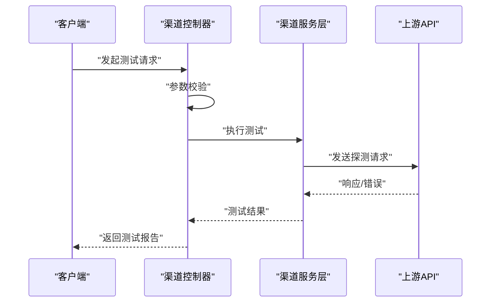

**图表来源**
- [controller/channel-test.go](file://controller/channel-test.go)
- [service/channel.go](file://service/channel.go)

**章节来源**
- [controller/channel-test.go](file://controller/channel-test.go)
- [service/channel.go](file://service/channel.go)

### 渠道认证接口
- 功能：刷新或校验渠道认证令牌、OAuth回调处理
- HTTP方法与路径：
  - POST /api/channels/{id}/auth/refresh
  - GET /api/channels/{id}/auth/status
  - POST /api/channels/{id}/auth/callback（特定提供商）
- 请求体：根据提供商而定（授权码、刷新令牌等）
- 响应：认证状态、令牌有效期、错误信息
- 权限：具备渠道写权限
- 安全：敏感字段加密存储、最小权限原则

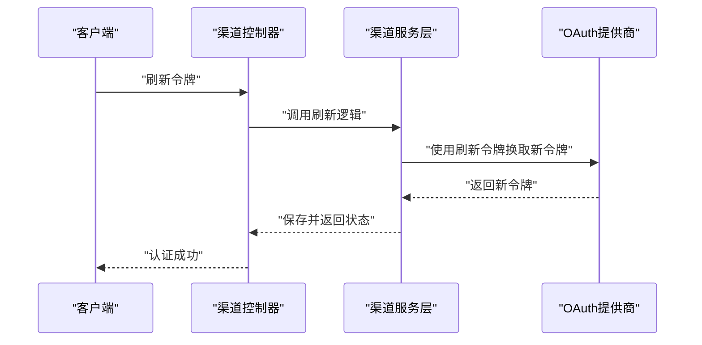

**图表来源**
- [controller/channel.go](file://controller/channel.go)
- [service/channel.go](file://service/channel.go)

**章节来源**
- [controller/channel.go](file://controller/channel.go)
- [service/channel.go](file://service/channel.go)

### 上游更新接口
- 功能：拉取或同步上游模型列表、定价、能力元数据
- HTTP方法与路径：POST /api/channels/{id}/upstream/sync
- 请求体：可选策略（强制刷新、增量同步）
- 响应：同步结果（新增/更新/删除数量、错误明细）
- 权限：具备渠道写权限
- 并发：支持队列化与重试机制

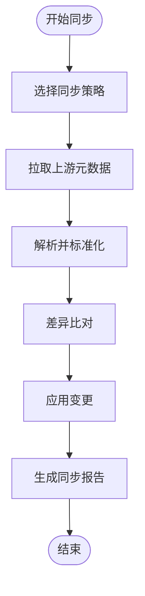

**图表来源**
- [controller/channel_upstream_update.go](file://controller/channel_upstream_update.go)
- [service/channel.go](file://service/channel.go)

**章节来源**
- [controller/channel_upstream_update.go](file://controller/channel_upstream_update.go)
- [service/channel.go](file://service/channel.go)

### 批量操作接口
- 功能：批量启用/禁用、删除、导入导出渠道
- HTTP方法与路径：
  - PUT /api/channels/batch/status
  - DELETE /api/channels/batch
  - POST /api/channels/import
  - GET /api/channels/export
- 请求体：ID列表、操作类型、导入文件格式
- 响应：批量操作结果统计与错误明细
- 权限：管理员或具备批量操作权限
- 事务：保证原子性或提供回滚策略

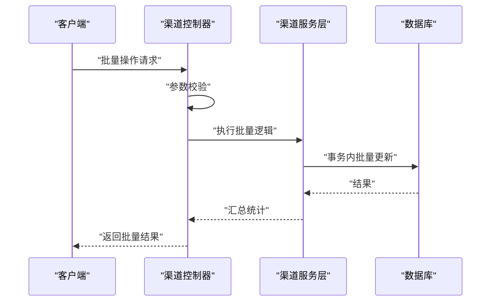

**图表来源**
- [controller/channel.go](file://controller/channel.go)
- [service/channel.go](file://service/channel.go)

**章节来源**
- [controller/channel.go](file://controller/channel.go)
- [service/channel.go](file://service/channel.go)

### 高级查询接口
- 功能：复杂条件筛选、聚合统计、导出
- HTTP方法与路径：GET /api/channels/search
- 查询参数：多条件组合、时间范围、指标聚合
- 响应：结构化查询结果与元数据
- 权限：具备渠道读权限
- 性能：索引优化、分页限制、缓存热点

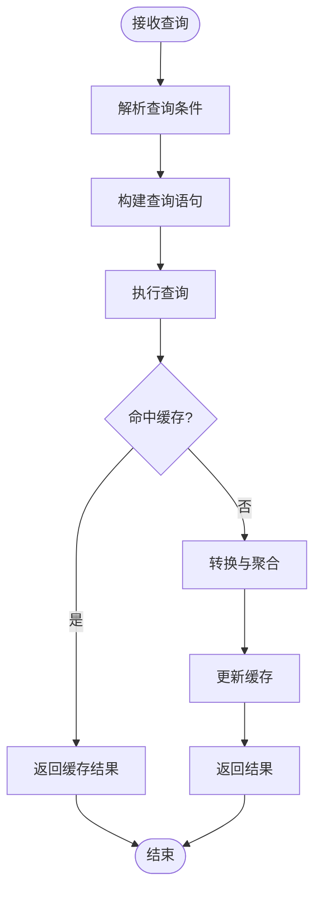

**图表来源**
- [controller/channel.go](file://controller/channel.go)
- [service/channel.go](file://service/channel.go)

**章节来源**
- [controller/channel.go](file://controller/channel.go)
- [service/channel.go](file://service/channel.go)

### 渠道状态管理
- 状态枚举：启用、禁用、测试中、异常、维护中
- 状态流转：通过更新接口或批量接口变更
- 事件通知：状态变更触发审计日志与监控告警
- 一致性：分布式锁防止竞态条件

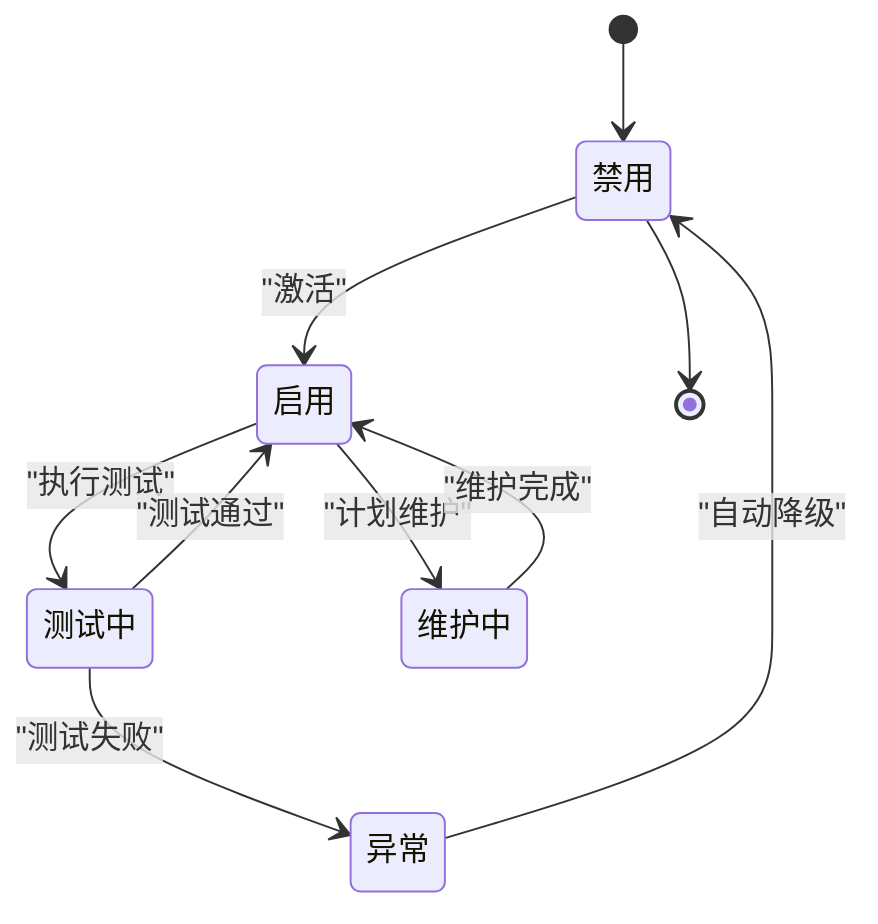

**图表来源**
- [constant/channel.go](file://constant/channel.go)
- [model/channel.go](file://model/channel.go)

**章节来源**
- [constant/channel.go](file://constant/channel.go)
- [model/channel.go](file://model/channel.go)

### 错误处理与响应规范
- 统一错误码：业务错误、参数错误、权限错误、系统错误
- 错误信息：包含错误码、消息、追踪ID、建议操作
- 日志记录：关键路径与异常堆栈
- 重试策略：幂等接口支持指数退避

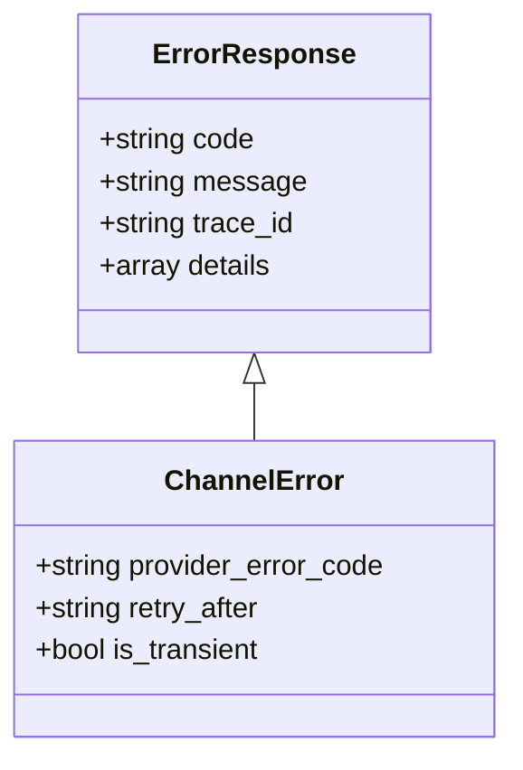

**图表来源**
- [types/error.go](file://types/error.go)

**章节来源**
- [types/error.go](file://types/error.go)

### 性能监控接口
- 指标采集：QPS、延迟分布、错误率、资源使用
- 健康检查：/api/health、/api/channels/{id}/health
- 慢查询分析：SQL与外部调用耗时
- 告警规则：阈值配置与通知通道

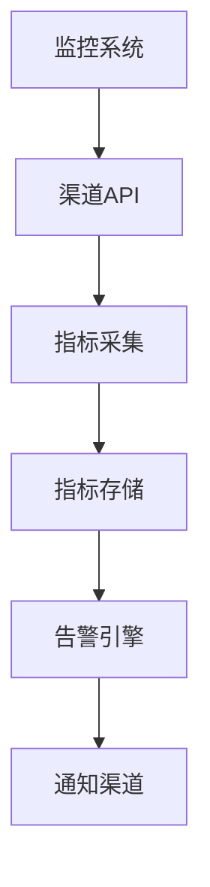

**图表来源**
- [common/performance_config.go](file://common/performance_config.go)

**章节来源**
- [common/performance_config.go](file://common/performance_config.go)

## 依赖分析
- 路由依赖控制器，控制器依赖服务层，服务层依赖模型与外部系统
- 中间件在路由层之后、控制器之前执行，确保鉴权与限流
- 常量与错误类型被多处复用，保证一致性

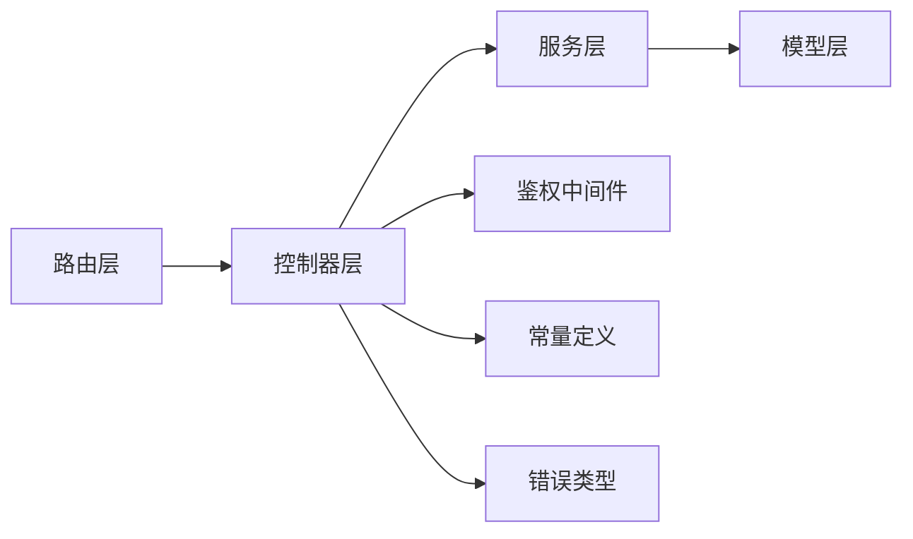

**图表来源**
- [router/channel-router.go](file://router/channel-router.go)
- [controller/channel.go](file://controller/channel.go)
- [service/channel.go](file://service/channel.go)
- [model/channel.go](file://model/channel.go)
- [middleware/auth.go](file://middleware/auth.go)
- [constant/channel.go](file://constant/channel.go)
- [types/error.go](file://types/error.go)

**章节来源**
- [router/channel-router.go](file://router/channel-router.go)
- [controller/channel.go](file://controller/channel.go)
- [service/channel.go](file://service/channel.go)
- [model/channel.go](file://model/channel.go)
- [middleware/auth.go](file://middleware/auth.go)
- [constant/channel.go](file://constant/channel.go)
- [types/error.go](file://types/error.go)

## 性能考虑
- 连接池：上游HTTP连接复用与超时控制
- 缓存：热点渠道配置与测试结果缓存
- 限流：按渠道与用户维度限流
- 异步：长耗时操作（如上游同步）采用队列与重试
- 监控：关键指标埋点与可视化

[本节为通用指导，不直接分析具体文件]

## 故障排除指南
- 常见问题：
  - 认证失败：检查密钥、域名、证书、网络连通性
  - 上游同步失败：查看速率限制、模型列表变更、解析错误
  - 性能问题：分析慢查询、连接池耗尽、内存泄漏
- 诊断步骤：
  - 启用调试日志与追踪ID
  - 使用测试接口验证连通性
  - 检查监控指标与告警
- 恢复策略：
  - 回滚配置变更
  - 切换备用渠道
  - 重启服务或清理缓存

**章节来源**
- [controller/channel-test.go](file://controller/channel-test.go)
- [controller/channel_upstream_update.go](file://controller/channel_upstream_update.go)
- [common/performance_config.go](file://common/performance_config.go)

## 结论
渠道管理API提供了完整的渠道生命周期管理能力，涵盖CRUD、测试、认证、上游同步、批量操作、高级查询、状态管理与性能监控。通过分层架构与统一错误处理，确保了系统的可维护性与可扩展性。遵循最佳实践可有效提升稳定性与性能。

[本节为总结性内容，不直接分析具体文件]

## 附录
- 术语表：渠道、上游、认证、配额、计费
- 参考链接：OpenAPI规范、部署指南、安全最佳实践
- 版本历史：变更记录与兼容性说明

[本节为补充信息，不直接分析具体文件]