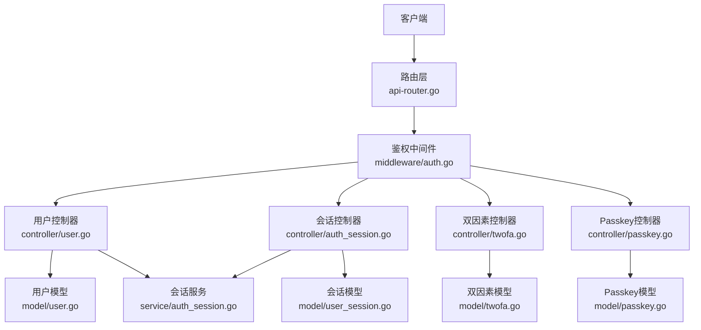
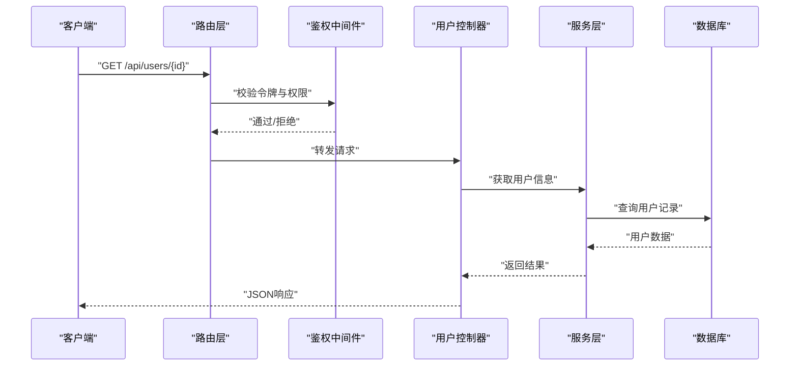
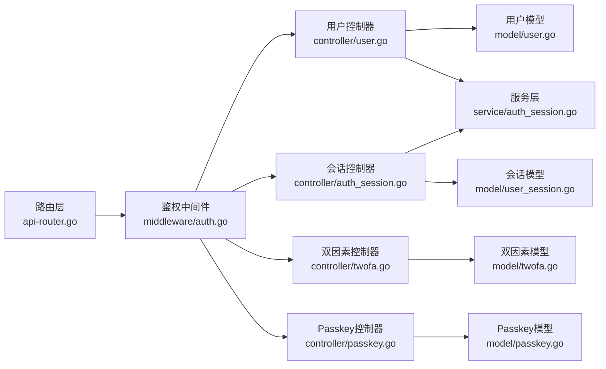

# 用户管理API

<cite>
**本文档引用的文件**
- [controller/user.go](file://controller/user.go)
- [controller/twofa.go](file://controller/twofa.go)
- [controller/passkey.go](file://controller/passkey.go)
- [controller/auth_session.go](file://controller/auth_session.go)
- [model/user.go](file://model/user.go)
- [model/user_session.go](file://model/user_session.go)
- [model/twofa.go](file://model/twofa.go)
- [model/passkey.go](file://model/passkey.go)
- [middleware/auth.go](file://middleware/auth.go)
- [router/api-router.go](file://router/api-router.go)
- [service/auth_session.go](file://service/auth_session.go)
- [dto/request_common.go](file://dto/request_common.go)
- [common/session_cookie.go](file://common/session_cookie.go)
</cite>

## 目录
1. [简介](#简介)
2. [项目结构](#项目结构)
3. [核心组件](#核心组件)
4. [架构总览](#架构总览)
5. [详细组件分析](#详细组件分析)
6. [依赖分析](#依赖分析)
7. [性能考虑](#性能考虑)
8. [故障排查指南](#故障排查指南)
9. [结论](#结论)
10. [附录](#附录)

## 简介
本文件为用户管理API的权威文档，覆盖以下能力：
- 用户CRUD（创建、读取、更新、删除）与批量操作
- 会话管理（登录、登出、刷新、状态查询）
- 双因素认证（TOTP启用/验证/重置）
- Passkey认证（注册、认证流程）
- 权限控制与安全审计接口
- 用户状态管理与安全设置
- 最佳实践与安全配置建议

该API基于REST风格设计，采用JWT或Cookie会话进行鉴权，支持管理员与常规用户的差异化权限。所有敏感操作均需要相应权限并通过中间件校验。

## 项目结构
用户管理相关代码主要分布在以下模块：
- controller：HTTP控制器，定义路由处理逻辑
- model：数据模型与持久化实体
- middleware：鉴权、审计等横切关注点
- router：路由注册与分组
- service：业务服务层（如会话服务）
- dto：请求/响应数据结构
- common：通用工具（如Session Cookie处理）

图表来源
- [router/api-router.go](file://router/api-router.go)
- [middleware/auth.go](file://middleware/auth.go)
- [controller/user.go](file://controller/user.go)
- [controller/auth_session.go](file://controller/auth_session.go)
- [controller/twofa.go](file://controller/twofa.go)
- [controller/passkey.go](file://controller/passkey.go)
- [model/user.go](file://model/user.go)
- [model/user_session.go](file://model/user_session.go)
- [model/twofa.go](file://model/twofa.go)
- [model/passkey.go](file://model/passkey.go)
- [service/auth_session.go](file://service/auth_session.go)

章节来源
- [router/api-router.go](file://router/api-router.go)
- [middleware/auth.go](file://middleware/auth.go)

## 核心组件
- 用户控制器（user.go）：提供用户CRUD、状态管理、批量操作、安全设置等接口
- 会话控制器（auth_session.go）：提供登录、登出、刷新、会话查询等接口
- 双因素控制器（twofa.go）：提供TOTP启用、验证、禁用、重置等接口
- Passkey控制器（passkey.go）：提供Passkey注册、认证、管理等接口
- 鉴权中间件（auth.go）：统一鉴权、权限校验、审计日志注入
- 模型层（model/*）：用户、会话、双因素、Passkey的数据结构与持久化
- 服务层（service/auth_session.go）：会话生命周期管理、Token签发与刷新策略

章节来源
- [controller/user.go](file://controller/user.go)
- [controller/auth_session.go](file://controller/auth_session.go)
- [controller/twofa.go](file://controller/twofa.go)
- [controller/passkey.go](file://controller/passkey.go)
- [middleware/auth.go](file://middleware/auth.go)
- [model/user.go](file://model/user.go)
- [model/user_session.go](file://model/user_session.go)
- [model/twofa.go](file://model/twofa.go)
- [model/passkey.go](file://model/passkey.go)
- [service/auth_session.go](file://service/auth_session.go)

## 架构总览
整体采用分层架构：
- 路由层：根据URL模式分发到对应控制器
- 控制器层：参数校验、调用服务层、返回标准化响应
- 服务层：封装业务逻辑（如会话管理、权限判定）
- 模型层：数据库实体映射与持久化
- 中间件：鉴权、限流、审计、CORS等横切功能

图表来源
- [router/api-router.go](file://router/api-router.go)
- [middleware/auth.go](file://middleware/auth.go)
- [controller/user.go](file://controller/user.go)
- [service/auth_session.go](file://service/auth_session.go)
- [model/user.go](file://model/user.go)

## 详细组件分析

### 用户CRUD与批量操作
- 列表与分页：GET /api/users，支持分页、过滤、排序
- 详情：GET /api/users/{id}
- 创建：POST /api/users
- 更新：PUT /api/users/{id}
- 删除：DELETE /api/users/{id}
- 批量操作：POST /api/users/batch（启用/禁用/删除等）
- 状态管理：PATCH /api/users/{id}/status（激活/冻结/注销）
- 安全设置：PATCH /api/users/{id}/security（密码策略、登录限制等）

权限要求：
- 列表/详情：已认证用户可查自身；管理员可查任意用户
- 创建/更新/删除：需管理员权限
- 批量操作：仅管理员可用

错误码：
- 400：参数校验失败
- 401：未认证
- 403：无权限
- 404：用户不存在
- 409：资源冲突（如用户名重复）
- 500：服务器内部错误

章节来源
- [controller/user.go](file://controller/user.go)
- [model/user.go](file://model/user.go)
- [middleware/auth.go](file://middleware/auth.go)

### 会话管理
- 登录：POST /api/auth/login（用户名/密码或第三方）
- 登出：POST /api/auth/logout
- 刷新：POST /api/auth/refresh
- 会话状态：GET /api/auth/session
- 绑定设备：POST /api/auth/devices（可选）
- 撤销会话：DELETE /api/auth/sessions/{sessionId}

认证方式：
- JWT：Authorization: Bearer <token>
- Cookie：Set-Cookie: session=<token>（受SameSite/Secure约束）

会话策略：
- 单设备或多设备并发控制
- 自动过期与主动失效
- 审计日志记录登录/登出事件

章节来源
- [controller/auth_session.go](file://controller/auth_session.go)
- [model/user_session.go](file://model/user_session.go)
- [service/auth_session.go](file://service/auth_session.go)
- [common/session_cookie.go](file://common/session_cookie.go)

### 双因素认证（TOTP）
- 启用：POST /api/auth/2fa/enable（生成二维码与密钥）
- 验证：POST /api/auth/2fa/verify（输入验证码）
- 禁用：POST /api/auth/2fa/disable
- 重置：POST /api/auth/2fa/reset（管理员或自助恢复）
- 状态查询：GET /api/auth/2fa/status

安全要求：
- 启用前需二次确认（密码或会话验证）
- 验证码有效期与重试次数限制
- 审计日志记录启用/验证/重置事件

章节来源
- [controller/twofa.go](file://controller/twofa.go)
- [model/twofa.go](file://model/twofa.go)

### Passkey认证
- 初始化注册：POST /api/auth/passkey/register/start
- 完成注册：POST /api/auth/passkey/register/finish
- 开始认证：POST /api/auth/passkey/authenticate/start
- 完成认证：POST /api/auth/passkey/authenticate/finish
- 列出Passkey：GET /api/auth/passkeys
- 删除Passkey：DELETE /api/auth/passkeys/{id}

浏览器支持：
- WebAuthn API
- 跨平台生物识别/设备PIN

安全特性：
- 防钓鱼（Origin绑定）
- 私钥不出设备
- 抗重放攻击

章节来源
- [controller/passkey.go](file://controller/passkey.go)
- [model/passkey.go](file://model/passkey.go)

### 权限控制与审计
- 权限模型：基于角色的访问控制（RBAC）
- 资源粒度：用户、会话、双因素、Passkey、系统设置
- 审计接口：GET /api/audit/logs（管理员）
- 审计字段：操作人、时间、IP、动作、资源、结果

章节来源
- [middleware/auth.go](file://middleware/auth.go)
- [controller/user.go](file://controller/user.go)

## 依赖分析
用户管理API的关键依赖关系如下：
- 控制器依赖模型与服务层
- 中间件为所有控制器提供统一的鉴权与审计
- 路由层将URL模式映射到控制器方法
- 服务层封装会话、权限等业务逻辑

图表来源
- [router/api-router.go](file://router/api-router.go)
- [middleware/auth.go](file://middleware/auth.go)
- [controller/user.go](file://controller/user.go)
- [controller/auth_session.go](file://controller/auth_session.go)
- [controller/twofa.go](file://controller/twofa.go)
- [controller/passkey.go](file://controller/passkey.go)
- [model/user.go](file://model/user.go)
- [model/user_session.go](file://model/user_session.go)
- [model/twofa.go](file://model/twofa.go)
- [model/passkey.go](file://model/passkey.go)
- [service/auth_session.go](file://service/auth_session.go)

章节来源
- [router/api-router.go](file://router/api-router.go)
- [middleware/auth.go](file://middleware/auth.go)

## 性能考虑
- 分页与过滤：避免全量加载，使用分页参数与索引优化
- 缓存策略：对只读用户信息使用短期缓存
- 连接池：数据库连接复用与超时控制
- 异步处理：批量操作采用任务队列异步执行
- 限流：对登录、验证码等敏感接口实施速率限制

[本节为通用指导，无需特定文件引用]

## 故障排查指南
常见问题与解决步骤：
- 401未认证：检查Authorization头或Cookie是否有效
- 403无权限：确认用户角色与资源权限匹配
- 404用户不存在：核对ID格式与数据一致性
- 409冲突：用户名或邮箱唯一性校验失败
- 会话失效：检查过期时间与刷新机制
- TOTP验证失败：确认时间同步与验证码有效期
- Passkey认证失败：检查浏览器支持与Origin配置

章节来源
- [middleware/auth.go](file://middleware/auth.go)
- [controller/auth_session.go](file://controller/auth_session.go)
- [controller/twofa.go](file://controller/twofa.go)
- [controller/passkey.go](file://controller/passkey.go)

## 结论
用户管理API提供了完整的用户生命周期管理能力，涵盖CRUD、会话、双因素、Passkey等关键功能。通过严格的权限控制与审计机制，确保系统的安全性与可追溯性。建议在生产环境中启用HTTPS、强密码策略、多因素认证与定期安全审计。

[本节为总结性内容，无需特定文件引用]

## 附录

### API端点速查表
- 用户管理
  - GET /api/users
  - GET /api/users/{id}
  - POST /api/users
  - PUT /api/users/{id}
  - DELETE /api/users/{id}
  - PATCH /api/users/{id}/status
  - PATCH /api/users/{id}/security
  - POST /api/users/batch
- 会话管理
  - POST /api/auth/login
  - POST /api/auth/logout
  - POST /api/auth/refresh
  - GET /api/auth/session
  - DELETE /api/auth/sessions/{sessionId}
- 双因素认证
  - POST /api/auth/2fa/enable
  - POST /api/auth/2fa/verify
  - POST /api/auth/2fa/disable
  - POST /api/auth/2fa/reset
  - GET /api/auth/2fa/status
- Passkey认证
  - POST /api/auth/passkey/register/start
  - POST /api/auth/passkey/register/finish
  - POST /api/auth/passkey/authenticate/start
  - POST /api/auth/passkey/authenticate/finish
  - GET /api/auth/passkeys
  - DELETE /api/auth/passkeys/{id}
- 审计
  - GET /api/audit/logs

### 安全配置建议
- 强制HTTPS与HSTS
- 启用CSRF保护（表单提交场景）
- 配置合理的会话过期时间
- 实施密码复杂度与历史策略
- 启用登录失败锁定与验证码
- 定期轮换密钥与证书
- 最小权限原则分配角色

[本节为通用建议，无需特定文件引用]