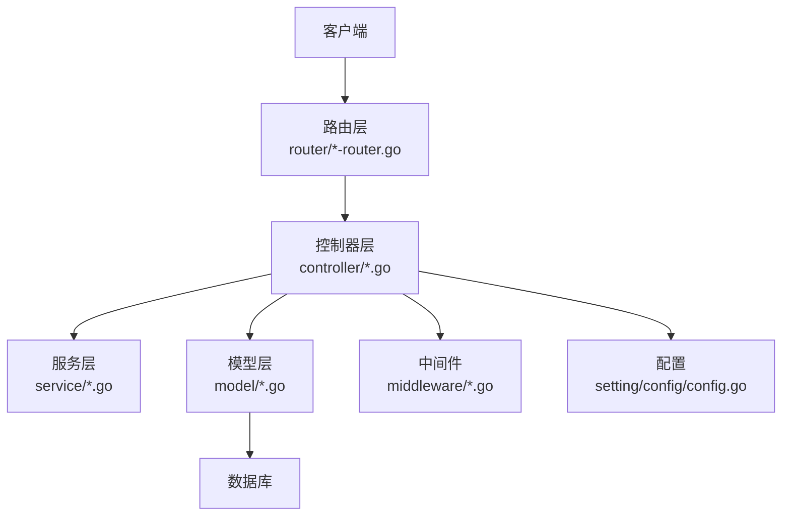
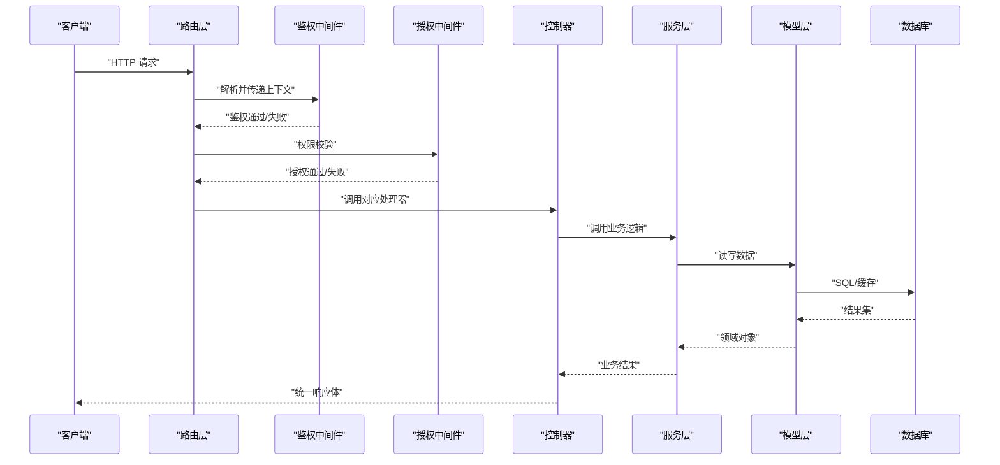
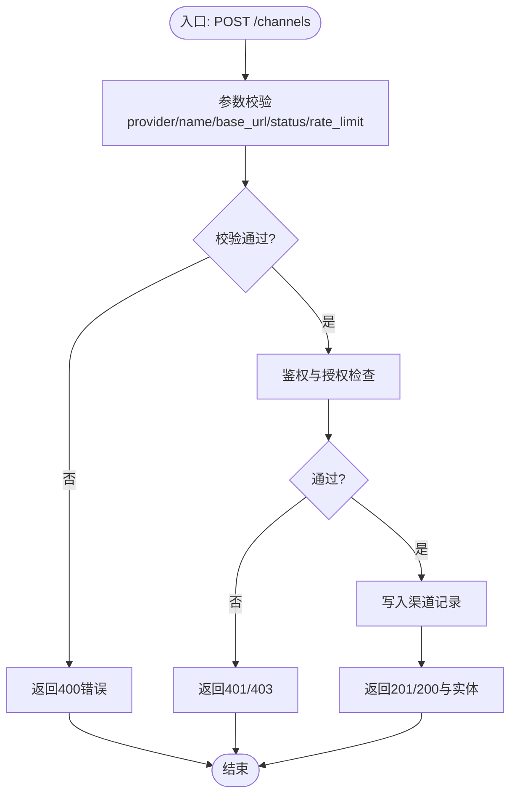
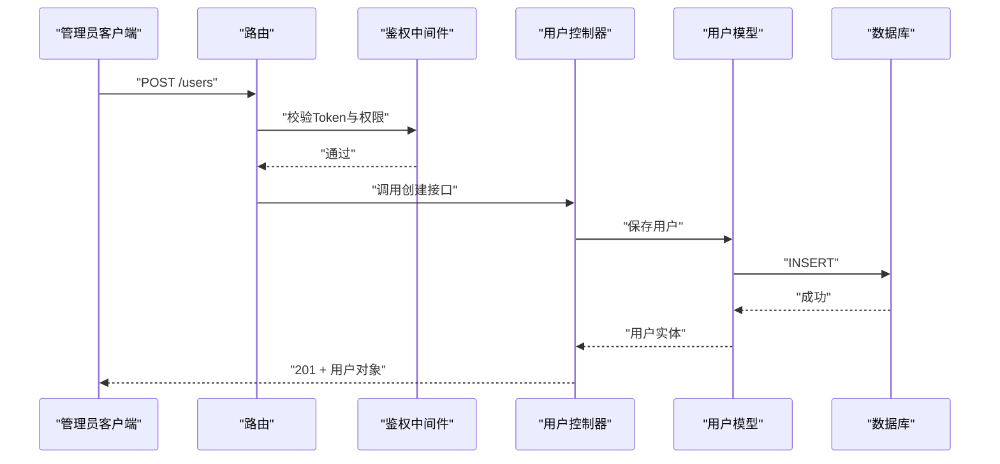
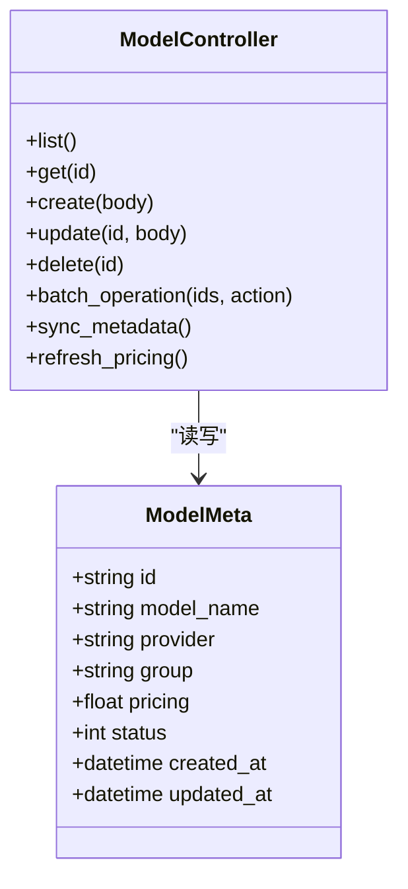
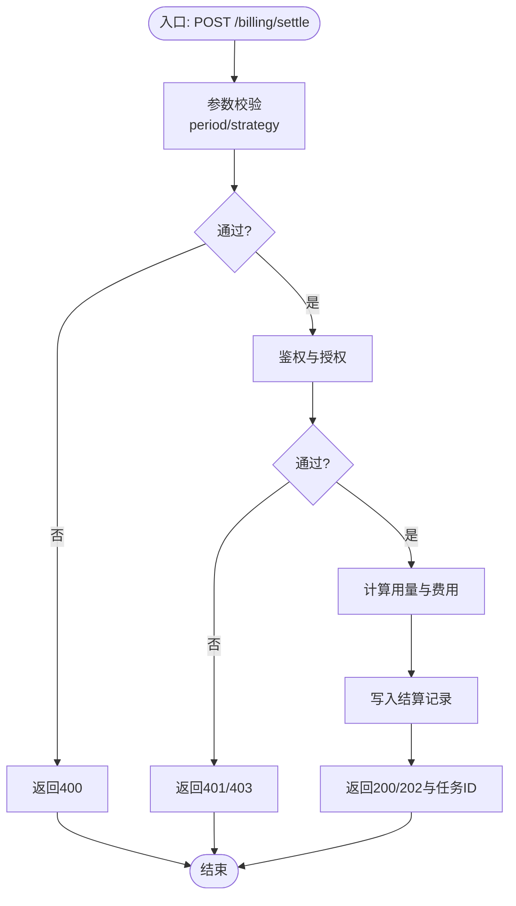
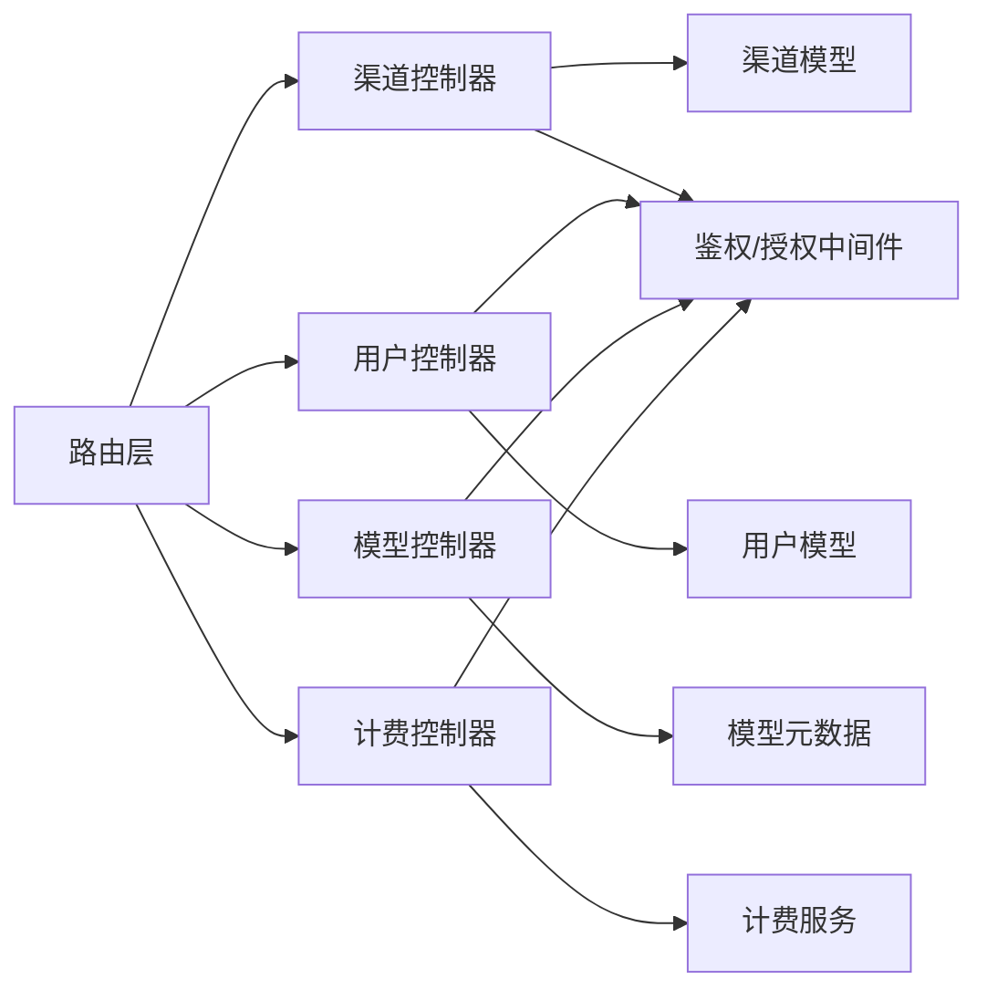

# 管理API

<cite>
**本文引用的文件**   
- [main.go](file://main.go)
- [router/api-router.go](file://router/api-router.go)
- [router/channel-router.go](file://router/channel-router.go)
- [controller/channel.go](file://controller/channel.go)
- [controller/user.go](file://controller/user.go)
- [controller/model.go](file://controller/model.go)
- [controller/billing.go](file://controller/billing.go)
- [middleware/auth.go](file://middleware/auth.go)
- [middleware/authz.go](file://middleware/authz.go)
- [model/channel.go](file://model/channel.go)
- [model/user.go](file://model/user.go)
- [model/model_meta.go](file://model/model_meta.go)
- [dto/error.go](file://dto/error.go)
- [common/page_info.go](file://common/page_info.go)
- [setting/config/config.go](file://setting/config/config.go)
</cite>

## 目录
1. [简介](#简介)
2. [项目结构](#项目结构)
3. [核心组件](#核心组件)
4. [架构总览](#架构总览)
5. [详细组件分析](#详细组件分析)
6. [依赖关系分析](#依赖关系分析)
7. [性能考虑](#性能考虑)
8. [故障排查指南](#故障排查指南)
9. [结论](#结论)
10. [附录](#附录)

## 简介
本文件为“管理系统API”的权威文档，聚焦渠道管理、用户管理、模型管理、计费管理等核心管理功能。内容涵盖：
- RESTful API 规范：HTTP方法、URL模式、请求/响应体、状态码
- 认证与授权：Token鉴权、权限控制、管理员操作边界
- CRUD与批量操作：完整增删改查、分页查询、高级筛选
- 数据验证与错误处理：校验规则、错误码、统一错误格式
- 管理员操作指南与自动化脚本示例：常用场景、幂等性、重试策略

该文档面向开发者与运维人员，既提供高层概览，也给出代码级映射与图示，便于快速定位实现与扩展。

## 项目结构
系统采用分层架构：路由层负责URL到控制器方法的映射；控制器层处理请求参数、调用服务与模型；模型层封装数据访问；中间件层提供鉴权、限流、审计等横切能力；配置层集中管理运行期设置。

图表来源
- [router/api-router.go](file://router/api-router.go)
- [router/channel-router.go](file://router/channel-router.go)
- [controller/channel.go](file://controller/channel.go)
- [controller/user.go](file://controller/user.go)
- [controller/model.go](file://controller/model.go)
- [controller/billing.go](file://controller/billing.go)
- [middleware/auth.go](file://middleware/auth.go)
- [setting/config/config.go](file://setting/config/config.go)

章节来源
- [main.go](file://main.go)
- [router/api-router.go](file://router/api-router.go)
- [router/channel-router.go](file://router/channel-router.go)

## 核心组件
- 路由注册与分组：按模块划分路由（渠道、用户、模型、计费），统一前缀与管理端点组织
- 控制器：承载业务编排，参数校验、权限检查、调用领域服务与持久化
- 模型与DTO：实体定义、分页结构、错误结构、通用请求/响应包装
- 中间件：认证（Token）、授权（RBAC/资源级）、审计日志、限流、CORS、请求体清理
- 配置：全局开关、默认值、特性开关、外部集成参数

章节来源
- [router/api-router.go](file://router/api-router.go)
- [router/channel-router.go](file://router/channel-router.go)
- [controller/channel.go](file://controller/channel.go)
- [controller/user.go](file://controller/user.go)
- [controller/model.go](file://controller/model.go)
- [controller/billing.go](file://controller/billing.go)
- [middleware/auth.go](file://middleware/auth.go)
- [middleware/authz.go](file://middleware/authz.go)
- [common/page_info.go](file://common/page_info.go)
- [dto/error.go](file://dto/error.go)
- [setting/config/config.go](file://setting/config/config.go)

## 架构总览
下图展示一次典型的管理端请求从客户端进入，经路由分发、鉴权、控制器处理、模型存取，最终返回统一响应的流程。

图表来源
- [router/api-router.go](file://router/api-router.go)
- [middleware/auth.go](file://middleware/auth.go)
- [middleware/authz.go](file://middleware/authz.go)
- [controller/channel.go](file://controller/channel.go)
- [controller/user.go](file://controller/user.go)
- [controller/model.go](file://controller/model.go)
- [controller/billing.go](file://controller/billing.go)

## 详细组件分析

### 渠道管理API
覆盖渠道CRUD、测试连通性、上游更新、配额与定价、批量导入导出等。

- 基础路径：/api/v1/channels
- 典型端点
  - 列表查询：GET /api/v1/channels?page=1&per_page=20&keyword=&status=&provider=
  - 详情获取：GET /api/v1/channels/{id}
  - 创建：POST /api/v1/channels
  - 更新：PUT /api/v1/channels/{id}
  - 删除：DELETE /api/v1/channels/{id}
  - 批量删除：POST /api/v1/channels/batch_delete
  - 批量启用/禁用：POST /api/v1/channels/batch_status
  - 连通性测试：POST /api/v1/channels/{id}/test
  - 上游同步：POST /api/v1/channels/{id}/sync_upstream
- 权限要求：管理员或具备渠道管理权限的角色
- 请求体字段与校验
  - provider：必填，枚举值由系统配置决定
  - name：必填，长度限制
  - base_url：必填，URL格式校验
  - api_key：可选但敏感字段需脱敏传输
  - status：可选，默认启用
  - rate_limit：可选，数值范围校验
- 响应体
  - 成功：包含分页信息或实体对象
  - 失败：统一错误结构，含code/message/detail
- 错误码
  - 400：参数校验失败
  - 401：未认证
  - 403：无权限
  - 404：渠道不存在
  - 500：服务器内部错误

图表来源
- [controller/channel.go](file://controller/channel.go)
- [model/channel.go](file://model/channel.go)
- [dto/error.go](file://dto/error.go)
- [common/page_info.go](file://common/page_info.go)

章节来源
- [router/channel-router.go](file://router/channel-router.go)
- [controller/channel.go](file://controller/channel.go)
- [model/channel.go](file://model/channel.go)
- [dto/error.go](file://dto/error.go)
- [common/page_info.go](file://common/page_info.go)

### 用户管理API
覆盖用户CRUD、角色与权限分配、会话管理、密码重置、批量操作等。

- 基础路径：/api/v1/users
- 典型端点
  - 列表查询：GET /api/v1/users?page=1&per_page=20&keyword=&role=&status=
  - 详情获取：GET /api/v1/users/{id}
  - 创建：POST /api/v1/users
  - 更新：PUT /api/v1/users/{id}
  - 删除：DELETE /api/v1/users/{id}
  - 批量删除：POST /api/v1/users/batch_delete
  - 批量启用/禁用：POST /api/v1/users/batch_status
  - 重置密码：POST /api/v1/users/{id}/reset_password
  - 会话管理：GET/POST/DELETE /api/v1/users/{id}/sessions
- 权限要求：管理员或具备用户管理权限的角色
- 请求体字段与校验
  - username/email：必填，唯一性校验
  - password：创建时必填，复杂度校验
  - role：可选，枚举值受系统配置限制
  - status：可选，默认启用
- 响应体：分页或实体对象；错误统一结构
- 错误码：同渠道管理

图表来源
- [controller/user.go](file://controller/user.go)
- [model/user.go](file://model/user.go)
- [middleware/auth.go](file://middleware/auth.go)

章节来源
- [controller/user.go](file://controller/user.go)
- [model/user.go](file://model/user.go)
- [dto/error.go](file://dto/error.go)
- [common/page_info.go](file://common/page_info.go)

### 模型管理API
覆盖模型元数据、可用组、价格策略、同步与刷新、批量操作等。

- 基础路径：/api/v1/models
- 典型端点
  - 列表查询：GET /api/v1/models?page=1&per_page=20&group=&status=
  - 详情获取：GET /api/v1/models/{id}
  - 创建：POST /api/v1/models
  - 更新：PUT /api/v1/models/{id}
  - 删除：DELETE /api/v1/models/{id}
  - 批量操作：POST /api/v1/models/batch_*
  - 同步元数据：POST /api/v1/models/sync
  - 刷新价格：POST /api/v1/models/pricing_refresh
- 权限要求：管理员或具备模型管理权限的角色
- 请求体字段与校验
  - model_name/provider/group：必填，唯一性与枚举校验
  - pricing：可选，数值范围与精度校验
  - status：可选，默认启用
- 响应体：分页或实体对象；错误统一结构

图表来源
- [controller/model.go](file://controller/model.go)
- [model/model_meta.go](file://model/model_meta.go)

章节来源
- [controller/model.go](file://controller/model.go)
- [model/model_meta.go](file://model/model_meta.go)
- [dto/error.go](file://dto/error.go)
- [common/page_info.go](file://common/page_info.go)

### 计费管理API
覆盖账单生成、结算、用量统计、费率策略、对账与导出等。

- 基础路径：/api/v1/billing
- 典型端点
  - 用量查询：GET /api/v1/billing/usage?user_id=&start=&end=&model=
  - 账单生成：POST /api/v1/billing/generate?period=monthly
  - 结算执行：POST /api/v1/billing/settle?strategy=tiered
  - 费率策略：GET/PUT /api/v1/billing/pricing
  - 对账导出：GET /api/v1/billing/reconcile/export?format=csv
- 权限要求：管理员或具备计费管理权限的角色
- 请求体字段与校验
  - period/start/end：时间范围必填，格式校验
  - strategy：结算策略枚举校验
  - format：导出格式枚举校验
- 响应体：统计聚合、任务ID或导出文件链接；错误统一结构

图表来源
- [controller/billing.go](file://controller/billing.go)
- [dto/error.go](file://dto/error.go)
- [common/page_info.go](file://common/page_info.go)

章节来源
- [controller/billing.go](file://controller/billing.go)
- [dto/error.go](file://dto/error.go)
- [common/page_info.go](file://common/page_info.go)

## 依赖关系分析
- 路由与控制器耦合度低，按模块拆分清晰
- 控制器依赖模型与服务层，避免直接访问数据库
- 中间件贯穿所有管理端点，确保一致的安全策略
- 配置集中管理，支持运行时切换特性开关

图表来源
- [router/api-router.go](file://router/api-router.go)
- [router/channel-router.go](file://router/channel-router.go)
- [controller/channel.go](file://controller/channel.go)
- [controller/user.go](file://controller/user.go)
- [controller/model.go](file://controller/model.go)
- [controller/billing.go](file://controller/billing.go)
- [middleware/auth.go](file://middleware/auth.go)
- [middleware/authz.go](file://middleware/authz.go)

章节来源
- [router/api-router.go](file://router/api-router.go)
- [router/channel-router.go](file://router/channel-router.go)
- [middleware/auth.go](file://middleware/auth.go)
- [middleware/authz.go](file://middleware/authz.go)

## 性能考虑
- 分页与过滤：默认分页大小建议20-50，避免全量拉取；索引优化关键字段（如status、provider、group）
- 批量操作：使用事务与分批提交，降低锁竞争与内存占用
- 缓存策略：热点数据（如模型元数据、渠道配置）可加读缓存，注意失效策略
- 异步任务：耗时操作（如结算、同步）采用任务队列，返回任务ID供轮询
- 连接池与限流：数据库连接池、Redis连接池合理配置；接口限流保护后端

## 故障排查指南
- 常见错误
  - 400：参数缺失或格式错误，检查请求体字段与校验规则
  - 401：Token无效或过期，检查Header中的Authorization字段
  - 403：权限不足，检查角色与资源绑定
  - 404：资源不存在，确认ID与状态
  - 500：服务端异常，查看日志与堆栈
- 调试步骤
  - 开启审计日志，记录请求/响应摘要
  - 使用健康检查端点验证服务可用性
  - 针对慢查询进行SQL分析与索引优化
  - 对批量接口增加重试与退避策略

章节来源
- [dto/error.go](file://dto/error.go)
- [common/page_info.go](file://common/page_info.go)
- [setting/config/config.go](file://setting/config/config.go)

## 结论
本管理API以清晰的模块化设计、严格的鉴权与授权机制、统一的错误与分页规范，提供了可扩展、易维护的管理能力。通过合理的性能优化与完善的故障排查手段，可保障系统在复杂场景下的稳定运行。

## 附录

### 认证与授权
- 认证方式：Bearer Token（JWT或系统自定义）
- 授权模型：基于角色的访问控制（RBAC），支持资源级权限
- 管理员操作：仅允许具备相应角色的用户执行

章节来源
- [middleware/auth.go](file://middleware/auth.go)
- [middleware/authz.go](file://middleware/authz.go)

### 数据验证规则
- 必填字段：各实体均有明确必填项，缺失将返回400
- 格式校验：邮箱、URL、时间戳等格式严格校验
- 唯一性约束：用户名、邮箱、模型名等唯一性校验
- 数值范围：价格、配额等数值范围限制

章节来源
- [dto/error.go](file://dto/error.go)
- [model/channel.go](file://model/channel.go)
- [model/user.go](file://model/user.go)
- [model/model_meta.go](file://model/model_meta.go)

### 管理员操作指南
- 初始化渠道：填写provider、name、base_url、api_key，状态设为启用
- 创建用户：设置username、email、password、role，默认启用
- 配置模型：设置model_name、provider、group、pricing，同步元数据
- 执行结算：选择period与strategy，触发异步结算任务

### 自动化脚本示例
- 批量启用渠道：读取CSV，循环调用批量状态接口，记录失败重试
- 用户导入：校验数据后批量创建，处理重复与冲突
- 模型同步：定时任务调用同步接口，监控任务状态与结果