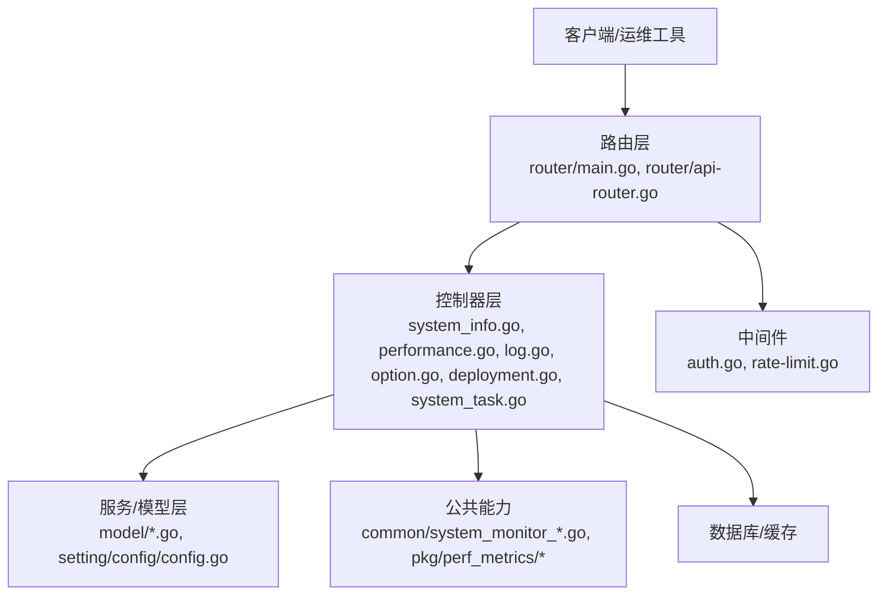
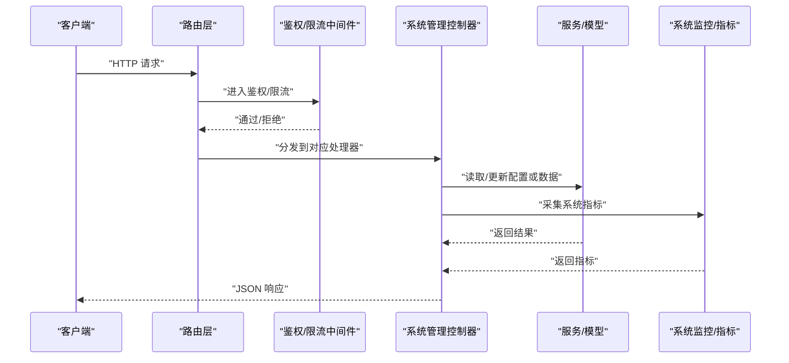
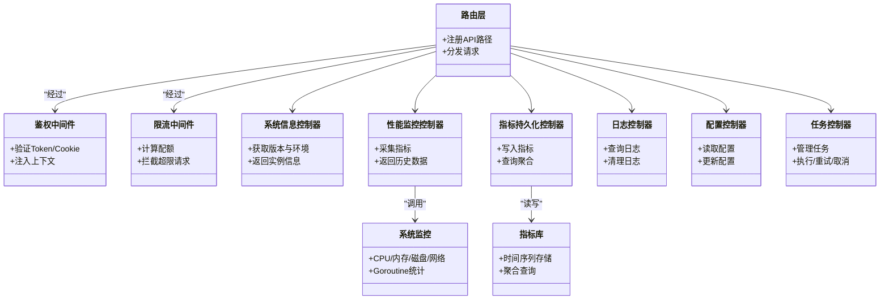

# 系统管理API

<cite>
**本文引用的文件**   
- [main.go](file://main.go)
- [router/main.go](file://router/main.go)
- [router/api-router.go](file://router/api-router.go)
- [controller/system_info.go](file://controller/system_info.go)
- [controller/performance.go](file://controller/performance.go)
- [controller/perf_metrics.go](file://controller/perf_metrics.go)
- [controller/log.go](file://controller/log.go)
- [controller/option.go](file://controller/option.go)
- [controller/deployment.go](file://controller/deployment.go)
- [controller/system_task.go](file://controller/system_task.go)
- [controller/system_task_handlers.go](file://controller/system_task_handlers.go)
- [middleware/auth.go](file://middleware/auth.go)
- [middleware/rate-limit.go](file://middleware/rate-limit.go)
- [common/system_monitor.go](file://common/system_monitor.go)
- [common/system_monitor_unix.go](file://common/system_monitor_unix.go)
- [common/system_monitor_windows.go](file://common/system_monitor_windows.go)
- [model/system_instance.go](file://model/system_instance.go)
- [model/perf_metric.go](file://model/perf_metric.go)
- [model/log.go](file://model/log.go)
- [setting/config/config.go](file://setting/config/config.go)
- [setting/operation_setting/monitor_setting.go](file://setting/operation_setting/monitor_setting.go)
- [pkg/perf_metrics/metrics.go](file://pkg/perf_metrics/metrics.go)
- [pkg/perf_metrics/types.go](file://pkg/perf_metrics/types.go)
</cite>

## 目录
1. [简介](#简介)
2. [项目结构](#项目结构)
3. [核心组件](#核心组件)
4. [架构总览](#架构总览)
5. [详细组件分析](#详细组件分析)
6. [依赖关系分析](#依赖关系分析)
7. [性能考量](#性能考量)
8. [故障排查指南](#故障排查指南)
9. [结论](#结论)
10. [附录](#附录)

## 简介
本文件为“系统管理API”的权威文档，覆盖系统信息获取、性能监控、日志管理、系统配置、健康检查、批量操作与监控告警等能力。文档面向运维与开发者，提供HTTP方法、URL模式、请求/响应约定、权限控制与认证要求、错误处理与最佳实践说明，并给出自动化运维建议。

## 项目结构
系统采用分层架构：路由层负责URL到控制器方法的映射；控制器层实现业务编排；服务与模型层负责数据访问与持久化；中间件统一处理鉴权、限流、日志等横切关注点；公共模块提供系统监控、指标采集等通用能力。

图表来源
- [router/main.go:1-200](file://router/main.go#L1-L200)
- [router/api-router.go:1-200](file://router/api-router.go#L1-L200)
- [controller/system_info.go:1-200](file://controller/system_info.go#L1-L200)
- [controller/performance.go:1-200](file://controller/performance.go#L1-L200)
- [controller/log.go:1-200](file://controller/log.go#L1-L200)
- [controller/option.go:1-200](file://controller/option.go#L1-L200)
- [controller/deployment.go:1-200](file://controller/deployment.go#L1-L200)
- [controller/system_task.go:1-200](file://controller/system_task.go#L1-L200)
- [middleware/auth.go:1-200](file://middleware/auth.go#L1-L200)
- [middleware/rate-limit.go:1-200](file://middleware/rate-limit.go#L1-L200)
- [common/system_monitor.go:1-200](file://common/system_monitor.go#L1-L200)
- [pkg/perf_metrics/metrics.go:1-200](file://pkg/perf_metrics/metrics.go#L1-L200)

章节来源
- [router/main.go:1-200](file://router/main.go#L1-L200)
- [router/api-router.go:1-200](file://router/api-router.go#L1-L200)

## 核心组件
- 系统信息：版本、运行环境、实例标识、部署信息等。
- 性能监控：CPU、内存、磁盘、网络、进程、goroutine等指标采集与查询。
- 日志管理：系统日志与应用日志的查询、导出、清理。
- 系统配置：运行时配置读取与更新（受权限控制）。
- 健康检查：服务存活与依赖健康状态。
- 任务调度：后台任务列表、执行、重试、取消等。
- 指标持久化：性能指标写入与历史查询。

章节来源
- [controller/system_info.go:1-200](file://controller/system_info.go#L1-L200)
- [controller/performance.go:1-200](file://controller/performance.go#L1-L200)
- [controller/perf_metrics.go:1-200](file://controller/perf_metrics.go#L1-L200)
- [controller/log.go:1-200](file://controller/log.go#L1-L200)
- [controller/option.go:1-200](file://controller/option.go#L1-L200)
- [controller/deployment.go:1-200](file://controller/deployment.go#L1-L200)
- [controller/system_task.go:1-200](file://controller/system_task.go#L1-L200)
- [controller/system_task_handlers.go:1-200](file://controller/system_task_handlers.go#L1-L200)

## 架构总览
系统管理API的请求路径由路由层集中注册，控制器接收参数后调用服务或模型进行数据处理，必要时通过公共模块采集系统指标或触发任务。鉴权与限流在中间件中统一处理，确保安全性与稳定性。

图表来源
- [router/main.go:1-200](file://router/main.go#L1-L200)
- [router/api-router.go:1-200](file://router/api-router.go#L1-L200)
- [middleware/auth.go:1-200](file://middleware/auth.go#L1-L200)
- [middleware/rate-limit.go:1-200](file://middleware/rate-limit.go#L1-L200)
- [controller/system_info.go:1-200](file://controller/system_info.go#L1-L200)
- [controller/performance.go:1-200](file://controller/performance.go#L1-L200)
- [controller/perf_metrics.go:1-200](file://controller/perf_metrics.go#L1-L200)
- [common/system_monitor.go:1-200](file://common/system_monitor.go#L1-L200)

## 详细组件分析

### 系统信息接口
- 功能：获取系统版本、运行环境、实例ID、部署信息等。
- 典型端点：
  - GET /api/system/info
  - GET /api/system/version
  - GET /api/system/env
- 请求/响应：
  - 请求：无或可选查询参数（如语言、时区）
  - 响应：包含版本号、构建时间、运行平台、实例标识、环境变量摘要等
- 权限：通常允许匿名访问，但敏感字段可按策略隐藏
- 错误：参数校验失败、内部异常

章节来源
- [controller/system_info.go:1-200](file://controller/system_info.go#L1-L200)
- [router/api-router.go:1-200](file://router/api-router.go#L1-L200)

### 性能监控接口
- 功能：采集并返回系统级与进程级性能指标，支持实时与历史查询。
- 典型端点：
  - GET /api/performance/current
  - GET /api/performance/history?start=&end=&interval=
  - GET /api/performance/goroutines
  - GET /api/performance/pprof?debug=1
- 请求/响应：
  - 请求：时间范围、采样间隔、指标维度
  - 响应：CPU使用率、内存占用、GC统计、磁盘IO、网络IO、goroutine数等
- 权限：管理员或具备监控角色
- 错误：时间范围非法、指标不可用、采样器未初始化

章节来源
- [controller/performance.go:1-200](file://controller/performance.go#L1-L200)
- [common/system_monitor.go:1-200](file://common/system_monitor.go#L1-L200)
- [common/system_monitor_unix.go:1-200](file://common/system_monitor_unix.go#L1-L200)
- [common/system_monitor_windows.go:1-200](file://common/system_monitor_windows.go#L1-L200)

### 性能指标持久化接口
- 功能：将关键指标写入存储，支持按时间序列查询与聚合。
- 典型端点：
  - POST /api/metrics/flush
  - GET /api/metrics/query?metric=&start=&end=&agg=
- 请求/响应：
  - 请求：指标名称、时间范围、聚合函数（avg/max/min/sum）
  - 响应：时间序列数据、聚合结果
- 权限：管理员或具备指标读写权限
- 错误：指标不存在、查询超时、存储不可用

章节来源
- [controller/perf_metrics.go:1-200](file://controller/perf_metrics.go#L1-L200)
- [model/perf_metric.go:1-200](file://model/perf_metric.go#L1-L200)
- [pkg/perf_metrics/metrics.go:1-200](file://pkg/perf_metrics/metrics.go#L1-L200)
- [pkg/perf_metrics/types.go:1-200](file://pkg/perf_metrics/types.go#L1-L200)

### 日志管理接口
- 功能：查询系统日志与应用日志，支持过滤、分页、导出与清理。
- 典型端点：
  - GET /api/logs/system?level=&keyword=&page=&size=
  - GET /api/logs/app?module=&level=&page=&size=
  - DELETE /api/logs/cleanup?older_than=
- 请求/响应：
  - 请求：级别、关键词、时间范围、分页参数
  - 响应：日志条目列表、总数、下一页游标
- 权限：管理员或具备日志查看/清理权限
- 错误：参数非法、存储不可用、清理失败

章节来源
- [controller/log.go:1-200](file://controller/log.go#L1-L200)
- [model/log.go:1-200](file://model/log.go#L1-L200)

### 系统配置接口
- 功能：读取与更新系统配置项，支持分组与校验。
- 典型端点：
  - GET /api/config?key=&group=
  - PUT /api/config?key=&value=
  - POST /api/config/batch
- 请求/响应：
  - 请求：配置键值对、分组、校验规则
  - 响应：配置项详情、更新结果、校验反馈
- 权限：管理员或具备配置管理权限
- 错误：键不存在、值类型不匹配、校验失败、并发冲突

章节来源
- [controller/option.go:1-200](file://controller/option.go#L1-L200)
- [setting/config/config.go:1-200](file://setting/config/config.go#L1-L200)

### 部署与健康检查接口
- 功能：返回部署信息与系统健康状态，便于外部探针探测。
- 典型端点：
  - GET /api/deployment/info
  - GET /healthz
  - GET /readyz
- 请求/响应：
  - 请求：无
  - 响应：部署元数据、健康状态、依赖检查结果
- 权限：匿名可访问
- 错误：依赖不可用、探针失败

章节来源
- [controller/deployment.go:1-200](file://controller/deployment.go#L1-L200)

### 系统任务接口
- 功能：管理后台任务，包括任务列表、执行、重试、取消与结果查询。
- 典型端点：
  - GET /api/tasks
  - POST /api/tasks/{id}/run
  - POST /api/tasks/{id}/retry
  - POST /api/tasks/{id}/cancel
  - GET /api/tasks/{id}/result
- 请求/响应：
  - 请求：任务ID、执行参数、重试次数
  - 响应：任务状态、进度、结果或错误信息
- 权限：管理员或具备任务管理权限
- 错误：任务不存在、状态不允许、执行失败

章节来源
- [controller/system_task.go:1-200](file://controller/system_task.go#L1-L200)
- [controller/system_task_handlers.go:1-200](file://controller/system_task_handlers.go#L1-L200)
- [model/system_instance.go:1-200](file://model/system_instance.go#L1-L200)

### 监控告警与阈值
- 功能：基于性能指标与系统状态生成告警事件，支持阈值配置与通知。
- 典型端点：
  - GET /api/alerts/rules
  - POST /api/alerts/rules
  - GET /api/alerts/events?status=&severity=
- 请求/响应：
  - 请求：阈值条件、告警级别、通知渠道
  - 响应：规则列表、事件列表、状态变更
- 权限：管理员或具备告警管理权限
- 错误：规则冲突、通知失败、阈值无效

章节来源
- [setting/operation_setting/monitor_setting.go:1-200](file://setting/operation_setting/monitor_setting.go#L1-L200)
- [controller/performance.go:1-200](file://controller/performance.go#L1-L200)

### 批量操作接口
- 功能：对配置、日志、任务等进行批量处理，提升运维效率。
- 典型端点：
  - POST /api/config/batch
  - POST /api/logs/bulk-delete
  - POST /api/tasks/batch-run
- 请求/响应：
  - 请求：批量操作指令、目标集合、选项
  - 响应：操作结果、成功/失败计数、错误明细
- 权限：管理员或具备批量操作权限
- 错误：部分失败、事务回滚、资源不足

章节来源
- [controller/option.go:1-200](file://controller/option.go#L1-L200)
- [controller/log.go:1-200](file://controller/log.go#L1-L200)
- [controller/system_task.go:1-200](file://controller/system_task.go#L1-L200)

### 认证与权限控制
- 认证方式：Token或会话Cookie，支持多提供者扩展。
- 权限模型：基于角色的访问控制（RBAC），细粒度资源授权。
- 中间件：统一鉴权、来源校验、速率限制。
- 安全建议：最小权限原则、密钥轮换、审计日志。

章节来源
- [middleware/auth.go:1-200](file://middleware/auth.go#L1-L200)
- [router/api-router.go:1-200](file://router/api-router.go#L1-L200)

### 限流与稳定性
- 功能：全局与接口级限流，防止滥用与雪崩。
- 策略：令牌桶/滑动窗口，支持IP、用户、租户维度。
- 配置：QPS、突发量、冷却时间、白名单。
- 行为：超限返回429，附带重试头。

章节来源
- [middleware/rate-limit.go:1-200](file://middleware/rate-limit.go#L1-L200)

## 依赖关系分析
系统管理API依赖路由注册、鉴权中间件、系统监控、指标采集、配置管理与任务调度等模块。各模块职责清晰，耦合度低，便于扩展与维护。

图表来源
- [router/main.go:1-200](file://router/main.go#L1-L200)
- [router/api-router.go:1-200](file://router/api-router.go#L1-L200)
- [middleware/auth.go:1-200](file://middleware/auth.go#L1-L200)
- [middleware/rate-limit.go:1-200](file://middleware/rate-limit.go#L1-L200)
- [controller/system_info.go:1-200](file://controller/system_info.go#L1-L200)
- [controller/performance.go:1-200](file://controller/performance.go#L1-L200)
- [controller/perf_metrics.go:1-200](file://controller/perf_metrics.go#L1-L200)
- [controller/log.go:1-200](file://controller/log.go#L1-L200)
- [controller/option.go:1-200](file://controller/option.go#L1-L200)
- [controller/system_task.go:1-200](file://controller/system_task.go#L1-L200)
- [common/system_monitor.go:1-200](file://common/system_monitor.go#L1-L200)
- [pkg/perf_metrics/metrics.go:1-200](file://pkg/perf_metrics/metrics.go#L1-L200)

章节来源
- [router/main.go:1-200](file://router/main.go#L1-L200)
- [router/api-router.go:1-200](file://router/api-router.go#L1-L200)
- [middleware/auth.go:1-200](file://middleware/auth.go#L1-L200)
- [middleware/rate-limit.go:1-200](file://middleware/rate-limit.go#L1-L200)

## 性能考量
- 指标采集频率：根据负载调整采样间隔，避免过高开销。
- 数据存储：使用高效的时间序列存储，合理分区与压缩。
- 查询优化：索引与预聚合，限制最大时间跨度与返回条数。
- 限流保护：接口级限流与熔断，保障核心链路稳定。
- 异步处理：耗时任务放入队列，避免阻塞请求线程。

[本节为通用指导，不涉及具体文件分析]

## 故障排查指南
- 鉴权失败：检查Token有效性、过期时间与权限分配。
- 限流触发：查看QPS与突发阈值，调整配额或加入白名单。
- 指标缺失：确认采集器是否启动、存储是否可用、查询参数是否正确。
- 日志清理失败：检查磁盘空间与权限，分批清理大文件。
- 任务执行失败：查看任务日志、重试策略与依赖服务状态。

章节来源
- [middleware/auth.go:1-200](file://middleware/auth.go#L1-L200)
- [middleware/rate-limit.go:1-200](file://middleware/rate-limit.go#L1-L200)
- [controller/perf_metrics.go:1-200](file://controller/perf_metrics.go#L1-L200)
- [controller/log.go:1-200](file://controller/log.go#L1-L200)
- [controller/system_task.go:1-200](file://controller/system_task.go#L1-L200)

## 结论
系统管理API以清晰的层次结构与完善的中间件机制，提供了全面的系统信息、性能监控、日志管理、配置管理、健康检查与任务管理能力。通过严格的权限控制与限流策略，保障了系统的稳定性与安全性。建议结合自动化脚本与监控平台，实现高效的运维闭环。

[本节为总结性内容，不涉及具体文件分析]

## 附录
- 最佳实践
  - 最小权限：仅授予必要角色与资源访问。
  - 密钥管理：定期轮换，避免硬编码。
  - 审计追踪：记录关键操作与变更。
  - 容量规划：预留资源余量，应对峰值。
- 自动化指南
  - 健康检查：集成探针与自愈脚本。
  - 指标采集：定时拉取并入库，设置阈值告警。
  - 日志轮转：自动归档与清理，保留策略明确。
  - 配置同步：版本化管理与灰度发布。

[本节为通用指导，不涉及具体文件分析]