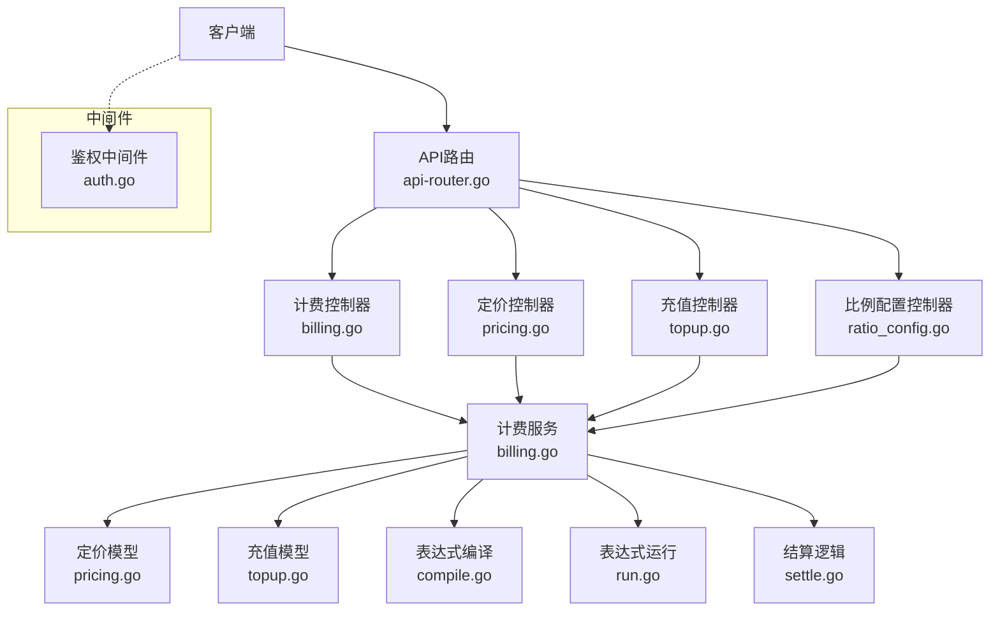
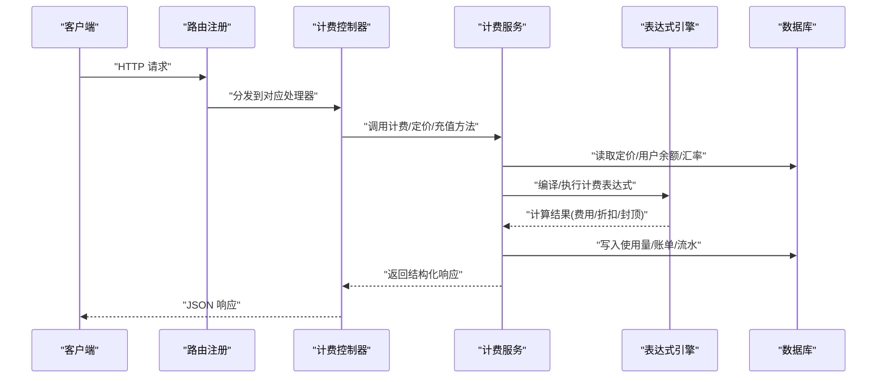
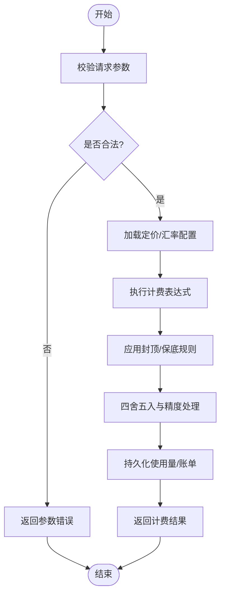
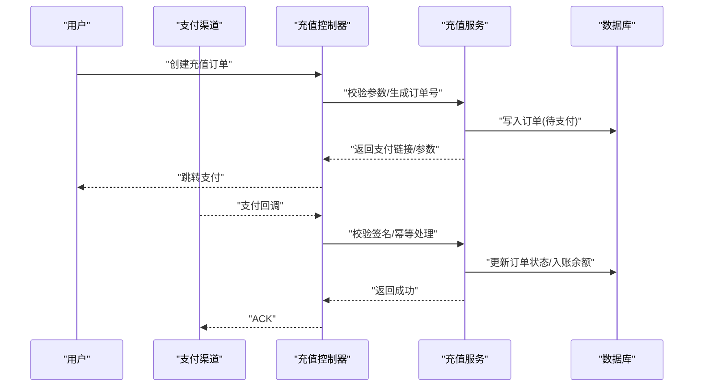
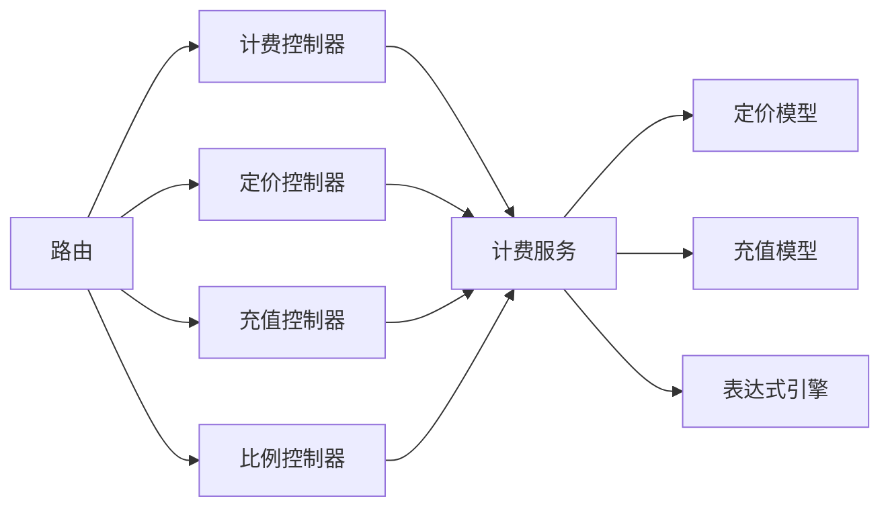

# 计费管理API

<cite>
**本文档引用的文件**   
- [controller/billing.go](file://controller/billing.go)
- [controller/pricing.go](file://controller/pricing.go)
- [controller/topup.go](file://controller/topup.go)
- [controller/ratio_config.go](file://controller/ratio_config.go)
- [service/billing.go](file://service/billing.go)
- [service/billing_usage.go](file://service/billing_usage.go)
- [model/pricing.go](file://model/pricing.go)
- [model/topup.go](file://model/topup.go)
- [dto/pricing.go](file://dto/pricing.go)
- [dto/billing_usage.go](file://dto/billing_usage.go)
- [pkg/billingexpr/compile.go](file://pkg/billingexpr/compile.go)
- [pkg/billingexpr/run.go](file://pkg/billingexpr/run.go)
- [pkg/billingexpr/settle.go](file://pkg/billingexpr/settle.go)
- [router/api-router.go](file://router/api-router.go)
- [middleware/auth.go](file://middleware/auth.go)
- [setting/billing_setting/tiered_billing.go](file://setting/billing_setting/tiered_billing.go)
</cite>

## 目录
1. [简介](#简介)
2. [项目结构](#项目结构)
3. [核心组件](#核心组件)
4. [架构总览](#架构总览)
5. [详细组件分析](#详细组件分析)
6. [依赖关系分析](#依赖关系分析)
7. [性能考虑](#性能考虑)
8. [故障排查指南](#故障排查指南)
9. [结论](#结论)
10. [附录](#附录)

## 简介
本文件为“计费管理API”的权威技术文档，覆盖计费配置、定价策略、汇率与比例配置、充值管理等核心能力。文档面向开发者与运维人员，提供HTTP方法、URL模式、请求/响应约定、权限控制与认证要求、计费规则验证、批量操作接口、财务审计、状态监控、错误处理与报表生成等完整说明，并给出计费配置最佳实践与财务合规建议。

## 项目结构
计费相关功能在后端采用控制器-服务-模型的分层组织：
- 控制器层：负责HTTP路由、参数校验、鉴权与返回结果封装
- 服务层：实现计费计算、结算、使用量统计、充值流程编排
- 模型层：持久化定价、充值记录、使用量等实体
- 表达式引擎：用于计费公式编译与执行
- 路由注册：统一挂载计费相关API路径
- 中间件：鉴权、限流、审计日志等横切关注点

图表来源
- [router/api-router.go](file://router/api-router.go)
- [controller/billing.go](file://controller/billing.go)
- [controller/pricing.go](file://controller/pricing.go)
- [controller/topup.go](file://controller/topup.go)
- [controller/ratio_config.go](file://controller/ratio_config.go)
- [service/billing.go](file://service/billing.go)
- [model/pricing.go](file://model/pricing.go)
- [model/topup.go](file://model/topup.go)
- [pkg/billingexpr/compile.go](file://pkg/billingexpr/compile.go)
- [pkg/billingexpr/run.go](file://pkg/billingexpr/run.go)
- [pkg/billingexpr/settle.go](file://pkg/billingexpr/settle.go)
- [middleware/auth.go](file://middleware/auth.go)

章节来源
- [router/api-router.go](file://router/api-router.go)
- [controller/billing.go](file://controller/billing.go)
- [controller/pricing.go](file://controller/pricing.go)
- [controller/topup.go](file://controller/topup.go)
- [controller/ratio_config.go](file://controller/ratio_config.go)
- [service/billing.go](file://service/billing.go)
- [model/pricing.go](file://model/pricing.go)
- [model/topup.go](file://model/topup.go)
- [pkg/billingexpr/compile.go](file://pkg/billingexpr/compile.go)
- [pkg/billingexpr/run.go](file://pkg/billingexpr/run.go)
- [pkg/billingexpr/settle.go](file://pkg/billingexpr/settle.go)
- [middleware/auth.go](file://middleware/auth.go)

## 核心组件
- 计费配置与策略
  - 支持按模型/渠道/端点的差异化定价
  - 支持阶梯计费与表达式驱动的计费公式
  - 支持汇率与比例换算（如货币、单位）
- 使用量与结算
  - 采集调用使用量（token、时长、图像尺寸等）
  - 基于表达式引擎进行费用计算与四舍五入
  - 支持分层结算与封顶限制
- 充值与支付
  - 对接多种支付渠道（Stripe、Creem、Waffo等）
  - 充值订单创建、回调处理、余额更新
  - 退款与对账基础能力
- 审计与报表
  - 计费事件审计日志
  - 使用量汇总与导出
  - 账单明细查询与分页

章节来源
- [service/billing.go](file://service/billing.go)
- [service/billing_usage.go](file://service/billing_usage.go)
- [model/pricing.go](file://model/pricing.go)
- [model/topup.go](file://model/topup.go)
- [dto/pricing.go](file://dto/pricing.go)
- [dto/billing_usage.go](file://dto/billing_usage.go)
- [pkg/billingexpr/compile.go](file://pkg/billingexpr/compile.go)
- [pkg/billingexpr/run.go](file://pkg/billingexpr/run.go)
- [pkg/billingexpr/settle.go](file://pkg/billingexpr/settle.go)

## 架构总览
计费系统以“控制器-服务-模型-表达式引擎”为核心，配合鉴权与审计中间件，形成高内聚、低耦合的计费能力。

图表来源
- [router/api-router.go](file://router/api-router.go)
- [controller/billing.go](file://controller/billing.go)
- [service/billing.go](file://service/billing.go)
- [pkg/billingexpr/compile.go](file://pkg/billingexpr/compile.go)
- [pkg/billingexpr/run.go](file://pkg/billingexpr/run.go)
- [model/pricing.go](file://model/pricing.go)
- [model/topup.go](file://model/topup.go)

## 详细组件分析

### 计费配置与定价策略
- 功能要点
  - 支持按模型、渠道、端点维度定义价格与比例
  - 支持表达式计费公式，便于灵活扩展
  - 支持汇率与单位换算，确保多币种一致性
- 关键接口
  - 定价CRUD：创建、更新、删除、查询、批量导入/导出
  - 定价预览：根据输入参数模拟计费结果
  - 汇率配置：维护汇率表与生效时间
- 权限与认证
  - 需要管理员或计费角色权限
  - 所有写操作需携带有效令牌并通过鉴权中间件
- 数据模型
  - 定价实体包含模型标识、计价单位、单价、比例、生效区间等
  - 汇率实体包含币种对、汇率值、更新时间
- 计费规则验证
  - 必填字段校验、范围校验、冲突检测
  - 表达式语法校验与静态检查
- 批量操作
  - 批量导入/导出定价与汇率
  - 批量启用/停用策略

图表来源
- [controller/pricing.go](file://controller/pricing.go)
- [service/billing.go](file://service/billing.go)
- [pkg/billingexpr/compile.go](file://pkg/billingexpr/compile.go)
- [pkg/billingexpr/run.go](file://pkg/billingexpr/run.go)
- [pkg/billingexpr/settle.go](file://pkg/billingexpr/settle.go)
- [model/pricing.go](file://model/pricing.go)

章节来源
- [controller/pricing.go](file://controller/pricing.go)
- [service/billing.go](file://service/billing.go)
- [model/pricing.go](file://model/pricing.go)
- [dto/pricing.go](file://dto/pricing.go)
- [pkg/billingexpr/compile.go](file://pkg/billingexpr/compile.go)
- [pkg/billingexpr/run.go](file://pkg/billingexpr/run.go)
- [pkg/billingexpr/settle.go](file://pkg/billingexpr/settle.go)

### 汇率与比例配置
- 功能要点
  - 维护币种对汇率与比例映射
  - 支持生效时间与版本控制
  - 支持按比例换算与缓存加速
- 关键接口
  - 汇率CRUD、批量导入/导出、生效时间设置
  - 比例配置：模型/渠道/端点级别的比例覆盖
- 权限与认证
  - 仅管理员可修改
  - 读接口可开放给内部服务
- 数据模型
  - 汇率实体：币种对、汇率值、生效时间、状态
  - 比例实体：资源维度、比例值、优先级

章节来源
- [controller/ratio_config.go](file://controller/ratio_config.go)
- [service/billing.go](file://service/billing.go)
- [model/pricing.go](file://model/pricing.go)
- [dto/pricing.go](file://dto/pricing.go)

### 充值管理与支付集成
- 功能要点
  - 创建充值订单、选择支付方式
  - 支付回调处理、余额入账、流水记录
  - 退款申请与处理、对账导出
- 关键接口
  - 充值订单：创建、查询、取消
  - 支付回调：签名校验、幂等处理、状态同步
  - 余额查询：用户/租户余额、冻结金额
- 权限与认证
  - 充值创建需用户身份；回调由支付方服务端访问
  - 敏感操作需二次校验与审计日志
- 数据模型
  - 充值订单：金额、币种、支付方式、状态、时间戳
  - 流水记录：关联订单、变动类型、余额快照

图表来源
- [controller/topup.go](file://controller/topup.go)
- [service/billing.go](file://service/billing.go)
- [model/topup.go](file://model/topup.go)

章节来源
- [controller/topup.go](file://controller/topup.go)
- [service/billing.go](file://service/billing.go)
- [model/topup.go](file://model/topup.go)

### 使用量采集与结算
- 功能要点
  - 采集每次调用的使用量指标
  - 基于表达式引擎计算费用
  - 支持分层结算、封顶与折扣
- 关键接口
  - 使用量上报：批量提交、去重、校验
  - 结算任务：定时触发、失败重试
  - 账单查询：按用户/模型/时间范围筛选
- 数据模型
  - 使用量记录：资源ID、用量指标、时间戳、计费上下文
  - 账单记录：费用明细、折扣、封顶、最终金额

章节来源
- [service/billing_usage.go](file://service/billing_usage.go)
- [service/billing.go](file://service/billing.go)
- [model/pricing.go](file://model/pricing.go)
- [dto/billing_usage.go](file://dto/billing_usage.go)
- [pkg/billingexpr/settle.go](file://pkg/billingexpr/settle.go)

### 计费表达式引擎
- 功能要点
  - 表达式编译：语法检查、常量折叠、优化
  - 表达式运行：上下文注入、变量解析、函数调用
  - 结算规则：封顶、保底、四舍五入、精度控制
- 关键能力
  - 内置函数：数学运算、时间处理、条件判断
  - 上下文：模型、渠道、端点、用户等级、汇率
  - 安全：白名单函数、执行超时、内存限制

章节来源
- [pkg/billingexpr/compile.go](file://pkg/billingexpr/compile.go)
- [pkg/billingexpr/run.go](file://pkg/billingexpr/run.go)
- [pkg/billingexpr/settle.go](file://pkg/billingexpr/settle.go)

### 路由与鉴权
- 路由注册
  - 计费、定价、充值、比例配置等模块统一在API路由中注册
- 鉴权与授权
  - 鉴权中间件校验令牌、会话、角色权限
  - 计费相关写操作需管理员或特定角色
- 审计日志
  - 关键计费操作记录审计日志，便于追踪与合规

章节来源
- [router/api-router.go](file://router/api-router.go)
- [middleware/auth.go](file://middleware/auth.go)

## 依赖关系分析
计费模块依赖关系如下：
- 控制器依赖服务层，服务层依赖模型与表达式引擎
- 路由将HTTP请求分发至控制器
- 中间件在请求链路前后注入鉴权、审计、限流等能力

图表来源
- [router/api-router.go](file://router/api-router.go)
- [controller/billing.go](file://controller/billing.go)
- [controller/pricing.go](file://controller/pricing.go)
- [controller/topup.go](file://controller/topup.go)
- [controller/ratio_config.go](file://controller/ratio_config.go)
- [service/billing.go](file://service/billing.go)
- [model/pricing.go](file://model/pricing.go)
- [model/topup.go](file://model/topup.go)
- [pkg/billingexpr/compile.go](file://pkg/billingexpr/compile.go)
- [pkg/billingexpr/run.go](file://pkg/billingexpr/run.go)
- [pkg/billingexpr/settle.go](file://pkg/billingexpr/settle.go)

章节来源
- [router/api-router.go](file://router/api-router.go)
- [controller/billing.go](file://controller/billing.go)
- [controller/pricing.go](file://controller/pricing.go)
- [controller/topup.go](file://controller/topup.go)
- [controller/ratio_config.go](file://controller/ratio_config.go)
- [service/billing.go](file://service/billing.go)
- [model/pricing.go](file://model/pricing.go)
- [model/topup.go](file://model/topup.go)
- [pkg/billingexpr/compile.go](file://pkg/billingexpr/compile.go)
- [pkg/billingexpr/run.go](file://pkg/billingexpr/run.go)
- [pkg/billingexpr/settle.go](file://pkg/billingexpr/settle.go)

## 性能考虑
- 表达式引擎
  - 预编译常用表达式，减少运行时开销
  - 限制表达式复杂度与执行时间，防止滥用
- 缓存策略
  - 定价与汇率配置缓存，降低数据库压力
  - 使用量聚合结果短期缓存，提升报表查询性能
- 批处理
  - 使用量上报与结算任务支持批量处理
  - 分片与并行化，提高吞吐
- 幂等与重试
  - 支付回调与充值入账具备幂等性
  - 失败任务自动重试与死信队列

[本节为通用指导，不直接分析具体文件]

## 故障排查指南
- 常见问题
  - 参数校验失败：检查必填字段、范围、格式
  - 表达式编译失败：检查语法、函数白名单、上下文变量
  - 支付回调失败：检查签名、时间戳、幂等键
  - 结算异常：检查封顶/保底规则、汇率有效性
- 诊断步骤
  - 查看审计日志与错误日志
  - 核对定价配置与汇率生效时间
  - 复现计费表达式并打印中间结果
  - 检查充值订单状态与流水一致性
- 恢复措施
  - 修正配置后重新生效
  - 补偿缺失的使用量或账单
  - 回滚错误的充值入账

章节来源
- [service/billing.go](file://service/billing.go)
- [service/billing_usage.go](file://service/billing_usage.go)
- [controller/topup.go](file://controller/topup.go)
- [pkg/billingexpr/compile.go](file://pkg/billingexpr/compile.go)
- [pkg/billingexpr/run.go](file://pkg/billingexpr/run.go)
- [pkg/billingexpr/settle.go](file://pkg/billingexpr/settle.go)

## 结论
计费管理API通过清晰的层次结构与灵活的表达式引擎，实现了可扩展、可审计、可合规的计费能力。建议在上线前完成定价与汇率的充分测试，建立完善的监控与告警机制，并遵循财务合规要求，确保资金流转的可追溯性与准确性。

[本节为总结性内容，不直接分析具体文件]

## 附录

### HTTP API 参考（计费、定价、充值、比例）
- 计费与使用量
  - 方法：POST /api/billing/usage
  - 描述：批量上报使用量，触发计费计算
  - 权限：计费角色或管理员
  - 请求体：使用量列表（资源ID、指标、时间戳、上下文）
  - 响应：计费结果摘要与错误明细
- 计费预览
  - 方法：POST /api/billing/preview
  - 描述：基于当前配置模拟计费结果
  - 权限：计费角色或管理员
  - 请求体：资源与用量参数
  - 响应：预估费用、折扣、封顶信息
- 账单查询
  - 方法：GET /api/billing/statements
  - 描述：分页查询账单明细
  - 权限：所有者或管理员
  - 查询参数：用户ID、模型、时间范围、页码
  - 响应：账单列表与总数
- 定价管理
  - 方法：POST /api/pricing
  - 描述：创建或更新定价策略
  - 权限：管理员
  - 请求体：模型/渠道/端点、单价、比例、生效时间
  - 响应：定价ID与状态
  - 方法：PUT /api/pricing/{id}
  - 描述：更新定价
  - 方法：DELETE /api/pricing/{id}
  - 描述：删除定价
  - 方法：GET /api/pricing
  - 描述：查询定价列表
- 汇率与比例
  - 方法：POST /api/ratio/currency
  - 描述：新增或更新汇率
  - 权限：管理员
  - 请求体：币种对、汇率值、生效时间
  - 方法：GET /api/ratio/currency
  - 描述：查询汇率列表
  - 方法：POST /api/ratio/model
  - 描述：模型级比例覆盖
- 充值管理
  - 方法：POST /api/topup/orders
  - 描述：创建充值订单
  - 权限：已登录用户
  - 请求体：金额、币种、支付方式
  - 响应：订单信息与支付链接
  - 方法：GET /api/topup/orders/{id}
  - 描述：查询订单状态
  - 回调：POST /api/webhook/topup
  - 描述：支付回调处理（签名校验、幂等）
  - 权限：支付渠道服务端
- 报表与审计
  - 方法：GET /api/billing/reports
  - 描述：导出使用量与费用报表
  - 权限：管理员
  - 查询参数：时间范围、资源维度、格式
  - 方法：GET /api/billing/audit
  - 描述：审计日志查询
  - 权限：管理员

[本节为概念性API参考，未直接映射具体代码行]

### 计费配置最佳实践
- 明确计价单位与精度，避免浮点误差
- 使用表达式时保持简洁，必要时拆分为多步计算
- 汇率与比例变更需灰度发布与回滚预案
- 定期审计账单与流水一致性
- 对高风险操作增加二次确认与审批流

### 财务合规指南
- 所有资金变动必须可追溯，保留完整流水
- 支付回调需严格签名校验与防重放
- 账单与报表需满足审计要求，支持导出与归档
- 敏感数据脱敏展示，最小权限原则
- 定期备份与灾难恢复演练

[本节为通用指导，不直接分析具体文件]