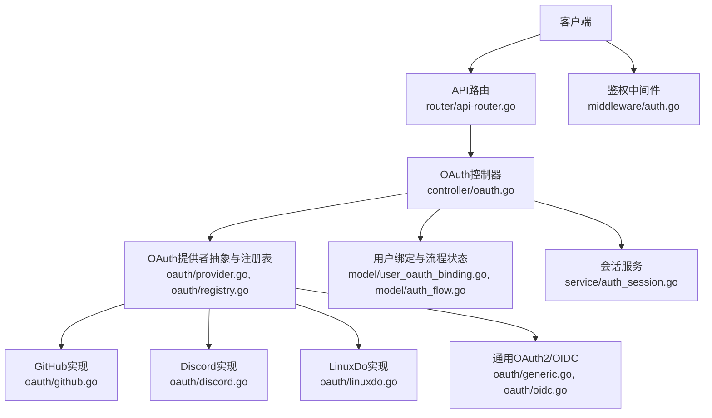
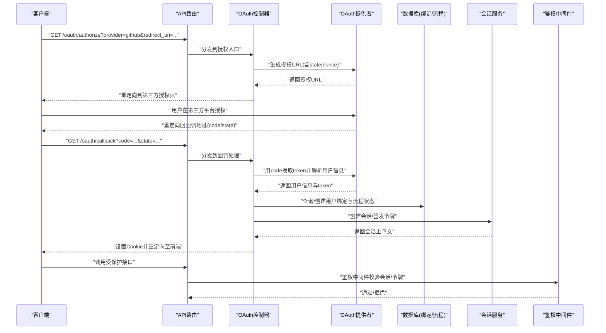
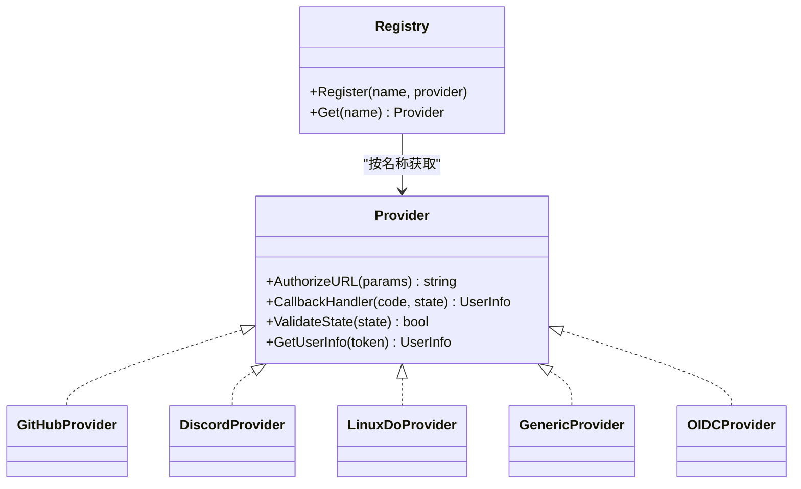
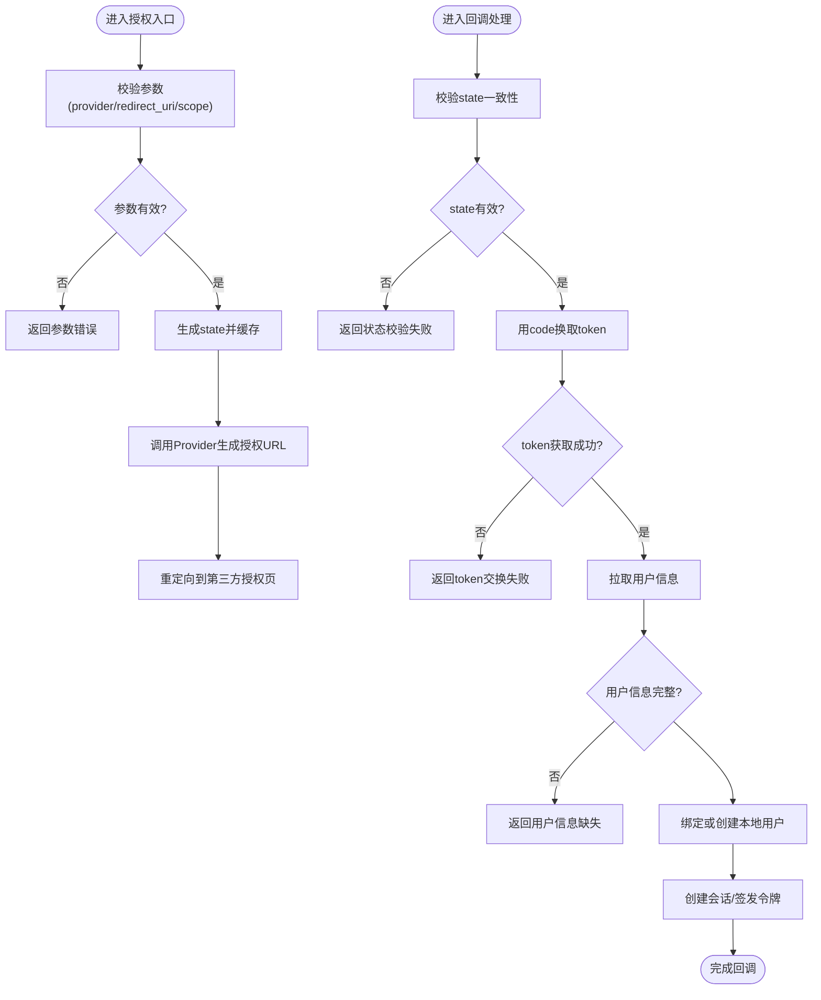
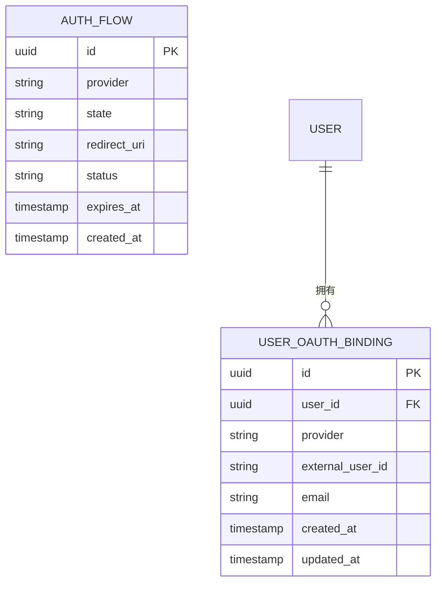
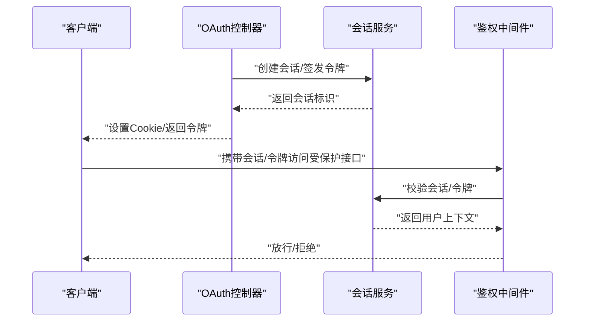
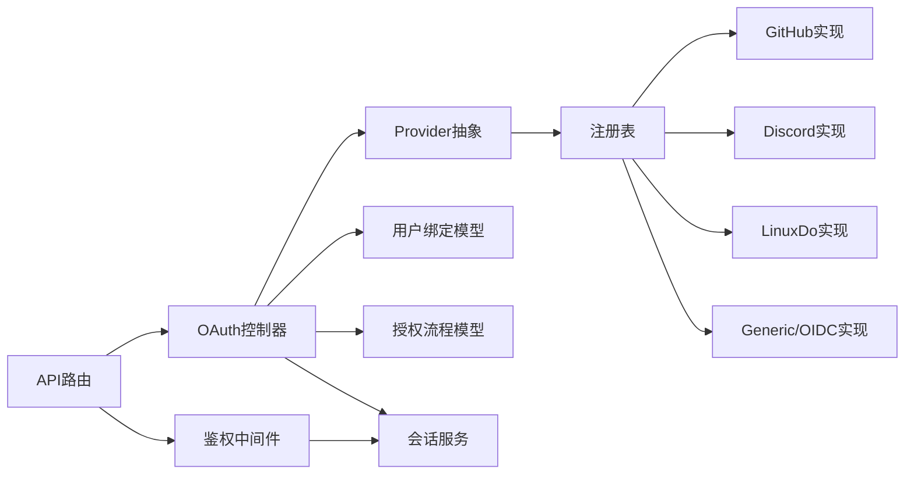

# OAuth认证

<cite>
**本文引用的文件**   
- [controller/oauth.go](file://controller/oauth.go)
- [controller/custom_oauth.go](file://controller/custom_oauth.go)
- [oauth/provider.go](file://oauth/provider.go)
- [oauth/registry.go](file://oauth/registry.go)
- [oauth/types.go](file://oauth/types.go)
- [oauth/github.go](file://oauth/github.go)
- [oauth/discord.go](file://oauth/discord.go)
- [oauth/linuxdo.go](file://oauth/linuxdo.go)
- [oauth/generic.go](file://oauth/generic.go)
- [oauth/oidc.go](file://oauth/oidc.go)
- [model/user_oauth_binding.go](file://model/user_oauth_binding.go)
- [model/auth_flow.go](file://model/auth_flow.go)
- [service/auth_session.go](file://service/auth_session.go)
- [middleware/auth.go](file://middleware/auth.go)
- [router/api-router.go](file://router/api-router.go)
- [setting/system_setting/oidc.go](file://setting/system_setting/oidc.go)
</cite>

## 目录
1. [简介](#简介)
2. [项目结构](#项目结构)
3. [核心组件](#核心组件)
4. [架构总览](#架构总览)
5. [详细组件分析](#详细组件分析)
6. [依赖关系分析](#依赖关系分析)
7. [性能考虑](#性能考虑)
8. [故障排查指南](#故障排查指南)
9. [结论](#结论)
10. [附录：集成示例与配置指南](#附录集成示例与配置指南)

## 简介
本文件为OAuth认证API的详细技术文档，覆盖以下方面：
- 支持的OAuth提供商：GitHub、Discord、LinuxDo，以及通用OIDC/OAuth2实现
- OAuth2.0标准流程在本项目的实现方式
- 授权发起、回调处理、用户信息获取与账户绑定
- 自定义OAuth提供商的配置与接入方法
- 授权状态管理、错误处理与安全注意事项
- 各提供商的集成示例与配置要点

## 项目结构
OAuth相关能力由控制器层、OAuth提供者抽象与实现、模型与持久化、会话服务、中间件及路由共同组成。关键目录与职责如下：
- controller/oauth.go：HTTP控制器，暴露授权入口与回调接口
- controller/custom_oauth.go：自定义OAuth提供商的管理与校验
- oauth/*：OAuth提供者抽象、注册表与各提供商实现（GitHub/Discord/LinuxDo/Generic/OIDC）
- model/*：用户OAuth绑定、授权流程状态等数据模型
- service/auth_session.go：会话与令牌生命周期管理
- middleware/auth.go：鉴权中间件，保护受保护资源
- router/api-router.go：API路由注册
- setting/system_setting/oidc.go：系统级OIDC/OAuth2配置项

**图示来源** 
- [router/api-router.go](file://router/api-router.go)
- [controller/oauth.go](file://controller/oauth.go)
- [oauth/provider.go](file://oauth/provider.go)
- [oauth/registry.go](file://oauth/registry.go)
- [oauth/github.go](file://oauth/github.go)
- [oauth/discord.go](file://oauth/discord.go)
- [oauth/linuxdo.go](file://oauth/linuxdo.go)
- [oauth/generic.go](file://oauth/generic.go)
- [oauth/oidc.go](file://oauth/oidc.go)
- [model/user_oauth_binding.go](file://model/user_oauth_binding.go)
- [model/auth_flow.go](file://model/auth_flow.go)
- [service/auth_session.go](file://service/auth_session.go)
- [middleware/auth.go](file://middleware/auth.go)

**章节来源**
- [router/api-router.go](file://router/api-router.go)
- [controller/oauth.go](file://controller/oauth.go)
- [oauth/provider.go](file://oauth/provider.go)
- [oauth/registry.go](file://oauth/registry.go)

## 核心组件
- OAuth提供者抽象与注册表
  - 定义统一的Provider接口与工厂注册机制，便于扩展新提供商
  - 提供授权URL生成、回调解析、用户信息拉取等标准化能力
- 具体提供商实现
  - GitHub、Discord、LinuxDo分别实现各自平台的授权与用户信息协议差异
  - Generic/OIDC用于兼容标准OAuth2/OIDC提供方
- 控制器层
  - 统一对外暴露“发起授权”和“回调处理”两个端点
  - 负责参数校验、状态码返回、错误封装
- 数据模型与会话
  - 用户OAuth绑定记录、授权流程状态存储
  - 会话服务负责登录态、令牌签发与刷新
- 鉴权中间件
  - 基于会话或令牌进行请求鉴权，保护业务接口

**章节来源**
- [oauth/provider.go](file://oauth/provider.go)
- [oauth/registry.go](file://oauth/registry.go)
- [oauth/github.go](file://oauth/github.go)
- [oauth/discord.go](file://oauth/discord.go)
- [oauth/linuxdo.go](file://oauth/linuxdo.go)
- [oauth/generic.go](file://oauth/generic.go)
- [oauth/oidc.go](file://oauth/oidc.go)
- [controller/oauth.go](file://controller/oauth.go)
- [model/user_oauth_binding.go](file://model/user_oauth_binding.go)
- [model/auth_flow.go](file://model/auth_flow.go)
- [service/auth_session.go](file://service/auth_session.go)
- [middleware/auth.go](file://middleware/auth.go)

## 架构总览
下图展示了从客户端发起OAuth授权到回调完成并建立会话的完整流程，以及后续受保护资源的访问路径。

**图示来源** 
- [controller/oauth.go](file://controller/oauth.go)
- [oauth/provider.go](file://oauth/provider.go)
- [oauth/registry.go](file://oauth/registry.go)
- [model/user_oauth_binding.go](file://model/user_oauth_binding.go)
- [model/auth_flow.go](file://model/auth_flow.go)
- [service/auth_session.go](file://service/auth_session.go)
- [middleware/auth.go](file://middleware/auth.go)

## 详细组件分析

### OAuth提供者抽象与注册表
- 设计目标
  - 统一不同OAuth/OIDC提供商的差异，提供一致的授权与回调处理接口
  - 通过注册表动态加载与选择具体实现
- 关键能力
  - 授权URL构建：支持state、nonce、scope等参数
  - 回调解析：code交换token、签名验证、用户信息映射
  - 错误处理：网络异常、参数缺失、签名失败等
- 扩展性
  - 新增提供商只需实现Provider接口并在注册表中登记

**图示来源** 
- [oauth/provider.go](file://oauth/provider.go)
- [oauth/registry.go](file://oauth/registry.go)
- [oauth/github.go](file://oauth/github.go)
- [oauth/discord.go](file://oauth/discord.go)
- [oauth/linuxdo.go](file://oauth/linuxdo.go)
- [oauth/generic.go](file://oauth/generic.go)
- [oauth/oidc.go](file://oauth/oidc.go)

**章节来源**
- [oauth/provider.go](file://oauth/provider.go)
- [oauth/registry.go](file://oauth/registry.go)

### 控制器层：授权与回调
- 授权入口
  - 接收provider、redirect_uri、scope等参数
  - 校验参数合法性，生成state并写入短期状态存储
  - 调用Provider生成授权URL并重定向
- 回调处理
  - 校验state一致性，防止CSRF
  - 使用code向Provider换取token
  - 拉取用户信息，查找或创建本地用户，建立会话
  - 返回前端所需的重定向或JSON响应
- 错误处理
  - 参数错误、Provider通信失败、用户信息缺失等场景的统一错误码与消息

**图示来源** 
- [controller/oauth.go](file://controller/oauth.go)
- [oauth/provider.go](file://oauth/provider.go)
- [model/auth_flow.go](file://model/auth_flow.go)
- [model/user_oauth_binding.go](file://model/user_oauth_binding.go)
- [service/auth_session.go](file://service/auth_session.go)

**章节来源**
- [controller/oauth.go](file://controller/oauth.go)

### 具体提供商实现要点
- GitHub
  - 标准OAuth2流程，支持scope控制权限范围
  - 用户信息字段映射与头像处理
- Discord
  - 注意其特定的用户信息结构与权限声明
  - 回调参数与错误码的特殊处理
- LinuxDo
  - 遵循其平台约定的授权与用户信息格式
- Generic/OIDC
  - 通用OAuth2/OIDC适配，支持标准发现文档与userinfo端点
  - 可配置issuer、client_id、client_secret、scopes等

**章节来源**
- [oauth/github.go](file://oauth/github.go)
- [oauth/discord.go](file://oauth/discord.go)
- [oauth/linuxdo.go](file://oauth/linuxdo.go)
- [oauth/generic.go](file://oauth/generic.go)
- [oauth/oidc.go](file://oauth/oidc.go)

### 用户信息获取与账户绑定
- 用户信息获取
  - 通过Provider接口统一拉取，内部根据提供商差异解析字段
- 账户绑定策略
  - 首次登录自动创建本地用户并记录绑定关系
  - 已存在用户时进行关联校验，避免重复绑定冲突
- 数据模型
  - 用户OAuth绑定表：记录provider、外部用户ID、邮箱等
  - 授权流程状态表：记录state、过期时间、回调状态

**图示来源** 
- [model/user_oauth_binding.go](file://model/user_oauth_binding.go)
- [model/auth_flow.go](file://model/auth_flow.go)

**章节来源**
- [model/user_oauth_binding.go](file://model/user_oauth_binding.go)
- [model/auth_flow.go](file://model/auth_flow.go)

### 会话管理与鉴权
- 会话服务
  - 负责登录态创建、令牌签发与刷新、过期清理
  - 与控制器协作在回调成功后建立会话
- 鉴权中间件
  - 拦截受保护请求，校验会话/令牌有效性
  - 将用户上下文注入到请求中供业务使用

**图示来源** 
- [service/auth_session.go](file://service/auth_session.go)
- [middleware/auth.go](file://middleware/auth.go)

**章节来源**
- [service/auth_session.go](file://service/auth_session.go)
- [middleware/auth.go](file://middleware/auth.go)

### 自定义OAuth提供商配置与使用
- 配置入口
  - 通过自定义OAuth控制器进行提供商信息的注册与校验
  - 支持动态启用/禁用、参数校验与默认值填充
- 配置项建议
  - 提供商名称、授权端点、令牌端点、用户信息端点
  - client_id、client_secret、redirect_uri、scopes
  - 安全选项：允许域名白名单、HTTPS强制、签名校验
- 使用步骤
  - 在系统中添加自定义提供商配置
  - 在前端选择该提供商发起授权
  - 回调后自动完成用户绑定与会话建立

**章节来源**
- [controller/custom_oauth.go](file://controller/custom_oauth.go)

### 系统级OIDC/OAuth2配置
- 配置项
  - issuer、client_id、client_secret、redirect_uri、scopes、claims映射
  - 超时、重试、SSRF防护等安全参数
- 生效范围
  - 全局可用，供Generic/OIDC提供商使用
  - 支持多实例或多租户隔离（视部署模式而定）

**章节来源**
- [setting/system_setting/oidc.go](file://setting/system_setting/oidc.go)

## 依赖关系分析
- 控制器依赖Provider抽象与注册表，解耦具体提供商实现
- 模型与会话服务被控制器在回调流程中调用，完成持久化与登录态建立
- 鉴权中间件依赖会话服务，确保受保护接口的安全性
- 路由层统一注册OAuth相关端点，保证入口清晰

**图示来源** 
- [router/api-router.go](file://router/api-router.go)
- [controller/oauth.go](file://controller/oauth.go)
- [oauth/provider.go](file://oauth/provider.go)
- [oauth/registry.go](file://oauth/registry.go)
- [model/user_oauth_binding.go](file://model/user_oauth_binding.go)
- [model/auth_flow.go](file://model/auth_flow.go)
- [service/auth_session.go](file://service/auth_session.go)
- [middleware/auth.go](file://middleware/auth.go)

**章节来源**
- [router/api-router.go](file://router/api-router.go)
- [controller/oauth.go](file://controller/oauth.go)
- [oauth/provider.go](file://oauth/provider.go)
- [oauth/registry.go](file://oauth/registry.go)
- [model/user_oauth_binding.go](file://model/user_oauth_binding.go)
- [model/auth_flow.go](file://model/auth_flow.go)
- [service/auth_session.go](file://service/auth_session.go)
- [middleware/auth.go](file://middleware/auth.go)

## 性能考虑
- 减少不必要的网络往返：合理缓存用户信息、复用连接池
- 回调处理幂等性：避免重复绑定与重复会话创建
- 状态存储优化：state短时效、及时清理，降低内存占用
- 并发安全：Provider调用与会话操作需保证线程安全
- 限流与熔断：对第三方API调用进行限流与降级，提升稳定性

[本节为通用指导，不直接分析具体文件]

## 故障排查指南
- 常见问题
  - 回调state不一致：检查state生成与校验逻辑、跨域与重定向链
  - token交换失败：核对client_secret、redirect_uri、scope是否匹配
  - 用户信息缺失：确认提供商返回字段与映射规则
  - 会话无效：检查Cookie/令牌有效期与中间件配置
- 定位方法
  - 查看授权流程状态记录，确认每一步状态
  - 检查会话服务日志，确认令牌签发与校验结果
  - 核对系统级OIDC/OAuth2配置项是否正确

**章节来源**
- [model/auth_flow.go](file://model/auth_flow.go)
- [service/auth_session.go](file://service/auth_session.go)
- [middleware/auth.go](file://middleware/auth.go)

## 结论
本项目通过抽象Provider与注册表实现了可扩展的OAuth认证体系，涵盖主流提供商与通用OIDC/OAuth2。控制器层统一了授权与回调流程，结合会话服务与鉴权中间件，提供了完整的登录态管理与资源保护能力。通过合理的错误处理、状态管理与安全配置，系统具备良好的稳定性与可维护性。

[本节为总结，不直接分析具体文件]

## 附录：集成示例与配置指南

### GitHub集成
- 前置条件
  - 在GitHub开发者平台创建应用，获取client_id与client_secret
  - 配置回调地址与允许的redirect_uri
- 配置要点
  - 在系统设置中启用GitHub提供商
  - 设置必要的scopes以获取用户信息
- 使用步骤
  - 前端选择GitHub发起授权
  - 回调完成后自动绑定用户并建立会话

**章节来源**
- [oauth/github.go](file://oauth/github.go)
- [controller/oauth.go](file://controller/oauth.go)

### Discord集成
- 前置条件
  - 在Discord开发者平台创建应用，获取client_id与client_secret
  - 配置回调地址与权限范围
- 配置要点
  - 启用Discord提供商，设置scopes与用户信息映射
- 使用步骤
  - 前端选择Discord发起授权
  - 回调完成后完成用户绑定与会话建立

**章节来源**
- [oauth/discord.go](file://oauth/discord.go)
- [controller/oauth.go](file://controller/oauth.go)

### LinuxDo集成
- 前置条件
  - 在LinuxDo平台创建应用，获取client_id与client_secret
  - 配置回调地址与权限范围
- 配置要点
  - 启用LinuxDo提供商，设置scopes与用户信息映射
- 使用步骤
  - 前端选择LinuxDo发起授权
  - 回调完成后完成用户绑定与会话建立

**章节来源**
- [oauth/linuxdo.go](file://oauth/linuxdo.go)
- [controller/oauth.go](file://controller/oauth.go)

### 自定义OIDC/OAuth2提供商
- 前置条件
  - 提供商支持标准OIDC/OAuth2规范
  - 具备issuer、授权端点、令牌端点、用户信息端点
- 配置要点
  - 在系统设置中填写issuer、client_id、client_secret、redirect_uri、scopes
  - 根据需要配置claims映射与超时参数
- 使用步骤
  - 前端选择自定义提供商发起授权
  - 回调完成后完成用户绑定与会话建立

**章节来源**
- [oauth/generic.go](file://oauth/generic.go)
- [oauth/oidc.go](file://oauth/oidc.go)
- [setting/system_setting/oidc.go](file://setting/system_setting/oidc.go)
- [controller/oauth.go](file://controller/oauth.go)