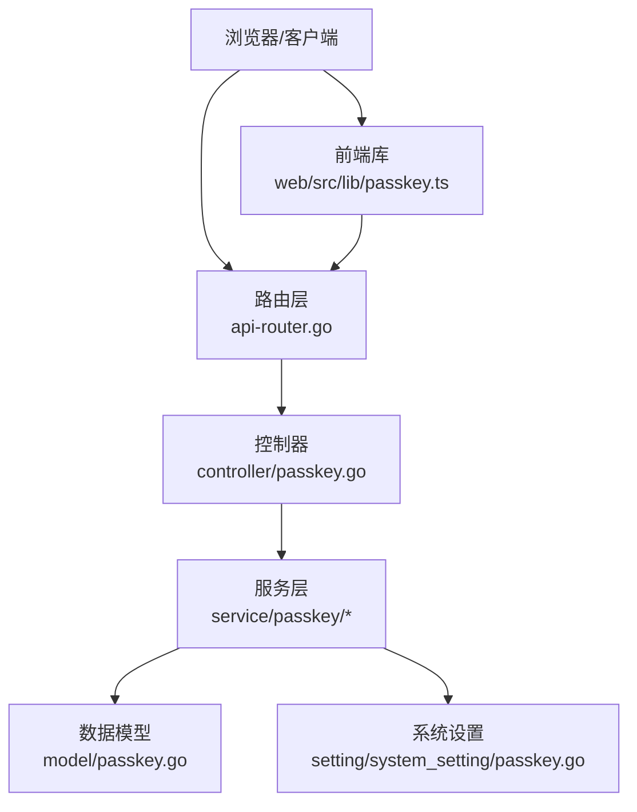
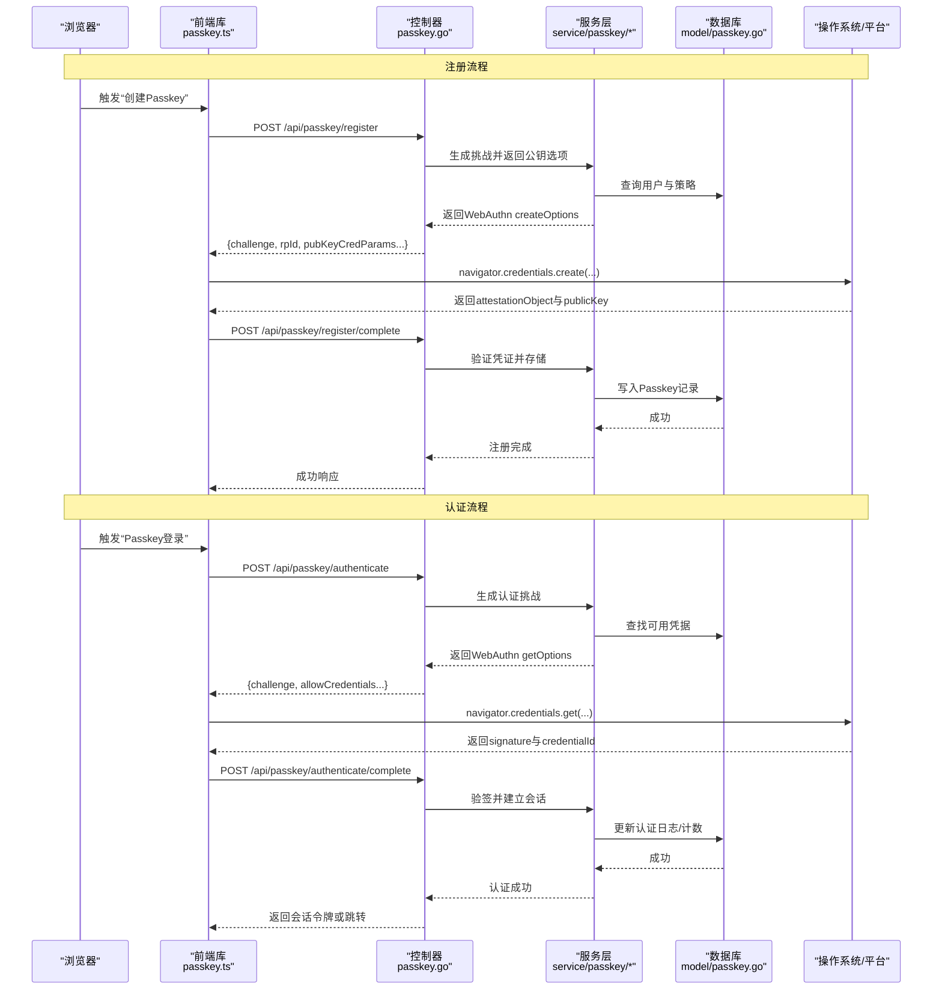
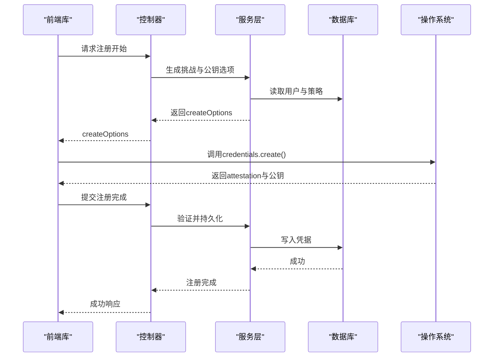
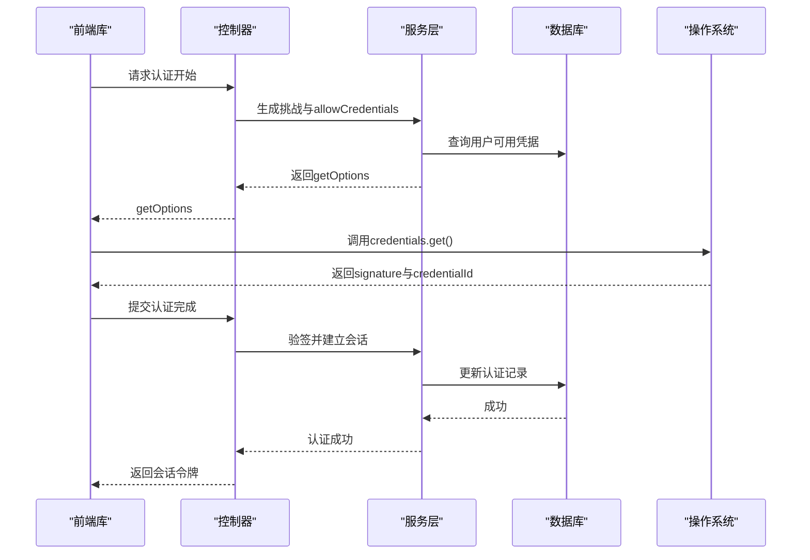
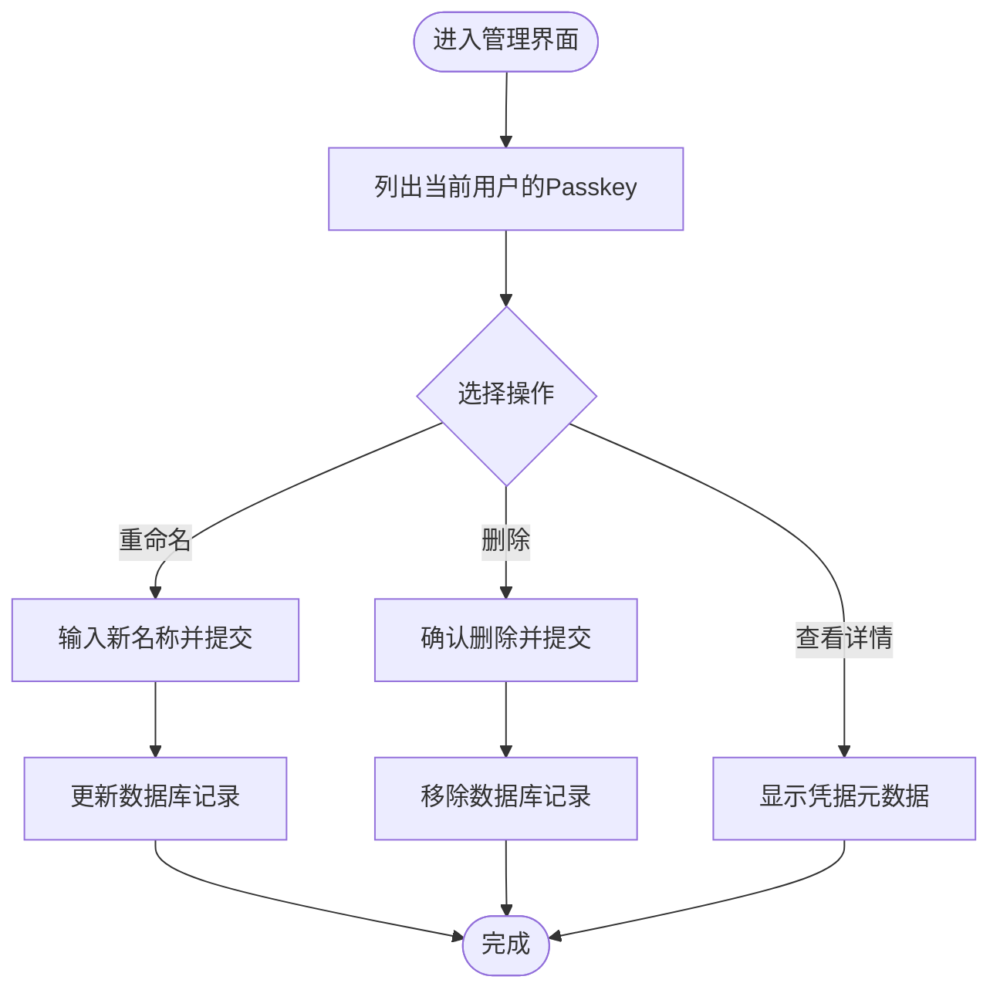
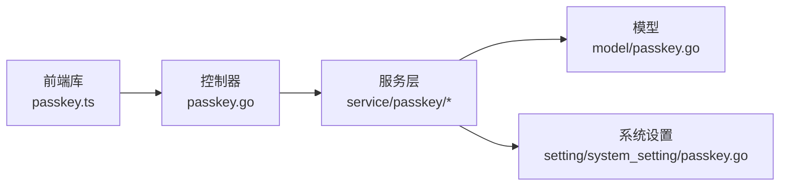

# Passkey认证

<cite>
**本文引用的文件**   
- [controller/passkey.go](file://controller/passkey.go)
- [model/passkey.go](file://model/passkey.go)
- [service/passkey/service.go](file://service/passkey/service.go)
- [service/passkey/session.go](file://service/passkey/session.go)
- [service/passkey/user.go](file://service/passkey/user.go)
- [setting/system_setting/passkey.go](file://setting/system_setting/passkey.go)
- [web/src/lib/passkey.ts](file://web/src/lib/passkey.ts)
- [router/api-router.go](file://router/api-router.go)
</cite>

## 目录
1. [简介](#简介)
2. [项目结构](#项目结构)
3. [核心组件](#核心组件)
4. [架构总览](#架构总览)
5. [详细组件分析](#详细组件分析)
6. [依赖关系分析](#依赖关系分析)
7. [性能考虑](#性能考虑)
8. [故障排查指南](#故障排查指南)
9. [结论](#结论)
10. [附录](#附录)

## 简介
本文件为Passkey（WebAuthn）认证API的完整技术文档，覆盖注册、认证与管理接口，详细说明无密码登录流程、生物识别支持与跨设备同步机制，并提供完整的Passkey生命周期管理示例。同时包含浏览器兼容性说明、安全策略与错误处理建议，以及现代浏览器集成指南和降级方案。

## 项目结构
Passkey功能在后端由控制器、服务层、模型与系统设置组成；前端通过TypeScript库调用API并与浏览器WebAuthn API交互。路由将HTTP请求分发到控制器方法，形成清晰的分层架构。

**图表来源** 
- [router/api-router.go](file://router/api-router.go)
- [controller/passkey.go](file://controller/passkey.go)
- [service/passkey/service.go](file://service/passkey/service.go)
- [model/passkey.go](file://model/passkey.go)
- [setting/system_setting/passkey.go](file://setting/system_setting/passkey.go)
- [web/src/lib/passkey.ts](file://web/src/lib/passkey.ts)

**章节来源**
- [router/api-router.go](file://router/api-router.go)
- [controller/passkey.go](file://controller/passkey.go)
- [service/passkey/service.go](file://service/passkey/service.go)
- [model/passkey.go](file://model/passkey.go)
- [setting/system_setting/passkey.go](file://setting/system_setting/passkey.go)
- [web/src/lib/passkey.ts](file://web/src/lib/passkey.ts)

## 核心组件
- 控制器：暴露REST接口，负责请求校验、参数绑定与响应封装。
- 服务层：实现Passkey注册、认证、管理与会话逻辑，协调模型与设置。
- 模型：定义Passkey实体、关联用户与持久化字段。
- 系统设置：控制Passkey功能的开关、策略与默认值。
- 前端库：封装WebAuthn调用、状态管理与错误处理，提供统一API供业务页面使用。

**章节来源**
- [controller/passkey.go](file://controller/passkey.go)
- [service/passkey/service.go](file://service/passkey/service.go)
- [service/passkey/session.go](file://service/passkey/session.go)
- [service/passkey/user.go](file://service/passkey/user.go)
- [model/passkey.go](file://model/passkey.go)
- [setting/system_setting/passkey.go](file://setting/system_setting/passkey.go)
- [web/src/lib/passkey.ts](file://web/src/lib/passkey.ts)

## 架构总览
下图展示从浏览器发起Passkey操作到后端处理的端到端流程，包括注册、认证与管理的关键路径。

**图表来源** 
- [controller/passkey.go](file://controller/passkey.go)
- [service/passkey/service.go](file://service/passkey/service.go)
- [service/passkey/session.go](file://service/passkey/session.go)
- [model/passkey.go](file://model/passkey.go)
- [web/src/lib/passkey.ts](file://web/src/lib/passkey.ts)

## 详细组件分析

### 控制器：Passkey API入口
- 职责：接收注册、认证与管理请求，进行输入校验、上下文构建与响应格式化。
- 关键接口：
  - 注册开始：生成挑战、RP信息、公钥凭据参数等。
  - 注册完成：验证 attestation，持久化公钥与元数据。
  - 认证开始：生成挑战、允许凭据列表。
  - 认证完成：验签、建立会话、返回令牌或重定向。
  - 管理接口：列出、删除、重命名Passkey等。
- 错误处理：对无效参数、不支持的算法、重复凭据、签名失败等进行分类返回。

**章节来源**
- [controller/passkey.go](file://controller/passkey.go)

### 服务层：Passkey业务逻辑
- service.go：编排注册与认证主流程，调用模型与设置，处理策略校验与结果封装。
- session.go：维护认证会话状态，生成与刷新令牌，清理过期会话。
- user.go：关联用户与Passkey，管理多设备绑定与权限。
- 优化点：
  - 并发安全的挑战生成与会话存储。
  - 批量查询与缓存常用配置。
  - 可插拔的策略校验（如仅允许特定算法）。

**章节来源**
- [service/passkey/service.go](file://service/passkey/service.go)
- [service/passkey/session.go](file://service/passkey/session.go)
- [service/passkey/user.go](file://service/passkey/user.go)

### 模型：Passkey数据模型
- 字段：用户ID、凭据ID、公钥、传输类型、用户验证标志、创建时间、更新时间、描述等。
- 约束：唯一性（用户+凭据ID）、非空校验、索引优化。
- 关系：与用户表一对多，支持多设备同步。

**章节来源**
- [model/passkey.go](file://model/passkey.go)

### 系统设置：Passkey策略与开关
- 开关：启用/禁用Passkey、是否要求用户验证、允许的算法与传输类型。
- 策略：RP ID、超时、挑战长度、是否允许匿名凭据等。
- 扩展：与OAuth/SSO集成时的映射规则。

**章节来源**
- [setting/system_setting/passkey.go](file://setting/system_setting/passkey.go)

### 前端库：WebAuthn集成
- 能力：封装navigator.credentials.create/get，处理挑战、凭据与签名。
- 状态管理：本地暂存挑战、重试与回退逻辑。
- 错误处理：捕获浏览器不支持、用户取消、权限拒绝等情况，提供友好提示。
- 降级方案：在WebAuthn不可用时回退到密码或OTP。

**章节来源**
- [web/src/lib/passkey.ts](file://web/src/lib/passkey.ts)

### 注册流程时序图

**图表来源** 
- [controller/passkey.go](file://controller/passkey.go)
- [service/passkey/service.go](file://service/passkey/service.go)
- [model/passkey.go](file://model/passkey.go)
- [web/src/lib/passkey.ts](file://web/src/lib/passkey.ts)

### 认证流程时序图

**图表来源** 
- [controller/passkey.go](file://controller/passkey.go)
- [service/passkey/service.go](file://service/passkey/service.go)
- [service/passkey/session.go](file://service/passkey/session.go)
- [model/passkey.go](file://model/passkey.go)
- [web/src/lib/passkey.ts](file://web/src/lib/passkey.ts)

### 管理流程流程图

**图表来源** 
- [controller/passkey.go](file://controller/passkey.go)
- [service/passkey/service.go](file://service/passkey/service.go)
- [model/passkey.go](file://model/passkey.go)

## 依赖关系分析
- 控制器依赖服务层进行业务编排。
- 服务层依赖模型进行数据持久化与查询。
- 服务层依赖系统设置获取策略与开关。
- 前端库依赖浏览器WebAuthn API，并在不可用时回退到传统认证方式。

**图表来源** 
- [controller/passkey.go](file://controller/passkey.go)
- [service/passkey/service.go](file://service/passkey/service.go)
- [model/passkey.go](file://model/passkey.go)
- [setting/system_setting/passkey.go](file://setting/system_setting/passkey.go)
- [web/src/lib/passkey.ts](file://web/src/lib/passkey.ts)

**章节来源**
- [controller/passkey.go](file://controller/passkey.go)
- [service/passkey/service.go](file://service/passkey/service.go)
- [model/passkey.go](file://model/passkey.go)
- [setting/system_setting/passkey.go](file://setting/system_setting/passkey.go)
- [web/src/lib/passkey.ts](file://web/src/lib/passkey.ts)

## 性能考虑
- 挑战生成与会话存储应使用高效数据结构与并发安全机制。
- 数据库查询增加索引（用户ID、凭据ID），减少全表扫描。
- 批量操作与缓存策略提升高频读场景性能。
- 前端避免频繁轮询，采用事件驱动与重试退避。

[本节为通用指导，不直接分析具体文件]

## 故障排查指南
- 常见问题：
  - 浏览器不支持WebAuthn：检测API可用性并提示降级方案。
  - 用户取消生物识别：捕获取消信号并引导重新尝试。
  - 签名验证失败：检查挑战一致性、时间戳与算法匹配。
  - 重复凭据：校验用户+凭据ID唯一性。
- 调试建议：
  - 开启详细日志记录挑战生成、凭据提交与验签结果。
  - 使用开发者工具检查浏览器WebAuthn调用栈。
  - 核对RP ID与域名一致性。

**章节来源**
- [controller/passkey.go](file://controller/passkey.go)
- [service/passkey/service.go](file://service/passkey/service.go)
- [web/src/lib/passkey.ts](file://web/src/lib/passkey.ts)

## 结论
本项目实现了符合WebAuthn标准的Passkey认证体系，涵盖注册、认证与管理全流程，支持生物识别与跨设备同步。通过清晰的分层架构与完善的错误处理，提供了安全、易用且可扩展的无密码登录体验。建议在生产环境中启用严格策略并持续监控异常行为。

[本节为总结性内容，不直接分析具体文件]

## 附录
- 浏览器兼容性：
  - 现代浏览器（Chrome、Edge、Safari、Firefox）均支持WebAuthn。
  - 移动端需依赖平台生物识别（Touch ID、Face ID、指纹）。
- 安全策略：
  - 强制用户验证（UV）用于高安全场景。
  - 限制算法与传输类型以增强安全性。
- 降级方案：
  - 当WebAuthn不可用时，自动回退到密码或一次性验证码（OTP）。
- 集成指南：
  - 前端优先使用passkey.ts库简化调用。
  - 后端确保RP ID与站点域名一致，挑战随机且短时效。

[本节为概念性内容，不直接分析具体文件]