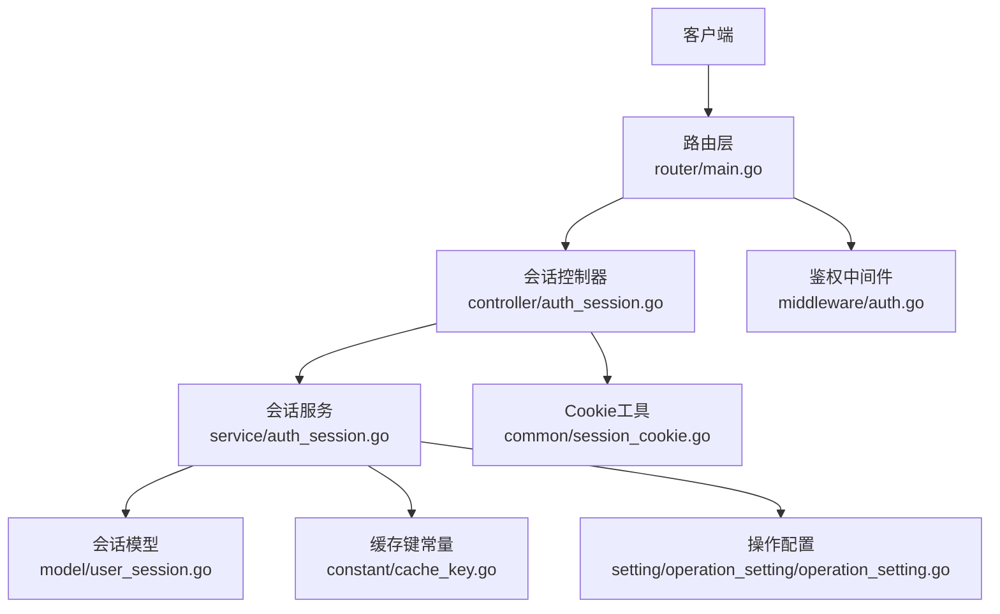
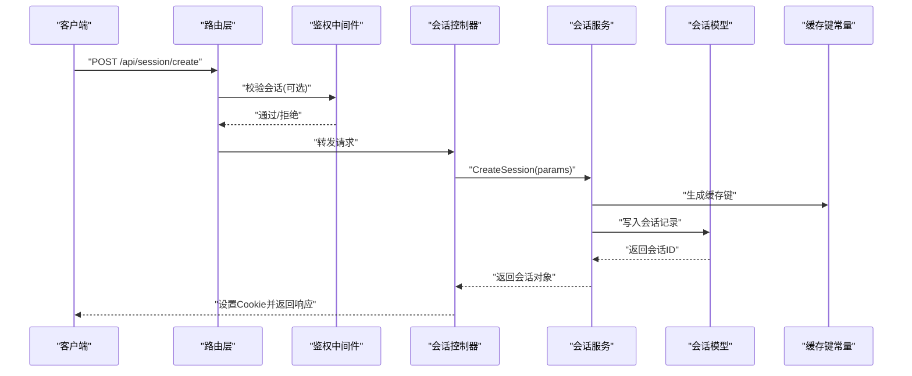
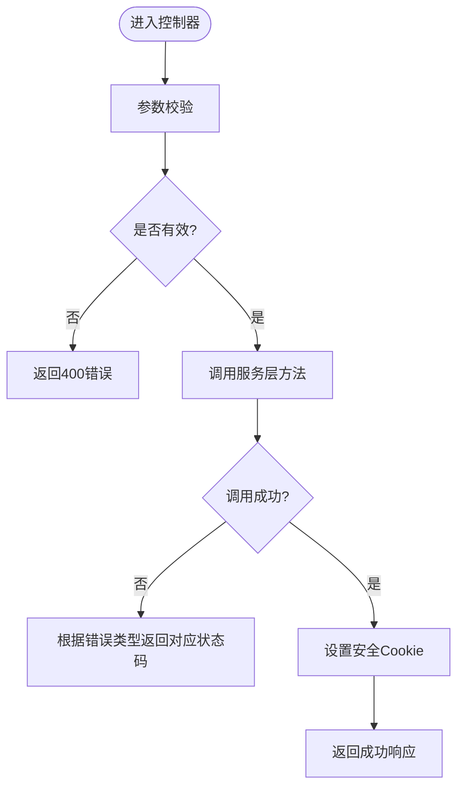
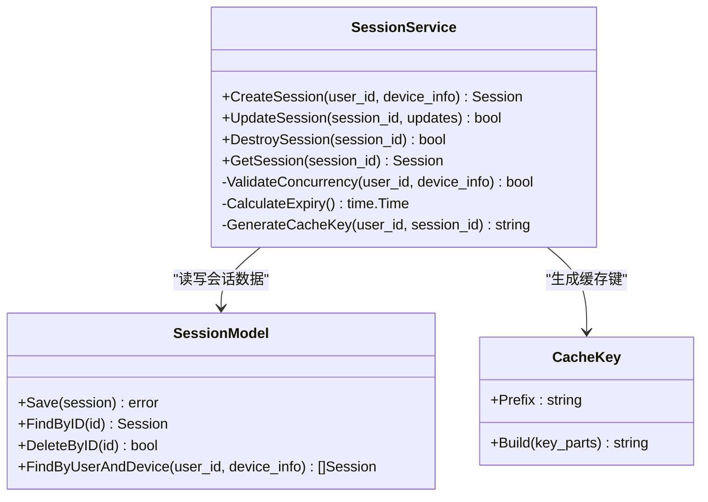
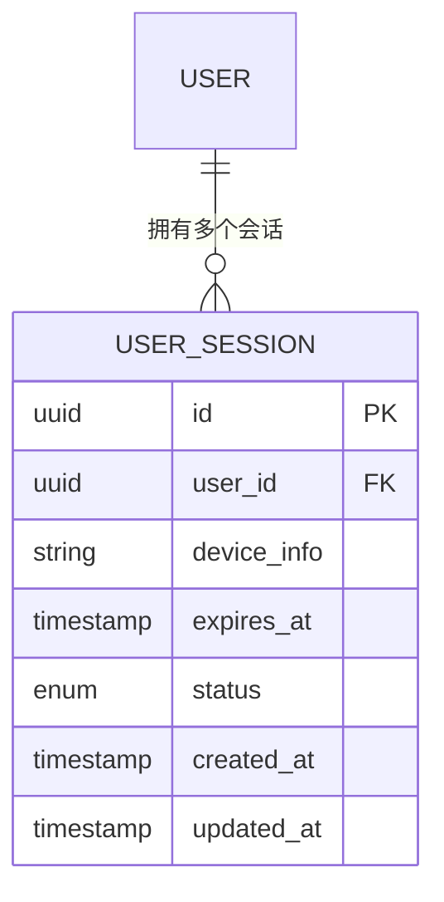
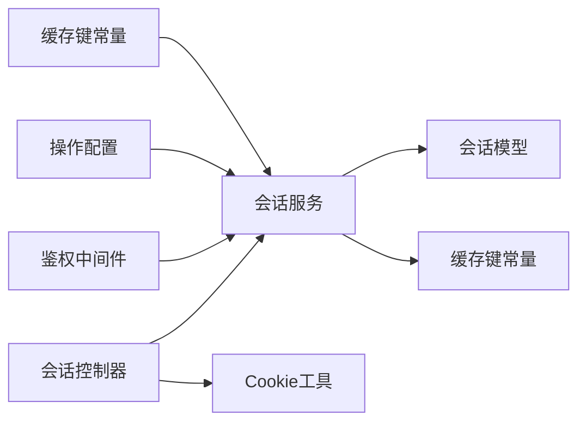

# 会话管理

<cite>
**本文引用的文件**   
- [controller/auth_session.go](file://controller/auth_session.go)
- [service/auth_session.go](file://service/auth_session.go)
- [model/user_session.go](file://model/user_session.go)
- [common/session_cookie.go](file://common/session_cookie.go)
- [middleware/auth.go](file://middleware/auth.go)
- [router/main.go](file://router/main.go)
- [setting/operation_setting/operation_setting.go](file://setting/operation_setting/operation_setting.go)
- [constant/cache_key.go](file://constant/cache_key.go)
</cite>

## 目录
1. [简介](#简介)
2. [项目结构](#项目结构)
3. [核心组件](#核心组件)
4. [架构总览](#架构总览)
5. [详细组件分析](#详细组件分析)
6. [依赖关系分析](#依赖关系分析)
7. [性能考量](#性能考量)
8. [故障排查指南](#故障排查指南)
9. [结论](#结论)
10. [附录](#附录)

## 简介
本文件为“会话管理”API的权威文档，覆盖以下主题：
- 会话创建、更新、销毁与查询接口说明
- 会话存储策略、过期机制与安全属性
- 多设备登录管理与并发控制
- 自动清理机制
- 会话劫持防护、CSRF保护与安全最佳实践
- 会话监控与调试工具使用方法

本项目的会话能力由控制器层（controller）、服务层（service）、模型层（model）以及中间件（middleware）共同实现，并通过配置项与常量进行行为控制。

## 项目结构
与会话管理相关的代码主要分布在如下模块：
- 控制器层：对外暴露会话相关HTTP接口
- 服务层：封装会话业务逻辑（创建、更新、销毁、查询等）
- 模型层：定义会话实体与持久化映射
- 通用工具：Cookie处理、缓存键生成等
- 中间件：鉴权、请求校验、安全头设置等
- 路由：注册会话相关路由
- 配置与常量：会话过期、安全策略、缓存键前缀等

**图示来源** 
- [router/main.go](file://router/main.go)
- [controller/auth_session.go](file://controller/auth_session.go)
- [service/auth_session.go](file://service/auth_session.go)
- [model/user_session.go](file://model/user_session.go)
- [common/session_cookie.go](file://common/session_cookie.go)
- [middleware/auth.go](file://middleware/auth.go)
- [constant/cache_key.go](file://constant/cache_key.go)
- [setting/operation_setting/operation_setting.go](file://setting/operation_setting/operation_setting.go)

**章节来源**
- [router/main.go](file://router/main.go)
- [controller/auth_session.go](file://controller/auth_session.go)
- [service/auth_session.go](file://service/auth_session.go)
- [model/user_session.go](file://model/user_session.go)
- [common/session_cookie.go](file://common/session_cookie.go)
- [middleware/auth.go](file://middleware/auth.go)
- [constant/cache_key.go](file://constant/cache_key.go)
- [setting/operation_setting/operation_setting.go](file://setting/operation_setting/operation_setting.go)

## 核心组件
- 会话控制器（auth_session.go）
  - 职责：接收并校验请求参数，调用服务层完成会话生命周期操作，返回统一响应
  - 关键点：参数校验、错误码映射、响应格式化
- 会话服务（auth_session.go）
  - 职责：实现会话创建、更新、销毁、查询的核心逻辑；协调模型与缓存键；处理并发与过期策略
  - 关键点：幂等性、并发控制、过期时间计算、多设备会话管理
- 会话模型（user_session.go）
  - 职责：定义会话数据结构、字段约束、数据库映射与索引
  - 关键点：唯一性约束（用户ID+设备标识）、过期时间字段、状态字段
- Cookie工具（session_cookie.go）
  - 职责：生成与解析会话Cookie，设置安全属性（HttpOnly、Secure、SameSite）
  - 关键点：防XSS、跨站请求限制、传输加密
- 鉴权中间件（auth.go）
  - 职责：从请求中解析会话标识，校验有效性，注入上下文
  - 关键点：会话存在性检查、过期判断、并发限制检查
- 配置与常量（operation_setting.go、cache_key.go）
  - 职责：提供会话过期时长、最大并发数、缓存键前缀等可配置项
  - 关键点：热更新支持、环境差异化配置

**章节来源**
- [controller/auth_session.go](file://controller/auth_session.go)
- [service/auth_session.go](file://service/auth_session.go)
- [model/user_session.go](file://model/user_session.go)
- [common/session_cookie.go](file://common/session_cookie.go)
- [middleware/auth.go](file://middleware/auth.go)
- [setting/operation_setting/operation_setting.go](file://setting/operation_setting/operation_setting.go)
- [constant/cache_key.go](file://constant/cache_key.go)

## 架构总览
会话管理的整体流程如下：
- 客户端发起会话相关请求（创建/更新/销毁/查询）
- 路由层将请求分发到会话控制器
- 控制器调用会话服务执行具体业务逻辑
- 服务层通过模型访问持久化存储，并使用缓存键进行快速定位
- 鉴权中间件在请求进入时校验会话有效性
- Cookie工具负责会话标识的安全传递

**图示来源** 
- [router/main.go](file://router/main.go)
- [middleware/auth.go](file://middleware/auth.go)
- [controller/auth_session.go](file://controller/auth_session.go)
- [service/auth_session.go](file://service/auth_session.go)
- [model/user_session.go](file://model/user_session.go)
- [constant/cache_key.go](file://constant/cache_key.go)

## 详细组件分析

### 会话控制器（auth_session.go）
- 功能要点
  - 创建会话：接收用户凭证或第三方令牌，调用服务层创建会话，设置Cookie
  - 更新会话：刷新过期时间、扩展设备信息或权限范围
  - 销毁会话：根据会话ID或当前上下文删除会话，清除Cookie
  - 查询会话：返回当前会话详情或指定会话ID的元数据（受权限控制）
- 输入输出
  - 输入：JSON请求体，包含用户标识、设备信息、扩展参数等
  - 输出：统一JSON响应，包含会话ID、过期时间、状态码与消息
- 错误处理
  - 参数校验失败返回400
  - 会话冲突（如并发限制）返回409
  - 未授权或会话不存在返回401/404
  - 服务器内部错误返回500

**图示来源** 
- [controller/auth_session.go](file://controller/auth_session.go)

**章节来源**
- [controller/auth_session.go](file://controller/auth_session.go)

### 会话服务（auth_session.go）
- 功能要点
  - 创建会话：生成唯一会话ID，写入模型，设置过期时间，处理多设备并发限制
  - 更新会话：按会话ID查找并更新字段，确保幂等性
  - 销毁会话：删除记录并清理关联缓存键
  - 查询会话：根据会话ID或上下文获取会话详情
- 并发控制
  - 基于用户ID与设备标识限制同时在线会话数量
  - 使用分布式锁或原子操作避免竞态条件
- 过期机制
  - 会话记录中包含过期时间字段
  - 定时任务或惰性失效策略清理过期会话
- 多设备管理
  - 支持同一用户在不同设备上拥有多个活跃会话
  - 提供强制下线指定设备的能力

**图示来源** 
- [service/auth_session.go](file://service/auth_session.go)
- [model/user_session.go](file://model/user_session.go)
- [constant/cache_key.go](file://constant/cache_key.go)

**章节来源**
- [service/auth_session.go](file://service/auth_session.go)
- [model/user_session.go](file://model/user_session.go)
- [constant/cache_key.go](file://constant/cache_key.go)

### 会话模型（user_session.go）
- 字段说明
  - 会话ID：唯一标识
  - 用户ID：关联用户
  - 设备标识：用于区分不同设备
  - 过期时间：会话失效时间点
  - 状态：活跃/已注销/锁定等
- 索引设计
  - 主键索引：会话ID
  - 复合索引：用户ID+设备标识（用于并发限制与多设备管理）
  - 过期时间索引：用于定时清理任务
- 约束与校验
  - 唯一性约束防止重复会话
  - 非空校验确保关键字段完整

**图示来源** 
- [model/user_session.go](file://model/user_session.go)

**章节来源**
- [model/user_session.go](file://model/user_session.go)

### Cookie工具（session_cookie.go）
- 功能要点
  - 生成会话Cookie：包含会话ID与必要元数据
  - 设置安全属性：HttpOnly（防XSS）、Secure（仅HTTPS）、SameSite（防CSRF）
  - 解析Cookie：从请求中提取会话标识
- 最佳实践
  - 生产环境强制启用Secure与HttpOnly
  - 根据部署环境动态设置SameSite策略
  - 避免在Cookie中存储敏感明文信息

**章节来源**
- [common/session_cookie.go](file://common/session_cookie.go)

### 鉴权中间件（auth.go）
- 功能要点
  - 从请求头或Cookie中解析会话标识
  - 校验会话是否存在且未过期
  - 检查并发限制是否超限
  - 将用户上下文注入到请求上下文中
- 错误处理
  - 会话缺失或无效返回401
  - 并发超限返回429或自定义错误码

**章节来源**
- [middleware/auth.go](file://middleware/auth.go)

### 配置与常量（operation_setting.go、cache_key.go）
- 配置项
  - 会话默认过期时长（分钟）
  - 最大并发会话数（每用户）
  - 是否启用严格模式（如强制HTTPS）
- 常量
  - 缓存键前缀（如“session:user:”）
  - 状态枚举值（活跃、已注销、锁定）

**章节来源**
- [setting/operation_setting/operation_setting.go](file://setting/operation_setting/operation_setting.go)
- [constant/cache_key.go](file://constant/cache_key.go)

## 依赖关系分析
会话管理模块的依赖关系如下：
- 控制器依赖服务层与Cookie工具
- 服务层依赖模型与缓存键常量
- 中间件依赖会话验证逻辑
- 配置与常量被多处引用以保持一致性

**图示来源** 
- [controller/auth_session.go](file://controller/auth_session.go)
- [service/auth_session.go](file://service/auth_session.go)
- [model/user_session.go](file://model/user_session.go)
- [common/session_cookie.go](file://common/session_cookie.go)
- [middleware/auth.go](file://middleware/auth.go)
- [setting/operation_setting/operation_setting.go](file://setting/operation_setting/operation_setting.go)
- [constant/cache_key.go](file://constant/cache_key.go)

**章节来源**
- [controller/auth_session.go](file://controller/auth_session.go)
- [service/auth_session.go](file://service/auth_session.go)
- [model/user_session.go](file://model/user_session.go)
- [common/session_cookie.go](file://common/session_cookie.go)
- [middleware/auth.go](file://middleware/auth.go)
- [setting/operation_setting/operation_setting.go](file://setting/operation_setting/operation_setting.go)
- [constant/cache_key.go](file://constant/cache_key.go)

## 性能考量
- 缓存键设计：使用前缀与哈希减少键冲突与扫描开销
- 并发控制：使用原子操作或分布式锁避免热点竞争
- 过期清理：采用惰性失效与定时任务结合，降低实时清理压力
- 数据库索引：合理设计复合索引提升查询效率
- 连接池：复用数据库与缓存连接，减少握手开销

[本节为通用指导，不直接分析具体文件]

## 故障排查指南
- 常见问题
  - 会话无法创建：检查参数校验、并发限制、数据库写入权限
  - 会话频繁过期：确认过期时间配置与客户端刷新逻辑
  - 多设备登录异常：验证设备标识唯一性与并发上限配置
  - 鉴权失败：检查Cookie安全属性、中间件配置与网络环境
- 调试建议
  - 启用详细日志记录会话生命周期事件
  - 使用监控指标观察会话创建/销毁速率与过期率
  - 通过测试用例模拟高并发场景验证稳定性

**章节来源**
- [controller/auth_session.go](file://controller/auth_session.go)
- [service/auth_session.go](file://service/auth_session.go)
- [middleware/auth.go](file://middleware/auth.go)

## 结论
本会话管理系统通过清晰的层次划分与模块化设计，实现了安全的会话生命周期管理。其特性包括：
- 完整的CRUD接口与统一的错误处理
- 灵活的过期机制与并发控制
- 多设备支持与强制下线能力
- 安全属性强化（HttpOnly、Secure、SameSite）
- 可扩展的配置与常量体系

建议在生产环境中启用严格模式、定期审计会话活动，并结合监控告警保障系统稳定性。

[本节为总结性内容，不直接分析具体文件]

## 附录
- API参考
  - 创建会话：POST /api/session/create
  - 更新会话：PUT /api/session/update
  - 销毁会话：DELETE /api/session/destroy
  - 查询会话：GET /api/session/query
- 安全最佳实践
  - 始终使用HTTPS传输会话标识
  - 定期轮换会话密钥与签名算法
  - 实施最小权限原则，限制会话作用域
  - 启用CSRF保护与同源策略
- 监控与调试
  - 记录会话创建、更新、销毁事件
  - 监控会话数量、过期率、错误率
  - 提供管理员界面查看活跃会话列表

[本节为补充信息，不直接分析具体文件]