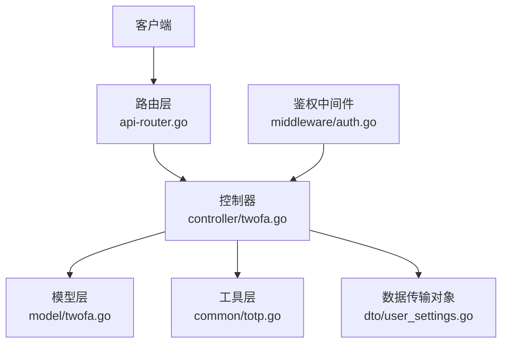
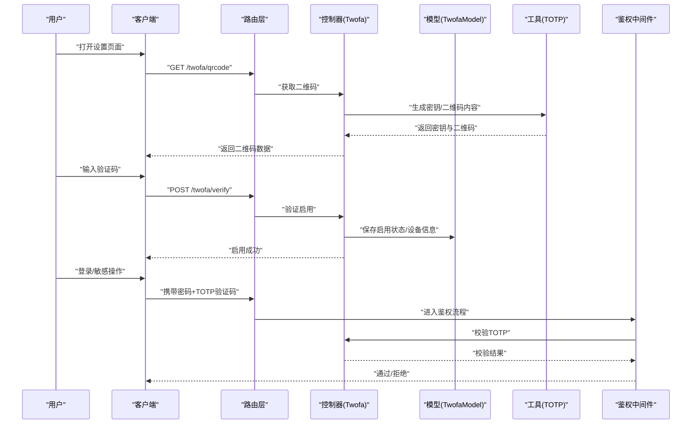
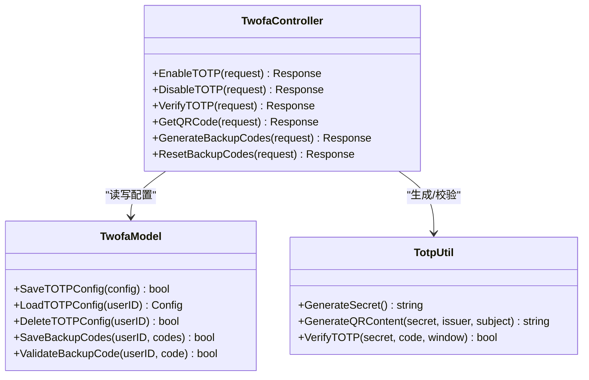
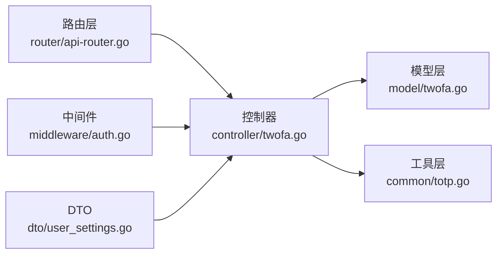

# 双因素认证

<cite>
**本文引用的文件**   
- [controller/twofa.go](file://controller/twofa.go)
- [model/twofa.go](file://model/twofa.go)
- [common/totp.go](file://common/totp.go)
- [router/api-router.go](file://router/api-router.go)
- [middleware/auth.go](file://middleware/auth.go)
- [dto/user_settings.go](file://dto/user_settings.go)
</cite>

## 目录
1. [简介](#简介)
2. [项目结构](#项目结构)
3. [核心组件](#核心组件)
4. [架构总览](#架构总览)
5. [详细组件分析](#详细组件分析)
6. [依赖关系分析](#依赖关系分析)
7. [性能与安全考虑](#性能与安全考虑)
8. [故障排除指南](#故障排除指南)
9. [结论](#结论)
10. [附录：客户端集成与移动端适配建议](#附录客户端集成与移动端适配建议)

## 简介
本文件为“双因素认证（TOTP）”API 的完整技术文档，覆盖启用、禁用、验证流程；二维码生成、备份代码管理与设备绑定；设置流程与验证示例；安全最佳实践、恢复机制与故障排除；以及客户端集成与移动端应用适配建议。读者无需深入源码即可理解并正确集成该能力。

## 项目结构
与双因素认证相关的后端实现主要分布在以下模块：
- 控制器层：处理 HTTP 请求与响应，暴露 TOTP 相关 API
- 模型层：定义用户 TOTP 配置与状态的数据结构
- 工具层：提供 TOTP 算法、密钥管理、二维码生成等通用能力
- 路由层：将 URL 映射到控制器方法
- 中间件：在鉴权流程中校验 TOTP 验证码
- DTO：用于前后端交互的请求/响应数据结构

图表来源
- [router/api-router.go](file://router/api-router.go)
- [controller/twofa.go](file://controller/twofa.go)
- [model/twofa.go](file://model/twofa.go)
- [common/totp.go](file://common/totp.go)
- [middleware/auth.go](file://middleware/auth.go)
- [dto/user_settings.go](file://dto/user_settings.go)

章节来源
- [controller/twofa.go](file://controller/twofa.go)
- [model/twofa.go](file://model/twofa.go)
- [common/totp.go](file://common/totp.go)
- [router/api-router.go](file://router/api-router.go)
- [middleware/auth.go](file://middleware/auth.go)
- [dto/user_settings.go](file://dto/user_settings.go)

## 核心组件
- 控制器（TOTP 接口）
  - 负责接收启用、禁用、验证、获取二维码、管理备份码等请求，调用服务与模型完成业务逻辑，返回统一格式响应。
- 模型（TOTP 数据）
  - 维护用户的 TOTP 配置（如是否启用、密钥、设备信息、备份码集合等），并提供持久化访问。
- 工具（TOTP 算法）
  - 提供 TOTP 生成与校验、密钥生成、二维码内容构造等基础能力。
- 路由（URL 映射）
  - 将 /twofa/* 或类似路径映射到控制器方法。
- 中间件（鉴权增强）
  - 在登录或敏感操作时校验 TOTP 验证码，确保二次认证生效。
- DTO（请求/响应）
  - 定义启用、验证、备份码管理等接口的输入输出结构。

章节来源
- [controller/twofa.go](file://controller/twofa.go)
- [model/twofa.go](file://model/twofa.go)
- [common/totp.go](file://common/totp.go)
- [router/api-router.go](file://router/api-router.go)
- [middleware/auth.go](file://middleware/auth.go)
- [dto/user_settings.go](file://dto/user_settings.go)

## 架构总览
TOTP 双因素认证的整体交互如下：
- 用户在客户端触发“启用 TOTP”，后端生成一次性密钥与二维码，供用户扫码绑定。
- 用户通过 TOTP 应用生成验证码进行“验证启用”，成功后开启强制二次认证。
- 后续登录或敏感操作需携带 TOTP 验证码，由中间件校验。
- 支持备份码用于设备丢失或无法使用 TOTP 时的恢复。

图表来源
- [controller/twofa.go](file://controller/twofa.go)
- [model/twofa.go](file://model/twofa.go)
- [common/totp.go](file://common/totp.go)
- [middleware/auth.go](file://middleware/auth.go)
- [router/api-router.go](file://router/api-router.go)

## 详细组件分析

### 控制器：TOTP 接口（启用/禁用/验证/二维码/备份码）
- 职责
  - 提供 RESTful 接口：启用、禁用、验证、获取二维码、生成/下载备份码、重置备份码等。
  - 校验请求参数，调用模型与工具完成业务逻辑。
  - 统一错误码与提示信息，便于前端展示。
- 关键流程
  - 启用流程：生成密钥与二维码 -> 用户扫码 -> 提交验证码 -> 校验成功则启用。
  - 禁用流程：校验当前状态 -> 清除密钥与设备信息 -> 返回成功。
  - 验证流程：校验时间窗口内的 TOTP 值，允许一定容错范围。
  - 备份码：生成一次性备用码列表，存储加密或哈希形式，限制下载次数与有效期。
- 错误处理
  - 参数缺失、状态不一致、验证码过期、重复启用/禁用等错误分类返回。

章节来源
- [controller/twofa.go](file://controller/twofa.go)

#### 类图（控制器与依赖）

图表来源
- [controller/twofa.go](file://controller/twofa.go)
- [model/twofa.go](file://model/twofa.go)
- [common/totp.go](file://common/totp.go)

### 模型：TOTP 数据与持久化
- 职责
  - 定义用户 TOTP 配置结构体（启用标志、密钥、设备标识、创建/更新时间等）。
  - 提供备份码的存储与校验接口。
  - 保证并发安全与一致性（例如启用/禁用操作的原子性）。
- 数据结构要点
  - 用户ID、启用状态、密钥（加密存储）、设备指纹、最近验证时间。
  - 备份码集合（一次性、可限制数量与有效期）。
- 复杂度与性能
  - 读取/写入均为 O(1) 级别（按用户ID索引）。
  - 备份码校验采用哈希匹配，避免明文比较。

章节来源
- [model/twofa.go](file://model/twofa.go)

### 工具：TOTP 算法与二维码
- 职责
  - 生成符合 RFC 6238 的 TOTP 密钥与验证码。
  - 生成标准 QR 码内容（包含算法、周期、字符集、发行方、主题等）。
  - 提供时间窗口容错校验（通常允许前后一个窗口）。
- 关键点
  - 密钥长度与随机性（建议使用强随机源）。
  - 二维码字段遵循 Google Authenticator/OATH-TOTP 规范。
  - 校验函数支持时间漂移与网络延迟。

章节来源
- [common/totp.go](file://common/totp.go)

### 路由：URL 映射
- 职责
  - 将 /twofa/* 路径映射到控制器方法。
  - 结合中间件对敏感接口进行鉴权与速率限制。
- 典型路由
  - GET /twofa/qrcode
  - POST /twofa/enable
  - POST /twofa/disable
  - POST /twofa/verify
  - POST /twofa/backup-codes/generate
  - POST /twofa/backup-codes/reset

章节来源
- [router/api-router.go](file://router/api-router.go)

### 中间件：鉴权增强（TOTP 校验）
- 职责
  - 在登录或敏感操作时检查用户是否启用了 TOTP。
  - 若启用，则从请求中读取 TOTP 验证码并调用控制器或服务进行校验。
  - 校验失败则拒绝请求并返回明确错误。
- 策略
  - 支持白名单接口（如仅二维码获取与首次验证）。
  - 支持速率限制与防重放（记录最近验证时间与次数）。

章节来源
- [middleware/auth.go](file://middleware/auth.go)

### DTO：请求与响应结构
- 职责
  - 定义启用、验证、备份码管理的输入输出字段。
  - 统一错误码与消息格式，便于前端解析与提示。
- 关键字段
  - 启用：用户ID、验证码、设备信息。
  - 验证：用户ID、验证码、上下文（登录/敏感操作）。
  - 备份码：生成数量、重置确认标记。

章节来源
- [dto/user_settings.go](file://dto/user_settings.go)

## 依赖关系分析
- 控制器依赖模型与工具，不直接依赖外部库，保持高内聚低耦合。
- 中间件在鉴权链中插入 TOTP 校验，不影响主鉴权逻辑。
- 路由仅做映射，无业务逻辑。
- DTO 作为契约，确保前后端一致。

图表来源
- [router/api-router.go](file://router/api-router.go)
- [controller/twofa.go](file://controller/twofa.go)
- [model/twofa.go](file://model/twofa.go)
- [common/totp.go](file://common/totp.go)
- [middleware/auth.go](file://middleware/auth.go)
- [dto/user_settings.go](file://dto/user_settings.go)

章节来源
- [router/api-router.go](file://router/api-router.go)
- [controller/twofa.go](file://controller/twofa.go)
- [model/twofa.go](file://model/twofa.go)
- [common/totp.go](file://common/totp.go)
- [middleware/auth.go](file://middleware/auth.go)
- [dto/user_settings.go](file://dto/user_settings.go)

## 性能与安全考虑
- 性能
  - TOTP 校验为轻量计算，单次耗时微秒级，适合高频校验。
  - 建议对验证码校验增加速率限制，防止暴力破解。
  - 二维码生成应避免阻塞主线程，必要时异步处理。
- 安全
  - 密钥必须加密存储，禁止明文落盘。
  - 备份码应一次性使用且限制生成次数与有效期。
  - 所有接口需 HTTPS 传输，防止中间人攻击。
  - 严格校验请求来源与用户身份，避免越权操作。
  - 日志脱敏，不记录密钥与验证码。

[本节为通用指导，不直接分析具体文件]

## 故障排除指南
- 常见问题
  - 验证码无效：检查设备时间同步、时间窗口设置、密钥是否正确。
  - 无法启用：确认用户未重复启用，检查数据库写入权限。
  - 备份码失效：确认未超过有效期或使用次数上限。
- 排查步骤
  - 查看控制器日志，定位请求参数与状态。
  - 检查中间件的鉴权链路，确认 TOTP 校验是否被触发。
  - 核对工具层的密钥与二维码生成逻辑是否符合规范。
- 恢复机制
  - 使用备份码登录并重新启用 TOTP。
  - 管理员可重置用户 TOTP 配置（需审计与审批）。

章节来源
- [controller/twofa.go](file://controller/twofa.go)
- [middleware/auth.go](file://middleware/auth.go)
- [common/totp.go](file://common/totp.go)

## 结论
TOTP 双因素认证通过清晰的控制器、模型、工具与中间件协作，提供了安全可靠的二次认证能力。合理配置密钥管理、备份码策略与鉴权中间件，可在保障用户体验的同时显著提升账户安全性。

[本节为总结，不直接分析具体文件]

## 附录：客户端集成与移动端适配建议
- 客户端集成
  - 首次启用：调用获取二维码接口，展示二维码让用户扫码绑定。
  - 验证启用：用户输入 TOTP 应用生成的验证码，调用验证接口。
  - 登录流程：在密码登录后，若用户启用 TOTP，则要求输入验证码。
  - 备份码：在启用成功后生成备份码并安全保存，用于设备丢失恢复。
- 移动端适配
  - 使用标准 TOTP 应用（Google Authenticator、Microsoft Authenticator 等）。
  - 支持横竖屏切换与无障碍访问。
  - 提供复制与分享功能，方便用户迁移设备。
  - 界面友好提示，包括时间同步错误与验证码过期说明。

[本节为通用指导，不直接分析具体文件]