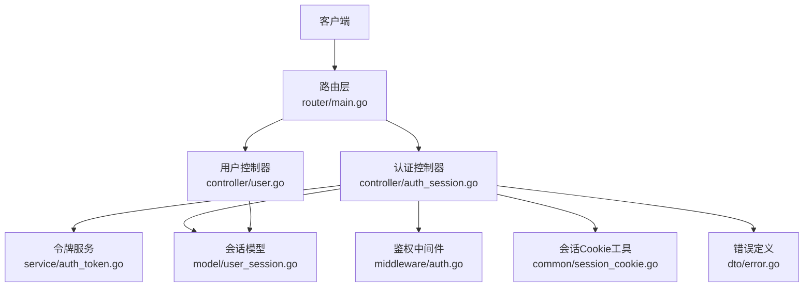
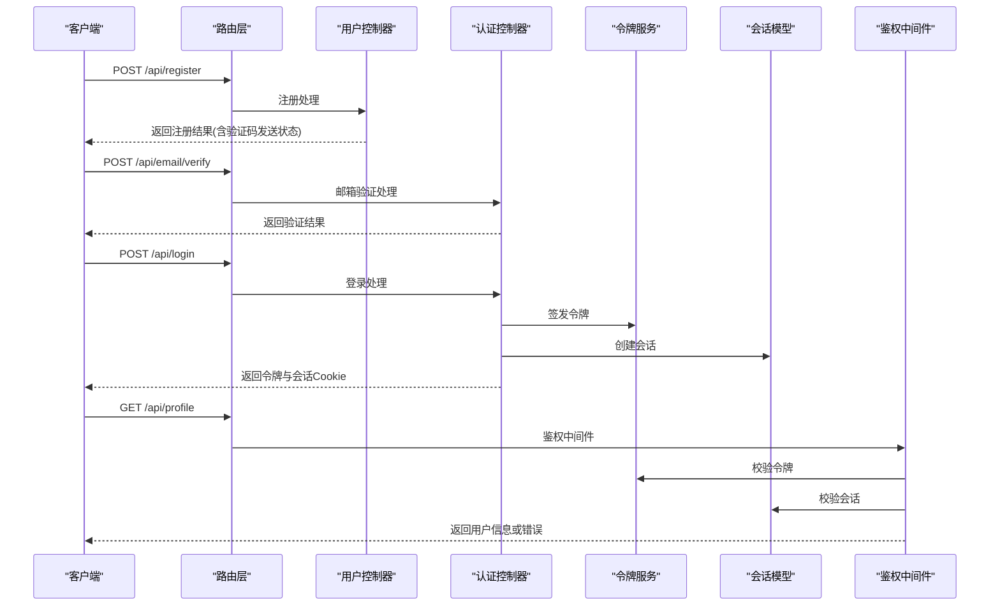
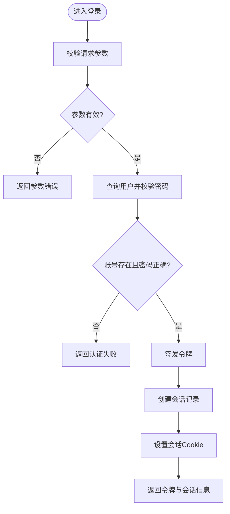
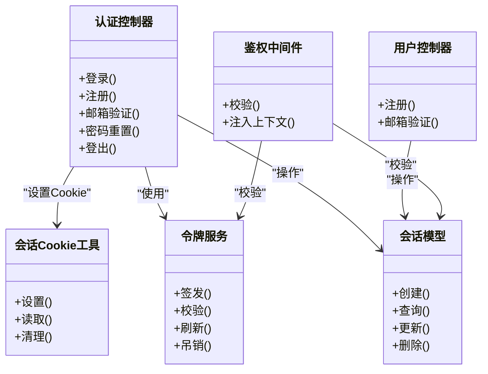

# 基础认证

<cite>
**本文引用的文件**   
- [controller/auth_session.go](file://controller/auth_session.go)
- [controller/user.go](file://controller/user.go)
- [service/auth_token.go](file://service/auth_token.go)
- [model/user_session.go](file://model/user_session.go)
- [middleware/auth.go](file://middleware/auth.go)
- [router/main.go](file://router/main.go)
- [common/session_cookie.go](file://common/session_cookie.go)
- [dto/error.go](file://dto/error.go)
- [setting/operation_setting/token_setting.go](file://setting/operation_setting/token_setting.go)
</cite>

## 目录
1. [简介](#简介)
2. [项目结构](#项目结构)
3. [核心组件](#核心组件)
4. [架构总览](#架构总览)
5. [详细组件分析](#详细组件分析)
6. [依赖关系分析](#依赖关系分析)
7. [性能考虑](#性能考虑)
8. [故障排查指南](#故障排查指南)
9. [结论](#结论)
10. [附录：客户端集成与常见问题](#附录客户端集成与常见问题)

## 简介
本文件为“基础认证”API的权威文档，覆盖用户注册、登录、密码重置、邮箱验证等核心能力，并详细说明请求参数、响应格式、错误处理与状态码。同时给出从注册到成功登录的完整流程示例，说明会话管理、令牌刷新机制与安全策略，并提供客户端集成指南与常见问题解决方案。

## 项目结构
认证相关代码主要分布在以下模块：
- 控制器层：处理HTTP请求与响应（如登录、注册、密码重置、邮箱验证）
- 服务层：封装认证业务逻辑（如令牌签发、校验、刷新）
- 模型层：持久化会话、用户信息、认证状态
- 中间件层：鉴权、限流、安全头、来源校验
- 路由层：将URL映射到控制器方法
- 通用工具：Cookie会话、加密、验证、错误定义等

图表来源
- [router/main.go](file://router/main.go)
- [controller/auth_session.go](file://controller/auth_session.go)
- [controller/user.go](file://controller/user.go)
- [service/auth_token.go](file://service/auth_token.go)
- [model/user_session.go](file://model/user_session.go)
- [middleware/auth.go](file://middleware/auth.go)
- [common/session_cookie.go](file://common/session_cookie.go)
- [dto/error.go](file://dto/error.go)

章节来源
- [router/main.go](file://router/main.go)
- [controller/auth_session.go](file://controller/auth_session.go)
- [controller/user.go](file://controller/user.go)
- [service/auth_token.go](file://service/auth_token.go)
- [model/user_session.go](file://model/user_session.go)
- [middleware/auth.go](file://middleware/auth.go)
- [common/session_cookie.go](file://common/session_cookie.go)
- [dto/error.go](file://dto/error.go)

## 核心组件
- 认证控制器：提供登录、注册、登出、密码重置、邮箱验证等接口
- 令牌服务：负责JWT签发、校验、刷新与黑名单控制
- 会话模型：存储会话ID、过期时间、绑定信息等
- 鉴权中间件：校验请求令牌与会话有效性，注入上下文用户信息
- Cookie会话工具：统一设置/读取会话Cookie，支持安全属性配置
- 错误定义：统一的错误码与消息结构

章节来源
- [controller/auth_session.go](file://controller/auth_session.go)
- [service/auth_token.go](file://service/auth_token.go)
- [model/user_session.go](file://model/user_session.go)
- [middleware/auth.go](file://middleware/auth.go)
- [common/session_cookie.go](file://common/session_cookie.go)
- [dto/error.go](file://dto/error.go)

## 架构总览
下图展示一次典型“注册→邮箱验证→登录→访问受保护资源”的调用链。

图表来源
- [controller/user.go](file://controller/user.go)
- [controller/auth_session.go](file://controller/auth_session.go)
- [service/auth_token.go](file://service/auth_token.go)
- [model/user_session.go](file://model/user_session.go)
- [middleware/auth.go](file://middleware/auth.go)
- [router/main.go](file://router/main.go)

## 详细组件分析

### 登录接口
- 功能：使用用户名/邮箱与密码进行身份验证，成功后签发令牌并建立会话
- 输入参数：用户名或邮箱、密码、可选验证码/设备指纹
- 输出响应：令牌、会话标识、过期时间、用户基本信息
- 错误处理：账号不存在、密码错误、验证码失败、账户锁定等
- 状态码：200成功；400参数错误；401认证失败；403账户禁用；429频率限制

图表来源
- [controller/auth_session.go](file://controller/auth_session.go)
- [service/auth_token.go](file://service/auth_token.go)
- [model/user_session.go](file://model/user_session.go)
- [common/session_cookie.go](file://common/session_cookie.go)

章节来源
- [controller/auth_session.go](file://controller/auth_session.go)
- [service/auth_token.go](file://service/auth_token.go)
- [model/user_session.go](file://model/user_session.go)
- [common/session_cookie.go](file://common/session_cookie.go)

### 注册接口
- 功能：创建新用户，发送邮箱验证码，等待用户完成邮箱验证
- 输入参数：用户名、邮箱、密码、邀请码（可选）、验证码（可选）
- 输出响应：注册结果、验证码发送状态
- 错误处理：用户名重复、邮箱已注册、验证码错误、系统异常
- 状态码：200成功；400参数错误；409冲突；429频率限制

章节来源
- [controller/user.go](file://controller/user.go)
- [controller/auth_session.go](file://controller/auth_session.go)

### 邮箱验证接口
- 功能：校验邮箱验证码，标记邮箱已验证
- 输入参数：邮箱、验证码
- 输出响应：验证结果
- 错误处理：验证码无效、过期、频繁尝试
- 状态码：200成功；400参数错误；410验证码过期；429频率限制

章节来源
- [controller/auth_session.go](file://controller/auth_session.go)

### 密码重置接口
- 功能：通过邮箱验证码重置密码
- 输入参数：邮箱、验证码、新密码
- 输出响应：重置结果
- 错误处理：验证码无效、密码强度不足、系统异常
- 状态码：200成功；400参数错误；410验证码过期；429频率限制

章节来源
- [controller/auth_session.go](file://controller/auth_session.go)

### 令牌刷新接口
- 功能：使用刷新令牌获取新的访问令牌
- 输入参数：刷新令牌
- 输出响应：新的访问令牌、过期时间
- 错误处理：刷新令牌无效、过期、被吊销
- 状态码：200成功；400参数错误；401未授权；403禁止

章节来源
- [service/auth_token.go](file://service/auth_token.go)

### 会话管理
- 会话创建：登录成功后创建会话，绑定用户与设备信息
- 会话校验：鉴权中间件校验会话有效性
- 会话销毁：登出时清除会话与Cookie
- Cookie安全：HttpOnly、Secure、SameSite等属性由工具统一设置

章节来源
- [model/user_session.go](file://model/user_session.go)
- [common/session_cookie.go](file://common/session_cookie.go)
- [middleware/auth.go](file://middleware/auth.go)

### 鉴权中间件
- 职责：解析请求中的令牌与会话，校验有效性，注入用户上下文
- 策略：支持Bearer令牌、Cookie会话、来源IP白名单
- 错误处理：令牌无效、会话过期、来源非法

章节来源
- [middleware/auth.go](file://middleware/auth.go)

## 依赖关系分析
- 控制器依赖服务与模型：认证控制器依赖令牌服务与会话模型
- 中间件依赖令牌服务与会话模型：鉴权中间件校验令牌与会话
- 通用工具被多处复用：Cookie会话工具、错误定义、验证工具

图表来源
- [controller/auth_session.go](file://controller/auth_session.go)
- [controller/user.go](file://controller/user.go)
- [service/auth_token.go](file://service/auth_token.go)
- [model/user_session.go](file://model/user_session.go)
- [middleware/auth.go](file://middleware/auth.go)
- [common/session_cookie.go](file://common/session_cookie.go)

章节来源
- [controller/auth_session.go](file://controller/auth_session.go)
- [controller/user.go](file://controller/user.go)
- [service/auth_token.go](file://service/auth_token.go)
- [model/user_session.go](file://model/user_session.go)
- [middleware/auth.go](file://middleware/auth.go)
- [common/session_cookie.go](file://common/session_cookie.go)

## 性能考虑
- 令牌签发与校验应缓存热点数据，减少数据库压力
- 会话存储建议使用高性能KV存储（如Redis），并设置合理过期时间
- 邮箱验证码发送需限流，避免短信/邮件滥用
- 登录接口建议增加验证码与设备指纹校验，降低暴力破解风险
- 批量操作与并发场景下注意锁粒度与超时控制

[本节为通用指导，不直接分析具体文件]

## 故障排查指南
- 常见错误码：
  - 400：参数缺失或格式错误
  - 401：未认证或令牌无效
  - 403：权限不足或账户禁用
  - 409：资源冲突（如用户名重复）
  - 410：验证码过期
  - 429：频率限制
- 排查步骤：
  - 检查请求参数是否符合规范
  - 查看令牌与会话是否有效
  - 确认邮箱验证码是否过期或被多次尝试
  - 检查服务器日志与限流配置
  - 验证Cookie安全属性是否正确设置

章节来源
- [dto/error.go](file://dto/error.go)
- [middleware/auth.go](file://middleware/auth.go)
- [common/session_cookie.go](file://common/session_cookie.go)

## 结论
本认证体系以控制器-服务-模型分层清晰、中间件统一鉴权为核心，结合令牌与会话双重保障，提供安全可靠的认证能力。通过合理的限流、验证码与安全Cookie策略，可有效抵御常见攻击。客户端集成时应严格遵循参数规范与错误处理流程，确保用户体验与系统安全。

[本节为总结性内容，不直接分析具体文件]

## 附录：客户端集成与常见问题

### 客户端集成指南
- 注册流程：
  - 调用注册接口，提交用户名、邮箱、密码
  - 接收验证码发送状态，提示用户查收邮件
  - 调用邮箱验证接口，提交邮箱与验证码
- 登录流程：
  - 调用登录接口，提交用户名/邮箱与密码
  - 保存返回的令牌与会话Cookie
  - 后续请求携带令牌与会话
- 令牌刷新：
  - 使用刷新令牌调用刷新接口，获取新令牌
  - 替换本地存储的旧令牌
- 登出流程：
  - 调用登出接口，清除服务端会话
  - 清理本地令牌与会话Cookie

### 常见问题与解决方案
- 问题：登录失败，提示密码错误
  - 解决：确认密码大小写与特殊字符，检查账户是否被锁定
- 问题：邮箱验证码无效
  - 解决：检查验证码是否过期，避免多次尝试导致锁定
- 问题：令牌刷新失败
  - 解决：确认刷新令牌未过期且未被吊销，重新登录获取新令牌
- 问题：跨域请求被拒绝
  - 解决：配置CORS允许来源与凭据，确保Cookie设置正确

章节来源
- [controller/auth_session.go](file://controller/auth_session.go)
- [controller/user.go](file://controller/user.go)
- [service/auth_token.go](file://service/auth_token.go)
- [middleware/auth.go](file://middleware/auth.go)
- [common/session_cookie.go](file://common/session_cookie.go)