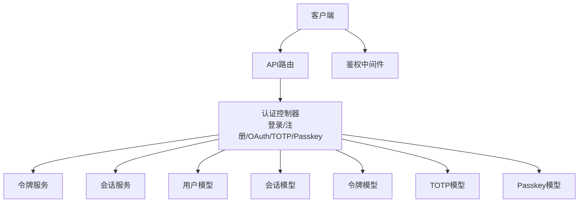
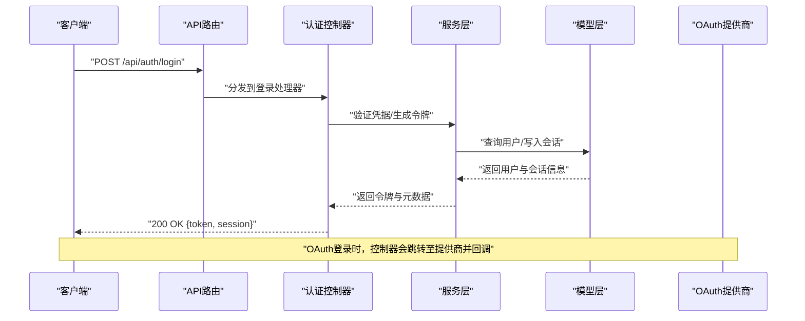
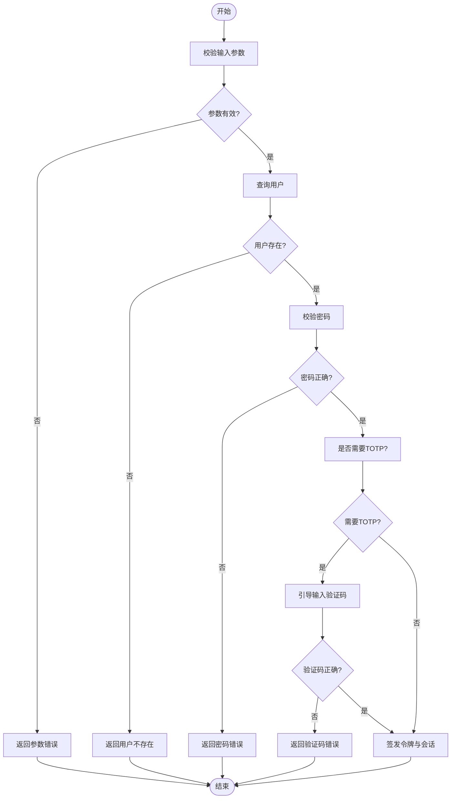
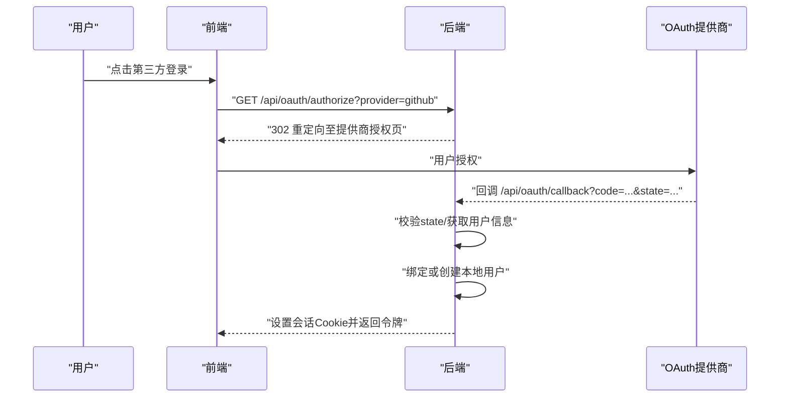
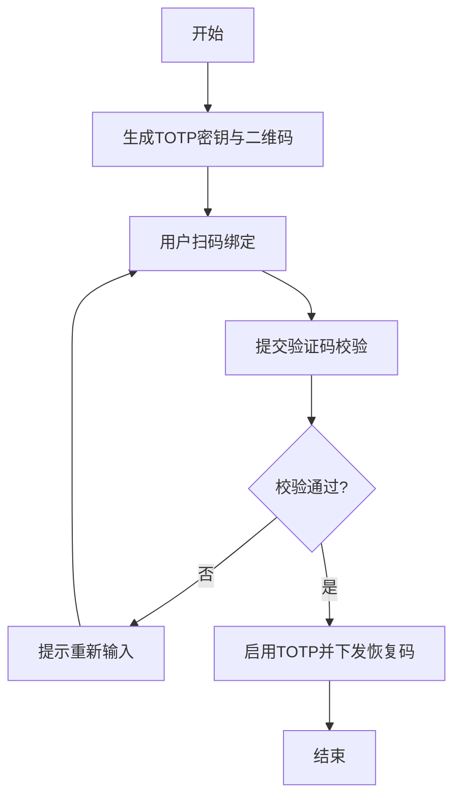
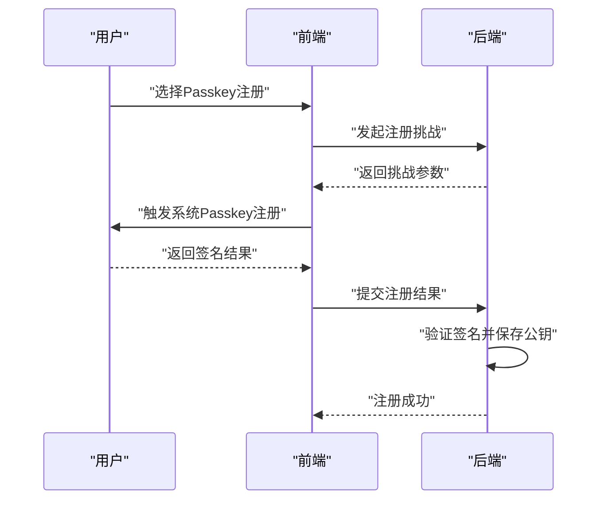
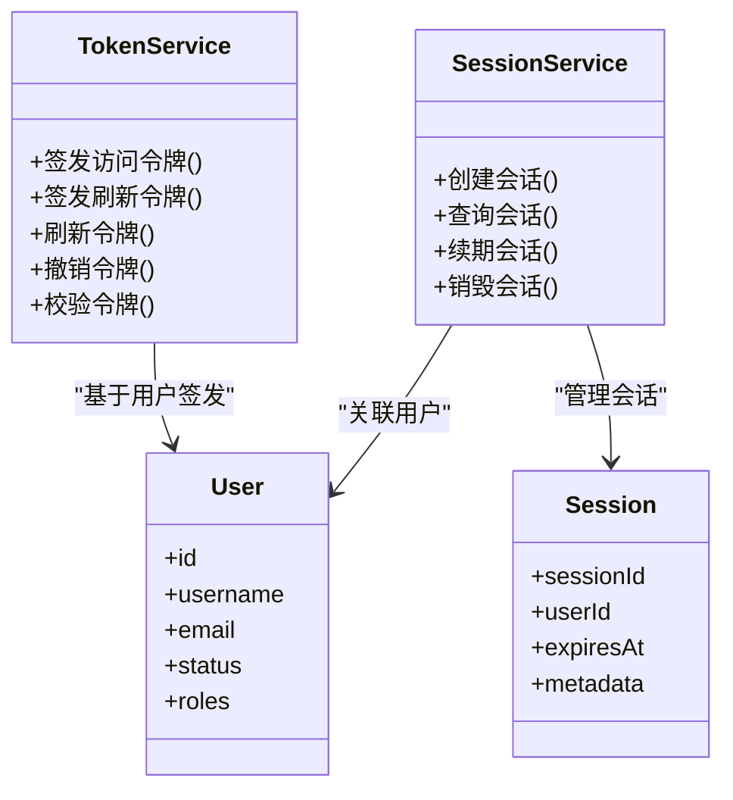
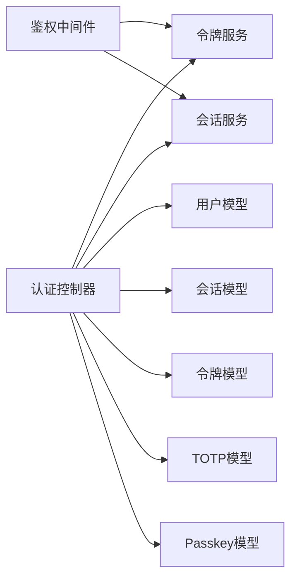

# 认证API

<cite>
**本文引用的文件**   
- [controller/oauth.go](file://controller/oauth.go)
- [controller/passkey.go](file://controller/passkey.go)
- [controller/twofa.go](file://controller/twofa.go)
- [controller/auth_session.go](file://controller/auth_session.go)
- [controller/token.go](file://controller/token.go)
- [controller/user.go](file://controller/user.go)
- [middleware/auth.go](file://middleware/auth.go)
- [service/auth_token.go](file://service/auth_token.go)
- [service/auth_session.go](file://service/auth_session.go)
- [model/user.go](file://model/user.go)
- [model/user_session.go](file://model/user_session.go)
- [model/token.go](file://model/token.go)
- [model/twofa.go](file://model/twofa.go)
- [model/passkey.go](file://model/passkey.go)
- [oauth/provider.go](file://oauth/provider.go)
- [router/api-router.go](file://router/api-router.go)
</cite>

## 目录
1. [简介](#简介)
2. [项目结构](#项目结构)
3. [核心组件](#核心组件)
4. [架构总览](#架构总览)
5. [详细组件分析](#详细组件分析)
6. [依赖分析](#依赖分析)
7. [性能考虑](#性能考虑)
8. [故障排查指南](#故障排查指南)
9. [结论](#结论)
10. [附录](#附录)

## 简介
本文件为认证相关API的权威文档，覆盖用户登录、注册、OAuth授权、双因素认证（TOTP）、Passkey认证等能力。文档详细说明认证流程、令牌管理、会话处理与权限验证，并提供完整的接口说明、错误处理与安全最佳实践，帮助开发者快速集成并安全使用。

## 项目结构
认证功能由控制器层、服务层、模型层、中间件与路由共同组成：
- 控制器层：暴露HTTP API，处理请求参数校验与响应封装
- 服务层：实现业务逻辑（令牌签发/刷新、会话管理、OAuth流程、TOTP、Passkey）
- 模型层：定义用户、会话、令牌、TOTP、Passkey等数据模型
- 中间件：鉴权、限流、审计、CORS等横切关注点
- 路由：将URL路径映射到控制器方法

图表来源
- [router/api-router.go](file://router/api-router.go)
- [controller/oauth.go](file://controller/oauth.go)
- [controller/passkey.go](file://controller/passkey.go)
- [controller/twofa.go](file://controller/twofa.go)
- [controller/auth_session.go](file://controller/auth_session.go)
- [controller/token.go](file://controller/token.go)
- [service/auth_token.go](file://service/auth_token.go)
- [service/auth_session.go](file://service/auth_session.go)
- [model/user.go](file://model/user.go)
- [model/user_session.go](file://model/user_session.go)
- [model/token.go](file://model/token.go)
- [model/twofa.go](file://model/twofa.go)
- [model/passkey.go](file://model/passkey.go)

章节来源
- [router/api-router.go](file://router/api-router.go)
- [controller/oauth.go](file://controller/oauth.go)
- [controller/passkey.go](file://controller/passkey.go)
- [controller/twofa.go](file://controller/twofa.go)
- [controller/auth_session.go](file://controller/auth_session.go)
- [controller/token.go](file://controller/token.go)

## 核心组件
- 认证控制器：统一入口，负责登录、注册、OAuth回调、TOTP绑定/校验、Passkey注册/认证、会话管理等
- 令牌服务：签发JWT/访问令牌、刷新令牌、撤销与黑名单管理
- 会话服务：创建/查询/续期/销毁会话，支持多设备与会话状态
- 模型层：用户、会话、令牌、TOTP、Passkey的数据结构与持久化
- 中间件：鉴权校验、权限控制、速率限制、审计日志

章节来源
- [controller/oauth.go](file://controller/oauth.go)
- [controller/passkey.go](file://controller/passkey.go)
- [controller/twofa.go](file://controller/twofa.go)
- [controller/auth_session.go](file://controller/auth_session.go)
- [controller/token.go](file://controller/token.go)
- [service/auth_token.go](file://service/auth_token.go)
- [service/auth_session.go](file://service/auth_session.go)
- [model/user.go](file://model/user.go)
- [model/user_session.go](file://model/user_session.go)
- [model/token.go](file://model/token.go)
- [model/twofa.go](file://model/twofa.go)
- [model/passkey.go](file://model/passkey.go)

## 架构总览
认证流程采用分层设计：
- 客户端通过API路由进入控制器
- 控制器调用服务层完成业务逻辑
- 服务层读写模型层数据，必要时调用外部OAuth提供商
- 鉴权中间件在请求前后执行安全策略

图表来源
- [router/api-router.go](file://router/api-router.go)
- [controller/oauth.go](file://controller/oauth.go)
- [controller/auth_session.go](file://controller/auth_session.go)
- [service/auth_token.go](file://service/auth_token.go)
- [service/auth_session.go](file://service/auth_session.go)
- [model/user.go](file://model/user.go)
- [model/user_session.go](file://model/user_session.go)

## 详细组件分析

### 用户登录与注册
- 登录接口：支持用户名/邮箱+密码，可选双因素校验；成功后签发访问令牌与会话
- 注册接口：校验密码强度、唯一性，创建用户并返回基础信息；可配置是否自动登录
- 密码策略：最小长度、复杂度要求、历史密码检查（若启用）
- 会话处理：登录后创建会话，支持多设备；提供会话续期与注销

图表来源
- [controller/auth_session.go](file://controller/auth_session.go)
- [controller/user.go](file://controller/user.go)
- [service/auth_token.go](file://service/auth_token.go)
- [service/auth_session.go](file://service/auth_session.go)
- [model/user.go](file://model/user.go)
- [model/twofa.go](file://model/twofa.go)

章节来源
- [controller/auth_session.go](file://controller/auth_session.go)
- [controller/user.go](file://controller/user.go)
- [service/auth_token.go](file://service/auth_token.go)
- [service/auth_session.go](file://service/auth_session.go)
- [model/user.go](file://model/user.go)
- [model/twofa.go](file://model/twofa.go)

### OAuth授权（多提供商）
- 支持的提供商：GitHub、Discord、LinuxDo、OIDC通用等
- 流程：前端重定向至提供商 -> 提供商回调 -> 服务端校验并绑定/创建用户 -> 签发令牌与会话
- 自定义提供商：可通过扩展注册表接入新提供商
- 安全性：state防CSRF、nonce校验、scope最小化、回调白名单

图表来源
- [controller/oauth.go](file://controller/oauth.go)
- [oauth/provider.go](file://oauth/provider.go)
- [router/api-router.go](file://router/api-router.go)

章节来源
- [controller/oauth.go](file://controller/oauth.go)
- [oauth/provider.go](file://oauth/provider.go)
- [router/api-router.go](file://router/api-router.go)

### 双因素认证（TOTP）
- 绑定流程：生成密钥与二维码 -> 用户扫码绑定 -> 校验验证码成功即启用
- 校验流程：登录或敏感操作时要求输入TOTP码
- 恢复码：首次启用时提供一次性恢复码，用于账户恢复
- 安全建议：强制启用高危操作二次验证、定期轮换密钥

图表来源
- [controller/twofa.go](file://controller/twofa.go)
- [model/twofa.go](file://model/twofa.go)

章节来源
- [controller/twofa.go](file://controller/twofa.go)
- [model/twofa.go](file://model/twofa.go)

### Passkey认证
- 注册流程：浏览器生成密钥对 -> 服务端记录公钥与元数据 -> 绑定到用户
- 认证流程：挑战-应答模式，无密码登录，抗钓鱼
- 兼容性：支持主流浏览器与平台，需HTTPS环境
- 安全优势：私钥不出设备，服务端仅存储公钥

图表来源
- [controller/passkey.go](file://controller/passkey.go)
- [model/passkey.go](file://model/passkey.go)

章节来源
- [controller/passkey.go](file://controller/passkey.go)
- [model/passkey.go](file://model/passkey.go)

### 令牌管理与会话处理
- 令牌类型：访问令牌（短期）、刷新令牌（长期），支持撤销与黑名单
- 签发策略：基于用户ID、角色、资源范围，包含过期时间
- 会话管理：多设备支持、在线状态、主动注销、超时清理
- 权限验证：中间件解析令牌，加载用户上下文与权限集

图表来源
- [service/auth_token.go](file://service/auth_token.go)
- [service/auth_session.go](file://service/auth_session.go)
- [model/user.go](file://model/user.go)
- [model/user_session.go](file://model/user_session.go)
- [model/token.go](file://model/token.go)

章节来源
- [service/auth_token.go](file://service/auth_token.go)
- [service/auth_session.go](file://service/auth_session.go)
- [model/user.go](file://model/user.go)
- [model/user_session.go](file://model/user_session.go)
- [model/token.go](file://model/token.go)

### 权限验证与中间件
- 鉴权中间件：校验令牌有效性、加载用户上下文、注入权限集
- 授权策略：基于角色的访问控制（RBAC），支持资源级权限
- 审计日志：记录关键认证事件（登录、注销、失败尝试）

章节来源
- [middleware/auth.go](file://middleware/auth.go)

## 依赖分析
认证模块依赖关系清晰，控制器依赖服务层，服务层依赖模型层，中间件横切鉴权逻辑。

图表来源
- [controller/oauth.go](file://controller/oauth.go)
- [controller/passkey.go](file://controller/passkey.go)
- [controller/twofa.go](file://controller/twofa.go)
- [controller/auth_session.go](file://controller/auth_session.go)
- [controller/token.go](file://controller/token.go)
- [service/auth_token.go](file://service/auth_token.go)
- [service/auth_session.go](file://service/auth_session.go)
- [model/user.go](file://model/user.go)
- [model/user_session.go](file://model/user_session.go)
- [model/token.go](file://model/token.go)
- [model/twofa.go](file://model/twofa.go)
- [model/passkey.go](file://model/passkey.go)
- [middleware/auth.go](file://middleware/auth.go)

章节来源
- [controller/oauth.go](file://controller/oauth.go)
- [controller/passkey.go](file://controller/passkey.go)
- [controller/twofa.go](file://controller/twofa.go)
- [controller/auth_session.go](file://controller/auth_session.go)
- [controller/token.go](file://controller/token.go)
- [service/auth_token.go](file://service/auth_token.go)
- [service/auth_session.go](file://service/auth_session.go)
- [model/user.go](file://model/user.go)
- [model/user_session.go](file://model/user_session.go)
- [model/token.go](file://model/token.go)
- [model/twofa.go](file://model/twofa.go)
- [model/passkey.go](file://model/passkey.go)
- [middleware/auth.go](file://middleware/auth.go)

## 性能考虑
- 令牌校验缓存：热点用户令牌可缓存以减少数据库压力
- 会话清理：定时任务清理过期会话，避免存储膨胀
- 限流保护：对登录、注册、TOTP校验等接口实施速率限制
- 异步处理：OAuth回调中的用户信息同步可异步化，提升响应速度

[本节为通用指导，不直接分析具体文件]

## 故障排查指南
- 登录失败：检查密码策略、用户状态、TOTP配置与验证码有效期
- OAuth回调失败：核对state/nonce、回调地址白名单、提供商配置
- 令牌无效：确认令牌未过期、未被撤销、签名正确
- 会话异常：检查会话存储、过期时间、并发更新冲突
- 权限拒绝：确认用户角色与资源权限匹配，检查中间件配置

章节来源
- [controller/auth_session.go](file://controller/auth_session.go)
- [controller/oauth.go](file://controller/oauth.go)
- [controller/twofa.go](file://controller/twofa.go)
- [controller/passkey.go](file://controller/passkey.go)
- [middleware/auth.go](file://middleware/auth.go)

## 结论
本认证体系提供全面的身份管理能力，涵盖密码、OAuth、TOTP与Passkey等多种方式，结合严格的令牌与会话管理、权限控制与安全防护，满足企业级应用的安全需求。建议在生产环境中启用HTTPS、强制TOTP、配置合理的令牌过期策略，并持续监控认证事件以保障系统安全。

[本节为总结性内容，不直接分析具体文件]

## 附录
- 客户端集成建议：
  - 使用HTTPS传输所有认证请求
  - 安全存储令牌（HttpOnly Cookie或内存）
  - 实现令牌自动刷新与静默续期
  - 处理网络错误与重试机制
- 安全最佳实践：
  - 最小权限原则，按需授予角色与资源
  - 定期轮换密钥与恢复码
  - 启用审计日志与告警
  - 防范常见攻击（暴力破解、CSRF、XSS）

[本节为通用指导，不直接分析具体文件]