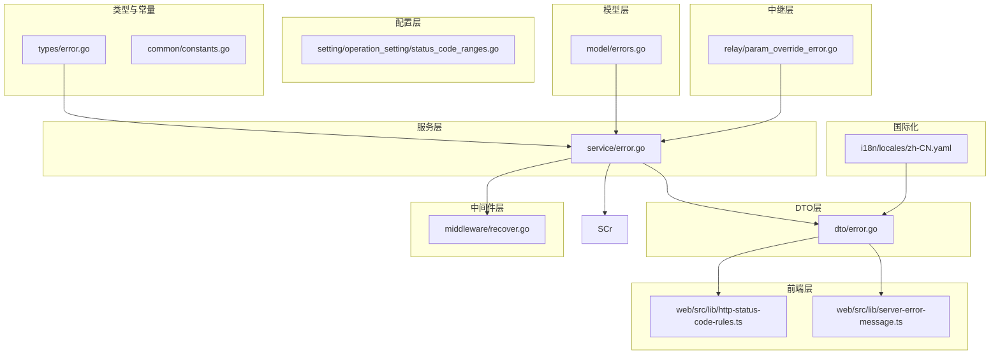
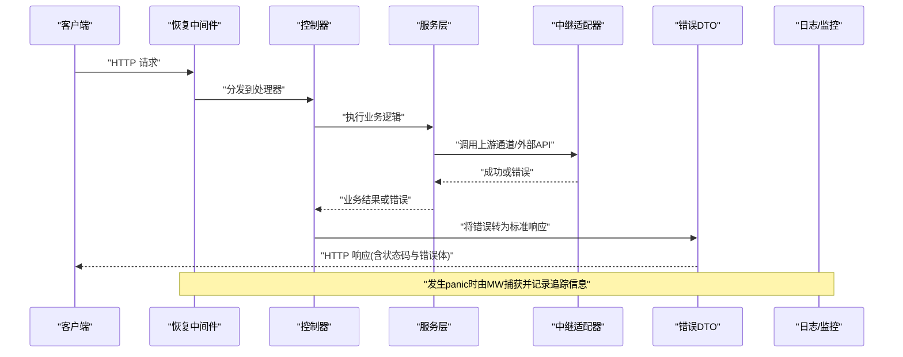
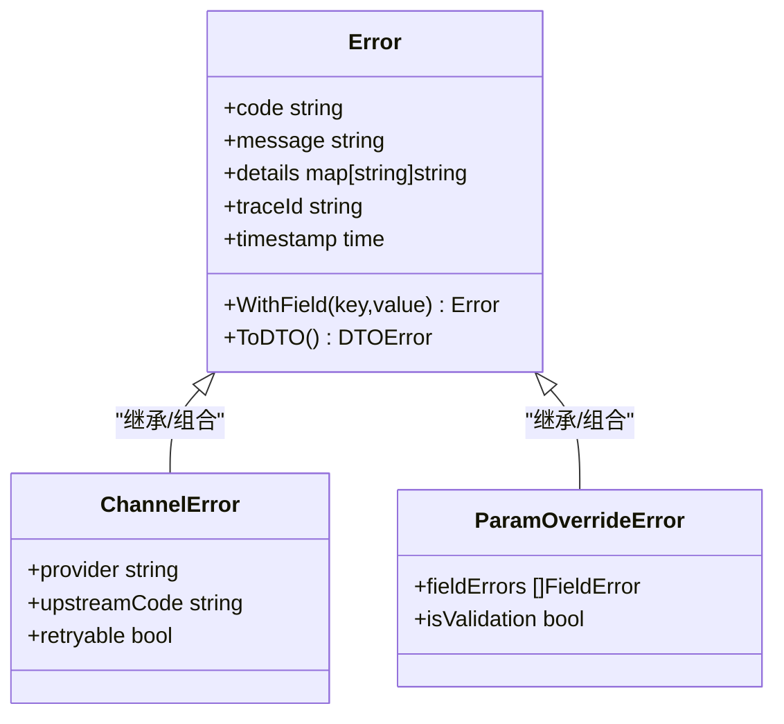
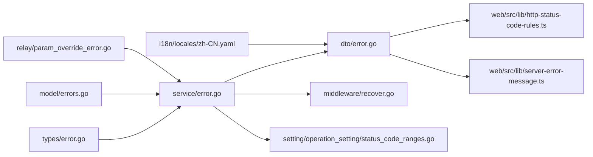

# 错误代码参考

<cite>
**本文引用的文件**   
- [types/error.go](file://types/error.go)
- [model/errors.go](file://model/errors.go)
- [service/error.go](file://service/error.go)
- [dto/error.go](file://dto/error.go)
- [middleware/recover.go](file://middleware/recover.go)
- [setting/operation_setting/status_code_ranges.go](file://setting/operation_setting/status_code_ranges.go)
- [web/src/lib/http-status-code-rules.ts](file://web/src/lib/http-status-code-rules.ts)
- [web/src/lib/server-error-message.ts](file://web/src/lib/server-error-message.ts)
- [i18n/locales/zh-CN.yaml](file://i18n/locales/zh-CN.yaml)
- [relay/param_override_error.go](file://relay/param_override_error.go)
- [common/constants.go](file://common/constants.go)
</cite>

## 目录
1. [简介](#简介)
2. [项目结构](#项目结构)
3. [核心组件](#核心组件)
4. [架构总览](#架构总览)
5. [详细组件分析](#详细组件分析)
6. [依赖关系分析](#依赖关系分析)
7. [性能考虑](#性能考虑)
8. [故障排除指南](#故障排除指南)
9. [结论](#结论)
10. [附录](#附录)

## 简介
本参考文档面向系统错误代码，覆盖HTTP状态码、业务错误码与异常情况的分类、消息模板、处理策略与追踪方法。目标是帮助开发者快速定位问题、统一错误表达、提升可观测性与可维护性。

## 项目结构
错误相关能力分布在以下层次：
- 类型定义层：统一的错误类型、通道错误、请求元数据等
- 模型层：数据库与持久化相关的错误定义
- 服务层：业务错误构造、转换与日志记录
- DTO层：对外返回的错误数据结构
- 中间件层：全局恢复、日志、限流等横切关注点
- 配置层：HTTP状态码范围与行为开关
- 前端层：HTTP状态码规则与服务器错误消息解析
- 国际化层：错误消息多语言键值
- 中继层：参数覆盖错误的专用类型

图表来源
- [types/error.go](file://types/error.go)
- [common/constants.go](file://common/constants.go)
- [model/errors.go](file://model/errors.go)
- [service/error.go](file://service/error.go)
- [dto/error.go](file://dto/error.go)
- [middleware/recover.go](file://middleware/recover.go)
- [setting/operation_setting/status_code_ranges.go](file://setting/operation_setting/status_code_ranges.go)
- [web/src/lib/http-status-code-rules.ts](file://web/src/lib/http-status-code-rules.ts)
- [web/src/lib/server-error-message.ts](file://web/src/lib/server-error-message.ts)
- [i18n/locales/zh-CN.yaml](file://i18n/locales/zh-CN.yaml)
- [relay/param_override_error.go](file://relay/param_override_error.go)

章节来源
- [types/error.go](file://types/error.go)
- [common/constants.go](file://common/constants.go)
- [model/errors.go](file://model/errors.go)
- [service/error.go](file://service/error.go)
- [dto/error.go](file://dto/error.go)
- [middleware/recover.go](file://middleware/recover.go)
- [setting/operation_setting/status_code_ranges.go](file://setting/operation_setting/status_code_ranges.go)
- [web/src/lib/http-status-code-rules.ts](file://web/src/lib/http-status-code-rules.ts)
- [web/src/lib/server-error-message.ts](file://web/src/lib/server-error-message.ts)
- [i18n/locales/zh-CN.yaml](file://i18n/locales/zh-CN.yaml)
- [relay/param_override_error.go](file://relay/param_override_error.go)

## 核心组件
- 统一错误类型（后端）
  - 用于封装错误码、消息、上下文与扩展字段，贯穿服务层与DTO层
  - 典型职责：错误码映射、消息模板渲染、结构化日志输出
- 通道错误类型（中继）
  - 描述上游通道调用失败、鉴权失败、配额不足等场景
  - 与业务错误进行桥接，便于统一上报与展示
- 参数覆盖错误（中继）
  - 针对请求参数覆盖校验失败的专用错误，包含字段级错误信息
- HTTP状态码范围配置
  - 集中管理不同业务域的状态码区间与语义，避免硬编码
- 全局恢复中间件
  - 捕获未处理panic，转换为标准错误响应并记录追踪信息
- 前端错误处理
  - 基于HTTP状态码规则与服务器错误消息解析，提供一致的用户提示

章节来源
- [types/error.go](file://types/error.go)
- [relay/param_override_error.go](file://relay/param_override_error.go)
- [setting/operation_setting/status_code_ranges.go](file://setting/operation_setting/status_code_ranges.go)
- [middleware/recover.go](file://middleware/recover.go)
- [web/src/lib/http-status-code-rules.ts](file://web/src/lib/http-status-code-rules.ts)
- [web/src/lib/server-error-message.ts](file://web/src/lib/server-error-message.ts)

## 架构总览
错误处理从请求进入开始，经过中间件、控制器、服务层、中继层，最终由DTO统一序列化返回；异常通过全局恢复中间件兜底，确保系统稳定性与一致性。

图表来源
- [middleware/recover.go](file://middleware/recover.go)
- [service/error.go](file://service/error.go)
- [relay/param_override_error.go](file://relay/param_override_error.go)
- [dto/error.go](file://dto/error.go)

## 详细组件分析

### 统一错误类型（后端）
- 设计要点
  - 错误码采用分层命名，区分HTTP层、业务层、通道层
  - 支持消息模板与动态参数注入，便于多语言与上下文丰富
  - 附带请求ID、时间戳、堆栈片段等追踪字段
- 复杂度与性能
  - 错误对象创建为O(1)，序列化按需触发，避免热路径开销
- 错误处理策略
  - 服务层优先抛出领域错误，控制器负责映射为HTTP状态码
  - 对可重试错误标记重试标志，配合中间件实现退避策略

图表来源
- [types/error.go](file://types/error.go)
- [relay/param_override_error.go](file://relay/param_override_error.go)

章节来源
- [types/error.go](file://types/error.go)
- [relay/param_override_error.go](file://relay/param_override_error.go)

### 模型层错误
- 用途
  - 数据库操作、权限校验、资源不存在等场景的错误定义
- 特点
  - 与持久化层耦合，通常不直接暴露给前端，需经服务层转译为业务错误
- 建议
  - 在模型层仅保留最小必要信息，敏感信息在服务层脱敏后输出

章节来源
- [model/errors.go](file://model/errors.go)

### 服务层错误
- 职责
  - 聚合各层错误，生成标准化错误对象
  - 根据配置决定HTTP状态码与是否可重试
  - 记录结构化日志，包含请求上下文与关键指标
- 策略
  - 对上游超时、限流、鉴权失败进行分类处理
  - 对参数校验失败使用参数覆盖错误类型

章节来源
- [service/error.go](file://service/error.go)

### DTO错误结构
- 目标
  - 对外返回一致的JSON结构，包含错误码、消息、详情与追踪ID
- 安全
  - 过滤敏感字段，避免泄露内部细节
- 前端友好
  - 提供可读消息与可操作的错误提示

章节来源
- [dto/error.go](file://dto/error.go)

### 全局恢复中间件
- 功能
  - 捕获panic，生成标准错误响应
  - 记录堆栈与请求ID，便于追踪
- 策略
  - 对已知可恢复错误降级处理，避免影响整体可用性

章节来源
- [middleware/recover.go](file://middleware/recover.go)

### HTTP状态码范围配置
- 内容
  - 按业务域划分状态码区间，如认证、计费、渠道、系统
- 作用
  - 集中管理状态码语义，减少散落的硬编码判断
  - 便于测试与自动化校验

章节来源
- [setting/operation_setting/status_code_ranges.go](file://setting/operation_setting/status_code_ranges.go)

### 前端错误处理
- HTTP状态码规则
  - 根据状态码选择用户提示策略（如401跳转登录、429提示冷却）
- 服务器错误消息解析
  - 解析后端错误体，提取可读消息与字段级错误
- 用户体验
  - 统一错误页面与提示样式，支持多语言

章节来源
- [web/src/lib/http-status-code-rules.ts](file://web/src/lib/http-status-code-rules.ts)
- [web/src/lib/server-error-message.ts](file://web/src/lib/server-error-message.ts)

### 国际化错误消息
- 组织方式
  - 以键值形式存储错误消息，支持多语言切换
- 使用建议
  - 所有用户可见错误消息必须走i18n键值，禁止硬编码字符串

章节来源
- [i18n/locales/zh-CN.yaml](file://i18n/locales/zh-CN.yaml)

### 中继参数覆盖错误
- 场景
  - 上游参数覆盖校验失败、必填缺失、类型不匹配
- 输出
  - 字段级错误列表，便于前端高亮与提示

章节来源
- [relay/param_override_error.go](file://relay/param_override_error.go)

## 依赖关系分析
- 低耦合
  - 错误类型定义独立于具体业务，服务层通过接口消费
- 明确边界
  - 模型层错误不直接暴露，服务层负责转译
  - DTO仅承载对外契约，不包含业务逻辑
- 可观测性
  - 中间件与日志模块贯穿全链路，提供追踪ID与上下文

图表来源
- [types/error.go](file://types/error.go)
- [model/errors.go](file://model/errors.go)
- [service/error.go](file://service/error.go)
- [dto/error.go](file://dto/error.go)
- [middleware/recover.go](file://middleware/recover.go)
- [setting/operation_setting/status_code_ranges.go](file://setting/operation_setting/status_code_ranges.go)
- [web/src/lib/http-status-code-rules.ts](file://web/src/lib/http-status-code-rules.ts)
- [web/src/lib/server-error-message.ts](file://web/src/lib/server-error-message.ts)
- [i18n/locales/zh-CN.yaml](file://i18n/locales/zh-CN.yaml)
- [relay/param_override_error.go](file://relay/param_override_error.go)

章节来源
- [types/error.go](file://types/error.go)
- [model/errors.go](file://model/errors.go)
- [service/error.go](file://service/error.go)
- [dto/error.go](file://dto/error.go)
- [middleware/recover.go](file://middleware/recover.go)
- [setting/operation_setting/status_code_ranges.go](file://setting/operation_setting/status_code_ranges.go)
- [web/src/lib/http-status-code-rules.ts](file://web/src/lib/http-status-code-rules.ts)
- [web/src/lib/server-error-message.ts](file://web/src/lib/server-error-message.ts)
- [i18n/locales/zh-CN.yaml](file://i18n/locales/zh-CN.yaml)
- [relay/param_override_error.go](file://relay/param_override_error.go)

## 性能考虑
- 错误对象创建与序列化应延迟至需要时执行，避免热路径开销
- 日志记录采用异步写入与采样策略，降低I/O阻塞
- 对高频错误（如限流）启用缓存与快速失败，减少下游压力
- 前端错误提示去抖与合并，避免重复UI抖动

[本节为通用指导，无需引用具体文件]

## 故障排除指南
- 常见错误场景
  - 认证失败（401/403）：检查令牌有效性、权限配置与角色绑定
  - 限流（429）：查看速率限制配置与上游通道限流策略
  - 上游通道错误：核对密钥、网络连通性与配额
  - 参数覆盖错误：依据字段级错误修正请求体
- 排查步骤
  - 通过请求ID定位日志，查看完整调用链
  - 检查状态码范围配置与业务错误映射
  - 验证前端错误规则与消息解析是否正确
  - 复现问题并开启调试日志，观察中间件恢复与堆栈信息
- 解决方案建议
  - 对可重试错误增加退避与重试上限
  - 对参数校验失败提供明确的字段提示与默认值
  - 对上游不稳定通道实施熔断与降级

章节来源
- [setting/operation_setting/status_code_ranges.go](file://setting/operation_setting/status_code_ranges.go)
- [middleware/recover.go](file://middleware/recover.go)
- [web/src/lib/http-status-code-rules.ts](file://web/src/lib/http-status-code-rules.ts)
- [web/src/lib/server-error-message.ts](file://web/src/lib/server-error-message.ts)

## 结论
本参考文档系统化梳理了错误类型、状态码范围、消息模板与处理策略，结合前后端协作与可观测性实践，帮助团队建立一致、可靠、易维护的错误处理体系。建议在日常开发中严格遵循错误分类与消息规范，持续完善错误库与国际化文案。

[本节为总结性内容，无需引用具体文件]

## 附录
- 错误码分类建议
  - HTTP层：4xx客户端错误、5xx服务端错误
  - 业务层：认证、授权、计费、配额、任务、订阅
  - 通道层：上游鉴权、限流、超时、协议不兼容
- 错误日志格式建议
  - 包含：请求ID、时间戳、方法、路径、状态码、错误码、消息、字段错误、堆栈片段
- 错误追踪方法
  - 使用请求ID贯穿全链路，结合日志与监控平台进行关联分析
  - 对关键错误设置告警阈值与自动通知

[本节为补充说明，无需引用具体文件]