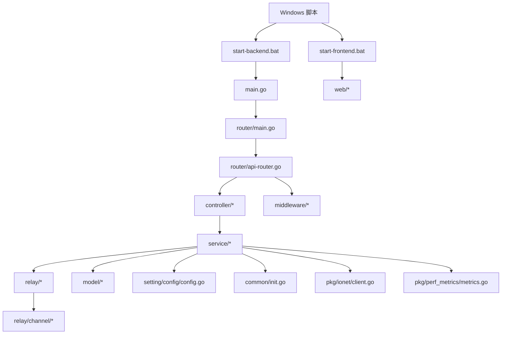
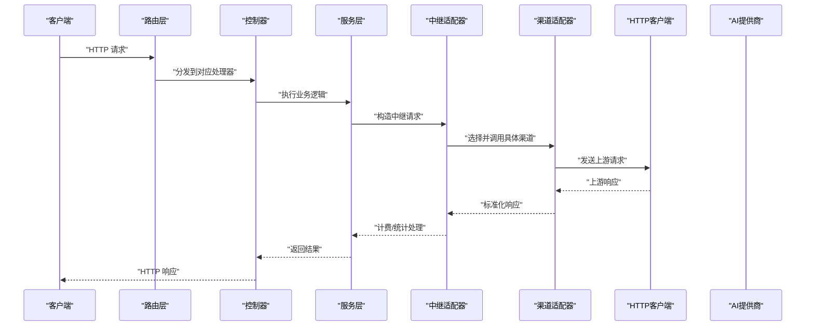
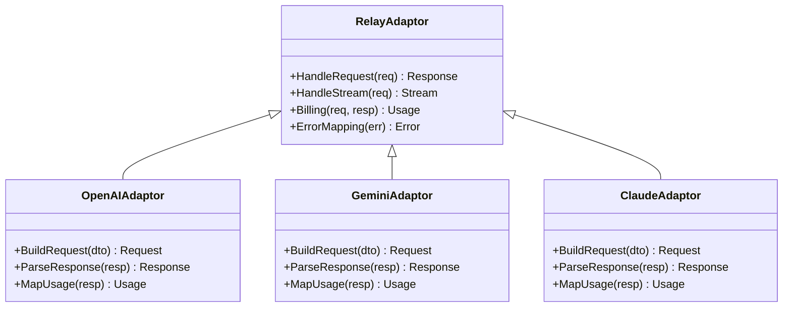
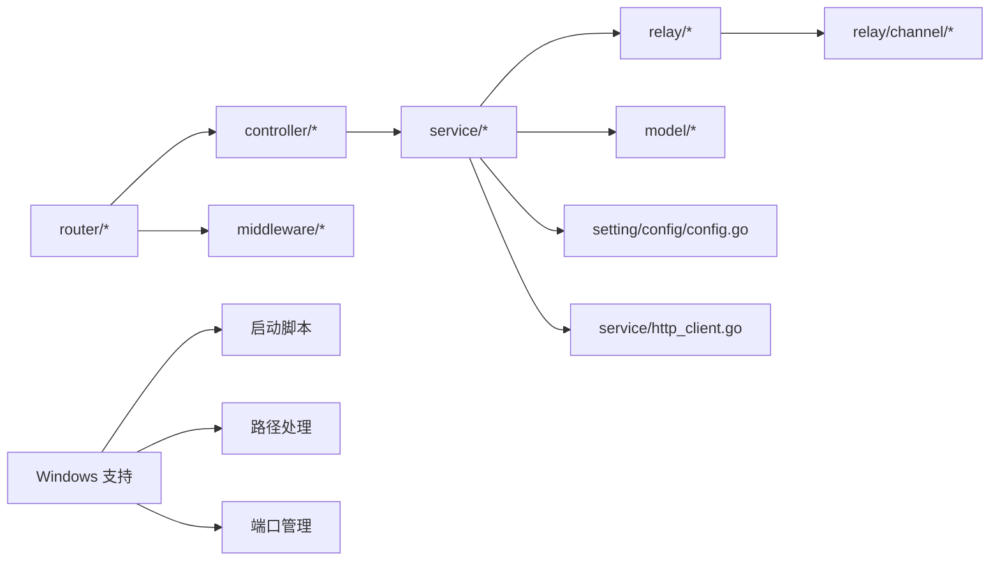
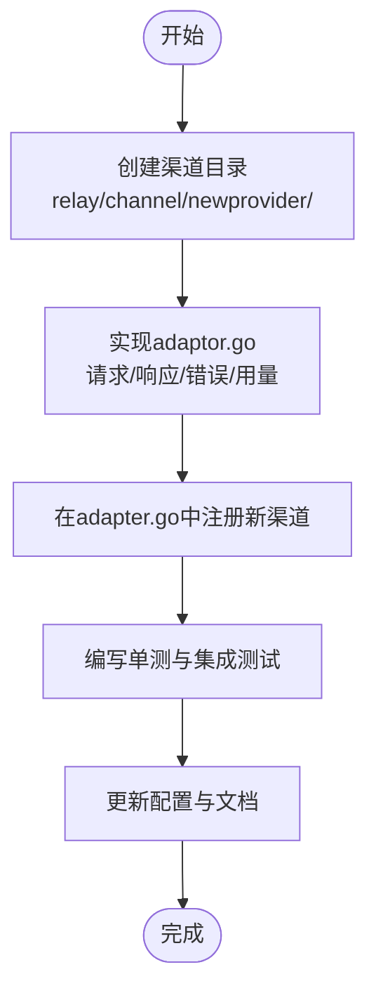

# 开发指南

<cite>
**本文引用的文件**   
- [main.go](file://main.go)
- [go.mod](file://go.mod)
- [makefile](file://makefile)
- [Dockerfile](file://Dockerfile)
- [docker-compose.yml](file://docker-compose.yml)
- [docker-compose.dev.yml](file://docker-compose.dev.yml)
- [router/main.go](file://router/main.go)
- [router/api-router.go](file://router/api-router.go)
- [relay/relay_adaptor.go](file://relay/relay_adaptor.go)
- [relay/channel/adapter.go](file://relay/channel/adapter.go)
- [relay/common/request_conversion.go](file://relay/common/request_conversion.go)
- [service/http_client.go](file://service/http_client.go)
- [common/init.go](file://common/init.go)
- [setting/config/config.go](file://setting/config/config.go)
- [model/main.go](file://model/main.go)
- [pkg/ionet/client.go](file://pkg/ionet/client.go)
- [pkg/perf_metrics/metrics.go](file://pkg/perf_metrics/metrics.go)
- [middleware/auth.go](file://middleware/auth.go)
- [middleware/rate-limit.go](file://middleware/rate-limit.go)
- [controller/model.go](file://controller/model.go)
- [dto/openai_request.go](file://dto/openai_request.go)
- [dto/openai_response.go](file://dto/openai_response.go)
- [relay/channel/openai/adaptor.go](file://relay/channel/openai/adaptor.go)
- [relay/channel/gemini/adaptor.go](file://relay/channel/gemini/adaptor.go)
- [relay/channel/claude/adaptor.go](file://relay/channel/claude/adaptor.go)
- [relay/channel/ali/adaptor.go](file://relay/channel/ali/adaptor.go)
- [relay/channel/aws/adaptor.go](file://relay/channel/aws/adaptor.go)
- [relay/channel/baidu/adaptor.go](file://relay/channel/baidu/adaptor.go)
- [relay/channel/zhipu/adaptor.go](file://relay/channel/zhipu/adaptor.go)
- [relay/channel/tencent/adaptor.go](file://relay/channel/tencent/adaptor.go)
- [relay/channel/xunfei/adaptor.go](file://relay/channel/xunfei/adaptor.go)
- [relay/channel/coze/adaptor.go](file://relay/channel/coze/adaptor.go)
- [relay/channel/dify/adaptor.go](file://relay/channel/dify/adaptor.go)
- [relay/channel/ollama/adaptor.go](file://relay/channel/ollama/adaptor.go)
- [relay/channel/siliconflow/adaptor.go](file://relay/channel/siliconflow/adaptor.go)
- [relay/channel/jimeng/adaptor.go](file://relay/channel/jimeng/adaptor.go)
- [relay/channel/minimax/adaptor.go](file://relay/channel/minimax/adaptor.go)
- [relay/channel/mistral/adaptor.go](file://relay/channel/mistral/adaptor.go)
- [relay/channel/palm/adaptor.go](file://relay/channel/palm/adaptor.go)
- [relay/channel/perplexity/adaptor.go](file://relay/channel/perplexity/adaptor.go)
- [relay/channel/replicate/adaptor.go](file://relay/channel/replicate/adaptor.go)
- [relay/channel/submodel/adaptor.go](file://relay/channel/submodel/adaptor.go)
- [relay/channel/vertex/adaptor.go](file://relay/channel/vertex/adaptor.go)
- [relay/channel/volcengine/adaptor.go](file://relay/channel/volcengine/adaptor.go)
- [relay/channel/xai/adaptor.go](file://relay/channel/xai/adaptor.go)
- [relay/channel/xinference/adaptor.go](file://relay/channel/xinference/adaptor.go)
- [relay/channel/cloudflare/adaptor.go](file://relay/channel/cloudflare/adaptor.go)
- [relay/channel/cohere/adaptor.go](file://relay/channel/cohere/adaptor.go)
- [relay/channel/deepseek/adaptor.go](file://relay/channel/deepseek/adaptor.go)
- [relay/channel/moonshot/adaptor.go](file://relay/channel/moonshot/adaptor.go)
- [relay/channel/mokaai/adaptor.go](file://relay/channel/mokaai/adaptor.go)
- [relay/channel/codex/adaptor.go](file://relay/channel/codex/adaptor.go)
- [relay/channel/lingyiwanwu/constants.go](file://relay/channel/lingyiwanwu/constants.go)
- [relay/channel/ai360/constants.go](file://relay/channel/ai360/constants.go)
- [relay/channel/baidu_v2/adaptor.go](file://relay/channel/baidu_v2/adaptor.go)
- [relay/channel/task/ali/adaptor.go](file://relay/channel/task/ali/adaptor.go)
- [relay/channel/task/doubao/adaptor.go](file://relay/channel/task/doubao/adaptor.go)
- [relay/channel/task/gemini/adaptor.go](file://relay/channel/task/gemini/adaptor.go)
- [relay/channel/task/hailuo/adaptor.go](file://relay/channel/task/hailuo/adaptor.go)
- [relay/channel/task/jimeng/adaptor.go](file://relay/channel/task/jimeng/adaptor.go)
- [relay/channel/task/kling/adaptor.go](file://relay/channel/task/kling/adaptor.go)
- [relay/channel/task/sora/adaptor.go](file://relay/channel/task/sora/adaptor.go)
- [relay/channel/task/suno/adaptor.go](file://relay/channel/task/suno/adaptor.go)
- [relay/channel/task/vertex/adaptor.go](file://relay/channel/task/vertex/adaptor.go)
- [relay/channel/task/vidu/adaptor.go](file://relay/channel/task/vidu/adaptor.go)
- [relay/channel/task/taskcommon/adaptor.go](file://relay/channel/task/taskcommon/adaptor.go)
- [docs/installation/windows-source-dev.md](file://docs/installation/windows-source-dev.md)
- [start-backend.bat](file://start-backend.bat)
- [start-frontend.bat](file://start-frontend.bat)
</cite>

## 更新摘要
**所做更改**
- 新增 Windows 源代码开发指南章节，包含详细的开发环境设置说明
- 添加 Windows 特定的启动脚本和工具链配置
- 扩展开发环境搭建部分，涵盖跨平台支持
- 更新依赖关系分析以包含 Windows 兼容性考虑

## 目录
1. [简介](#简介)
2. [项目结构](#项目结构)
3. [核心组件](#核心组件)
4. [架构总览](#架构总览)
5. [详细组件分析](#详细组件分析)
6. [Windows 源代码开发指南](#windows-源代码开发指南)
7. [依赖关系分析](#依赖关系分析)
8. [性能考量](#性能考量)
9. [故障排查指南](#故障排查指南)
10. [结论](#结论)
11. [附录](#附录)

## 简介
本开发指南面向希望参与本项目开发与扩展的工程师，涵盖：
- 项目结构与分层设计
- 编码规范与模块职责
- 开发工具链与环境搭建（本地、容器化、Windows 特定）
- 测试策略与持续集成要点
- 调试技巧与性能分析方法
- 新增AI提供商支持的标准流程
- 扩展功能模块的最佳实践
- 常见问题及解决方案

本指南以仓库实际代码为依据，提供可追溯的文件路径与图示，帮助读者快速定位实现细节。

## 项目结构
项目采用"按领域分层 + 插件式渠道"的组织方式：
- 入口与路由：main.go、router/*
- 控制器层：controller/*
- 服务层：service/*
- 数据模型与ORM：model/*
- 请求/响应DTO：dto/*
- 中继转发与渠道适配：relay/*（含大量channel适配器）
- 中间件：middleware/*
- 配置与设置：setting/*
- 通用工具与基础设施：common/*
- 前端：web/*
- 构建与部署：Dockerfile、docker-compose*、makefile、go.mod
- Windows 支持：批处理脚本、Windows 特定配置



图表来源
- [main.go:1-200](file://main.go#L1-L200)
- [router/main.go:1-200](file://router/main.go#L1-L200)
- [router/api-router.go:1-200](file://router/api-router.go#L1-L200)
- [start-backend.bat:1-100](file://start-backend.bat#L1-L100)
- [start-frontend.bat:1-100](file://start-frontend.bat#L1-L100)

章节来源
- [main.go:1-200](file://main.go#L1-L200)
- [go.mod:1-200](file://go.mod#L1-L200)

## 核心组件
- 入口与初始化
  - main.go：应用启动、依赖注入、路由注册、优雅关闭等
  - common/init.go：全局初始化、日志、监控、配置加载
  - setting/config/config.go：配置读取与校验
- 路由与控制器
  - router/*：HTTP路由装配、API分组
  - controller/*：业务接口实现，调用service层
- 服务层
  - service/*：业务编排、计费、限流、任务调度、外部HTTP客户端封装
- 中继与渠道适配
  - relay/relay_adaptor.go：统一中继抽象
  - relay/channel/*：各AI厂商适配器（OpenAI、Gemini、Claude、阿里云、AWS、百度、智谱、腾讯、讯飞、Coze、Dify、Ollama等）
- 数据与配置
  - model/*：数据库模型、缓存键、权限规则
  - dto/*：请求/响应数据结构定义
- 中间件
  - middleware/*：鉴权、限流、CORS、Gzip、审计、安全校验等
- 工具与基础设施
  - common/*：通用工具、Redis、磁盘缓存、SSRF防护、系统监控
  - pkg/ionet/client.go：高性能网络客户端
  - pkg/perf_metrics/metrics.go：性能指标采集
- Windows 支持
  - start-backend.bat：后端启动脚本
  - start-frontend.bat：前端启动脚本
  - docs/installation/windows-source-dev.md：Windows 开发指南

章节来源
- [main.go:1-200](file://main.go#L1-L200)
- [common/init.go:1-200](file://common/init.go#L1-L200)
- [setting/config/config.go:1-200](file://setting/config/config.go#L1-L200)
- [router/main.go:1-200](file://router/main.go#L1-L200)
- [relay/relay_adaptor.go:1-200](file://relay/relay_adaptor.go#L1-L200)
- [relay/channel/adapter.go:1-200](file://relay/channel/adapter.go#L1-L200)
- [service/http_client.go:1-200](file://service/http_client.go#L1-L200)
- [pkg/ionet/client.go:1-200](file://pkg/ionet/client.go#L1-L200)
- [pkg/perf_metrics/metrics.go:1-200](file://pkg/perf_metrics/metrics.go#L1-L200)
- [start-backend.bat:1-100](file://start-backend.bat#L1-L100)
- [start-frontend.bat:1-100](file://start-frontend.bat#L1-L100)
- [docs/installation/windows-source-dev.md:1-200](file://docs/installation/windows-source-dev.md#L1-L200)

## 架构总览
整体为"网关+中继+多厂商适配器"的架构：
- 客户端通过HTTP进入router，经controller到service
- service进行鉴权、配额、计费、参数转换后，选择具体channel适配器
- channel适配器将内部请求转换为厂商协议，通过http_client或ionet发起请求
- 响应经过计费、统计、格式统一后返回客户端



图表来源
- [router/api-router.go:1-200](file://router/api-router.go#L1-L200)
- [controller/model.go:1-200](file://controller/model.go#L1-L200)
- [service/http_client.go:1-200](file://service/http_client.go#L1-L200)
- [relay/relay_adaptor.go:1-200](file://relay/relay_adaptor.go#L1-L200)
- [relay/channel/openai/adaptor.go:1-200](file://relay/channel/openai/adaptor.go#L1-L200)

## 详细组件分析

### 入口与初始化
- main.go负责：
  - 解析命令行参数与环境变量
  - 初始化日志、监控、配置、数据库连接
  - 注册路由与中间件
  - 启动HTTP服务器与优雅关闭
- common/init.go负责：
  - 全局初始化顺序控制
  - 第三方依赖初始化（如Redis、磁盘缓存）
  - 系统监控与性能指标采集
- setting/config/config.go负责：
  - 配置文件加载、默认值、校验
  - 运行时配置热更新（如有）

章节来源
- [main.go:1-200](file://main.go#L1-L200)
- [common/init.go:1-200](file://common/init.go#L1-L200)
- [setting/config/config.go:1-200](file://setting/config/config.go#L1-L200)

### 路由与控制器
- router/*：
  - 集中管理路由分组与路径映射
  - 挂载鉴权、限流、审计等中间件
- controller/*：
  - 接收HTTP请求，参数校验
  - 调用service完成业务编排
  - 统一错误码与响应格式

章节来源
- [router/api-router.go:1-200](file://router/api-router.go#L1-L200)
- [controller/model.go:1-200](file://controller/model.go#L1-L200)

### 服务层与HTTP客户端
- service/*：
  - 业务编排：鉴权、配额、计费、任务调度
  - 对外部HTTP调用的封装与重试、超时、熔断策略
- service/http_client.go：
  - 统一的HTTP客户端配置（连接池、超时、TLS、代理）
  - 请求拦截与指标上报

章节来源
- [service/http_client.go:1-200](file://service/http_client.go#L1-L200)

### 中继与渠道适配器
- relay/relay_adaptor.go：
  - 定义统一的中继接口与生命周期
  - 负责请求/响应标准化、计费、统计
- relay/channel/*：
  - 每个子目录是一个AI厂商适配器
  - 实现协议转换、鉴权、流式处理、错误映射
  - 示例：openai、gemini、claude、ali、aws、baidu、zhipu、tencent、xunfei、coze、dify、ollama等



图表来源
- [relay/relay_adaptor.go:1-200](file://relay/relay_adaptor.go#L1-L200)
- [relay/channel/openai/adaptor.go:1-200](file://relay/channel/openai/adaptor.go#L1-L200)
- [relay/channel/gemini/adaptor.go:1-200](file://relay/channel/gemini/adaptor.go#L1-L200)
- [relay/channel/claude/adaptor.go:1-200](file://relay/channel/claude/adaptor.go#L1-L200)

章节来源
- [relay/relay_adaptor.go:1-200](file://relay/relay_adaptor.go#L1-L200)
- [relay/channel/adapter.go:1-200](file://relay/channel/adapter.go#L1-L200)

### 请求/响应转换
- relay/common/request_conversion.go：
  - 将内部DTO转换为不同渠道的请求格式
  - 处理字段映射、默认值、兼容模式
- dto/*：
  - 定义统一的请求/响应结构（如OpenAI兼容格式）
  - 包含音频、图像、视频、嵌入、重排等类型

章节来源
- [relay/common/request_conversion.go:1-200](file://relay/common/request_conversion.go#L1-L200)
- [dto/openai_request.go:1-200](file://dto/openai_request.go#L1-L200)
- [dto/openai_response.go:1-200](file://dto/openai_response.go#L1-L200)

### 中间件与安全
- middleware/*：
  - auth.go：鉴权、令牌校验、会话管理
  - rate-limit.go：速率限制、防刷
  - cors.go、gzip.go、logger.go、audit.go等

章节来源
- [middleware/auth.go:1-200](file://middleware/auth.go#L1-L200)
- [middleware/rate-limit.go:1-200](file://middleware/rate-limit.go#L1-L200)

### 数据模型与配置
- model/*：
  - 数据库表结构、索引、迁移
  - 缓存键、权限规则、系统任务
- setting/config/config.go：
  - 配置项定义、校验、默认值

章节来源
- [model/main.go:1-200](file://model/main.go#L1-L200)
- [setting/config/config.go:1-200](file://setting/config/config.go#L1-L200)

## Windows 源代码开发指南

### 环境要求
Windows 环境下开发需要以下工具和依赖：
- Go 语言环境（推荐最新版本）
- Git 版本控制系统
- 文本编辑器或 IDE（VS Code、GoLand 等）
- 可选：Docker Desktop（用于容器化开发）

### 开发环境搭建

#### 1. 安装 Go 语言环境
```bash
# 下载并安装 Go 语言
# 访问 https://golang.org/dl/ 下载 Windows 安装包
# 安装完成后验证安装
go version
```

#### 2. 克隆项目代码
```bash
git clone https://github.com/new-api/new-api.git
cd new-api
```

#### 3. 安装依赖
```bash
# 安装 Go 模块依赖
go mod download

# 安装前端依赖（如果需要开发前端）
cd web
npm install
cd ..
```

#### 4. 配置环境变量
创建 `.env` 文件或设置系统环境变量：
```bash
# 数据库配置
DB_HOST=localhost
DB_PORT=3306
DB_USER=root
DB_PASSWORD=password
DB_NAME=new_api

# Redis 配置
REDIS_HOST=localhost
REDIS_PORT=6379
REDIS_PASSWORD=

# 其他配置项
PORT=8080
LOG_LEVEL=info
```

### 启动开发环境

#### 使用批处理脚本启动
项目提供了 Windows 专用的启动脚本：

```bash
# 启动后端服务
start-backend.bat

# 启动前端开发服务器
start-frontend.bat
```

#### 手动启动后端
```bash
# 编译并运行后端
go build -o new-api.exe
./new-api.exe

# 或者直接使用 go run
go run main.go
```

#### 手动启动前端
```bash
cd web
npm run dev
```

### Windows 特定配置

#### 路径分隔符处理
Go 程序在 Windows 上会自动处理路径分隔符，但需要注意：
- 配置文件中使用正斜杠 `/` 或双反斜杠 `\\`
- 避免硬编码路径分隔符
- 使用 `filepath.Join()` 函数处理路径

#### 文件权限
确保应用程序对以下目录有读写权限：
- 项目根目录
- 日志目录
- 临时文件目录
- 数据库文件目录

#### 端口占用检查
Windows 上常见的端口冲突问题：
```bash
# 检查端口占用
netstat -ano | findstr :8080
netstat -ano | findstr :3000
netstat -ano | findstr :6379

# 终止占用进程
taskkill /PID <进程ID> /F
```

### 调试与开发工具

#### VS Code 配置
创建 `.vscode/settings.json`：
```json
{
    "go.gopath": "${workspaceFolder}",
    "go.useLanguageServer": true,
    "go.lintTool": "gopls",
    "go.formatTool": "goimports",
    "go.buildOnSave": "package",
    "go.testOnSave": true,
    "go.coverageTool": "go test",
    "go.delveConfig": {
        "dlvLoadConfig": {
            "followPointers": true,
            "maxVariableRecurse": 1,
            "maxStringLen": 120,
            "maxArrayValues": 64,
            "maxStructFields": -1
        }
    }
}
```

#### 调试配置
创建 `.vscode/launch.json`：
```json
{
    "version": "0.2.0",
    "configurations": [
        {
            "name": "Launch Package",
            "type": "go",
            "request": "launch",
            "mode": "debug",
            "program": "${workspaceFolder}",
            "env": {},
            "args": []
        }
    ]
}
```

### 常见问题解决

#### Go 模块下载失败
```bash
# 设置代理
go env -w GOPROXY=https://goproxy.cn,direct

# 清理模块缓存
go clean -modcache
```

#### 编译错误
```bash
# 清理并重新构建
go clean
go mod tidy
go build -v
```

#### 运行时错误
- 检查环境变量配置
- 确认数据库连接正常
- 查看日志文件获取详细错误信息

### 性能优化建议

#### Windows 特定优化
- 使用 `go build -ldflags="-s -w"` 减小二进制文件大小
- 合理配置 Go 运行时参数：`GOMAXPROCS`、`GOGC`
- 使用 Windows 事件日志替代文件日志

#### 内存管理
- 监控内存使用情况：`go tool pprof`
- 调整垃圾回收参数
- 避免不必要的内存分配

章节来源
- [docs/installation/windows-source-dev.md:1-200](file://docs/installation/windows-source-dev.md#L1-L200)
- [start-backend.bat:1-100](file://start-backend.bat#L1-L100)
- [start-frontend.bat:1-100](file://start-frontend.bat#L1-L100)

## 依赖关系分析
- 模块耦合
  - controller依赖service，service依赖relay与model
  - relay依赖channel适配器与http_client
  - middleware横切关注点，被router挂载
- 外部依赖
  - Redis、数据库、对象存储、第三方AI API
  - 监控与指标采集（pprof、自定义metrics）
- Windows 兼容性
  - 文件系统路径处理
  - 进程管理和端口监听
  - 环境变量和配置加载



图表来源
- [controller/model.go:1-200](file://controller/model.go#L1-L200)
- [service/http_client.go:1-200](file://service/http_client.go#L1-L200)
- [relay/relay_adaptor.go:1-200](file://relay/relay_adaptor.go#L1-L200)
- [router/api-router.go:1-200](file://router/api-router.go#L1-L200)
- [start-backend.bat:1-100](file://start-backend.bat#L1-L100)

章节来源
- [go.mod:1-200](file://go.mod#L1-L200)

## 性能考量
- 网络层
  - 使用pkg/ionet/client.go优化并发与连接复用
  - 合理设置超时、重试、熔断策略
- 计算层
  - 避免在热点路径中进行重型序列化/反序列化
  - 使用流式处理减少内存峰值
- 存储层
  - 合理使用Redis与磁盘缓存，注意缓存一致性
- 监控
  - 启用pkg/perf_metrics/metrics.go采集关键指标
  - 结合pprof定位CPU/内存瓶颈
- Windows 优化
  - 使用异步I/O操作
  - 合理配置线程池大小
  - 利用Windows性能计数器

章节来源
- [pkg/ionet/client.go:1-200](file://pkg/ionet/client.go#L1-L200)
- [pkg/perf_metrics/metrics.go:1-200](file://pkg/perf_metrics/metrics.go#L1-L200)

## 故障排查指南
- 启动失败
  - 检查环境变量与配置文件是否正确
  - 查看日志输出与初始化顺序
- 鉴权失败
  - 确认中间件auth.go配置与令牌格式
- 限流触发
  - 检查rate-limit.go阈值与策略
- 渠道调用失败
  - 核对channel适配器配置与签名
  - 查看上游错误映射与重试策略
- 性能问题
  - 使用pprof与metrics定位热点
  - 检查连接池、GC、序列化开销
- Windows 特定问题
  - 检查端口占用情况
  - 验证文件权限设置
  - 确认防火墙配置

章节来源
- [middleware/auth.go:1-200](file://middleware/auth.go#L1-L200)
- [middleware/rate-limit.go:1-200](file://middleware/rate-limit.go#L1-L200)
- [relay/channel/openai/adaptor.go:1-200](file://relay/channel/openai/adaptor.go#L1-L200)

## 结论
本项目采用清晰的分层与插件化架构，便于扩展新的AI提供商与功能模块。通过统一的请求/响应转换、计费与监控，开发者可以专注于业务逻辑与渠道适配。新增的 Windows 支持使得项目在跨平台开发中更加灵活。遵循本指南的流程与实践，可高效完成环境搭建、功能扩展、测试与性能优化。

## 附录

### 开发环境搭建
- 本地运行
  - 安装Go与依赖
  - 配置环境变量与配置文件
  - 执行启动脚本或命令
- 容器化
  - 使用Dockerfile构建镜像
  - docker-compose.yml与docker-compose.dev.yml用于本地与开发环境编排
- Windows 特定
  - 使用提供的批处理脚本快速启动
  - 配置 Windows 环境变量和路径
  - 处理 Windows 特有的文件系统和权限问题

章节来源
- [makefile:1-200](file://makefile#L1-L200)
- [Dockerfile:1-200](file://Dockerfile#L1-L200)
- [docker-compose.yml:1-200](file://docker-compose.yml#L1-L200)
- [docker-compose.dev.yml:1-200](file://docker-compose.dev.yml#L1-L200)
- [docs/installation/windows-source-dev.md:1-200](file://docs/installation/windows-source-dev.md#L1-L200)

### 编码规范与最佳实践
- 分层清晰：controller→service→relay→channel
- DTO统一：dto/*定义标准结构
- 错误处理：统一错误码与消息
- 配置管理：setting/config/config.go集中管理
- 可观测性：日志、指标、追踪
- 跨平台兼容：路径处理、文件权限、端口管理

章节来源
- [relay/common/request_conversion.go:1-200](file://relay/common/request_conversion.go#L1-L200)
- [dto/openai_request.go:1-200](file://dto/openai_request.go#L1-L200)
- [dto/openai_response.go:1-200](file://dto/openai_response.go#L1-L200)

### 测试策略
- 单元测试：针对DTO、转换逻辑、计费表达式
- 集成测试：模拟上游API与数据库交互
- 性能测试：压测关键路径与并发场景
- Windows 测试：验证跨平台兼容性

章节来源
- [relay/common/request_conversion.go:1-200](file://relay/common/request_conversion.go#L1-L200)

### 持续集成要点
- CI流水线：构建、测试、扫描、打包镜像
- 发布流程：版本标签、镜像推送、部署脚本
- 多平台支持：Windows、Linux、macOS 构建矩阵

章节来源
- [.github/workflows/*.yml:1-200](file:.github/workflows/*.yml#L1-L200)

### 如何添加新的AI提供商支持
步骤概览：
1. 在relay/channel下新建子目录，实现adaptor.go
2. 定义常量与DTO（如constants.go、dto.go）
3. 实现请求构建、响应解析、错误映射、用量统计
4. 在relay/channel/adapter.go中注册新渠道
5. 编写单元测试与集成测试
6. 更新文档与配置说明



章节来源
- [relay/channel/adapter.go:1-200](file://relay/channel/adapter.go#L1-L200)
- [relay/channel/openai/adaptor.go:1-200](file://relay/channel/openai/adaptor.go#L1-L200)

### 如何扩展功能模块
- 新增控制器与路由：在controller/*与router/*中添加
- 服务层编排：在service/*中实现业务逻辑
- 数据模型：在model/*中定义表结构与迁移
- 中间件：在middleware/*中实现横切逻辑
- Windows 兼容：确保新功能在 Windows 环境下正常工作

章节来源
- [controller/model.go:1-200](file://controller/model.go#L1-L200)
- [router/api-router.go:1-200](file://router/api-router.go#L1-L200)
- [model/main.go:1-200](file://model/main.go#L1-L200)

### 调试技巧与性能分析
- 启用pprof与metrics
- 使用结构化日志与请求ID追踪
- 针对热点路径进行火焰图分析
- Windows 调试：使用 Delve 调试器
- 性能分析：使用 Windows Performance Analyzer

章节来源
- [pkg/perf_metrics/metrics.go:1-200](file://pkg/perf_metrics/metrics.go#L1-L200)

### 常见开发问题与解决方案
- 配置未生效：检查加载顺序与默认值覆盖
- 渠道调用超时：调整超时与重试策略
- 鉴权失败：核对令牌与中间件配置
- 限流触发：调整阈值与白名单
- Windows 环境问题：检查路径、权限、端口配置

章节来源
- [setting/config/config.go:1-200](file://setting/config/config.go#L1-L200)
- [middleware/auth.go:1-200](file://middleware/auth.go#L1-L200)
- [middleware/rate-limit.go:1-200](file://middleware/rate-limit.go#L1-L200)
- [docs/installation/windows-source-dev.md:1-200](file://docs/installation/windows-source-dev.md#L1-L200)