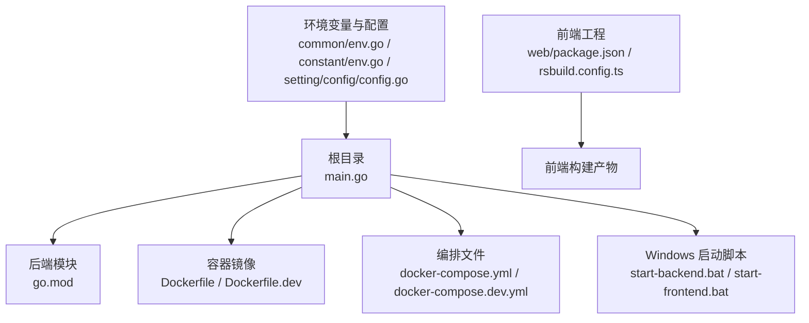
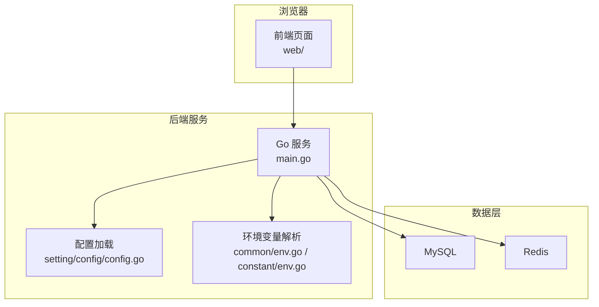
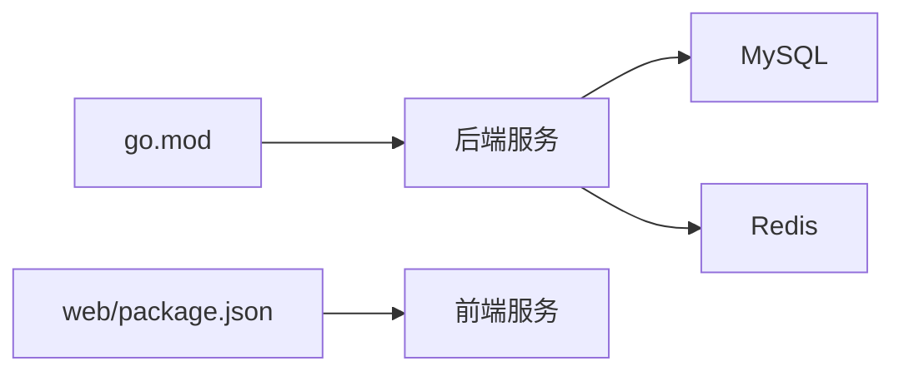

# 开发环境搭建

<cite>
**本文档引用的文件**   
- [main.go](file://main.go)
- [go.mod](file://go.mod)
- [Dockerfile](file://Dockerfile)
- [Dockerfile.dev](file://Dockerfile.dev)
- [docker-compose.yml](file://docker-compose.yml)
- [docker-compose.dev.yml](file://docker-compose.dev.yml)
- [.gitignore](file://.gitignore)
- [start-backend.bat](file://start-backend.bat)
- [start-frontend.bat](file://start-frontend.bat)
- [makefile](file://makefile)
- [web/package.json](file://web/package.json)
- [web/bun.lock](file://web/bun.lock)
- [web/rsbuild.config.ts](file://web/rsbuild.config.ts)
- [common/env.go](file://common/env.go)
- [constant/env.go](file://constant/env.go)
- [setting/config/config.go](file://setting/config/config.go)
</cite>

## 目录
1. [简介](#简介)
2. [项目结构](#项目结构)
3. [核心组件](#核心组件)
4. [架构总览](#架构总览)
5. [详细组件分析](#详细组件分析)
6. [依赖分析](#依赖分析)
7. [性能考虑](#性能考虑)
8. [故障排查指南](#故障排查指南)
9. [结论](#结论)
10. [附录](#附录)

## 简介
本文件面向本地开发与调试，提供从零开始搭建该项目的完整指南。内容涵盖：
- Go 语言版本与模块管理（go mod）
- 数据库与缓存（MySQL、Redis）与环境变量配置
- Docker 与 Docker Compose 的开发环境编排
- 前端 Node.js/Bun 环境配置与构建
- 本地启动顺序与常用命令
- VS Code 等开发工具推荐配置
- 常见问题定位与解决

## 项目结构
仓库采用前后端分离的模块化组织方式：
- 后端：Go 语言服务，入口为根目录 main.go，使用 go.mod 进行依赖管理
- 前端：位于 web 目录，基于现代前端工程化方案，支持 npm/Bun 包管理与构建
- 容器化：提供 Dockerfile 与 docker-compose 文件用于快速拉起服务
- 脚本与工具：包含 Windows 快捷启动脚本、Makefile 等

图表来源 
- [main.go:1-20](file://main.go#L1-L20)
- [go.mod:1-20](file://go.mod#L1-L20)
- [Dockerfile:1-20](file://Dockerfile#L1-L20)
- [Dockerfile.dev:1-20](file://Dockerfile.dev#L1-L20)
- [docker-compose.yml:1-20](file://docker-compose.yml#L1-L20)
- [docker-compose.dev.yml:1-20](file://docker-compose.dev.yml#L1-L20)
- [web/package.json:1-20](file://web/package.json#L1-L20)
- [web/rsbuild.config.ts:1-20](file://web/rsbuild.config.ts#L1-L20)
- [common/env.go:1-20](file://common/env.go#L1-L20)
- [constant/env.go:1-20](file://constant/env.go#L1-L20)
- [setting/config/config.go:1-20](file://setting/config/config.go#L1-L20)

章节来源
- [main.go:1-50](file://main.go#L1-L50)
- [go.mod:1-30](file://go.mod#L1-L30)
- [web/package.json:1-40](file://web/package.json#L1-L40)
- [web/rsbuild.config.ts:1-40](file://web/rsbuild.config.ts#L1-L40)

## 核心组件
- 后端服务：Go 程序通过 main.go 初始化路由、中间件、数据库/缓存连接、定时任务等
- 配置系统：集中读取环境变量与配置文件，统一注入到各模块
- 前端应用：基于 React/RustBuild 的工程，提供管理控制台与开发者工具
- 容器编排：通过 docker-compose 一键拉起后端、MySQL、Redis 等依赖服务

章节来源
- [main.go:1-80](file://main.go#L1-L80)
- [setting/config/config.go:1-60](file://setting/config/config.go#L1-L60)
- [common/env.go:1-60](file://common/env.go#L1-L60)
- [constant/env.go:1-60](file://constant/env.go#L1-L60)

## 架构总览
下图展示本地开发时各组件的交互关系：浏览器访问前端，前端请求后端 API；后端连接 MySQL 与 Redis；所有服务可通过 Docker Compose 统一编排。

图表来源 
- [main.go:1-60](file://main.go#L1-L60)
- [setting/config/config.go:1-40](file://setting/config/config.go#L1-L40)
- [common/env.go:1-40](file://common/env.go#L1-L40)
- [constant/env.go:1-40](file://constant/env.go#L1-L40)

## 详细组件分析

### Go 后端环境搭建
- Go 版本要求：参考 go.mod 中声明的 Go 版本与依赖
- 依赖管理：使用 go mod 进行模块管理与依赖下载
- 运行入口：main.go 负责初始化服务、注册路由、加载配置
- 配置与环境变量：通过 common/env.go、constant/env.go、setting/config/config.go 统一读取

建议步骤
- 安装符合 go.mod 要求的 Go 版本
- 在仓库根目录执行 go mod download 拉取依赖
- 设置必要的环境变量（数据库、缓存、密钥等）
- 直接运行 main.go 或 go run .

章节来源
- [go.mod:1-30](file://go.mod#L1-L30)
- [main.go:1-60](file://main.go#L1-L60)
- [common/env.go:1-60](file://common/env.go#L1-L60)
- [constant/env.go:1-60](file://constant/env.go#L1-L60)
- [setting/config/config.go:1-60](file://setting/config/config.go#L1-L60)

### 数据库与缓存配置（MySQL、Redis）
- MySQL：用于持久化业务数据，需创建数据库并导入初始结构（如有迁移脚本）
- Redis：用于缓存与会话存储，需配置连接地址与认证信息
- 环境变量：由 common/env.go、constant/env.go、setting/config/config.go 读取并注入

常见环境变量（示例说明）
- 数据库连接串、用户名、密码、主机、端口
- Redis 连接串、密码、DB 索引
- 其他运行时开关（日志级别、调试模式、跨域等）

注意
- 请确保网络可达且凭据正确
- 生产与开发环境建议使用不同实例或命名空间隔离

章节来源
- [common/env.go:1-80](file://common/env.go#L1-L80)
- [constant/env.go:1-80](file://constant/env.go#L1-L80)
- [setting/config/config.go:1-80](file://setting/config/config.go#L1-L80)

### Docker 与 Docker Compose 开发环境
- Dockerfile：定义后端镜像构建流程
- Dockerfile.dev：开发镜像，便于热重载与调试
- docker-compose.yml：生产/通用编排
- docker-compose.dev.yml：开发编排，通常包含 MySQL、Redis 及后端服务

建议步骤
- 安装 Docker 与 Docker Compose
- 复制或创建 .env 文件，填写数据库与缓存等环境变量
- 使用 docker-compose -f docker-compose.dev.yml up 启动开发环境
- 查看服务日志与端口映射，确认服务健康

章节来源
- [Dockerfile:1-40](file://Dockerfile#L1-L40)
- [Dockerfile.dev:1-40](file://Dockerfile.dev#L1-L40)
- [docker-compose.yml:1-60](file://docker-compose.yml#L1-L60)
- [docker-compose.dev.yml:1-60](file://docker-compose.dev.yml#L1-L60)

### 前端开发环境（Node.js/Bun）
- 包管理器：支持 npm 与 Bun（见 web/package.json 与 web/bun.lock）
- 构建工具：rsbuild（见 web/rsbuild.config.ts）
- 开发服务器：通过 package.json scripts 启动

建议步骤
- 安装 Node.js（LTS 版本）或 Bun
- 进入 web 目录，执行包安装命令（npm install 或 bun install）
- 启动开发服务器（npm run dev 或 bun dev），按提示访问本地端口
- 如需代理后端接口，请在前端配置中指向后端服务地址

章节来源
- [web/package.json:1-60](file://web/package.json#L1-L60)
- [web/bun.lock:1-20](file://web/bun.lock#L1-L20)
- [web/rsbuild.config.ts:1-60](file://web/rsbuild.config.ts#L1-L60)

### 本地启动顺序与命令
推荐的启动顺序
1. 启动依赖服务：MySQL、Redis（可使用 Docker Compose）
2. 启动后端服务：确保环境变量与数据库连通性
3. 启动前端服务：配置代理至后端，打开浏览器访问

常用命令
- 后端：go run . 或使用 makefile 提供的目标
- 前端：cd web && npm run dev 或 bun dev
- 容器：docker-compose -f docker-compose.dev.yml up

Windows 快捷脚本
- start-backend.bat：一键启动后端
- start-frontend.bat：一键启动前端

章节来源
- [makefile:1-40](file://makefile#L1-L40)
- [start-backend.bat:1-20](file://start-backend.bat#L1-L20)
- [start-frontend.bat:1-20](file://start-frontend.bat#L1-L20)
- [docker-compose.dev.yml:1-60](file://docker-compose.dev.yml#L1-L60)

### 开发工具推荐配置（VS Code）
- Go 插件：gopls、Delve 调试器、Go Test Explorer
- 前端插件：ESLint、Prettier、TypeScript 智能提示
- 调试配置：
  - Go 调试：使用 Delve 附加进程或内建调试
  - 前端调试：Chrome DevTools 或 VS Code 内置调试
- 代码格式化：保存时自动格式化，统一风格

章节来源
- [web/package.json:1-60](file://web/package.json#L1-L60)
- [main.go:1-40](file://main.go#L1-L40)

## 依赖分析
后端依赖
- Go 标准库与第三方模块（由 go.mod 声明）
- MySQL、Redis 客户端库（由运行时环境变量决定）

前端依赖
- React 生态与构建工具链（由 web/package.json 声明）
- 可选 Bun 锁文件（web/bun.lock）

图表来源 
- [go.mod:1-30](file://go.mod#L1-L30)
- [web/package.json:1-40](file://web/package.json#L1-L40)

章节来源
- [go.mod:1-30](file://go.mod#L1-L30)
- [web/package.json:1-40](file://web/package.json#L1-L40)

## 性能考虑
- 数据库连接池：合理设置最大连接数与超时
- Redis 缓存策略：热点数据缓存、过期时间控制
- 前端资源优化：按需加载、静态资源压缩与缓存
- 日志级别：开发阶段开启详细日志，生产降低日志量

[本节为通用指导，不直接分析具体文件]

## 故障排查指南
常见问题与定位思路
- 无法连接数据库/Redis：检查环境变量、网络连通性与凭据
- 端口冲突：修改端口映射或释放占用端口
- 前端无法访问后端：检查代理配置与 CORS 设置
- 权限问题：确认文件读写权限与卷挂载路径
- 依赖缺失：重新执行 go mod download 或 npm/bun install

定位方法
- 查看容器日志与服务日志
- 使用 netstat/ss 检查端口占用
- 使用 curl/wget 测试后端接口连通性
- 启用更详细的日志输出

章节来源
- [common/env.go:1-80](file://common/env.go#L1-L80)
- [constant/env.go:1-80](file://constant/env.go#L1-L80)
- [setting/config/config.go:1-80](file://setting/config/config.go#L1-L80)

## 结论
通过本文档，您可以完成从 Go 环境、依赖服务、前端工程到容器编排的完整本地开发搭建。建议在开发初期优先使用 Docker Compose 快速拉起依赖服务，再逐步完善环境变量与调试配置，以获得稳定的开发体验。

[本节为总结，不直接分析具体文件]

## 附录
- 忽略规则：.gitignore 用于排除构建产物与敏感文件
- 启动脚本：Windows 用户可参考 start-backend.bat 与 start-frontend.bat
- Makefile：封装常用命令，提升效率

章节来源
- [.gitignore:1-40](file://.gitignore#L1-L40)
- [start-backend.bat:1-20](file://start-backend.bat#L1-L20)
- [start-frontend.bat:1-20](file://start-frontend.bat#L1-L20)
- [makefile:1-40](file://makefile#L1-L40)