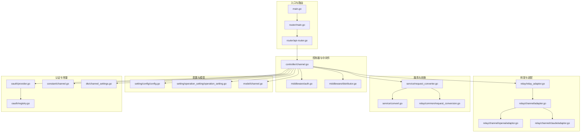
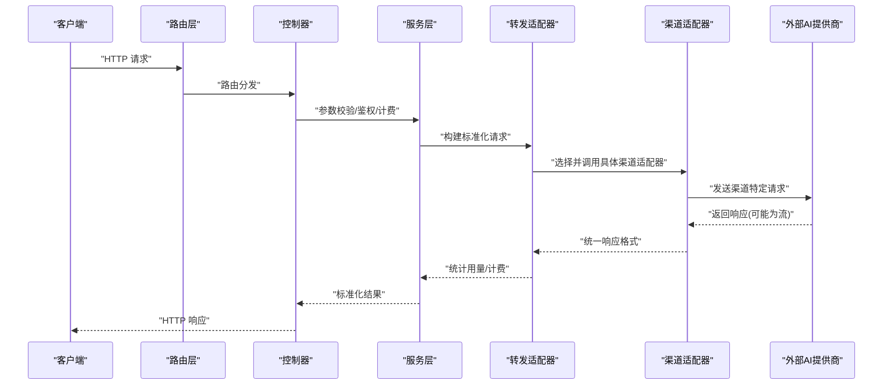
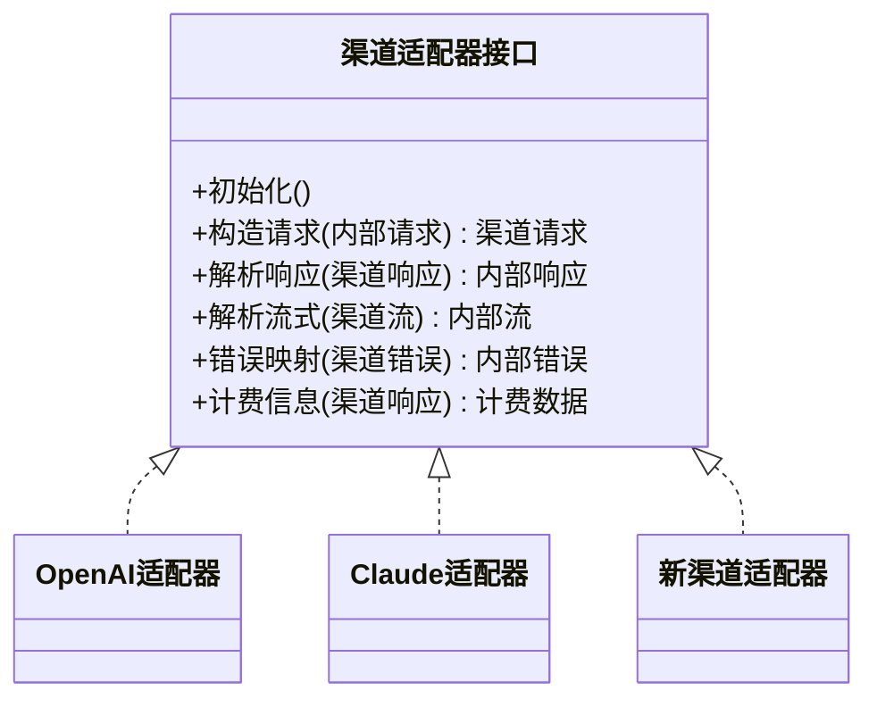
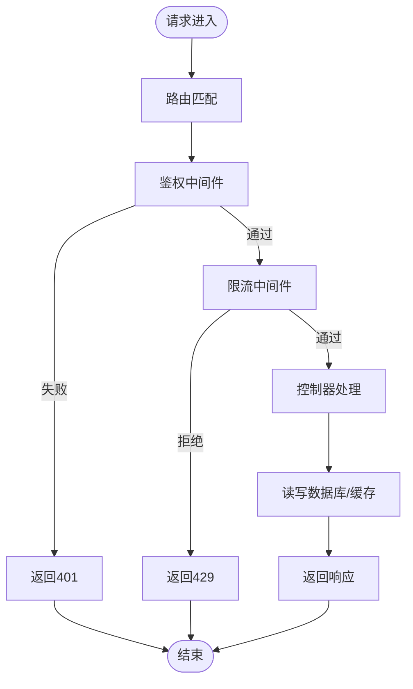
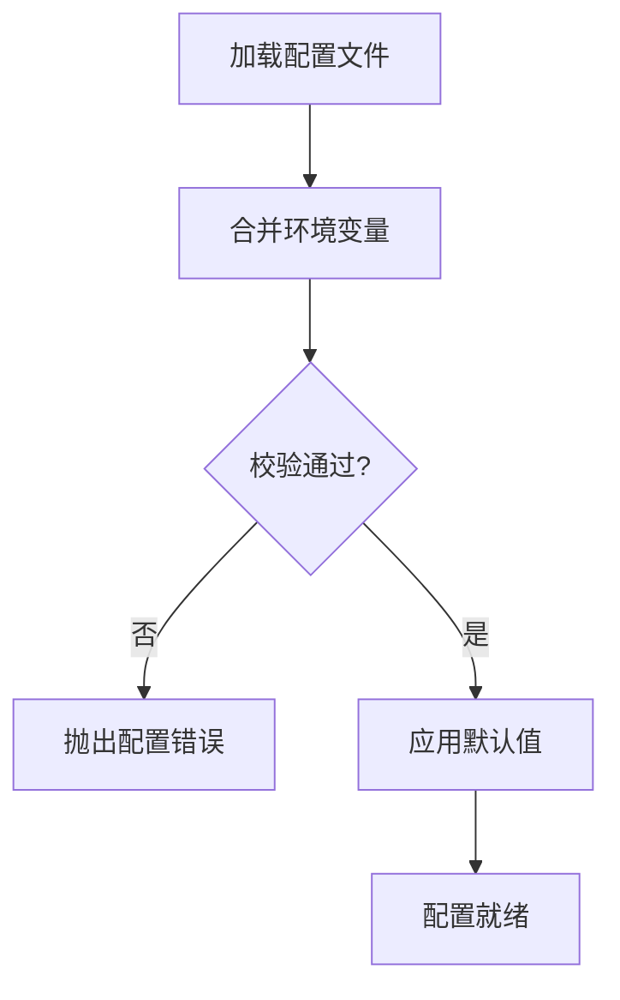
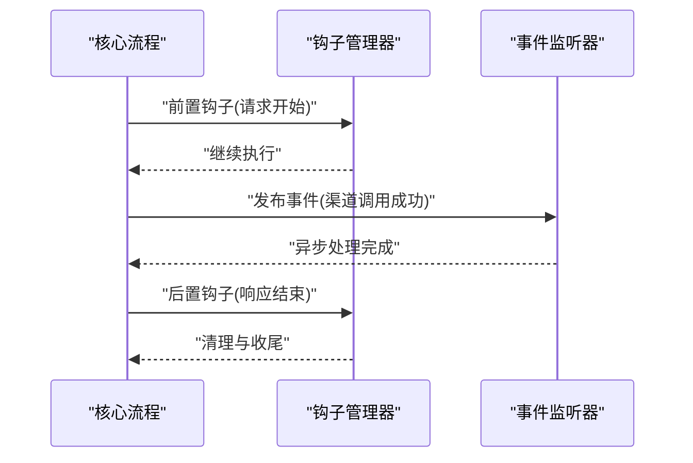
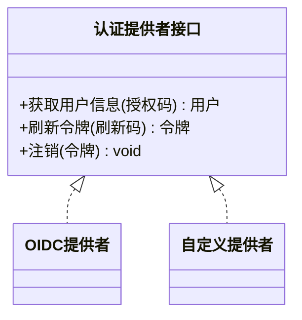
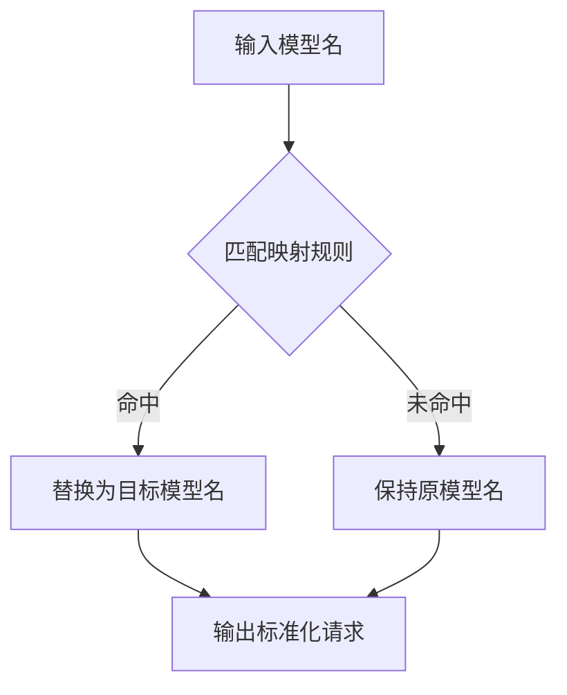
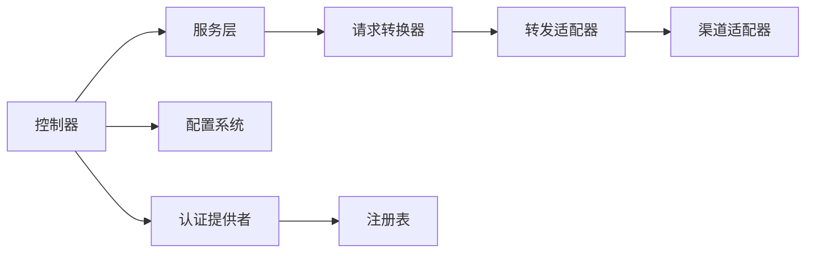

# 扩展与定制

<cite>
**本文引用的文件**
- [main.go](file://main.go)
- [router/main.go](file://router/main.go)
- [router/api-router.go](file://router/api-router.go)
- [relay/relay_adaptor.go](file://relay/relay_adaptor.go)
- [relay/channel/adapter.go](file://relay/channel/adapter.go)
- [relay/channel/openai/adaptor.go](file://relay/channel/openai/adaptor.go)
- [relay/channel/claude/adaptor.go](file://relay/channel/claude/adaptor.go)
- [relay/common/request_conversion.go](file://relay/common/request_conversion.go)
- [relay/helper/model_mapped.go](file://relay/helper/model_mapped.go)
- [service/request_converter.go](file://service/request_converter.go)
- [service/convert.go](file://service/convert.go)
- [setting/config/config.go](file://setting/config/config.go)
- [setting/operation_setting/operation_setting.go](file://setting/operation_setting/operation_setting.go)
- [model/channel.go](file://model/channel.go)
- [controller/channel.go](file://controller/channel.go)
- [middleware/auth.go](file://middleware/auth.go)
- [middleware/distributor.go](file://middleware/distributor.go)
- [oauth/provider.go](file://oauth/provider.go)
- [oauth/registry.go](file://oauth/registry.go)
- [constant/channel.go](file://constant/channel.go)
- [dto/channel_settings.go](file://dto/channel_settings.go)
</cite>

## 目录
1. [简介](#简介)
2. [项目结构](#项目结构)
3. [核心组件](#核心组件)
4. [架构总览](#架构总览)
5. [详细组件分析](#详细组件分析)
6. [依赖关系分析](#依赖关系分析)
7. [性能考量](#性能考量)
8. [故障排查指南](#故障排查指南)
9. [结论](#结论)
10. [附录](#附录)

## 简介
本文件面向希望扩展与定制该项目的开发者，聚焦以下主题：
- 新增AI提供商支持（渠道适配器规范、协议转换、错误处理）
- 自定义控制器开发（路由注册、中间件集成、权限控制）
- 配置系统扩展（新配置项定义、验证规则、默认值管理）
- 扩展现有功能模块（事件监听器、钩子函数）
- 插件架构模式与最佳实践
- 具体扩展示例（支付渠道、认证提供者、模型映射规则）
- 扩展模块的测试与部署指导

## 项目结构
本项目采用分层与按功能域组织相结合的结构：
- router：HTTP路由与中间件装配
- controller：业务控制器
- middleware：通用中间件（鉴权、限流、分发等）
- relay：请求转发与渠道适配层
- service：服务编排与转换逻辑
- setting：配置加载与校验
- model：数据模型与持久化
- oauth：第三方认证提供者注册与实现
- constant/dto：常量与数据传输对象
- common/pkg：公共工具与包

**图表来源**
- [main.go:1-200](file://main.go#L1-L200)
- [router/main.go:1-200](file://router/main.go#L1-L200)
- [router/api-router.go:1-200](file://router/api-router.go#L1-L200)
- [controller/channel.go:1-200](file://controller/channel.go#L1-L200)
- [middleware/auth.go:1-200](file://middleware/auth.go#L1-L200)
- [middleware/distributor.go:1-200](file://middleware/distributor.go#L1-L200)
- [relay/relay_adaptor.go:1-200](file://relay/relay_adaptor.go#L1-L200)
- [relay/channel/adapter.go:1-200](file://relay/channel/adapter.go#L1-L200)
- [relay/channel/openai/adaptor.go:1-200](file://relay/channel/openai/adaptor.go#L1-L200)
- [relay/channel/claude/adaptor.go:1-200](file://relay/channel/claude/adaptor.go#L1-L200)
- [service/request_converter.go:1-200](file://service/request_converter.go#L1-L200)
- [service/convert.go:1-200](file://service/convert.go#L1-L200)
- [relay/common/request_conversion.go:1-200](file://relay/common/request_conversion.go#L1-L200)
- [setting/config/config.go:1-200](file://setting/config/config.go#L1-L200)
- [setting/operation_setting/operation_setting.go:1-200](file://setting/operation_setting/operation_setting.go#L1-L200)
- [model/channel.go:1-200](file://model/channel.go#L1-L200)
- [oauth/provider.go:1-200](file://oauth/provider.go#L1-L200)
- [oauth/registry.go:1-200](file://oauth/registry.go#L1-200)
- [constant/channel.go:1-200](file://constant/channel.go#L1-200)
- [dto/channel_settings.go:1-200](file://dto/channel_settings.go#L1-200)

**章节来源**
- [main.go:1-200](file://main.go#L1-L200)
- [router/main.go:1-200](file://router/main.go#L1-L200)
- [router/api-router.go:1-200](file://router/api-router.go#L1-200)

## 核心组件
- 渠道适配器接口与实现：统一抽象不同AI提供商的请求/响应格式、鉴权、重试与计费。
- 请求转换器：将内部标准化请求转换为各渠道特定格式，并处理流式与非流式响应。
- 控制器与路由：提供对外API，负责参数校验、鉴权、调用服务层与返回结果。
- 配置系统：集中管理运行时配置，支持校验与默认值。
- 认证提供者：可扩展第三方登录方式，通过注册表动态发现。
- 模型与设置：持久化渠道、用户、令牌、定价等关键实体。

**章节来源**
- [relay/relay_adaptor.go:1-200](file://relay/relay_adaptor.go#L1-L200)
- [relay/channel/adapter.go:1-200](file://relay/channel/adapter.go#L1-L200)
- [service/request_converter.go:1-200](file://service/request_converter.go#L1-L200)
- [controller/channel.go:1-200](file://controller/channel.go#L1-L200)
- [setting/config/config.go:1-200](file://setting/config/config.go#L1-L200)
- [oauth/provider.go:1-200](file://oauth/provider.go#L1-L200)
- [model/channel.go:1-200](file://model/channel.go#L1-L200)

## 架构总览
下图展示了从HTTP请求到渠道转发的整体流程，以及扩展点位置。

**图表来源**
- [router/api-router.go:1-200](file://router/api-router.go#L1-L200)
- [controller/channel.go:1-200](file://controller/channel.go#L1-L200)
- [service/request_converter.go:1-200](file://service/request_converter.go#L1-L200)
- [relay/relay_adaptor.go:1-200](file://relay/relay_adaptor.go#L1-L200)
- [relay/channel/adapter.go:1-200](file://relay/channel/adapter.go#L1-L200)

## 详细组件分析

### 新增AI提供商支持（渠道适配器）
目标：在不修改核心框架的前提下，接入新的AI提供商。

- 适配器接口与职责
  - 定义统一的初始化、请求构造、响应解析、错误映射、计费字段提取、流式处理等能力。
  - 参考现有实现以保持一致性。

- 实现步骤
  1) 新建适配器包与文件，实现统一接口方法。
  2) 在适配器中声明常量（如渠道类型、鉴权头名）。
  3) 实现请求转换：将内部标准请求转为渠道特定JSON/表单。
  4) 实现响应转换：将渠道响应转为内部标准响应，包括流式分片。
  5) 错误处理：将上游错误码映射为内部错误语义。
  6) 计费与用量：解析token使用量、输出长度等。
  7) 注册适配器：在渠道适配器注册表中添加新类型。

- 协议转换逻辑
  - 请求侧：消息体、模型名、温度、最大生成长度、图片/音频附件等字段映射。
  - 响应侧：内容块、停止原因、usage字段、流式事件合并。

- 错误处理机制
  - 网络异常、鉴权失败、速率限制、模型不可用等分类处理。
  - 可配置重试策略与降级通道。

**图表来源**
- [relay/channel/adapter.go:1-200](file://relay/channel/adapter.go#L1-L200)
- [relay/channel/openai/adaptor.go:1-200](file://relay/channel/openai/adaptor.go#L1-L200)
- [relay/channel/claude/adaptor.go:1-200](file://relay/channel/claude/adaptor.go#L1-L200)

**章节来源**
- [relay/channel/adapter.go:1-200](file://relay/channel/adapter.go#L1-L200)
- [relay/channel/openai/adaptor.go:1-200](file://relay/channel/openai/adaptor.go#L1-L200)
- [relay/channel/claude/adaptor.go:1-200](file://relay/channel/claude/adaptor.go#L1-L200)
- [relay/common/request_conversion.go:1-200](file://relay/common/request_conversion.go#L1-L200)

### 自定义控制器开发
目标：新增或扩展业务API，包含路由注册、中间件集成与权限控制。

- 路由注册
  - 在路由文件中定义路径与方法，绑定控制器方法。
  - 建议按功能域拆分路由文件，便于维护。

- 中间件集成
  - 鉴权中间件：校验Token、会话、角色。
  - 限流中间件：按IP、用户、模型维度限速。
  - 日志与审计：记录请求上下文与耗时。

- 权限控制
  - 基于角色的访问控制（RBAC），结合资源与操作进行授权。
  - 可在控制器方法前注入权限检查中间件。

**图表来源**
- [router/api-router.go:1-200](file://router/api-router.go#L1-L200)
- [middleware/auth.go:1-200](file://middleware/auth.go#L1-L200)
- [controller/channel.go:1-200](file://controller/channel.go#L1-L200)

**章节来源**
- [router/api-router.go:1-200](file://router/api-router.go#L1-L200)
- [middleware/auth.go:1-200](file://middleware/auth.go#L1-L200)
- [controller/channel.go:1-200](file://controller/channel.go#L1-L200)

### 配置系统扩展
目标：新增配置项，确保加载、校验与默认值管理的一致性。

- 新配置项定义
  - 在配置结构体中添加字段，标注标签用于校验与文档生成。
  - 为复杂配置提供嵌套结构与枚举值。

- 验证规则
  - 必填、范围、正则、唯一性等校验。
  - 启动时校验失败应阻止服务启动。

- 默认值管理
  - 提供合理的默认值，避免空指针与运行时异常。
  - 支持环境变量覆盖。

**图表来源**
- [setting/config/config.go:1-200](file://setting/config/config.go#L1-L200)
- [setting/operation_setting/operation_setting.go:1-200](file://setting/operation_setting/operation_setting.go#L1-L200)

**章节来源**
- [setting/config/config.go:1-200](file://setting/config/config.go#L1-L200)
- [setting/operation_setting/operation_setting.go:1-200](file://setting/operation_setting/operation_setting.go#L1-L200)

### 扩展现有功能模块（事件监听器与钩子）
- 事件监听器
  - 在关键生命周期（请求开始/结束、计费结算、渠道调用成功/失败）触发事件。
  - 订阅者实现统一接口，接收事件并进行异步处理（日志、指标、通知）。

- 钩子函数
  - 在请求转换前后、响应组装前后插入自定义逻辑。
  - 支持条件启用与优先级排序。

[本节为概念说明，不直接分析具体文件]

### 插件架构模式与最佳实践
- 插件发现
  - 通过注册表模式在启动时扫描并加载插件。
  - 插件需提供元数据（名称、版本、依赖）。

- 隔离与生命周期
  - 插件运行环境隔离，避免全局状态污染。
  - 明确初始化、运行、销毁阶段。

- 配置与扩展点
  - 插件配置独立，支持热更新。
  - 暴露扩展点（如请求拦截、响应改写、计费策略）。

[本节为概念说明，不直接分析具体文件]

### 具体扩展示例

#### 示例一：添加新的支付渠道
- 步骤
  1) 新增支付回调处理器与DTO。
  2) 在支付服务中注册新渠道。
  3) 在控制器中暴露回调与查询接口。
  4) 配置签名校验与幂等处理。

- 关键点
  - 回调安全：签名、时间戳、重放攻击防护。
  - 幂等：订单号去重与状态一致性。
  - 对账：定时任务核对交易流水。

[本节为概念说明，不直接分析具体文件]

#### 示例二：自定义认证提供者
- 步骤
  1) 实现认证提供者接口（获取用户信息、刷新令牌）。
  2) 在认证注册表中登记提供者。
  3) 前端集成OAuth/OIDC流程。
  4) 配置客户端ID、密钥与回调地址。

**图表来源**
- [oauth/provider.go:1-200](file://oauth/provider.go#L1-L200)
- [oauth/registry.go:1-200](file://oauth/registry.go#L1-L200)

**章节来源**
- [oauth/provider.go:1-200](file://oauth/provider.go#L1-L200)
- [oauth/registry.go:1-200](file://oauth/registry.go#L1-L200)

#### 示例三：扩展模型映射规则
- 步骤
  1) 在模型映射辅助中新增映射条目（源模型名→目标模型名）。
  2) 支持分组映射与通配符。
  3) 在请求转换阶段应用映射规则。

**图表来源**
- [relay/helper/model_mapped.go:1-200](file://relay/helper/model_mapped.go#L1-L200)
- [service/request_converter.go:1-200](file://service/request_converter.go#L1-L200)

**章节来源**
- [relay/helper/model_mapped.go:1-200](file://relay/helper/model_mapped.go#L1-L200)
- [service/request_converter.go:1-200](file://service/request_converter.go#L1-L200)

## 依赖关系分析
- 控制器依赖服务层，服务层依赖请求转换器与渠道适配器。
- 配置系统被控制器与服务层共同消费。
- 认证提供者通过注册表动态加载，降低耦合。

**图表来源**
- [controller/channel.go:1-200](file://controller/channel.go#L1-L200)
- [service/request_converter.go:1-200](file://service/request_converter.go#L1-L200)
- [relay/relay_adaptor.go:1-200](file://relay/relay_adaptor.go#L1-L200)
- [setting/config/config.go:1-200](file://setting/config/config.go#L1-L200)
- [oauth/provider.go:1-200](file://oauth/provider.go#L1-L200)
- [oauth/registry.go:1-200](file://oauth/registry.go#L1-L200)

**章节来源**
- [controller/channel.go:1-200](file://controller/channel.go#L1-L200)
- [service/request_converter.go:1-200](file://service/request_converter.go#L1-L200)
- [relay/relay_adaptor.go:1-200](file://relay/relay_adaptor.go#L1-L200)
- [setting/config/config.go:1-200](file://setting/config/config.go#L1-L200)
- [oauth/provider.go:1-200](file://oauth/provider.go#L1-L200)
- [oauth/registry.go:1-200](file://oauth/registry.go#L1-L200)

## 性能考量
- 连接池与超时：合理设置HTTP客户端连接池、超时与重试次数。
- 流式处理：优先使用流式响应减少内存占用与首字节延迟。
- 缓存策略：对只读配置、模型列表等进行缓存。
- 限流与熔断：按用户、模型、渠道维度实施限流与熔断保护。
- 并发调度：使用协程池与任务队列提升吞吐。

[本节为通用指导，不直接分析具体文件]

## 故障排查指南
- 常见问题
  - 渠道适配器初始化失败：检查密钥、URL、签名算法。
  - 请求转换异常：核对字段映射与数据类型。
  - 鉴权失败：确认Token有效期与作用域。
  - 限流触发：检查配额与速率限制配置。

- 调试技巧
  - 开启详细日志与请求追踪。
  - 使用本地Mock渠道进行单元测试。
  - 通过健康检查端点验证依赖服务可用性。

**章节来源**
- [relay/channel/adapter.go:1-200](file://relay/channel/adapter.go#L1-L200)
- [service/request_converter.go:1-200](file://service/request_converter.go#L1-L200)
- [middleware/auth.go:1-200](file://middleware/auth.go#L1-L200)

## 结论
通过统一的适配器接口、请求转换器与注册表机制，本项目提供了高度可扩展的架构。开发者可以在不侵入核心代码的前提下，快速接入新的AI提供商、支付渠道与认证提供者。配合完善的配置系统与中间件生态，可实现灵活的业务定制与稳定的生产运行。

[本节为总结，不直接分析具体文件]

## 附录
- 术语表
  - 渠道适配器：封装特定AI提供商的通信细节。
  - 请求转换器：将内部标准请求转换为渠道特定格式。
  - 注册表：启动时发现的插件与提供者集合。
  - 中间件：横切关注点的处理逻辑（鉴权、限流、日志）。

[本节为概念说明，不直接分析具体文件]