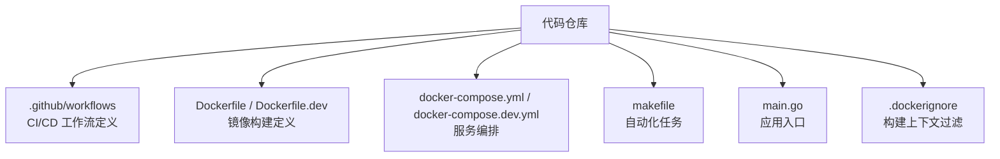
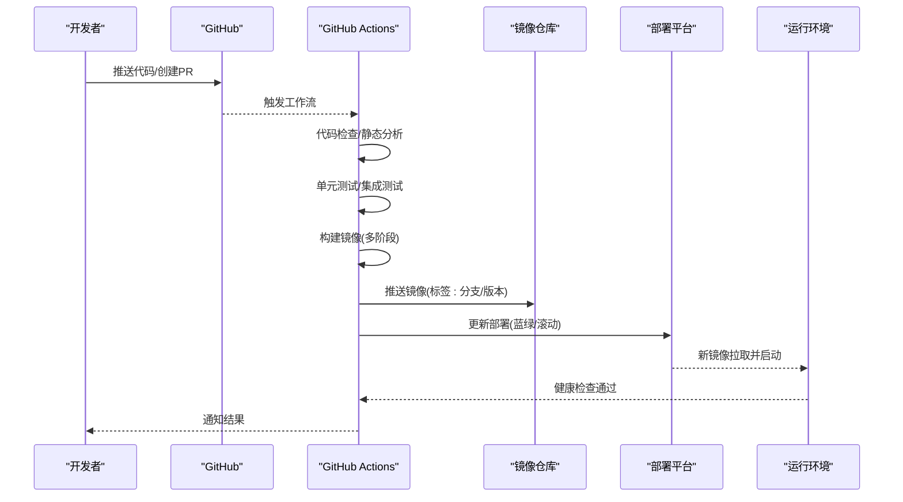
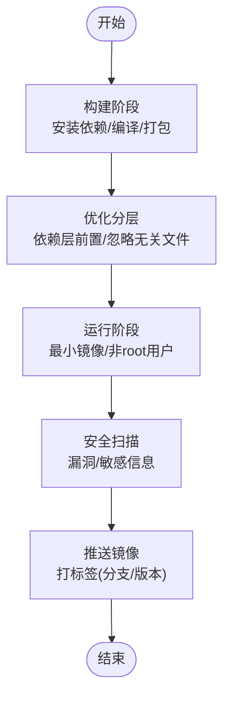
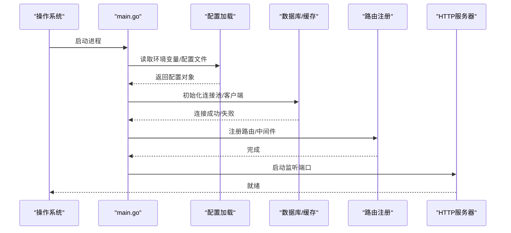
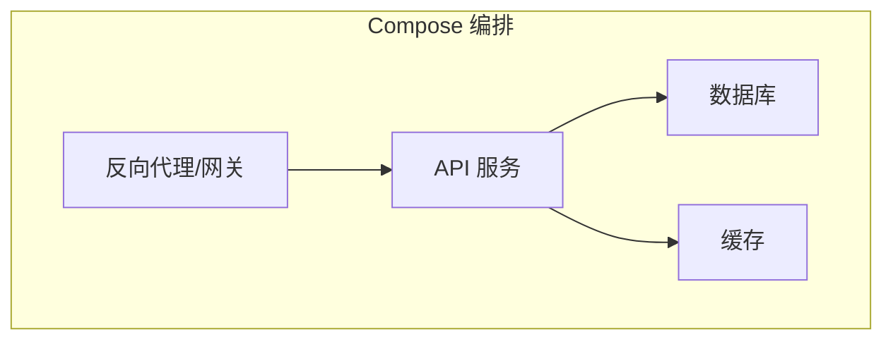
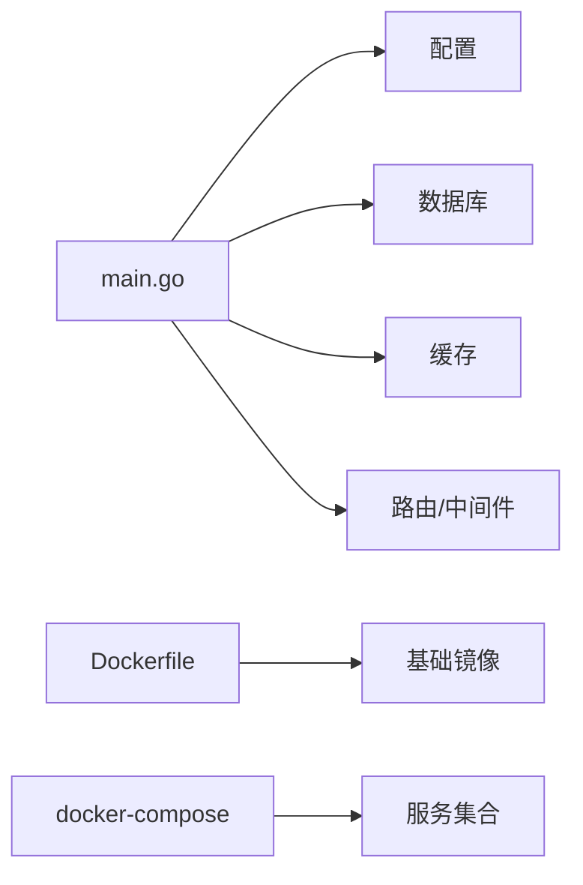

# 持续集成与部署

<cite>
**本文引用的文件**   
- [Dockerfile](file://Dockerfile)
- [Dockerfile.dev](file://Dockerfile.dev)
- [docker-compose.yml](file://docker-compose.yml)
- [docker-compose.dev.yml](file://docker-compose.dev.yml)
- [.github/workflows](file://.github/workflows)
- [makefile](file://makefile)
- [main.go](file://main.go)
- [.dockerignore](file://.dockerignore)
</cite>

## 目录
1. [简介](#简介)
2. [项目结构](#项目结构)
3. [核心组件](#核心组件)
4. [架构总览](#架构总览)
5. [详细组件分析](#详细组件分析)
6. [依赖分析](#依赖分析)
7. [性能考虑](#性能考虑)
8. [故障排除指南](#故障排除指南)
9. [结论](#结论)
10. [附录](#附录)

## 简介
本文件面向持续集成与部署（CI/CD），围绕 GitHub Actions、Docker 镜像构建与优化、Makefile 自动化任务、质量门禁、多环境部署策略与回滚机制、监控告警配置以及故障排除进行系统化说明。目标是帮助开发者与运维人员快速理解并落地一套稳定、可观测、可回滚的发布流水线。

## 项目结构
仓库包含后端 Go 应用、前端资源、容器化配置与本地编排脚本，CI/CD 相关的关键位置如下：
- CI/CD 工作流定义位于 .github/workflows（当前仓库未提供具体 YAML 文件内容）
- Docker 构建入口为根目录下的 Dockerfile 与开发用 Dockerfile.dev
- 本地与测试编排使用 docker-compose.yml 与 docker-compose.dev.yml
- Makefile 提供常用自动化任务
- 应用主入口 main.go
- 构建忽略规则 .dockerignore

**图表来源** 
- [.github/workflows](file://.github/workflows)
- [Dockerfile](file://Dockerfile)
- [Dockerfile.dev](file://Dockerfile.dev)
- [docker-compose.yml](file://docker-compose.yml)
- [docker-compose.dev.yml](file://docker-compose.dev.yml)
- [makefile](file://makefile)
- [main.go](file://main.go)
- [.dockerignore](file://.dockerignore)

**章节来源**
- [.github/workflows](file://.github/workflows)
- [Dockerfile](file://Dockerfile)
- [Dockerfile.dev](file://Dockerfile.dev)
- [docker-compose.yml](file://docker-compose.yml)
- [docker-compose.dev.yml](file://docker-compose.dev.yml)
- [makefile](file://makefile)
- [main.go](file://main.go)
- [.dockerignore](file://.dockerignore)

## 核心组件
- CI/CD 工作流（GitHub Actions）
  - 作用：触发条件、代码检查、单元测试、构建镜像、推送制品、部署到目标环境
  - 现状：仓库已提供 .github/workflows 目录，但未见具体工作流文件；建议按“质量门禁—构建—发布—部署”的阶段化设计
- Docker 镜像构建
  - 生产镜像：基于精简基础镜像，采用多阶段构建，仅拷贝运行时产物
  - 开发镜像：保留调试工具与完整源码，便于本地联调
- 服务编排
  - docker-compose.yml：生产或测试环境的多服务编排（如 API、数据库、缓存等）
  - docker-compose.dev.yml：开发环境的增强编排（热重载、调试端口等）
- Makefile 自动化
  - 统一命令入口，封装 lint、test、build、run、compose 等常用操作
- 应用入口
  - main.go：程序启动、配置加载、路由注册、中间件初始化

**章节来源**
- [.github/workflows](file://.github/workflows)
- [Dockerfile](file://Dockerfile)
- [Dockerfile.dev](file://Dockerfile.dev)
- [docker-compose.yml](file://docker-compose.yml)
- [docker-compose.dev.yml](file://docker-compose.dev.yml)
- [makefile](file://makefile)
- [main.go](file://main.go)

## 架构总览
下图展示从代码提交到生产部署的典型流程，涵盖质量门禁、镜像构建、制品管理与部署回滚。

[本图为概念性流程图，不直接映射具体源文件]

## 详细组件分析

### CI/CD 工作流（GitHub Actions）
- 建议阶段划分
  - 代码质量：lint、格式化、安全扫描（依赖漏洞、敏感信息检测）
  - 测试：单元测试、覆盖率阈值、可选的性能基准
  - 构建：Go 二进制构建、前端资源打包（如有）、生成镜像
  - 发布：打标签、推送镜像、生成变更日志
  - 部署：按环境（dev/test/staging/prod）执行部署，含健康检查与回滚
- 触发策略
  - push 到主干/发布分支
  - pull_request 事件合并前校验
  - 手动触发生产发布（需审批）
- 关键要点
  - 缓存 Go 模块与构建产物以加速流水线
  - 使用矩阵构建覆盖多平台镜像（如 amd64/arm64）
  - 将密钥与凭据通过 Secrets 注入，避免硬编码
  - 在部署阶段执行冒烟测试与健康检查

**章节来源**
- [.github/workflows](file://.github/workflows)

### Docker 镜像构建与优化
- 多阶段构建
  - 构建阶段：安装依赖、编译二进制、生成前端产物
  - 运行阶段：仅拷贝必要文件，使用最小基础镜像
- 分层优化
  - 将频繁变动的层（源码）放在后部，稳定的依赖层前置
  - 使用 .dockerignore 剔除无关文件，缩小构建上下文
- 安全加固
  - 非 root 用户运行
  - 定期更新基础镜像
  - 扫描镜像漏洞（可在 CI 中集成）
- 开发镜像
  - 保留调试符号、热重载、调试端口
  - 挂载源码目录以便快速迭代

**图表来源** 
- [Dockerfile](file://Dockerfile)
- [Dockerfile.dev](file://Dockerfile.dev)
- [.dockerignore](file://.dockerignore)

**章节来源**
- [Dockerfile](file://Dockerfile)
- [Dockerfile.dev](file://Dockerfile.dev)
- [.dockerignore](file://.dockerignore)

### Makefile 自动化任务
- 常见任务
  - 代码检查：lint、格式校验
  - 测试：单元测试、覆盖率统计
  - 构建：生成二进制、构建镜像
  - 运行：本地启动、编排服务
  - 清理：清理构建产物
- 使用方式
  - 在终端执行 make <task> 即可调用对应命令
  - 可通过环境变量控制行为（如 GOOS/GOARCH、镜像标签等）
- 最佳实践
  - 保持任务幂等，支持增量构建
  - 对长耗时任务启用缓存
  - 提供 help 任务列出可用命令

**章节来源**
- [makefile](file://makefile)

### 应用入口与启动流程
- main.go 负责：
  - 读取配置与环境变量
  - 初始化日志、数据库、缓存、中间件
  - 注册路由与处理器
  - 启动 HTTP 服务并监听端口
- 启动顺序影响：
  - 配置加载失败应快速失败
  - 外部依赖连接失败应有重试与降级策略
  - 健康检查端点用于部署平台探测

**图表来源** 
- [main.go](file://main.go)

**章节来源**
- [main.go](file://main.go)

### 服务编排（docker-compose）
- docker-compose.yml
  - 定义生产/测试环境的服务集合（API、数据库、缓存、代理等）
  - 暴露端口、挂载数据卷、设置环境变量
  - 健康检查与重启策略
- docker-compose.dev.yml
  - 叠加开发特性：热重载、调试端口、源码挂载
  - 便于本地联调与问题复现

**图表来源** 
- [docker-compose.yml](file://docker-compose.yml)
- [docker-compose.dev.yml](file://docker-compose.dev.yml)

**章节来源**
- [docker-compose.yml](file://docker-compose.yml)
- [docker-compose.dev.yml](file://docker-compose.dev.yml)

## 依赖分析
- 组件耦合
  - main.go 依赖配置、数据库、缓存、路由与中间件
  - Dockerfile 依赖构建环境与基础镜像
  - docker-compose 依赖各服务的镜像与网络/卷配置
- 外部依赖
  - 镜像仓库（推送/拉取）
  - 部署平台（Kubernetes/Docker Swarm/云托管）
  - 监控与告警系统（Prometheus/Grafana/Alertmanager）
- 潜在风险
  - 循环依赖（应避免）
  - 强耦合导致单点故障（通过解耦与服务网格缓解）
  - 镜像体积过大导致拉取慢（多阶段构建与分层优化）

**图表来源** 
- [main.go](file://main.go)
- [Dockerfile](file://Dockerfile)
- [docker-compose.yml](file://docker-compose.yml)

**章节来源**
- [main.go](file://main.go)
- [Dockerfile](file://Dockerfile)
- [docker-compose.yml](file://docker-compose.yml)

## 性能考虑
- 构建性能
  - 启用 Go 模块缓存与构建缓存
  - 并行执行 lint/test/build
  - 使用多平台镜像构建矩阵
- 运行性能
  - 合理设置线程池与连接池大小
  - 启用 gzip/压缩与缓存策略
  - 使用健康检查与优雅关闭
- 镜像性能
  - 多阶段构建减小体积
  - 选择合适的基础镜像（distroless/alpine）
  - 减少不必要的系统包与文件

[本节为通用指导，不直接分析具体文件]

## 故障排除指南
- CI/CD 常见问题
  - 依赖下载失败：检查网络代理与缓存键
  - 测试超时：增加超时时间或拆分测试用例
  - 镜像构建失败：确认基础镜像可达与权限正确
  - 部署失败：查看健康检查与日志，必要时回滚
- Docker 相关问题
  - 构建上下文过大：完善 .dockerignore
  - 权限错误：确保非 root 用户与文件权限正确
  - 端口冲突：调整端口映射或主机端口占用
- 应用启动失败
  - 配置缺失或错误：核对环境变量与配置文件
  - 外部依赖不可达：检查网络与安全组/防火墙
  - 数据库连接失败：验证连接串与认证信息
- 回滚策略
  - 镜像标签管理：保留最近 N 个版本
  - 部署平台回滚：一键回滚到上一个稳定版本
  - 数据迁移：向前兼容与可逆迁移

**章节来源**
- [.dockerignore](file://.dockerignore)
- [Dockerfile](file://Dockerfile)
- [docker-compose.yml](file://docker-compose.yml)
- [main.go](file://main.go)

## 结论
通过规范化的 CI/CD 流水线、优化的 Docker 镜像构建、统一的 Makefile 自动化任务与完善的部署回滚策略，可实现高效、稳定、可观测的持续交付。建议在现有仓库基础上补充具体的 GitHub Actions 工作流文件，并在流水线中集成质量门禁与安全扫描，逐步完善监控与告警体系。

[本节为总结性内容，不直接分析具体文件]

## 附录
- 建议的 CI/CD 阶段清单
  - 代码质量：golangci-lint、go vet、格式校验
  - 测试：go test、覆盖率阈值、性能基准（可选）
  - 构建：go build、镜像构建（多阶段）、镜像扫描
  - 发布：打标签、推送镜像、生成变更日志
  - 部署：按环境部署、健康检查、灰度/蓝绿发布、回滚
- 监控与告警
  - 指标采集：Prometheus 抓取应用与系统指标
  - 可视化：Grafana 仪表盘
  - 告警：Alertmanager 规则与通知渠道（邮件/钉钉/Slack）
- 安全加固
  - 依赖漏洞扫描（Trivy/Snyk）
  - 敏感信息检测（git-secrets/trufflehog）
  - 镜像签名与验证（Cosign/Notary）

[本节为通用指导，不直接分析具体文件]