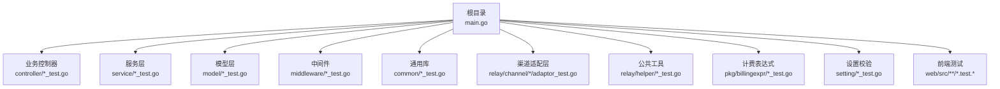
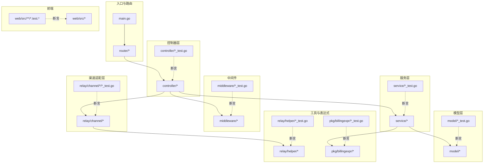
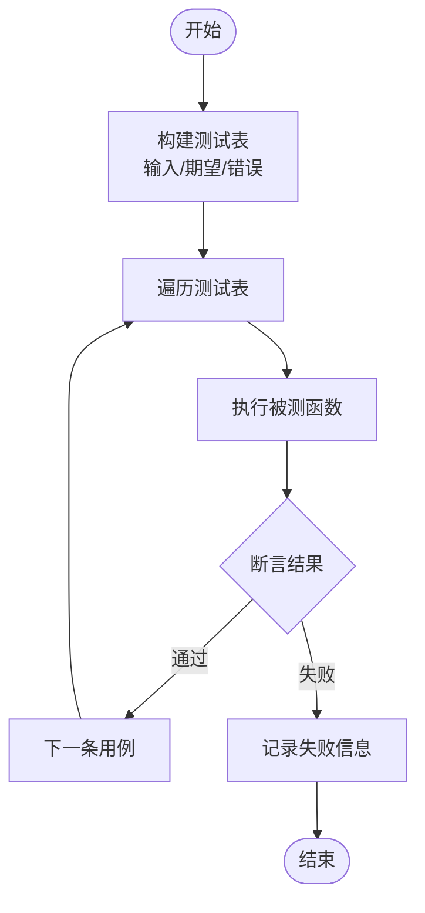
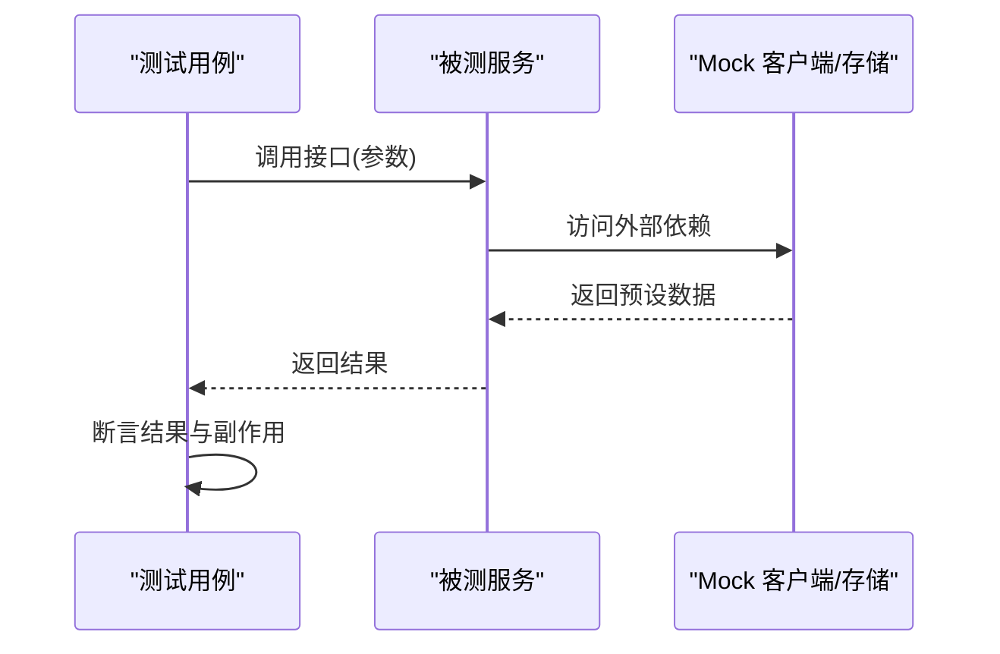
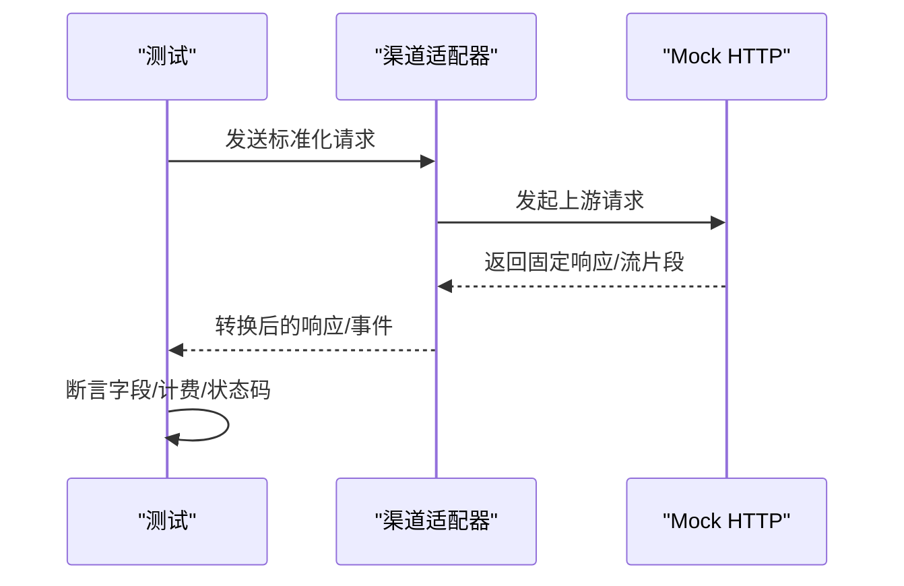
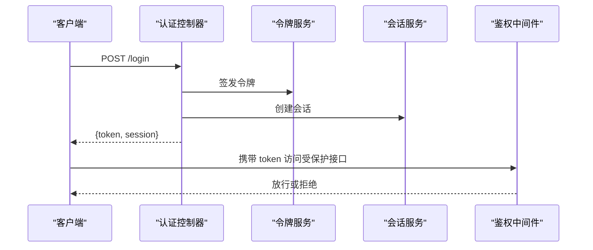
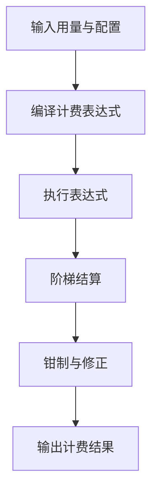
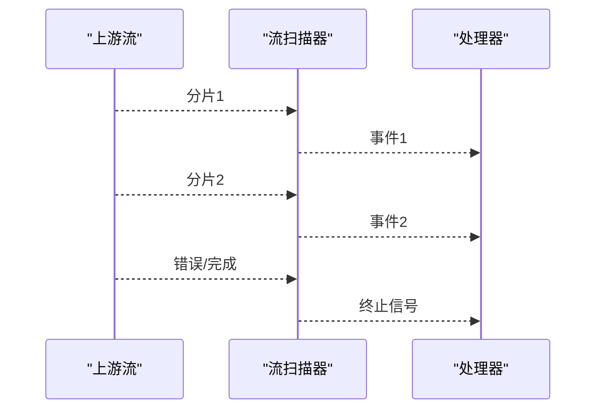
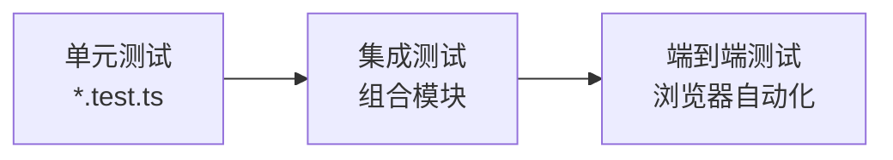
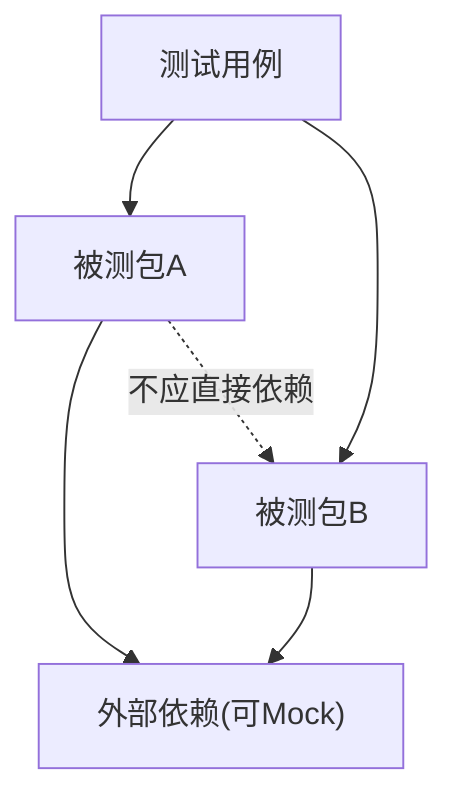

# 测试指南

<cite>
**本文档引用的文件**   
- [main.go](file://main.go)
- [go.mod](file://go.mod)
- [makefile](file://makefile)
- [common/email_test.go](file://common/email_test.go)
- [common/json_test.go](file://common/json_test.go)
- [common/quota_math_test.go](file://common/quota_math_test.go)
- [common/ssrf_protection_test.go](file://common/ssrf_protection_test.go)
- [common/url_validator_test.go](file://common/url_validator_test.go)
- [common/user_session_test.go](file://common/user_session_test.go)
- [controller/auth_flow_test.go](file://controller/auth_flow_test.go)
- [controller/auth_session_test.go](file://controller/auth_session_test.go)
- [controller/channel_authz_test.go](file://controller/channel_authz_test.go)
- [controller/model_list_test.go](file://controller/model_list_test.go)
- [controller/model_owned_by_test.go](file://controller/model_owned_by_test.go)
- [controller/payment_webhook_availability_test.go](file://controller/payment_webhook_availability_test.go)
- [controller/return_path_test.go](file://controller/return_path_test.go)
- [controller/telegram_test.go](file://controller/telegram_test.go)
- [controller/theme_compat_test.go](file://controller/theme_compat_test.go)
- [controller/token_test.go](file://controller/token_test.go)
- [controller/topup_waffo_pancake_test.go](file://controller/topup_waffo_pancake_test.go)
- [controller/usedata_flow_test.go](file://controller/usedata_flow_test.go)
- [middleware/auth_origin_test.go](file://middleware/auth_origin_test.go)
- [middleware/auth_test.go](file://middleware/auth_test.go)
- [middleware/header_nav_test.go](file://middleware/header_nav_test.go)
- [middleware/model_rate_limit_test.go](file://middleware/model_rate_limit_test.go)
- [middleware/rate_limit_test.go](file://middleware/rate_limit_test.go)
- [model/auth_flow_test.go](file://model/auth_flow_test.go)
- [model/clickhouse_log_test.go](file://model/clickhouse_log_test.go)
- [model/log_format_test.go](file://model/log_format_test.go)
- [model/model_owner_test.go](file://model/model_owner_test.go)
- [model/payment_method_guard_test.go](file://model/payment_method_guard_test.go)
- [model/pricing_endpoint_test.go](file://model/pricing_endpoint_test.go)
- [model/redemption_test.go](file://model/redemption_test.go)
- [model/system_task_test.go](file://model/system_task_test.go)
- [model/task_cas_test.go](file://model/task_cas_test.go)
- [model/user_authentication_test.go](file://model/user_authentication_test.go)
- [model/user_cache_auth_version_test.go](file://model/user_cache_auth_version_test.go)
- [model/user_pagination_test.go](file://model/user_pagination_test.go)
- [model/user_session_migration_test.go](file://model/user_session_migration_test.go)
- [model/user_update_test.go](file://model/user_update_test.go)
- [pkg/billingexpr/billingexpr_test.go](file://pkg/billingexpr/billingexpr_test.go)
- [pkg/billingexpr/settle_clamp_test.go](file://pkg/billingexpr/settle_clamp_test.go)
- [relay/channel/advancedcustom/adaptor_test.go](file://relay/channel/advancedcustom/adaptor_test.go)
- [relay/channel/aws/relay_aws_test.go](file://relay/channel/aws/relay_aws_test.go)
- [relay/channel/claude/message_delta_usage_patch_test.go](file://relay/channel/claude/message_delta_usage_patch_test.go)
- [relay/channel/claude/relay_claude_test.go](file://relay/channel/claude/relay_claude_test.go)
- [relay/channel/gemini/adaptor_responses_test.go](file://relay/channel/gemini/adaptor_responses_test.go)
- [relay/channel/gemini/relay_gemini_usage_test.go](file://relay/channel/gemini/relay_gemini_usage_test.go)
- [relay/channel/gemini/relay_responses_test.go](file://relay/channel/gemini/relay_responses_test.go)
- [relay/channel/minimax/adaptor_test.go](file://relay/channel/minimax/adaptor_test.go)
- [relay/channel/moonshot/adaptor_test.go](file://relay/channel/moonshot/adaptor_test.go)
- [relay/channel/ollama/stream_test.go](file://relay/channel/ollama/stream_test.go)
- [relay/channel/openai/chat_via_responses_test.go](file://relay/channel/openai/chat_via_responses_test.go)
- [relay/channel/openai/image_stream_test.go](file://relay/channel/openai/image_stream_test.go)
- [relay/common/override_test.go](file://relay/common/override_test.go)
- [relay/common/relay_info_test.go](file://relay/common/relay_info_test.go)
- [relay/common/stream_status_test.go](file://relay/common/stream_status_test.go)
- [relay/helper/billing_expr_request_test.go](file://relay/helper/billing_expr_request_test.go)
- [relay/helper/max_tokens_bounds_test.go](file://relay/helper/max_tokens_bounds_test.go)
- [relay/helper/openai_image_request_test.go](file://relay/helper/openai_image_request_test.go)
- [relay/helper/price_test.go](file://relay/helper/price_test.go)
- [relay/helper/stream_scanner_test.go](file://relay/helper/stream_scanner_test.go)
- [relay/chat_completions_via_responses_test.go](file://relay/chat_completions_via_responses_test.go)
- [service/auth_session_test.go](file://service/auth_session_test.go)
- [service/auth_token_test.go](file://service/auth_token_test.go)
- [service/channel_affinity_template_test.go](file://service/channel_affinity_template_test.go)
- [service/channel_affinity_usage_cache_test.go](file://service/channel_affinity_usage_cache_test.go)
- [service/protected_fetch_client_test.go](file://service/protected_fetch_client_test.go)
- [service/quota_saturation_test.go](file://service/quota_saturation_test.go)
- [service/return_path_test.go](file://service/return_path_test.go)
- [service/system_task_test.go](file://service/system_task_test.go)
- [service/task_billing_test.go](file://service/task_billing_test.go)
- [service/task_polling_test.go](file://service/task_polling_test.go)
- [service/text_quota_test.go](file://service/text_quota_test.go)
- [service/tiered_settle_test.go](file://service/tiered_settle_test.go)
- [setting/model_setting/claude_test.go](file://setting/model_setting/claude_test.go)
- [setting/operation_setting/monitor_setting_test.go](file://setting/operation_setting/monitor_setting_test.go)
- [setting/operation_setting/status_code_ranges_test.go](file://setting/operation_setting/status_code_ranges_test.go)
- [web/src/lib/auth-session.test.ts](file://web/src/lib/auth-session.test.ts)
- [web/src/lib/legacy-route.test.ts](file://web/src/lib/legacy-route.test.ts)
- [web/src/lib/server-error-message.test.ts](file://web/src/lib/server-error-message.test.ts)
</cite>

## 目录
1. [简介](#简介)
2. [项目结构](#项目结构)
3. [核心组件](#核心组件)
4. [架构总览](#架构总览)
5. [详细组件分析](#详细组件分析)
6. [依赖分析](#依赖分析)
7. [性能考虑](#性能考虑)
8. [故障排查指南](#故障排查指南)
9. [结论](#结论)
10. [附录](#附录)

## 简介
本测试指南面向新加入的开发者与质量保障工程师，系统化阐述项目的测试策略、框架选择与实践规范。内容覆盖：
- Go 后端测试：testing 包使用、Table-driven tests 模式、Mock 数据生成、并发与流式响应测试、覆盖率要求与报告生成。
- 前端测试：单元测试、集成测试与端到端测试的组织方式与最佳实践。
- 渠道适配器测试：如何模拟 HTTP 请求与响应，验证适配层正确性。
- 性能与压力测试：方法、工具与指标采集。
- 复杂场景示例：认证流程、计费逻辑、流式响应等。
- 测试数据准备与管理策略：固定种子、工厂函数、隔离与清理。

## 项目结构
本项目采用“按功能域分层 + 测试就近放置”的组织方式：
- Go 代码位于根目录与各业务子目录（如 controller、service、model、relay、middleware、pkg、setting 等），每个包内以 _test.go 结尾的文件存放对应单元测试。
- 前端代码位于 web 目录，测试文件以 .test.ts/.test.tsx 命名，遵循 React/TypeScript 生态常用约定。
- 构建与脚本集中在 makefile 与 bin 目录中，便于统一执行测试与性能任务。

**章节来源**
- [main.go:1-20](file://main.go#L1-L20)
- [go.mod:1-20](file://go.mod#L1-L20)
- [makefile:1-40](file://makefile#L1-L40)

## 核心组件
- Go testing 包与 Table-driven tests
  - 广泛采用 table-driven 风格组织用例，提升可读性与可维护性。
  - 典型用例文件包括 common、controller、service、model、middleware、relay 等包的 *_test.go。
- Mock 数据与外部依赖隔离
  - 通过构造输入表、替换网络客户端或注入接口实现来隔离外部依赖（HTTP、数据库、缓存）。
  - 针对流式响应与长连接场景，使用通道与扫描器进行断言。
- 覆盖率与报告
  - 使用 go test -coverprofile 生成覆盖率数据，结合 go tool cover 输出 HTML 报告。
  - 建议在 CI 中强制最低覆盖率阈值并归档报告。

**章节来源**
- [common/email_test.go:1-50](file://common/email_test.go#L1-L50)
- [common/json_test.go:1-50](file://common/json_test.go#L1-L50)
- [common/quota_math_test.go:1-50](file://common/quota_math_test.go#L1-L50)
- [common/ssrf_protection_test.go:1-50](file://common/ssrf_protection_test.go#L1-L50)
- [common/url_validator_test.go:1-50](file://common/url_validator_test.go#L1-L50)
- [common/user_session_test.go:1-50](file://common/user_session_test.go#L1-L50)

## 架构总览
下图展示从请求进入路由到各层处理与测试切入点的整体视图，标注了关键测试位置。

**图表来源**
- [main.go:1-20](file://main.go#L1-L20)
- [controller/auth_flow_test.go:1-50](file://controller/auth_flow_test.go#L1-L50)
- [service/auth_session_test.go:1-50](file://service/auth_session_test.go#L1-L50)
- [model/auth_flow_test.go:1-50](file://model/auth_flow_test.go#L1-L50)
- [middleware/auth_test.go:1-50](file://middleware/auth_test.go#L1-L50)
- [relay/channel/claude/relay_claude_test.go:1-50](file://relay/channel/claude/relay_claude_test.go#L1-L50)
- [relay/helper/stream_scanner_test.go:1-50](file://relay/helper/stream_scanner_test.go#L1-L50)
- [web/src/lib/auth-session.test.ts:1-50](file://web/src/lib/auth-session.test.ts#L1-L50)

## 详细组件分析

### Go 测试策略与 Table-driven Tests
- 设计要点
  - 将输入、期望输出、错误分支组织为表格项，避免重复样板代码。
  - 对边界条件、异常路径与并发场景分别列条目，确保充分覆盖。
- 适用场景
  - JSON 编解码、配额计算、URL 校验、SSRF 防护、用户会话管理等纯函数或无副作用逻辑。
- 参考实现
  - 常见于 common 与 relay/helper 下的 *_test.go。

**章节来源**
- [common/json_test.go:1-50](file://common/json_test.go#L1-L50)
- [common/quota_math_test.go:1-50](file://common/quota_math_test.go#L1-L50)
- [common/url_validator_test.go:1-50](file://common/url_validator_test.go#L1-L50)
- [relay/helper/price_test.go:1-50](file://relay/helper/price_test.go#L1-L50)

### Mock 数据生成与外部依赖隔离
- 策略
  - 使用工厂函数生成稳定、可复用的测试数据。
  - 对外部 HTTP、数据库、缓存等依赖，通过接口抽象与替换实现进行隔离。
- 典型用例
  - service/protected_fetch_client_test.go 用于隔离网络请求；
  - model 与 service 中的 *_test.go 常通过内存存储或空实现替代真实依赖。

**章节来源**
- [service/protected_fetch_client_test.go:1-50](file://service/protected_fetch_client_test.go#L1-L50)
- [model/user_session_migration_test.go:1-50](file://model/user_session_migration_test.go#L1-L50)

### 渠道适配器测试（模拟 HTTP 请求与响应）
- 目标
  - 验证不同渠道（OpenAI、Claude、Gemini、AWS 等）的请求转换、响应解析、计费统计与流式处理。
- 方法
  - 使用 httptest 或自定义 Transport 拦截 HTTP 请求，返回固定响应体。
  - 对 SSE/流式响应，使用通道与扫描器逐步消费并断言片段。
- 参考实现
  - relay/channel/*/adaptor_test.go 与 *_test.go。

**章节来源**
- [relay/channel/claude/relay_claude_test.go:1-50](file://relay/channel/claude/relay_claude_test.go#L1-L50)
- [relay/channel/gemini/relay_responses_test.go:1-50](file://relay/channel/gemini/relay_responses_test.go#L1-L50)
- [relay/channel/openai/image_stream_test.go:1-50](file://relay/channel/openai/image_stream_test.go#L1-L50)
- [relay/channel/ollama/stream_test.go:1-50](file://relay/channel/ollama/stream_test.go#L1-L50)

### 认证流程测试（含会话与令牌）
- 关注点
  - 登录鉴权、会话创建与续期、令牌签发与校验、权限控制。
- 方法
  - 构造用户与角色数据，模拟登录请求，断言返回的会话/令牌及后续受保护接口的访问行为。
- 参考实现
  - controller/auth_*_test.go、service/auth_*_test.go、model/auth_flow_test.go、middleware/auth_test.go。

**章节来源**
- [controller/auth_flow_test.go:1-50](file://controller/auth_flow_test.go#L1-L50)
- [controller/auth_session_test.go:1-50](file://controller/auth_session_test.go#L1-L50)
- [service/auth_session_test.go:1-50](file://service/auth_session_test.go#L1-L50)
- [service/auth_token_test.go:1-50](file://service/auth_token_test.go#L1-L50)
- [model/auth_flow_test.go:1-50](file://model/auth_flow_test.go#L1-L50)
- [middleware/auth_test.go:1-50](file://middleware/auth_test.go#L1-L50)

### 计费逻辑测试（表达式与结算）
- 关注点
  - 计费表达式编译与执行、阶梯结算、钳制规则、用量统计。
- 方法
  - 构造多组用量与价格配置，断言最终计费结果与边界情况。
- 参考实现
  - pkg/billingexpr/*_test.go、relay/helper/billing_expr_request_test.go、service/tiered_settle_test.go。

**章节来源**
- [pkg/billingexpr/billingexpr_test.go:1-50](file://pkg/billingexpr/billingexpr_test.go#L1-L50)
- [pkg/billingexpr/settle_clamp_test.go:1-50](file://pkg/billingexpr/settle_clamp_test.go#L1-L50)
- [relay/helper/billing_expr_request_test.go:1-50](file://relay/helper/billing_expr_request_test.go#L1-L50)
- [service/tiered_settle_test.go:1-50](file://service/tiered_settle_test.go#L1-L50)

### 流式响应测试（SSE/分块）
- 关注点
  - 分片到达顺序、增量解析、错误中断、资源释放。
- 方法
  - 使用通道模拟上游流式数据，断言下游消费到的事件序列与状态。
- 参考实现
  - relay/helper/stream_scanner_test.go、relay/channel/openai/image_stream_test.go、relay/channel/ollama/stream_test.go。

**章节来源**
- [relay/helper/stream_scanner_test.go:1-50](file://relay/helper/stream_scanner_test.go#L1-L50)
- [relay/channel/openai/image_stream_test.go:1-50](file://relay/channel/openai/image_stream_test.go#L1-L50)
- [relay/channel/ollama/stream_test.go:1-50](file://relay/channel/ollama/stream_test.go#L1-L50)

### 前端测试（单元、集成、端到端）
- 单元测试
  - 针对 hooks、工具函数、状态管理进行断言，使用 Jest/Vitest 等框架。
- 集成测试
  - 组合多个模块交互，必要时 mock API 与服务端行为。
- 端到端测试
  - 使用 Playwright/Cypress 等浏览器自动化框架，模拟用户操作与页面流转。
- 参考实现
  - web/src/lib/*.test.ts。

**章节来源**
- [web/src/lib/auth-session.test.ts:1-50](file://web/src/lib/auth-session.test.ts#L1-L50)
- [web/src/lib/legacy-route.test.ts:1-50](file://web/src/lib/legacy-route.test.ts#L1-L50)
- [web/src/lib/server-error-message.test.ts:1-50](file://web/src/lib/server-error-message.test.ts#L1-L50)

## 依赖分析
- 测试间耦合
  - 尽量保持测试独立，避免共享全局状态；使用BeforeEach/AfterEach 或包级初始化/清理。
- 外部依赖
  - 通过接口与替换实现解耦，避免在测试中直接依赖网络、数据库、Redis 等。
- 循环依赖
  - 若出现循环依赖，应抽取公共接口或重构职责边界。

[本节为概念性说明，不直接分析具体文件]

## 性能考虑
- 基准测试
  - 使用 go test -bench 编写基准用例，评估热点路径性能。
- 压测工具
  - 使用 wrk、vegeta、k6 等对 API 进行压测，观察吞吐、延迟与错误率。
- 指标采集
  - 启用 pprof 与 perf_metrics，定位 CPU/内存瓶颈与慢查询。
- 建议
  - 在 CI 中运行关键路径的基准与轻量压测，设定回归阈值。

[本节为通用指导，不直接分析具体文件]

## 故障排查指南
- 常见问题
  - 并发竞态：增加等待与重试，使用同步原语保证顺序。
  - 外部依赖不稳定：加强 Mock 健壮性，区分超时与业务错误。
  - 流式数据丢失：检查缓冲与通道关闭时机。
- 调试技巧
  - 打印上下文与关键变量，使用日志级别控制。
  - 借助 pprof 快照与火焰图定位热点。

**章节来源**
- [common/ssrf_protection_test.go:1-50](file://common/ssrf_protection_test.go#L1-L50)
- [relay/helper/stream_scanner_test.go:1-50](file://relay/helper/stream_scanner_test.go#L1-L50)

## 结论
本项目已建立完善的 Go 与前端测试体系，覆盖单元测试、集成测试与端到端测试，并通过 Table-driven tests、Mock 数据与流式扫描器等手段保障质量。建议持续完善覆盖率门槛、引入基准与压测流水线，并在变更时强化回归测试，确保系统稳定性与性能。

[本节为总结性内容，不直接分析具体文件]

## 附录

### 覆盖率要求与报告生成
- 命令建议
  - go test ./... -coverprofile=coverage.out
  - go tool cover -html=coverage.out -o coverage.html
- CI 集成
  - 设置最低覆盖率阈值，失败则阻断合并。
  - 归档 HTML 报告供审查。

[本节为通用指导，不直接分析具体文件]

### 测试数据准备与管理策略
- 固定种子与工厂函数
  - 为实体对象提供 NewXxxFactory 函数，集中生成一致数据。
- 隔离与清理
  - 每个测试用例独立数据空间，结束后清理临时数据。
- 外部数据
  - 使用 fixtures 文件或内存数据库，避免强依赖外部环境。

[本节为通用指导，不直接分析具体文件]

### 复杂场景示例清单（路径指引）
- 认证流程
  - [controller/auth_flow_test.go:1-50](file://controller/auth_flow_test.go#L1-L50)
  - [service/auth_session_test.go:1-50](file://service/auth_session_test.go#L1-L50)
  - [middleware/auth_test.go:1-50](file://middleware/auth_test.go#L1-L50)
- 计费逻辑
  - [pkg/billingexpr/billingexpr_test.go:1-50](file://pkg/billingexpr/billingexpr_test.go#L1-L50)
  - [service/tiered_settle_test.go:1-50](file://service/tiered_settle_test.go#L1-L50)
- 流式响应
  - [relay/helper/stream_scanner_test.go:1-50](file://relay/helper/stream_scanner_test.go#L1-L50)
  - [relay/channel/openai/image_stream_test.go:1-50](file://relay/channel/openai/image_stream_test.go#L1-L50)
  - [relay/channel/ollama/stream_test.go:1-50](file://relay/channel/ollama/stream_test.go#L1-L50)