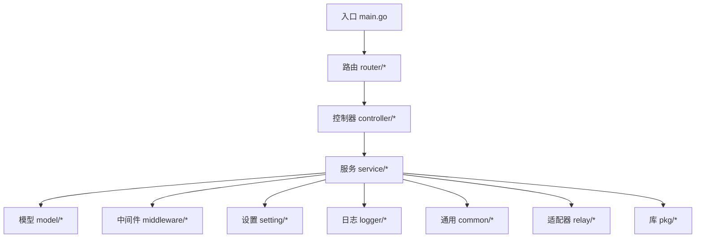
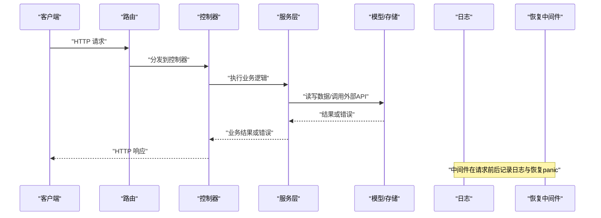
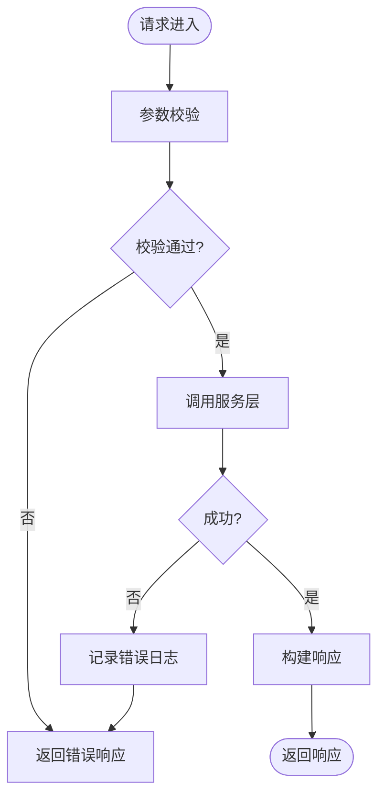
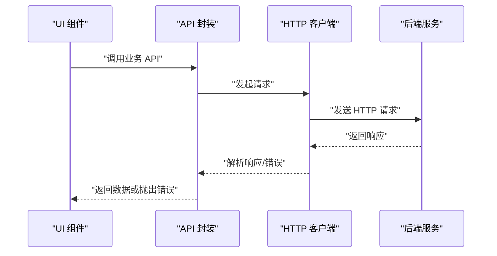
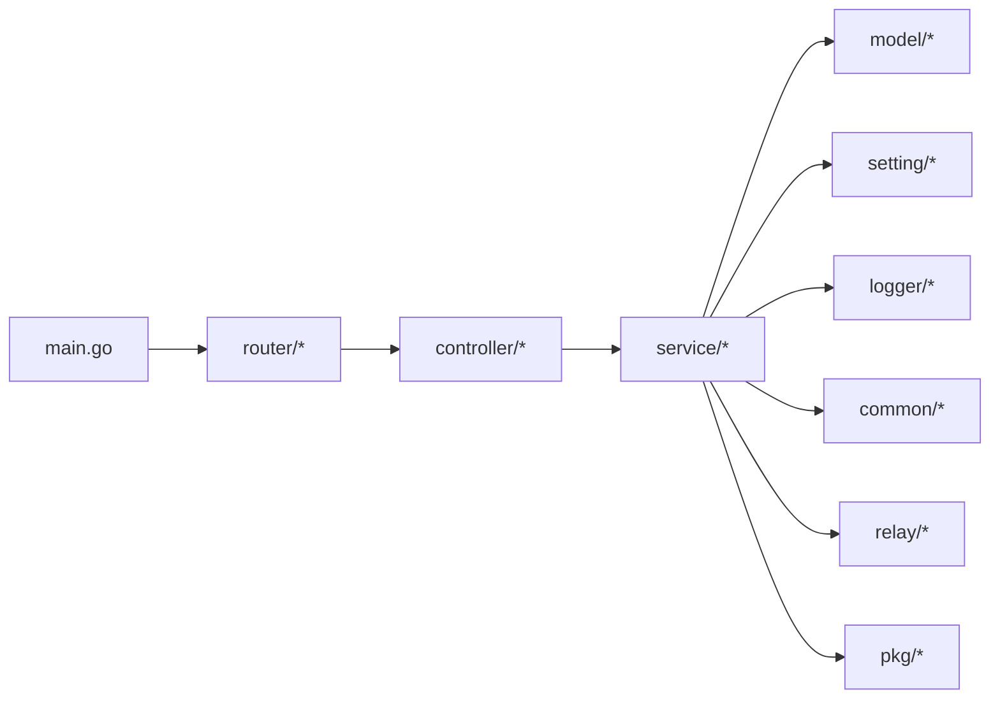

# 编码规范

<cite>
**本文引用的文件**   
- [main.go](file://main.go)
- [go.mod](file://go.mod)
- [.github/PULL_REQUEST_TEMPLATE.md](file://.github/PULL_REQUEST_TEMPLATE.md)
- [.github/CODE_OF_CONDUCT.md](file://.github/CODE_OF_CONDUCT.md)
- [.github/SECURITY.md](file://.github/SECURITY.md)
- [web/.oxfmtrc.json](file://web/.oxfmtrc.json)
- [web/.oxlintrc.json](file://web/.oxlintrc.json)
- [web/package.json](file://web/package.json)
- [web/rsbuild.config.ts](file://web/rsbuild.config.ts)
- [web/tsconfig.app.json](file://web/tsconfig.app.json)
- [web/tsconfig.node.json](file://web/tsconfig.node.json)
- [web/src/lib/http-client.ts](file://web/src/lib/http-client.ts)
- [web/src/lib/api.ts](file://web/src/lib/api.ts)
- [logger/logger.go](file://logger/logger.go)
- [setting/config/config.go](file://setting/config/config.go)
- [common/init.go](file://common/init.go)
- [middleware/recover.go](file://middleware/recover.go)
- [model/errors.go](file://model/errors.go)
- [types/error.go](file://types/error.go)
- [service/error.go](file://service/error.go)
- [router/main.go](file://router/main.go)
- [router/api-router.go](file://router/api-router.go)
- [relay/relay_adaptor.go](file://relay/relay_adaptor.go)
- [relay/common/relay_info.go](file://relay/common/relay_info.go)
- [pkg/ionet/client.go](file://pkg/ionet/client.go)
</cite>

## 目录
1. [简介](#简介)
2. [项目结构](#项目结构)
3. [核心组件](#核心组件)
4. [架构总览](#架构总览)
5. [详细组件分析](#详细组件分析)
6. [依赖分析](#依赖分析)
7. [性能考虑](#性能考虑)
8. [故障排查指南](#故障排查指南)
9. [结论](#结论)
10. [附录](#附录)

## 简介
本编码规范面向 Go 后端与 TypeScript/React 前端，覆盖代码风格、命名约定、文件组织、包结构最佳实践、错误处理、日志记录、配置管理、格式化与检查工具（gofmt、oxfmt、oxlint）、Git 工作流、分支策略、提交信息格式以及代码审查流程。目标是统一团队开发风格、提升可维护性与协作效率。

## 项目结构
本项目采用分层与按功能域结合的目录组织方式：
- Go 后端
  - main.go：应用入口与启动编排
  - router/*：路由定义与分组
  - controller/*：HTTP 控制器（请求解析、参数校验、调用服务层）
  - service/*：业务逻辑与服务编排
  - model/*：数据模型与持久化相关
  - middleware/*：中间件（鉴权、限流、日志、恢复等）
  - common/*：通用工具与基础设施
  - setting/*：配置结构与加载
  - logger/*：日志封装
  - relay/*：第三方 API 适配与转发
  - pkg/*：可复用库
- 前端 web
  - src/features/*：按业务域划分的特性模块
  - src/components/*：UI 组件
  - src/hooks/*：自定义 Hook
  - src/lib/*：工具与 HTTP 客户端封装
  - .oxfmtrc.json / .oxlintrc.json：格式化与静态检查配置
  - rsbuild.config.ts：构建配置
  - tsconfig.*：TypeScript 编译选项

**图示来源** 
- [main.go:1-200](file://main.go#L1-L200)
- [router/main.go:1-200](file://router/main.go#L1-L200)

**章节来源**
- [main.go:1-200](file://main.go#L1-L200)
- [router/main.go:1-200](file://router/main.go#L1-L200)

## 核心组件
- 应用启动与初始化
  - 入口负责加载配置、初始化日志、注册路由、启动服务
  - 初始化顺序应保证配置先于任何依赖配置的组件
- 路由与控制器
  - 路由按功能域拆分，控制器仅做入参解析、鉴权、调用服务层并返回响应
- 服务层
  - 承载核心业务逻辑，协调模型、外部依赖与缓存
- 模型与错误
  - 模型定义数据结构与数据库映射；错误类型集中定义便于统一处理
- 中间件
  - 横切关注点：鉴权、限流、请求 ID、恢复 panic、日志、CORS 等
- 配置与日志
  - 配置通过 setting/* 统一管理；日志通过 logger/* 统一输出

**章节来源**
- [main.go:1-200](file://main.go#L1-L200)
- [router/main.go:1-200](file://router/main.go#L1-L200)
- [setting/config/config.go:1-200](file://setting/config/config.go#L1-L200)
- [logger/logger.go:1-200](file://logger/logger.go#L1-L200)
- [model/errors.go:1-200](file://model/errors.go#L1-L200)
- [types/error.go:1-200](file://types/error.go#L1-L200)
- [service/error.go:1-200](file://service/error.go#L1-L200)

## 架构总览
下图展示一次典型请求从进入路由到返回响应的关键路径，以及错误与日志的贯穿点。

**图示来源** 
- [router/api-router.go:1-200](file://router/api-router.go#L1-L200)
- [controller/*.go:1-200](file://controller/channel.go#L1-L200)
- [service/*.go:1-200](file://service/channel.go#L1-L200)
- [model/*.go:1-200](file://model/channel.go#L1-L200)
- [middleware/recover.go:1-200](file://middleware/recover.go#L1-L200)
- [logger/logger.go:1-200](file://logger/logger.go#L1-L200)

## 详细组件分析

### Go 后端编码规范
- 命名约定
  - 包名：小写、简短、无下划线，避免与标准库冲突
  - 文件名：语义化，一个文件聚焦单一职责
  - 变量与函数：驼峰命名，导出首字母大写，私有首字母小写
  - 常量：全大写加下划线分隔
  - 接口：以行为描述命名（如 Reader、Closer），单方法接口建议以 er 结尾
- 文件组织
  - 每个包内文件不超过 300 行，复杂逻辑拆分为子包
  - 测试文件与源文件同名并以 _test.go 结尾
  - 公共 API 与内部实现分离，使用 unexported 文件隔离
- 包结构最佳实践
  - 按领域划分包（如 billing、channel、auth）
  - 避免循环依赖，必要时引入接口抽象
  - 将共享工具放入 common 或 pkg
- 错误处理
  - 使用 types/error.go 与 model/errors.go 统一定义错误类型
  - 服务层返回 error，控制器将其转换为 HTTP 状态码与消息
  - 禁止吞掉错误，必须记录上下文信息
- 日志记录
  - 通过 logger/logger.go 统一输出结构化日志
  - 关键路径埋点：请求开始/结束、外部调用耗时、错误堆栈
- 配置管理
  - 使用 setting/config/config.go 集中管理配置项
  - 环境变量与配置文件优先级明确，提供默认值与校验
- 并发与资源
  - goroutine 生命周期需可控，避免泄漏
  - 外部连接池（HTTP、DB、Redis）统一管理与超时控制

**章节来源**
- [types/error.go:1-200](file://types/error.go#L1-L200)
- [model/errors.go:1-200](file://model/errors.go#L1-L200)
- [service/error.go:1-200](file://service/error.go#L1-L200)
- [logger/logger.go:1-200](file://logger/logger.go#L1-L200)
- [setting/config/config.go:1-200](file://setting/config/config.go#L1-L200)
- [common/init.go:1-200](file://common/init.go#L1-L200)

### TypeScript/React 前端编码规范
- 组件设计模式
  - 按 features 划分业务域，components 存放通用 UI 组件
  - 组件职责单一，尽量纯函数式，副作用通过 hooks 管理
  - 使用组合优于继承，避免深层嵌套
- 状态管理
  - 优先使用 React 内置状态与 Context，复杂全局状态使用轻量方案
  - 服务端状态通过 API 层获取与缓存，避免重复请求
- API 调用封装
  - 统一通过 lib/http-client.ts 发起请求，集中处理错误与重试
  - 业务 API 集中在 lib/api.ts，保持调用点清晰
- 类型与校验
  - 严格启用 TypeScript 严格模式，避免 any
  - 对外部输入进行运行时校验（如 zod 或自定义校验）
- 样式与主题
  - 使用 CSS-in-JS 或 Tailwind，避免内联样式滥用
  - 主题与颜色通过 tokens 统一管理

**章节来源**
- [web/src/lib/http-client.ts:1-200](file://web/src/lib/http-client.ts#L1-L200)
- [web/src/lib/api.ts:1-200](file://web/src/lib/api.ts#L1-L200)
- [web/tsconfig.app.json:1-200](file://web/tsconfig.app.json#L1-L200)
- [web/package.json:1-200](file://web/package.json#L1-L200)

### 代码格式化与检查规则
- Go 格式化
  - 使用 gofmt 强制格式化，提交前运行确保一致性
  - 推荐 IDE 集成自动格式化
- 前端格式化与检查
  - oxfmt：通过 web/.oxfmtrc.json 配置，统一代码风格
  - oxlint：通过 web/.oxlintrc.json 配置，静态检查潜在问题
  - 建议在 CI 中执行格式化与检查，失败则阻断合并

**章节来源**
- [web/.oxfmtrc.json:1-200](file://web/.oxfmtrc.json#L1-L200)
- [web/.oxlintrc.json:1-200](file://web/.oxlintrc.json#L1-L200)
- [web/package.json:1-200](file://web/package.json#L1-L200)

### Git 工作流与提交信息
- 分支策略
  - main：稳定发布分支
  - develop：集成开发分支
  - feature/*：功能分支
  - hotfix/*：紧急修复分支
  - release/*：预发布分支
- 提交信息格式
  - 遵循 Conventional Commits：type(scope): description
  - 常见类型：feat、fix、docs、style、refactor、perf、test、chore
- 代码审查流程
  - 所有变更需通过 Pull Request 审查
  - 至少一名 Maintainer 批准后方可合并
  - 自动化检查（格式化、测试、安全扫描）必须通过

**章节来源**
- [.github/PULL_REQUEST_TEMPLATE.md:1-200](file://.github/PULL_REQUEST_TEMPLATE.md#L1-L200)
- [.github/CODE_OF_CONDUCT.md:1-200](file://.github/CODE_OF_CONDUCT.md#L1-L200)
- [.github/SECURITY.md:1-200](file://.github/SECURITY.md#L1-L200)

### 错误处理与日志记录统一规范
- 错误类型
  - 使用 types/error.go 定义通用错误结构体
  - 业务错误在 model/errors.go 细化，服务层在 service/error.go 包装
- 日志规范
  - 使用 logger/logger.go 输出结构化日志，包含请求 ID、用户、耗时、错误码
  - 敏感信息脱敏，禁止打印密钥与密码
- 中间件恢复
  - middleware/recover.go 捕获 panic 并返回友好错误

**图示来源** 
- [types/error.go:1-200](file://types/error.go#L1-L200)
- [model/errors.go:1-200](file://model/errors.go#L1-L200)
- [service/error.go:1-200](file://service/error.go#L1-L200)
- [logger/logger.go:1-200](file://logger/logger.go#L1-L200)
- [middleware/recover.go:1-200](file://middleware/recover.go#L1-L200)

**章节来源**
- [types/error.go:1-200](file://types/error.go#L1-L200)
- [model/errors.go:1-200](file://model/errors.go#L1-L200)
- [service/error.go:1-200](file://service/error.go#L1-L200)
- [logger/logger.go:1-200](file://logger/logger.go#L1-L200)
- [middleware/recover.go:1-200](file://middleware/recover.go#L1-L200)

### 配置管理统一规范
- 配置来源优先级：命令行 > 环境变量 > 配置文件 > 默认值
- 配置项分类：系统、业务、第三方服务、性能调优
- 校验与文档：启动时校验必填项，生成配置文档供运维参考

**章节来源**
- [setting/config/config.go:1-200](file://setting/config/config.go#L1-L200)
- [common/init.go:1-200](file://common/init.go#L1-L200)

### 前端 API 调用封装与状态管理
- HTTP 客户端
  - 统一封装请求头、拦截器、错误处理、重试策略
- API 层
  - 按模块组织 API 函数，返回 Promise 或 async/await 结果
- 状态同步
  - 服务端状态与本地缓存一致，失效策略明确

**图示来源** 
- [web/src/lib/api.ts:1-200](file://web/src/lib/api.ts#L1-L200)
- [web/src/lib/http-client.ts:1-200](file://web/src/lib/http-client.ts#L1-L200)

**章节来源**
- [web/src/lib/api.ts:1-200](file://web/src/lib/api.ts#L1-L200)
- [web/src/lib/http-client.ts:1-200](file://web/src/lib/http-client.ts#L1-L200)

## 依赖分析
- Go 模块依赖
  - 通过 go.mod 管理版本，避免直接依赖不稳定的分支
  - 定期更新依赖并验证兼容性
- 前端依赖
  - package.json 锁定版本，CI 中安装依赖并执行构建与测试
- 内部依赖
  - 避免循环依赖，使用接口解耦
  - 公共能力下沉至 common 或 pkg

**图示来源** 
- [go.mod:1-200](file://go.mod#L1-L200)
- [main.go:1-200](file://main.go#L1-L200)

**章节来源**
- [go.mod:1-200](file://go.mod#L1-L200)
- [main.go:1-200](file://main.go#L1-L200)

## 性能考虑
- Go 后端
  - 合理使用 goroutine 与 channel，避免锁竞争
  - 外部调用设置超时与重试上限
  - 缓存热点数据，减少 DB 压力
- 前端
  - 组件懒加载与代码分割
  - 列表虚拟化与分页加载
  - 图片与静态资源 CDN 加速

[本节为通用指导，无需特定文件引用]

## 故障排查指南
- 常见问题定位
  - 查看日志中的错误码与堆栈，结合请求 ID 追踪
  - 检查中间件是否拦截或修改了请求
  - 确认配置项是否正确加载
- 调试技巧
  - 启用详细日志级别
  - 使用 pprof 分析 CPU/内存瓶颈
  - 前端开启网络面板与错误上报

**章节来源**
- [logger/logger.go:1-200](file://logger/logger.go#L1-L200)
- [middleware/recover.go:1-200](file://middleware/recover.go#L1-L200)
- [types/error.go:1-200](file://types/error.go#L1-L200)

## 结论
本规范覆盖了 Go 与 TypeScript/React 的核心编码约定、工程化配置、错误与日志统一、Git 工作流与审查流程。遵循这些规范可显著提升代码质量与团队协作效率。建议在新功能开发与重构中持续贯彻，并在 CI 中固化检查。

## 附录
- 示例与反模式
  - 正确示例：统一错误返回、结构化日志、配置校验
  - 反模式：吞掉错误、硬编码配置、深层嵌套组件、任意 any 类型
- 工具链
  - gofmt、oxfmt、oxlint 在提交前与 CI 中执行
  - 建议使用 IDE 插件自动格式化与提示

[本节为通用指导，无需特定文件引用]