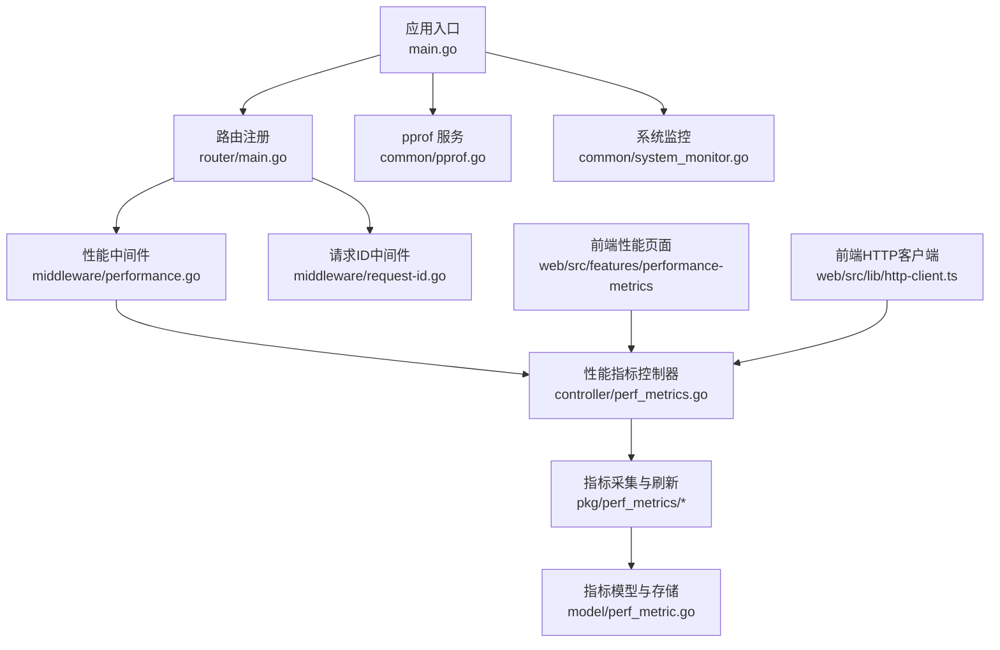
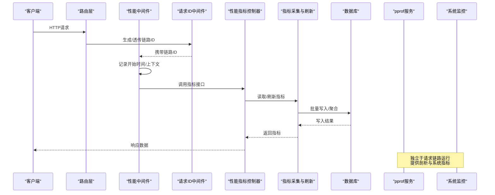
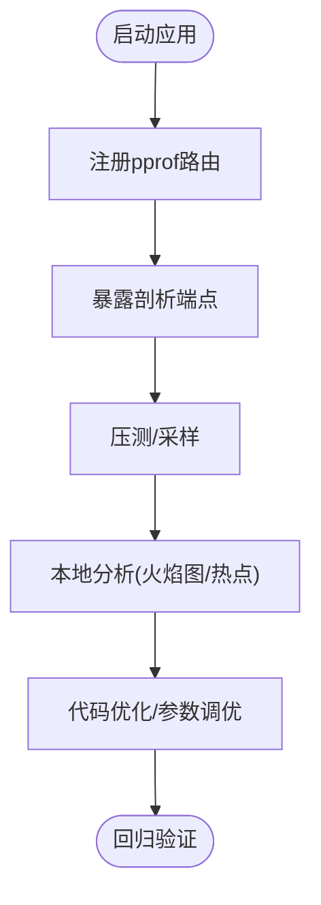
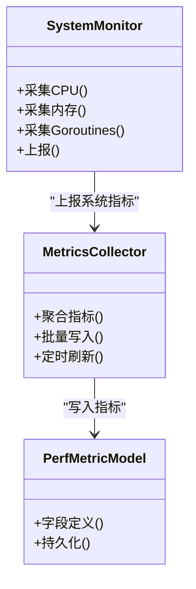
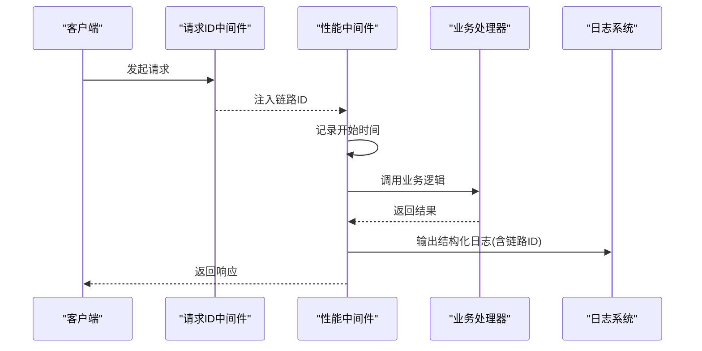
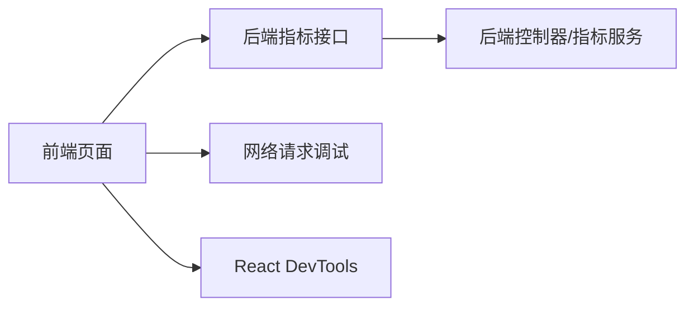
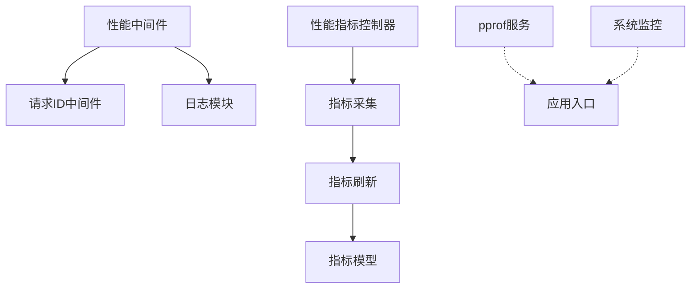

# 调试与性能分析

<cite>
**本文引用的文件**   
- [main.go](file://main.go)
- [common/pprof.go](file://common/pprof.go)
- [common/system_monitor.go](file://common/system_monitor.go)
- [common/performance_config.go](file://common/performance_config.go)
- [middleware/performance.go](file://middleware/performance.go)
- [controller/perf_metrics.go](file://controller/perf_metrics.go)
- [pkg/perf_metrics/metrics.go](file://pkg/perf_metrics/metrics.go)
- [pkg/perf_metrics/flush.go](file://pkg/perf_metrics/flush.go)
- [setting/perf_metrics_setting/config.go](file://setting/perf_metrics_setting/config.go)
- [logger/logger.go](file://logger/logger.go)
- [model/log.go](file://model/log.go)
- [model/perf_metric.go](file://model/perf_metric.go)
- [middleware/request-id.go](file://middleware/request-id.go)
- [router/main.go](file://router/main.go)
- [web/src/lib/http-client.ts](file://web/src/lib/http-client.ts)
- [web/src/features/performance-metrics/index.tsx](file://web/src/features/performance-metrics/index.tsx)
</cite>

## 目录
1. [简介](#简介)
2. [项目结构](#项目结构)
3. [核心组件](#核心组件)
4. [架构总览](#架构总览)
5. [详细组件分析](#详细组件分析)
6. [依赖关系分析](#依赖关系分析)
7. [性能注意事项](#性能注意事项)
8. [故障排查指南](#故障排查指南)
9. [结论](#结论)
10. [附录](#附录)

## 简介
本文件面向Go后端与前端（React）的调试与性能分析，覆盖pprof启用与解读、内存泄漏检测、CPU性能分析、分布式追踪与日志收集配置、结构化日志与链路追踪ID传递、前端调试技巧（React DevTools、网络请求调试、性能监控）、慢查询与数据库性能问题定位、常见瓶颈识别与优化方法、内存使用分析与GC调优策略，以及高并发与OOM等典型场景的实战案例。

## 项目结构
本项目在后端通过中间件与控制器暴露性能指标与系统监控能力，结合pprof提供运行时剖析；在Web前端提供性能指标页面与HTTP客户端封装，便于前端侧观测与调试。关键路径包括：
- 启动入口与路由注册
- pprof与系统监控初始化
- 性能指标采集与持久化
- 请求级链路追踪ID注入
- 前端性能监控页面与HTTP客户端

**图表来源** 
- [main.go:1-200](file://main.go#L1-L200)
- [router/main.go:1-200](file://router/main.go#L1-L200)
- [middleware/performance.go:1-200](file://middleware/performance.go#L1-L200)
- [controller/perf_metrics.go:1-200](file://controller/perf_metrics.go#L1-L200)
- [pkg/perf_metrics/metrics.go:1-200](file://pkg/perf_metrics/metrics.go#L1-L200)
- [pkg/perf_metrics/flush.go:1-200](file://pkg/perf_metrics/flush.go#L1-L200)
- [model/perf_metric.go:1-200](file://model/perf_metric.go#L1-L200)
- [common/pprof.go:1-200](file://common/pprof.go#L1-L200)
- [common/system_monitor.go:1-200](file://common/system_monitor.go#L1-L200)
- [middleware/request-id.go:1-200](file://middleware/request-id.go#L1-L200)
- [web/src/features/performance-metrics/index.tsx:1-200](file://web/src/features/performance-metrics/index.tsx#L1-L200)
- [web/src/lib/http-client.ts:1-200](file://web/src/lib/http-client.ts#L1-L200)

**章节来源**
- [main.go:1-200](file://main.go#L1-L200)
- [router/main.go:1-200](file://router/main.go#L1-L200)

## 核心组件
- pprof服务：提供标准pprof接口，支持CPU、内存、阻塞、互斥等剖析数据导出与分析。
- 系统监控：采集进程与系统级指标（如CPU、内存、goroutine数），用于快速定位资源异常。
- 性能中间件：记录请求耗时、状态码、错误信息，并注入链路追踪ID。
- 性能指标控制器：暴露指标查询与刷新接口，供前端展示与运维工具消费。
- 指标采集与刷新：周期性汇总与落库，避免高频写入影响主流程。
- 请求ID中间件：为每个请求生成唯一ID，贯穿日志与追踪链路。
- 前端性能页面：可视化展示后端指标与系统状态。
- 前端HTTP客户端：统一封装请求，便于附加追踪头与性能埋点。

**章节来源**
- [common/pprof.go:1-200](file://common/pprof.go#L1-L200)
- [common/system_monitor.go:1-200](file://common/system_monitor.go#L1-L200)
- [middleware/performance.go:1-200](file://middleware/performance.go#L1-L200)
- [controller/perf_metrics.go:1-200](file://controller/perf_metrics.go#L1-L200)
- [pkg/perf_metrics/metrics.go:1-200](file://pkg/perf_metrics/metrics.go#L1-L200)
- [pkg/perf_metrics/flush.go:1-200](file://pkg/perf_metrics/flush.go#L1-L200)
- [middleware/request-id.go:1-200](file://middleware/request-id.go#L1-L200)
- [web/src/features/performance-metrics/index.tsx:1-200](file://web/src/features/performance-metrics/index.tsx#L1-L200)
- [web/src/lib/http-client.ts:1-200](file://web/src/lib/http-client.ts#L1-L200)

## 架构总览
下图展示了从请求进入、链路追踪、性能采集到指标持久化的整体流程，以及pprof与系统监控的并行接入。

**图表来源** 
- [router/main.go:1-200](file://router/main.go#L1-L200)
- [middleware/request-id.go:1-200](file://middleware/request-id.go#L1-L200)
- [middleware/performance.go:1-200](file://middleware/performance.go#L1-L200)
- [controller/perf_metrics.go:1-200](file://controller/perf_metrics.go#L1-L200)
- [pkg/perf_metrics/metrics.go:1-200](file://pkg/perf_metrics/metrics.go#L1-L200)
- [pkg/perf_metrics/flush.go:1-200](file://pkg/perf_metrics/flush.go#L1-L200)
- [common/pprof.go:1-200](file://common/pprof.go#L1-L200)
- [common/system_monitor.go:1-200](file://common/system_monitor.go#L1-L200)

## 详细组件分析

### pprof启用与解读
- 启用方式：在应用启动时注册pprof路由，暴露标准剖析端点（如CPU、内存、阻塞、互斥）。
- 使用建议：
  - CPU剖析：压测后抓取profile，使用go tool pprof分析热点函数与调用栈。
  - 内存剖析：关注heap与allocs，定位未释放对象与频繁分配。
  - 阻塞与互斥：分析goroutine阻塞与锁竞争，优化同步策略。
- 安全提示：生产环境需限制访问或仅在内网可用。

**图表来源** 
- [common/pprof.go:1-200](file://common/pprof.go#L1-L200)
- [main.go:1-200](file://main.go#L1-L200)

**章节来源**
- [common/pprof.go:1-200](file://common/pprof.go#L1-L200)
- [main.go:1-200](file://main.go#L1-L200)

### 系统监控与指标采集
- 系统监控：采集进程与系统级指标（CPU、内存、goroutine数、句柄等），用于快速发现资源异常。
- 指标采集：周期性汇总业务指标（QPS、延迟分布、错误率），批量写入数据库，降低对主流程的影响。
- 刷新策略：采用批处理与异步刷新，避免阻塞请求路径。

**图表来源** 
- [common/system_monitor.go:1-200](file://common/system_monitor.go#L1-L200)
- [pkg/perf_metrics/metrics.go:1-200](file://pkg/perf_metrics/metrics.go#L1-L200)
- [pkg/perf_metrics/flush.go:1-200](file://pkg/perf_metrics/flush.go#L1-L200)
- [model/perf_metric.go:1-200](file://model/perf_metric.go#L1-L200)

**章节来源**
- [common/system_monitor.go:1-200](file://common/system_monitor.go#L1-L200)
- [pkg/perf_metrics/metrics.go:1-200](file://pkg/perf_metrics/metrics.go#L1-L200)
- [pkg/perf_metrics/flush.go:1-200](file://pkg/perf_metrics/flush.go#L1-L200)
- [model/perf_metric.go:1-200](file://model/perf_metric.go#L1-L200)

### 性能中间件与请求链路追踪
- 功能：记录请求耗时、状态码、错误信息，并在上下文中注入链路追踪ID。
- 链路追踪ID：由请求ID中间件生成，贯穿日志与追踪链路，便于跨服务关联。
- 最佳实践：将链路ID加入日志输出与响应头，方便前端与后端对齐问题。

**图表来源** 
- [middleware/request-id.go:1-200](file://middleware/request-id.go#L1-L200)
- [middleware/performance.go:1-200](file://middleware/performance.go#L1-L200)
- [logger/logger.go:1-200](file://logger/logger.go#L1-L200)

**章节来源**
- [middleware/request-id.go:1-200](file://middleware/request-id.go#L1-L200)
- [middleware/performance.go:1-200](file://middleware/performance.go#L1-L200)
- [logger/logger.go:1-200](file://logger/logger.go#L1-L200)

### 前端性能监控与HTTP客户端
- 前端性能页面：展示后端指标与系统状态，辅助定位问题。
- HTTP客户端：统一封装请求，可附加追踪头与埋点，便于前后端联动分析。
- 调试技巧：使用浏览器开发者工具观察网络请求、性能面板与React DevTools。

**图表来源** 
- [web/src/features/performance-metrics/index.tsx:1-200](file://web/src/features/performance-metrics/index.tsx#L1-L200)
- [web/src/lib/http-client.ts:1-200](file://web/src/lib/http-client.ts#L1-L200)
- [controller/perf_metrics.go:1-200](file://controller/perf_metrics.go#L1-L200)

**章节来源**
- [web/src/features/performance-metrics/index.tsx:1-200](file://web/src/features/performance-metrics/index.tsx#L1-L200)
- [web/src/lib/http-client.ts:1-200](file://web/src/lib/http-client.ts#L1-L200)
- [controller/perf_metrics.go:1-200](file://controller/perf_metrics.go#L1-L200)

## 依赖关系分析
- 中间件依赖：性能中间件依赖请求ID中间件以获取链路ID；日志模块依赖结构化输出。
- 控制器依赖：性能指标控制器依赖指标采集与刷新模块，间接依赖数据库模型。
- 外部依赖：pprof与系统监控作为独立服务运行，不阻塞主流程。

**图表来源** 
- [middleware/performance.go:1-200](file://middleware/performance.go#L1-L200)
- [middleware/request-id.go:1-200](file://middleware/request-id.go#L1-L200)
- [logger/logger.go:1-200](file://logger/logger.go#L1-L200)
- [controller/perf_metrics.go:1-200](file://controller/perf_metrics.go#L1-L200)
- [pkg/perf_metrics/metrics.go:1-200](file://pkg/perf_metrics/metrics.go#L1-L200)
- [pkg/perf_metrics/flush.go:1-200](file://pkg/perf_metrics/flush.go#L1-L200)
- [model/perf_metric.go:1-200](file://model/perf_metric.go#L1-L200)
- [common/pprof.go:1-200](file://common/pprof.go#L1-L200)
- [common/system_monitor.go:1-200](file://common/system_monitor.go#L1-L200)

**章节来源**
- [middleware/performance.go:1-200](file://middleware/performance.go#L1-L200)
- [controller/perf_metrics.go:1-200](file://controller/perf_metrics.go#L1-L200)
- [pkg/perf_metrics/metrics.go:1-200](file://pkg/perf_metrics/metrics.go#L1-L200)
- [pkg/perf_metrics/flush.go:1-200](file://pkg/perf_metrics/flush.go#L1-L200)
- [model/perf_metric.go:1-200](file://model/perf_metric.go#L1-L200)
- [common/pprof.go:1-200](file://common/pprof.go#L1-L200)
- [common/system_monitor.go:1-200](file://common/system_monitor.go#L1-L200)

## 性能注意事项
- 指标写入：采用批处理与异步刷新，避免阻塞请求路径；合理设置刷新周期与批次大小。
- 日志体积：控制日志级别与字段，避免过大日志影响I/O；结构化日志便于检索与聚合。
- pprof使用：仅在必要时开启，限制访问范围；采样期间避免长时间压测导致抖动。
- 数据库性能：关注慢查询与连接池，使用索引与分页优化；避免N+1查询。
- GC调优：根据内存峰值与GC停顿调整相关参数；关注堆增长趋势与对象生命周期。

[本节为通用指导，无需特定文件引用]

## 故障排查指南

### 高并发下性能问题排查
- 现象：QPS下降、延迟升高、错误率上升。
- 步骤：
  - 查看系统监控指标（CPU、内存、goroutine数）。
  - 使用pprof进行CPU与内存剖析，定位热点与内存泄漏。
  - 检查中间件记录的请求耗时与错误分布。
  - 分析数据库慢查询与连接池使用情况。
- 优化方向：减少锁竞争、优化SQL、增加缓存、调整并发度。

**章节来源**
- [common/system_monitor.go:1-200](file://common/system_monitor.go#L1-L200)
- [common/pprof.go:1-200](file://common/pprof.go#L1-L200)
- [middleware/performance.go:1-200](file://middleware/performance.go#L1-L200)

### 内存溢出（OOM）诊断
- 现象：进程被系统杀死、内存持续增长。
- 步骤：
  - 抓取heap profile，分析最大占用与增长趋势。
  - 检查大对象分配与未释放引用（如缓存、切片、map）。
  - 调整GC参数与内存上限，观察GC停顿与回收效果。
- 优化方向：减少临时对象分配、及时释放引用、使用对象池。

**章节来源**
- [common/pprof.go:1-200](file://common/pprof.go#L1-L200)
- [common/system_monitor.go:1-200](file://common/system_monitor.go#L1-L200)

### 慢查询与数据库性能问题
- 现象：接口延迟高、数据库CPU飙升。
- 步骤：
  - 启用慢查询日志，定位耗时SQL。
  - 分析执行计划，添加合适索引或改写SQL。
  - 检查连接池配置与事务粒度。
- 优化方向：索引优化、SQL改写、读写分离、缓存命中。

**章节来源**
- [model/log.go:1-200](file://model/log.go#L1-L200)
- [model/perf_metric.go:1-200](file://model/perf_metric.go#L1-L200)

### 前端调试技巧
- React DevTools：检查组件渲染次数与状态变化，定位重渲染问题。
- 网络请求调试：观察请求耗时、响应体与错误码，结合后端链路ID定位问题。
- 性能监控：使用浏览器性能面板分析加载与交互性能。

**章节来源**
- [web/src/features/performance-metrics/index.tsx:1-200](file://web/src/features/performance-metrics/index.tsx#L1-L200)
- [web/src/lib/http-client.ts:1-200](file://web/src/lib/http-client.ts#L1-L200)

## 结论
通过pprof、系统监控、性能中间件与前端工具的协同，可以高效定位与解决后端性能问题。建议在生产环境谨慎启用剖析功能，结合结构化日志与链路追踪ID，形成完整的可观测性体系。针对慢查询与内存问题，应建立常态化监控与优化机制，确保系统稳定与高性能。

[本节为总结，无需特定文件引用]

## 附录
- 常用命令与工具：go tool pprof、go tool trace、浏览器开发者工具、React DevTools。
- 配置文件参考：性能指标配置、监控设置、日志级别与输出格式。

[本节为补充说明，无需特定文件引用]