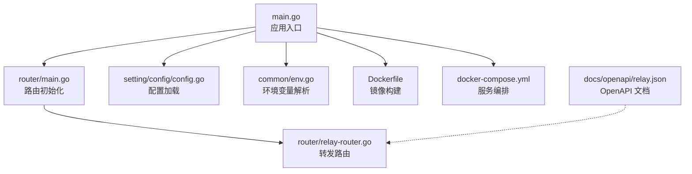
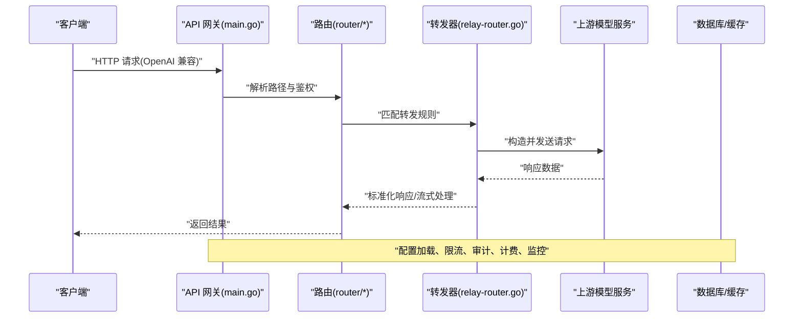
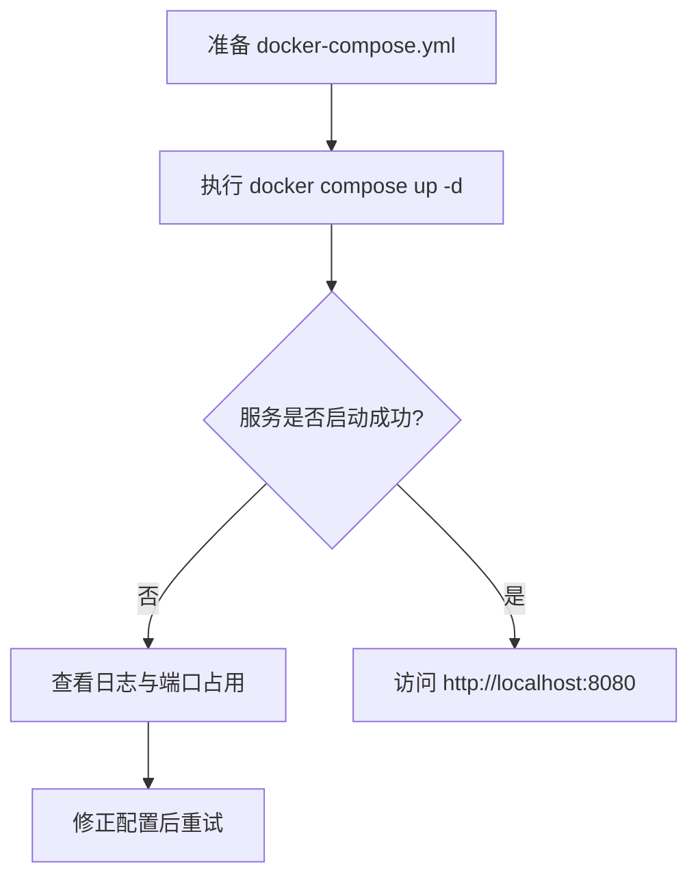
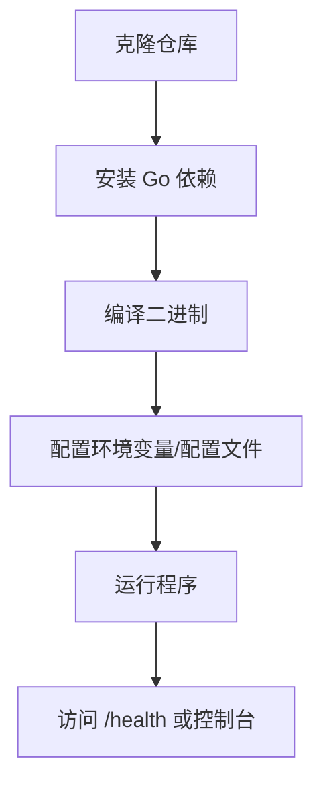
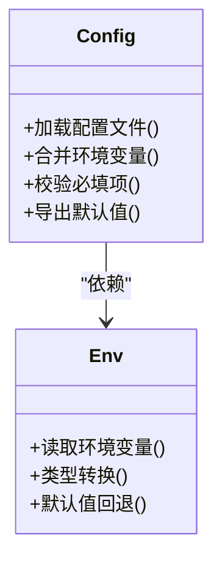
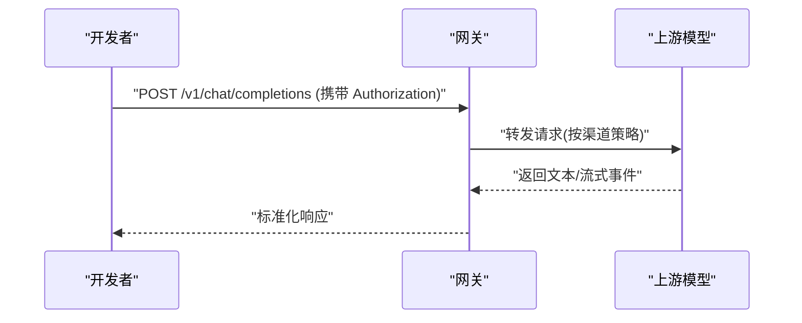
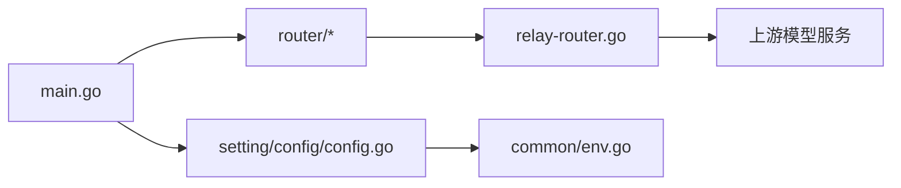

# 快速开始

<cite>
**本文引用的文件**   
- [README.zh_CN.md](file://README.zh_CN.md)
- [Dockerfile](file://Dockerfile)
- [docker-compose.yml](file://docker-compose.yml)
- [docker-compose.dev.yml](file://docker-compose.dev.yml)
- [main.go](file://main.go)
- [go.mod](file://go.mod)
- [setting/config/config.go](file://setting/config/config.go)
- [router/main.go](file://router/main.go)
- [relay/router/relay-router.go](file://router/relay-router.go)
- [controller/setup.go](file://controller/setup.go)
- [common/env.go](file://common/env.go)
- [docs/openapi/relay.json](file://docs/openapi/relay.json)
- [bin/time_test.sh](file://bin/time_test.sh)
</cite>

## 目录
1. [简介](#简介)
2. [项目结构](#项目结构)
3. [核心组件](#核心组件)
4. [架构总览](#架构总览)
5. [详细组件分析](#详细组件分析)
6. [依赖分析](#依赖分析)
7. [性能考虑](#性能考虑)
8. [故障排除指南](#故障排除指南)
9. [结论](#结论)
10. [附录](#附录)

## 简介
本指南面向首次接触该 AI API 网关的用户，目标是帮助你在最短时间内完成环境准备、安装部署（Docker 与源码编译）、基础配置，并完成第一个 API 调用测试。内容涵盖：
- 环境要求与前置条件
- Docker 一键部署步骤
- 源码编译与本地运行步骤
- 最小化配置说明与示例
- 首个 OpenAI 兼容接口调用示例
- 常见问题排查与优化建议

## 项目结构
仓库采用 Go 后端 + Web 前端（React）的混合工程组织方式，关键入口与配置分布如下：
- 应用入口与启动：main.go
- 路由注册与中间件：router/*
- 配置加载与环境变量：setting/config/config.go、common/env.go
- 容器化构建与编排：Dockerfile、docker-compose.yml、docker-compose.dev.yml
- 文档与 OpenAPI：docs/openapi/relay.json
- 辅助脚本：bin/time_test.sh

**图示来源** 
- [main.go:1-100](file://main.go#L1-L100)
- [router/main.go:1-120](file://router/main.go#L1-L120)
- [router/relay-router.go:1-120](file://router/relay-router.go#L1-L120)
- [setting/config/config.go:1-120](file://setting/config/config.go#L1-L120)
- [common/env.go:1-120](file://common/env.go#L1-L120)
- [Dockerfile:1-120](file://Dockerfile#L1-L120)
- [docker-compose.yml:1-120](file://docker-compose.yml#L1-L120)
- [docs/openapi/relay.json:1-120](file://docs/openapi/relay.json#L1-L120)

**章节来源**
- [README.zh_CN.md:1-200](file://README.zh_CN.md#L1-L200)
- [main.go:1-120](file://main.go#L1-L120)
- [router/main.go:1-120](file://router/main.go#L1-L120)
- [setting/config/config.go:1-120](file://setting/config/config.go#L1-L120)
- [common/env.go:1-120](file://common/env.go#L1-L120)
- [Dockerfile:1-120](file://Dockerfile#L1-L120)
- [docker-compose.yml:1-120](file://docker-compose.yml#L1-L120)
- [docs/openapi/relay.json:1-120](file://docs/openapi/relay.json#L1-L120)

## 核心组件
- 应用入口与生命周期管理：负责初始化配置、日志、数据库连接、缓存、定时任务与 HTTP 服务器。
- 路由与中间件：统一注册 REST API、OpenAI 兼容转发、鉴权、限流、审计等能力。
- 配置与环境：支持配置文件与环境变量双源注入，提供默认值与校验。
- 容器化与编排：提供生产与开发两套 compose 模板，便于快速拉起服务与依赖。
- OpenAPI 文档：提供标准 JSON Schema，便于客户端生成与调试。

**章节来源**
- [main.go:1-120](file://main.go#L1-L120)
- [router/main.go:1-120](file://router/main.go#L1-L120)
- [setting/config/config.go:1-120](file://setting/config/config.go#L1-L120)
- [common/env.go:1-120](file://common/env.go#L1-L120)
- [docs/openapi/relay.json:1-120](file://docs/openapi/relay.json#L1-L120)

## 架构总览
下图展示了从客户端请求到上游模型服务的整体流程，以及配置、鉴权、计费、日志等横切关注点。

**图示来源** 
- [main.go:1-120](file://main.go#L1-L120)
- [router/main.go:1-120](file://router/main.go#L1-L120)
- [router/relay-router.go:1-120](file://router/relay-router.go#L1-L120)

## 详细组件分析

### 环境要求与前置条件
- 操作系统：Linux/macOS/Windows（推荐 Linux）
- 运行时：
  - Docker 部署：Docker 与 docker-compose
  - 源码编译：Go 编译器（版本以 go.mod 为准）
- 端口：默认监听 8080（可通过环境变量或配置覆盖）
- 可选依赖：Redis（缓存/限流）、MySQL/PostgreSQL（持久化），可按需启用

**章节来源**
- [go.mod:1-60](file://go.mod#L1-L60)
- [common/env.go:1-120](file://common/env.go#L1-L120)

### Docker 部署（推荐）
- 使用官方镜像或自行构建镜像
- 通过 docker-compose 拉起服务与依赖（数据库、缓存等）
- 常用命令：
  - 构建镜像：参考 Dockerfile
  - 启动服务：参考 docker-compose.yml
  - 开发模式：参考 docker-compose.dev.yml

**图示来源** 
- [Dockerfile:1-120](file://Dockerfile#L1-L120)
- [docker-compose.yml:1-120](file://docker-compose.yml#L1-L120)
- [docker-compose.dev.yml:1-120](file://docker-compose.dev.yml#L1-L120)

**章节来源**
- [Dockerfile:1-120](file://Dockerfile#L1-L120)
- [docker-compose.yml:1-120](file://docker-compose.yml#L1-L120)
- [docker-compose.dev.yml:1-120](file://docker-compose.dev.yml#L1-L120)

### 源码编译与本地运行
- 拉取代码后进入项目根目录
- 安装依赖并编译二进制
- 设置必要的环境变量或配置文件
- 运行可执行程序并验证健康检查

**图示来源** 
- [go.mod:1-60](file://go.mod#L1-L60)
- [main.go:1-120](file://main.go#L1-L120)
- [setting/config/config.go:1-120](file://setting/config/config.go#L1-L120)
- [common/env.go:1-120](file://common/env.go#L1-L120)

**章节来源**
- [go.mod:1-60](file://go.mod#L1-L60)
- [main.go:1-120](file://main.go#L1-L120)
- [setting/config/config.go:1-120](file://setting/config/config.go#L1-L120)
- [common/env.go:1-120](file://common/env.go#L1-L120)

### 基础配置说明
- 配置文件位置：由 setting/config/config.go 定义加载逻辑
- 环境变量：由 common/env.go 解析，优先级高于配置文件
- 关键项建议：
  - 服务监听端口
  - 数据库连接串
  - Redis 连接信息（可选）
  - 上游渠道密钥（如 OpenAI、Claude 等）
  - 日志级别与输出路径
- 首次启动引导：controller/setup.go 提供初始化向导

**图示来源** 
- [setting/config/config.go:1-120](file://setting/config/config.go#L1-L120)
- [common/env.go:1-120](file://common/env.go#L1-L120)

**章节来源**
- [setting/config/config.go:1-120](file://setting/config/config.go#L1-L120)
- [common/env.go:1-120](file://common/env.go#L1-L120)
- [controller/setup.go:1-120](file://controller/setup.go#L1-L120)

### 第一个 API 调用示例（OpenAI 兼容）
- 使用 OpenAPI 文档 docs/openapi/relay.json 作为接口规范
- 典型流程：
  - 获取 Token（若开启鉴权）
  - 发起聊天补全请求
  - 解析响应或流式片段
- 建议在本地先通过 curl 或 Postman 进行连通性测试

**图示来源** 
- [docs/openapi/relay.json:1-120](file://docs/openapi/relay.json#L1-L120)
- [router/relay-router.go:1-120](file://router/relay-router.go#L1-L120)

**章节来源**
- [docs/openapi/relay.json:1-120](file://docs/openapi/relay.json#L1-L120)
- [router/relay-router.go:1-120](file://router/relay-router.go#L1-L120)

## 依赖分析
- 外部依赖：数据库、缓存、上游模型服务
- 内部模块：路由、转发、鉴权、计费、日志、监控
- 耦合关系：
  - main.go 依赖 router 与 setting/config
  - router 依赖 relay-router 与各业务控制器
  - setting/config 依赖 common/env 进行环境变量解析

**图示来源** 
- [main.go:1-120](file://main.go#L1-L120)
- [router/main.go:1-120](file://router/main.go#L1-L120)
- [router/relay-router.go:1-120](file://router/relay-router.go#L1-L120)
- [setting/config/config.go:1-120](file://setting/config/config.go#L1-L120)
- [common/env.go:1-120](file://common/env.go#L1-L120)

**章节来源**
- [main.go:1-120](file://main.go#L1-L120)
- [router/main.go:1-120](file://router/main.go#L1-L120)
- [router/relay-router.go:1-120](file://router/relay-router.go#L1-L120)
- [setting/config/config.go:1-120](file://setting/config/config.go#L1-L120)
- [common/env.go:1-120](file://common/env.go#L1-L120)

## 性能考虑
- 并发与线程池：合理设置工作协程与连接池大小
- 缓存策略：热点数据与令牌计数建议使用 Redis
- 限流与熔断：对上游服务实施速率限制与降级策略
- 日志采样：生产环境降低日志量，避免 I/O 瓶颈
- 资源监控：启用系统监控与指标采集，观察 CPU/内存/网络

[本节为通用指导，不直接分析具体文件]

## 故障排除指南
- 启动失败
  - 检查端口占用与权限
  - 核对数据库与 Redis 连接串
  - 查看日志输出定位错误堆栈
- 无法访问控制台
  - 确认防火墙与安全组放行
  - 检查反向代理配置（如有）
- 上游调用失败
  - 校验渠道密钥与网络可达性
  - 查看限流与配额设置
- 性能问题
  - 调整并发参数与超时时间
  - 启用缓存与压缩

**章节来源**
- [bin/time_test.sh:1-120](file://bin/time_test.sh#L1-L120)
- [common/env.go:1-120](file://common/env.go#L1-L120)
- [setting/config/config.go:1-120](file://setting/config/config.go#L1-L120)

## 结论
通过本指南，你已掌握在 Docker 与源码两种模式下快速部署 AI API 网关的方法，理解其基本架构与配置要点，并能完成第一个 OpenAI 兼容接口的调用测试。后续可根据业务需求扩展渠道、接入更多模型服务，并结合监控与限流提升稳定性与性能。

[本节为总结性内容，不直接分析具体文件]

## 附录
- 相关文档与参考
  - 项目说明与多语言 README
  - OpenAPI 文档用于自动生成客户端 SDK
  - 容器编排模板用于快速拉起服务

**章节来源**
- [README.zh_CN.md:1-200](file://README.zh_CN.md#L1-L200)
- [docs/openapi/relay.json:1-120](file://docs/openapi/relay.json#L1-L120)
- [docker-compose.yml:1-120](file://docker-compose.yml#L1-L120)
- [docker-compose.dev.yml:1-120](file://docker-compose.dev.yml#L1-L120)