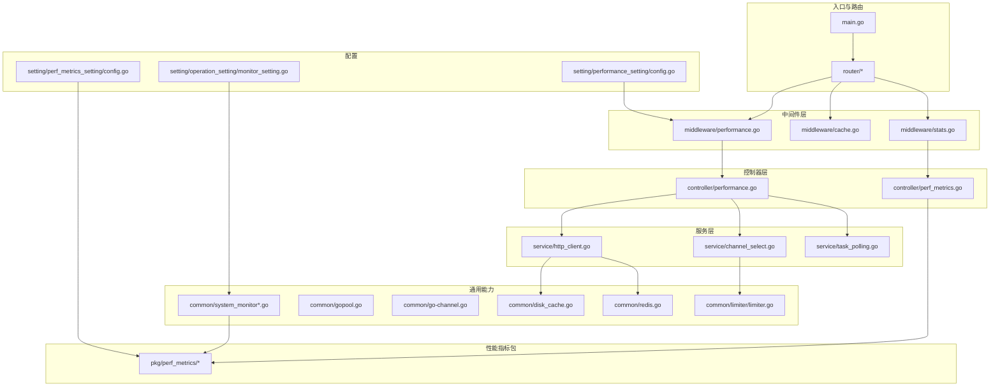
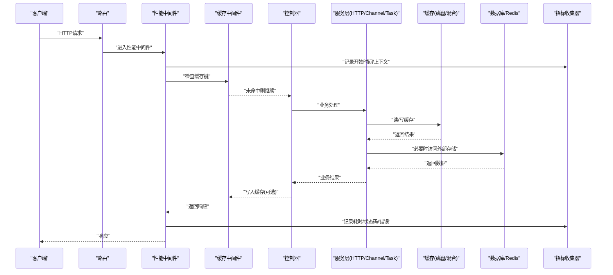
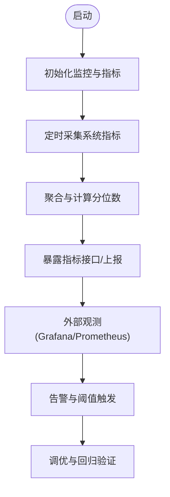
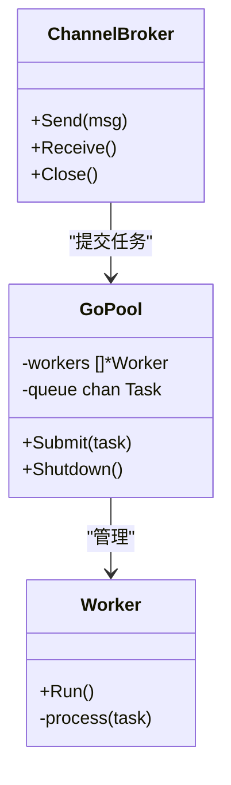
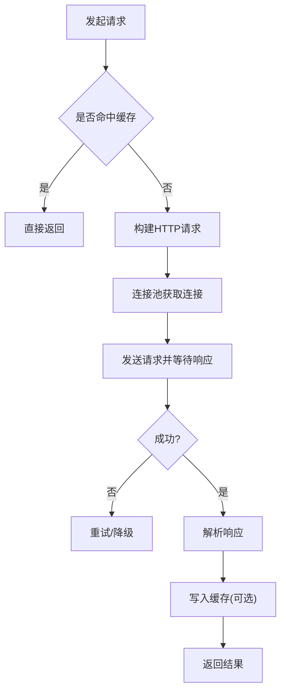
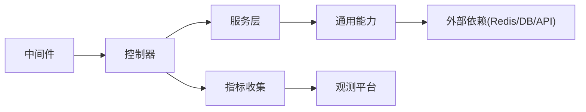

# 性能优化

<cite>
**本文引用的文件**   
- [main.go](file://main.go)
- [performance_config.go](file://common/performance_config.go)
- [system_monitor.go](file://common/system_monitor.go)
- [system_monitor_unix.go](file://common/system_monitor_unix.go)
- [system_monitor_windows.go](file://common/system_monitor_windows.go)
- [gopool.go](file://common/gopool.go)
- [go-channel.go](file://common/go-channel.go)
- [disk_cache.go](file://common/disk_cache.go)
- [disk_cache_config.go](file://common/disk_cache_config.go)
- [redis.go](file://common/redis.go)
- [rate-limit.go](file://common/rate-limit.go)
- [limiter.go](file://common/limiter/limiter.go)
- [perf_metrics_setting/config.go](file://setting/perf_metrics_setting/config.go)
- [performance_setting/config.go](file://setting/performance_setting/config.go)
- [monitor_setting.go](file://setting/operation_setting/monitor_setting.go)
- [perf_metrics.go](file://controller/perf_metrics.go)
- [performance.go](file://controller/performance.go)
- [metrics.go](file://pkg/perf_metrics/metrics.go)
- [flush.go](file://pkg/perf_metrics/flush.go)
- [types.go](file://pkg/perf_metrics/types.go)
- [cache.go](file://middleware/cache.go)
- [performance.go](file://middleware/performance.go)
- [stats.go](file://middleware/stats.go)
- [http_client.go](file://service/http_client.go)
- [channel_select.go](file://service/channel_select.go)
- [task_polling.go](file://service/task_polling.go)
- [relay_utils.go](file://relay/common/relay_utils.go)
- [stream_scanner.go](file://relay/helper/stream_scanner.go)
- [hybrid_cache.go](file://pkg/cachex/hybrid_cache.go)
- [codec.go](file://pkg/cachex/codec.go)
- [namespace.go](file://pkg/cachex/namespace.go)
</cite>

## 目录
1. [简介](#简介)
2. [项目结构](#项目结构)
3. [核心组件](#核心组件)
4. [架构总览](#架构总览)
5. [详细组件分析](#详细组件分析)
6. [依赖关系分析](#依赖关系分析)
7. [性能考量](#性能考量)
8. [故障排查指南](#故障排查指南)
9. [结论](#结论)
10. [附录](#附录)

## 简介
本文件面向性能工程师与后端开发者，系统化梳理该代码库在性能监控、内存管理、CPU使用率优化、并发处理等方面的实现与最佳实践。内容覆盖：
- 性能指标采集与上报（pprof、系统监控、自定义指标）
- 内存管理与GC调优建议
- CPU热点定位与优化策略
- 并发模型（Goroutine池、通道、任务轮询）
- 连接池配置（HTTP客户端、Redis）
- 缓存策略（本地磁盘缓存、混合缓存、命名空间隔离）
- 限流与防抖
- 基准测试、负载测试与回归检测
- 常见问题与解决方案（慢查询、内存泄漏、响应时间优化）

## 项目结构
本项目采用分层与按功能域组织相结合的结构：
- common：通用能力（监控、缓存、限流、工具）
- setting：配置中心（性能、监控、操作相关）
- controller：控制器层（性能指标接口、性能面板）
- middleware：中间件（请求级性能统计、缓存、限流）
- service：业务服务（HTTP客户端、通道选择、任务轮询）
- pkg：可复用包（性能指标、缓存抽象）
- relay：协议适配与转发（流式处理、工具）



图表来源
- [main.go:1-100](file://main.go#L1-L100)
- [performance.go](file://middleware/performance.go)
- [cache.go](file://middleware/cache.go)
- [stats.go](file://middleware/stats.go)
- [performance.go](file://controller/performance.go)
- [perf_metrics.go](file://controller/perf_metrics.go)
- [http_client.go](file://service/http_client.go)
- [channel_select.go](file://service/channel_select.go)
- [task_polling.go](file://service/task_polling.go)
- [system_monitor.go](file://common/system_monitor.go)
- [gopool.go](file://common/gopool.go)
- [go-channel.go](file://common/go-channel.go)
- [disk_cache.go](file://common/disk_cache.go)
- [redis.go](file://common/redis.go)
- [limiter.go](file://common/limiter/limiter.go)
- [metrics.go](file://pkg/perf_metrics/metrics.go)
- [config.go](file://setting/performance_setting/config.go)
- [config.go](file://setting/perf_metrics_setting/config.go)
- [monitor_setting.go](file://setting/operation_setting/monitor_setting.go)

章节来源
- [main.go:1-100](file://main.go#L1-L100)

## 核心组件
- 性能指标采集与上报
  - pprof集成与导出端点
  - 系统资源监控（CPU、内存、GC、goroutine数）
  - 自定义指标（请求耗时、错误率、上游延迟等）
- 并发与任务调度
  - Goroutine池与任务队列
  - 通道模式与背压控制
  - 任务轮询与重试
- 缓存体系
  - 本地磁盘缓存（带过期与清理）
  - 混合缓存（内存+磁盘/远程）
  - Redis连接池与超时配置
- 限流与保护
  - 令牌桶/漏桶算法
  - 模型级与全局限流
- HTTP客户端与连接池
  - 连接复用、超时、重试、熔断
- 中间件与控制器
  - 请求级性能统计、缓存命中统计、指标上报

章节来源
- [performance_config.go](file://common/performance_config.go)
- [system_monitor.go](file://common/system_monitor.go)
- [gopool.go](file://common/gopool.go)
- [go-channel.go](file://common/go-channel.go)
- [disk_cache.go](file://common/disk_cache.go)
- [redis.go](file://common/redis.go)
- [limiter.go](file://common/limiter/limiter.go)
- [http_client.go](file://service/http_client.go)
- [channel_select.go](file://service/channel_select.go)
- [task_polling.go](file://service/task_polling.go)
- [cache.go](file://middleware/cache.go)
- [performance.go](file://middleware/performance.go)
- [stats.go](file://middleware/stats.go)
- [perf_metrics.go](file://controller/perf_metrics.go)
- [performance.go](file://controller/performance.go)
- [metrics.go](file://pkg/perf_metrics/metrics.go)
- [flush.go](file://pkg/perf_metrics/flush.go)
- [types.go](file://pkg/perf_metrics/types.go)
- [config.go](file://setting/performance_setting/config.go)
- [config.go](file://setting/perf_metrics_setting/config.go)
- [monitor_setting.go](file://setting/operation_setting/monitor_setting.go)

## 架构总览
下图展示从请求进入、中间件处理、到服务层调用与指标采集的完整链路，以及关键的性能优化点。



图表来源
- [performance.go](file://middleware/performance.go)
- [cache.go](file://middleware/cache.go)
- [perf_metrics.go](file://controller/perf_metrics.go)
- [performance.go](file://controller/performance.go)
- [http_client.go](file://service/http_client.go)
- [disk_cache.go](file://common/disk_cache.go)
- [redis.go](file://common/redis.go)
- [metrics.go](file://pkg/perf_metrics/metrics.go)

## 详细组件分析

### 性能监控与指标采集
- 指标维度
  - 系统级：CPU、内存、GC、goroutine数量、FD数
  - 应用级：QPS、P50/P95/P99延迟、错误率、上游延迟、缓存命中率
  - 业务级：渠道成功率、模型调用量、计费用量
- 采集方式
  - pprof：CPU/内存/阻塞/互斥分析
  - 系统监控：定时采集并暴露指标
  - 自定义指标：请求生命周期埋点、批量上报
- 上报与可视化
  - 控制器提供指标查询接口
  - 支持批量刷新与异步落盘



章节来源
- [system_monitor.go](file://common/system_monitor.go)
- [system_monitor_unix.go](file://common/system_monitor_unix.go)
- [system_monitor_windows.go](file://common/system_monitor_windows.go)
- [perf_metrics.go](file://controller/perf_metrics.go)
- [performance.go](file://controller/performance.go)
- [metrics.go](file://pkg/perf_metrics/metrics.go)
- [flush.go](file://pkg/perf_metrics/flush.go)
- [types.go](file://pkg/perf_metrics/types.go)
- [config.go](file://setting/perf_metrics_setting/config.go)

### 内存管理与GC调优
- 内存管理要点
  - 避免大对象频繁分配与复制
  - 合理使用缓冲池与对象复用
  - 及时释放不再使用的句柄与连接
- GC调优建议
  - 根据工作负载调整GOGC与GOMEMLIMIT
  - 减少短生命周期对象的创建
  - 关注堆增长趋势与GC暂停时间
- 代码层面优化
  - 使用字节切片时预分配容量
  - 避免不必要的JSON编解码与字符串拼接
  - 合理设置请求体大小限制

章节来源
- [performance_config.go](file://common/performance_config.go)
- [request_body_limit.go](file://common/request_body_limit.go)

### CPU使用率优化
- 热点识别
  - 使用pprof CPU profile定位热点函数
  - 关注序列化/反序列化、正则匹配、加密哈希
- 优化策略
  - 减少锁竞争与同步开销
  - 使用更高效的数据结构与算法
  - 批量化与并行化I/O操作
  - 避免热路径上的日志打印与反射

章节来源
- [pprof.go](file://common/pprof.go)

### 并发处理与Goroutine池
- 并发模型
  - Goroutine池限制并发度，防止资源耗尽
  - 通道用于任务分发与结果聚合
  - 任务轮询与重试机制提升稳定性
- 泄漏检测
  - 监控goroutine数量异常增长
  - 使用pprof goroutine profile定位泄漏
  - 确保所有通道关闭与上下文取消传播



图表来源
- [gopool.go](file://common/gopool.go)
- [go-channel.go](file://common/go-channel.go)

章节来源
- [gopool.go](file://common/gopool.go)
- [go-channel.go](file://common/go-channel.go)
- [task_polling.go](file://service/task_polling.go)

### 连接池配置（HTTP客户端与Redis）
- HTTP客户端
  - 最大空闲连接、连接超时、读写超时
  - 重试策略与退避
  - 代理与SSRF防护
- Redis连接池
  - 连接数、读写超时、重试
  - 键空间隔离与命名规范



图表来源
- [http_client.go](file://service/http_client.go)
- [redis.go](file://common/redis.go)

章节来源
- [http_client.go](file://service/http_client.go)
- [redis.go](file://common/redis.go)

### 缓存策略（磁盘缓存与混合缓存）
- 磁盘缓存
  - 基于文件的键值存储，支持过期与清理
  - 适合大对象或高吞吐场景
- 混合缓存
  - 内存优先，回落到磁盘或远程
  - 命名空间隔离，避免键冲突
- 编码与序列化
  - 统一编解码器，支持多种格式

```mermaid
classDiagram
class DiskCache {
+Get(key) []byte
+Set(key, value, ttl)
-cleanup()
}
class HybridCache {
+Get(key) interface{}
+Set(key, value, ttl)
-memCache
-diskCache
}
class Codec {
+Encode(v) []byte
+Decode(data) interface{}
}
HybridCache --> DiskCache : "回退"
HybridCache --> Codec : "编解码"
```

图表来源
- [disk_cache.go](file://common/disk_cache.go)
- [disk_cache_config.go](file://common/disk_cache_config.go)
- [hybrid_cache.go](file://pkg/cachex/hybrid_cache.go)
- [codec.go](file://pkg/cachex/codec.go)
- [namespace.go](file://pkg/cachex/namespace.go)

章节来源
- [disk_cache.go](file://common/disk_cache.go)
- [disk_cache_config.go](file://common/disk_cache_config.go)
- [hybrid_cache.go](file://pkg/cachex/hybrid_cache.go)
- [codec.go](file://pkg/cachex/codec.go)
- [namespace.go](file://pkg/cachex/namespace.go)

### 限流与保护
- 算法实现
  - 令牌桶/漏桶，支持分布式计数
  - Lua脚本保证原子性
- 粒度控制
  - 全局、用户、模型级别限流
  - 动态调整阈值

章节来源
- [rate-limit.go](file://common/rate-limit.go)
- [limiter.go](file://common/limiter/limiter.go)

### 中间件与控制器（性能统计与缓存）
- 性能中间件
  - 记录请求耗时、状态码、错误信息
  - 采样与采样率控制
- 缓存中间件
  - 基于URL/参数的缓存键生成
  - 条件缓存与强制失效
- 统计中间件
  - QPS、错误率、上游延迟统计

章节来源
- [performance.go](file://middleware/performance.go)
- [cache.go](file://middleware/cache.go)
- [stats.go](file://middleware/stats.go)

### 服务层（HTTP客户端、通道选择、任务轮询）
- HTTP客户端
  - 连接池、超时、重试、熔断
  - 请求体限制与SSRF防护
- 通道选择
  - 权重、亲和性、健康检查
  - 失败切换与负载均衡
- 任务轮询
  - 定时拉取、去重、幂等
  - 退避与重试

章节来源
- [http_client.go](file://service/http_client.go)
- [channel_select.go](file://service/channel_select.go)
- [task_polling.go](file://service/task_polling.go)

### 流式处理与工具
- 流式扫描
  - 增量解析与内存友好
  - 错误恢复与边界处理
- 工具函数
  - 价格计算、模型映射、请求校验

章节来源
- [stream_scanner.go](file://relay/helper/stream_scanner.go)
- [relay_utils.go](file://relay/common/relay_utils.go)

## 依赖关系分析
- 松耦合设计
  - 中间件与控制器通过接口交互
  - 服务层依赖通用能力（缓存、限流、监控）
- 潜在循环依赖
  - 注意指标包与监控模块之间的引用
- 外部依赖
  - Redis、数据库、上游API



图表来源
- [performance.go](file://middleware/performance.go)
- [perf_metrics.go](file://controller/perf_metrics.go)
- [http_client.go](file://service/http_client.go)
- [redis.go](file://common/redis.go)
- [metrics.go](file://pkg/perf_metrics/metrics.go)

章节来源
- [performance.go](file://middleware/performance.go)
- [perf_metrics.go](file://controller/perf_metrics.go)
- [http_client.go](file://service/http_client.go)
- [redis.go](file://common/redis.go)
- [metrics.go](file://pkg/perf_metrics/metrics.go)

## 性能考量
- 基准测试
  - 使用Go内置benchmarks与第三方框架
  - 覆盖关键路径（序列化、缓存、网络I/O）
- 负载测试
  - 模拟真实流量与峰值
  - 观察延迟分布与错误率
- 性能回归检测
  - CI中集成性能测试
  - 阈值告警与自动回滚

[本节为通用指导，不直接分析具体文件]

## 故障排查指南
- Goroutine泄漏检测
  - 监控goroutine数量异常
  - 使用pprof goroutine profile定位
  - 检查通道关闭与上下文取消
- GC调优
  - 调整GOGC与GOMEMLIMIT
  - 分析堆快照，定位大对象
- 慢查询优化
  - 索引与SQL优化
  - 缓存热点数据
- 响应时间优化
  - 减少串行I/O
  - 使用连接池与批处理
  - 启用压缩与缓存

章节来源
- [system_monitor.go](file://common/system_monitor.go)
- [pprof.go](file://common/pprof.go)
- [task_polling.go](file://service/task_polling.go)
- [http_client.go](file://service/http_client.go)
- [disk_cache.go](file://common/disk_cache.go)

## 结论
通过系统化的性能监控、合理的内存与并发管理、完善的缓存与连接池配置，以及严格的限流与保护策略，可以显著提升系统的吞吐量与稳定性。建议在生产环境中持续进行基准测试与负载测试，结合指标与日志快速定位瓶颈，形成闭环优化流程。

[本节为总结，不直接分析具体文件]

## 附录
- 常用命令
  - pprof：CPU/内存/阻塞分析
  - 系统监控：查看CPU、内存、GC、goroutine
- 配置项参考
  - 性能设置、指标设置、监控设置

[本节为补充信息，不直接分析具体文件]