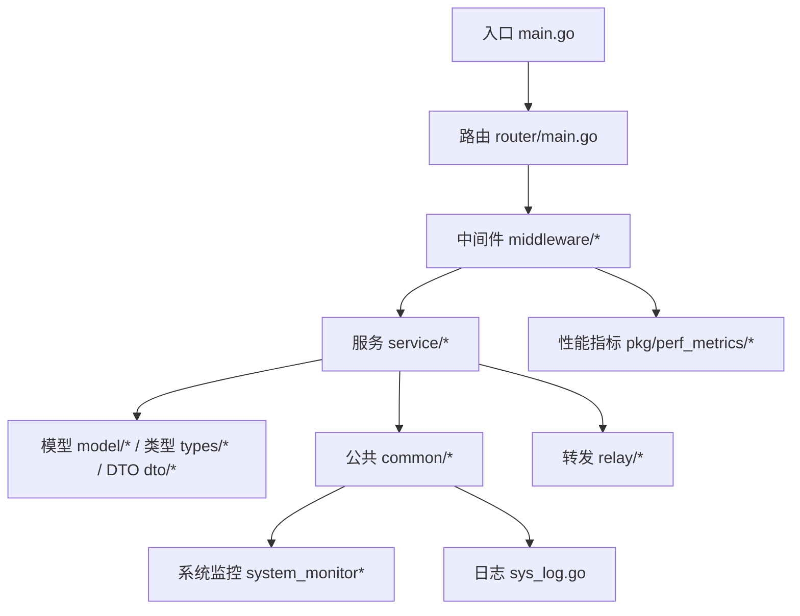
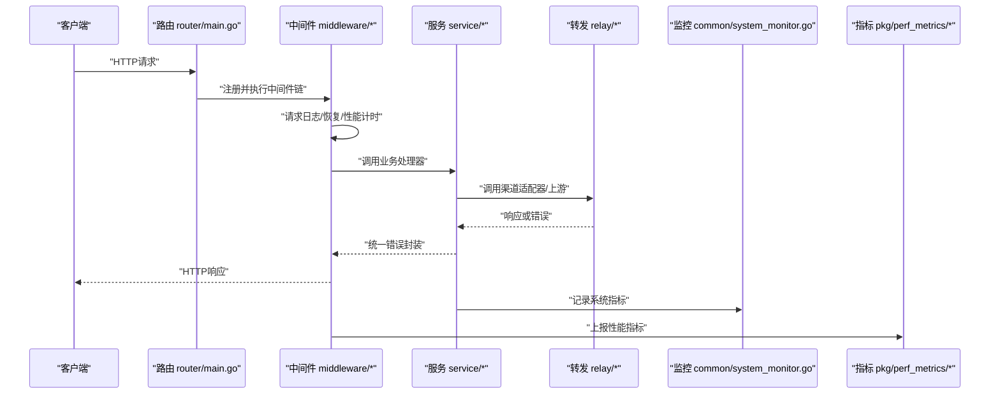
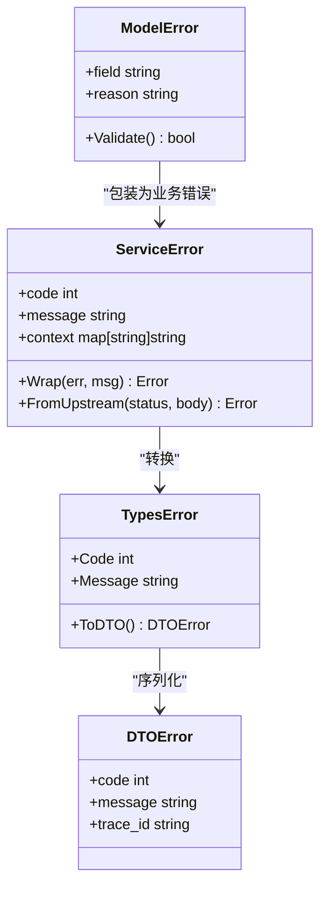
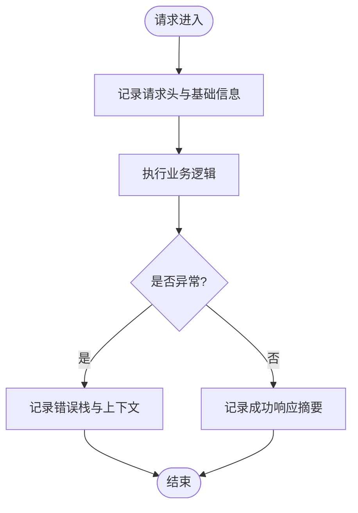
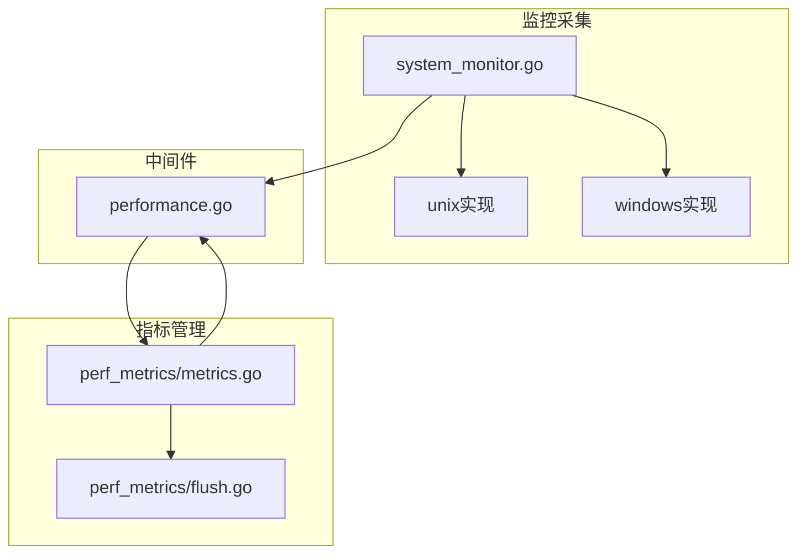
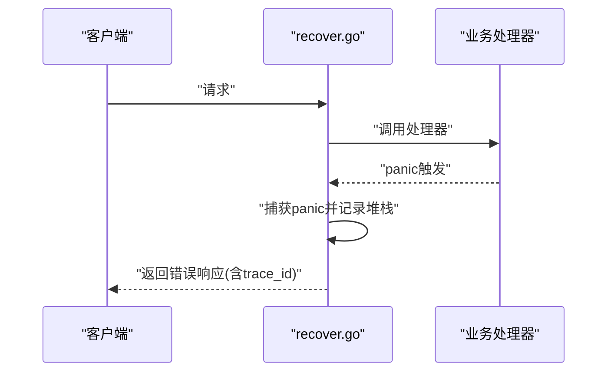
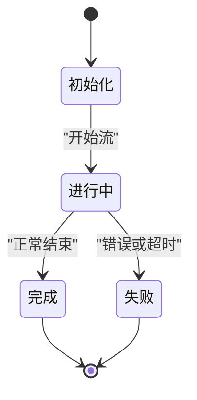
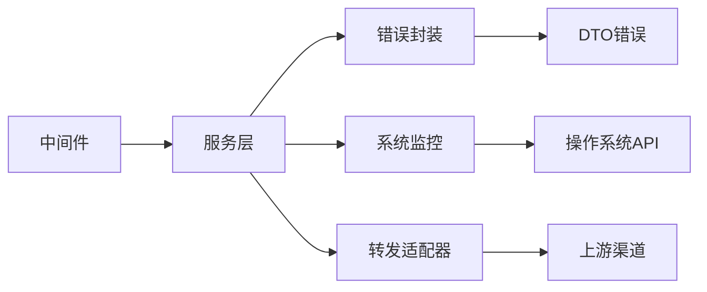

# 故障排除

<cite>
**本文引用的文件**   
- [main.go](file://main.go)
- [logger/logger.go](file://logger/logger.go)
- [common/sys_log.go](file://common/sys_log.go)
- [common/system_monitor.go](file://common/system_monitor.go)
- [common/system_monitor_unix.go](file://common/system_monitor_unix.go)
- [common/system_monitor_windows.go](file://common/system_monitor_windows.go)
- [middleware/recover.go](file://middleware/recover.go)
- [middleware/logger.go](file://middleware/logger.go)
- [middleware/performance.go](file://middleware/performance.go)
- [service/error.go](file://service/error.go)
- [model/errors.go](file://model/errors.go)
- [types/error.go](file://types/error.go)
- [dto/error.go](file://dto/error.go)
- [setting/operation_setting/general_setting.go](file://setting/operation_setting/general_setting.go)
- [setting/operation_setting/monitor_setting.go](file://setting/operation_setting/monitor_setting.go)
- [setting/performance_setting/config.go](file://setting/performance_setting/config.go)
- [pkg/perf_metrics/metrics.go](file://pkg/perf_metrics/metrics.go)
- [pkg/perf_metrics/flush.go](file://pkg/perf_metrics/flush.go)
- [router/main.go](file://router/main.go)
- [relay/common/stream_status.go](file://relay/common/stream_status.go)
- [relay/channel/adapter.go](file://relay/channel/adapter.go)
</cite>

## 目录
1. [简介](#简介)
2. [项目结构](#项目结构)
3. [核心组件](#核心组件)
4. [架构总览](#架构总览)
5. [详细组件分析](#详细组件分析)
6. [依赖关系分析](#依赖关系分析)
7. [性能考虑](#性能考虑)
8. [故障排除指南](#故障排除指南)
9. [结论](#结论)
10. [附录](#附录)

## 简介
本故障排除文档面向运维与研发人员，聚焦于该API网关在运行期的错误分类、日志分析、性能瓶颈定位、内存泄漏检测与CPU优化等关键问题。文档基于代码库中的错误处理、日志记录、系统监控、性能指标与中间件实现进行系统化梳理，并提供可操作的诊断步骤与解决方案。

## 项目结构
本项目采用分层与按功能域组织的方式：
- 入口与路由：main.go、router/*
- 中间件层：middleware/*（恢复、请求日志、性能统计、限流等）
- 服务层：service/*（业务逻辑、错误封装、HTTP客户端等）
- 模型与类型：model/*、types/*、dto/*（错误定义、数据模型）
- 公共能力：common/*（系统监控、日志、缓存、限流等）
- 转发与适配：relay/*（渠道适配、流式状态、计费辅助等）
- 配置与设置：setting/*（运行期开关、监控阈值、性能参数）
- 指标与监控：pkg/perf_metrics/*（指标采集与刷新）

图表来源
- [main.go:1-200](file://main.go#L1-L200)
- [router/main.go:1-200](file://router/main.go#L1-L200)
- [middleware/recover.go:1-200](file://middleware/recover.go#L1-L200)
- [common/system_monitor.go:1-200](file://common/system_monitor.go#L1-L200)
- [pkg/perf_metrics/metrics.go:1-200](file://pkg/perf_metrics/metrics.go#L1-L200)

章节来源
- [main.go:1-200](file://main.go#L1-L200)
- [router/main.go:1-200](file://router/main.go#L1-L200)

## 核心组件
- 错误处理与统一返回
  - 服务层错误封装与转换：service/error.go
  - 模型层错误定义：model/errors.go
  - 通用错误类型：types/error.go
  - DTO错误结构：dto/error.go
- 日志与审计
  - 全局日志器：logger/logger.go
  - 系统日志接口与实现：common/sys_log.go
  - 请求级日志中间件：middleware/logger.go
- 系统监控与性能指标
  - 系统资源监控：common/system_monitor.go、system_monitor_unix.go、system_monitor_windows.go
  - 性能指标采集与刷新：pkg/perf_metrics/metrics.go、pkg/perf_metrics/flush.go
  - 性能相关中间件：middleware/performance.go
- 异常恢复与请求追踪
  - 全局恢复中间件：middleware/recover.go
  - 请求ID与链路追踪：middleware/request-id.go（如存在）

章节来源
- [service/error.go:1-200](file://service/error.go#L1-L200)
- [model/errors.go:1-200](file://model/errors.go#L1-L200)
- [types/error.go:1-200](file://types/error.go#L1-L200)
- [dto/error.go:1-200](file://dto/error.go#L1-L200)
- [logger/logger.go:1-200](file://logger/logger.go#L1-L200)
- [common/sys_log.go:1-200](file://common/sys_log.go#L1-L200)
- [middleware/logger.go:1-200](file://middleware/logger.go#L1-L200)
- [common/system_monitor.go:1-200](file://common/system_monitor.go#L1-L200)
- [common/system_monitor_unix.go:1-200](file://common/system_monitor_unix.go#L1-L200)
- [common/system_monitor_windows.go:1-200](file://common/system_monitor_windows.go#L1-L200)
- [pkg/perf_metrics/metrics.go:1-200](file://pkg/perf_metrics/metrics.go#L1-L200)
- [pkg/perf_metrics/flush.go:1-200](file://pkg/perf_metrics/flush.go#L1-L200)
- [middleware/performance.go:1-200](file://middleware/performance.go#L1-L200)
- [middleware/recover.go:1-200](file://middleware/recover.go#L1-L200)

## 架构总览
下图展示一次请求从进入网关到返回的完整路径，以及错误与日志在各层的落点。

图表来源
- [router/main.go:1-200](file://router/main.go#L1-L200)
- [middleware/logger.go:1-200](file://middleware/logger.go#L1-L200)
- [middleware/recover.go:1-200](file://middleware/recover.go#L1-L200)
- [service/error.go:1-200](file://service/error.go#L1-L200)
- [relay/channel/adapter.go:1-200](file://relay/channel/adapter.go#L1-L200)
- [common/system_monitor.go:1-200](file://common/system_monitor.go#L1-L200)
- [pkg/perf_metrics/metrics.go:1-200](file://pkg/perf_metrics/metrics.go#L1-L200)

## 详细组件分析

### 错误处理与统一返回
- 错误分类
  - 业务错误：由service/error.go封装，包含错误码、消息与上下文信息。
  - 模型错误：model/errors.go定义领域错误类型与校验失败场景。
  - 通用错误：types/error.go提供跨模块使用的错误结构与工具。
  - DTO错误：dto/error.go用于对外JSON结构的错误体。
- 错误传播
  - 服务层将底层错误转换为统一错误对象，便于中间件与前端解析。
  - 转发层遇到上游错误时，通过适配器进行错误映射与降级策略。
- 建议排查要点
  - 检查错误码是否覆盖所有上游HTTP状态码与业务异常分支。
  - 确认错误消息不包含敏感信息，且具备足够上下文（如请求ID）。

图表来源
- [service/error.go:1-200](file://service/error.go#L1-L200)
- [model/errors.go:1-200](file://model/errors.go#L1-L200)
- [types/error.go:1-200](file://types/error.go#L1-L200)
- [dto/error.go:1-200](file://dto/error.go#L1-L200)

章节来源
- [service/error.go:1-200](file://service/error.go#L1-L200)
- [model/errors.go:1-200](file://model/errors.go#L1-L200)
- [types/error.go:1-200](file://types/error.go#L1-L200)
- [dto/error.go:1-200](file://dto/error.go#L1-L200)

### 日志与审计
- 日志器与系统日志
  - logger/logger.go提供全局日志器初始化与级别控制。
  - common/sys_log.go定义系统日志接口与写入策略（控制台/文件/外部系统）。
- 请求级日志
  - middleware/logger.go对每个请求记录入参、出参、耗时、状态码与错误信息。
- 建议排查要点
  - 确认日志级别在生产环境设置为INFO/WARN/ERROR，避免DEBUG泄露敏感信息。
  - 确保每条日志包含请求ID与用户标识，便于链路追踪。
  - 关注慢请求与高频错误日志，结合指标定位瓶颈。

图表来源
- [logger/logger.go:1-200](file://logger/logger.go#L1-L200)
- [common/sys_log.go:1-200](file://common/sys_log.go#L1-L200)
- [middleware/logger.go:1-200](file://middleware/logger.go#L1-L200)

章节来源
- [logger/logger.go:1-200](file://logger/logger.go#L1-L200)
- [common/sys_log.go:1-200](file://common/sys_log.go#L1-L200)
- [middleware/logger.go:1-200](file://middleware/logger.go#L1-L200)

### 系统监控与性能指标
- 系统监控
  - common/system_monitor.go提供跨平台监控接口。
  - system_monitor_unix.go与system_monitor_windows.go分别实现Unix与Windows平台的CPU、内存、磁盘与网络指标采集。
- 性能指标
  - pkg/perf_metrics/metrics.go定义指标项与采集方法。
  - pkg/perf_metrics/flush.go负责周期性刷新与导出。
- 性能中间件
  - middleware/performance.go记录请求耗时、QPS、P95/P99延迟等。
- 建议排查要点
  - 监控CPU使用率、内存占用、GC停顿、goroutine数量与连接数。
  - 结合指标与日志，识别慢接口与热点路径。
  - 调整并发度、超时与重试策略以缓解拥塞。

图表来源
- [common/system_monitor.go:1-200](file://common/system_monitor.go#L1-L200)
- [common/system_monitor_unix.go:1-200](file://common/system_monitor_unix.go#L1-L200)
- [common/system_monitor_windows.go:1-200](file://common/system_monitor_windows.go#L1-L200)
- [pkg/perf_metrics/metrics.go:1-200](file://pkg/perf_metrics/metrics.go#L1-L200)
- [pkg/perf_metrics/flush.go:1-200](file://pkg/perf_metrics/flush.go#L1-L200)
- [middleware/performance.go:1-200](file://middleware/performance.go#L1-L200)

章节来源
- [common/system_monitor.go:1-200](file://common/system_monitor.go#L1-L200)
- [common/system_monitor_unix.go:1-200](file://common/system_monitor_unix.go#L1-L200)
- [common/system_monitor_windows.go:1-200](file://common/system_monitor_windows.go#L1-L200)
- [pkg/perf_metrics/metrics.go:1-200](file://pkg/perf_metrics/metrics.go#L1-L200)
- [pkg/perf_metrics/flush.go:1-200](file://pkg/perf_metrics/flush.go#L1-L200)
- [middleware/performance.go:1-200](file://middleware/performance.go#L1-L200)

### 异常恢复与请求追踪
- 全局恢复
  - middleware/recover.go捕获panic并返回友好错误，附带堆栈与请求ID。
- 请求追踪
  - 建议在中间件中注入request-id，贯穿日志与指标，便于端到端定位。
- 建议排查要点
  - 出现panic时优先查看恢复中间件的错误日志与堆栈。
  - 结合请求ID关联上下游日志，快速定位根因。

图表来源
- [middleware/recover.go:1-200](file://middleware/recover.go#L1-L200)

章节来源
- [middleware/recover.go:1-200](file://middleware/recover.go#L1-L200)

### 流式响应与状态处理
- 流式状态
  - relay/common/stream_status.go维护流式任务的状态机与生命周期。
- 建议排查要点
  - 关注流中断、超时与重试策略。
  - 结合日志与指标分析流式接口的成功率与延迟分布。

图表来源
- [relay/common/stream_status.go:1-200](file://relay/common/stream_status.go#L1-L200)

章节来源
- [relay/common/stream_status.go:1-200](file://relay/common/stream_status.go#L1-L200)

## 依赖关系分析
- 组件耦合
  - 中间件依赖日志器与指标模块；服务层依赖错误封装与系统监控；转发层依赖适配器与上游协议。
- 外部依赖
  - 上游渠道（OpenAI、Claude、Gemini等）的错误码与超时行为需映射到统一错误体系。
- 潜在循环依赖
  - 避免服务层直接依赖中间件，保持单向依赖：中间件→服务→模型/类型→公共能力。

图表来源
- [middleware/logger.go:1-200](file://middleware/logger.go#L1-L200)
- [service/error.go:1-200](file://service/error.go#L1-L200)
- [common/system_monitor.go:1-200](file://common/system_monitor.go#L1-L200)
- [relay/channel/adapter.go:1-200](file://relay/channel/adapter.go#L1-L200)

章节来源
- [middleware/logger.go:1-200](file://middleware/logger.go#L1-L200)
- [service/error.go:1-200](file://service/error.go#L1-L200)
- [common/system_monitor.go:1-200](file://common/system_monitor.go#L1-L200)
- [relay/channel/adapter.go:1-200](file://relay/channel/adapter.go#L1-L200)

## 性能考虑
- 指标采集与刷新
  - 合理设置指标刷新周期，避免频繁I/O影响吞吐。
  - 使用批量化与异步写入降低开销。
- 监控阈值
  - 根据负载设定CPU、内存、连接数与队列长度阈值，及时告警。
- 中间件优化
  - 关闭不必要的日志级别与字段，减少序列化成本。
  - 启用压缩与缓存策略，降低带宽与计算压力。
- 建议调优方向
  - 调整goroutine池大小与超时时间。
  - 针对热点接口增加缓存与去重。
  - 对上游调用实施熔断与退避策略。

章节来源
- [pkg/perf_metrics/metrics.go:1-200](file://pkg/perf_metrics/metrics.go#L1-L200)
- [pkg/perf_metrics/flush.go:1-200](file://pkg/perf_metrics/flush.go#L1-L200)
- [middleware/performance.go:1-200](file://middleware/performance.go#L1-L200)

## 故障排除指南

### 错误分类与常见错误
- 分类维度
  - 客户端错误（4xx）：参数校验失败、权限不足、配额耗尽。
  - 服务端错误（5xx）：内部异常、上游不可用、资源不足。
  - 业务错误：自定义错误码，如模型不存在、计费失败。
- 常见错误示例与解决
  - 上游超时：检查网络连通性与上游健康状态，调整超时与重试策略。
  - 认证失败：核对密钥与权限配置，检查OAuth流程与令牌有效期。
  - 限流触发：评估QPS上限与配额，扩容或优化请求频率。
  - 流式中断：检查流状态机与超时配置，增加断线重连与幂等性。

章节来源
- [service/error.go:1-200](file://service/error.go#L1-L200)
- [model/errors.go:1-200](file://model/errors.go#L1-L200)
- [types/error.go:1-200](file://types/error.go#L1-L200)
- [dto/error.go:1-200](file://dto/error.go#L1-L200)

### 日志分析与诊断方法
- 日志级别
  - DEBUG：开发与调试，生产禁用。
  - INFO：关键业务流程与事件。
  - WARN：潜在风险与降级。
  - ERROR：异常与失败路径。
- 关键字段
  - 请求ID、用户ID、模型名、渠道名、状态码、耗时、错误码。
- 分析方法
  - 按请求ID聚合日志，还原调用链。
  - 统计错误码分布与趋势，定位热点错误。
  - 结合指标曲线，关联峰值与异常时间点。

章节来源
- [logger/logger.go:1-200](file://logger/logger.go#L1-L200)
- [common/sys_log.go:1-200](file://common/sys_log.go#L1-L200)
- [middleware/logger.go:1-200](file://middleware/logger.go#L1-L200)

### 性能瓶颈识别
- 指标观察
  - CPU使用率、内存占用、GC停顿、goroutine数量、连接池利用率。
  - 接口延迟分布（P50/P95/P99）、QPS、错误率。
- 定位步骤
  - 通过性能中间件与指标模块识别慢接口。
  - 使用pprof或系统工具分析CPU热点与内存分配。
  - 检查数据库与缓存命中率，优化查询与缓存策略。
- 调优建议
  - 调整并发度与超时，避免雪崩。
  - 引入批量与异步处理，降低同步阻塞。
  - 对热点数据加缓存，减少重复计算。

章节来源
- [common/system_monitor.go:1-200](file://common/system_monitor.go#L1-L200)
- [pkg/perf_metrics/metrics.go:1-200](file://pkg/perf_metrics/metrics.go#L1-L200)
- [middleware/performance.go:1-200](file://middleware/performance.go#L1-L200)

### 内存泄漏检测
- 检测方法
  - 定期采集heap快照，对比增长趋势。
  - 关注goroutine泄漏与未释放的资源（文件句柄、网络连接）。
- 常见问题
  - 长生命周期对象持有短生命周期引用。
  - 通道与协程未正确关闭。
- 修复建议
  - 使用defer确保资源释放。
  - 限制对象生命周期与作用域。
  - 引入对象池与回收策略。

章节来源
- [common/system_monitor.go:1-200](file://common/system_monitor.go#L1-L200)
- [pkg/perf_metrics/metrics.go:1-200](file://pkg/perf_metrics/metrics.go#L1-L200)

### CPU使用率优化
- 优化方向
  - 减少CPU密集型操作，拆分任务为并行子任务。
  - 避免频繁字符串拼接与大对象拷贝。
  - 使用更高效的数据结构与算法。
- 监控手段
  - 使用pprof定位热点函数。
  - 结合指标观察CPU尖峰与抖动。

章节来源
- [pkg/perf_metrics/metrics.go:1-200](file://pkg/perf_metrics/metrics.go#L1-L200)
- [common/system_monitor.go:1-200](file://common/system_monitor.go#L1-L200)

### 与其他组件的关系
- 与上游渠道
  - 错误码映射与降级策略需在适配器层完善。
  - 超时与重试策略需与上游SLA匹配。
- 与存储与缓存
  - 读写分离与缓存一致性需保证。
  - 连接池与超时配置需合理设置。
- 与监控与日志
  - 指标与日志需对齐时间戳与请求ID。
  - 告警规则需覆盖关键错误与性能阈值。

章节来源
- [relay/channel/adapter.go:1-200](file://relay/channel/adapter.go#L1-L200)
- [common/sys_log.go:1-200](file://common/sys_log.go#L1-L200)
- [pkg/perf_metrics/metrics.go:1-200](file://pkg/perf_metrics/metrics.go#L1-L200)

### 常见部署与运行问题及解决方案
- 启动失败
  - 检查端口占用与配置文件路径。
  - 验证环境变量与密钥是否正确加载。
- 高延迟与超时
  - 调整中间件超时与服务层超时。
  - 检查上游健康与网络质量。
- 内存持续增长
  - 采集heap快照定位泄漏点。
  - 审查长生命周期对象与未关闭资源。
- 日志过大
  - 调整日志轮转与保留策略。
  - 降低日志级别与过滤无关字段。

章节来源
- [router/main.go:1-200](file://router/main.go#L1-L200)
- [setting/operation_setting/general_setting.go:1-200](file://setting/operation_setting/general_setting.go#L1-L200)
- [setting/operation_setting/monitor_setting.go:1-200](file://setting/operation_setting/monitor_setting.go#L1-L200)
- [setting/performance_setting/config.go:1-200](file://setting/performance_setting/config.go#L1-L200)

## 结论
本故障排除文档围绕错误处理、日志分析、系统监控与性能指标四大方面展开，提供了从错误分类到定位调优的完整方法论。通过统一的错误封装、完善的日志与指标体系，以及合理的中间件与适配器设计，可有效提升系统的可观测性与稳定性。建议在生产环境中持续监控关键指标，建立告警与演练机制，确保问题早发现、快定位、稳恢复。

## 附录
- 常用命令与工具
  - 使用pprof采集CPU与内存快照。
  - 使用系统工具（top、htop、vmstat、iostat）观察资源使用。
- 参考配置
  - 监控阈值与告警规则。
  - 日志级别与轮转策略。
  - 超时与重试参数。

[本节不直接分析具体文件，故无章节来源]