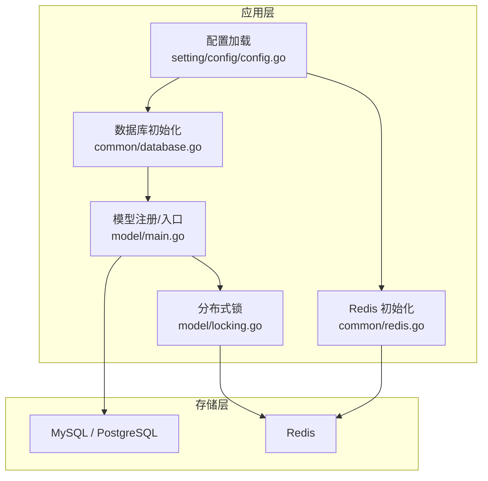
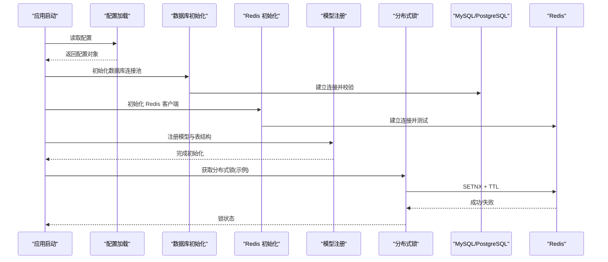
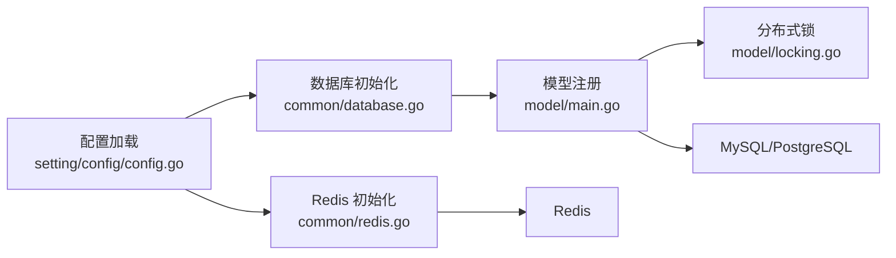

# 数据库问题

<cite>
**本文引用的文件**   
- [common/database.go](file://common/database.go)
- [common/redis.go](file://common/redis.go)
- [model/main.go](file://model/main.go)
- [model/locking.go](file://model/locking.go)
- [setting/config/config.go](file://setting/config/config.go)
- [bin/migration_v0.2-v0.3.sql](file://bin/migration_v0.2-v0.3.sql)
- [bin/migration_v0.3-v0.4.sql](file://bin/migration_v0.3-v0.4.sql)
</cite>

## 目录
1. [简介](#简介)
2. [项目结构](#项目结构)
3. [核心组件](#核心组件)
4. [架构总览](#架构总览)
5. [详细组件分析](#详细组件分析)
6. [依赖关系分析](#依赖关系分析)
7. [性能考虑](#性能考虑)
8. [故障排查指南](#故障排查指南)
9. [结论](#结论)
10. [附录](#附录)

## 简介
本文件聚焦于本项目中的数据库相关问题，涵盖连接池配置、事务处理、索引优化与查询调优、慢查询分析与死锁检测、数据迁移与备份恢复、分库分表与读写分离、缓存策略等。文档基于仓库中实际代码进行梳理，提供可操作的实践建议与排障步骤，帮助读者快速定位并解决常见的数据库问题（如连接池耗尽、查询性能下降、数据一致性与锁竞争）。

## 项目结构
与数据库相关的关键位置如下：
- common/database.go：数据库初始化、连接池参数、通用查询封装
- common/redis.go：Redis 客户端初始化与基础操作封装
- model/main.go：ORM 模型注册、全局数据库实例使用入口
- model/locking.go：分布式锁实现（用于并发控制）
- setting/config/config.go：系统配置加载（含数据库与 Redis 配置项）
- bin/migration_v0.2-v0.3.sql、bin/migration_v0.3-v0.4.sql：数据库迁移脚本

图表来源
- [setting/config/config.go](file://setting/config/config.go)
- [common/database.go](file://common/database.go)
- [common/redis.go](file://common/redis.go)
- [model/main.go](file://model/main.go)
- [model/locking.go](file://model/locking.go)

章节来源
- [common/database.go](file://common/database.go)
- [common/redis.go](file://common/redis.go)
- [model/main.go](file://model/main.go)
- [model/locking.go](file://model/locking.go)
- [setting/config/config.go](file://setting/config/config.go)

## 核心组件
- 数据库连接与连接池
  - 通过配置项集中管理连接数、超时、空闲连接等参数，确保在高并发场景下稳定可用。
  - 统一封装查询与事务接口，减少重复代码并保证一致性。
- Redis 缓存
  - 提供统一的客户端初始化与常用操作封装，作为热点数据与分布式锁的支撑。
- 模型与 ORM
  - 在模型层完成实体定义与注册，配合数据库初始化流程建立连接与索引策略。
- 分布式锁
  - 基于 Redis 实现轻量级分布式锁，避免并发写冲突与脏写。

章节来源
- [common/database.go](file://common/database.go)
- [common/redis.go](file://common/redis.go)
- [model/main.go](file://model/main.go)
- [model/locking.go](file://model/locking.go)

## 架构总览
下图展示了从配置到存储的整体数据流与控制流，包括数据库与 Redis 的初始化顺序、模型注册以及锁的使用路径。

图表来源
- [setting/config/config.go](file://setting/config/config.go)
- [common/database.go](file://common/database.go)
- [common/redis.go](file://common/redis.go)
- [model/main.go](file://model/main.go)
- [model/locking.go](file://model/locking.go)

## 详细组件分析

### 数据库连接池与事务
- 连接池配置要点
  - 最大连接数：根据 CPU 核数与 I/O 特性设置，避免过多连接导致上下文切换开销。
  - 最小空闲连接：预热连接，降低冷启动延迟。
  - 连接超时与生命周期：合理设置等待与空闲超时，防止连接泄漏。
- 事务处理
  - 使用显式事务包裹多步写操作，确保原子性。
  - 对读多写少场景采用只读事务或快照隔离级别，减少锁竞争。
- 错误与重试
  - 捕获网络抖动与临时错误，结合退避策略进行有限重试。
  - 区分可重试与不可重试错误，避免放大故障。

章节来源
- [common/database.go](file://common/database.go)
- [model/main.go](file://model/main.go)

### Redis 缓存与分布式锁
- 缓存策略
  - 热点键加过期时间，避免雪崩；批量写入时采用管道提升吞吐。
  - 多级缓存：本地内存 + Redis，兼顾低延迟与高可用。
- 分布式锁
  - 使用原子命令与 TTL 保障互斥与自动释放。
  - 避免长时间持有锁，必要时支持续期机制。

章节来源
- [common/redis.go](file://common/redis.go)
- [model/locking.go](file://model/locking.go)

### 索引优化与查询调优
- 索引设计原则
  - 优先为高频过滤条件与排序字段建立索引。
  - 复合索引遵循最左前缀原则，避免冗余索引。
- 查询优化
  - 避免 SELECT *，仅选择必要字段。
  - 使用覆盖索引减少回表，分页查询使用游标或延迟关联。
- 执行计划分析
  - 定期查看 EXPLAIN/ANALYZE，关注全表扫描与临时表。

章节来源
- [model/main.go](file://model/main.go)

### 慢查询分析与死锁检测
- 慢查询
  - 开启慢查询日志，设定阈值，收集 TOP N 慢查询进行分析。
  - 针对热点 SQL 建立索引或改写查询。
- 死锁检测
  - 启用死锁监控与告警，记录死锁信息。
  - 缩短事务粒度，统一加锁顺序，避免循环等待。

章节来源
- [common/database.go](file://common/database.go)

### 数据迁移与备份恢复
- 迁移脚本
  - 使用版本化脚本逐步演进表结构，保持幂等与可回滚。
  - 大表变更采用在线 DDL 工具，避免阻塞业务。
- 备份恢复
  - 定期全量备份与增量备份，验证恢复流程。
  - 跨环境演练恢复，确保 RTO/RPO 达标。

章节来源
- [bin/migration_v0.2-v0.3.sql](file://bin/migration_v0.2-v0.3.sql)
- [bin/migration_v0.3-v0.4.sql](file://bin/migration_v0.3-v0.4.sql)

### 分库分表与读写分离
- 分库分表
  - 按用户 ID 或租户维度水平拆分，路由规则需可配置。
  - 跨分片聚合查询尽量在应用层合并，避免复杂分布式 JOIN。
- 读写分离
  - 主库写、从库读，注意主从延迟导致的最终一致性问题。
  - 关键读操作可强制走主库或引入强一致缓存。

章节来源
- [setting/config/config.go](file://setting/config/config.go)

### 缓存策略与一致性
- 缓存更新模式
  - Cache Aside：先更新 DB，再删除缓存；必要时加锁保证一致性。
  - 双写一致性：对极高一致性要求场景，考虑消息队列异步补偿。
- 失效与穿透防护
  - 空值缓存短 TTL，布隆过滤器拦截恶意请求。

章节来源
- [common/redis.go](file://common/redis.go)

## 依赖关系分析
数据库与缓存模块之间的依赖关系如下：

图表来源
- [setting/config/config.go](file://setting/config/config.go)
- [common/database.go](file://common/database.go)
- [common/redis.go](file://common/redis.go)
- [model/main.go](file://model/main.go)
- [model/locking.go](file://model/locking.go)

章节来源
- [setting/config/config.go](file://setting/config/config.go)
- [common/database.go](file://common/database.go)
- [common/redis.go](file://common/redis.go)
- [model/main.go](file://model/main.go)
- [model/locking.go](file://model/locking.go)

## 性能考虑
- 连接池容量与超时：根据压测结果调整最大连接数与等待超时，避免排队过长。
- 事务边界：缩小事务范围，减少长事务带来的锁竞争与资源占用。
- 索引命中：通过执行计划与慢查询分析持续优化索引与 SQL。
- 缓存命中率：提高热点数据命中率，降低数据库压力。
- 批量化操作：批量插入/更新减少往返次数，提升吞吐。

## 故障排查指南

### 连接池耗尽
- 现象
  - 大量请求等待数据库连接，响应时间飙升，出现超时错误。
- 排查步骤
  - 检查连接池最大连接数与活跃连接数是否接近上限。
  - 查看是否存在长事务或未释放连接的代码路径。
  - 观察是否有慢查询导致连接被长时间占用。
- 解决方案
  - 适当增大连接池上限，优化慢查询与事务长度。
  - 增加连接超时与等待超时，快速失败并降级。

章节来源
- [common/database.go](file://common/database.go)

### 查询性能下降
- 现象
  - 单条或多条 SQL 耗时显著增加，CPU/IO 升高。
- 排查步骤
  - 开启慢查询日志，定位 TOP SQL。
  - 使用 EXPLAIN/ANALYZE 分析执行计划，识别全表扫描与临时表。
  - 检查索引是否失效或被误删。
- 解决方案
  - 补充或调整索引，改写 SQL 以利用覆盖索引。
  - 分页改用游标或延迟关联，避免深分页。

章节来源
- [common/database.go](file://common/database.go)
- [model/main.go](file://model/main.go)

### 数据一致性问题
- 现象
  - 缓存与数据库不一致，出现脏读或丢失更新。
- 排查步骤
  - 检查缓存更新策略是否为“先更新 DB，再删除缓存”。
  - 确认是否存在并发写未加锁或锁粒度不当。
- 解决方案
  - 引入分布式锁保护关键写路径，或使用版本号/乐观锁。
  - 对极高一致性需求，引入补偿任务或消息队列。

章节来源
- [common/redis.go](file://common/redis.go)
- [model/locking.go](file://model/locking.go)

### 锁竞争与死锁
- 现象
  - 事务互相等待，出现死锁告警或超时。
- 排查步骤
  - 查看数据库死锁日志，定位涉及的表与行。
  - 分析加锁顺序与事务边界，寻找循环等待。
- 解决方案
  - 统一加锁顺序，缩短事务，拆分大事务。
  - 将热点行拆分为更细粒度的锁或引入无锁算法。

章节来源
- [common/database.go](file://common/database.go)
- [model/locking.go](file://model/locking.go)

### 备份恢复与迁移失败
- 现象
  - 备份不完整或恢复失败，迁移脚本执行报错。
- 排查步骤
  - 校验备份完整性与一致性，检查磁盘空间与权限。
  - 审查迁移脚本幂等性与回滚逻辑。
- 解决方案
  - 完善备份校验与恢复演练流程。
  - 将大表变更拆分为多步，避免长时间锁表。

章节来源
- [bin/migration_v0.2-v0.3.sql](file://bin/migration_v0.2-v0.3.sql)
- [bin/migration_v0.3-v0.4.sql](file://bin/migration_v0.3-v0.4.sql)

## 结论
通过对连接池、事务、索引、缓存与锁的系统化治理，可以显著提升数据库稳定性与性能。建议在生产环境中持续采集慢查询与锁竞争指标，结合执行计划与压测结果迭代优化。同时，完善迁移与备份恢复流程，确保数据安全与可恢复性。

## 附录
- 常见配置项参考
  - 数据库连接池：最大连接数、最小空闲连接、连接超时、空闲超时、健康检查间隔
  - Redis：连接数、超时、密码、集群/哨兵模式、序列化方式
  - 事务：隔离级别、超时、重试策略
- 监控与告警
  - 连接池使用率、慢查询数量、锁等待时长、缓存命中率、备份成功率