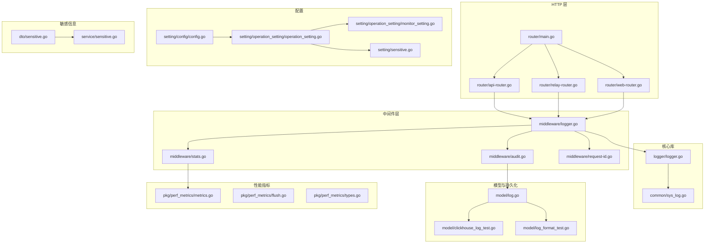
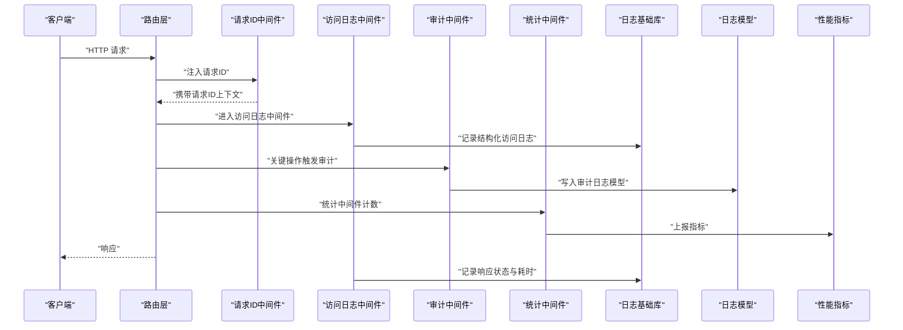
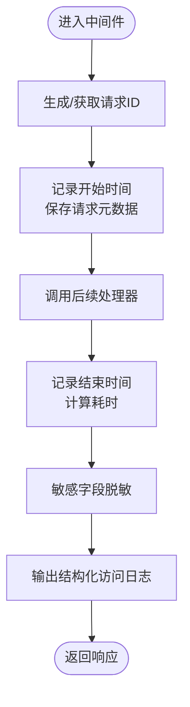
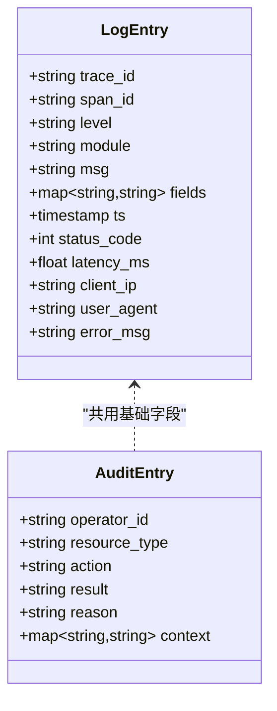
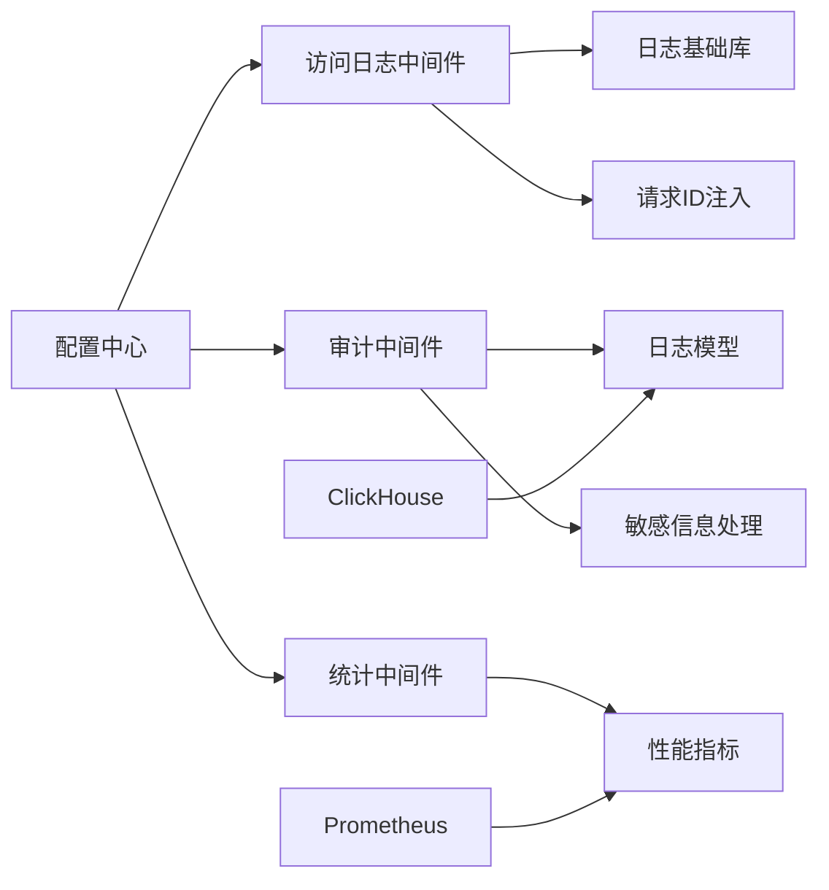

# 日志分析

<cite>
**本文引用的文件**   
- [logger.go](file://logger/logger.go)
- [logger.go](file://middleware/logger.go)
- [sys_log.go](file://common/sys_log.go)
- [log.go](file://model/log.go)
- [clickhouse_log_test.go](file://model/clickhouse_log_test.go)
- [log_format_test.go](file://model/log_format_test.go)
- [audit.go](file://middleware/audit.go)
- [stats.go](file://middleware/stats.go)
- [request-id.go](file://middleware/request-id.go)
- [api-router.go](file://router/api-router.go)
- [relay-router.go](file://router/relay-router.go)
- [web-router.go](file://router/web-router.go)
- [main.go](file://router/main.go)
- [config.go](file://setting/config/config.go)
- [operation_setting.go](file://setting/operation_setting/operation_setting.go)
- [monitor_setting.go](file://setting/operation_setting/monitor_setting.go)
- [sensitive.go](file://dto/sensitive.go)
- [sensitive.go](file://service/sensitive.go)
- [sensitive.go](file://setting/sensitive.go)
- [perflib.go](file://pkg/perf_metrics/metrics.go)
- [flush.go](file://pkg/perf_metrics/flush.go)
- [types.go](file://pkg/perf_metrics/types.go)
</cite>

## 目录
1. [简介](#简介)
2. [项目结构](#项目结构)
3. [核心组件](#核心组件)
4. [架构总览](#架构总览)
5. [详细组件分析](#详细组件分析)
6. [依赖关系分析](#依赖关系分析)
7. [性能考量](#性能考量)
8. [故障排查指南](#故障排查指南)
9. [结论](#结论)
10. [附录](#附录)

## 简介
本文件面向日志分析，围绕以下目标展开：
- 日志级别配置与结构化日志格式
- 日志轮转与日志聚合（含 ClickHouse）
- 请求追踪、错误日志、访问日志与业务日志的完整分析方法
- 日志采样、敏感信息脱敏与存储优化策略
- 常用查询模式、告警规则与可视化配置实践

本项目在 Go 后端中通过中间件与模型层实现统一的日志采集、格式化与输出；同时提供审计日志、统计指标与 ClickHouse 集成能力，便于集中化分析与可视化。

## 项目结构
与日志相关的关键位置如下：
- 日志初始化与基础能力：logger/logger.go
- 请求级日志中间件：middleware/logger.go
- 系统日志工具：common/sys_log.go
- 日志数据模型与测试：model/log.go, model/clickhouse_log_test.go, model/log_format_test.go
- 审计与统计中间件：middleware/audit.go, middleware/stats.go
- 请求ID注入：middleware/request-id.go
- 路由注册入口：router/*-router.go, router/main.go
- 配置项：setting/config/config.go, setting/operation_setting/*.go
- 敏感信息处理：dto/sensitive.go, service/sensitive.go, setting/sensitive.go
- 性能指标：pkg/perf_metrics/*

图表来源
- [main.go](file://router/main.go)
- [api-router.go](file://router/api-router.go)
- [relay-router.go](file://router/relay-router.go)
- [web-router.go](file://router/web-router.go)
- [logger.go](file://middleware/logger.go)
- [audit.go](file://middleware/audit.go)
- [stats.go](file://middleware/stats.go)
- [request-id.go](file://middleware/request-id.go)
- [logger.go](file://logger/logger.go)
- [sys_log.go](file://common/sys_log.go)
- [log.go](file://model/log.go)
- [clickhouse_log_test.go](file://model/clickhouse_log_test.go)
- [log_format_test.go](file://model/log_format_test.go)
- [config.go](file://setting/config/config.go)
- [operation_setting.go](file://setting/operation_setting/operation_setting.go)
- [monitor_setting.go](file://setting/operation_setting/monitor_setting.go)
- [sensitive.go](file://setting/sensitive.go)
- [sensitive.go](file://dto/sensitive.go)
- [sensitive.go](file://service/sensitive.go)
- [metrics.go](file://pkg/perf_metrics/metrics.go)
- [flush.go](file://pkg/perf_metrics/flush.go)
- [types.go](file://pkg/perf_metrics/types.go)

章节来源
- [main.go](file://router/main.go)
- [api-router.go](file://router/api-router.go)
- [relay-router.go](file://router/relay-router.go)
- [web-router.go](file://router/web-router.go)
- [logger.go](file://middleware/logger.go)
- [logger.go](file://logger/logger.go)
- [sys_log.go](file://common/sys_log.go)
- [log.go](file://model/log.go)
- [clickhouse_log_test.go](file://model/clickhouse_log_test.go)
- [log_format_test.go](file://model/log_format_test.go)
- [config.go](file://setting/config/config.go)
- [operation_setting.go](file://setting/operation_setting/operation_setting.go)
- [monitor_setting.go](file://setting/operation_setting/monitor_setting.go)
- [sensitive.go](file://setting/sensitive.go)
- [sensitive.go](file://dto/sensitive.go)
- [sensitive.go](file://service/sensitive.go)
- [metrics.go](file://pkg/perf_metrics/metrics.go)
- [flush.go](file://pkg/perf_metrics/flush.go)
- [types.go](file://pkg/perf_metrics/types.go)

## 核心组件
- 日志基础库：负责日志初始化、级别控制、输出通道与结构化字段构建。
- 请求级日志中间件：统一记录访问日志（请求方法、路径、状态码、耗时、客户端IP等），并注入请求ID。
- 审计日志中间件：记录关键操作审计事件，便于合规与问题回溯。
- 统计中间件：收集性能指标（QPS、延迟分布、错误率等）。
- 日志模型与测试：定义日志数据结构、序列化格式与 ClickHouse 写入样例。
- 配置模块：集中管理日志级别、输出方式、采样率、脱敏策略与监控阈值。
- 敏感信息处理：对令牌、密钥、手机号、邮箱等敏感字段进行掩码或移除。
- 性能指标：以 Prometheus 风格暴露指标，支持外部采集与告警。

章节来源
- [logger.go](file://logger/logger.go)
- [logger.go](file://middleware/logger.go)
- [audit.go](file://middleware/audit.go)
- [stats.go](file://middleware/stats.go)
- [request-id.go](file://middleware/request-id.go)
- [log.go](file://model/log.go)
- [clickhouse_log_test.go](file://model/clickhouse_log_test.go)
- [log_format_test.go](file://model/log_format_test.go)
- [config.go](file://setting/config/config.go)
- [operation_setting.go](file://setting/operation_setting/operation_setting.go)
- [monitor_setting.go](file://setting/operation_setting/monitor_setting.go)
- [sensitive.go](file://dto/sensitive.go)
- [sensitive.go](file://service/sensitive.go)
- [sensitive.go](file://setting/sensitive.go)
- [metrics.go](file://pkg/perf_metrics/metrics.go)
- [flush.go](file://pkg/perf_metrics/flush.go)
- [types.go](file://pkg/perf_metrics/types.go)

## 架构总览
下图展示了从 HTTP 请求进入，到日志采集、格式化、审计与指标上报的整体流程。

图表来源
- [api-router.go](file://router/api-router.go)
- [relay-router.go](file://router/relay-router.go)
- [web-router.go](file://router/web-router.go)
- [request-id.go](file://middleware/request-id.go)
- [logger.go](file://middleware/logger.go)
- [audit.go](file://middleware/audit.go)
- [stats.go](file://middleware/stats.go)
- [logger.go](file://logger/logger.go)
- [log.go](file://model/log.go)
- [metrics.go](file://pkg/perf_metrics/metrics.go)

## 详细组件分析

### 日志基础库与级别配置
- 功能要点
  - 初始化全局日志器，设置默认级别与输出目标（控制台/文件/远程）。
  - 提供结构化字段追加能力（如 trace_id、span_id、user_id、endpoint、method、status_code、latency_ms 等）。
  - 支持按模块或按请求动态调整级别，便于调试与生产隔离。
- 配置项建议
  - 日志级别：DEBUG/INFO/WARN/ERROR 四级，生产默认 INFO。
  - 输出：stdout、json 文件、syslog、HTTP 回调（用于聚合）。
  - 采样：按请求或按事件类型采样，降低高吞吐场景开销。
- 参考实现位置
  - 日志初始化与级别控制：[logger.go](file://logger/logger.go)
  - 系统日志封装：[sys_log.go](file://common/sys_log.go)

章节来源
- [logger.go](file://logger/logger.go)
- [sys_log.go](file://common/sys_log.go)

### 访问日志中间件（请求追踪）
- 功能要点
  - 统一记录请求方法、路径、协议版本、客户端 IP、User-Agent、请求体大小、响应状态码、耗时、错误信息等。
  - 注入并透传请求ID，便于跨服务链路追踪。
  - 结合敏感信息处理，避免记录敏感字段。
- 典型字段
  - trace_id、span_id、req_method、req_path、req_query、resp_status、latency_ms、client_ip、user_agent、error_msg、bytes_in、bytes_out
- 参考实现位置
  - 访问日志中间件：[logger.go](file://middleware/logger.go)
  - 请求ID注入：[request-id.go](file://middleware/request-id.go)

图表来源
- [logger.go](file://middleware/logger.go)
- [request-id.go](file://middleware/request-id.go)

章节来源
- [logger.go](file://middleware/logger.go)
- [request-id.go](file://middleware/request-id.go)

### 审计日志中间件（业务日志）
- 功能要点
  - 针对关键操作（用户登录、权限变更、计费结算、渠道配置修改等）记录审计事件。
  - 包含操作人、资源标识、动作类型、结果、原因、上下文快照等。
- 参考实现位置
  - 审计中间件：[audit.go](file://middleware/audit.go)
  - 日志模型：[log.go](file://model/log.go)

章节来源
- [audit.go](file://middleware/audit.go)
- [log.go](file://model/log.go)

### 统计中间件（性能指标）
- 功能要点
  - 统计 QPS、P50/P90/P99 延迟、错误率、上游调用成功率等。
  - 将指标暴露给监控系统（Prometheus 或类似）。
- 参考实现位置
  - 统计中间件：[stats.go](file://middleware/stats.go)
  - 指标定义与导出：[metrics.go](file://pkg/perf_metrics/metrics.go), [types.go](file://pkg/perf_metrics/types.go), [flush.go](file://pkg/perf_metrics/flush.go)

章节来源
- [stats.go](file://middleware/stats.go)
- [metrics.go](file://pkg/perf_metrics/metrics.go)
- [types.go](file://pkg/perf_metrics/types.go)
- [flush.go](file://pkg/perf_metrics/flush.go)

### 日志模型与结构化格式
- 功能要点
  - 定义日志结构体，包含通用字段与扩展字段。
  - 提供 JSON 序列化与 ClickHouse 写入适配。
  - 通过测试用例验证格式稳定性与兼容性。
- 参考实现位置
  - 日志模型与测试：[log.go](file://model/log.go), [log_format_test.go](file://model/log_format_test.go)
  - ClickHouse 写入示例：[clickhouse_log_test.go](file://model/clickhouse_log_test.go)

图表来源
- [log.go](file://model/log.go)

章节来源
- [log.go](file://model/log.go)
- [log_format_test.go](file://model/log_format_test.go)
- [clickhouse_log_test.go](file://model/clickhouse_log_test.go)

### 敏感信息脱敏
- 功能要点
  - 对令牌、密钥、手机号、邮箱、身份证等敏感字段进行掩码或移除。
  - 支持按字段名白名单/黑名单策略配置。
  - 在访问日志与审计日志中统一应用。
- 参考实现位置
  - DTO 敏感字段定义：[sensitive.go](file://dto/sensitive.go)
  - 服务层脱敏逻辑：[sensitive.go](file://service/sensitive.go)
  - 配置项：[sensitive.go](file://setting/sensitive.go)

章节来源
- [sensitive.go](file://dto/sensitive.go)
- [sensitive.go](file://service/sensitive.go)
- [sensitive.go](file://setting/sensitive.go)

### 日志轮转与聚合
- 日志轮转
  - 基于配置文件指定输出文件路径、大小限制、保留天数、压缩策略。
  - 支持多输出目标（stdout、文件、syslog、HTTP 回调）。
- 日志聚合
  - 通过 HTTP 回调或 SDK 将日志发送到集中式平台（如 ELK、ClickHouse、SLS）。
  - 使用批量发送与重试机制提升可靠性。
- 参考实现位置
  - 配置中心：[config.go](file://setting/config/config.go), [operation_setting.go](file://setting/operation_setting/operation_setting.go), [monitor_setting.go](file://setting/operation_setting/monitor_setting.go)
  - 日志模型与 ClickHouse 适配：[log.go](file://model/log.go), [clickhouse_log_test.go](file://model/clickhouse_log_test.go)

章节来源
- [config.go](file://setting/config/config.go)
- [operation_setting.go](file://setting/operation_setting/operation_setting.go)
- [monitor_setting.go](file://setting/operation_setting/monitor_setting.go)
- [log.go](file://model/log.go)
- [clickhouse_log_test.go](file://model/clickhouse_log_test.go)

### 请求追踪与链路分析
- 功能要点
  - 每个请求分配唯一 trace_id，贯穿中间件、业务逻辑与下游调用。
  - 在结构化日志中固定包含 trace_id，便于检索与关联。
  - 可结合分布式追踪系统（OpenTelemetry/Jaeger）进行端到端分析。
- 参考实现位置
  - 请求ID注入：[request-id.go](file://middleware/request-id.go)
  - 访问日志中间件：[logger.go](file://middleware/logger.go)

章节来源
- [request-id.go](file://middleware/request-id.go)
- [logger.go](file://middleware/logger.go)

### 错误日志分析方法
- 关注点
  - 错误码、错误消息、堆栈信息、触发上下文（请求参数、用户角色、渠道配置）。
  - 错误率趋势、热点接口、上游失败原因分类。
- 分析方法
  - 过滤 level=ERROR 且包含特定错误码的日志。
  - 结合 trace_id 定位具体请求链路。
  - 关联审计日志确认是否由配置变更或权限问题引起。
- 参考实现位置
  - 访问日志中间件：[logger.go](file://middleware/logger.go)
  - 审计中间件：[audit.go](file://middleware/audit.go)
  - 日志模型：[log.go](file://model/log.go)

章节来源
- [logger.go](file://middleware/logger.go)
- [audit.go](file://middleware/audit.go)
- [log.go](file://model/log.go)

### 访问日志分析方法
- 关注点
  - 请求量、状态码分布、延迟分布、客户端分布、Top 接口。
  - 异常请求（4xx/5xx）、慢请求、大请求体。
- 分析方法
  - 按时间窗口聚合状态码与延迟分位。
  - 结合 trace_id 深入分析单个请求。
  - 关联上游调用日志定位瓶颈。
- 参考实现位置
  - 访问日志中间件：[logger.go](file://middleware/logger.go)
  - 统计中间件：[stats.go](file://middleware/stats.go)

章节来源
- [logger.go](file://middleware/logger.go)
- [stats.go](file://middleware/stats.go)

### 业务日志分析方法
- 关注点
  - 关键业务流程（注册、充值、订阅、支付、渠道切换）的状态变化与结果。
  - 操作审计（谁、在何时、做了什么、结果如何）。
- 分析方法
  - 按业务域筛选审计事件，结合用户与资源维度分析。
  - 关联访问日志与错误日志，还原业务失败根因。
- 参考实现位置
  - 审计中间件：[audit.go](file://middleware/audit.go)
  - 日志模型：[log.go](file://model/log.go)

章节来源
- [audit.go](file://middleware/audit.go)
- [log.go](file://model/log.go)

## 依赖关系分析
- 中间件依赖
  - 访问日志中间件依赖请求ID注入与日志基础库。
  - 审计中间件依赖日志模型与敏感信息处理。
  - 统计中间件依赖性能指标模块。
- 配置依赖
  - 日志级别、输出、采样、脱敏策略均通过配置中心统一管理。
- 外部依赖
  - ClickHouse 写入、Prometheus 指标暴露、HTTP 回调聚合。

图表来源
- [logger.go](file://middleware/logger.go)
- [request-id.go](file://middleware/request-id.go)
- [audit.go](file://middleware/audit.go)
- [log.go](file://model/log.go)
- [sensitive.go](file://service/sensitive.go)
- [stats.go](file://middleware/stats.go)
- [metrics.go](file://pkg/perf_metrics/metrics.go)
- [config.go](file://setting/config/config.go)

章节来源
- [logger.go](file://middleware/logger.go)
- [request-id.go](file://middleware/request-id.go)
- [audit.go](file://middleware/audit.go)
- [log.go](file://model/log.go)
- [sensitive.go](file://service/sensitive.go)
- [stats.go](file://middleware/stats.go)
- [metrics.go](file://pkg/perf_metrics/metrics.go)
- [config.go](file://setting/config/config.go)

## 性能考量
- 日志采样
  - 在高吞吐场景下启用采样，按请求或事件类型比例采样，降低 I/O 压力。
- 异步写入
  - 使用缓冲队列与批量写入，减少阻塞主流程。
- 字段裁剪
  - 仅记录必要字段，避免大对象与冗余信息。
- 指标上报
  - 使用计数器与直方图，避免高频同步写盘。
- 参考实现位置
  - 配置中心：[config.go](file://setting/config/config.go), [operation_setting.go](file://setting/operation_setting/operation_setting.go)
  - 性能指标：[metrics.go](file://pkg/perf_metrics/metrics.go), [flush.go](file://pkg/perf_metrics/flush.go), [types.go](file://pkg/perf_metrics/types.go)

章节来源
- [config.go](file://setting/config/config.go)
- [operation_setting.go](file://setting/operation_setting/operation_setting.go)
- [metrics.go](file://pkg/perf_metrics/metrics.go)
- [flush.go](file://pkg/perf_metrics/flush.go)
- [types.go](file://pkg/perf_metrics/types.go)

## 故障排查指南
- 常见问题
  - 日志缺失：检查中间件链路与日志级别配置。
  - 乱码或格式错误：确认 JSON 序列化与字符集设置。
  - 性能下降：开启采样、减少字段、异步写入。
  - 敏感泄露：校验脱敏策略与字段白名单。
- 排查步骤
  - 使用 trace_id 定位请求链路。
  - 过滤 ERROR 日志与错误码，结合审计日志确认上下文。
  - 查看统计指标，识别热点接口与异常峰值。
- 参考实现位置
  - 访问日志中间件：[logger.go](file://middleware/logger.go)
  - 审计中间件：[audit.go](file://middleware/audit.go)
  - 统计中间件：[stats.go](file://middleware/stats.go)
  - 日志模型：[log.go](file://model/log.go)

章节来源
- [logger.go](file://middleware/logger.go)
- [audit.go](file://middleware/audit.go)
- [stats.go](file://middleware/stats.go)
- [log.go](file://model/log.go)

## 结论
本项目通过中间件与模型层实现了统一的日志采集、格式化与输出，结合审计与指标能力，为请求追踪、错误分析、访问统计与业务审计提供了完整支撑。配合配置中心的级别、采样、脱敏与聚合策略，可在不同环境下灵活调整，满足开发与生产需求。建议在大规模部署时强化采样与异步写入，并结合 ClickHouse 与 Prometheus 实现集中化分析与可视化。

## 附录
- 常用查询模式
  - 错误日志：level=ERROR 且包含特定错误码
  - 慢请求：latency_ms > 阈值
  - 访问统计：按接口与时间窗口聚合状态码与延迟分位
  - 审计事件：按操作人与资源维度筛选
- 告警规则建议
  - 错误率突增（5xx 占比超过阈值）
  - 慢请求比例上升（P99 延迟超过阈值）
  - 审计异常（权限变更、配置修改频率异常）
- 可视化配置
  - 使用仪表盘展示 QPS、延迟分布、错误率趋势
  - 使用表格与详情面板展示单条日志与审计事件
  - 结合 trace_id 进行链路钻取