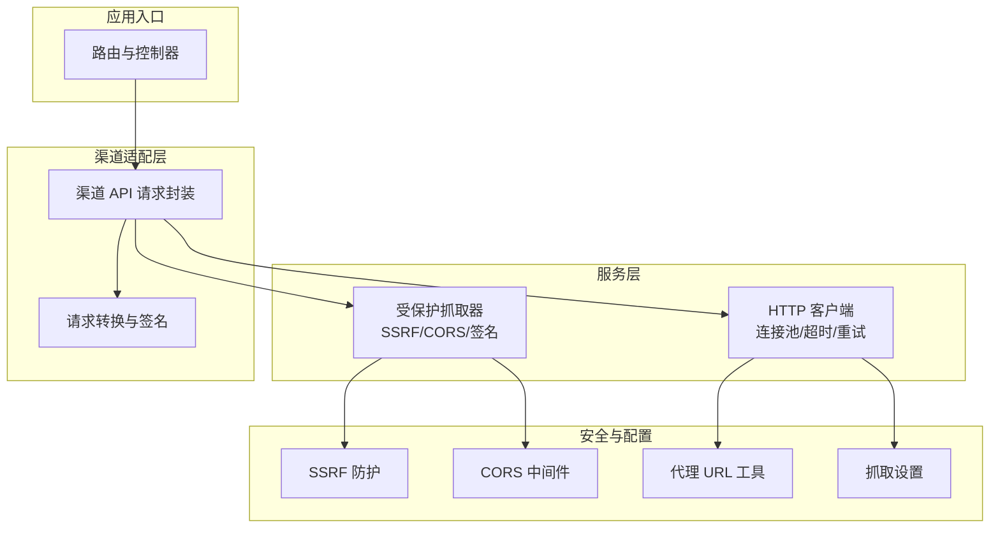
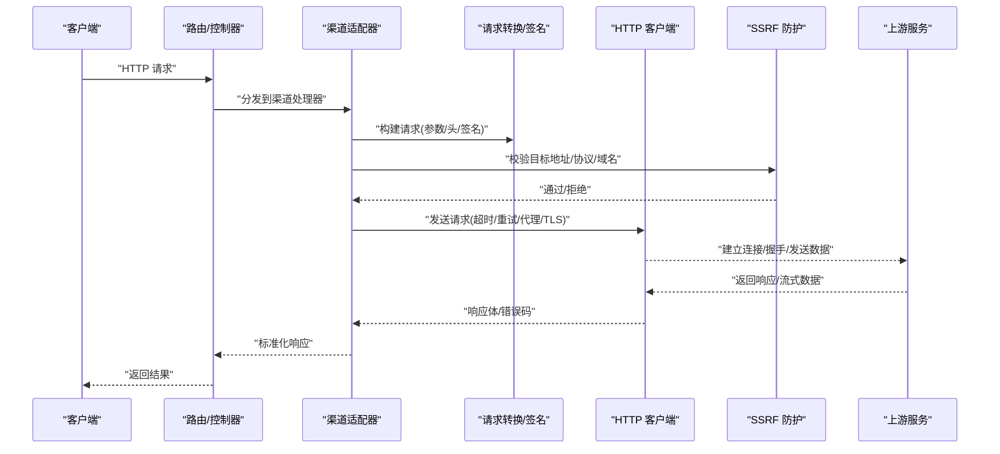
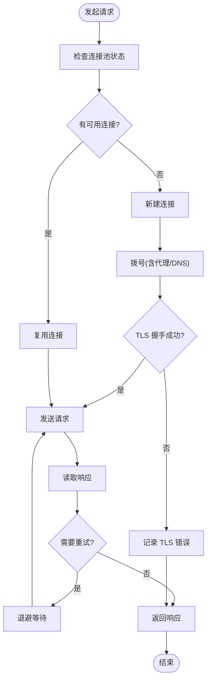
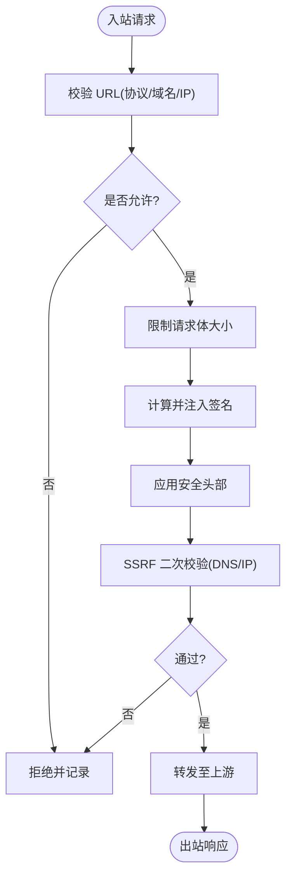
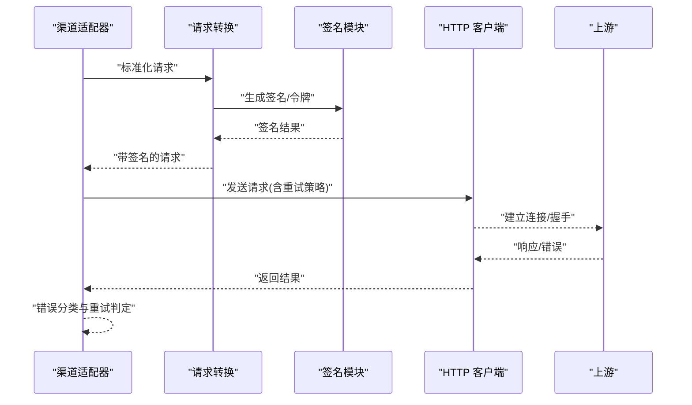
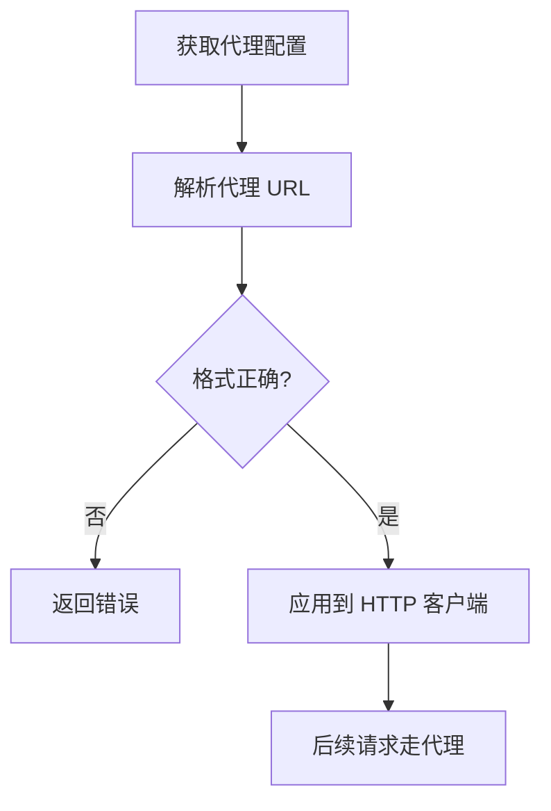
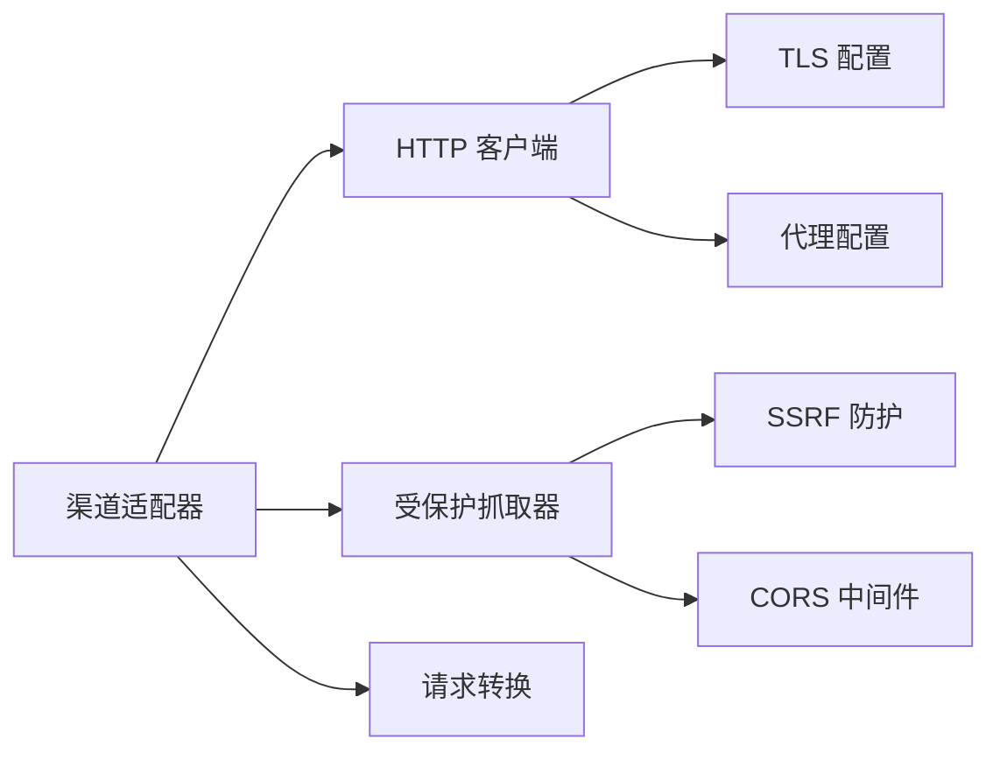

# 网络连接问题

<cite>
**本文引用的文件**   
- [service/http_client.go](file://service/http_client.go)
- [service/protected_fetch_client.go](file://service/protected_fetch_client.go)
- [common/ssrf_protection.go](file://common/ssrf_protection.go)
- [middleware/cors.go](file://middleware/cors.go)
- [setting/system_setting/fetch_setting.go](file://setting/system_setting/fetch_setting.go)
- [pkg/ionet/client.go](file://pkg/ionet/client.go)
- [relay/channel/api_request.go](file://relay/channel/api_request.go)
- [relay/common/request_conversion.go](file://relay/common/request_conversion.go)
- [common/proxy_url.go](file://common/proxy_url.go)
- [setting/operation_setting/general_setting.go](file://setting/operation_setting/general_setting.go)
</cite>

## 目录
1. [简介](#简介)
2. [项目结构](#项目结构)
3. [核心组件](#核心组件)
4. [架构总览](#架构总览)
5. [详细组件分析](#详细组件分析)
6. [依赖关系分析](#依赖关系分析)
7. [性能考虑](#性能考虑)
8. [故障排查指南](#故障排查指南)
9. [结论](#结论)
10. [附录](#附录)

## 简介
本文件聚焦于“网络连接问题”的完整技术文档，覆盖 HTTP 客户端配置、代理设置、SSL/TLS 安全传输、跨域处理（CORS）、SSRF 防护、请求签名与认证、连接池与重试机制、网络诊断与监控、带宽优化等主题。内容基于代码库中的实际实现进行梳理，并提供可操作的配置建议与排障步骤，帮助读者快速定位并解决 DNS 解析失败、连接超时、SSL 握手错误、代理配置异常等常见问题。

## 项目结构
本项目在网络相关能力上采用分层设计：
- 系统级 HTTP 客户端与受保护抓取器：负责全局连接池、TLS、代理、超时、重试等基础能力
- 渠道转发层：将上游 API 请求标准化，统一构建请求头、签名、重试策略
- 安全与合规：SSRF 防护、URL 校验、可信代理、CORS
- 配置中心：集中管理抓取、代理、通道行为等运行时参数

图表来源
- [service/http_client.go](file://service/http_client.go)
- [service/protected_fetch_client.go](file://service/protected_fetch_client.go)
- [common/ssrf_protection.go](file://common/ssrf_protection.go)
- [middleware/cors.go](file://middleware/cors.go)
- [relay/channel/api_request.go](file://relay/channel/api_request.go)
- [relay/common/request_conversion.go](file://relay/common/request_conversion.go)
- [common/proxy_url.go](file://common/proxy_url.go)
- [setting/system_setting/fetch_setting.go](file://setting/system_setting/fetch_setting.go)

章节来源
- [service/http_client.go](file://service/http_client.go)
- [service/protected_fetch_client.go](file://service/protected_fetch_client.go)
- [common/ssrf_protection.go](file://common/ssrf_protection.go)
- [middleware/cors.go](file://middleware/cors.go)
- [relay/channel/api_request.go](file://relay/channel/api_request.go)
- [relay/common/request_conversion.go](file://relay/common/request_conversion.go)
- [common/proxy_url.go](file://common/proxy_url.go)
- [setting/system_setting/fetch_setting.go](file://setting/system_setting/fetch_setting.go)

## 核心组件
- HTTP 客户端（连接池、超时、重试）
  - 负责创建和管理底层 HTTP 传输，支持连接复用、并发限制、读写超时、空闲连接回收、重试策略等
  - 典型配置项包括最大空闲连接数、每主机最大连接数、连接超时、请求超时、响应体读取超时、是否启用 gzip、重试次数与退避策略
- 受保护抓取器（SSRF、CORS、签名）
  - 在发起外部请求前执行目标地址校验、协议白名单、内网段拦截、DNS 预解析控制
  - 可选注入签名头、鉴权头、重放保护、请求体大小限制
- 渠道 API 请求封装
  - 统一构造上游请求，处理路径拼接、查询参数、Header 透传、签名算法、重试与熔断
- 代理与 TLS
  - 支持 HTTP/HTTPS/SOCKS5 代理，环境变量或配置驱动；TLS 证书链、最小版本、加密套件选择、服务端证书校验
- 跨域处理（CORS）
  - 允许源、方法、头部、凭据、预检缓存时长等

章节来源
- [service/http_client.go](file://service/http_client.go)
- [service/protected_fetch_client.go](file://service/protected_fetch_client.go)
- [relay/channel/api_request.go](file://relay/channel/api_request.go)
- [relay/common/request_conversion.go](file://relay/common/request_conversion.go)
- [common/proxy_url.go](file://common/proxy_url.go)
- [setting/system_setting/fetch_setting.go](file://setting/system_setting/fetch_setting.go)

## 架构总览
下图展示了从请求进入路由到最终调用上游渠道的端到端流程，以及关键的安全与网络控制点。

图表来源
- [relay/channel/api_request.go](file://relay/channel/api_request.go)
- [relay/common/request_conversion.go](file://relay/common/request_conversion.go)
- [service/http_client.go](file://service/http_client.go)
- [service/protected_fetch_client.go](file://service/protected_fetch_client.go)
- [common/ssrf_protection.go](file://common/ssrf_protection.go)

## 详细组件分析

### HTTP 客户端与连接池
- 连接池与并发
  - 通过连接池复用 TCP 连接，减少握手开销；按主机维度限制最大连接数，避免单目标耗尽资源
  - 空闲连接回收策略降低内存占用，提升长时运行稳定性
- 超时与重试
  - 区分连接超时、请求超时、响应体读取超时，确保不同阶段的可控性
  - 重试策略支持指数退避与抖动，针对瞬时错误（如 5xx、网络抖动）自动恢复
- 代理与 TLS
  - 支持通过配置或环境变量注入代理；TLS 可指定证书、跳过校验（不推荐生产）、最小版本与加密套件
- 监控与诊断
  - 暴露连接池指标（活跃连接、等待队列、分配/释放计数），便于容量规划与瓶颈定位

图表来源
- [service/http_client.go](file://service/http_client.go)
- [common/proxy_url.go](file://common/proxy_url.go)

章节来源
- [service/http_client.go](file://service/http_client.go)
- [common/proxy_url.go](file://common/proxy_url.go)

### 受保护抓取器与 SSRF 防护
- 目标地址校验
  - 协议白名单（仅允许 http/https）
  - 禁止内网段与回环地址访问
  - 域名解析控制：可禁用 DNS 解析或使用固定 IP
- 请求体与头部限制
  - 限制最大请求体大小，防止大体积攻击
  - 过滤危险头部，避免越权或信息泄露
- 签名与鉴权
  - 为特定上游注入签名头或查询参数，保证请求不可篡改
- 跨域处理
  - 在网关层统一处理 CORS 预检与实际请求，避免前端跨域失败

图表来源
- [service/protected_fetch_client.go](file://service/protected_fetch_client.go)
- [common/ssrf_protection.go](file://common/ssrf_protection.go)
- [middleware/cors.go](file://middleware/cors.go)

章节来源
- [service/protected_fetch_client.go](file://service/protected_fetch_client.go)
- [common/ssrf_protection.go](file://common/ssrf_protection.go)
- [middleware/cors.go](file://middleware/cors.go)

### 渠道 API 请求封装与签名
- 请求构建
  - 统一拼装路径、查询参数、JSON/XML 请求体
  - 透传必要头部（如用户标识、追踪 ID），同时清理敏感头
- 签名与认证
  - 根据渠道要求生成签名（HMAC、OAuth、JWT 等），注入 Authorization 或自定义头
- 重试与熔断
  - 对幂等请求启用重试；对非幂等请求谨慎使用
  - 结合错误码与速率限制进行退避与熔断

图表来源
- [relay/channel/api_request.go](file://relay/channel/api_request.go)
- [relay/common/request_conversion.go](file://relay/common/request_conversion.go)

章节来源
- [relay/channel/api_request.go](file://relay/channel/api_request.go)
- [relay/common/request_conversion.go](file://relay/common/request_conversion.go)

### 代理设置与 URL 工具
- 代理类型
  - 支持 HTTP、HTTPS、SOCKS5 代理，可通过配置或环境变量注入
- URL 解析与校验
  - 规范化代理 URL，提取主机、端口、用户名、密码
  - 校验协议与格式，避免非法输入导致连接失败

图表来源
- [common/proxy_url.go](file://common/proxy_url.go)
- [setting/system_setting/fetch_setting.go](file://setting/system_setting/fetch_setting.go)

章节来源
- [common/proxy_url.go](file://common/proxy_url.go)
- [setting/system_setting/fetch_setting.go](file://setting/system_setting/fetch_setting.go)

### SSL/TLS 安全传输
- 证书与校验
  - 支持自定义 CA 证书、客户端证书；生产环境必须开启服务端证书校验
- 版本与套件
  - 指定最小 TLS 版本，选择强加密套件，禁用弱算法
- 握手优化
  - 合理设置会话复用、超时与重试，降低握手失败率

章节来源
- [service/http_client.go](file://service/http_client.go)
- [service/protected_fetch_client.go](file://service/protected_fetch_client.go)

### 跨域处理（CORS）
- 允许源与方法
  - 配置允许的 Origin、Method、Header，必要时允许凭据
- 预检与缓存
  - 设置预检响应缓存时间，减少重复 OPTIONS 请求
- 错误处理
  - 对跨域错误给出明确提示，便于前端调试

章节来源
- [middleware/cors.go](file://middleware/cors.go)

### 内部网络客户端（IONET）
- 用途
  - 用于内部服务间通信，提供轻量级 HTTP 客户端与容器化部署支持
- 特点
  - 简化配置、内置健康检查与负载均衡（视实现而定）

章节来源
- [pkg/ionet/client.go](file://pkg/ionet/client.go)

## 依赖关系分析
- 低耦合高内聚
  - HTTP 客户端独立于业务逻辑，被渠道适配器与受保护抓取器复用
  - SSRF 防护作为前置校验，与请求构建和发送解耦
- 可能的循环依赖
  - 渠道适配器与请求转换之间单向依赖，避免反向引用
- 外部依赖
  - 标准库 net/http、crypto/tls、net/url 等
  - 第三方代理与 TLS 库（如有）

图表来源
- [service/http_client.go](file://service/http_client.go)
- [service/protected_fetch_client.go](file://service/protected_fetch_client.go)
- [common/ssrf_protection.go](file://common/ssrf_protection.go)
- [middleware/cors.go](file://middleware/cors.go)
- [relay/channel/api_request.go](file://relay/channel/api_request.go)
- [relay/common/request_conversion.go](file://relay/common/request_conversion.go)

章节来源
- [service/http_client.go](file://service/http_client.go)
- [service/protected_fetch_client.go](file://service/protected_fetch_client.go)
- [common/ssrf_protection.go](file://common/ssrf_protection.go)
- [middleware/cors.go](file://middleware/cors.go)
- [relay/channel/api_request.go](file://relay/channel/api_request.go)
- [relay/common/request_conversion.go](file://relay/common/request_conversion.go)

## 性能考虑
- 连接池调优
  - 根据 QPS 与平均延迟调整最大连接数与每主机上限
  - 启用连接复用与 Keep-Alive，减少握手与三次握手开销
- 超时与重试
  - 合理设置各阶段超时，避免雪崩；重试需幂等且带退避
- 压缩与带宽
  - 启用 gzip/br 压缩，减少带宽占用
  - 分块上传与流式响应，降低内存峰值
- 监控与告警
  - 采集连接池指标、错误率、P95/P99 延迟，设置阈值告警

[本节为通用指导，无需具体文件来源]

## 故障排查指南
- DNS 解析失败
  - 检查 DNS 服务器可达性与解析超时
  - 确认域名白名单与 SSRF 规则未误拦截
  - 查看日志中 DNS 错误码与重试次数
- 连接超时
  - 核对代理配置与防火墙策略
  - 检查连接池耗尽与等待队列长度
  - 适当增加连接超时与重试次数
- SSL 握手错误
  - 验证证书链完整性与有效期
  - 确认最小 TLS 版本与加密套件兼容
  - 临时关闭证书校验仅用于测试，生产务必开启
- 代理配置问题
  - 校验代理 URL 格式与认证信息
  - 测试直连与代理路径，定位代理节点故障
- 跨域错误
  - 检查 Origin、Method、Header 配置
  - 确认预检响应缓存时间与凭证设置

章节来源
- [common/ssrf_protection.go](file://common/ssrf_protection.go)
- [service/http_client.go](file://service/http_client.go)
- [service/protected_fetch_client.go](file://service/protected_fetch_client.go)
- [common/proxy_url.go](file://common/proxy_url.go)
- [middleware/cors.go](file://middleware/cors.go)

## 结论
本项目的网络连接能力以“HTTP 客户端 + 受保护抓取器 + 渠道适配器”为核心，配合 SSRF 防护、CORS、代理与 TLS 配置，形成安全、稳定、可观测的外联体系。通过合理的连接池与超时重试策略、严格的地址校验与签名机制，可有效应对常见网络问题与安全威胁。建议在生产环境中严格启用证书校验、限制协议与地址范围、完善监控与告警，持续优化性能与可靠性。

[本节为总结，无需具体文件来源]

## 附录
- 常用配置项速查
  - 连接池：最大空闲连接、每主机最大连接、连接超时、请求超时、响应体读取超时
  - 重试：最大重试次数、退避策略、抖动开关、幂等判断
  - 代理：类型、主机、端口、认证、环境变量
  - TLS：最小版本、加密套件、CA 证书、客户端证书、校验开关
  - CORS：允许源、方法、头部、凭据、预检缓存
  - SSRF：协议白名单、内网段拦截、DNS 解析控制、请求体大小限制
- 诊断工具建议
  - curl/wget：连通性与 TLS 握手测试
  - dig/nslookup：DNS 解析验证
  - tcpdump/wireshark：抓包分析握手与重传
  - 指标面板：连接池、错误率、延迟分布

[本节为通用参考，无需具体文件来源]