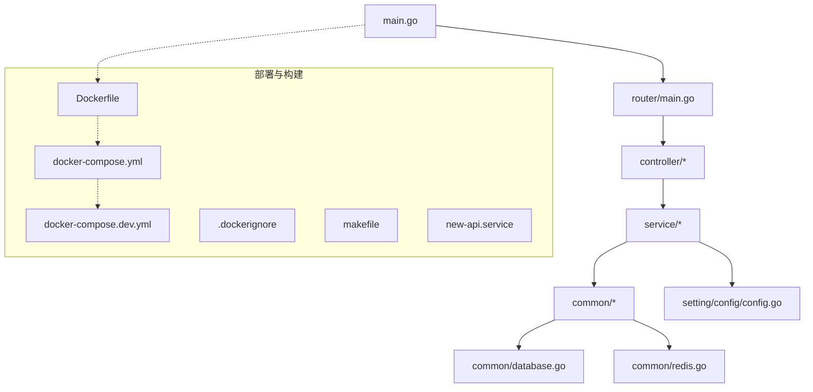
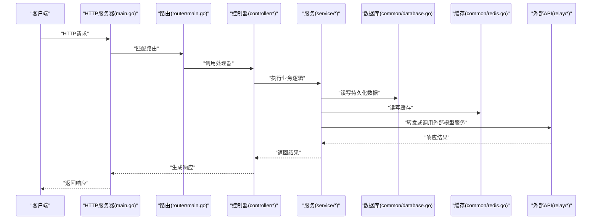
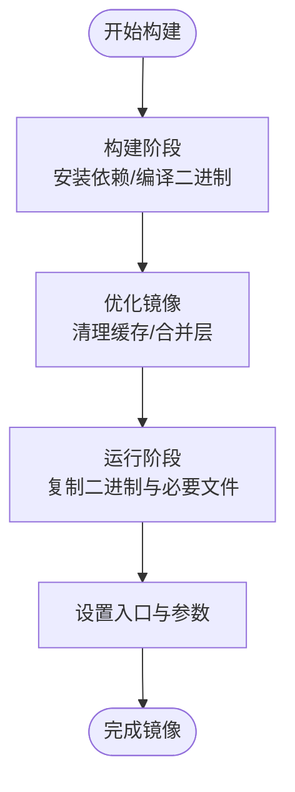
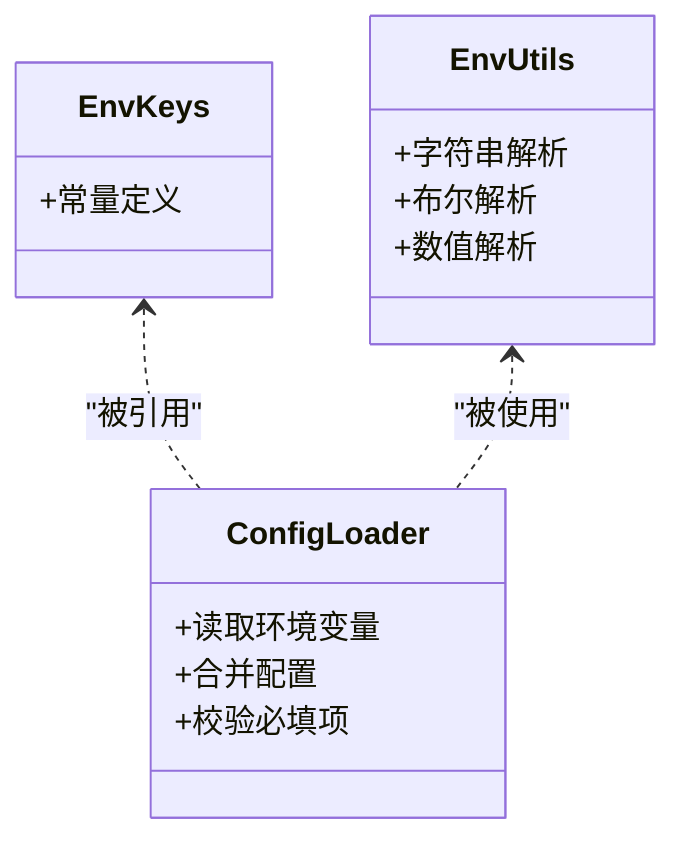
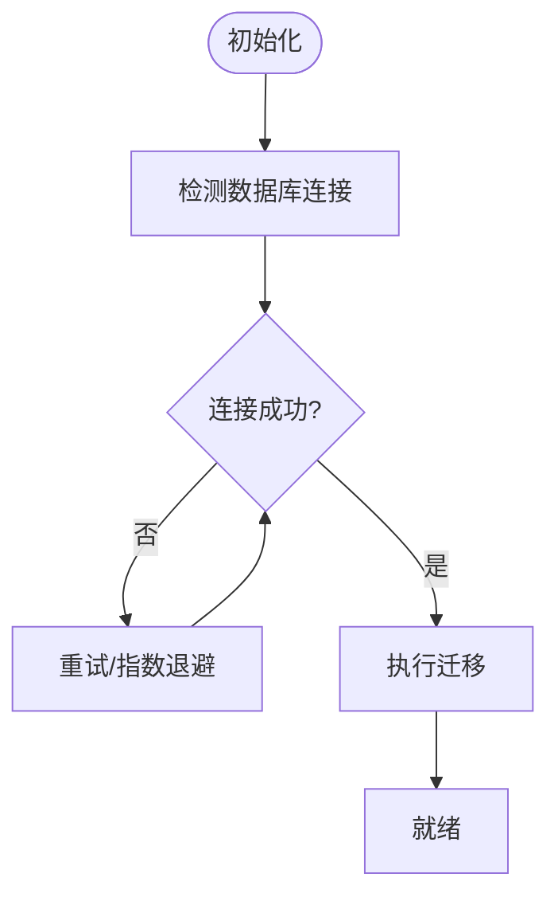
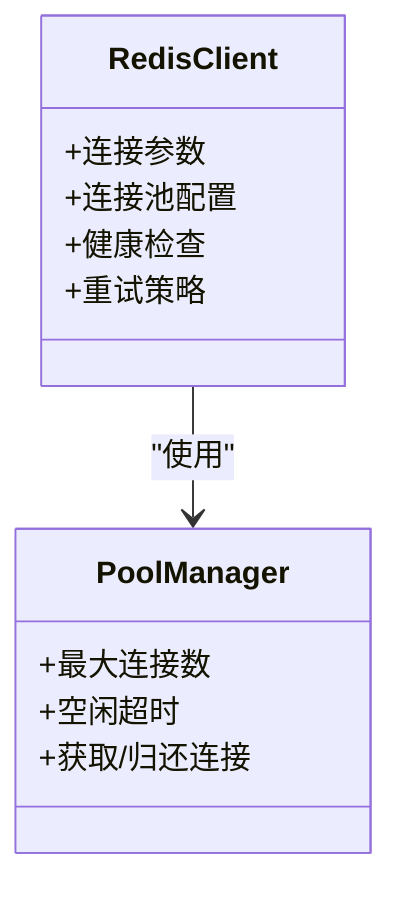
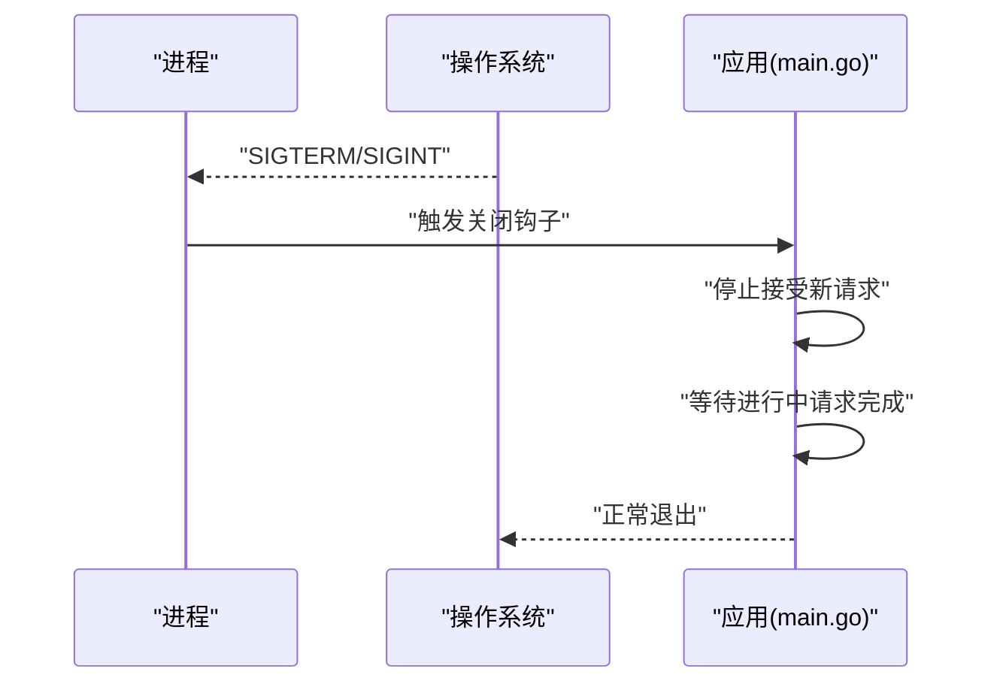
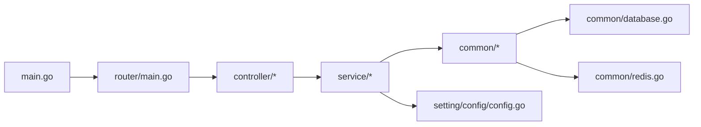

# 部署问题

<cite>
**本文引用的文件**   
- [main.go](file://main.go)
- [Dockerfile](file://Dockerfile)
- [docker-compose.yml](file://docker-compose.yml)
- [docker-compose.dev.yml](file://docker-compose.dev.yml)
- [.dockerignore](file://.dockerignore)
- [go.mod](file://go.mod)
- [common/env.go](file://common/env.go)
- [constant/env.go](file://constant/env.go)
- [setting/config/config.go](file://setting/config/config.go)
- [router/main.go](file://router/main.go)
- [common/database.go](file://common/database.go)
- [common/redis.go](file://common/redis.go)
- [pkg/ionet/deployment.go](file://pkg/ionet/deployment.go)
- [controller/deployment.go](file://controller/deployment.go)
- [new-api.service](file://new-api.service)
- [makefile](file://makefile)
</cite>

## 目录
1. [简介](#简介)
2. [项目结构](#项目结构)
3. [核心组件](#核心组件)
4. [架构总览](#架构总览)
5. [详细组件分析](#详细组件分析)
6. [依赖分析](#依赖分析)
7. [性能考虑](#性能考虑)
8. [故障排除指南](#故障排除指南)
9. [结论](#结论)
10. [附录](#附录)

## 简介
本文件面向运维与平台工程团队，聚焦容器化部署、环境变量配置、依赖管理与启动流程的实现细节。内容涵盖 Docker 构建、Kubernetes 部署与云平台部署的配置方法，记录数据库连接、Redis 配置、文件存储与网络设置的常见问题及解决方案，并给出健康检查、优雅关闭、资源限制与监控集成的最佳实践。文档同时提供不同环境的部署模板与故障排除步骤，帮助快速定位和解决问题。

## 项目结构
本项目采用 Go 后端与 Web 前端分离的架构。后端以 main.go 为入口，通过 router 层注册路由，service 层实现业务逻辑，common 层提供通用能力（数据库、缓存、限流等），setting 层管理配置项，relay 层对接多种外部模型服务。部署相关的关键文件包括 Dockerfile、docker-compose.*、systemd 单元文件以及 makefile。

图表来源
- [main.go:1-200](file://main.go#L1-L200)
- [router/main.go:1-200](file://router/main.go#L1-L200)
- [setting/config/config.go:1-200](file://setting/config/config.go#L1-L200)
- [common/database.go:1-200](file://common/database.go#L1-L200)
- [common/redis.go:1-200](file://common/redis.go#L1-L200)
- [Dockerfile:1-200](file://Dockerfile#L1-L200)
- [docker-compose.yml:1-200](file://docker-compose.yml#L1-L200)
- [docker-compose.dev.yml:1-200](file://docker-compose.dev.yml#L1-L200)
- [.dockerignore:1-200](file://.dockerignore#L1-L200)
- [makefile:1-200](file://makefile#L1-L200)
- [new-api.service:1-200](file://new-api.service#L1-L200)

章节来源
- [main.go:1-200](file://main.go#L1-L200)
- [Dockerfile:1-200](file://Dockerfile#L1-L200)
- [docker-compose.yml:1-200](file://docker-compose.yml#L1-L200)
- [docker-compose.dev.yml:1-200](file://docker-compose.dev.yml#L1-L200)
- [.dockerignore:1-200](file://.dockerignore#L1-L200)
- [makefile:1-200](file://makefile#L1-L200)

## 核心组件
- 应用入口与生命周期：main.go 负责初始化配置、日志、中间件、路由与服务器启动；router/main.go 统一挂载路由；service 层承载业务逻辑；common 层提供数据库、缓存、限流、系统监控等基础能力。
- 配置与环境变量：setting/config/config.go 集中读取与校验配置；constant/env.go 定义环境变量键名；common/env.go 提供环境变量解析工具。
- 数据访问：common/database.go 封装数据库连接与迁移；common/redis.go 封装 Redis 客户端与连接池。
- 部署与运行：Dockerfile 定义镜像构建；docker-compose.* 编排本地与开发环境；new-api.service 提供 systemd 集成；makefile 提供常用构建命令。

章节来源
- [main.go:1-200](file://main.go#L1-L200)
- [router/main.go:1-200](file://router/main.go#L1-L200)
- [setting/config/config.go:1-200](file://setting/config/config.go#L1-L200)
- [constant/env.go:1-200](file://constant/env.go#L1-L200)
- [common/env.go:1-200](file://common/env.go#L1-L200)
- [common/database.go:1-200](file://common/database.go#L1-L200)
- [common/redis.go:1-200](file://common/redis.go#L1-L200)

## 架构总览
下图展示从请求进入到后端处理、数据访问与外部依赖交互的整体流程，并标注关键部署点（健康检查、端口暴露、环境变量注入）。

图表来源
- [main.go:1-200](file://main.go#L1-L200)
- [router/main.go:1-200](file://router/main.go#L1-L200)
- [controller/deployment.go:1-200](file://controller/deployment.go#L1-L200)
- [common/database.go:1-200](file://common/database.go#L1-L200)
- [common/redis.go:1-200](file://common/redis.go#L1-L200)

## 详细组件分析

### 容器化构建与镜像优化
- 多阶段构建：使用独立构建阶段安装依赖与编译二进制，最终产物仅包含运行时所需文件，减小镜像体积。
- 依赖管理：基于 go.mod 进行依赖锁定，确保构建可重复性。
- 静态资源：前端资源在构建期打包，由后端嵌入或作为只读文件提供。
- 安全加固：非 root 用户运行、最小权限原则、敏感信息不进入镜像。

图表来源
- [Dockerfile:1-200](file://Dockerfile#L1-L200)
- [go.mod:1-200](file://go.mod#L1-L200)
- [.dockerignore:1-200](file://.dockerignore#L1-L200)

章节来源
- [Dockerfile:1-200](file://Dockerfile#L1-L200)
- [go.mod:1-200](file://go.mod#L1-L200)
- [.dockerignore:1-200](file://.dockerignore#L1-L200)

### 环境变量与配置加载
- 环境变量键：constant/env.go 定义所有环境变量键名，便于统一管理。
- 配置读取：setting/config/config.go 集中读取环境变量与配置文件，并进行默认值与校验。
- 工具函数：common/env.go 提供类型安全的解析与转换。

图表来源
- [constant/env.go:1-200](file://constant/env.go#L1-L200)
- [setting/config/config.go:1-200](file://setting/config/config.go#L1-L200)
- [common/env.go:1-200](file://common/env.go#L1-L200)

章节来源
- [constant/env.go:1-200](file://constant/env.go#L1-L200)
- [setting/config/config.go:1-200](file://setting/config/config.go#L1-L200)
- [common/env.go:1-200](file://common/env.go#L1-L200)

### 数据库连接与迁移
- 连接管理：common/database.go 负责连接池、重试与上下文超时控制。
- 迁移策略：启动时执行必要的迁移脚本，确保 schema 一致性。
- 常见错误：连接超时、认证失败、SSL/TLS 配置错误、连接池耗尽。

图表来源
- [common/database.go:1-200](file://common/database.go#L1-L200)

章节来源
- [common/database.go:1-200](file://common/database.go#L1-L200)

### Redis 配置与连接池
- 客户端初始化：common/redis.go 封装连接参数、密码、TLS、集群模式与连接池大小。
- 高可用：支持哨兵/集群模式，自动故障转移。
- 常见问题：认证失败、网络不可达、内存不足导致 OOM。

图表来源
- [common/redis.go:1-200](file://common/redis.go#L1-L200)

章节来源
- [common/redis.go:1-200](file://common/redis.go#L1-L200)

### 文件存储与上传
- 存储后端：支持本地磁盘与对象存储（如 S3 兼容），通过配置切换。
- 路径映射：将上传路径映射到容器卷或云存储桶。
- 常见问题：权限不足、路径不存在、跨域与代理头丢失。

章节来源
- [setting/config/config.go:1-200](file://setting/config/config.go#L1-L200)

### 网络与反向代理
- 监听端口：HTTP/HTTPS 端口通过环境变量配置。
- 可信代理：trusted_proxies.go 用于识别真实客户端 IP。
- 常见问题：X-Forwarded-* 头缺失、TLS 终止位置不当、CORS 配置错误。

章节来源
- [trusted_proxies.go:1-200](file://trusted_proxies.go#L1-L200)

### 启动流程与优雅关闭
- 启动顺序：加载配置 -> 初始化日志 -> 连接数据库/缓存 -> 注册路由 -> 启动 HTTP 服务器。
- 优雅关闭：捕获 SIGTERM/SIGINT，停止接收新请求，等待进行中请求完成后再退出。
- 健康检查：提供 /healthz 或自定义端点，供 Kubernetes 探针使用。

图表来源
- [main.go:1-200](file://main.go#L1-L200)

章节来源
- [main.go:1-200](file://main.go#L1-L200)

### 健康检查与探针
- 存活探针：检查进程是否存活。
- 就绪探针：检查依赖（数据库、Redis）是否就绪。
- 自定义端点：可通过 controller/deployment.go 暴露状态与指标。

章节来源
- [controller/deployment.go:1-200](file://controller/deployment.go#L1-L200)

### 资源限制与监控集成
- 资源限制：在容器编排层设置 CPU/内存限制，避免资源争用。
- 监控集成：导出系统指标与业务指标，配合 Prometheus/Grafana。
- 日志采集：结构化日志输出，便于集中收集与分析。

章节来源
- [pkg/ionet/deployment.go:1-200](file://pkg/ionet/deployment.go#L1-L200)

### 不同环境的部署模板
- 本地开发：docker-compose.dev.yml 提供一键启动后端与依赖。
- 生产环境：docker-compose.yml 定义服务、网络与卷挂载。
- 云平台：Kubernetes Deployment/Service/ConfigMap/Secret 模板，结合 Helm 管理。

章节来源
- [docker-compose.dev.yml:1-200](file://docker-compose.dev.yml#L1-L200)
- [docker-compose.yml:1-200](file://docker-compose.yml#L1-L200)

### 与系统服务集成
- systemd 单元：new-api.service 提供开机自启、重启策略与日志管理。
- 启动脚本：makefile 提供常用构建与部署命令。

章节来源
- [new-api.service:1-200](file://new-api.service#L1-L200)
- [makefile:1-200](file://makefile#L1-L200)

## 依赖分析
- 内部依赖：main.go 依赖 router、service、common、setting；service 依赖 common 与 setting。
- 外部依赖：数据库驱动、Redis 客户端、HTTP 客户端、第三方模型服务 SDK。
- 构建依赖：Go 模块版本锁定，确保可重复构建。

图表来源
- [main.go:1-200](file://main.go#L1-L200)
- [router/main.go:1-200](file://router/main.go#L1-L200)
- [setting/config/config.go:1-200](file://setting/config/config.go#L1-L200)
- [common/database.go:1-200](file://common/database.go#L1-L200)
- [common/redis.go:1-200](file://common/redis.go#L1-L200)

章节来源
- [go.mod:1-200](file://go.mod#L1-L200)
- [main.go:1-200](file://main.go#L1-L200)

## 性能考虑
- 连接池调优：根据并发量调整数据库与 Redis 连接池大小。
- 缓存策略：热点数据缓存，减少下游压力。
- 限流与降级：在网关或应用层实施限流，保护后端。
- 资源隔离：容器级别限制 CPU/内存，避免相互影响。
- 监控告警：关键指标（延迟、错误率、资源使用）接入监控系统。

## 故障排除指南
- 启动失败
  - 检查环境变量是否正确注入（密钥、连接串、端口）。
  - 查看日志输出，确认依赖连接是否成功。
  - 验证健康检查端点是否可达。
- 数据库连接失败
  - 核对主机、端口、用户名、密码与 SSL 配置。
  - 检查防火墙与安全组规则。
  - 观察连接池是否耗尽。
- Redis 连接失败
  - 核对地址、密码、TLS 与集群模式配置。
  - 检查内存与持久化配置。
- 文件上传失败
  - 检查存储路径权限与卷挂载。
  - 确认对象存储凭据与桶策略。
- 网络问题
  - 检查反向代理头与 CORS 配置。
  - 验证 DNS 解析与网络连通性。

章节来源
- [common/database.go:1-200](file://common/database.go#L1-L200)
- [common/redis.go:1-200](file://common/redis.go#L1-L200)
- [setting/config/config.go:1-200](file://setting/config/config.go#L1-L200)

## 结论
通过合理的容器化构建、环境变量管理、依赖配置与启动流程设计，可以显著提升部署稳定性与可维护性。结合健康检查、优雅关闭、资源限制与监控集成，能够在生产环境中获得更好的可靠性与可观测性。建议在不同环境使用统一的模板与流水线，确保一致性与可追溯性。

## 附录
- 环境变量清单：参考 constant/env.go 中的键名定义。
- 配置示例：参考 setting/config/config.go 中的默认值与校验逻辑。
- 构建命令：参考 makefile 中的目标。
- 编排模板：参考 docker-compose.* 与 Kubernetes 模板（如有）。

章节来源
- [constant/env.go:1-200](file://constant/env.go#L1-L200)
- [setting/config/config.go:1-200](file://setting/config/config.go#L1-L200)
- [makefile:1-200](file://makefile#L1-L200)
- [docker-compose.yml:1-200](file://docker-compose.yml#L1-L200)
- [docker-compose.dev.yml:1-200](file://docker-compose.dev.yml#L1-L200)