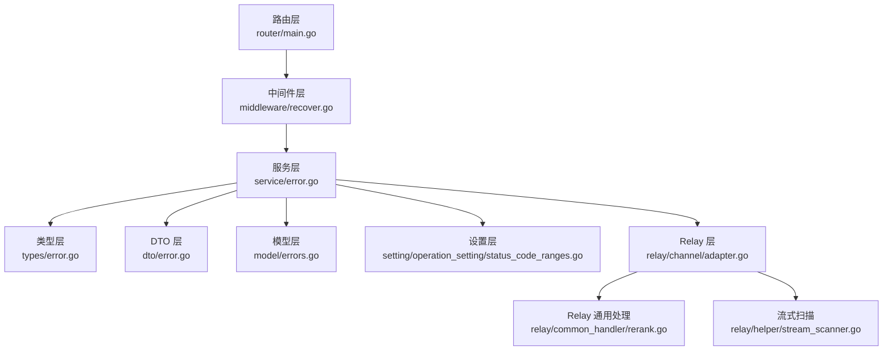
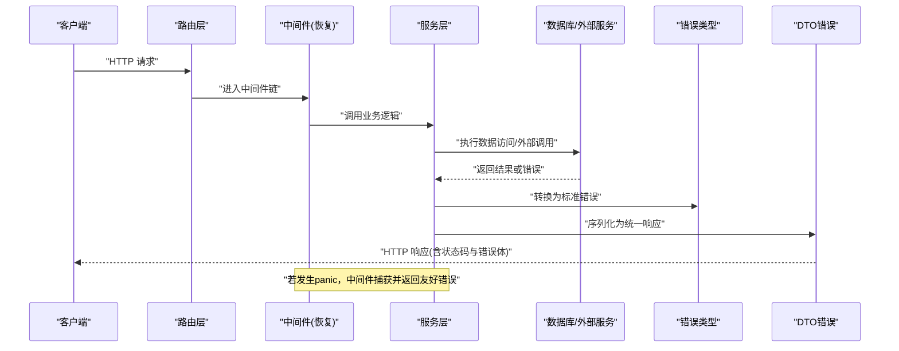
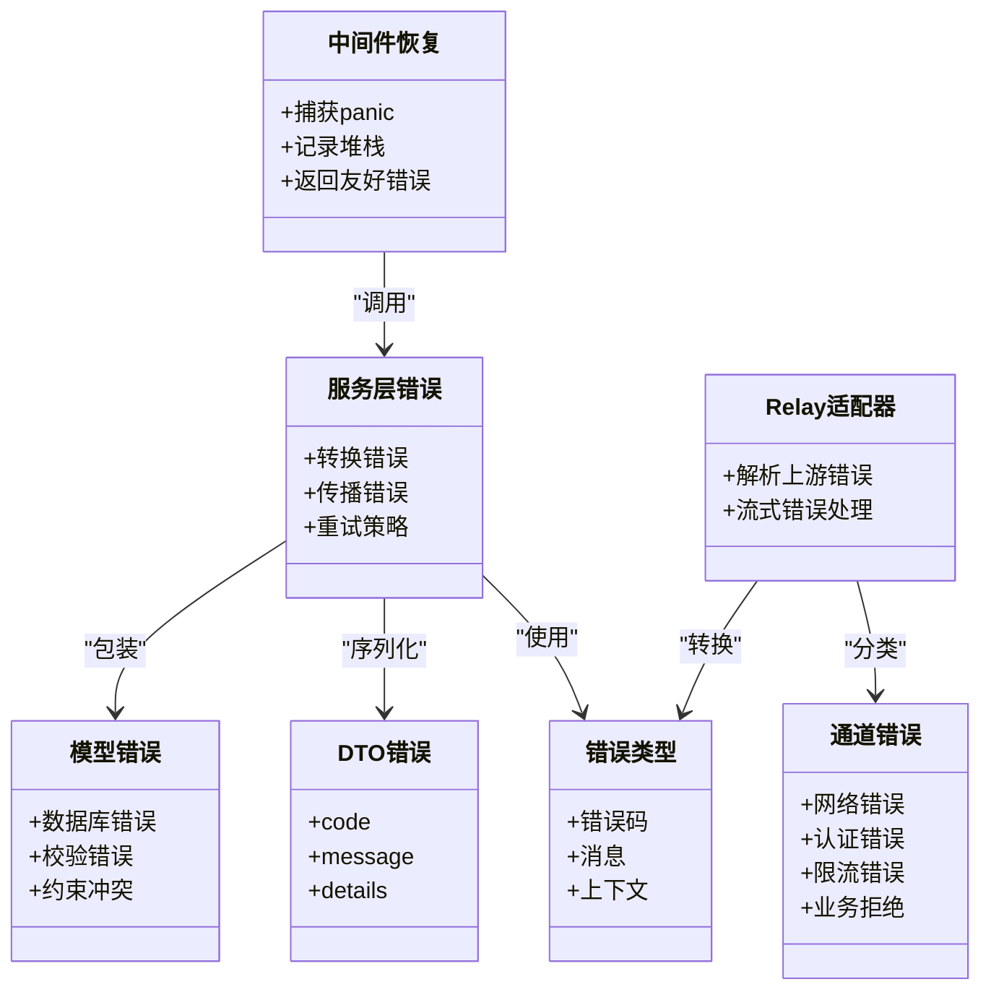

# 错误诊断

<cite>
**本文引用的文件**   
- [types/error.go](file://types/error.go)
- [types/channel_error.go](file://types/channel_error.go)
- [dto/error.go](file://dto/error.go)
- [model/errors.go](file://model/errors.go)
- [service/error.go](file://service/error.go)
- [middleware/recover.go](file://middleware/recover.go)
- [setting/operation_setting/status_code_ranges.go](file://setting/operation_setting/status_code_ranges.go)
- [relay/common_handler/rerank.go](file://relay/common_handler/rerank.go)
- [relay/helper/stream_scanner.go](file://relay/helper/stream_scanner.go)
- [relay/channel/adapter.go](file://relay/channel/adapter.go)
- [router/main.go](file://router/main.go)
</cite>

## 目录
1. [简介](#简介)
2. [项目结构](#项目结构)
3. [核心组件](#核心组件)
4. [架构总览](#架构总览)
5. [详细组件分析](#详细组件分析)
6. [依赖关系分析](#依赖关系分析)
7. [性能考量](#性能考量)
8. [故障排查指南](#故障排查指南)
9. [结论](#结论)
10. [附录](#附录)

## 简介
本文件面向错误诊断与排障，系统性梳理系统的错误分类、错误代码定义、异常处理机制与传播策略。内容覆盖：
- HTTP 状态码映射规则与业务错误类型
- 网络错误与数据库错误的识别与处理
- 错误上下文信息、错误恢复策略与重试建议
- 常见错误场景的排查步骤与解决方案

目标是帮助开发者快速定位问题根因，统一错误表达与响应格式，提升系统可观测性与稳定性。

## 项目结构
错误相关能力分布在多个层次：
- 类型层：统一的错误类型与通道错误枚举
- DTO 层：对外暴露的错误数据结构
- 模型层：持久化相关的错误定义
- 服务层：HTTP 客户端、错误转换与业务错误封装
- 中间件层：全局恢复、请求日志与异常捕获
- 路由层：统一入口与错误响应出口
- Relay 层：上游通道适配与流式扫描中的错误处理

图表来源
- [router/main.go](file://router/main.go)
- [middleware/recover.go](file://middleware/recover.go)
- [service/error.go](file://service/error.go)
- [types/error.go](file://types/error.go)
- [dto/error.go](file://dto/error.go)
- [model/errors.go](file://model/errors.go)
- [setting/operation_setting/status_code_ranges.go](file://setting/operation_setting/status_code_ranges.go)
- [relay/channel/adapter.go](file://relay/channel/adapter.go)
- [relay/common_handler/rerank.go](file://relay/common_handler/rerank.go)
- [relay/helper/stream_scanner.go](file://relay/helper/stream_scanner.go)

章节来源
- [router/main.go](file://router/main.go)
- [middleware/recover.go](file://middleware/recover.go)
- [service/error.go](file://service/error.go)
- [types/error.go](file://types/error.go)
- [dto/error.go](file://dto/error.go)
- [model/errors.go](file://model/errors.go)
- [setting/operation_setting/status_code_ranges.go](file://setting/operation_setting/status_code_ranges.go)
- [relay/channel/adapter.go](file://relay/channel/adapter.go)
- [relay/common_handler/rerank.go](file://relay/common_handler/rerank.go)
- [relay/helper/stream_scanner.go](file://relay/helper/stream_scanner.go)

## 核心组件
- 统一错误类型（类型层）
  - 提供基础错误结构、错误码与消息字段，便于跨层传递与序列化
  - 支持附加上下文（如请求ID、链路追踪、调用栈片段）
- 通道错误（类型层）
  - 针对上游通道的错误分类与状态码映射，便于区分网络、鉴权、限流、业务拒绝等
- DTO 错误（DTO 层）
  - 对外返回的统一 JSON 结构，包含 code、message、details 等
- 模型错误（模型层）
  - 数据库操作、校验失败、唯一性冲突等错误定义
- 服务层错误（服务层）
  - 将底层错误转换为业务错误，进行标准化与降级处理
- 中间件恢复（中间件层）
  - 捕获未处理 panic，记录堆栈并返回友好错误
- 状态码范围（设置层）
  - 配置化的 HTTP 状态码区间与业务错误映射规则
- Relay 适配器与流式扫描（Relay 层）
  - 上游通道错误解析、流式错误事件捕获与中断处理

章节来源
- [types/error.go](file://types/error.go)
- [types/channel_error.go](file://types/channel_error.go)
- [dto/error.go](file://dto/error.go)
- [model/errors.go](file://model/errors.go)
- [service/error.go](file://service/error.go)
- [middleware/recover.go](file://middleware/recover.go)
- [setting/operation_setting/status_code_ranges.go](file://setting/operation_setting/status_code_ranges.go)
- [relay/channel/adapter.go](file://relay/channel/adapter.go)
- [relay/common_handler/rerank.go](file://relay/common_handler/rerank.go)
- [relay/helper/stream_scanner.go](file://relay/helper/stream_scanner.go)

## 架构总览
错误在系统中的流转路径如下：
- 请求进入路由层，经中间件链（鉴权、限流、日志、恢复等）
- 控制器或服务层执行业务逻辑，调用数据库或外部 HTTP
- 遇到错误时，服务层统一转换为标准错误对象
- 根据错误类别与设置层的状态码映射，生成 HTTP 响应
- 若发生 panic，中间件恢复器捕获并输出结构化错误

图表来源
- [router/main.go](file://router/main.go)
- [middleware/recover.go](file://middleware/recover.go)
- [service/error.go](file://service/error.go)
- [types/error.go](file://types/error.go)
- [dto/error.go](file://dto/error.go)

## 详细组件分析

### 统一错误类型与错误码
- 设计要点
  - 错误码采用分层编码（模块_子模块_具体错误），便于定位
  - 错误消息支持多语言键值，便于国际化
  - 上下文字段包含请求ID、用户ID、渠道ID、时间戳等
- 使用建议
  - 所有业务错误应通过统一错误类型抛出
  - 避免直接透传底层错误，需转换为业务语义错误

章节来源
- [types/error.go](file://types/error.go)

### 通道错误分类与状态码映射
- 分类维度
  - 网络错误（连接超时、DNS解析失败、TLS握手失败）
  - 认证错误（密钥无效、权限不足、令牌过期）
  - 限流错误（配额耗尽、速率限制）
  - 业务拒绝（模型不可用、参数不合法、内容审核失败）
- 状态码映射
  - 依据设置层的状态码范围配置，将上游状态码映射为内部错误码
  - 对 4xx/5xx 进行差异化处理，支持重试与降级策略

章节来源
- [types/channel_error.go](file://types/channel_error.go)
- [setting/operation_setting/status_code_ranges.go](file://setting/operation_setting/status_code_ranges.go)

### DTO 错误结构与对外响应
- 结构字段
  - code：错误码（数字或字符串）
  - message：人类可读的错误消息
  - details：可选的详细信息（数组或对象）
- 序列化规范
  - 统一 JSON 结构，确保前端一致处理
  - 敏感信息脱敏（如密钥、完整URL）

章节来源
- [dto/error.go](file://dto/error.go)

### 模型层错误与数据库错误
- 常见错误
  - 连接失败、查询超时、事务失败
  - 唯一性约束冲突、外键约束失败
  - 数据校验失败（空值、类型不匹配）
- 处理策略
  - 包装为标准错误，附带 SQL 错误码与语句片段
  - 对可重试错误实施指数退避重试

章节来源
- [model/errors.go](file://model/errors.go)

### 服务层错误转换与传播
- 转换流程
  - 捕获底层错误（网络、数据库、第三方SDK）
  - 映射为业务错误类型，补充上下文
  - 根据错误类别决定是否重试、降级或熔断
- 传播机制
  - 错误沿调用栈向上返回，携带请求ID与链路信息
  - 在边界处（控制器/网关）转换为 HTTP 响应

章节来源
- [service/error.go](file://service/error.go)

### 中间件恢复与全局异常捕获
- 功能特性
  - 捕获 panic，记录堆栈与请求上下文
  - 返回统一错误响应，避免进程崩溃
  - 触发告警与指标上报
- 最佳实践
  - 仅在关键路径启用恢复中间件
  - 避免吞掉错误，必须记录并上报

章节来源
- [middleware/recover.go](file://middleware/recover.go)

### Relay 层错误处理与流式扫描
- 适配器错误
  - 解析上游返回的错误体，提取错误码与消息
  - 对特定上游的错误进行特殊处理（如 Claude 的 usage delta 补丁）
- 流式错误
  - 在 SSE/流式响应中捕获错误事件，及时中断下游传输
  - 保证资源释放与连接清理

章节来源
- [relay/channel/adapter.go](file://relay/channel/adapter.go)
- [relay/common_handler/rerank.go](file://relay/common_handler/rerank.go)
- [relay/helper/stream_scanner.go](file://relay/helper/stream_scanner.go)

## 依赖关系分析
错误处理组件之间的依赖关系如下：
- 服务层依赖类型层与 DTO 层进行错误转换与序列化
- 中间件依赖服务层进行恢复与日志记录
- Relay 层依赖类型层与设置层进行错误分类与状态码映射
- 模型层错误由服务层统一包装

图表来源
- [types/error.go](file://types/error.go)
- [types/channel_error.go](file://types/channel_error.go)
- [dto/error.go](file://dto/error.go)
- [model/errors.go](file://model/errors.go)
- [service/error.go](file://service/error.go)
- [middleware/recover.go](file://middleware/recover.go)
- [relay/channel/adapter.go](file://relay/channel/adapter.go)

## 性能考量
- 错误对象的创建与序列化应避免频繁 GC，建议使用对象池
- 错误日志需控制级别与采样率，避免磁盘 IO 瓶颈
- 流式错误处理需及时中断，减少不必要的带宽消耗
- 重试策略需结合超时与退避算法，防止雪崩效应

## 故障排查指南

### 常见错误场景与排查步骤
- 网络错误
  - 检查 DNS 解析、代理配置、防火墙规则
  - 查看连接超时与 TLS 握手日志
  - 验证上游服务健康状态
- 认证错误
  - 核对 API Key、Token 有效期与权限范围
  - 检查签名算法与时钟同步
- 限流错误
  - 查看配额使用情况与速率限制配置
  - 评估是否需要扩容或调整阈值
- 数据库错误
  - 分析 SQL 错误码与慢查询日志
  - 检查连接池大小与事务隔离级别
- 流式错误
  - 确认上游流式接口返回格式
  - 检查客户端断连与缓冲区溢出

### 错误上下文信息收集
- 请求ID：用于链路追踪与日志关联
- 用户ID与渠道ID：定位问题影响范围
- 时间戳与耗时：分析性能瓶颈
- 调用栈片段：快速定位错误位置

### 错误恢复策略
- 重试：适用于瞬时错误（网络抖动、临时限流）
- 降级：返回缓存数据或默认值
- 熔断：暂停调用上游，等待恢复
- 补偿：异步修复数据一致性

章节来源
- [service/error.go](file://service/error.go)
- [middleware/recover.go](file://middleware/recover.go)
- [setting/operation_setting/status_code_ranges.go](file://setting/operation_setting/status_code_ranges.go)
- [relay/helper/stream_scanner.go](file://relay/helper/stream_scanner.go)

## 结论
本系统通过分层错误处理机制，实现了统一的错误分类、标准化的错误响应与完善的异常捕获。建议在实际使用中：
- 严格遵循错误类型定义与传播规范
- 充分利用错误上下文信息进行问题定位
- 合理配置重试、降级与熔断策略
- 持续监控错误指标，优化用户体验

## 附录

### HTTP 状态码映射参考
- 4xx 系列：客户端错误（参数校验失败、权限不足）
- 5xx 系列：服务端错误（内部异常、上游服务不可用）
- 自定义状态码：用于业务特定场景（如配额耗尽、模型维护）

### 错误代码命名规范
- 模块_子模块_具体错误
- 示例：AUTH_TOKEN_EXPIRED、DB_CONN_TIMEOUT、RATE_LIMIT_EXCEEDED

### 调试工具与技巧
- 启用详细日志模式，捕获完整请求响应
- 使用链路追踪工具关联分布式调用
- 模拟上游错误，验证降级与恢复逻辑