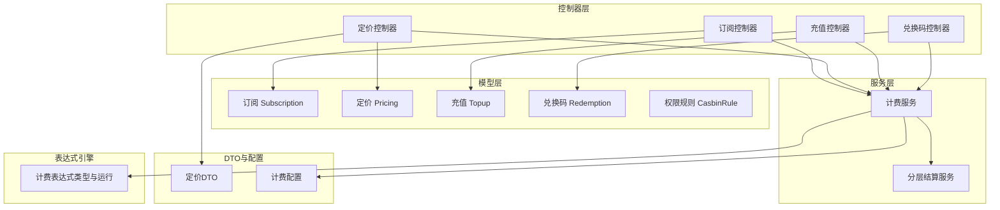
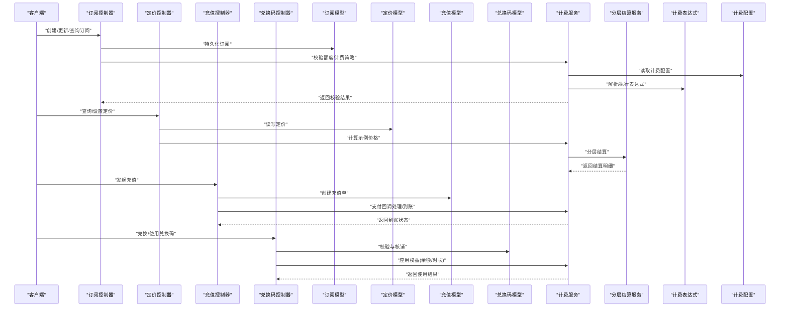
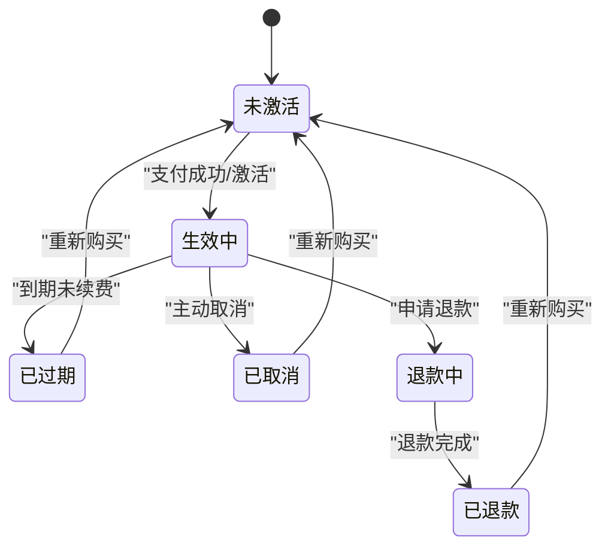
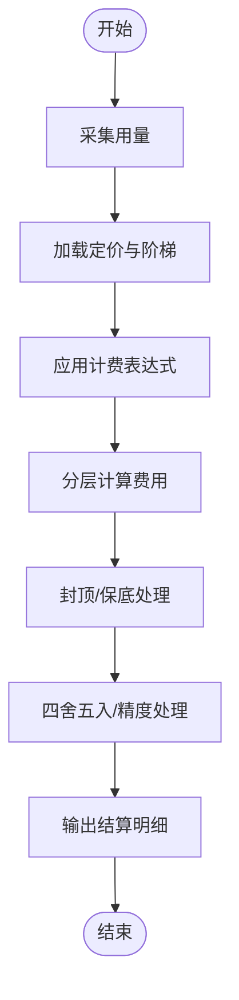
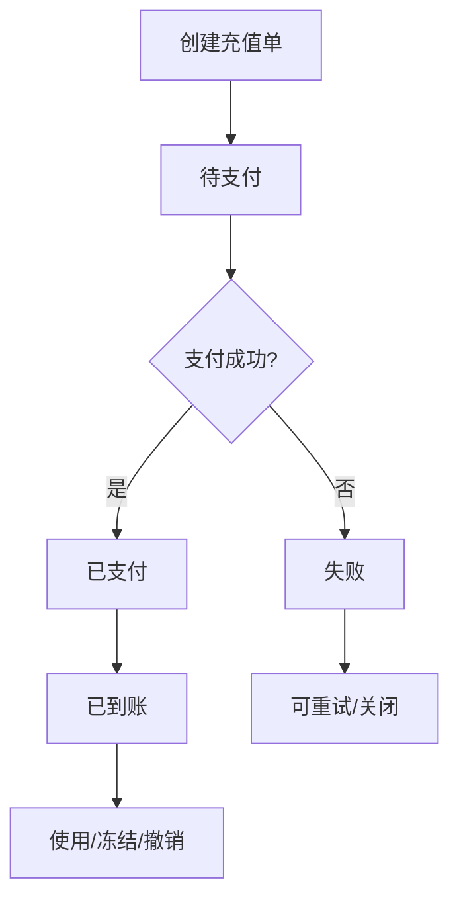
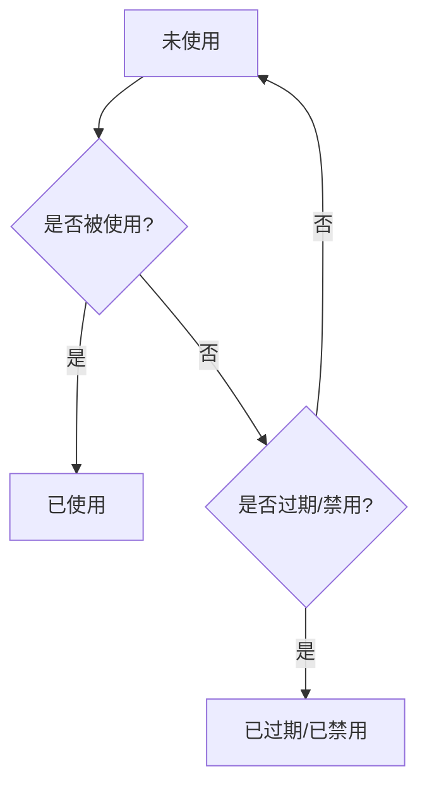
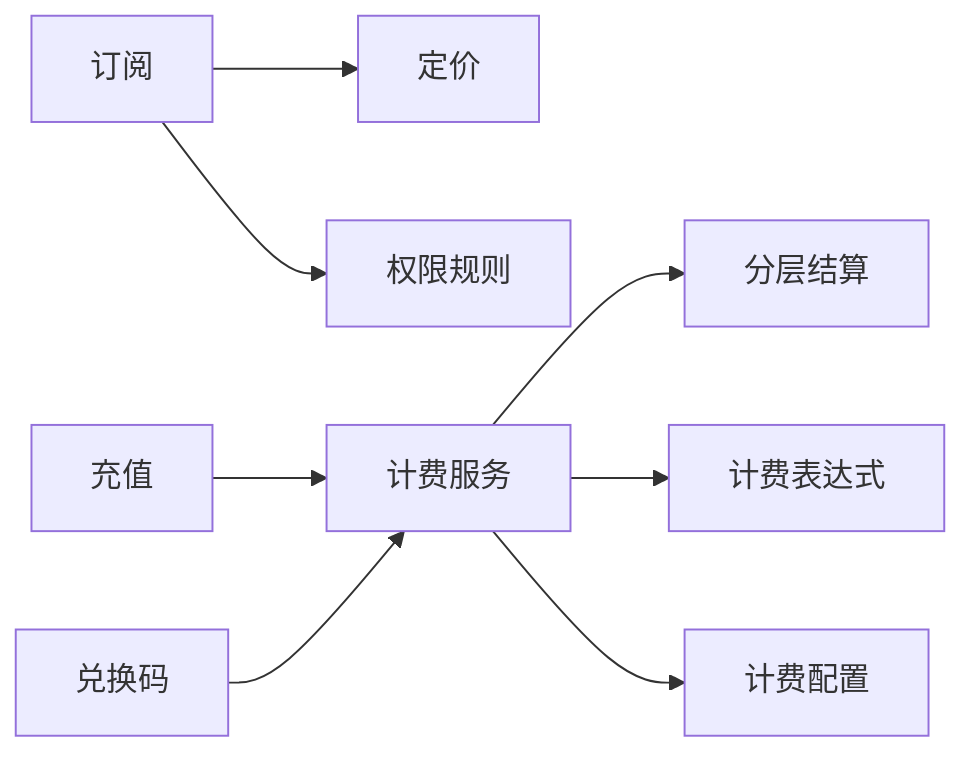

# 业务模型

<cite>
**本文引用的文件**   
- [model/subscription.go](file://model/subscription.go)
- [model/pricing.go](file://model/pricing.go)
- [model/topup.go](file://model/topup.go)
- [model/redemption.go](file://model/redemption.go)
- [model/casbin_rule.go](file://model/casbin_rule.go)
- [controller/subscription.go](file://controller/subscription.go)
- [controller/pricing.go](file://controller/pricing.go)
- [controller/topup.go](file://controller/topup.go)
- [controller/redemption.go](file://controller/redemption.go)
- [service/billing.go](file://service/billing.go)
- [service/tiered_settle.go](file://service/tiered_settle.go)
- [pkg/billingexpr/types.go](file://pkg/billingexpr/types.go)
- [dto/pricing.go](file://dto/pricing.go)
- [setting/billing_setting/tiered_billing.go](file://setting/billing_setting/tiered_billing.go)
</cite>

## 目录
1. [简介](#简介)
2. [项目结构](#项目结构)
3. [核心组件](#核心组件)
4. [架构总览](#架构总览)
5. [详细组件分析](#详细组件分析)
6. [依赖关系分析](#依赖关系分析)
7. [性能考量](#性能考量)
8. [故障排查指南](#故障排查指南)
9. [结论](#结论)
10. [附录](#附录)

## 简介
本文件面向业务数据模型，系统性梳理订阅(Subscription)、定价(Pricing)、充值(Topup)、兑换码(Redemption)、权限规则(CasbinRule)等核心实体的数据结构、字段含义、业务规则与状态流转，并给出关联关系、计算逻辑、典型场景示例以及审计追踪机制说明。文档兼顾技术读者与非技术读者，力求清晰易懂且可操作。

## 项目结构
围绕业务模型的代码主要分布在以下层次：
- 数据模型层(model)：定义实体结构与数据库映射
- 控制器层(controller)：对外暴露API，处理请求校验与流程编排
- 服务层(service)：封装计费、结算、额度、任务等复杂业务逻辑
- DTO层(dto)：面向接口传输的数据对象
- 配置层(setting)：计费策略、分层计费、支付渠道等配置
- 表达式层(pkg/billingexpr)：计费表达式编译与执行

图表来源
- [model/subscription.go](file://model/subscription.go)
- [model/pricing.go](file://model/pricing.go)
- [model/topup.go](file://model/topup.go)
- [model/redemption.go](file://model/redemption.go)
- [model/casbin_rule.go](file://model/casbin_rule.go)
- [controller/subscription.go](file://controller/subscription.go)
- [controller/pricing.go](file://controller/pricing.go)
- [controller/topup.go](file://controller/topup.go)
- [controller/redemption.go](file://controller/redemption.go)
- [service/billing.go](file://service/billing.go)
- [service/tiered_settle.go](file://service/tiered_settle.go)
- [pkg/billingexpr/types.go](file://pkg/billingexpr/types.go)
- [dto/pricing.go](file://dto/pricing.go)
- [setting/billing_setting/tiered_billing.go](file://setting/billing_setting/tiered_billing.go)

章节来源
- [model/subscription.go](file://model/subscription.go)
- [model/pricing.go](file://model/pricing.go)
- [model/topup.go](file://model/topup.go)
- [model/redemption.go](file://model/redemption.go)
- [model/casbin_rule.go](file://model/casbin_rule.go)
- [controller/subscription.go](file://controller/subscription.go)
- [controller/pricing.go](file://controller/pricing.go)
- [controller/topup.go](file://controller/topup.go)
- [controller/redemption.go](file://controller/redemption.go)
- [service/billing.go](file://service/billing.go)
- [service/tiered_settle.go](file://service/tiered_settle.go)
- [pkg/billingexpr/types.go](file://pkg/billingexpr/types.go)
- [dto/pricing.go](file://dto/pricing.go)
- [setting/billing_setting/tiered_billing.go](file://setting/billing_setting/tiered_billing.go)

## 核心组件
本节对五大业务实体进行结构化说明，包括字段定义、数据类型、业务含义、约束与默认值、状态机与生命周期、与其他实体的关联关系。

### 订阅 Subscription
- 字段概览（按常见语义归纳）
  - 标识与归属：ID、用户ID、渠道/套餐ID、租户/组织ID
  - 计划与周期：计划名称、周期类型(月/年)、开始时间、到期时间、自动续费开关
  - 状态与版本：当前状态(未激活/生效中/已过期/已取消/退款中/已退款)、版本号、备注
  - 计费与额度：计费单位、配额上限、超额策略、折扣/优惠信息
  - 支付与订单：支付方式、外部订单号、支付状态、回调结果
  - 审计字段：创建人、更新时间、删除标记
- 业务含义
  - 描述用户在一定周期内对某项资源或服务的订阅权益，包含计费方式、额度限制、续费策略与状态管理。
- 状态流转
  - 未激活 → 生效中 → 已过期/已取消/退款中 → 已退款
  - 支持自动续费触发续期；到期前提醒；异常回滚至上一有效状态
- 关联关系
  - 与用户多对一；与定价计划一对多；与充值记录通过额度消耗间接关联；与权限规则通过角色/资源绑定影响访问控制

章节来源
- [model/subscription.go](file://model/subscription.go)
- [controller/subscription.go](file://controller/subscription.go)
- [service/billing.go](file://service/billing.go)

### 定价 Pricing
- 字段概览
  - 标识与范围：ID、模型/端点标识、分组、适用渠道
  - 计价维度：按Token/调用次数/时长/并发等；单价、阶梯价、封顶价
  - 币种与精度：币种、小数位、汇率基准
  - 生效区间：生效时间、失效时间、优先级
  - 扩展：表达式、动态系数、促销标签
- 业务含义
  - 定义不同模型/端点的计费标准，支持分层计费与表达式计算，支撑灵活定价策略。
- 计算逻辑
  - 基础费用 = f(用量, 单价, 阶梯规则, 封顶/保底, 折扣)
  - 支持表达式组合与四舍五入策略
- 关联关系
  - 与模型/端点一对一或多对一；与订阅计划通过“适用性”关联；与计费服务联动计算

章节来源
- [model/pricing.go](file://model/pricing.go)
- [dto/pricing.go](file://dto/pricing.go)
- [service/billing.go](file://service/billing.go)
- [service/tiered_settle.go](file://service/tiered_settle.go)
- [pkg/billingexpr/types.go](file://pkg/billingexpr/types.go)
- [setting/billing_setting/tiered_billing.go](file://setting/billing_setting/tiered_billing.go)

### 充值 Topup
- 字段概览
  - 标识与归属：ID、用户ID、渠道ID、订单号
  - 金额与货币：充值金额、币种、汇率、手续费
  - 状态与流水：状态(待支付/已支付/已到账/失败/已撤销)、流水号、支付回调
  - 有效期与用途：有效期、使用范围、备注
- 业务含义
  - 记录用户向账户注入资金或额度的行为，作为消费扣费的资金来源之一。
- 状态流转
  - 待支付 → 已支付 → 已到账 → 使用/冻结/撤销
  - 失败路径：待支付 → 失败 → 可重试/关闭
- 关联关系
  - 与用户一对多；与支付渠道集成；与账单/消费记录通过流水号关联

章节来源
- [model/topup.go](file://model/topup.go)
- [controller/topup.go](file://controller/topup.go)
- [service/billing.go](file://service/billing.go)

### 兑换码 Redemption
- 字段概览
  - 标识与属性：ID、编码、类型(余额/时长/券包)、面值/额度、币种
  - 适用范围：适用模型/端点/渠道、分组、租户
  - 状态与生命周期：状态(未使用/已使用/已过期/已禁用)、有效期、最大使用次数
  - 发放与核销：发放渠道、领取人、使用时间、来源IP
- 业务含义
  - 用于营销推广、体验赠送、渠道激励等场景的凭证，支持精细化适用范围与风控。
- 状态流转
  - 未使用 → 已使用/已过期/已禁用
  - 支持批量发放、限领、防刷校验
- 关联关系
  - 与用户多对一(领取/使用)；与充值或订阅权益关联(如兑换时长)

章节来源
- [model/redemption.go](file://model/redemption.go)
- [controller/redemption.go](file://controller/redemption.go)
- [service/billing.go](file://service/billing.go)

### 权限规则 CasbinRule
- 字段概览
  - 主体/客体/动作：subject、object、action
  - 策略与上下文：policy_id、effect、条件表达式、优先级
  - 审计与版本：创建人、更新时间、生效区间
- 业务含义
  - 基于RBAC/ABAC的访问控制规则，决定用户/角色对资源的读写能力。
- 关联关系
  - 与用户/角色/资源绑定；与订阅/定价策略联动(如仅允许特定模型访问)

章节来源
- [model/casbin_rule.go](file://model/casbin_rule.go)

## 架构总览
下图展示从控制器到模型与服务层的调用关系，以及计费表达式与分层结算的参与位置。

图表来源
- [controller/subscription.go](file://controller/subscription.go)
- [controller/pricing.go](file://controller/pricing.go)
- [controller/topup.go](file://controller/topup.go)
- [controller/redemption.go](file://controller/redemption.go)
- [model/subscription.go](file://model/subscription.go)
- [model/pricing.go](file://model/pricing.go)
- [model/topup.go](file://model/topup.go)
- [model/redemption.go](file://model/redemption.go)
- [service/billing.go](file://service/billing.go)
- [service/tiered_settle.go](file://service/tiered_settle.go)
- [pkg/billingexpr/types.go](file://pkg/billingexpr/types.go)
- [setting/billing_setting/tiered_billing.go](file://setting/billing_setting/tiered_billing.go)

## 详细组件分析

### 订阅 Subscription 业务流程
- 关键流程
  - 创建订阅：校验用户身份、选择定价计划、生成订阅记录、设置初始状态
  - 续费与到期：根据周期与自动续费策略触发续期；到期前提醒；到期后降级或暂停
  - 变更与退款：支持升降级、中途变更、部分/全额退款
- 状态机示意

图表来源
- [model/subscription.go](file://model/subscription.go)
- [controller/subscription.go](file://controller/subscription.go)
- [service/billing.go](file://service/billing.go)

章节来源
- [model/subscription.go](file://model/subscription.go)
- [controller/subscription.go](file://controller/subscription.go)
- [service/billing.go](file://service/billing.go)

### 定价 Pricing 计算与分层结算
- 计算要素
  - 用量采集：Token数、调用次数、时长等
  - 单价与阶梯：基础单价、阶梯阈值与单价、封顶/保底
  - 折扣与汇率：促销折扣、币种换算
  - 表达式：支持变量与函数组合，便于动态定价
- 分层结算流程

图表来源
- [service/tiered_settle.go](file://service/tiered_settle.go)
- [pkg/billingexpr/types.go](file://pkg/billingexpr/types.go)
- [setting/billing_setting/tiered_billing.go](file://setting/billing_setting/tiered_billing.go)

章节来源
- [model/pricing.go](file://model/pricing.go)
- [dto/pricing.go](file://dto/pricing.go)
- [service/billing.go](file://service/billing.go)
- [service/tiered_settle.go](file://service/tiered_settle.go)
- [pkg/billingexpr/types.go](file://pkg/billingexpr/types.go)
- [setting/billing_setting/tiered_billing.go](file://setting/billing_setting/tiered_billing.go)

### 充值 Topup 支付与到账
- 关键流程
  - 创建充值单：校验用户、金额、币种、渠道
  - 支付网关交互：生成支付链接/二维码、回调处理
  - 到账与记账：校验签名、幂等处理、更新用户余额/额度
- 状态流转

图表来源
- [model/topup.go](file://model/topup.go)
- [controller/topup.go](file://controller/topup.go)
- [service/billing.go](file://service/billing.go)

章节来源
- [model/topup.go](file://model/topup.go)
- [controller/topup.go](file://controller/topup.go)
- [service/billing.go](file://service/billing.go)

### 兑换码 Redemption 发放与核销
- 关键流程
  - 发放：批量生成、设定适用范围与有效期
  - 领取：校验用户、频次限制、防刷
  - 核销：校验有效性、应用权益、记录流水
- 状态流转

图表来源
- [model/redemption.go](file://model/redemption.go)
- [controller/redemption.go](file://controller/redemption.go)
- [service/billing.go](file://service/billing.go)

章节来源
- [model/redemption.go](file://model/redemption.go)
- [controller/redemption.go](file://controller/redemption.go)
- [service/billing.go](file://service/billing.go)

### 权限规则 CasbinRule 访问控制
- 规则结构
  - 主体(subject)：用户/角色/组
  - 客体(object)：资源/模型/端点
  - 动作(action)：读/写/调用/管理等
  - 效果(effect)：允许/拒绝
  - 条件：表达式或上下文参数
- 应用场景
  - 订阅等级限制：仅高级订阅可调用高价值模型
  - 渠道隔离：特定渠道仅对指定租户开放
  - 动态授权：结合定价与用量阈值动态调整权限

章节来源
- [model/casbin_rule.go](file://model/casbin_rule.go)

## 依赖关系分析
- 模型间依赖
  - 订阅依赖定价计划；充值与兑换码为订阅提供资金或权益来源
  - 权限规则与订阅/定价联动，实现差异化访问控制
- 服务依赖
  - 计费服务依赖分层结算与表达式引擎；读取计费配置
  - 控制器依赖模型与服务，负责流程编排与校验
- 外部依赖
  - 支付渠道(Stripe/Creem/Waffo等)通过控制器与回调处理接入
  - Redis/缓存用于限流、会话、热点数据

图表来源
- [model/subscription.go](file://model/subscription.go)
- [model/pricing.go](file://model/pricing.go)
- [model/topup.go](file://model/topup.go)
- [model/redemption.go](file://model/redemption.go)
- [model/casbin_rule.go](file://model/casbin_rule.go)
- [service/billing.go](file://service/billing.go)
- [service/tiered_settle.go](file://service/tiered_settle.go)
- [pkg/billingexpr/types.go](file://pkg/billingexpr/types.go)
- [setting/billing_setting/tiered_billing.go](file://setting/billing_setting/tiered_billing.go)

章节来源
- [model/subscription.go](file://model/subscription.go)
- [model/pricing.go](file://model/pricing.go)
- [model/topup.go](file://model/topup.go)
- [model/redemption.go](file://model/redemption.go)
- [model/casbin_rule.go](file://model/casbin_rule.go)
- [service/billing.go](file://service/billing.go)
- [service/tiered_settle.go](file://service/tiered_settle.go)
- [pkg/billingexpr/types.go](file://pkg/billingexpr/types.go)
- [setting/billing_setting/tiered_billing.go](file://setting/billing_setting/tiered_billing.go)

## 性能考量
- 计费计算
  - 表达式预编译与缓存，避免重复解析
  - 分层结算采用增量计算与批处理，降低锁竞争
- 数据访问
  - 热点定价与配置缓存；订阅状态变更事件驱动更新
  - 充值与兑换码核销采用幂等键与分布式锁
- 并发与一致性
  - 使用事务保证充值到账与余额更新的原子性
  - 异步任务处理耗时操作(如对账、报表)

[本节为通用指导，不直接分析具体文件]

## 故障排查指南
- 常见问题定位
  - 订阅状态异常：检查支付回调、到期任务、自动续费开关
  - 计费偏差：核对定价阶梯、表达式、汇率与四舍五入策略
  - 充值未到账：核查支付网关回调、签名校验、幂等处理
  - 兑换码无效：检查有效期、适用范围、使用次数限制
- 日志与审计
  - 关键操作记录：创建/变更/核销/支付回调
  - 错误堆栈与上下文：请求ID、用户ID、资源ID、时间戳
  - 监控指标：成功率、延迟、失败率、对账差异

章节来源
- [controller/subscription.go](file://controller/subscription.go)
- [controller/pricing.go](file://controller/pricing.go)
- [controller/topup.go](file://controller/topup.go)
- [controller/redemption.go](file://controller/redemption.go)
- [service/billing.go](file://service/billing.go)

## 结论
本业务模型以订阅为核心，围绕定价、充值、兑换码与权限规则构建完整的计费与访问控制体系。通过分层结算与表达式引擎实现灵活定价，借助幂等与事务保障资金安全，配合审计与监控确保可追溯与可观测。建议在生产环境强化缓存与异步化处理，持续优化计费精度与系统稳定性。

[本节为总结性内容，不直接分析具体文件]

## 附录
- 典型业务场景示例
  - 新用户注册后购买月度订阅：选择定价计划 → 支付充值 → 到账激活 → 到期自动续费
  - 营销活动发放兑换码：批量生成 → 用户领取 → 核销为余额或时长 → 使用抵扣
  - 企业租户定制定价：配置阶梯与表达式 → 限定模型/端点 → 权限规则限制访问
- 审计与追踪要点
  - 全链路请求ID贯穿；关键状态变更落库并留痕
  - 对账报表与差异告警；敏感操作二次确认与审批流

[本节为补充说明，不直接分析具体文件]