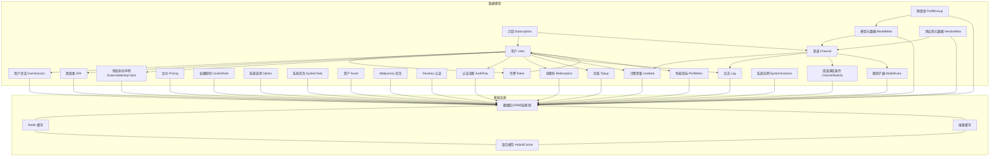
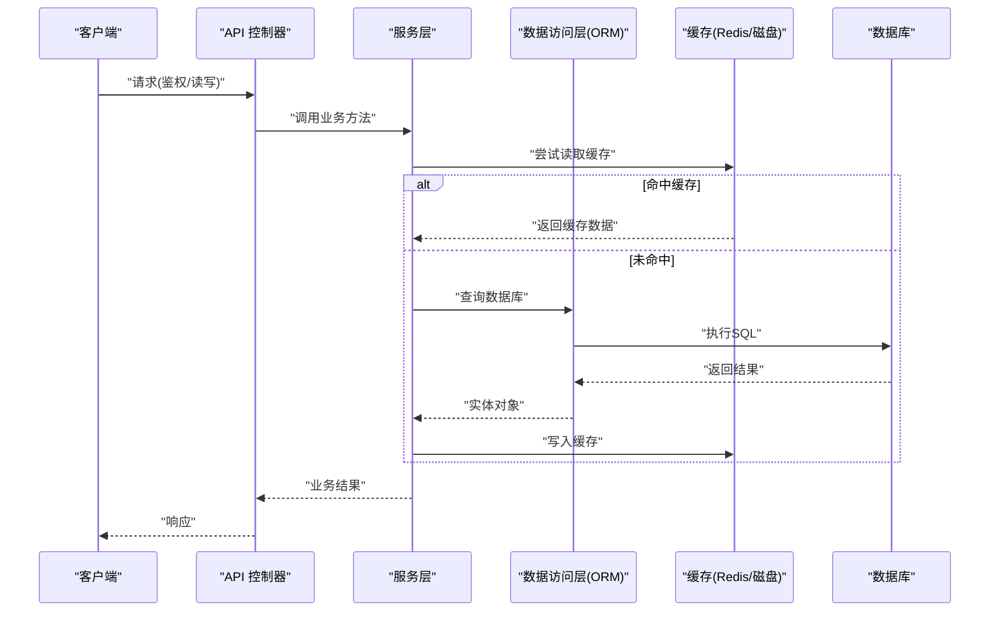
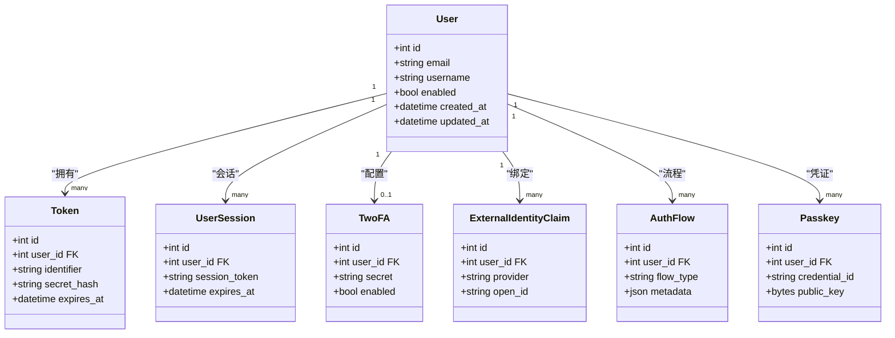
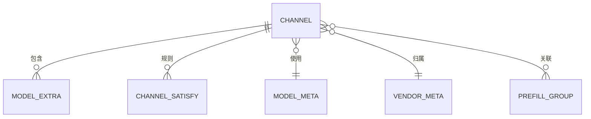
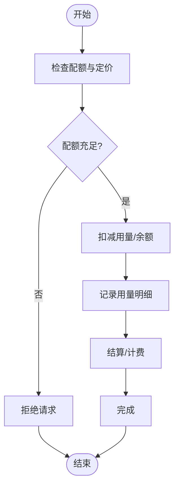
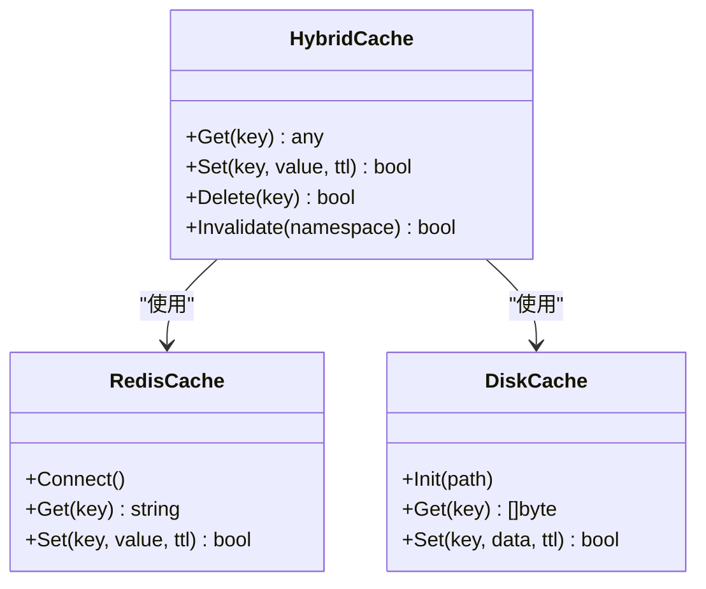
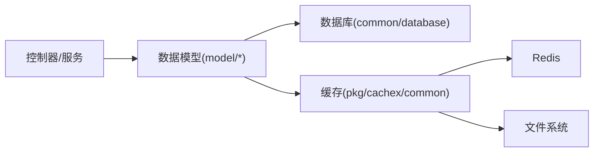

# 数据关系

<cite>
**本文引用的文件**   
- [model/main.go](file://model/main.go)
- [common/database.go](file://common/database.go)
- [model/user.go](file://model/user.go)
- [model/channel.go](file://model/channel.go)
- [model/token.go](file://model/token.go)
- [model/subscription.go](file://model/subscription.go)
- [model/task.go](file://model/task.go)
- [model/log.go](file://model/log.go)
- [model/usedata.go](file://model/usedata.go)
- [model/pricing.go](file://model/pricing.go)
- [model/casbin_rule.go](file://model/casbin_rule.go)
- [model/option.go](file://model/option.go)
- [model/system_task.go](file://model/system_task.go)
- [model/asset.go](file://model/asset.go)
- [model/midjourney.go](file://model/midjourney.go)
- [model/passkey.go](file://model/passkey.go)
- [model/redemption.go](file://model/redemption.go)
- [model/topup.go](file://model/topup.go)
- [model/twofa.go](file://model/twofa.go)
- [model/user_session.go](file://model/user_session.go)
- [model/model_meta.go](file://model/model_meta.go)
- [model/prefill_group.go](file://model/prefill_group.go)
- [model/perf_metric.go](file://model/perf_metric.go)
- [model/vendor_meta.go](file://model/vendor_meta.go)
- [model/external_identity_claim.go](file://model/external_identity_claim.go)
- [model/auth_flow.go](file://model/auth_flow.go)
- [model/errors.go](file://model/errors.go)
- [model/utils.go](file://model/utils.go)
- [model/db_time.go](file://model/db_time.go)
- [model/locking.go](file://model/locking.go)
- [model/channel_cache.go](file://model/channel_cache.go)
- [model/token_cache.go](file://model/token_cache.go)
- [model/user_cache.go](file://model/user_cache.go)
- [model/user_auth_cache.go](file://model/user_auth_cache.go)
- [model/frontend_option_migration.go](file://model/frontend_option_migration.go)
- [model/missing_models.go](file://model/missing_models.go)
- [model/system_instance.go](file://model/system_instance.go)
- [model/channel_satisfy.go](file://model/channel_satisfy.go)
- [model/model_extra.go](file://model/model_extra.go)
- [model/channel_settings_test.go](file://model/channel_settings_test.go)
- [model/user_session_migration_test.go](file://model/user_session_migration_test.go)
- [model/user_update_test.go](file://model/user_update_test.go)
- [model/user_pagination_test.go](file://model/user_pagination_test.go)
- [model/user_oauth_binding.go](file://model/user_oauth_binding.go)
- [model/billing_usage.go](file://dto/billing_usage.go)
- [pkg/cachex/hybrid_cache.go](file://pkg/cachex/hybrid_cache.go)
- [common/disk_cache.go](file://common/disk_cache.go)
- [common/redis.go](file://common/redis.go)
- [bin/migration_v0.2-v0.3.sql](file://bin/migration_v0.2-v0.3.sql)
- [bin/migration_v0.3-v0.4.sql](file://bin/migration_v0.3-v0.4.sql)
</cite>

## 目录
1. [简介](#简介)
2. [项目结构](#项目结构)
3. [核心组件](#核心组件)
4. [架构总览](#架构总览)
5. [详细组件分析](#详细组件分析)
6. [依赖分析](#依赖分析)
7. [性能考虑](#性能考虑)
8. [故障排查指南](#故障排查指南)
9. [结论](#结论)
10. [附录](#附录)

## 简介
本文件面向“数据关系”主题，系统化梳理本项目中实体模型、关系映射、外键与引用完整性约束，以及一对一、一对多、多对多的实现方式与最佳实践。同时覆盖数据一致性保证、事务处理、并发控制机制；数据库索引策略、查询优化与性能调优建议；缓存策略、数据同步与分布式锁使用；复杂查询示例与优化方案；数据迁移、备份恢复与灾难恢复策略。文档力求兼顾技术深度与可读性，帮助开发者快速理解并正确扩展数据层。

## 项目结构
数据模型主要分布在 model 包中，配合 common/database 进行数据库连接与初始化，部分缓存逻辑位于 pkg/cachex 与 common 下的磁盘/Redis 缓存模块。迁移脚本位于 bin 目录。

图表来源
- [model/main.go:1-200](file://model/main.go#L1-L200)
- [common/database.go:1-200](file://common/database.go#L1-L200)
- [pkg/cachex/hybrid_cache.go:1-200](file://pkg/cachex/hybrid_cache.go#L1-L200)
- [common/disk_cache.go:1-200](file://common/disk_cache.go#L1-L200)
- [common/redis.go:1-200](file://common/redis.go#L1-L200)

章节来源
- [model/main.go:1-200](file://model/main.go#L1-L200)
- [common/database.go:1-200](file://common/database.go#L1-L200)

## 核心组件
- 用户与认证相关：用户、令牌、会话、双因素、外部身份、认证流程、Passkey。
- 渠道与模型：渠道、模型元数据、模型扩展、预填组、供应商元数据、渠道满足条件。
- 计费与用量：订阅、定价、用量统计、充值、兑换码。
- 系统与运维：系统任务、系统实例、性能指标、日志、系统选项、权限规则。
- 其他业务：资产、Midjourney 任务。

这些实体通过外键与关联表形成一对一、一对多、多对多关系，支撑鉴权、路由、计费、审计与运营能力。

章节来源
- [model/user.go:1-200](file://model/user.go#L1-L200)
- [model/token.go:1-200](file://model/token.go#L1-L200)
- [model/user_session.go:1-200](file://model/user_session.go#L1-L200)
- [model/twofa.go:1-200](file://model/twofa.go#L1-L200)
- [model/external_identity_claim.go:1-200](file://model/external_identity_claim.go#L1-L200)
- [model/auth_flow.go:1-200](file://model/auth_flow.go#L1-L200)
- [model/passkey.go:1-200](file://model/passkey.go#L1-L200)
- [model/channel.go:1-200](file://model/channel.go#L1-L200)
- [model/model_meta.go:1-200](file://model/model_meta.go#L1-L200)
- [model/model_extra.go:1-200](file://model/model_extra.go#L1-L200)
- [model/prefill_group.go:1-200](file://model/prefill_group.go#L1-L200)
- [model/vendor_meta.go:1-200](file://model/vendor_meta.go#L1-L200)
- [model/channel_satisfy.go:1-200](file://model/channel_satisfy.go#L1-L200)
- [model/subscription.go:1-200](file://model/subscription.go#L1-L200)
- [model/pricing.go:1-200](file://model/pricing.go#L1-L200)
- [model/usedata.go:1-200](file://model/usedata.go#L1-L200)
- [model/topup.go:1-200](file://model/topup.go#L1-L200)
- [model/redemption.go:1-200](file://model/redemption.go#L1-L200)
- [model/system_task.go:1-200](file://model/system_task.go#L1-L200)
- [model/system_instance.go:1-200](file://model/system_instance.go#L1-L200)
- [model/perf_metric.go:1-200](file://model/perf_metric.go#L1-L200)
- [model/log.go:1-200](file://model/log.go#L1-L200)
- [model/option.go:1-200](file://model/option.go#L1-L200)
- [model/casbin_rule.go:1-200](file://model/casbin_rule.go#L1-L200)
- [model/asset.go:1-200](file://model/asset.go#1-L200)
- [model/midjourney.go:1-200](file://model/midjourney.go#L1-L200)

## 架构总览
数据层以 ORM 为中心，统一由数据库初始化模块管理连接池与迁移；高频读路径通过 Redis/磁盘缓存与混合缓存降低延迟；写路径遵循事务与乐观锁/悲观锁保障一致性；审计与用量统计异步落库，避免阻塞主流程。

图表来源
- [common/database.go:1-200](file://common/database.go#L1-L200)
- [pkg/cachex/hybrid_cache.go:1-200](file://pkg/cachex/hybrid_cache.go#L1-L200)
- [common/disk_cache.go:1-200](file://common/disk_cache.go#L1-L200)
- [common/redis.go:1-200](file://common/redis.go#L1-L200)

## 详细组件分析

### 用户与认证域（User, Token, UserSession, 2FA, Passkey, ExternalIdentityClaim, AuthFlow）
- 关系映射
  - 用户与令牌：一对多（一个用户可拥有多个令牌）。
  - 用户与会话：一对多（一个用户可存在多个有效会话）。
  - 用户与双因素：一对一或可选一对一（每个用户最多一个 2FA 配置）。
  - 用户与外部身份：一对多（支持多平台绑定）。
  - 用户与认证流程：一对多（记录登录/授权流程事件）。
- 外键与完整性
  - 所有外键指向用户主键，删除策略通常为级联删除或限制删除，确保无孤立记录。
- 并发控制
  - 会话更新采用版本号或时间戳校验，防止并发覆盖。
  - 令牌刷新采用原子操作或分布式锁保护。
- 索引策略
  - 用户邮箱/用户名唯一索引；令牌哈希/标识列建立索引；会话过期字段建立索引用于清理。
- 查询优化
  - 常用查询走联合索引（如 user_id + status），避免全表扫描。
- 缓存策略
  - 用户信息、会话状态、令牌白名单进入 Redis 缓存，设置合理 TTL 与失效策略。
- 事务与一致性
  - 创建/注销用户、绑定第三方账号等跨表操作使用事务保证一致性。

图表来源
- [model/user.go:1-200](file://model/user.go#L1-L200)
- [model/token.go:1-200](file://model/token.go#L1-L200)
- [model/user_session.go:1-200](file://model/user_session.go#L1-L200)
- [model/twofa.go:1-200](file://model/twofa.go#L1-L200)
- [model/external_identity_claim.go:1-200](file://model/external_identity_claim.go#L1-L200)
- [model/auth_flow.go:1-200](file://model/auth_flow.go#L1-L200)
- [model/passkey.go:1-200](file://model/passkey.go#L1-L200)

章节来源
- [model/user.go:1-200](file://model/user.go#L1-L200)
- [model/token.go:1-200](file://model/token.go#L1-L200)
- [model/user_session.go:1-200](file://model/user_session.go#L1-L200)
- [model/twofa.go:1-200](file://model/twofa.go#L1-L200)
- [model/external_identity_claim.go:1-200](file://model/external_identity_claim.go#L1-L200)
- [model/auth_flow.go:1-200](file://model/auth_flow.go#L1-L200)
- [model/passkey.go:1-200](file://model/passkey.go#L1-L200)

### 渠道与模型域（Channel, ModelMeta, ModelExtra, PrefillGroup, VendorMeta, ChannelSatisfy）
- 关系映射
  - 渠道与模型元数据：多对一（多个渠道可复用同一模型元数据）。
  - 渠道与模型扩展：一对多（每个渠道可有多条扩展配置）。
  - 渠道与供应商元数据：多对一（共享供应商定义）。
  - 渠道与预填组：多对多（通过中间表关联）。
  - 渠道与满足条件：一对多（渠道的匹配规则集合）。
- 外键与完整性
  - 模型元数据、供应商元数据作为基础字典，删除需检查是否被引用。
  - 预填组通过中间表维护多对多，删除时清理关联。
- 索引策略
  - 渠道名称/标识、模型编码、供应商 ID 建立索引；满足条件按优先级与权重排序字段建复合索引。
- 查询优化
  - 选择渠道时先过滤可用性与配额，再按亲和度/权重排序，减少回表。
- 缓存策略
  - 模型元数据、供应商元数据、渠道列表与亲和度配置进入缓存，变更时主动失效。

图表来源
- [model/channel.go:1-200](file://model/channel.go#L1-L200)
- [model/model_meta.go:1-200](file://model/model_meta.go#L1-L200)
- [model/model_extra.go:1-200](file://model/model_extra.go#L1-L200)
- [model/prefill_group.go:1-200](file://model/prefill_group.go#L1-L200)
- [model/vendor_meta.go:1-200](file://model/vendor_meta.go#L1-L200)
- [model/channel_satisfy.go:1-200](file://model/channel_satisfy.go#L1-L200)

章节来源
- [model/channel.go:1-200](file://model/channel.go#L1-L200)
- [model/model_meta.go:1-200](file://model/model_meta.go#L1-L200)
- [model/model_extra.go:1-200](file://model/model_extra.go#L1-L200)
- [model/prefill_group.go:1-200](file://model/prefill_group.go#L1-L200)
- [model/vendor_meta.go:1-200](file://model/vendor_meta.go#L1-L200)
- [model/channel_satisfy.go:1-200](file://model/channel_satisfy.go#L1-L200)

### 计费与用量域（Subscription, Pricing, Usedata, Topup, Redemption）
- 关系映射
  - 用户与订阅：一对多（用户可订阅多个套餐）。
  - 订阅与渠道：多对多（限定可用渠道集合）。
  - 定价与渠道：多对一（渠道对应定价策略）。
  - 用量与用户/渠道：多对一（按维度聚合）。
  - 充值与用户：一对多（充值记录）。
  - 兑换码与用户：一对多（兑换记录）。
- 外键与完整性
  - 用量统计与计费结算强一致，采用事务+幂等键避免重复计费。
  - 兑换码核销采用状态机与唯一约束保证一次性使用。
- 索引策略
  - 用量按用户/渠道/时间分区索引；订阅有效期与状态复合索引；充值流水号唯一索引。
- 查询优化
  - 结算报表使用物化视图或定时汇总，避免实时聚合大表。
- 缓存策略
  - 定价策略、渠道配额、用户余额短期缓存，变更触发失效。

图表来源
- [model/subscription.go:1-200](file://model/subscription.go#L1-L200)
- [model/pricing.go:1-200](file://model/pricing.go#L1-L200)
- [model/usedata.go:1-200](file://model/usedata.go#L1-L200)
- [model/topup.go:1-200](file://model/topup.go#L1-L200)
- [model/redemption.go:1-200](file://model/redemption.go#L1-L200)

章节来源
- [model/subscription.go:1-200](file://model/subscription.go#L1-L200)
- [model/pricing.go:1-200](file://model/pricing.go#L1-L200)
- [model/usedata.go:1-200](file://model/usedata.go#L1-L200)
- [model/topup.go:1-200](file://model/topup.go#L1-L200)
- [model/redemption.go:1-200](file://model/redemption.go#L1-L200)

### 系统与运维域（SystemTask, SystemInstance, PerfMetric, Log, Option, CasbinRule, Asset, Midjourney）
- 关系映射
  - 系统任务与实例：多对一（任务在特定实例上执行）。
  - 性能指标与实例：多对一（按实例采集）。
  - 日志与用户/渠道：多对一（审计溯源）。
  - 系统选项为全局配置键值对。
  - 权限规则独立存储，供鉴权引擎加载。
  - 资产与用户/渠道：多对一（资源归属）。
  - Midjourney 任务与用户：一对多。
- 外键与完整性
  - 审计日志保留策略通过软删除或归档表管理。
  - 权限规则变更需重新加载至内存引擎。
- 索引策略
  - 日志按时间范围与主体维度建复合索引；任务状态与重试次数建索引便于调度。
- 查询优化
  - 日志采用分表/分区，历史数据归档到冷存储。
- 缓存策略
  - 系统选项、权限规则热数据缓存，变更广播失效。

章节来源
- [model/system_task.go:1-200](file://model/system_task.go#L1-L200)
- [model/system_instance.go:1-200](file://model/system_instance.go#L1-L200)
- [model/perf_metric.go:1-200](file://model/perf_metric.go#L1-L200)
- [model/log.go:1-200](file://model/log.go#L1-L200)
- [model/option.go:1-200](file://model/option.go#L1-L200)
- [model/casbin_rule.go:1-200](file://model/casbin_rule.go#L1-L200)
- [model/asset.go:1-200](file://model/asset.go#L1-L200)
- [model/midjourney.go:1-200](file://model/midjourney.go#L1-L200)

### 缓存与一致性（HybridCache, Redis, DiskCache）
- 设计要点
  - 混合缓存提供多级缓存（内存/磁盘/Redis），自动降级与回填。
  - 键命名空间隔离不同业务域，避免冲突。
  - 缓存一致性通过版本号/时间戳与失效通知保证。
- 并发控制
  - 热点数据更新采用分布式锁，避免击穿与雪崩。
- 失效策略
  - 写后失效优先于惰性失效，结合 TTL 兜底。

图表来源
- [pkg/cachex/hybrid_cache.go:1-200](file://pkg/cachex/hybrid_cache.go#L1-L200)
- [common/redis.go:1-200](file://common/redis.go#L1-L200)
- [common/disk_cache.go:1-200](file://common/disk_cache.go#L1-L200)

章节来源
- [pkg/cachex/hybrid_cache.go:1-200](file://pkg/cachex/hybrid_cache.go#L1-L200)
- [common/redis.go:1-200](file://common/redis.go#L1-L200)
- [common/disk_cache.go:1-200](file://common/disk_cache.go#L1-L200)

## 依赖分析
- 直接依赖
  - model 包依赖 common/database 进行连接与迁移；依赖 pkg/cachex 与 common 缓存模块。
- 间接依赖
  - 控制器与服务层通过 model 访问数据；缓存模块依赖 Redis/文件系统。
- 循环依赖
  - 模型之间应避免循环导入，通过接口或分层解耦。
- 外部依赖
  - 数据库驱动、Redis 客户端、文件系统 I/O。

图表来源
- [model/main.go:1-200](file://model/main.go#L1-L200)
- [common/database.go:1-200](file://common/database.go#L1-L200)
- [pkg/cachex/hybrid_cache.go:1-200](file://pkg/cachex/hybrid_cache.go#L1-L200)
- [common/disk_cache.go:1-200](file://common/disk_cache.go#L1-L200)
- [common/redis.go:1-200](file://common/redis.go#L1-L200)

章节来源
- [model/main.go:1-200](file://model/main.go#L1-L200)
- [common/database.go:1-200](file://common/database.go#L1-L200)

## 性能考虑
- 索引策略
  - 针对高频查询构建复合索引，避免选择性差的列单独建索引。
  - 区分唯一索引与普通索引，合理使用前缀索引。
- 查询优化
  - 使用覆盖索引减少回表；分页查询使用游标或基于索引的延迟关联。
  - 大表查询采用分区/分表，历史数据归档。
- 事务与锁
  - 短事务、最小锁定范围；避免长事务持有锁导致阻塞。
  - 热点行更新采用乐观锁（版本号）或分布式锁。
- 缓存策略
  - 读多写少场景优先缓存；写后失效与 TTL 结合；热点键打散避免单点压力。
- 批处理与异步
  - 用量统计、日志写入采用批量与异步队列，削峰填谷。
- 监控与调优
  - 慢查询日志、执行计划分析、缓存命中率监控；定期评估索引有效性。

[本节为通用指导，不直接分析具体文件]

## 故障排查指南
- 常见问题定位
  - 外键约束失败：检查关联记录是否存在、删除策略是否正确。
  - 死锁与超时：缩短事务、拆分更新顺序、增加重试与退避。
  - 缓存不一致：核对失效时机与版本号；检查并发写入竞争。
  - 慢查询：查看执行计划，补充索引或改写 SQL。
- 诊断工具
  - 启用慢查询日志、数据库监控、缓存命中率指标。
  - 使用 EXPLAIN/ANALYZE 分析查询路径。
- 恢复策略
  - 定期全量与增量备份；演练恢复流程；关键表开启 Binlog/WAL。
  - 灾难恢复预案：多副本、异地容灾、灰度回滚。

章节来源
- [model/errors.go:1-200](file://model/errors.go#L1-L200)
- [model/utils.go:1-200](file://model/utils.go#L1-L200)
- [model/db_time.go:1-200](file://model/db_time.go#L1-L200)
- [model/locking.go:1-200](file://model/locking.go#L1-L200)

## 结论
本项目的数据模型围绕用户认证、渠道与模型、计费与用量、系统运维四大域展开，通过清晰的外键与关联关系实现业务闭环。借助混合缓存、分布式锁与事务机制，系统在一致性、可用性与性能之间取得平衡。建议在后续演进中持续优化索引与查询、完善监控与告警、强化备份与容灾演练，以支撑更高负载与更复杂的业务场景。

[本节为总结性内容，不直接分析具体文件]

## 附录

### 数据迁移与版本管理
- 迁移脚本
  - 使用 bin 目录中的 SQL 脚本进行版本升级，保持向后兼容。
- 最佳实践
  - 迁移脚本幂等、可回滚；大表变更分批执行；上线前后验证数据一致性。

章节来源
- [bin/migration_v0.2-v0.3.sql:1-200](file://bin/migration_v0.2-v0.3.sql#L1-L200)
- [bin/migration_v0.3-v0.4.sql:1-200](file://bin/migration_v0.3-v0.4.sql#L1-L200)

### 复杂查询示例与优化方案
- 示例场景
  - 用户维度用量统计：按用户/渠道/时间聚合，使用分区表与物化视图。
  - 渠道选择：基于可用性、配额、亲和度与权重排序，利用索引与缓存加速。
  - 权限判定：加载规则集到内存引擎，结合用户角色与资源属性快速决策。
- 优化手段
  - 改写子查询为 JOIN；使用覆盖索引；分页采用游标；热点数据缓存。

[本节为概念性说明，不直接分析具体文件]

### 并发控制与分布式锁
- 模式
  - 乐观锁：版本号/时间戳比较，失败重试。
  - 悲观锁：SELECT FOR UPDATE 或分布式锁（Redis/ZK）。
- 适用场景
  - 配额扣减、兑换码核销、会话更新、任务状态机推进。

章节来源
- [model/locking.go:1-200](file://model/locking.go#L1-L200)
- [common/redis.go:1-200](file://common/redis.go#L1-L200)

### 数据一致性保证
- 事务边界
  - 将相关写操作纳入同一事务，必要时使用补偿事务。
- 幂等性
  - 对外部回调与重试场景引入幂等键，避免重复处理。
- 最终一致性
  - 异步任务与消息队列保证最终一致，配合对账与修复任务。

章节来源
- [common/database.go:1-200](file://common/database.go#L1-L200)
- [model/usedata.go:1-200](file://model/usedata.go#L1-L200)

### 备份恢复与灾难恢复
- 备份策略
  - 全量+增量备份，保留周期与异地副本；关键表开启 Binlog/WAL。
- 恢复演练
  - 定期演练恢复流程，验证 RTO/RPO 目标。
- 灾难恢复
  - 多活部署、流量切换、数据比对与修复。

[本节为通用指导，不直接分析具体文件]