# 数据模型

<cite>
**本文引用的文件**   
- [model/main.go](file://model/main.go)
- [model/user.go](file://model/user.go)
- [model/token.go](file://model/token.go)
- [model/channel.go](file://model/channel.go)
- [model/task.go](file://model/task.go)
- [model/usedata.go](file://model/usedata.go)
- [model/log.go](file://model/log.go)
- [model/subscription.go](file://model/subscription.go)
- [model/topup.go](file://model/topup.go)
- [model/redemption.go](file://model/redemption.go)
- [model/model_meta.go](file://model/model_meta.go)
- [model/pricing.go](file://model/pricing.go)
- [model/system_task.go](file://model/system_task.go)
- [model/asset.go](file://model/asset.go)
- [controller/asset.go](file://controller/asset.go)
- [service/asset.go](file://service/asset.go)
- [service/asset_ecloud.go](file://service/asset_ecloud.go)
- [router/asset-router.go](file://router/asset-router.go)
- [types/file_data.go](file://types/file_data.go)
- [types/file_source.go](file://types/file_source.go)
- [bin/migration_v0.2-v0.3.sql](file://bin/migration_v0.2-v0.3.sql)
- [bin/migration_v0.3-v0.4.sql](file://bin/migration_v0.3-v0.4.sql)
- [common/database.go](file://common/database.go)
- [common/disk_cache.go](file://common/disk_cache.go)
- [common/redis.go](file://common/redis.go)
- [constant/cache_key.go](file://constant/cache_key.go)
- [service/billing_usage.go](file://service/billing_usage.go)
- [service/auth_token.go](file://service/auth_token.go)
- [controller/channel.go](file://controller/channel.go)
- [controller/token.go](file://controller/token.go)
- [controller/user.go](file://controller/user.go)
</cite>

## 更新摘要
**所做更改**   
- 新增资产实体定义，支持云存储功能
- 扩展用户、渠道、任务等核心实体以支持资产关联
- 添加资产控制器和服务层实现
- 集成云存储服务接口
- 更新数据模型关系图以反映新的资产关联

## 目录
1. [简介](#简介)
2. [项目结构](#项目结构)
3. [核心实体与关系](#核心实体与关系)
4. [架构总览](#架构总览)
5. [详细组件分析](#详细组件分析)
6. [依赖分析](#依赖分析)
7. [性能考虑](#性能考虑)
8. [故障排查指南](#故障排查指南)
9. [结论](#结论)
10. [附录](#附录)

## 简介
本文件为系统的数据模型文档，聚焦用户、渠道、令牌、任务、资产等核心实体的数据结构、字段定义、主外键与索引约束、数据验证与业务规则、数据访问模式与缓存策略、生命周期与归档策略、迁移路径与版本管理、数据安全与隐私要求。文档面向技术与非技术读者，提供循序渐进的说明与可视化图示，帮助快速理解并正确使用数据模型。

**更新** 新增了资产相关的数据模型，支持云存储功能的完整实现，包括资产上传、下载、管理和计费等功能。

## 项目结构
数据模型相关代码主要分布在以下目录：
- model: 领域实体定义、数据库映射、基础模型与工具方法
- common: 数据库连接、缓存（磁盘/Redis）、通用常量与工具
- constant: 缓存键、上下文键、枚举常量
- service: 计费、令牌、使用量统计、资产等业务服务层
- controller: 控制器层对模型的读写入口
- router: API路由配置
- types: 数据类型定义
- bin: 数据库迁移脚本

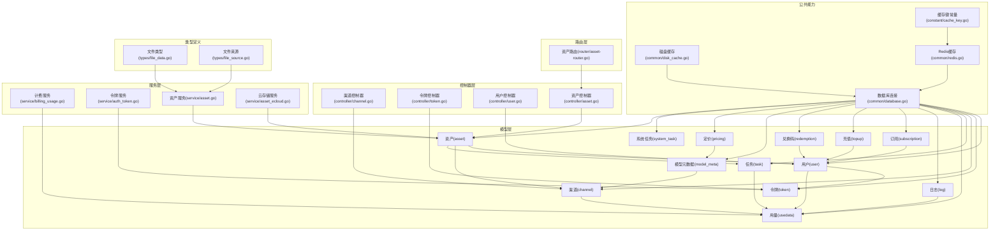

图表来源 
- [model/main.go](file://model/main.go)
- [model/asset.go](file://model/asset.go)
- [controller/asset.go](file://controller/asset.go)
- [service/asset.go](file://service/asset.go)
- [service/asset_ecloud.go](file://service/asset_ecloud.go)
- [router/asset-router.go](file://router/asset-router.go)
- [types/file_data.go](file://types/file_data.go)
- [types/file_source.go](file://types/file_source.go)
- [common/database.go](file://common/database.go)
- [common/disk_cache.go](file://common/disk_cache.go)
- [common/redis.go](file://common/redis.go)
- [constant/cache_key.go](file://constant/cache_key.go)

章节来源
- [model/main.go](file://model/main.go)
- [model/asset.go](file://model/asset.go)
- [common/database.go](file://common/database.go)

## 核心实体与关系
本节概述核心实体及其关系，包括用户、渠道、令牌、任务、用量、日志、订阅、充值、兑换码、模型元数据、定价、系统任务和资产。

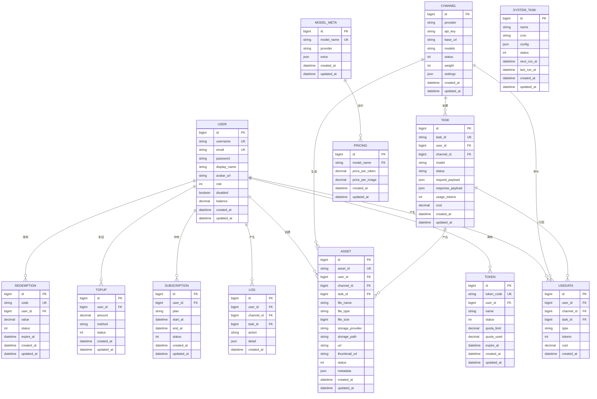

图表来源 
- [model/user.go](file://model/user.go)
- [model/token.go](file://model/token.go)
- [model/channel.go](file://model/channel.go)
- [model/task.go](file://model/task.go)
- [model/usedata.go](file://model/usedata.go)
- [model/log.go](file://model/log.go)
- [model/subscription.go](file://model/subscription.go)
- [model/topup.go](file://model/topup.go)
- [model/redemption.go](file://model/redemption.go)
- [model/model_meta.go](file://model/model_meta.go)
- [model/pricing.go](file://model/pricing.go)
- [model/system_task.go](file://model/system_task.go)
- [model/asset.go](file://model/asset.go)

章节来源
- [model/user.go](file://model/user.go)
- [model/token.go](file://model/token.go)
- [model/channel.go](file://model/channel.go)
- [model/task.go](file://model/task.go)
- [model/usedata.go](file://model/usedata.go)
- [model/log.go](file://model/log.go)
- [model/subscription.go](file://model/subscription.go)
- [model/topup.go](file://model/topup.go)
- [model/redemption.go](file://model/redemption.go)
- [model/model_meta.go](file://model/model_meta.go)
- [model/pricing.go](file://model/pricing.go)
- [model/system_task.go](file://model/system_task.go)
- [model/asset.go](file://model/asset.go)

## 架构总览
数据模型通过统一的数据库连接初始化与ORM映射进行持久化，配合磁盘缓存与Redis缓存提升读取性能；服务层封装计费、令牌校验、资产管理等关键业务；控制器层暴露HTTP接口供前端或外部调用。

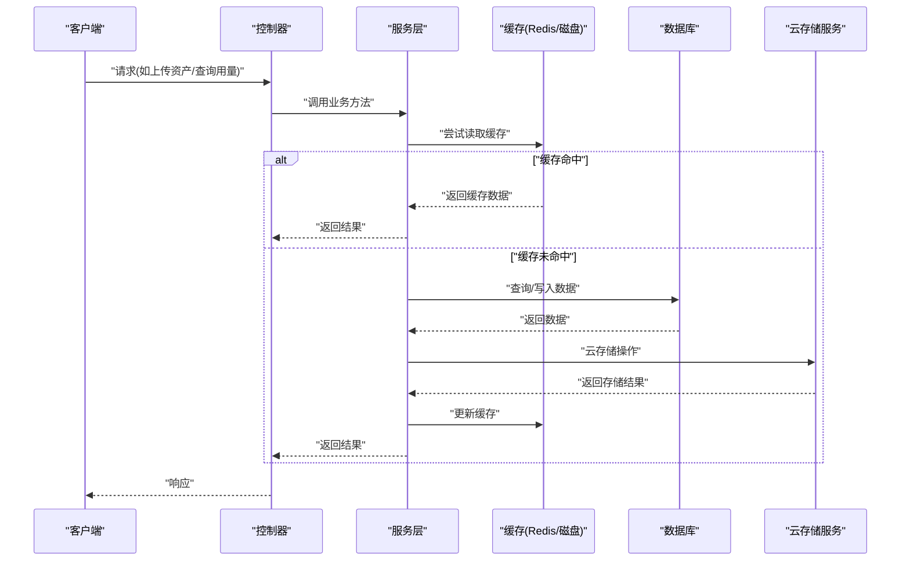

图表来源 
- [common/database.go](file://common/database.go)
- [common/disk_cache.go](file://common/disk_cache.go)
- [common/redis.go](file://common/redis.go)
- [constant/cache_key.go](file://constant/cache_key.go)
- [service/billing_usage.go](file://service/billing_usage.go)
- [service/auth_token.go](file://service/auth_token.go)
- [service/asset.go](file://service/asset.go)
- [service/asset_ecloud.go](file://service/asset_ecloud.go)

## 详细组件分析

### 用户(User)
- 职责：系统用户身份、账户余额、角色与状态管理
- 关键字段：id、用户名、邮箱、密码、显示名、头像、角色、禁用标志、余额、时间戳
- 主键/索引：id为主键；用户名、邮箱唯一索引
- 约束与验证：邮箱格式校验、密码加密存储、余额非负
- 关联：一对多令牌、用量、日志、订阅、充值、兑换码、资产

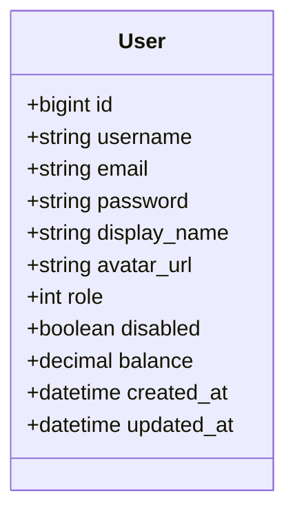

图表来源 
- [model/user.go](file://model/user.go)

章节来源
- [model/user.go](file://model/user.go)
- [controller/user.go](file://controller/user.go)

### 令牌(Token)
- 职责：API访问令牌，绑定用户，控制配额与过期
- 关键字段：id、令牌码、用户ID、名称、状态、配额限制、已用配额、过期时间、时间戳
- 主键/索引：id为主键；令牌码唯一索引；用户ID外键索引
- 约束与验证：令牌码唯一、状态枚举、配额非负、过期时间逻辑
- 关联：属于用户；被计费服务用于鉴权与扣费

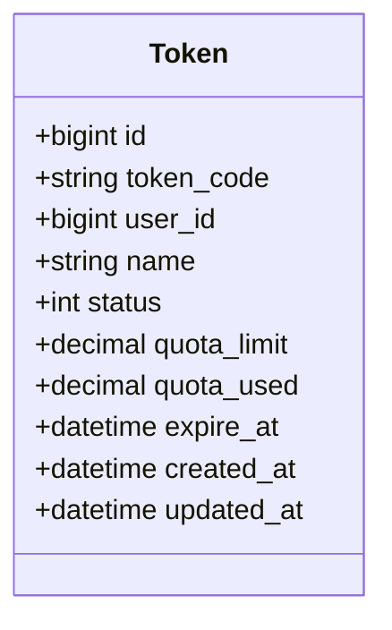

图表来源 
- [model/token.go](file://model/token.go)

章节来源
- [model/token.go](file://model/token.go)
- [service/auth_token.go](file://service/auth_token.go)
- [controller/token.go](file://controller/token.go)

### 渠道(Channel)
- 职责：上游AI服务提供商接入配置，支持多模型、权重与设置
- 关键字段：id、提供商、API密钥、基础URL、模型列表、状态、权重、设置JSON、时间戳
- 主键/索引：id为主键；提供商+基础URL组合索引
- 约束与验证：必填字段校验、状态枚举、权重范围
- 关联：一对多任务；参与用量统计；可生成资产

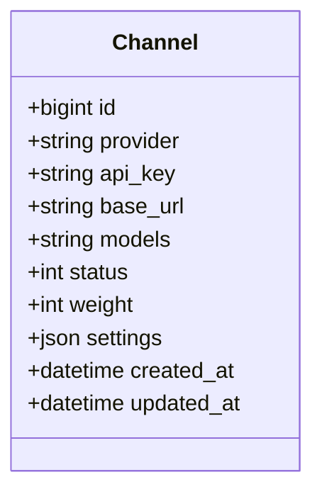

图表来源 
- [model/channel.go](file://model/channel.go)

章节来源
- [model/channel.go](file://model/channel.go)
- [controller/channel.go](file://controller/channel.go)

### 任务(Task)
- 职责：一次请求的处理记录，包含请求/响应载荷、模型、状态、用量与成本
- 关键字段：id、任务ID、用户ID、渠道ID、模型、状态、请求载荷、响应载荷、token用量、成本、时间戳
- 主键/索引：id为主键；任务ID唯一索引；用户ID、渠道ID外键索引
- 约束与验证：状态枚举、载荷JSON合法性、用量非负
- 关联：属于用户与渠道；归因到用量；可产出生成资产

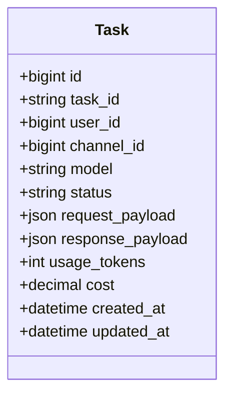

图表来源 
- [model/task.go](file://model/task.go)

章节来源
- [model/task.go](file://model/task.go)

### 用量(Usedata)
- 职责：细粒度用量统计，按用户、渠道、任务维度聚合
- 关键字段：id、用户ID、渠道ID、任务ID、类型、token数、成本、时间戳
- 主键/索引：id为主键；用户ID、渠道ID、任务ID外键索引；时间戳索引
- 约束与验证：token数非负、成本非负
- 关联：由任务生成；被计费服务消费

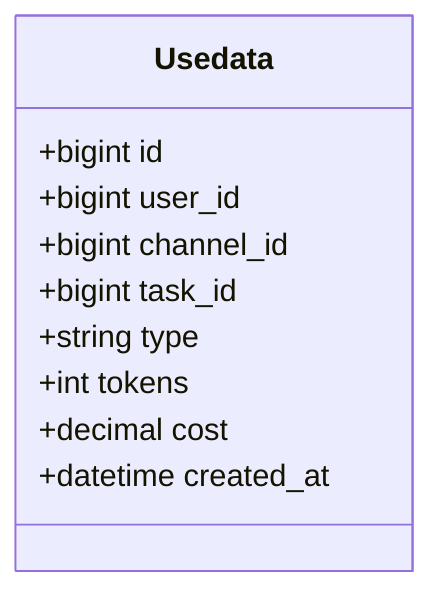

图表来源 
- [model/usedata.go](file://model/usedata.go)

章节来源
- [model/usedata.go](file://model/usedata.go)
- [service/billing_usage.go](file://service/billing_usage.go)

### 日志(Log)
- 职责：操作审计与调试信息，记录动作与详情
- 关键字段：id、用户ID、渠道ID、任务ID、动作、详情JSON、时间戳
- 主键/索引：id为主键；用户ID、渠道ID、任务ID外键索引；时间戳索引
- 约束与验证：动作枚举、详情JSON合法性

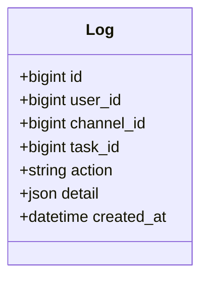

图表来源 
- [model/log.go](file://model/log.go)

章节来源
- [model/log.go](file://model/log.go)

### 订阅(Subscription)、充值(Topup)、兑换码(Redemption)
- 订阅：用户订阅计划、起止时间、状态
- 充值：用户充值金额、支付方式、状态
- 兑换码：兑换码唯一、用户绑定、价值、状态、过期时间

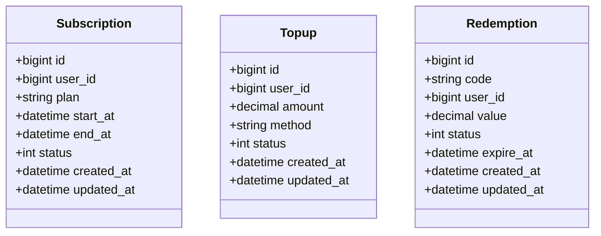

图表来源 
- [model/subscription.go](file://model/subscription.go)
- [model/topup.go](file://model/topup.go)
- [model/redemption.go](file://model/redemption.go)

章节来源
- [model/subscription.go](file://model/subscription.go)
- [model/topup.go](file://model/topup.go)
- [model/redemption.go](file://model/redemption.go)

### 模型元数据(ModelMeta)与定价(Pricing)
- 模型元数据：模型名称、提供商、扩展信息
- 定价：按模型定价，支持token与图片单价

```mermaid
classDiagram
class ModelMeta {
+bigint id
+string model_name
+string provider
+json extra
+datetime created_at
+datetime updated_at
}
class Pricing {
+bigint id
+string model_name
+decimal price_per_token
+decimal price_per_image
+datetime created_at
+datetime updated_at
}
ModelMeta ||--o{ Pricing : "定价"
```

图表来源 
- [model/model_meta.go](file://model/model_meta.go)
- [model/pricing.go](file://model/pricing.go)

章节来源
- [model/model_meta.go](file://model/model_meta.go)
- [model/pricing.go](file://model/pricing.go)

### 系统任务(SystemTask)
- 职责：定时任务配置与执行状态，支持Cron表达式与运行时间跟踪

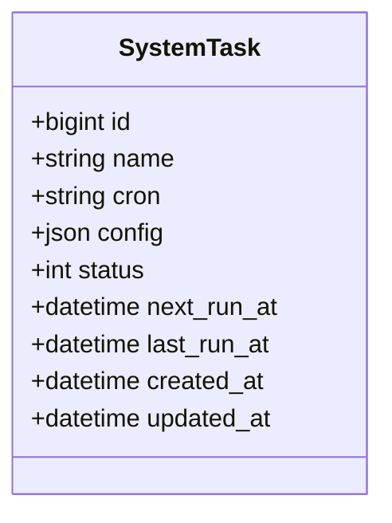

图表来源 
- [model/system_task.go](file://model/system_task.go)

章节来源
- [model/system_task.go](file://model/system_task.go)

### 资产(Asset) - **新增**
- 职责：管理用户上传和生成的文件资源，支持多种存储后端和云存储服务
- 关键字段：id、资产ID、用户ID、渠道ID、任务ID、文件名、文件类型、文件大小、存储提供商、存储路径、URL、缩略图URL、状态、元数据、时间戳
- 主键/索引：id为主键；资产ID唯一索引；用户ID、渠道ID、任务ID外键索引；时间戳索引
- 约束与验证：文件大小限制、文件类型白名单、存储路径唯一性
- 关联：属于用户；由渠道或任务生成；支持多种存储后端

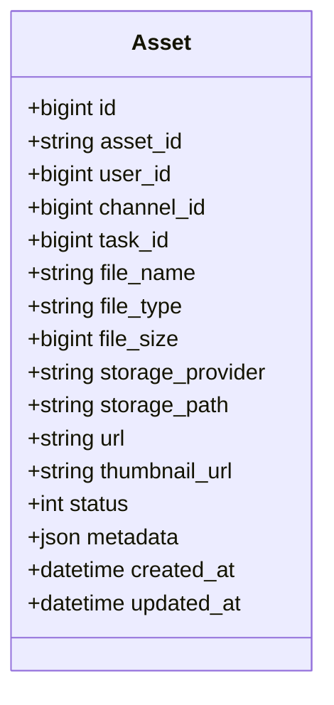

图表来源 
- [model/asset.go](file://model/asset.go)

章节来源
- [model/asset.go](file://model/asset.go)
- [controller/asset.go](file://controller/asset.go)
- [service/asset.go](file://service/asset.go)
- [service/asset_ecloud.go](file://service/asset_ecloud.go)

## 依赖分析
- 模型层依赖数据库连接初始化与ORM映射
- 服务层依赖缓存（Redis/磁盘）与数据库，实现计费、令牌校验、资产管理等
- 控制器层依赖服务层，暴露HTTP接口
- 资产服务依赖云存储服务接口，支持多种存储后端

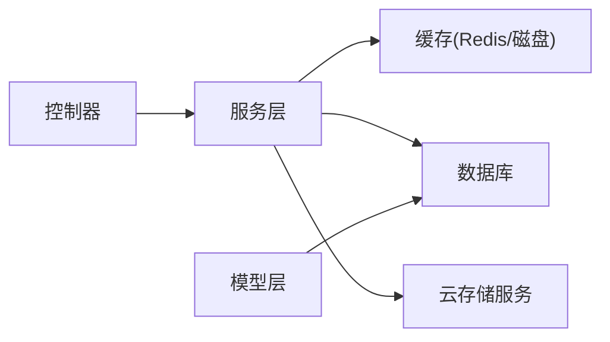

图表来源 
- [common/database.go](file://common/database.go)
- [common/disk_cache.go](file://common/disk_cache.go)
- [common/redis.go](file://common/redis.go)
- [service/billing_usage.go](file://service/billing_usage.go)
- [service/auth_token.go](file://service/auth_token.go)
- [service/asset.go](file://service/asset.go)
- [service/asset_ecloud.go](file://service/asset_ecloud.go)

章节来源
- [common/database.go](file://common/database.go)
- [common/disk_cache.go](file://common/disk_cache.go)
- [common/redis.go](file://common/redis.go)
- [service/billing_usage.go](file://service/billing_usage.go)
- [service/auth_token.go](file://service/auth_token.go)
- [service/asset.go](file://service/asset.go)
- [service/asset_ecloud.go](file://service/asset_ecloud.go)

## 性能考虑
- 缓存策略
  - Redis热点键：用户会话、令牌校验、渠道配置、用量统计聚合、资产元数据
  - 磁盘缓存：大对象或批量数据的本地缓存，降低数据库压力
  - 缓存键命名：统一前缀与命名空间，避免冲突
- 索引优化
  - 高频查询字段建立索引（用户ID、渠道ID、任务ID、时间戳、资产ID）
  - 复合索引覆盖常用查询条件
- 批处理与异步
  - 用量写入采用批量插入与异步落盘
  - 日志写入采用缓冲队列
  - 资产上传采用分块上传与异步处理
- 连接池与超时
  - 数据库连接池大小与超时配置
  - Redis连接池与重试策略
  - 云存储服务连接池与重试机制

章节来源
- [common/disk_cache.go](file://common/disk_cache.go)
- [common/redis.go](file://common/redis.go)
- [constant/cache_key.go](file://constant/cache_key.go)
- [model/clickhouse_log_test.go](file://model/clickhouse_log_test.go)
- [service/asset.go](file://service/asset.go)
- [service/asset_ecloud.go](file://service/asset_ecloud.go)

## 故障排查指南
- 常见问题
  - 令牌无效或过期：检查令牌状态、过期时间与配额
  - 用量统计异常：核对任务与用量记录的关联关系
  - 渠道不可用：检查渠道状态、API密钥与基础URL
  - 资产上传失败：检查存储空间、权限配置和网络连接
  - 资产下载缓慢：检查CDN配置和缓存命中率
- 诊断步骤
  - 查看日志表中的动作与详情
  - 检查缓存命中率与失效原因
  - 核对数据库索引与查询计划
  - 监控云存储服务状态和错误日志
- 恢复措施
  - 重置令牌或延长过期时间
  - 清理缓存并重新加载配置
  - 修复渠道配置并重试请求
  - 重新配置云存储服务并测试连接

章节来源
- [model/log.go](file://model/log.go)
- [model/usedata.go](file://model/usedata.go)
- [model/channel.go](file://model/channel.go)
- [model/token.go](file://model/token.go)
- [model/asset.go](file://model/asset.go)
- [service/asset.go](file://service/asset.go)
- [service/asset_ecloud.go](file://service/asset_ecloud.go)

## 结论
本数据模型以用户为中心，围绕令牌、渠道、任务、用量、资产构建完整的计费与审计体系。通过合理的索引与缓存策略，保障高并发下的性能与稳定性。新增的资产模块支持云存储功能，提供了完整的文件管理能力。建议持续监控用量增长与缓存命中率，定期归档历史数据，确保系统可扩展与安全合规。

## 附录

### 数据验证规则与业务规则
- 用户
  - 邮箱格式校验、密码加密存储、余额非负
- 令牌
  - 令牌码唯一、状态枚举、配额非负、过期时间逻辑
- 渠道
  - 必填字段校验、状态枚举、权重范围
- 任务
  - 状态枚举、载荷JSON合法性、用量非负
- 用量
  - token数与成本非负
- 订阅/充值/兑换码
  - 状态枚举、过期时间逻辑、价值非负
- 资产
  - 文件大小限制、文件类型白名单、存储路径唯一性、URL有效性

章节来源
- [model/user.go](file://model/user.go)
- [model/token.go](file://model/token.go)
- [model/channel.go](file://model/channel.go)
- [model/task.go](file://model/task.go)
- [model/usedata.go](file://model/usedata.go)
- [model/subscription.go](file://model/subscription.go)
- [model/topup.go](file://model/topup.go)
- [model/redemption.go](file://model/redemption.go)
- [model/asset.go](file://model/asset.go)

### 数据生命周期、保留策略与归档规则
- 生命周期
  - 用户：注册至注销，注销后软删除并保留必要审计信息
  - 令牌：创建至过期，过期后归档或删除
  - 渠道：配置变更历史保留
  - 任务：活跃期保留，历史归档
  - 用量：短期热数据缓存，长期归档至冷存储
  - 日志：短期热数据，长期归档
  - 资产：活跃期保留，过期后清理或归档
- 保留策略
  - 按时间窗口分级保留（近7天热数据、30天温数据、1年冷数据）
  - 资产按大小和访问频率分层存储
- 归档规则
  - 按月分区归档，压缩存储，保留可检索索引
  - 资产归档时保留元数据和缩略图

[本节为概念性内容，不直接分析具体文件]

### 数据迁移路径与版本管理
- 迁移脚本
  - v0.2→v0.3：新增字段与索引调整
  - v0.3→v0.4：表结构优化与数据迁移
  - v0.4→v0.5：新增资产表和云存储相关字段
- 版本管理
  - 迁移脚本顺序执行，幂等设计
  - 回滚策略：备份与回滚脚本

章节来源
- [bin/migration_v0.2-v0.3.sql](file://bin/migration_v0.2-v0.3.sql)
- [bin/migration_v0.3-v0.4.sql](file://bin/migration_v0.3-v0.4.sql)

### 数据安全、隐私要求与访问控制
- 安全
  - 密码加密存储、令牌随机生成与传输加密
  - 敏感字段脱敏展示
  - 资产访问权限控制和防盗链保护
- 隐私
  - 用户数据最小化收集，明确用途与保留期限
  - 支持数据导出与删除
  - 资产隐私设置和访问控制
- 访问控制
  - 基于角色的权限控制（RBAC）
  - 渠道与模型访问白名单
  - 资产访问令牌和临时URL

[本节为概念性内容，不直接分析具体文件]

### 示例数据
- 用户
  - 用户名、邮箱、余额、角色
- 令牌
  - 令牌码、用户ID、配额限制、过期时间
- 渠道
  - 提供商、API密钥、基础URL、模型列表
- 任务
  - 任务ID、用户ID、渠道ID、模型、状态、token用量、成本
- 用量
  - 用户ID、渠道ID、任务ID、类型、token数、成本
- 日志
  - 用户ID、渠道ID、任务ID、动作、详情
- 订阅/充值/兑换码
  - 用户ID、计划/金额/价值、状态、过期时间
- 资产
  - 资产ID、用户ID、文件名、文件类型、文件大小、存储提供商、URL、状态

[本节为概念性内容，不直接分析具体文件]