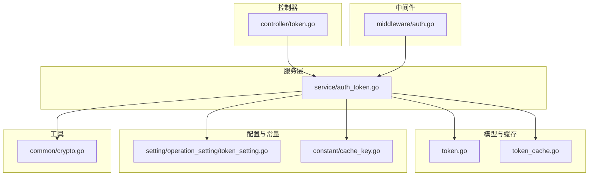
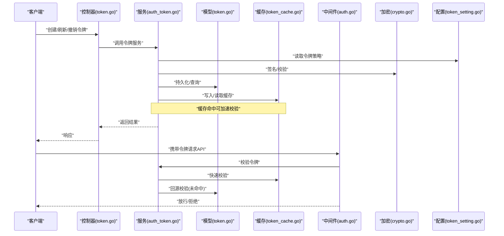
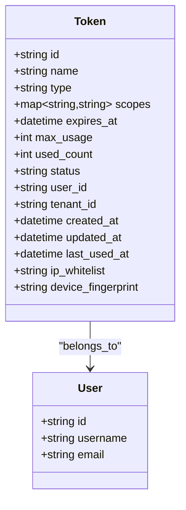
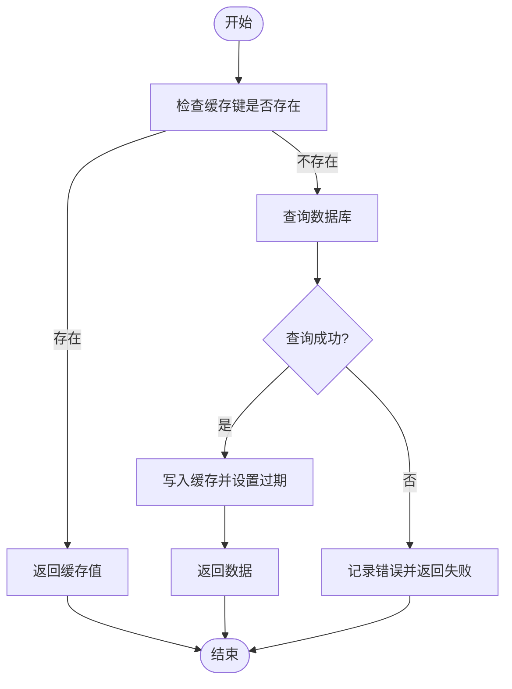
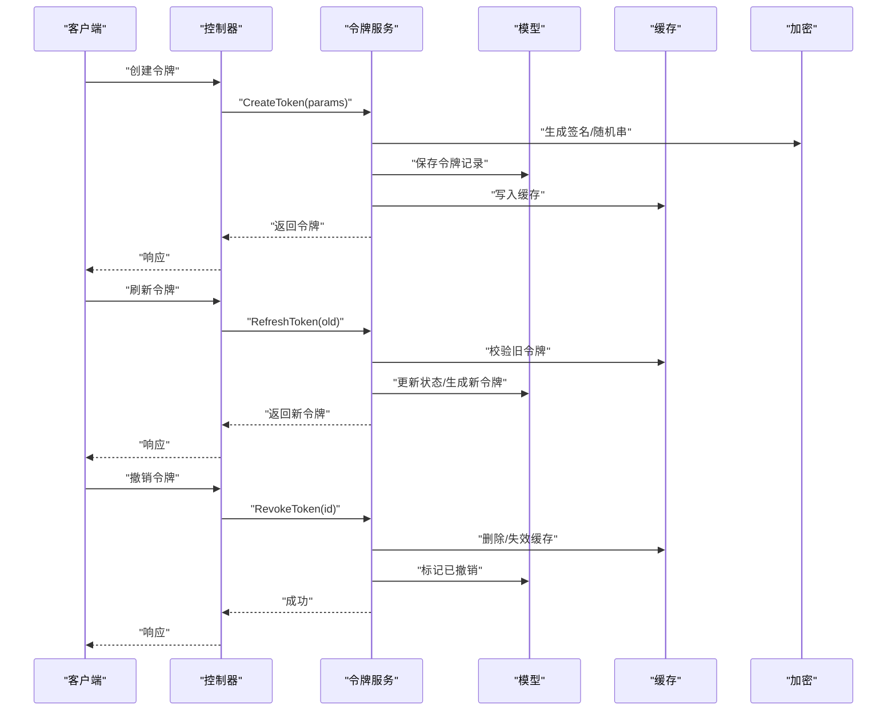
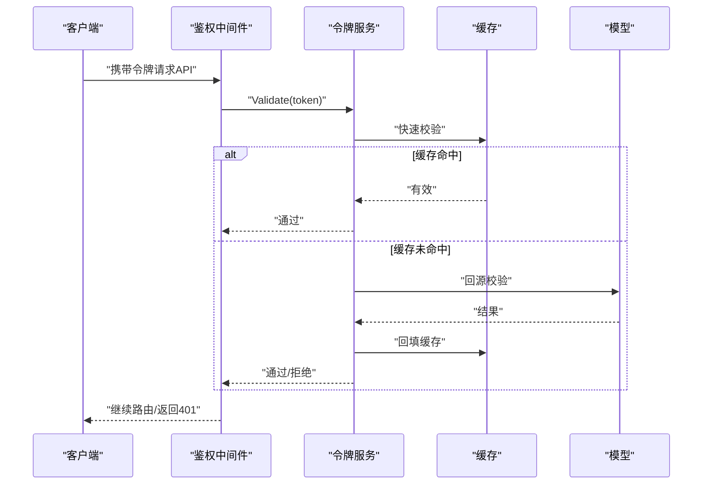
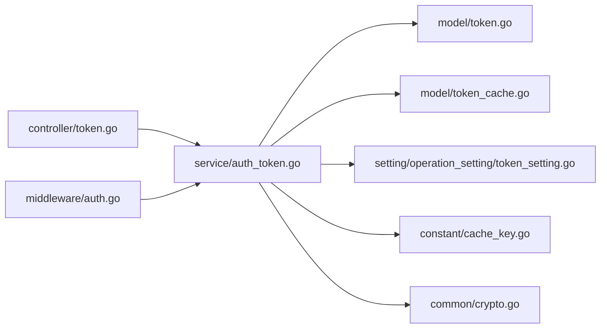

# 令牌实体 (Token)

<cite>
**本文引用的文件**   
- [model/token.go](file://model/token.go)
- [model/token_cache.go](file://model/token_cache.go)
- [controller/token.go](file://controller/token.go)
- [service/auth_token.go](file://service/auth_token.go)
- [middleware/auth.go](file://middleware/auth.go)
- [setting/operation_setting/token_setting.go](file://setting/operation_setting/token_setting.go)
- [constant/cache_key.go](file://constant/cache_key.go)
- [common/crypto.go](file://common/crypto.go)
</cite>

## 目录
1. [简介](#简介)
2. [项目结构](#项目结构)
3. [核心组件](#核心组件)
4. [架构总览](#架构总览)
5. [详细组件分析](#详细组件分析)
6. [依赖关系分析](#依赖关系分析)
7. [性能考虑](#性能考虑)
8. [故障排查指南](#故障排查指南)
9. [结论](#结论)
10. [附录](#附录)

## 简介
本文件围绕“令牌(Token)”实体，系统化梳理其数据模型、生命周期与相关机制。内容涵盖：
- 令牌类型、权限范围、过期时间、使用限制等关键字段
- 令牌与用户的关联关系
- 令牌缓存机制与安全验证流程
- 令牌的生成、验证、刷新与撤销机制
- 安全策略、访问控制与审计日志
- 使用示例与安全最佳实践

## 项目结构
与令牌相关的代码主要分布在以下模块：
- 数据模型与缓存：model/token.go、model/token_cache.go
- 控制器层：controller/token.go
- 服务层：service/auth_token.go
- 中间件鉴权：middleware/auth.go
- 配置项：setting/operation_setting/token_setting.go
- 常量键：constant/cache_key.go
- 加密工具：common/crypto.go

**图表来源** 
- [model/token.go](file://model/token.go)
- [model/token_cache.go](file://model/token_cache.go)
- [controller/token.go](file://controller/token.go)
- [service/auth_token.go](file://service/auth_token.go)
- [middleware/auth.go](file://middleware/auth.go)
- [setting/operation_setting/token_setting.go](file://setting/operation_setting/token_setting.go)
- [constant/cache_key.go](file://constant/cache_key.go)
- [common/crypto.go](file://common/crypto.go)

**章节来源**
- [model/token.go](file://model/token.go)
- [model/token_cache.go](file://model/token_cache.go)
- [controller/token.go](file://controller/token.go)
- [service/auth_token.go](file://service/auth_token.go)
- [middleware/auth.go](file://middleware/auth.go)
- [setting/operation_setting/token_setting.go](file://setting/operation_setting/token_setting.go)
- [constant/cache_key.go](file://constant/cache_key.go)
- [common/crypto.go](file://common/crypto.go)

## 核心组件
- 令牌数据模型：定义令牌的核心字段（类型、权限、过期、限制等）及与用户的关系
- 令牌缓存：基于键空间与命名空间的快速存取与失效管理
- 令牌服务：封装令牌的创建、校验、刷新、撤销等业务逻辑
- 鉴权中间件：在请求链路中完成令牌解析、校验与上下文注入
- 配置项：集中管理令牌策略（如有效期、刷新策略、黑名单等）
- 常量键：统一缓存键前缀与命名规范
- 加密工具：用于令牌签名、摘要或敏感信息保护

**章节来源**
- [model/token.go](file://model/token.go)
- [model/token_cache.go](file://model/token_cache.go)
- [service/auth_token.go](file://service/auth_token.go)
- [middleware/auth.go](file://middleware/auth.go)
- [setting/operation_setting/token_setting.go](file://setting/operation_setting/token_setting.go)
- [constant/cache_key.go](file://constant/cache_key.go)
- [common/crypto.go](file://common/crypto.go)

## 架构总览
令牌在系统中的流转路径如下：
- 客户端通过控制器发起令牌操作（创建、刷新、撤销）
- 控制器调用服务层进行业务处理
- 服务层读写模型与缓存，必要时结合加密工具
- 鉴权中间件在每次请求时校验令牌并注入上下文
- 配置与常量提供统一的策略与键约定

**图表来源**
- [controller/token.go](file://controller/token.go)
- [service/auth_token.go](file://service/auth_token.go)
- [model/token.go](file://model/token.go)
- [model/token_cache.go](file://model/token_cache.go)
- [middleware/auth.go](file://middleware/auth.go)
- [common/crypto.go](file://common/crypto.go)
- [setting/operation_setting/token_setting.go](file://setting/operation_setting/token_setting.go)

## 详细组件分析

### 令牌数据模型
- 关键字段建议
  - 标识：唯一ID、名称、描述
  - 类型：访问令牌、刷新令牌、API Key、临时令牌等
  - 权限范围：资源与动作的细粒度授权集合
  - 过期时间：绝对过期与相对过期策略
  - 使用限制：IP白名单、设备指纹、速率限制、最大并发
  - 状态：启用/禁用/已撤销
  - 关联用户：所属用户ID、租户/组织ID
  - 审计：创建时间、更新时间、最后使用时间、来源IP
- 设计要点
  - 将“权限范围”与“使用限制”抽象为可扩展的结构体，便于后续扩展
  - 过期时间支持多策略（固定TTL、滑动过期、按次衰减）
  - 与用户建立强关联，支持一对多令牌绑定
  - 审计字段贯穿全生命周期，便于追踪与合规

**图表来源**
- [model/token.go](file://model/token.go)

**章节来源**
- [model/token.go](file://model/token.go)

### 令牌缓存机制
- 目标
  - 降低数据库压力，提升高频校验性能
  - 支持按命名空间隔离不同场景的缓存键
- 关键点
  - 键空间：以用户/租户维度划分，避免冲突
  - 过期策略：与令牌过期一致，支持提前失效
  - 一致性：写穿模式，更新后同步缓存
  - 降级：缓存不可用时回源数据库

**图表来源**
- [model/token_cache.go](file://model/token_cache.go)
- [constant/cache_key.go](file://constant/cache_key.go)

**章节来源**
- [model/token_cache.go](file://model/token_cache.go)
- [constant/cache_key.go](file://constant/cache_key.go)

### 令牌服务（生成、验证、刷新、撤销）
- 生成
  - 根据策略选择类型与权限范围
  - 计算过期时间与使用限制
  - 持久化并写入缓存
- 验证
  - 优先从缓存校验，未命中则回源
  - 校验签名、状态、过期、限制条件
- 刷新
  - 校验原令牌有效性
  - 生成新令牌并更新旧令牌状态
- 撤销
  - 标记为已撤销并清理缓存
  - 记录审计日志

**图表来源**
- [service/auth_token.go](file://service/auth_token.go)
- [model/token.go](file://model/token.go)
- [model/token_cache.go](file://model/token_cache.go)
- [common/crypto.go](file://common/crypto.go)

**章节来源**
- [service/auth_token.go](file://service/auth_token.go)
- [model/token.go](file://model/token.go)
- [model/token_cache.go](file://model/token_cache.go)
- [common/crypto.go](file://common/crypto.go)

### 鉴权中间件（安全验证流程）
- 职责
  - 解析请求中的令牌
  - 调用服务层进行校验
  - 将用户与权限上下文注入到请求环境
- 策略
  - 支持多种令牌类型（访问令牌、API Key等）
  - 支持黑名单与即时失效
  - 支持限流与风控联动

**图表来源**
- [middleware/auth.go](file://middleware/auth.go)
- [service/auth_token.go](file://service/auth_token.go)
- [model/token_cache.go](file://model/token_cache.go)
- [model/token.go](file://model/token.go)

**章节来源**
- [middleware/auth.go](file://middleware/auth.go)
- [service/auth_token.go](file://service/auth_token.go)
- [model/token_cache.go](file://model/token_cache.go)
- [model/token.go](file://model/token.go)

### 配置项（令牌策略）
- 常见配置项
  - 默认过期时间（秒/分钟/小时）
  - 是否允许刷新、刷新窗口
  - 是否启用黑名单/撤销立即生效
  - 是否启用IP白名单/设备指纹
  - 速率限制与并发上限
- 作用域
  - 全局默认策略
  - 按用户/租户覆盖策略

**章节来源**
- [setting/operation_setting/token_setting.go](file://setting/operation_setting/token_setting.go)

### 常量键（缓存键规范）
- 命名规范
  - 前缀：统一前缀避免冲突
  - 命名空间：user/tokens、tenant/tokens
  - 实例键：包含用户ID、令牌ID、版本等
- 目的
  - 提高可读性与可维护性
  - 便于批量清理与监控

**章节来源**
- [constant/cache_key.go](file://constant/cache_key.go)

### 加密工具（安全基础）
- 用途
  - 令牌签名与验签
  - 敏感字段摘要或脱敏
  - 随机数生成（防重放）
- 要求
  - 使用强随机源
  - 支持算法升级与兼容

**章节来源**
- [common/crypto.go](file://common/crypto.go)

## 依赖关系分析
- 控制器依赖服务层，服务层依赖模型与缓存
- 中间件依赖服务层进行校验
- 配置与常量被服务层与缓存层共同引用
- 加密工具被服务层与中间件使用

**图表来源**
- [controller/token.go](file://controller/token.go)
- [service/auth_token.go](file://service/auth_token.go)
- [model/token.go](file://model/token.go)
- [model/token_cache.go](file://model/token_cache.go)
- [middleware/auth.go](file://middleware/auth.go)
- [setting/operation_setting/token_setting.go](file://setting/operation_setting/token_setting.go)
- [constant/cache_key.go](file://constant/cache_key.go)
- [common/crypto.go](file://common/crypto.go)

**章节来源**
- [controller/token.go](file://controller/token.go)
- [service/auth_token.go](file://service/auth_token.go)
- [model/token.go](file://model/token.go)
- [model/token_cache.go](file://model/token_cache.go)
- [middleware/auth.go](file://middleware/auth.go)
- [setting/operation_setting/token_setting.go](file://setting/operation_setting/token_setting.go)
- [constant/cache_key.go](file://constant/cache_key.go)
- [common/crypto.go](file://common/crypto.go)

## 性能考虑
- 缓存命中率优化
  - 合理设置过期时间与预热策略
  - 使用命名空间隔离减少冲突
- 回源降级
  - 缓存不可用时的快速失败与重试
- 校验路径优化
  - 优先缓存校验，未命中再回源
- 资源限制
  - 对令牌创建与刷新接口实施限流
- 监控与告警
  - 统计缓存命中率、校验耗时、失败率

[本节为通用指导，不直接分析具体文件]

## 故障排查指南
- 常见问题
  - 令牌无效：检查签名、过期时间、状态、黑名单
  - 缓存不一致：检查写穿逻辑与失效策略
  - 权限不足：核对权限范围与资源匹配
  - 限流触发：检查速率限制与并发上限
- 排查步骤
  - 查看中间件日志与鉴权结果
  - 检查缓存键是否存在与过期时间
  - 核对模型记录的状态与审计字段
  - 确认配置项是否正确加载

**章节来源**
- [middleware/auth.go](file://middleware/auth.go)
- [service/auth_token.go](file://service/auth_token.go)
- [model/token_cache.go](file://model/token_cache.go)
- [model/token.go](file://model/token.go)

## 结论
令牌实体是整个系统鉴权与访问控制的核心。通过清晰的数据模型、健壮的缓存机制、完善的生成/验证/刷新/撤销流程以及严格的安全策略，能够有效保障系统的安全性与可用性。建议在开发过程中遵循最小权限原则、严格的过期策略与完善的审计记录，确保令牌的生命周期可控、可追溯。

[本节为总结性内容，不直接分析具体文件]

## 附录
- 使用示例（概念性）
  - 创建访问令牌：指定类型、权限范围、过期时间、使用限制
  - 刷新令牌：携带旧令牌，获取新令牌并更新旧令牌状态
  - 撤销令牌：立即失效并清理缓存
- 安全最佳实践
  - 最小权限原则：仅授予必要权限
  - 短生命周期：缩短过期时间，配合刷新机制
  - 传输安全：始终通过HTTPS传输令牌
  - 存储安全：服务端不记录明文密钥，客户端谨慎存储
  - 审计与监控：记录关键操作与异常事件
  - 黑名单与即时失效：支持快速撤销与传播

[本节为概念性内容，不直接分析具体文件]