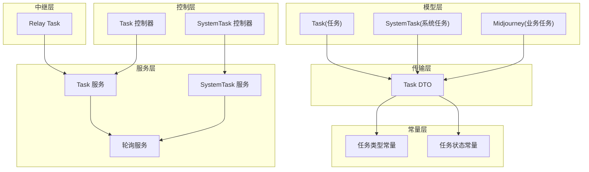
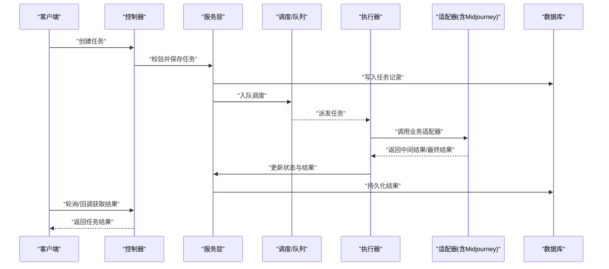
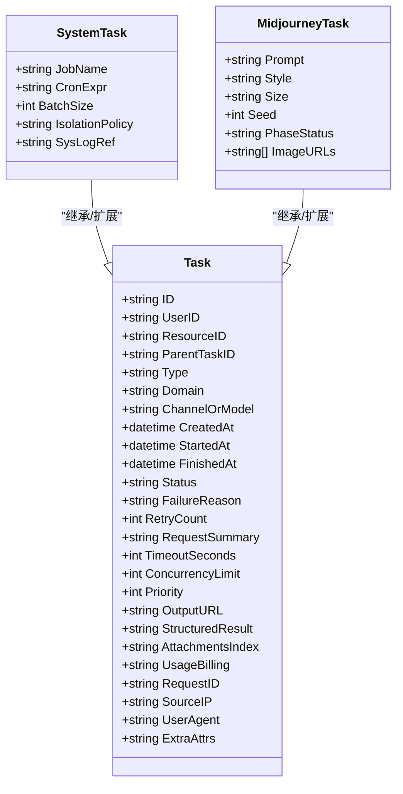
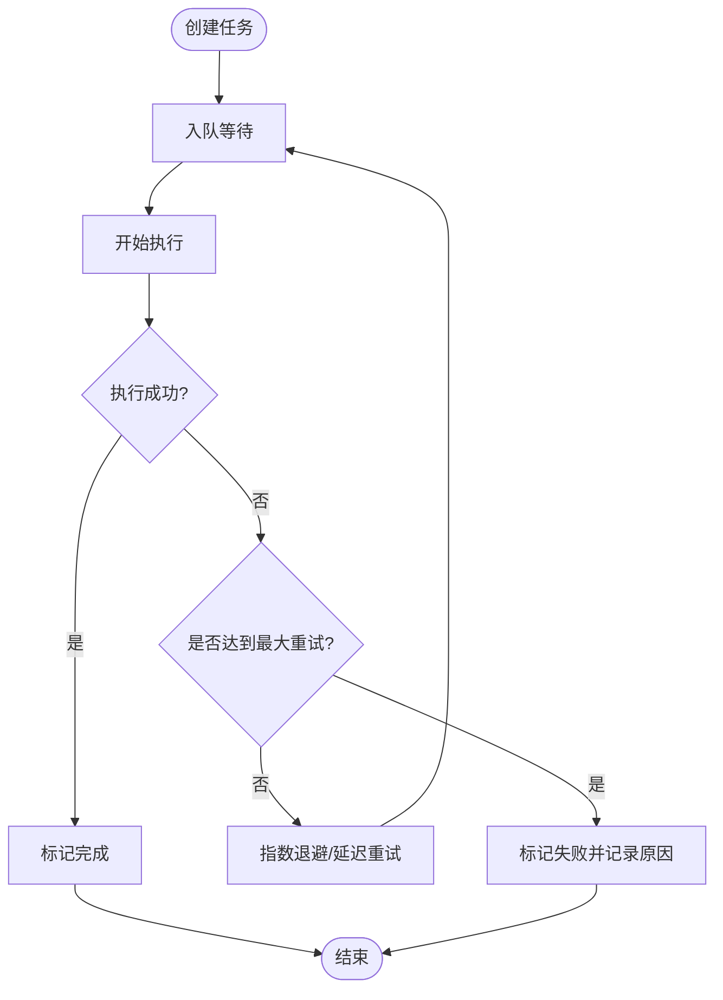
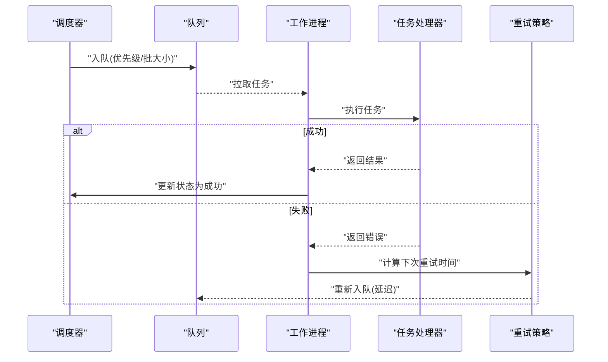
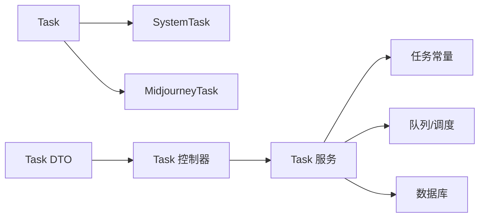

# 任务实体 (Task)

<cite>
**本文引用的文件**   
- [model/task.go](file://model/task.go)
- [model/system_task.go](file://model/system_task.go)
- [dto/task.go](file://dto/task.go)
- [constant/task.go](file://constant/task.go)
- [controller/task.go](file://controller/task.go)
- [controller/system_task.go](file://controller/system_task.go)
- [service/task.go](file://service/task.go)
- [service/system_task.go](file://service/system_task.go)
- [service/task_polling.go](file://service/task_polling.go)
- [relay/relay_task.go](file://relay/relay_task.go)
</cite>

## 目录
1. [简介](#简介)
2. [项目结构](#项目结构)
3. [核心组件](#核心组件)
4. [架构总览](#架构总览)
5. [详细组件分析](#详细组件分析)
6. [依赖关系分析](#依赖关系分析)
7. [性能考量](#性能考量)
8. [故障排查指南](#故障排查指南)
9. [结论](#结论)
10. [附录](#附录)

## 简介
本文件围绕“任务实体(Task)”的数据模型与运行机制进行系统化说明，覆盖以下要点：
- 任务实体的完整字段结构与类型定义（任务类型、状态管理、执行参数、结果存储等）
- 系统任务(SystemTask)与特定业务任务(Midjourney)的差异化设计
- 任务的调度机制、执行队列、重试策略与错误处理
- 生命周期管理、监控指标与性能优化建议
- 任务处理的流程图与实际使用案例

## 项目结构
任务相关代码主要分布在以下模块：
- model: 数据模型定义（Task、SystemTask、Midjourney 等）
- dto: 数据传输对象（请求/响应结构）
- constant: 常量与枚举（任务类型、状态码等）
- controller: HTTP 控制器（创建、查询、轮询、回调等接口）
- service: 业务逻辑（调度、轮询、计费、重试、错误处理）
- relay: 中继层任务封装（对外协议适配）

图表来源
- [model/task.go](file://model/task.go)
- [model/system_task.go](file://model/system_task.go)
- [dto/task.go](file://dto/task.go)
- [constant/task.go](file://constant/task.go)
- [controller/task.go](file://controller/task.go)
- [controller/system_task.go](file://controller/system_task.go)
- [service/task.go](file://service/task.go)
- [service/system_task.go](file://service/system_task.go)
- [service/task_polling.go](file://service/task_polling.go)
- [relay/relay_task.go](file://relay/relay_task.go)

章节来源
- [model/task.go](file://model/task.go)
- [model/system_task.go](file://model/system_task.go)
- [dto/task.go](file://dto/task.go)
- [constant/task.go](file://constant/task.go)
- [controller/task.go](file://controller/task.go)
- [controller/system_task.go](file://controller/system_task.go)
- [service/task.go](file://service/task.go)
- [service/system_task.go](file://service/system_task.go)
- [service/task_polling.go](file://service/task_polling.go)
- [relay/relay_task.go](file://relay/relay_task.go)

## 核心组件
- 任务实体(Task)
  - 职责：承载一次异步或长耗时操作的元数据、执行参数、状态流转与结果存储。
  - 关键字段类别：
    - 标识与关联：任务ID、关联用户/资源ID、父任务ID
    - 类型与分类：任务类型（文本生成、图像生成、视频生成、系统任务等）、业务域标签
    - 状态与生命周期：创建时间、开始时间、结束时间、当前状态、失败原因、重试次数
    - 执行参数：目标渠道/模型、请求体摘要、超时、并发限制、优先级
    - 结果存储：输出内容/URL、结构化结果、附件索引、计费用量
    - 审计与追踪：请求ID、来源IP、用户代理、扩展属性(JSON)
- 系统任务(SystemTask)
  - 职责：系统级后台作业（如数据同步、清理、对账、订阅重置等），通常由调度器触发，具备独立的状态机与重试策略。
- Midjourney 任务
  - 职责：面向 Midjourney 业务的专用任务，包含 MJ 特有参数（如提示词、风格、尺寸、种子等）与结果映射（图片链接、进度阶段）。

章节来源
- [model/task.go](file://model/task.go)
- [model/system_task.go](file://model/system_task.go)
- [dto/task.go](file://dto/task.go)
- [constant/task.go](file://constant/task.go)

## 架构总览
任务系统的整体流程如下：
- 入口：控制器接收创建/查询/轮询/回调请求
- 服务层：校验参数、持久化任务、入队调度、触发执行
- 执行层：根据任务类型路由到具体处理器（含 Midjourney 适配器）
- 轮询与回调：支持主动轮询与被动回调两种结果获取方式
- 结果落库：更新状态、写入结果、记录计费与审计信息

图表来源
- [controller/task.go](file://controller/task.go)
- [service/task.go](file://service/task.go)
- [service/system_task.go](file://service/system_task.go)
- [service/task_polling.go](file://service/task_polling.go)
- [relay/relay_task.go](file://relay/relay_task.go)

## 详细组件分析

### 数据模型与字段说明
- Task(任务)
  - 标识与关联：任务ID、用户ID、资源ID、父任务ID
  - 类型与分类：任务类型、业务域、渠道/模型选择
  - 状态与生命周期：创建时间、开始时间、结束时间、状态、失败原因、重试次数
  - 执行参数：请求体摘要、超时、并发、优先级、重试策略
  - 结果存储：输出内容/URL、结构化结果、附件索引、计费用量
  - 审计与追踪：请求ID、来源IP、用户代理、扩展属性
- SystemTask(系统任务)
  - 在通用任务基础上增加系统作业特征：作业名称、调度表达式、批大小、隔离策略、系统级日志
- Midjourney(业务任务)
  - 在通用任务基础上增加 MJ 专属字段：提示词、风格、尺寸、种子、阶段状态、图片链接集合

图表来源
- [model/task.go](file://model/task.go)
- [model/system_task.go](file://model/system_task.go)

章节来源
- [model/task.go](file://model/task.go)
- [model/system_task.go](file://model/system_task.go)
- [dto/task.go](file://dto/task.go)
- [constant/task.go](file://constant/task.go)

### 任务类型与状态管理
- 任务类型
  - 文本生成、图像生成、视频生成、音频生成、系统任务、其他自定义类型
- 状态机
  - 新建 -> 排队中 -> 执行中 -> 成功/失败 -> 已取消
  - 失败分支支持重试（受最大重试次数与退避策略约束）
  - 可被外部回调或内部轮询驱动状态迁移

图表来源
- [constant/task.go](file://constant/task.go)
- [service/task.go](file://service/task.go)
- [service/system_task.go](file://service/system_task.go)

章节来源
- [constant/task.go](file://constant/task.go)
- [service/task.go](file://service/task.go)
- [service/system_task.go](file://service/system_task.go)

### 执行参数与结果存储
- 执行参数
  - 超时配置、并发限制、优先级、重试策略（最大次数、退避算法、幂等键）
  - 渠道/模型选择、请求体摘要（便于审计与调试）
- 结果存储
  - 输出URL/内容、结构化结果（JSON）、附件索引（多文件场景）
  - 计费用量（token/次/时长等）与审计信息（请求ID、来源IP、UA）

章节来源
- [dto/task.go](file://dto/task.go)
- [service/task.go](file://service/task.go)

### 系统任务(SystemTask)与 Midjourney 任务差异
- SystemTask
  - 侧重系统级作业：定时/批量、隔离策略、系统日志引用、批处理大小
  - 典型用例：数据同步、缓存预热、账单结算、订阅重置
- Midjourney
  - 侧重业务特性：提示词、风格、尺寸、种子、阶段状态、图片链接集合
  - 典型用例：图像生成、风格迁移、批量出图

章节来源
- [model/system_task.go](file://model/system_task.go)
- [dto/task.go](file://dto/task.go)

### 调度机制、执行队列与重试策略
- 调度机制
  - 基于服务层的调度器将任务入队，按优先级与资源可用性派发
  - 支持定时任务（SystemTask）与即时任务（业务任务）
- 执行队列
  - 内存队列或外部消息队列（视部署配置），保证高吞吐与解耦
- 重试策略
  - 指数退避、抖动、最大重试次数、幂等键去重
  - 失败原因分类（网络错误、业务错误、超时、限流）

图表来源
- [service/task.go](file://service/task.go)
- [service/system_task.go](file://service/system_task.go)
- [service/task_polling.go](file://service/task_polling.go)

章节来源
- [service/task.go](file://service/task.go)
- [service/system_task.go](file://service/system_task.go)
- [service/task_polling.go](file://service/task_polling.go)

### 错误处理与监控指标
- 错误处理
  - 区分可重试与不可重试错误，记录失败原因与堆栈
  - 支持熔断与降级（针对上游不稳定）
- 监控指标
  - 任务总量、成功率、平均耗时、P95/P99 耗时、队列长度、重试率、失败原因分布
  - 系统任务作业运行时长、批处理吞吐、失败告警

章节来源
- [service/task.go](file://service/task.go)
- [service/system_task.go](file://service/system_task.go)

### 实际使用案例
- 创建 Midjourney 图像生成任务
  - 输入：提示词、风格、尺寸、种子、并发与超时
  - 过程：入队 -> 执行 -> 阶段轮询 -> 结果回写
  - 输出：图片URL集合、阶段状态、计费用量
- 创建系统任务（如订阅重置）
  - 输入：作业名、调度表达式、批大小、隔离策略
  - 过程：定时触发 -> 批量处理 -> 统计与审计
  - 输出：作业日志、成功/失败计数、异常详情

章节来源
- [controller/task.go](file://controller/task.go)
- [controller/system_task.go](file://controller/system_task.go)
- [dto/task.go](file://dto/task.go)

## 依赖关系分析
- 模型依赖
  - Task 作为基类/基础结构，SystemTask 与 MidjourneyTask 在其上扩展
- 服务依赖
  - 服务层依赖常量（类型/状态）、DTO（请求/响应）、数据库（持久化）、队列（调度）
- 控制器依赖
  - 控制器依赖服务层进行业务编排，暴露 REST/WebSocket 接口

图表来源
- [model/task.go](file://model/task.go)
- [model/system_task.go](file://model/system_task.go)
- [dto/task.go](file://dto/task.go)
- [constant/task.go](file://constant/task.go)
- [controller/task.go](file://controller/task.go)
- [service/task.go](file://service/task.go)

章节来源
- [model/task.go](file://model/task.go)
- [model/system_task.go](file://model/system_task.go)
- [dto/task.go](file://dto/task.go)
- [constant/task.go](file://constant/task.go)
- [controller/task.go](file://controller/task.go)
- [service/task.go](file://service/task.go)

## 性能考量
- 队列与并发
  - 合理设置队列容量与工作进程数，避免背压与内存溢出
  - 使用优先级队列保障关键任务优先执行
- 超时与限流
  - 为每个任务设置合理超时；对上游接口实施限流与熔断
- 结果存储
  - 大结果采用外存（对象存储）+ 索引；结构化结果压缩存储
- 监控与告警
  - 采集关键指标（耗时、成功率、队列长度、重试率）并设置阈值告警
- 幂等与去重
  - 通过幂等键避免重复执行；对可重试错误采用指数退避

[本节为通用指导，不直接分析具体文件]

## 故障排查指南
- 常见问题
  - 任务长时间处于“排队中”：检查队列积压与工作进程健康
  - 频繁重试：查看失败原因分类（网络/业务/超时/限流），调整重试策略
  - 结果缺失：确认回调/轮询链路是否正常，检查结果存储路径
- 定位手段
  - 通过请求ID与任务ID追踪全链路日志
  - 查看失败原因与堆栈，结合上游接口状态码与错误信息
  - 监控指标看板快速定位瓶颈（队列长度、P95/P99 耗时、重试率）

章节来源
- [service/task.go](file://service/task.go)
- [service/system_task.go](file://service/system_task.go)
- [service/task_polling.go](file://service/task_polling.go)

## 结论
任务实体(Task)作为系统异步与长耗时操作的核心抽象，提供了统一的字段模型、状态机与执行框架。SystemTask 与 Midjourney 任务在通用模型基础上进行领域扩展，满足系统作业与业务特性的差异化需求。通过合理的调度、队列、重试与错误处理机制，配合完善的监控与性能优化策略，可实现高可靠、高吞吐的任务处理体系。

[本节为总结性内容，不直接分析具体文件]

## 附录
- API 参考
  - 创建任务：POST /api/tasks
  - 查询任务：GET /api/tasks/{id}
  - 轮询任务：GET /api/tasks/{id}/poll
  - 系统任务：POST /api/system-tasks
- 常用状态码
  - 新建、排队中、执行中、成功、失败、已取消
- 扩展点
  - 自定义任务类型与处理器
  - 自定义结果存储与计费策略

[本节为补充信息，不直接分析具体文件]