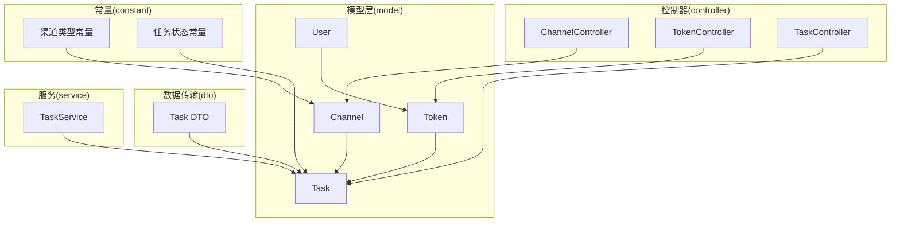
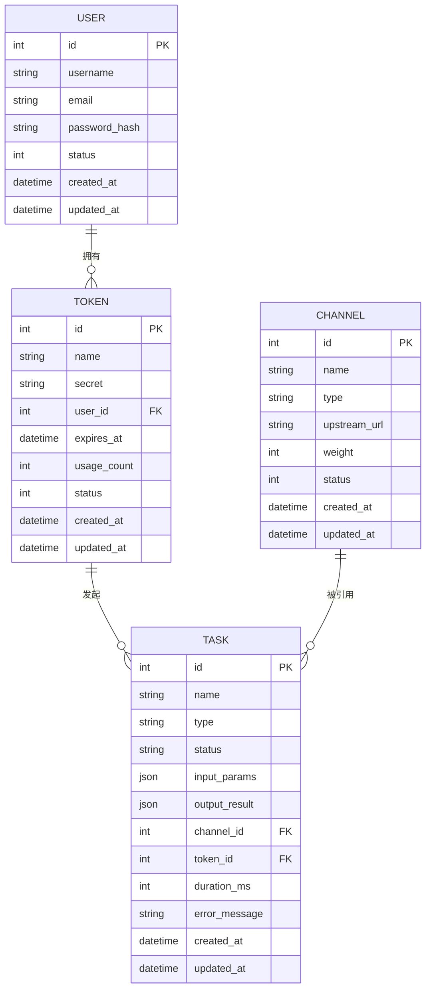
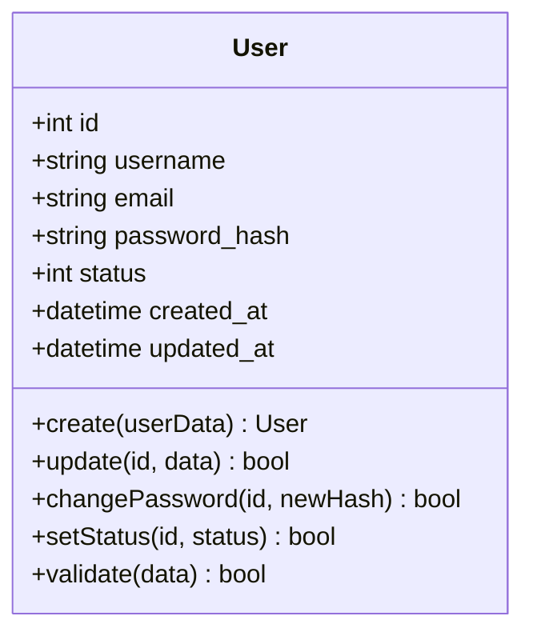
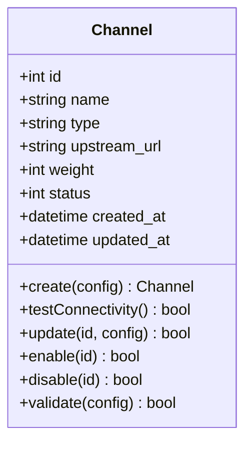
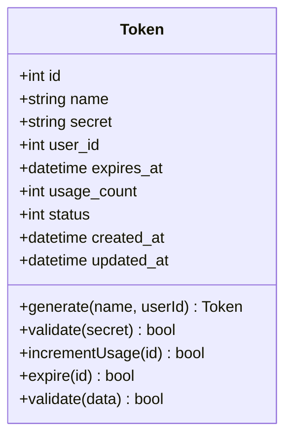
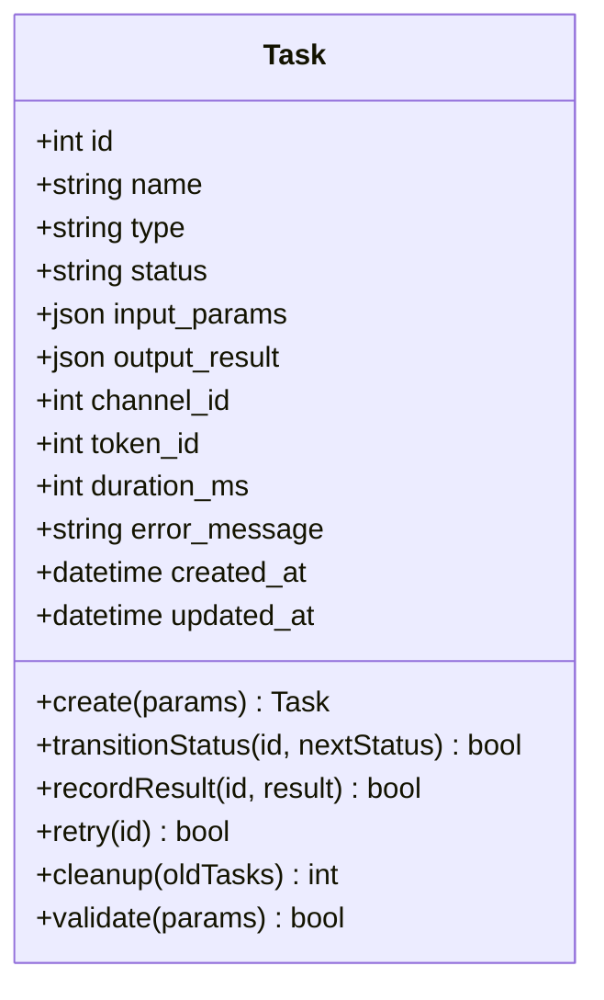
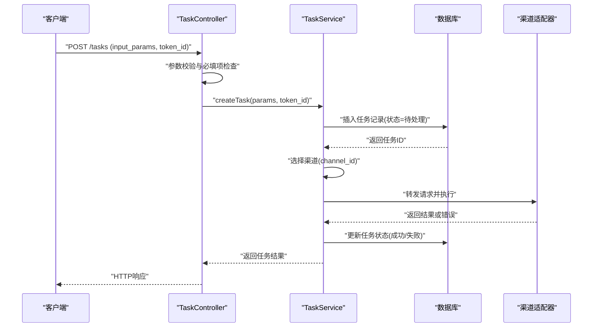
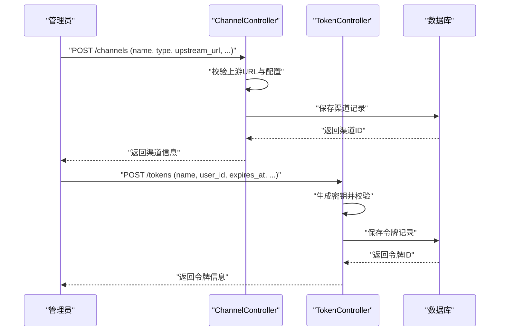
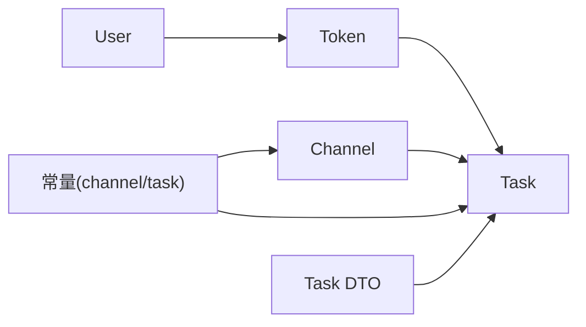

# 核心实体

<cite>
**本文引用的文件**   
- [model/user.go](file://model/user.go)
- [model/channel.go](file://model/channel.go)
- [model/token.go](file://model/token.go)
- [model/task.go](file://model/task.go)
- [constant/channel.go](file://constant/channel.go)
- [constant/task.go](file://constant/task.go)
- [dto/task.go](file://dto/task.go)
- [controller/channel.go](file://controller/channel.go)
- [controller/token.go](file://controller/token.go)
- [controller/task.go](file://controller/task.go)
- [service/task.go](file://service/task.go)
</cite>

## 目录
1. [简介](#简介)
2. [项目结构](#项目结构)
3. [核心实体](#核心实体)
4. [架构总览](#架构总览)
5. [详细组件分析](#详细组件分析)
6. [依赖关系分析](#依赖关系分析)
7. [性能考虑](#性能考虑)
8. [故障排查指南](#故障排查指南)
9. [结论](#结论)
10. [附录](#附录)

## 简介
本文件围绕用户(User)、渠道(Channel)、令牌(Token)、任务(Task)四个核心实体，系统化梳理其数据模型、字段定义与类型、主键/外键/索引/约束、关联关系与业务规则、数据验证与必填项、生命周期与状态转换，并提供ER图与示例数据，帮助开发者快速理解并正确使用这些实体。

## 项目结构
- 数据模型定义集中在 model 包中，按实体分文件组织：user.go、channel.go、token.go、task.go。
- 常量与枚举（如渠道类型、任务状态）集中在 constant 包中：channel.go、task.go。
- DTO 用于请求/响应数据传输，例如 dto/task.go 承载任务相关的数据传输结构。
- Controller 层负责HTTP接口与参数校验，Service 层封装业务逻辑与状态流转。

图表来源
- [model/user.go](file://model/user.go)
- [model/channel.go](file://model/channel.go)
- [model/token.go](file://model/token.go)
- [model/task.go](file://model/task.go)
- [constant/channel.go](file://constant/channel.go)
- [constant/task.go](file://constant/task.go)
- [dto/task.go](file://dto/task.go)
- [controller/channel.go](file://controller/channel.go)
- [controller/token.go](file://controller/token.go)
- [controller/task.go](file://controller/task.go)
- [service/task.go](file://service/task.go)

章节来源
- [model/user.go](file://model/user.go)
- [model/channel.go](file://model/channel.go)
- [model/token.go](file://model/token.go)
- [model/task.go](file://model/task.go)
- [constant/channel.go](file://constant/channel.go)
- [constant/task.go](file://constant/task.go)
- [dto/task.go](file://dto/task.go)
- [controller/channel.go](file://controller/channel.go)
- [controller/token.go](file://controller/token.go)
- [controller/task.go](file://controller/task.go)
- [service/task.go](file://service/task.go)

## 核心实体
本节对 User、Channel、Token、Task 四个实体的数据结构、字段与类型、主键/外键/索引/约束进行说明，并给出关联关系与业务规则、数据验证与必填项、生命周期与状态转换。

### 用户(User)
- 主键：自增ID或UUID（具体以模型实现为准）。
- 关键字段（常见）：用户名、邮箱、手机号、密码哈希、角色/权限标识、状态、创建/更新时间等。
- 索引与约束：
  - 唯一索引：邮箱、手机号（若启用）。
  - 非空约束：用户名、密码哈希、状态等。
- 关联关系：
  - 一对多：一个用户可拥有多个令牌(Token)。
  - 可能与其他实体存在多对多关系（如分组、角色），视扩展表而定。
- 业务规则：
  - 账号状态控制登录与访问权限。
  - 密码策略与安全存储要求。
- 数据验证与必填项：
  - 用户名长度与字符集限制。
  - 邮箱格式校验。
  - 密码强度校验。
- 生命周期与状态：
  - 新建 -> 激活 -> 禁用/注销 -> 删除（软删除或硬删除策略依实现）。

章节来源
- [model/user.go](file://model/user.go)

### 渠道(Channel)
- 主键：自增ID或UUID。
- 关键字段（常见）：名称、类型、上游地址、认证信息、权重/优先级、配额/限额、状态、创建/更新时间等。
- 索引与约束：
  - 唯一索引：名称或上游地址（取决于配置策略）。
  - 非空约束：名称、类型、状态等。
- 关联关系：
  - 一对多：一个渠道可被多个任务(Task)引用。
- 业务规则：
  - 渠道类型决定请求适配与计费方式。
  - 渠道可用性通过健康检查与权重调度。
- 数据验证与必填项：
  - 上游URL格式校验。
  - 认证凭据加密存储。
  - 配额与限流参数范围校验。
- 生命周期与状态：
  - 草稿 -> 启用 -> 停用/维护 -> 归档。

章节来源
- [model/channel.go](file://model/channel.go)
- [constant/channel.go](file://constant/channel.go)

### 令牌(Token)
- 主键：自增ID或UUID。
- 关键字段（常见）：名称、密钥值、所属用户ID、有效期、使用次数/配额、状态、创建/更新时间等。
- 索引与约束：
  - 唯一索引：密钥值。
  - 非空约束：密钥值、状态、过期时间（若启用）。
- 关联关系：
  - 多对一：多个令牌属于一个用户。
  - 一对多：一个令牌可发起多个任务(Task)。
- 业务规则：
  - 令牌鉴权与访问控制。
  - 配额与限流控制。
- 数据验证与必填项：
  - 密钥格式与长度限制。
  - 过期时间晚于当前时间。
- 生命周期与状态：
  - 生成 -> 激活 -> 过期/禁用 -> 回收。

章节来源
- [model/token.go](file://model/token.go)

### 任务(Task)
- 主键：自增ID或UUID。
- 关键字段（常见）：名称、类型、状态、输入参数、输出结果、渠道ID、令牌ID、耗时、错误信息、创建/更新时间等。
- 索引与约束：
  - 普通索引：渠道ID、令牌ID、状态、创建时间。
  - 复合索引：(渠道ID, 状态)、(令牌ID, 状态) 用于查询优化。
  - 非空约束：状态、创建时间等。
- 关联关系：
  - 多对一：任务归属一个渠道和一个令牌。
- 业务规则：
  - 任务状态机驱动执行流程（排队、处理、成功、失败、重试等）。
  - 计费与用量统计基于任务完成量与模型定价。
- 数据验证与必填项：
  - 输入参数合法性校验（JSON Schema或自定义规则）。
  - 状态变更需满足前置条件。
- 生命周期与状态：
  - 待处理 -> 处理中 -> 成功/失败 -> 重试（可选）-> 完成/归档。

章节来源
- [model/task.go](file://model/task.go)
- [constant/task.go](file://constant/task.go)
- [dto/task.go](file://dto/task.go)

## 架构总览
下图展示核心实体之间的关联关系与主要交互路径：用户管理令牌，令牌发起任务，任务绑定渠道执行；常量模块提供渠道类型与任务状态的枚举值。

图表来源
- [model/user.go](file://model/user.go)
- [model/token.go](file://model/token.go)
- [model/channel.go](file://model/channel.go)
- [model/task.go](file://model/task.go)

## 详细组件分析

### 用户(User)组件分析
- 职责：身份与权限主体，管理账户信息与访问控制。
- 关键方法（概念性）：创建用户、更新信息、修改密码、状态切换、权限校验。
- 数据验证：用户名唯一、邮箱格式、密码强度、状态合法。
- 关联：与令牌为一对多关系。

图表来源
- [model/user.go](file://model/user.go)

章节来源
- [model/user.go](file://model/user.go)

### 渠道(Channel)组件分析
- 职责：对外部API的抽象与适配，包含连接、认证、配额与权重。
- 关键方法（概念性）：创建渠道、测试连通性、更新配置、启用/停用。
- 数据验证：上游URL格式、认证凭据有效性、配额范围。
- 关联：被任务引用，支持多任务并发。

图表来源
- [model/channel.go](file://model/channel.go)
- [constant/channel.go](file://constant/channel.go)

章节来源
- [model/channel.go](file://model/channel.go)
- [constant/channel.go](file://constant/channel.go)

### 令牌(Token)组件分析
- 职责：鉴权与配额载体，代表用户对渠道的访问凭证。
- 关键方法（概念性）：生成令牌、校验令牌、更新有效期、计数使用量。
- 数据验证：密钥唯一性与格式、过期时间合法性。
- 关联：属于用户，发起任务。

图表来源
- [model/token.go](file://model/token.go)

章节来源
- [model/token.go](file://model/token.go)

### 任务(Task)组件分析
- 职责：记录一次调用从创建到完成的完整过程，包括输入输出、状态与错误。
- 关键方法（概念性）：创建任务、推进状态、记录结果、重试与清理。
- 数据验证：输入参数合法性、状态迁移规则。
- 关联：归属渠道与令牌，受常量中的状态枚举约束。

图表来源
- [model/task.go](file://model/task.go)
- [constant/task.go](file://constant/task.go)
- [dto/task.go](file://dto/task.go)

章节来源
- [model/task.go](file://model/task.go)
- [constant/task.go](file://constant/task.go)
- [dto/task.go](file://dto/task.go)

### 任务状态机与业务流程（序列图）
以下序列图展示从创建任务到完成的生命周期流转，包括状态推进与异常处理。

图表来源
- [controller/task.go](file://controller/task.go)
- [service/task.go](file://service/task.go)
- [model/task.go](file://model/task.go)
- [constant/task.go](file://constant/task.go)

章节来源
- [controller/task.go](file://controller/task.go)
- [service/task.go](file://service/task.go)
- [model/task.go](file://model/task.go)
- [constant/task.go](file://constant/task.go)

### 渠道与令牌的创建流程（序列图）

图表来源
- [controller/channel.go](file://controller/channel.go)
- [controller/token.go](file://controller/token.go)
- [model/channel.go](file://model/channel.go)
- [model/token.go](file://model/token.go)

章节来源
- [controller/channel.go](file://controller/channel.go)
- [controller/token.go](file://controller/token.go)
- [model/channel.go](file://model/channel.go)
- [model/token.go](file://model/token.go)

## 依赖关系分析
- 耦合与内聚：
  - 模型层高内聚，按实体拆分文件，便于维护。
  - 常量层集中管理枚举，降低散落的魔法字符串。
  - 控制器与服务层解耦，控制器专注参数校验与路由，服务层封装业务逻辑。
- 直接依赖：
  - Task 依赖 Channel 与 Token 的外键。
  - Token 依赖 User 的外键。
- 间接依赖：
  - 任务状态由常量模块提供，避免硬编码。
  - DTO 作为数据传输边界，隔离模型与外部接口。
- 潜在循环依赖：
  - 模型之间仅单向外键引用，无循环导入风险。

图表来源
- [model/user.go](file://model/user.go)
- [model/token.go](file://model/token.go)
- [model/channel.go](file://model/channel.go)
- [model/task.go](file://model/task.go)
- [constant/channel.go](file://constant/channel.go)
- [constant/task.go](file://constant/task.go)
- [dto/task.go](file://dto/task.go)

章节来源
- [model/user.go](file://model/user.go)
- [model/token.go](file://model/token.go)
- [model/channel.go](file://model/channel.go)
- [model/task.go](file://model/task.go)
- [constant/channel.go](file://constant/channel.go)
- [constant/task.go](file://constant/task.go)
- [dto/task.go](file://dto/task.go)

## 性能考虑
- 索引设计：
  - 为常用查询列建立索引（如任务的 channel_id、token_id、status、created_at）。
  - 复合索引提升多条件过滤效率（如 (channel_id, status)）。
- 读写分离与缓存：
  - 热点渠道配置可缓存，减少频繁读取。
  - 令牌校验结果短期缓存以降低鉴权开销。
- 批量操作：
  - 任务清理与归档采用批量更新，减少事务开销。
- 异步处理：
  - 任务执行与结果回写可异步化，提高吞吐。

[本节为通用指导，不直接分析具体文件]

## 故障排查指南
- 常见问题定位：
  - 任务失败：检查错误消息字段与上游渠道健康状态。
  - 令牌无效：核对密钥值、过期时间与用户权限。
  - 渠道不可用：验证上游URL、认证凭据与配额限制。
- 日志与审计：
  - 利用任务日志与渠道访问日志追踪问题链路。
- 数据一致性：
  - 状态迁移失败时回滚并记录异常，确保最终一致。

章节来源
- [model/task.go](file://model/task.go)
- [model/token.go](file://model/token.go)
- [model/channel.go](file://model/channel.go)

## 结论
通过对 User、Channel、Token、Task 四个核心实体的数据模型、关联关系、验证规则与生命周期进行系统梳理，可为开发、测试与运维提供清晰的数据契约与最佳实践。建议在后续迭代中持续完善索引设计与状态机规范，以提升系统稳定性与可扩展性。

[本节为总结性内容，不直接分析具体文件]

## 附录
- 示例数据（概念性）：
  - 用户：id=1, username="alice", email="alice@example.com", status=1
  - 渠道：id=10, name="OpenAI", type="openai", upstream_url="https://api.openai.com/v1", status=1
  - 令牌：id=100, name="alice-key", user_id=1, secret="sk-xxxxx", expires_at="2025-12-31T23:59:59Z", status=1
  - 任务：id=1000, name="chat", type="text", status="completed", channel_id=10, token_id=100, duration_ms=120, created_at="2025-01-01T10:00:00Z"

[本节为概念性示例，不直接分析具体文件]