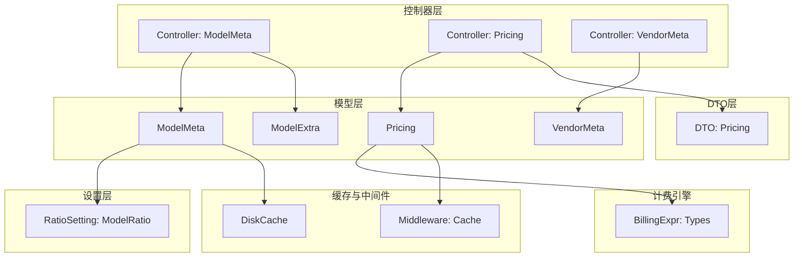
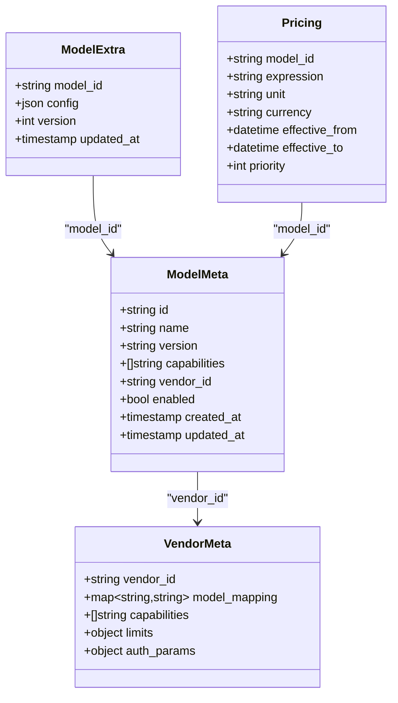
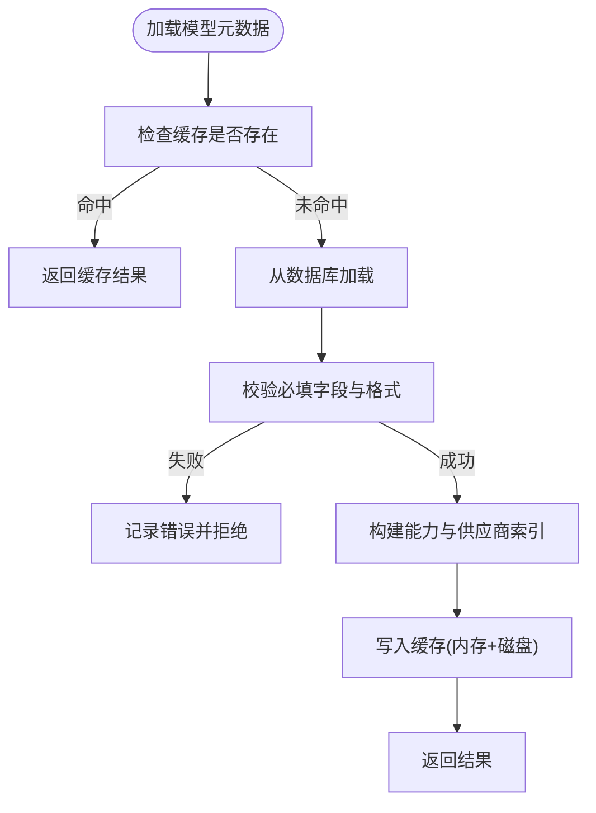
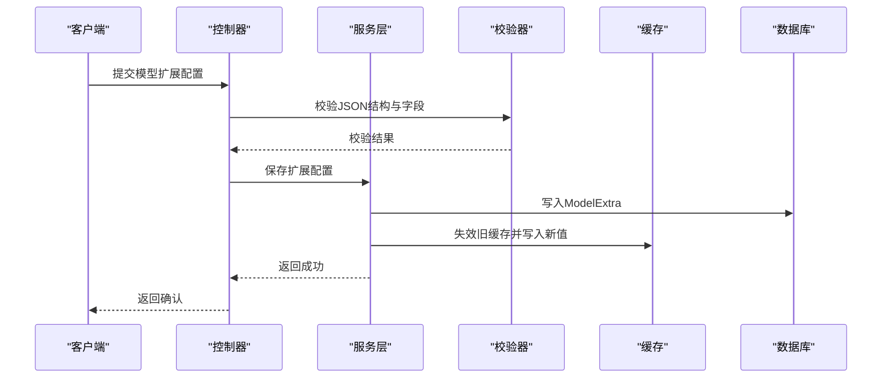
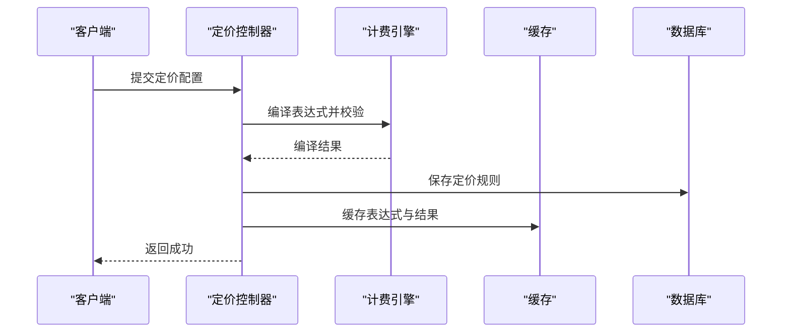
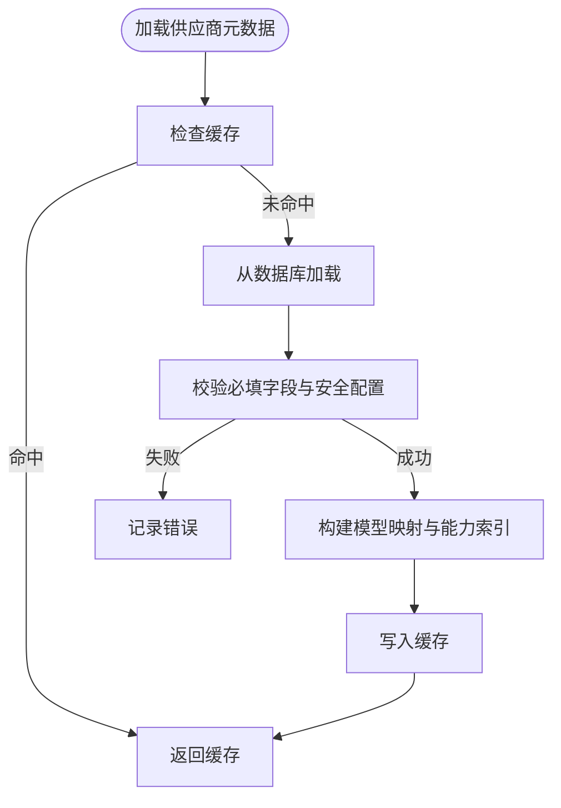
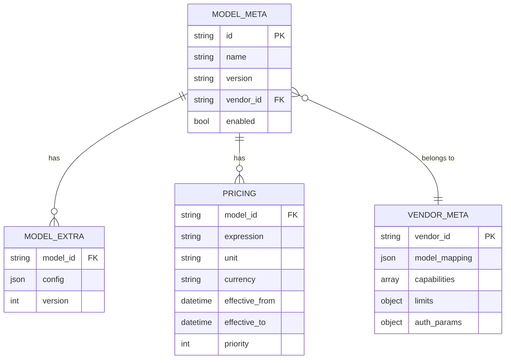
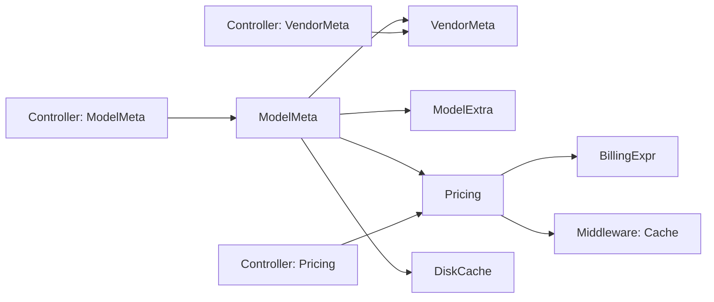

# 模型相关实体

<cite>
**本文引用的文件**   
- [model_meta.go](file://model/model_meta.go)
- [model_extra.go](file://model/model_extra.go)
- [pricing.go](file://model/pricing.go)
- [vendor_meta.go](file://model/vendor_meta.go)
- [controller/model_meta.go](file://controller/model_meta.go)
- [controller/pricing.go](file://controller/pricing.go)
- [controller/vendor_meta.go](file://controller/vendor_meta.go)
- [dto/pricing.go](file://dto/pricing.go)
- [setting/ratio_setting/model_ratio.go](file://setting/ratio_setting/model_ratio.go)
- [pkg/billingexpr/types.go](file://pkg/billingexpr/types.go)
- [common/disk_cache.go](file://common/disk_cache.go)
- [middleware/cache.go](file://middleware/cache.go)
</cite>

## 目录
1. [简介](#简介)
2. [项目结构](#项目结构)
3. [核心组件](#核心组件)
4. [架构总览](#架构总览)
5. [详细组件分析](#详细组件分析)
6. [依赖关系分析](#依赖关系分析)
7. [性能考虑](#性能考虑)
8. [故障排查指南](#故障排查指南)
9. [结论](#结论)
10. [附录](#附录)

## 简介
本文件面向“模型相关实体”的数据模型与运行机制，聚焦以下四个核心实体：
- 模型元数据（ModelMeta）：描述模型的标识、能力、版本、供应商归属等静态信息。
- 模型扩展（ModelExtra）：承载模型能力的动态配置与运行时开关。
- 定价（Pricing）：定义计费策略、表达式与价格计算规则。
- 供应商元数据（VendorMeta）：聚合供应商侧的模型能力、兼容性与接入参数。

文档将说明这些实体的数据结构、关联关系、版本管理、能力发现与兼容性处理、配置验证、缓存策略与更新机制，并提供关系图与配置示例路径，帮助读者快速理解并正确使用。

## 项目结构
围绕模型相关实体的代码主要分布在以下模块：
- model 层：定义数据库模型与持久化结构（ModelMeta、ModelExtra、Pricing、VendorMeta）。
- controller 层：提供对外接口，负责校验、读写与同步逻辑。
- dto 层：传输对象，用于请求/响应与配置导入导出。
- setting/ratio_setting：模型倍率与分组比例配置，影响计费与展示。
- pkg/billingexpr：计费表达式编译与执行，支撑灵活定价。
- common/middleware：缓存中间件与磁盘缓存，提升查询与同步性能。

图表来源
- [model/model_meta.go](file://model/model_meta.go)
- [model/model_extra.go](file://model/model_extra.go)
- [model/pricing.go](file://model/pricing.go)
- [model/vendor_meta.go](file://model/vendor_meta.go)
- [controller/model_meta.go](file://controller/model_meta.go)
- [controller/pricing.go](file://controller/pricing.go)
- [controller/vendor_meta.go](file://controller/vendor_meta.go)
- [dto/pricing.go](file://dto/pricing.go)
- [setting/ratio_setting/model_ratio.go](file://setting/ratio_setting/model_ratio.go)
- [pkg/billingexpr/types.go](file://pkg/billingexpr/types.go)
- [common/disk_cache.go](file://common/disk_cache.go)
- [middleware/cache.go](file://middleware/cache.go)

章节来源
- [model/model_meta.go](file://model/model_meta.go)
- [model/model_extra.go](file://model/model_extra.go)
- [model/pricing.go](file://model/pricing.go)
- [model/vendor_meta.go](file://model/vendor_meta.go)
- [controller/model_meta.go](file://controller/model_meta.go)
- [controller/pricing.go](file://controller/pricing.go)
- [controller/vendor_meta.go](file://controller/vendor_meta.go)
- [dto/pricing.go](file://dto/pricing.go)
- [setting/ratio_setting/model_ratio.go](file://setting/ratio_setting/model_ratio.go)
- [pkg/billingexpr/types.go](file://pkg/billingexpr/types.go)
- [common/disk_cache.go](file://common/disk_cache.go)
- [middleware/cache.go](file://middleware/cache.go)

## 核心组件
本节概述四大实体的职责与关键属性，以及它们之间的关联关系。

- 模型元数据（ModelMeta）
  - 作用：集中存储模型的基础信息与能力标签，如模型名称、版本、能力集合、供应商ID、是否启用等。
  - 关键字段：模型标识、显示名、版本、能力列表、供应商ID、状态、时间戳。
  - 行为：支持按能力筛选、按供应商过滤、按版本排序；在能力发现流程中作为权威源。

- 模型扩展（ModelExtra）
  - 作用：承载模型运行时的动态配置，如参数上限、功能开关、协议适配选项、自定义字段等。
  - 关键字段：模型ID、扩展JSON、版本号、更新时间。
  - 行为：与ModelMeta一一对应或一对多（视实现），通过校验器确保扩展字段合法。

- 定价（Pricing）
  - 作用：定义计费规则，包括单位、计价公式、阶梯价、折扣、币种、生效时间等。
  - 关键字段：模型ID、计价表达式、单位、币种、生效区间、优先级。
  - 行为：表达式由计费引擎编译与执行，支持条件分支与变量替换。

- 供应商元数据（VendorMeta）
  - 作用：描述供应商侧的模型能力、兼容性与接入参数，如支持的协议、限流策略、鉴权方式。
  - 关键字段：供应商ID、模型映射、能力清单、限制与配额、认证参数。
  - 行为：与ModelMeta通过供应商ID关联，驱动路由与适配器选择。

章节来源
- [model/model_meta.go](file://model/model_meta.go)
- [model/model_extra.go](file://model/model_extra.go)
- [model/pricing.go](file://model/pricing.go)
- [model/vendor_meta.go](file://model/vendor_meta.go)

## 架构总览
下图展示了模型元数据、扩展、定价与供应商元数据的整体关系，以及控制器、DTO、计费引擎与缓存的交互。

图表来源
- [model/model_meta.go](file://model/model_meta.go)
- [model/model_extra.go](file://model/model_extra.go)
- [model/pricing.go](file://model/pricing.go)
- [model/vendor_meta.go](file://model/vendor_meta.go)

## 详细组件分析

### 模型元数据（ModelMeta）
- 数据结构要点
  - 唯一标识：模型ID与显示名组合保证全局唯一性。
  - 版本管理：version字段用于区分不同发布，支持按版本查询与回滚。
  - 能力集合：capabilities数组描述模型支持的功能（文本、图像、音频、视频、工具调用等）。
  - 供应商关联：vendor_id指向供应商元数据，便于统一管理与路由。
  - 状态控制：enabled字段控制模型是否可用。

- 能力发现与兼容性
  - 能力发现：系统启动或定时任务拉取供应商能力清单，合并到ModelMeta。
  - 兼容性处理：根据capabilities与协议版本判断请求是否可被该模型处理。

- 配置验证
  - 必填字段校验：id、name、vendor_id、capabilities非空。
  - 格式校验：version遵循语义化版本规范。

- 缓存与更新
  - 缓存策略：ModelMeta读多写少，使用内存+磁盘双层缓存，键包含模型ID与版本。
  - 更新机制：增量更新与全量刷新并存，变更时失效旧缓存并重建索引。

图表来源
- [model/model_meta.go](file://model/model_meta.go)
- [common/disk_cache.go](file://common/disk_cache.go)

章节来源
- [model/model_meta.go](file://model/model_meta.go)
- [common/disk_cache.go](file://common/disk_cache.go)

### 模型扩展（ModelExtra）
- 数据结构要点
  - 绑定关系：model_id与ModelMeta对应，确保扩展仅作用于指定模型。
  - 动态配置：config为JSON结构，支持任意扩展字段，但需通过校验器约束。
  - 版本控制：version字段用于追踪配置变更历史。

- 动态配置与能力发现
  - 运行时开关：如开启/关闭特定功能、调整参数上限、切换协议模式。
  - 能力增强：通过扩展字段补充ModelMeta未覆盖的能力细节。

- 配置验证
  - JSON Schema校验：对config中的关键字段进行类型与范围检查。
  - 冲突检测：避免与ModelMeta或VendorMeta中的配置冲突。

- 缓存与更新
  - 缓存策略：按model_id+version作为键，短TTL与懒加载结合。
  - 更新机制：支持热更新，变更后立即失效旧缓存并触发重新加载。

图表来源
- [model/model_extra.go](file://model/model_extra.go)
- [controller/model_meta.go](file://controller/model_meta.go)

章节来源
- [model/model_extra.go](file://model/model_extra.go)
- [controller/model_meta.go](file://controller/model_meta.go)

### 定价（Pricing）
- 数据结构要点
  - 模型绑定：model_id关联具体模型，支持多版本定价。
  - 表达式：expression为计费公式，支持变量、函数与条件分支。
  - 单位与币种：unit与currency定义计费基准与货币类型。
  - 生效区间：effective_from与effective_to控制定价有效期。
  - 优先级：priority决定多规则冲突时的选择顺序。

- 计费引擎集成
  - 表达式编译：在启动或更新时预编译表达式，提升运行时性能。
  - 执行上下文：注入用量、折扣、租户信息等变量，计算最终费用。

- 配置验证
  - 语法校验：expression必须符合计费表达式语法。
  - 范围校验：unit、currency取值需在允许范围内。

- 缓存与更新
  - 缓存策略：按model_id+version缓存编译后的表达式与计算结果。
  - 更新机制：表达式变更触发重新编译与缓存刷新。

图表来源
- [model/pricing.go](file://model/pricing.go)
- [dto/pricing.go](file://dto/pricing.go)
- [pkg/billingexpr/types.go](file://pkg/billingexpr/types.go)
- [controller/pricing.go](file://controller/pricing.go)

章节来源
- [model/pricing.go](file://model/pricing.go)
- [dto/pricing.go](file://dto/pricing.go)
- [pkg/billingexpr/types.go](file://pkg/billingexpr/types.go)
- [controller/pricing.go](file://controller/pricing.go)

### 供应商元数据（VendorMeta）
- 数据结构要点
  - 供应商标识：vendor_id唯一标识供应商。
  - 模型映射：model_mapping将内部模型ID映射到供应商模型名。
  - 能力清单：capabilities描述供应商支持的功能集。
  - 限制与配额：limits定义速率限制、并发限制等。
  - 认证参数：auth_params包含鉴权所需配置（如API Key、OAuth）。

- 集成方式
  - 路由选择：根据VendorMeta选择对应的适配器与协议。
  - 能力协商：与ModelMeta的capabilities对齐，确保请求匹配。

- 配置验证
  - 必填字段：vendor_id、model_mapping、capabilities非空。
  - 安全校验：auth_params敏感字段加密存储。

- 缓存与更新
  - 缓存策略：按vendor_id缓存，长TTL配合失效通知。
  - 更新机制：支持热更新，变更后刷新所有相关模型的路由表。

图表来源
- [model/vendor_meta.go](file://model/vendor_meta.go)
- [controller/vendor_meta.go](file://controller/vendor_meta.go)

章节来源
- [model/vendor_meta.go](file://model/vendor_meta.go)
- [controller/vendor_meta.go](file://controller/vendor_meta.go)

### 模型与定价策略的关联关系
- 一对一或多对一：一个模型可对应多个定价规则，通过优先级与生效区间选择最优规则。
- 版本隔离：不同版本的模型可拥有独立的定价策略，避免历史版本污染。
- 动态切换：支持灰度发布与A/B测试，通过优先级与时间窗口控制。

图表来源
- [model/model_meta.go](file://model/model_meta.go)
- [model/model_extra.go](file://model/model_extra.go)
- [model/pricing.go](file://model/pricing.go)
- [model/vendor_meta.go](file://model/vendor_meta.go)

章节来源
- [model/model_meta.go](file://model/model_meta.go)
- [model/model_extra.go](file://model/model_extra.go)
- [model/pricing.go](file://model/pricing.go)
- [model/vendor_meta.go](file://model/vendor_meta.go)

## 依赖关系分析
- 组件耦合
  - ModelMeta依赖VendorMeta进行供应商能力解析。
  - ModelExtra依赖ModelMeta进行绑定与校验。
  - Pricing依赖计费引擎进行表达式编译与执行。
  - Controller层协调各实体，提供统一的CRUD与同步接口。

- 外部依赖
  - 计费表达式引擎：负责表达式解析、编译与执行。
  - 缓存系统：内存与磁盘缓存，提升读取性能。
  - 数据库：持久化模型与配置数据。

图表来源
- [model/model_meta.go](file://model/model_meta.go)
- [model/model_extra.go](file://model/model_extra.go)
- [model/pricing.go](file://model/pricing.go)
- [model/vendor_meta.go](file://model/vendor_meta.go)
- [controller/model_meta.go](file://controller/model_meta.go)
- [controller/pricing.go](file://controller/pricing.go)
- [controller/vendor_meta.go](file://controller/vendor_meta.go)
- [pkg/billingexpr/types.go](file://pkg/billingexpr/types.go)
- [common/disk_cache.go](file://common/disk_cache.go)
- [middleware/cache.go](file://middleware/cache.go)

章节来源
- [model/model_meta.go](file://model/model_meta.go)
- [model/model_extra.go](file://model/model_extra.go)
- [model/pricing.go](file://model/pricing.go)
- [model/vendor_meta.go](file://model/vendor_meta.go)
- [controller/model_meta.go](file://controller/model_meta.go)
- [controller/pricing.go](file://controller/pricing.go)
- [controller/vendor_meta.go](file://controller/vendor_meta.go)
- [pkg/billingexpr/types.go](file://pkg/billingexpr/types.go)
- [common/disk_cache.go](file://common/disk_cache.go)
- [middleware/cache.go](file://middleware/cache.go)

## 性能考虑
- 缓存策略
  - ModelMeta：读多写少，采用内存LRU+磁盘持久化，键包含模型ID与版本。
  - Pricing：表达式编译结果缓存，避免重复解析。
  - VendorMeta：长TTL缓存，变更时主动失效。

- 查询优化
  - 建立能力与供应商索引，加速按能力与供应商过滤。
  - 分页与投影：只返回必要字段，减少网络传输。

- 更新机制
  - 增量更新：仅变更部分字段，减少锁竞争。
  - 异步刷新：后台任务拉取供应商能力，避免阻塞主流程。

[本节为通用性能建议，不直接分析具体文件]

## 故障排查指南
- 常见问题
  - 模型不可用：检查ModelMeta.enabled字段与VendorMeta状态。
  - 定价异常：验证Pricing.expression语法与生效区间。
  - 能力缺失：核对ModelMeta.capabilities与VendorMeta.capabilities一致性。

- 调试步骤
  - 查看日志：定位缓存失效与表达式编译错误。
  - 检查缓存：确认缓存键与TTL设置是否正确。
  - 验证配置：使用DTO进行配置导入导出，对比差异。

章节来源
- [controller/model_meta.go](file://controller/model_meta.go)
- [controller/pricing.go](file://controller/pricing.go)
- [controller/vendor_meta.go](file://controller/vendor_meta.go)

## 结论
ModelMeta、ModelExtra、Pricing与VendorMeta构成了模型管理的核心数据模型。通过清晰的关联关系、严格的配置验证、高效的缓存策略与灵活的计费引擎，系统实现了模型能力的动态配置、版本管理与兼容性处理。建议在生产环境中严格遵循配置规范，并结合监控与日志进行持续优化。

[本节为总结性内容，不直接分析具体文件]

## 附录
- 配置示例路径
  - 模型元数据配置：参考[model/meta示例](file://model/model_meta.go)
  - 模型扩展配置：参考[model/extra示例](file://model/model_extra.go)
  - 定价策略配置：参考[dto/pricing示例](file://dto/pricing.go)
  - 供应商元数据配置：参考[model/vendor示例](file://model/vendor_meta.go)

- 相关设置
  - 模型倍率与分组：参考[setting/ratio_setting/model_ratio.go](file://setting/ratio_setting/model_ratio.go)
  - 计费表达式类型：参考[pkg/billingexpr/types.go](file://pkg/billingexpr/types.go)

[本节为参考信息，不直接分析具体文件]