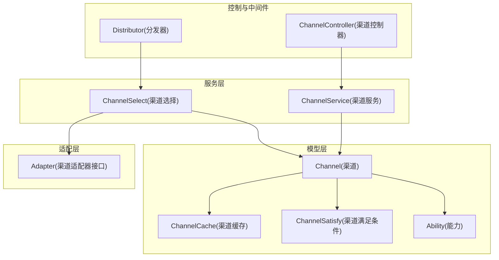
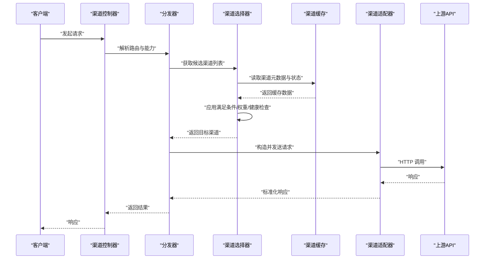
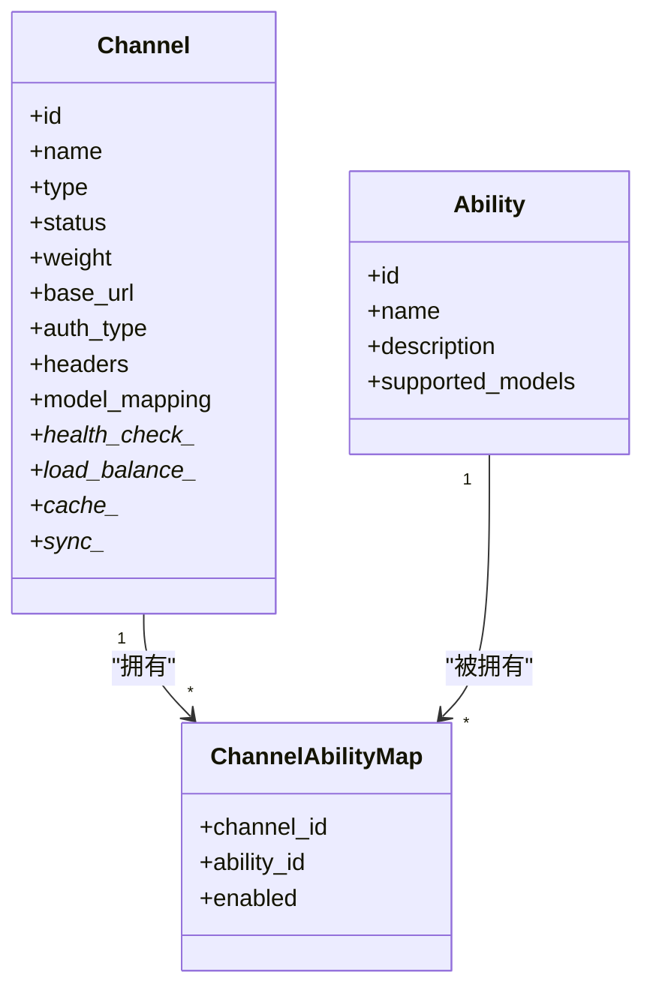
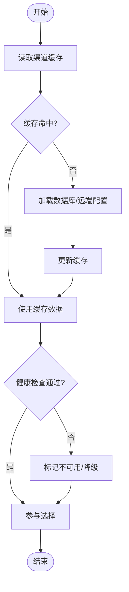
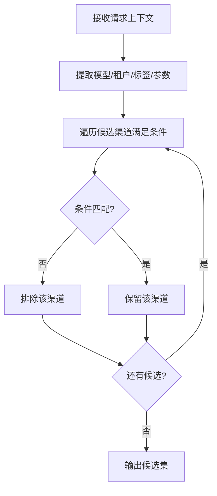
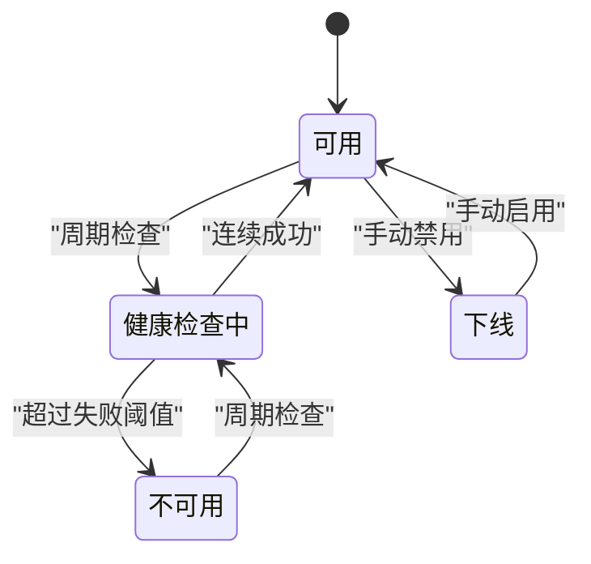
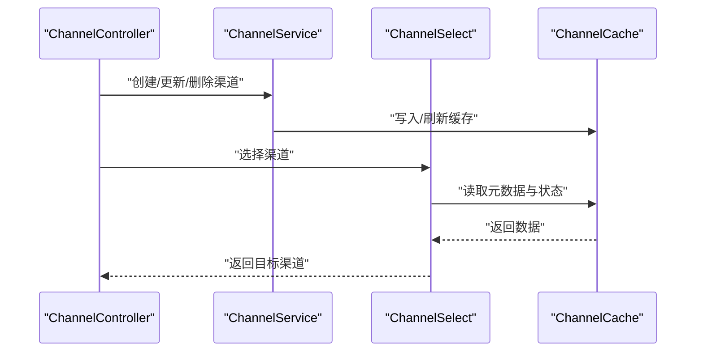
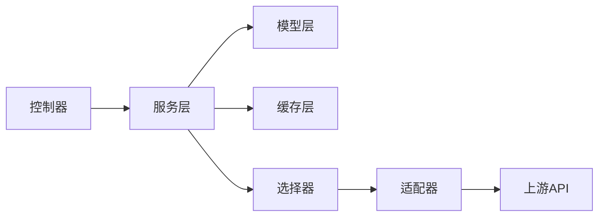

# 渠道实体 (Channel)

<cite>
**本文引用的文件**   
- [model/channel.go](file://model/channel.go)
- [model/channel_cache.go](file://model/channel_cache.go)
- [model/channel_satisfy.go](file://model/channel_satisfy.go)
- [model/ability.go](file://model/ability.go)
- [constant/channel.go](file://constant/channel.go)
- [dto/channel_settings.go](file://dto/channel_settings.go)
- [service/channel.go](file://service/channel.go)
- [service/channel_select.go](file://service/channel_select.go)
- [controller/channel.go](file://controller/channel.go)
- [middleware/distributor.go](file://middleware/distributor.go)
- [relay/channel/adapter.go](file://relay/channel/adapter.go)
</cite>

## 目录
1. [简介](#简介)
2. [项目结构](#项目结构)
3. [核心组件](#核心组件)
4. [架构总览](#架构总览)
5. [详细组件分析](#详细组件分析)
6. [依赖关系分析](#依赖关系分析)
7. [性能考虑](#性能考虑)
8. [故障排查指南](#故障排查指南)
9. [结论](#结论)
10. [附录：配置示例与校验规则](#附录配置示例与校验规则)

## 简介
本文件围绕“渠道(Channel)”实体，系统化梳理其数据模型、能力关联、缓存机制、满足条件、状态管理、健康检查、故障转移与数据同步等关键主题。文档旨在帮助开发者快速理解渠道在系统中的角色与实现方式，并为配置、运维与优化提供可操作的指导。

## 项目结构
与渠道实体相关的数据模型与逻辑主要分布在以下模块：
- 数据模型层：channel、channel_cache、channel_satisfy、ability
- 常量与类型：channel 常量定义、DTO 设置项
- 服务层：渠道选择、负载均衡、健康检查、缓存与同步
- 控制器与中间件：API 入口、分发器
- 适配层：各上游渠道的适配器实现

图表来源
- [model/channel.go](file://model/channel.go)
- [model/channel_cache.go](file://model/channel_cache.go)
- [model/channel_satisfy.go](file://model/channel_satisfy.go)
- [model/ability.go](file://model/ability.go)
- [service/channel_select.go](file://service/channel_select.go)
- [service/channel.go](file://service/channel.go)
- [controller/channel.go](file://controller/channel.go)
- [middleware/distributor.go](file://middleware/distributor.go)
- [relay/channel/adapter.go](file://relay/channel/adapter.go)

章节来源
- [model/channel.go](file://model/channel.go)
- [model/channel_cache.go](file://model/channel_cache.go)
- [model/channel_satisfy.go](file://model/channel_satisfy.go)
- [model/ability.go](file://model/ability.go)
- [constant/channel.go](file://constant/channel.go)
- [dto/channel_settings.go](file://dto/channel_settings.go)
- [service/channel.go](file://service/channel.go)
- [service/channel_select.go](file://service/channel_select.go)
- [controller/channel.go](file://controller/channel.go)
- [middleware/distributor.go](file://middleware/distributor.go)
- [relay/channel/adapter.go](file://relay/channel/adapter.go)

## 核心组件
- Channel（渠道）：描述一个上游 API 接入点，包含类型、基础 URL、认证信息、请求头、超时、重试、代理、限流、权重、分组、标签、启用状态、健康检查策略等。
- ChannelCache（渠道缓存）：对渠道元数据与运行时状态进行缓存，加速选择与健康检查。
- ChannelSatisfy（渠道满足条件）：用于表达某请求是否可由某渠道处理的条件表达式或规则集合。
- Ability（能力）：抽象不同上游支持的能力维度（如文本生成、图像生成、Embedding、Rerank、Realtime 等），与 Channel 建立多对多关系。

章节来源
- [model/channel.go](file://model/channel.go)
- [model/channel_cache.go](file://model/channel_cache.go)
- [model/channel_satisfy.go](file://model/channel_satisfy.go)
- [model/ability.go](file://model/ability.go)

## 架构总览
渠道在系统内的典型调用链如下：请求进入后，由分发器根据路由与能力匹配到候选渠道集合，再通过选择器结合权重、健康状态、负载与满足条件挑选具体渠道，最终通过适配器转发到上游。

图表来源
- [controller/channel.go](file://controller/channel.go)
- [middleware/distributor.go](file://middleware/distributor.go)
- [service/channel_select.go](file://service/channel_select.go)
- [model/channel_cache.go](file://model/channel_cache.go)
- [relay/channel/adapter.go](file://relay/channel/adapter.go)

## 详细组件分析

### 渠道实体 (Channel) 数据模型
- 标识与基础信息
  - id、name、type、group、tags、status、weight、sort、disabled、last_used_at、created_at、updated_at
- 连接与网络
  - base_url、timeout、retries、proxy、ssrf_protection、request_body_limit、rate_limit、concurrency
- 认证与安全
  - auth_type、api_key、secret_key、bearer_token、client_id、client_secret、oauth_config、headers、custom_headers
- 行为与策略
  - model_mapping、model_group_mapping、model_alias、model_whitelist、model_blacklist、model_ratio、model_price、model_pricing_mode
- 健康与监控
  - health_check_interval、health_check_timeout、health_check_path、health_check_headers、health_check_expect_status、health_check_fail_threshold、health_check_success_threshold
- 负载均衡与选择
  - load_balance_strategy、load_balance_weight、affinity_key、affinity_ttl、sticky_session、failover_enabled、failover_delay、failover_max_retries
- 缓存与同步
  - cache_enabled、cache_ttl、sync_enabled、sync_interval、sync_timeout、sync_retry_count、sync_on_startup
- 其他扩展
  - extra、remark、version、owner_id、tenant_id、labels、metadata

说明要点
- type 决定认证方式、请求格式与适配器选择；auth_type 细化认证细节（如 Bearer、Basic、OAuth2、自定义 Header）。
- 模型映射与定价字段支持按模型粒度覆盖默认策略。
- 健康检查字段支持路径、期望状态码、阈值与间隔，便于自动剔除异常节点。
- 负载均衡策略支持轮询、加权、最少连接、一致性哈希等（由选择器实现）。
- 缓存开关与 TTL 控制元数据与状态的本地/分布式缓存行为。
- 同步开关与间隔用于从远端配置源拉取或推送变更，保证集群一致性。

章节来源
- [model/channel.go](file://model/channel.go)
- [constant/channel.go](file://constant/channel.go)
- [dto/channel_settings.go](file://dto/channel_settings.go)

### 渠道能力 (Ability) 关联关系
- 能力维度
  - text_generation、image_generation、embedding、rerank、realtime、audio、video、task、tool_use、function_call 等
- 关系建模
  - Channel 与 Ability 为多对多关系，通过中间表或 JSON 字段维护
  - 每个 Channel 声明其支持的能力集合；请求路由时依据能力筛选候选
- 能力校验
  - 在请求进入阶段，校验所选 Channel 是否具备所需能力，否则回退或报错

图表来源
- [model/channel.go](file://model/channel.go)
- [model/ability.go](file://model/ability.go)

章节来源
- [model/ability.go](file://model/ability.go)
- [model/channel.go](file://model/channel.go)

### 渠道缓存机制 (ChannelCache)
- 缓存内容
  - 渠道元数据（类型、URL、认证、模型映射、能力集合）
  - 运行时状态（健康状态、最近使用、负载计数、失败次数）
- 缓存策略
  - 本地内存缓存 + 可选分布式缓存（Redis）
  - TTL 过期、失效更新、热点键保护
- 一致性
  - 配置变更后触发缓存刷新
  - 健康检查失败时快速剔除，恢复后重新加入

图表来源
- [model/channel_cache.go](file://model/channel_cache.go)
- [service/channel_select.go](file://service/channel_select.go)

章节来源
- [model/channel_cache.go](file://model/channel_cache.go)
- [service/channel_select.go](file://service/channel_select.go)

### 渠道满足条件 (ChannelSatisfy) 业务逻辑
- 条件类型
  - 模型白名单/黑名单、模型别名映射、模型组过滤、标签匹配、租户/用户维度限制、时间窗口、地域/IP 段、请求头/参数匹配
- 评估流程
  - 将请求上下文与 Channel 的满足条件逐项比对，全部通过才纳入候选
- 优先级
  - 满足条件优先于负载均衡权重与健康状态

图表来源
- [model/channel_satisfy.go](file://model/channel_satisfy.go)

章节来源
- [model/channel_satisfy.go](file://model/channel_satisfy.go)

### 渠道状态管理、健康检查与故障转移
- 状态机
  - 可用、不可用、健康检查中、下线、维护中
- 健康检查
  - 周期性探测（HTTP GET/HEAD）、期望状态码、超时、失败阈值、成功阈值
- 故障转移
  - 自动切换至备用渠道、重试策略、延迟与最大重试次数
- 自愈与恢复
  - 连续成功探测后恢复可用，重新参与选择

图表来源
- [model/channel.go](file://model/channel.go)
- [service/channel_select.go](file://service/channel_select.go)

章节来源
- [model/channel.go](file://model/channel.go)
- [service/channel_select.go](file://service/channel_select.go)

### 数据同步机制
- 同步方向
  - 从远端配置中心拉取（Pull）或推送（Push）
- 同步内容
  - 渠道元数据、能力集合、模型映射、定价、健康策略
- 同步策略
  - 启动时同步、定时增量同步、变更事件驱动同步
- 冲突与回滚
  - 版本控制、幂等写入、失败重试与告警

章节来源
- [model/channel.go](file://model/channel.go)
- [service/channel.go](file://service/channel.go)

### 控制器与服务层交互
- 控制器负责鉴权、参数校验、调用服务层方法
- 服务层封装渠道选择、健康检查、缓存读写、同步任务

图表来源
- [controller/channel.go](file://controller/channel.go)
- [service/channel.go](file://service/channel.go)
- [service/channel_select.go](file://service/channel_select.go)
- [model/channel_cache.go](file://model/channel_cache.go)

章节来源
- [controller/channel.go](file://controller/channel.go)
- [service/channel.go](file://service/channel.go)
- [service/channel_select.go](file://service/channel_select.go)

### 适配器与上游对接
- 适配器统一封装不同上游的认证、请求构建、响应解析与错误映射
- 选择器基于 Channel.type 与 Ability 选择对应适配器

章节来源
- [relay/channel/adapter.go](file://relay/channel/adapter.go)
- [model/channel.go](file://model/channel.go)

## 依赖关系分析
- 低耦合高内聚
  - 模型层仅定义数据结构与约束
  - 服务层编排选择、健康检查、缓存与同步
  - 控制器专注接口与权限
  - 适配器隔离上游差异
- 外部依赖
  - 数据库、Redis（可选）、配置中心（可选）、日志与监控系统

图表来源
- [controller/channel.go](file://controller/channel.go)
- [service/channel.go](file://service/channel.go)
- [service/channel_select.go](file://service/channel_select.go)
- [model/channel.go](file://model/channel.go)
- [relay/channel/adapter.go](file://relay/channel/adapter.go)

章节来源
- [controller/channel.go](file://controller/channel.go)
- [service/channel.go](file://service/channel.go)
- [service/channel_select.go](file://service/channel_select.go)
- [model/channel.go](file://model/channel.go)
- [relay/channel/adapter.go](file://relay/channel/adapter.go)

## 性能考虑
- 缓存优先
  - 开启 ChannelCache，合理设置 TTL，避免频繁 DB 查询
- 健康检查调优
  - 调整间隔与阈值，减少误判与抖动
- 负载均衡
  - 根据权重与策略均衡流量，避免热点通道过载
- 并发与限流
  - 合理设置 concurrency 与 rate_limit，防止上游限流
- 连接复用与超时
  - 复用 HTTP 连接，设置合理的 timeout 与 retries
- 异步与批处理
  - 同步任务与日志落库采用异步队列，降低主链路延迟

[本节为通用建议，不直接分析具体文件]

## 故障排查指南
- 常见问题定位
  - 渠道不可用：检查健康检查配置、网络连通性、认证信息
  - 选择失败：核对满足条件、模型映射、能力集合
  - 缓存不一致：确认缓存刷新策略与版本号
  - 同步失败：查看同步任务日志与重试策略
- 诊断步骤
  - 查看渠道状态与健康检查日志
  - 验证满足条件与模型映射
  - 检查缓存命中率与失效事件
  - 追踪适配器请求与上游响应

章节来源
- [model/channel.go](file://model/channel.go)
- [model/channel_cache.go](file://model/channel_cache.go)
- [model/channel_satisfy.go](file://model/channel_satisfy.go)
- [service/channel_select.go](file://service/channel_select.go)

## 结论
Channel 实体作为系统接入上游的核心抽象，通过清晰的字段设计、能力关联、缓存与满足条件机制，实现了灵活、可靠与高性能的渠道管理与调度。配合健康检查、故障转移与数据同步，可在复杂环境中保障服务的稳定性与可扩展性。

[本节为总结性内容，不直接分析具体文件]

## 附录：配置示例与校验规则

### 渠道配置示例（JSON）
以下为常见字段的示例结构，便于理解与落地配置：
- 基础信息：id、name、type、group、tags、status、weight
- 连接与网络：base_url、timeout、retries、proxy、request_body_limit、rate_limit、concurrency
- 认证与安全：auth_type、api_key、secret_key、bearer_token、headers、custom_headers
- 模型与定价：model_mapping、model_group_mapping、model_alias、model_whitelist、model_blacklist、model_ratio、model_price、model_pricing_mode
- 健康检查：health_check_interval、health_check_timeout、health_check_path、health_check_headers、health_check_expect_status、health_check_fail_threshold、health_check_success_threshold
- 负载均衡：load_balance_strategy、load_balance_weight、affinity_key、affinity_ttl、sticky_session、failover_enabled、failover_delay、failover_max_retries
- 缓存与同步：cache_enabled、cache_ttl、sync_enabled、sync_interval、sync_timeout、sync_retry_count、sync_on_startup
- 扩展字段：extra、remark、version、owner_id、tenant_id、labels、metadata

注意：以上字段仅为示例，实际以模型定义为准。

章节来源
- [model/channel.go](file://model/channel.go)
- [dto/channel_settings.go](file://dto/channel_settings.go)

### 校验规则与安全约束
- 必填与格式
  - base_url 必须为合法 URL；auth_type 与认证字段需匹配；timeout/retries 为正数
- 安全约束
  - 禁止明文存储敏感信息（建议使用加密或密钥管理服务）
  - 限制 request_body_limit 与 rate_limit，防止滥用
  - 启用 ssrf_protection，限制内网访问
- 业务约束
  - model_mapping/model_alias 不得冲突；whitelist/blacklist 互斥
  - 满足条件不得导致所有渠道均不可用
- 健康与可用性
  - 健康检查失败阈值与成功阈值需合理配置，避免频繁抖动

章节来源
- [model/channel.go](file://model/channel.go)
- [dto/channel_settings.go](file://dto/channel_settings.go)
- [constant/channel.go](file://constant/channel.go)