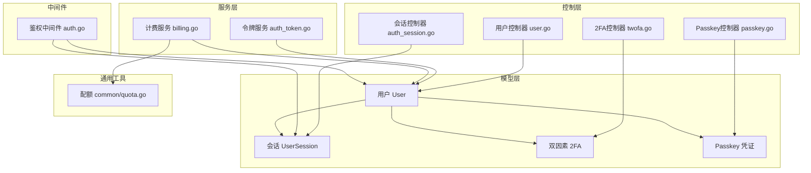
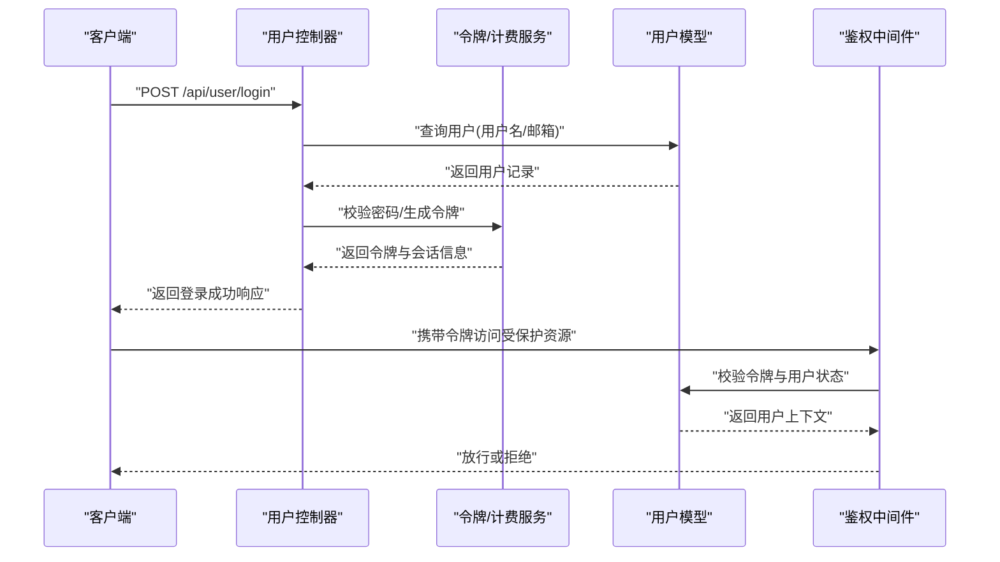
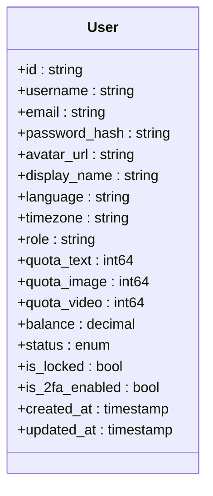
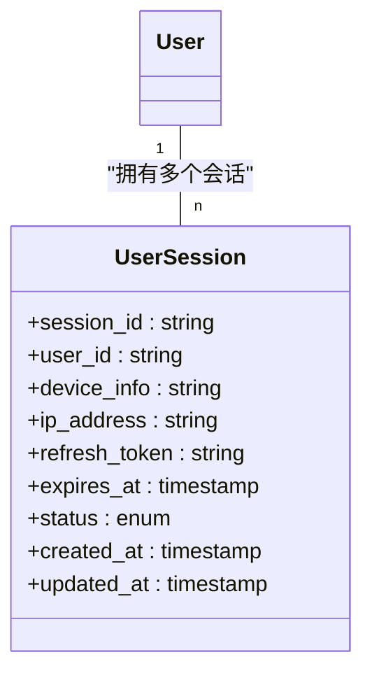
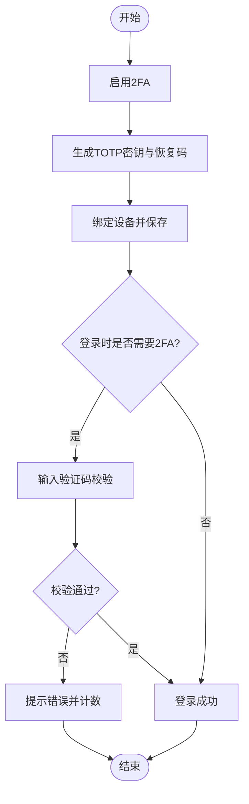
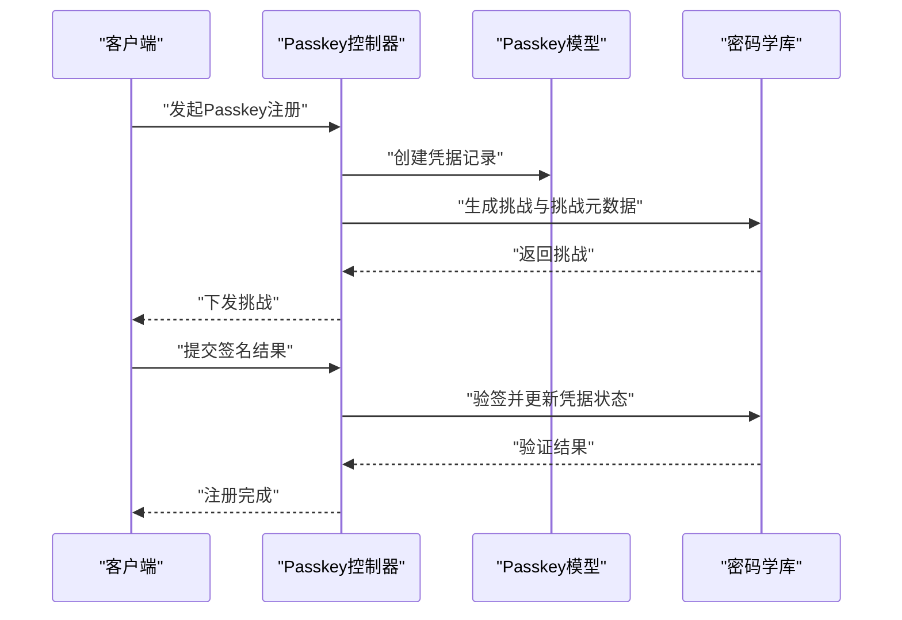
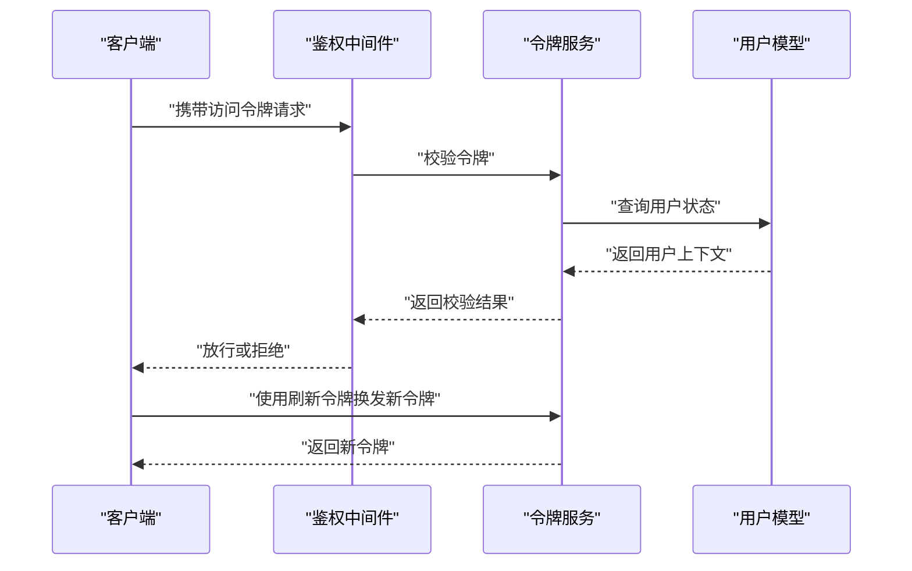
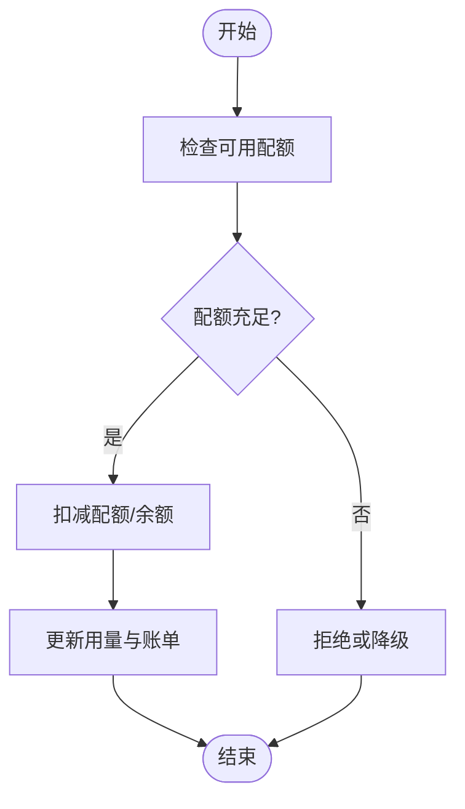
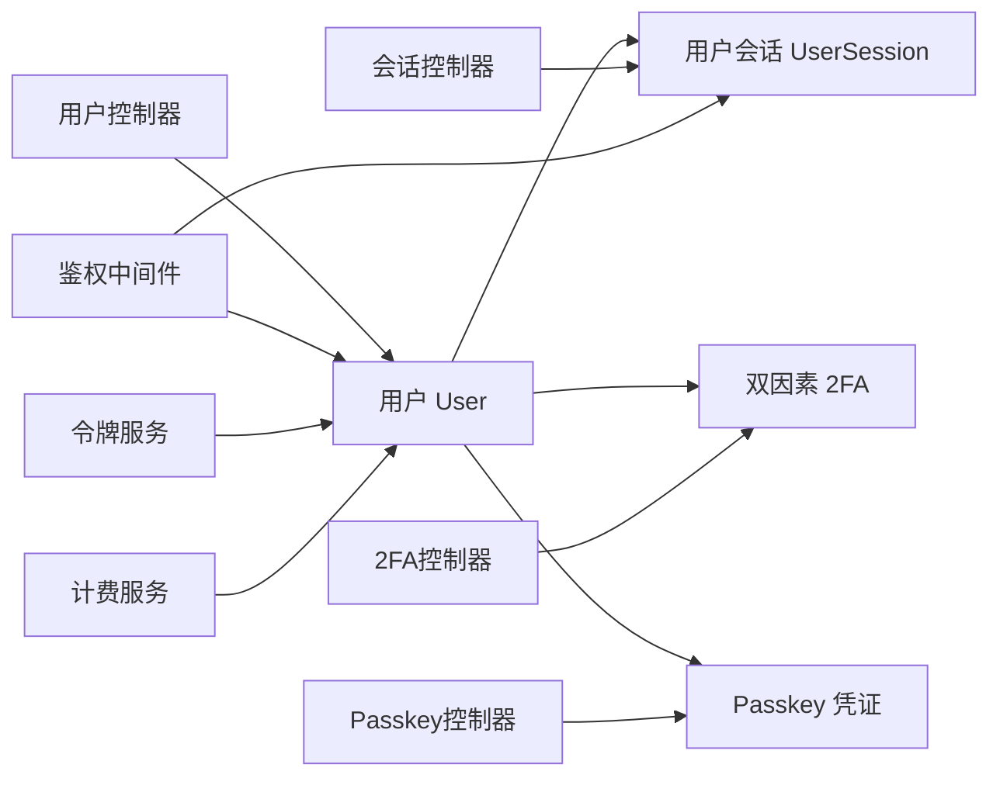
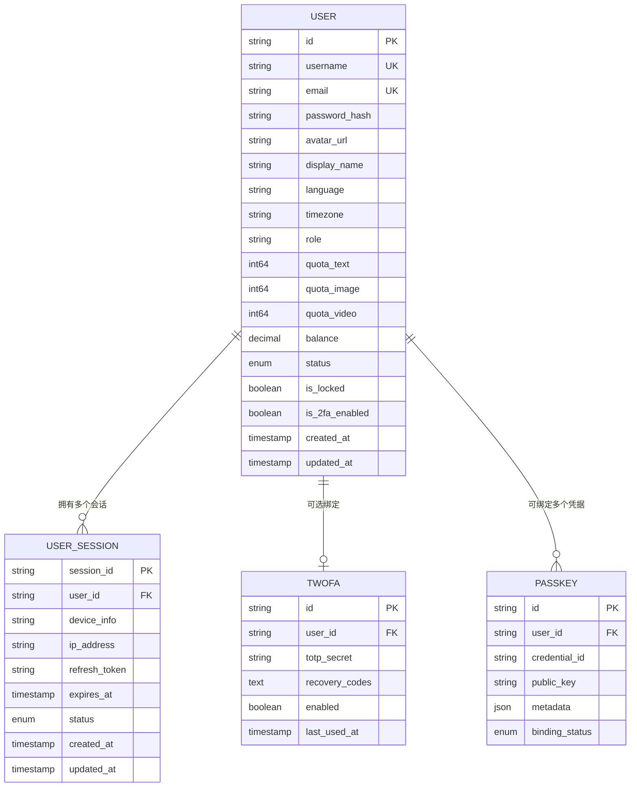

# 用户实体 (User)

<cite>
**本文引用的文件**   
- [model/user.go](file://model/user.go)
- [model/user_session.go](file://model/user_session.go)
- [model/twofa.go](file://model/twofa.go)
- [model/passkey.go](file://model/passkey.go)
- [controller/user.go](file://controller/user.go)
- [controller/auth_session.go](file://controller/auth_session.go)
- [controller/twofa.go](file://controller/twofa.go)
- [controller/passkey.go](file://controller/passkey.go)
- [common/quota.go](file://common/quota.go)
- [service/billing.go](file://service/billing.go)
- [service/auth_token.go](file://service/auth_token.go)
- [middleware/auth.go](file://middleware/auth.go)
- [bin/migration_v0.2-v0.3.sql](file://bin/migration_v0.2-v0.3.sql)
- [bin/migration_v0.3-v0.4.sql](file://bin/migration_v0.3-v0.4.sql)
</cite>

## 目录
1. [简介](#简介)
2. [项目结构](#项目结构)
3. [核心组件](#核心组件)
4. [架构总览](#架构总览)
5. [详细组件分析](#详细组件分析)
6. [依赖关系分析](#依赖关系分析)
7. [性能考量](#性能考量)
8. [故障排查指南](#故障排查指南)
9. [结论](#结论)
10. [附录](#附录)

## 简介
本文件为用户(User)实体的数据模型文档，覆盖字段定义、验证规则与业务约束、状态管理、会话管理、双因素认证(2FA)、Passkey认证关联关系，以及生命周期管理、数据迁移与版本兼容性说明。同时提供ER图与示例数据，帮助开发者快速理解并正确使用用户相关能力。

## 项目结构
围绕用户实体的关键代码分布在以下模块：
- 数据模型层(model): 用户主表、会话、2FA、Passkey等实体定义与数据库映射
- 控制器层(controller): 用户注册/登录、2FA、Passkey、会话管理等API实现
- 服务层(service): 令牌签发、计费、配额计算等业务逻辑
- 中间件(middleware): 鉴权、会话校验
- 通用工具(common): 配额、哈希、TOTP等基础能力
- 迁移脚本(bin): 历史版本到当前版本的数据库变更

图表来源
- [model/user.go](file://model/user.go)
- [model/user_session.go](file://model/user_session.go)
- [model/twofa.go](file://model/twofa.go)
- [model/passkey.go](file://model/passkey.go)
- [controller/user.go](file://controller/user.go)
- [controller/auth_session.go](file://controller/auth_session.go)
- [controller/twofa.go](file://controller/twofa.go)
- [controller/passkey.go](file://controller/passkey.go)
- [service/auth_token.go](file://service/auth_token.go)
- [service/billing.go](file://service/billing.go)
- [middleware/auth.go](file://middleware/auth.go)
- [common/quota.go](file://common/quota.go)

章节来源
- [model/user.go](file://model/user.go)
- [model/user_session.go](file://model/user_session.go)
- [model/twofa.go](file://model/twofa.go)
- [model/passkey.go](file://model/passkey.go)
- [controller/user.go](file://controller/user.go)
- [controller/auth_session.go](file://controller/auth_session.go)
- [controller/twofa.go](file://controller/twofa.go)
- [controller/passkey.go](file://controller/passkey.go)
- [service/auth_token.go](file://service/auth_token.go)
- [service/billing.go](file://service/billing.go)
- [middleware/auth.go](file://middleware/auth.go)
- [common/quota.go](file://common/quota.go)

## 核心组件
- 用户(User)
  - 基本字段: ID、用户名、邮箱、密码哈希、头像、昵称、语言偏好、时区、创建/更新时间戳等
  - 扩展字段: 角色权限、配额(文本/图像/视频等)、余额、订阅状态、通知开关、安全设置(是否启用2FA、锁定状态)等
  - 状态管理: 激活/禁用/锁定/注销等状态流转
  - 验证规则: 用户名唯一性、邮箱格式与唯一性、密码强度、必填字段校验
  - 业务约束: 配额上限、余额非负、角色权限边界
- 用户会话(UserSession)
  - 字段: 会话ID、用户ID、设备信息、IP、过期时间、刷新令牌、状态等
  - 生命周期: 创建、刷新、续期、失效、清理
- 双因素认证(Two-Factor Authentication, 2FA)
  - 字段: 用户ID、密钥、恢复码、启用状态、最近使用时间等
  - 流程: 开启/关闭、验证码校验、恢复码使用
- Passkey认证
  - 字段: 用户ID、凭据ID、公钥、传输元数据、绑定状态等
  - 流程: 注册、挑战-响应、登录校验

章节来源
- [model/user.go](file://model/user.go)
- [model/user_session.go](file://model/user_session.go)
- [model/twofa.go](file://model/twofa.go)
- [model/passkey.go](file://model/passkey.go)

## 架构总览
用户相关能力由“控制器-服务-模型”三层协作完成：
- 控制器负责请求解析、参数校验、调用服务
- 服务层处理令牌签发、计费结算、配额检查、业务规则
- 模型层负责数据持久化、关联关系、索引与约束

图表来源
- [controller/user.go](file://controller/user.go)
- [service/auth_token.go](file://service/auth_token.go)
- [model/user.go](file://model/user.go)
- [middleware/auth.go](file://middleware/auth.go)

## 详细组件分析

### 用户(User)数据模型
- 字段分类
  - 标识与身份: ID、用户名、邮箱、头像、昵称
  - 安全: 密码哈希、2FA状态、锁定状态、最近登录时间
  - 配额与财务: 文本/图像/视频配额、余额、订阅状态
  - 系统: 角色权限、语言偏好、时区、创建/更新时间戳
- 验证规则
  - 必填: 用户名、邮箱、密码哈希(注册时)
  - 唯一性: 用户名、邮箱全局唯一
  - 格式: 邮箱格式、密码强度策略
  - 范围: 配额非负、余额非负、角色在允许集合内
- 业务约束
  - 账户状态为激活才可正常使用
  - 配额耗尽需限制相应能力
  - 余额不足影响付费功能
- 生命周期
  - 注册 -> 激活 -> 使用 -> 锁定/禁用 -> 注销
  - 支持软删除与审计日志

图表来源
- [model/user.go](file://model/user.go)

章节来源
- [model/user.go](file://model/user.go)

### 用户会话(UserSession)
- 字段分类
  - 标识: 会话ID、用户ID
  - 环境: 设备指纹、IP地址、User-Agent
  - 安全: 刷新令牌、过期时间、状态
- 生命周期
  - 登录创建 -> 刷新续期 -> 主动失效 -> 定时清理
- 与用户的关系
  - 一对一用户，多会话并发(可配置最大会话数)

图表来源
- [model/user_session.go](file://model/user_session.go)

章节来源
- [model/user_session.go](file://model/user_session.go)

### 双因素认证(2FA)
- 字段分类
  - 用户ID、TOTP密钥、恢复码列表、启用状态、最近使用时间
- 流程
  - 开启2FA -> 生成密钥与恢复码 -> 绑定设备 -> 登录时校验验证码
  - 恢复码用于紧急解锁
- 安全建议
  - 密钥加密存储、恢复码一次性使用、失败次数限制

图表来源
- [model/twofa.go](file://model/twofa.go)
- [controller/twofa.go](file://controller/twofa.go)

章节来源
- [model/twofa.go](file://model/twofa.go)
- [controller/twofa.go](file://controller/twofa.go)

### Passkey认证
- 字段分类
  - 用户ID、凭据ID、公钥、传输元数据、绑定状态
- 流程
  - 注册Passkey -> 生成挑战 -> 客户端签名 -> 服务端验证
  - 登录时挑战-响应替代密码
- 优势
  - 无密码登录、抗钓鱼、跨设备同步

图表来源
- [model/passkey.go](file://model/passkey.go)
- [controller/passkey.go](file://controller/passkey.go)

章节来源
- [model/passkey.go](file://model/passkey.go)
- [controller/passkey.go](file://controller/passkey.go)

### 会话管理与鉴权流程
- 会话创建
  - 登录成功后创建会话，签发访问令牌与刷新令牌
- 令牌校验
  - 中间件校验令牌有效性、用户状态、权限
- 刷新机制
  - 使用刷新令牌获取新访问令牌，避免频繁登录

图表来源
- [middleware/auth.go](file://middleware/auth.go)
- [service/auth_token.go](file://service/auth_token.go)
- [model/user.go](file://model/user.go)

章节来源
- [middleware/auth.go](file://middleware/auth.go)
- [service/auth_token.go](file://service/auth_token.go)

### 配额与计费关联
- 配额类型
  - 文本、图像、视频等独立配额
- 计费结算
  - 按用量扣减余额或配额，支持阶梯计价
- 阈值与限制
  - 配额耗尽触发降级或拒绝策略

图表来源
- [common/quota.go](file://common/quota.go)
- [service/billing.go](file://service/billing.go)

章节来源
- [common/quota.go](file://common/quota.go)
- [service/billing.go](file://service/billing.go)

## 依赖关系分析
- 用户(User)与用户会话(UserSession)为一对多关系
- 用户(User)与2FA为可选的一对一关系
- 用户(User)与Passkey为多对多关系(一个用户可绑定多个凭据)
- 控制器依赖服务层进行业务处理，服务层依赖模型层进行数据操作
- 鉴权中间件依赖令牌服务与用户模型进行校验

图表来源
- [model/user.go](file://model/user.go)
- [model/user_session.go](file://model/user_session.go)
- [model/twofa.go](file://model/twofa.go)
- [model/passkey.go](file://model/passkey.go)
- [controller/user.go](file://controller/user.go)
- [controller/auth_session.go](file://controller/auth_session.go)
- [controller/twofa.go](file://controller/twofa.go)
- [controller/passkey.go](file://controller/passkey.go)
- [middleware/auth.go](file://middleware/auth.go)
- [service/auth_token.go](file://service/auth_token.go)
- [service/billing.go](file://service/billing.go)

章节来源
- [model/user.go](file://model/user.go)
- [model/user_session.go](file://model/user_session.go)
- [model/twofa.go](file://model/twofa.go)
- [model/passkey.go](file://model/passkey.go)
- [controller/user.go](file://controller/user.go)
- [controller/auth_session.go](file://controller/auth_session.go)
- [controller/twofa.go](file://controller/twofa.go)
- [controller/passkey.go](file://controller/passkey.go)
- [middleware/auth.go](file://middleware/auth.go)
- [service/auth_token.go](file://service/auth_token.go)
- [service/billing.go](file://service/billing.go)

## 性能考量
- 索引优化
  - 用户名、邮箱建立唯一索引以加速查询
  - 会话过期时间建立索引便于清理任务
- 缓存策略
  - 用户信息、配额、权限可短期缓存减少数据库压力
- 批量操作
  - 批量更新配额与余额时使用事务保证一致性
- 连接池
  - 合理配置数据库连接池大小，避免高并发下阻塞

[本节为通用指导，不直接分析具体文件]

## 故障排查指南
- 登录失败
  - 检查用户名/邮箱是否存在、密码是否正确、账户是否被锁定
- 2FA校验失败
  - 确认时间同步、密钥正确、恢复码未过期且未被使用
- Passkey注册失败
  - 检查浏览器支持、凭据存储权限、挑战响应签名是否正确
- 配额不足
  - 查看配额剩余量、计费结算是否成功、是否有异常扣减
- 会话失效
  - 检查令牌有效期、刷新令牌是否有效、用户状态是否正常

章节来源
- [controller/user.go](file://controller/user.go)
- [controller/twofa.go](file://controller/twofa.go)
- [controller/passkey.go](file://controller/passkey.go)
- [service/auth_token.go](file://service/auth_token.go)
- [service/billing.go](file://service/billing.go)

## 结论
用户实体是整个系统的核心，其数据结构与业务流程贯穿认证、授权、计费与配额管理。通过清晰的模型定义、严格的验证规则与完善的生命周期管理，系统能够稳定支撑多场景的用户需求。结合会话管理、2FA与Passkey认证，进一步提升了安全性与用户体验。

[本节为总结性内容，不直接分析具体文件]

## 附录

### ER图

图表来源
- [model/user.go](file://model/user.go)
- [model/user_session.go](file://model/user_session.go)
- [model/twofa.go](file://model/twofa.go)
- [model/passkey.go](file://model/passkey.go)

### 示例数据
- 用户示例
  - id: "u_001"
  - username: "alice"
  - email: "alice@example.com"
  - password_hash: "$2a$10$..."
  - quota_text: 10000
  - quota_image: 5000
  - quota_video: 2000
  - balance: 100.50
  - status: "active"
  - is_locked: false
  - is_2fa_enabled: true
- 会话示例
  - session_id: "s_abc123"
  - user_id: "u_001"
  - device_info: "Chrome/Windows"
  - ip_address: "192.168.1.1"
  - refresh_token: "rt_xyz789"
  - expires_at: "2025-01-01T00:00:00Z"
  - status: "active"
- 2FA示例
  - user_id: "u_001"
  - totp_secret: "JBSWY3DPEHPK3PXP"
  - recovery_codes: ["R001","R002"]
  - enabled: true
- Passkey示例
  - user_id: "u_001"
  - credential_id: "cred_001"
  - public_key: "public_key_data"
  - metadata: {"type":"webauthn"}
  - binding_status: "bound"

[本节为概念性示例，不直接分析具体文件]

### 数据迁移与版本兼容性
- 迁移目标
  - 从旧版本升级到当前版本，确保用户表结构与索引兼容
- 常见变更
  - 新增字段(如配额、余额、2FA、Passkey相关字段)
  - 新增索引与约束(唯一性、非空)
  - 数据清洗与默认值填充
- 回滚策略
  - 保留反向迁移脚本，确保升级失败时可回滚

章节来源
- [bin/migration_v0.2-v0.3.sql](file://bin/migration_v0.2-v0.3.sql)
- [bin/migration_v0.3-v0.4.sql](file://bin/migration_v0.3-v0.4.sql)