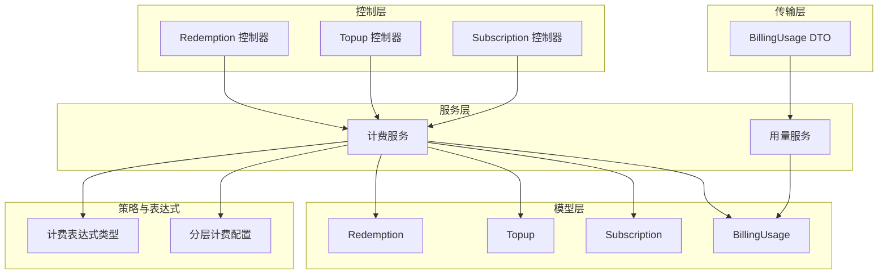
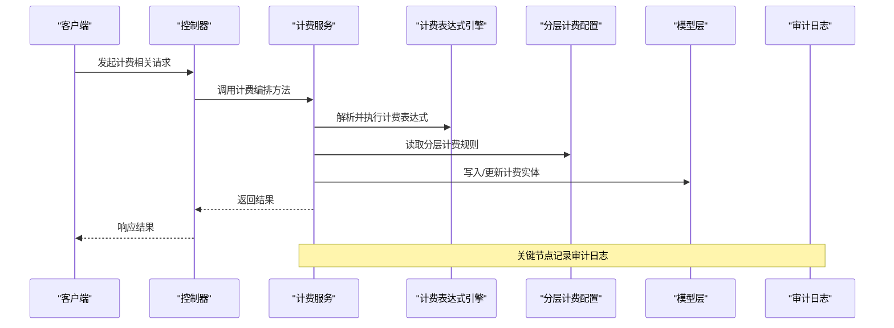
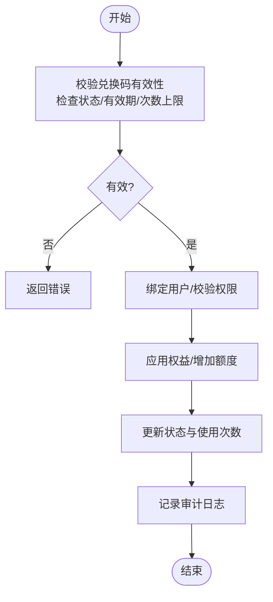
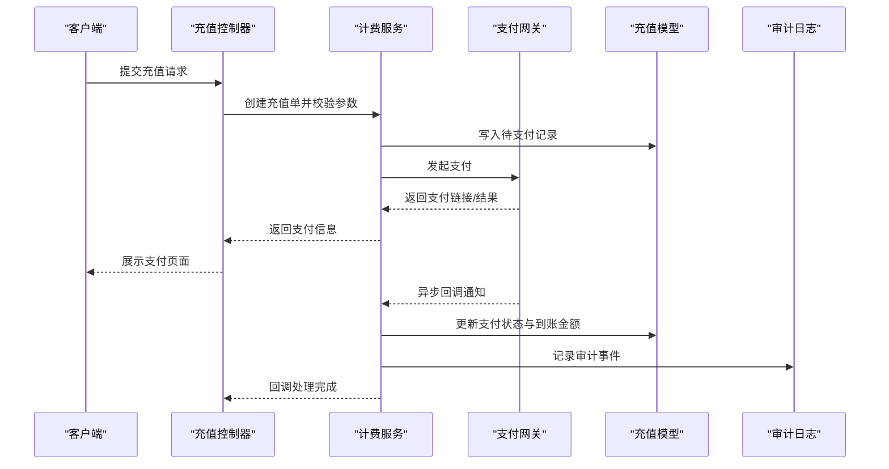
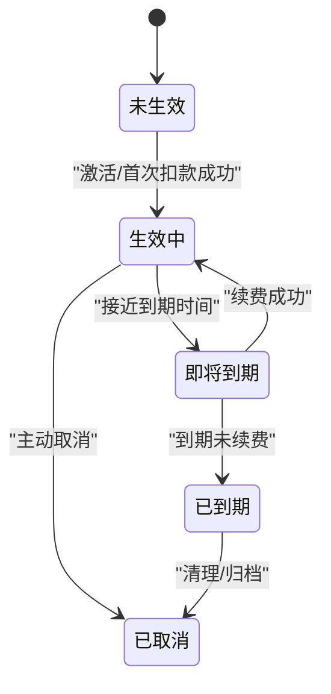
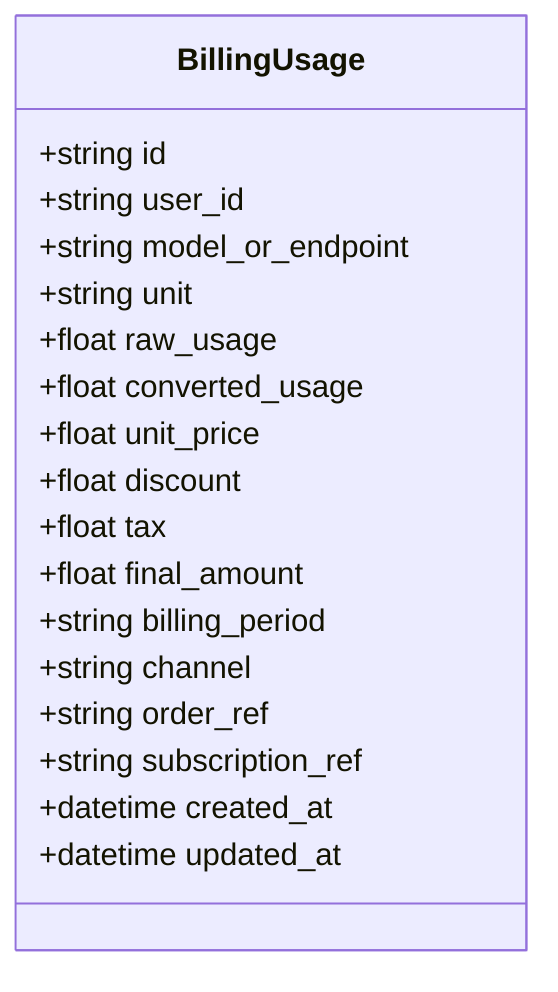
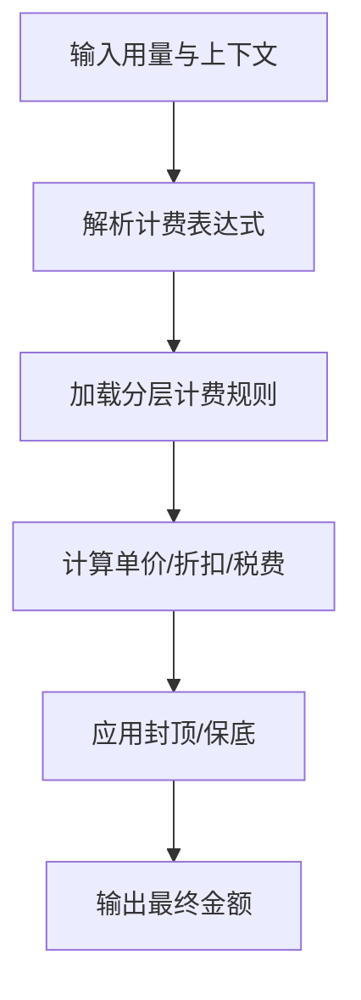
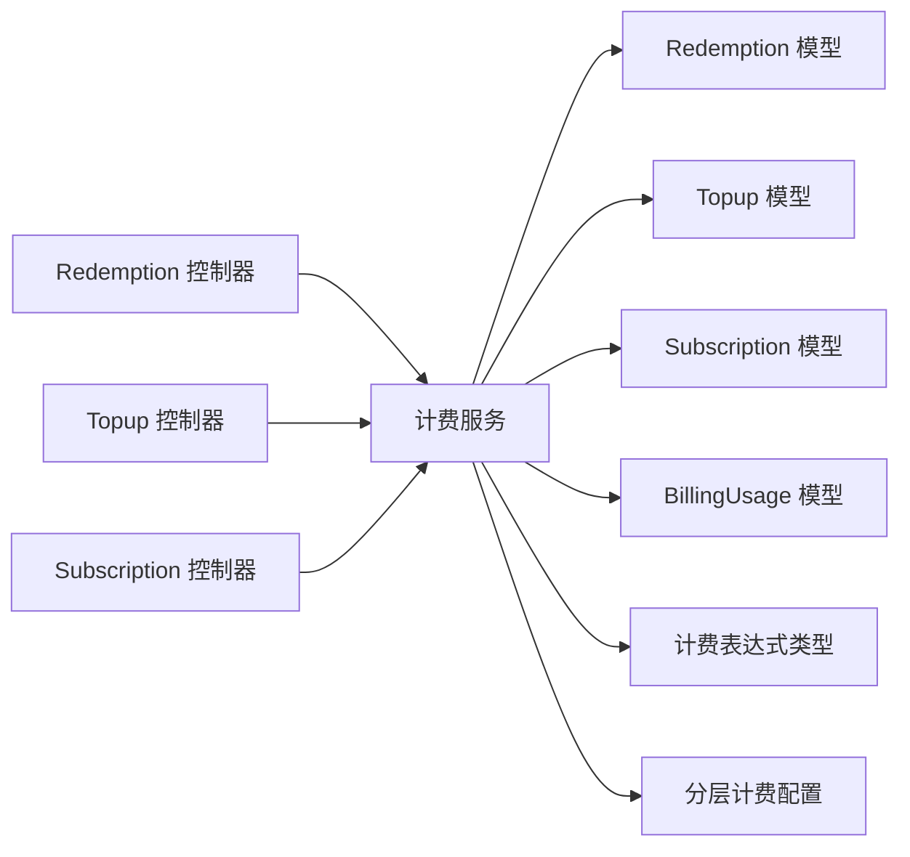

# 计费相关实体

<cite>
**本文引用的文件**   
- [model/redemption.go](file://model/redemption.go)
- [model/topup.go](file://model/topup.go)
- [model/subscription.go](file://model/subscription.go)
- [model/usedata.go](file://model/usedata.go)
- [dto/billing_usage.go](file://dto/billing_usage.go)
- [controller/redemption.go](file://controller/redemption.go)
- [controller/topup.go](file://controller/topup.go)
- [controller/subscription.go](file://controller/subscription.go)
- [service/billing.go](file://service/billing.go)
- [service/billing_usage.go](file://service/billing_usage.go)
- [pkg/billingexpr/types.go](file://pkg/billingexpr/types.go)
- [setting/billing_setting/tiered_billing.go](file://setting/billing_setting/tiered_billing.go)
</cite>

## 目录
1. [简介](#简介)
2. [项目结构](#项目结构)
3. [核心组件](#核心组件)
4. [架构总览](#架构总览)
5. [详细组件分析](#详细组件分析)
6. [依赖关系分析](#依赖关系分析)
7. [性能考量](#性能考量)
8. [故障排查指南](#故障排查指南)
9. [结论](#结论)
10. [附录](#附录)

## 简介
本文件面向计费子系统，围绕兑换码(Redemption)、充值(Topup)、订阅(Subscription)与计费用量(BillingUsage)四大实体，给出数据模型、关联关系、金额计算逻辑、状态流转机制、策略配置、用量统计准确性与财务对账实现、安全审计与合规要求，并配以流程图与时序图帮助理解。

## 项目结构
计费相关代码主要分布在以下层次：
- 数据模型层(model)：定义数据库实体结构与基础方法
- 数据传输层(dto)：对外接口与内部处理的数据载体
- 控制器层(controller)：HTTP 路由与请求校验、事务编排
- 服务层(service)：业务编排、计费结算、任务调度
- 计费表达式与策略(pkg/billingexpr, setting/billing_setting)：计费公式与分层计费配置
- 持久化与审计：通过 model 层统一访问数据库，审计日志由系统日志模块记录

图表来源
- [model/redemption.go](file://model/redemption.go)
- [model/topup.go](file://model/topup.go)
- [model/subscription.go](file://model/subscription.go)
- [model/usedata.go](file://model/usedata.go)
- [dto/billing_usage.go](file://dto/billing_usage.go)
- [controller/redemption.go](file://controller/redemption.go)
- [controller/topup.go](file://controller/topup.go)
- [controller/subscription.go](file://controller/subscription.go)
- [service/billing.go](file://service/billing.go)
- [service/billing_usage.go](file://service/billing_usage.go)
- [pkg/billingexpr/types.go](file://pkg/billingexpr/types.go)
- [setting/billing_setting/tiered_billing.go](file://setting/billing_setting/tiered_billing.go)

章节来源
- [model/redemption.go](file://model/redemption.go)
- [model/topup.go](file://model/topup.go)
- [model/subscription.go](file://model/subscription.go)
- [model/usedata.go](file://model/usedata.go)
- [dto/billing_usage.go](file://dto/billing_usage.go)
- [controller/redemption.go](file://controller/redemption.go)
- [controller/topup.go](file://controller/topup.go)
- [controller/subscription.go](file://controller/subscription.go)
- [service/billing.go](file://service/billing.go)
- [service/billing_usage.go](file://service/billing_usage.go)
- [pkg/billingexpr/types.go](file://pkg/billingexpr/types.go)
- [setting/billing_setting/tiered_billing.go](file://setting/billing_setting/tiered_billing.go)

## 核心组件
- 兑换码(Redemption)：用于发放额度或权益的兑换凭证，支持绑定用户、使用次数限制、有效期与状态管理。
- 充值(Topup)：用户账户余额充值记录，包含支付方式、渠道、金额、汇率、手续费、订单号与支付状态。
- 订阅(Subscription)：周期性订阅计划，包含套餐、周期、价格、自动续费、生效与到期时间、状态机。
- 计费用量(BillingUsage)：按次/按量的计费明细，记录模型、用量单位、单价、折扣、税费、最终金额与归属维度（用户/租户/渠道）。

章节来源
- [model/redemption.go](file://model/redemption.go)
- [model/topup.go](file://model/topup.go)
- [model/subscription.go](file://model/subscription.go)
- [model/usedata.go](file://model/usedata.go)
- [dto/billing_usage.go](file://dto/billing_usage.go)

## 架构总览
计费子系统以“控制器编排 + 服务计算 + 模型持久化”为核心模式，结合计费表达式与分层计费策略，完成从用量采集到账单落库的全链路。

图表来源
- [controller/redemption.go](file://controller/redemption.go)
- [controller/topup.go](file://controller/topup.go)
- [controller/subscription.go](file://controller/subscription.go)
- [service/billing.go](file://service/billing.go)
- [pkg/billingexpr/types.go](file://pkg/billingexpr/types.go)
- [setting/billing_setting/tiered_billing.go](file://setting/billing_setting/tiered_billing.go)
- [model/redemption.go](file://model/redemption.go)
- [model/topup.go](file://model/topup.go)
- [model/subscription.go](file://model/subscription.go)
- [model/usedata.go](file://model/usedata.go)

## 详细组件分析

### 兑换码(Redemption)数据模型与流程
- 数据结构要点
  - 唯一标识、兑换码值、类型（额度/功能）、绑定用户、已用次数、最大可用次数、有效期、创建/更新时间、状态等。
- 关联关系
  - 可绑定用户；与充值/订阅无直接强耦合，但可作为权益发放入口。
- 状态流转
  - 未使用 → 已使用 → 已过期/失效；支持批量发放与回收。
- 金额计算逻辑
  - 兑换码本身不直接产生金额，通常映射为固定额度或权益；若涉及货币化，需结合充值或订阅定价策略。
- 安全性与审计
  - 防重放与幂等校验；操作审计记录生成人、IP、时间戳与变更前后值。

图表来源
- [model/redemption.go](file://model/redemption.go)
- [controller/redemption.go](file://controller/redemption.go)
- [service/billing.go](file://service/billing.go)

章节来源
- [model/redemption.go](file://model/redemption.go)
- [controller/redemption.go](file://controller/redemption.go)
- [service/billing.go](file://service/billing.go)

### 充值(Topup)数据模型与流程
- 数据结构要点
  - 充值单号、用户ID、支付方式、渠道、币种、金额、汇率、手续费、实付金额、到账金额、支付状态、回调流水号、失败原因等。
- 关联关系
  - 关联用户；与支付网关回调联动；与审计日志关联。
- 状态流转
  - 待支付 → 支付中 → 成功/失败；支持退款与冲正。
- 金额计算逻辑
  - 实付金额 = 面值 × 汇率 + 手续费；到账金额根据平台政策扣除手续费或补贴。
- 安全性与审计
  - 签名校验、幂等性保证、防重提交；全链路审计记录。

图表来源
- [model/topup.go](file://model/topup.go)
- [controller/topup.go](file://controller/topup.go)
- [service/billing.go](file://service/billing.go)

章节来源
- [model/topup.go](file://model/topup.go)
- [controller/topup.go](file://controller/topup.go)
- [service/billing.go](file://service/billing.go)

### 订阅(Subscription)数据模型与流程
- 数据结构要点
  - 订阅ID、用户ID、套餐ID、周期（月/年）、价格、币种、自动续费开关、生效时间、到期时间、状态、上次扣款时间、失败重试次数等。
- 关联关系
  - 关联用户与套餐；与充值余额或支付方式关联；与用量结算周期联动。
- 状态流转
  - 未生效 → 生效中 → 即将到期 → 已到期/已取消；自动续费失败进入宽限期。
- 金额计算逻辑
  - 周期价格 × 周期数 ± 折扣/税费；失败重试策略与滞纳金规则。
- 安全性与审计
  - 续费前校验余额/支付能力；续费失败告警；完整审计轨迹。

图表来源
- [model/subscription.go](file://model/subscription.go)
- [controller/subscription.go](file://controller/subscription.go)
- [service/billing.go](file://service/billing.go)

章节来源
- [model/subscription.go](file://model/subscription.go)
- [controller/subscription.go](file://controller/subscription.go)
- [service/billing.go](file://service/billing.go)

### 计费用量(BillingUsage)数据模型与流程
- 数据结构要点
  - 用量ID、用户ID、模型/接口、用量单位（如tokens/分钟/张）、原始用量、折算用量、单价、折扣、税费、最终金额、计费周期、来源渠道、关联订单/订阅等。
- 关联关系
  - 关联用户与渠道；可与充值余额扣减、订阅包内额度抵扣联动。
- 金额计算逻辑
  - 最终金额 = 折算用量 × 单价 × (1 - 折扣) + 税费；支持封顶与保底。
- 准确性保障
  - 用量采集与折算分离；幂等写入；对账差异补偿；审计追踪。
- 财务对账
  - 日/周/月对账报表；与支付流水、渠道账单核对；差异定位与处理。

图表来源
- [model/usedata.go](file://model/usedata.go)
- [dto/billing_usage.go](file://dto/billing_usage.go)
- [service/billing_usage.go](file://service/billing_usage.go)

章节来源
- [model/usedata.go](file://model/usedata.go)
- [dto/billing_usage.go](file://dto/billing_usage.go)
- [service/billing_usage.go](file://service/billing_usage.go)

### 计费策略与表达式
- 计费表达式类型
  - 支持变量引用、算术运算、条件分支、函数调用，用于动态计算单价、折扣、税费与封顶。
- 分层计费配置
  - 按用量区间设置不同单价，支持阶梯价、封顶价与最低消费。
- 配置方式
  - 通过配置文件或控制台动态更新；版本化管理与灰度发布。

图表来源
- [pkg/billingexpr/types.go](file://pkg/billingexpr/types.go)
- [setting/billing_setting/tiered_billing.go](file://setting/billing_setting/tiered_billing.go)

章节来源
- [pkg/billingexpr/types.go](file://pkg/billingexpr/types.go)
- [setting/billing_setting/tiered_billing.go](file://setting/billing_setting/tiered_billing.go)

## 依赖关系分析
- 控制器依赖服务层进行业务编排，服务层依赖模型层进行数据持久化。
- 计费表达式与分层计费配置在服务层被调用，确保计费逻辑可配置与可扩展。
- 审计日志贯穿各层，确保可追溯性与合规性。

图表来源
- [controller/redemption.go](file://controller/redemption.go)
- [controller/topup.go](file://controller/topup.go)
- [controller/subscription.go](file://controller/subscription.go)
- [service/billing.go](file://service/billing.go)
- [model/redemption.go](file://model/redemption.go)
- [model/topup.go](file://model/topup.go)
- [model/subscription.go](file://model/subscription.go)
- [model/usedata.go](file://model/usedata.go)
- [pkg/billingexpr/types.go](file://pkg/billingexpr/types.go)
- [setting/billing_setting/tiered_billing.go](file://setting/billing_setting/tiered_billing.go)

章节来源
- [controller/redemption.go](file://controller/redemption.go)
- [controller/topup.go](file://controller/topup.go)
- [controller/subscription.go](file://controller/subscription.go)
- [service/billing.go](file://service/billing.go)
- [model/redemption.go](file://model/redemption.go)
- [model/topup.go](file://model/topup.go)
- [model/subscription.go](file://model/subscription.go)
- [model/usedata.go](file://model/usedata.go)
- [pkg/billingexpr/types.go](file://pkg/billingexpr/types.go)
- [setting/billing_setting/tiered_billing.go](file://setting/billing_setting/tiered_billing.go)

## 性能考量
- 用量写入采用批处理与异步落库，降低热点写压力。
- 计费表达式缓存编译结果，避免重复解析。
- 分层计费配置热更新，减少重启开销。
- 充值回调幂等处理，避免重复入账。
- 订阅续费任务分片执行，提升并发处理能力。

## 故障排查指南
- 充值失败
  - 检查支付网关回调是否到达；确认幂等键与状态机转换是否正确；查看审计日志中的错误码与堆栈。
- 订阅续费异常
  - 核对余额/支付渠道可用性；检查宽限期与重试策略；关注续费失败告警与人工干预记录。
- 用量不一致
  - 对比原始用量与折算用量；核查表达式与分层配置版本；对账报表定位差异时间段与渠道。
- 兑换码无法使用
  - 检查状态、有效期与次数上限；确认绑定用户权限；查看审计日志中的拒绝原因。

章节来源
- [model/topup.go](file://model/topup.go)
- [model/subscription.go](file://model/subscription.go)
- [model/usedata.go](file://model/usedata.go)
- [model/redemption.go](file://model/redemption.go)
- [service/billing.go](file://service/billing.go)

## 结论
本计费子系统通过清晰的数据模型、可配置的计费表达式与分层策略、严格的审计与对账机制，实现了兑换码、充值、订阅与计费用量的全链路闭环。建议在后续迭代中持续优化用量采集精度、增强对账自动化与完善风控策略，以提升用户体验与财务合规性。

## 附录
- 术语表
  - 兑换码：用于发放额度或权益的凭证
  - 充值：用户账户余额充值记录
  - 订阅：周期性付费计划
  - 计费用量：按次/按量的计费明细
- 最佳实践
  - 所有金额计算必须幂等且可审计
  - 配置变更需版本化与灰度发布
  - 对账差异需有明确的处理流程与责任人