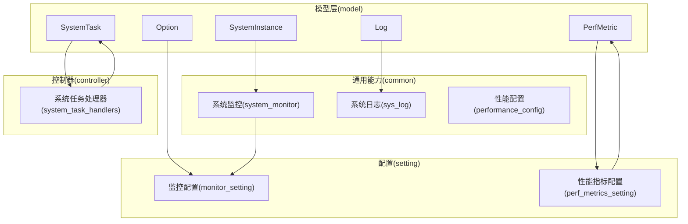
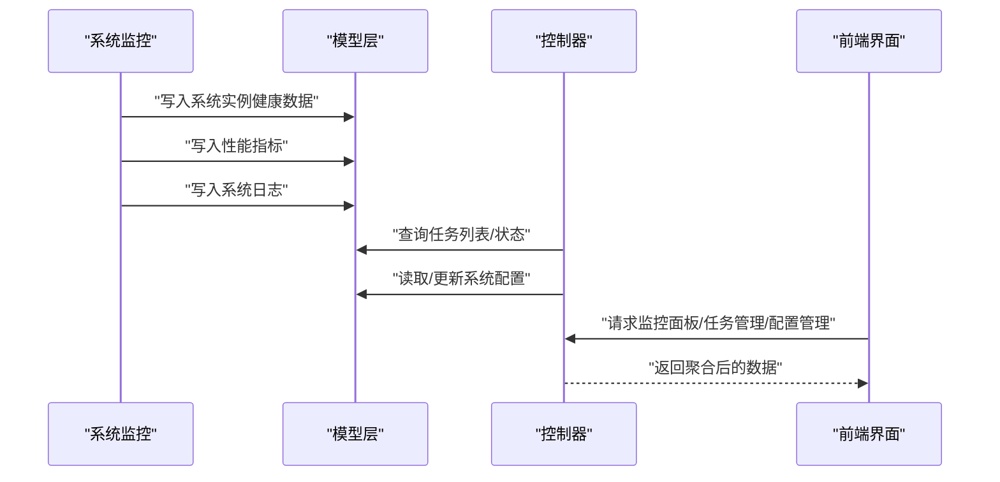
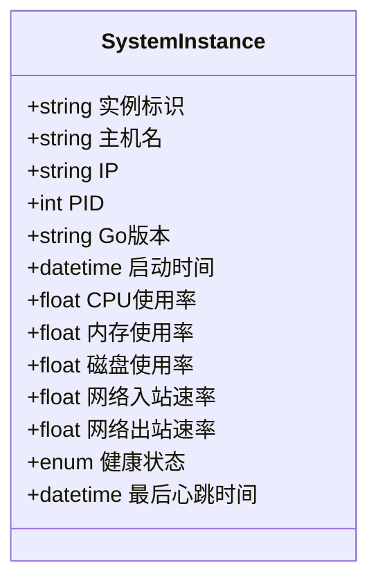
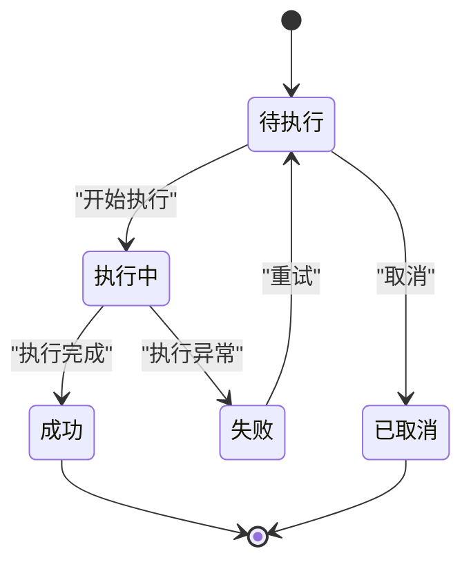
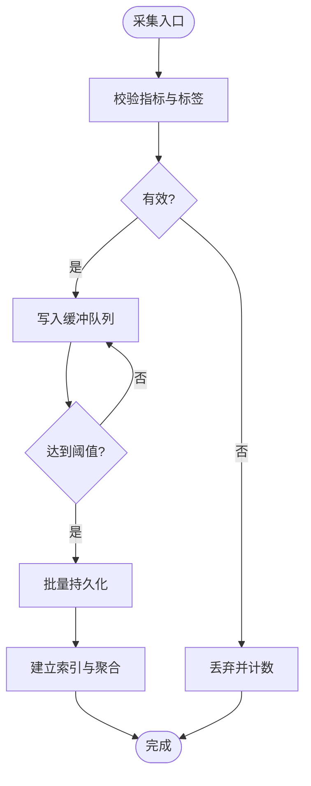
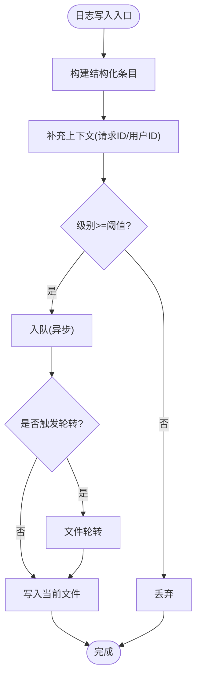
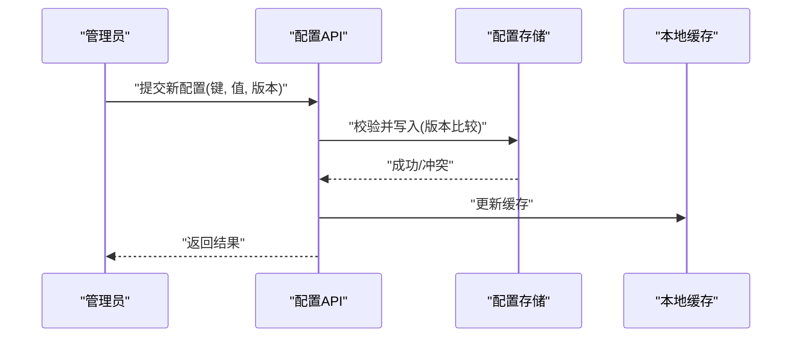
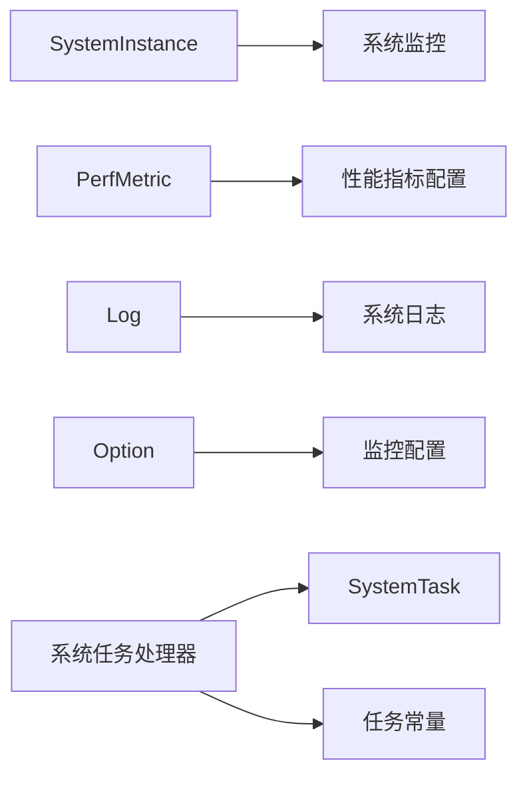

# 系统模型

<cite>
**本文引用的文件**   
- [system_instance.go](file://model/system_instance.go)
- [system_task.go](file://model/system_task.go)
- [perf_metric.go](file://model/perf_metric.go)
- [log.go](file://model/log.go)
- [option.go](file://model/option.go)
- [system_monitor.go](file://common/system_monitor.go)
- [sys_log.go](file://common/sys_log.go)
- [performance_config.go](file://common/performance_config.go)
- [task.go](file://constant/task.go)
- [system_task_handlers.go](file://controller/system_task_handlers.go)
- [perf_metrics_setting/config.go](file://setting/perf_metrics_setting/config.go)
- [operation_setting/monitor_setting.go](file://setting/operation_setting/monitor_setting.go)
</cite>

## 目录
1. [简介](#简介)
2. [项目结构](#项目结构)
3. [核心组件](#核心组件)
4. [架构总览](#架构总览)
5. [详细组件分析](#详细组件分析)
6. [依赖关系分析](#依赖关系分析)
7. [性能考量](#性能考量)
8. [故障排查指南](#故障排查指南)
9. [结论](#结论)
10. [附录](#附录)

## 简介
本文件面向系统级数据模型，聚焦以下实体：系统实例(SystemInstance)、系统任务(SystemTask)、性能指标(PerfMetric)、日志(Log)、系统配置(Option)。文档围绕监控、调度与配置管理三大主题，给出字段定义、约束、健康检查机制、任务执行状态、性能数据采集流程、日志记录格式与查询优化建议，以及配置的动态更新与版本管理策略。同时提供运维示例与管理操作指引，帮助读者快速理解并高效使用系统能力。

## 项目结构
系统模型相关代码主要分布在 model、common、setting、controller 等目录：
- model: 定义持久化实体与数据库映射（SystemInstance、SystemTask、PerfMetric、Log、Option）
- common: 运行时监控、日志采集、性能配置等通用能力
- setting: 配置项定义与校验（含监控、性能指标等）
- controller: 对外暴露的系统任务处理接口

图表来源 
- [system_instance.go](file://model/system_instance.go)
- [system_task.go](file://model/system_task.go)
- [perf_metric.go](file://model/perf_metric.go)
- [log.go](file://model/log.go)
- [option.go](file://model/option.go)
- [system_monitor.go](file://common/system_monitor.go)
- [sys_log.go](file://common/sys_log.go)
- [performance_config.go](file://common/performance_config.go)
- [operation_setting/monitor_setting.go](file://setting/operation_setting/monitor_setting.go)
- [perf_metrics_setting/config.go](file://setting/perf_metrics_setting/config.go)
- [controller/system_task_handlers.go](file://controller/system_task_handlers.go)

章节来源
- [system_instance.go](file://model/system_instance.go)
- [system_task.go](file://model/system_task.go)
- [perf_metric.go](file://model/perf_metric.go)
- [log.go](file://model/log.go)
- [option.go](file://model/option.go)
- [system_monitor.go](file://common/system_monitor.go)
- [sys_log.go](file://common/sys_log.go)
- [performance_config.go](file://common/performance_config.go)
- [operation_setting/monitor_setting.go](file://setting/operation_setting/monitor_setting.go)
- [perf_metrics_setting/config.go](file://setting/perf_metrics_setting/config.go)
- [controller/system_task_handlers.go](file://controller/system_task_handlers.go)

## 核心组件
本节概述各系统实体的职责与关键属性，便于快速定位数据结构与约束。

- 系统实例(SystemInstance)
  - 作用：描述运行中的系统节点或进程实例，用于健康检查与资源统计
  - 关键字段：实例标识、主机信息、进程信息、启动时间、资源占用、健康状态、最后心跳时间
  - 约束：唯一性由实例标识保证；健康状态需周期性刷新

- 系统任务(SystemTask)
  - 作用：表示后台定时或一次性任务，支持状态机流转与重试
  - 关键字段：任务标识、类型、状态、优先级、调度参数、执行结果、错误信息、创建/更新时间
  - 约束：状态受限于枚举集合；重试次数与间隔受配置控制

- 性能指标(PerfMetric)
  - 作用：采集系统与应用层面的性能度量，如延迟、吞吐、错误率、资源利用率
  - 关键字段：指标名称、维度标签、数值、时间戳、采样周期、聚合方式
  - 约束：指标名与标签组合应唯一；时间戳需单调递增

- 日志(Log)
  - 作用：记录系统运行日志，支持结构化字段与检索优化
  - 关键字段：级别、消息、上下文键值对、请求ID、耗时、堆栈、时间戳
  - 约束：级别为枚举；请求ID用于链路追踪；大字段可异步落盘

- 系统配置(Option)
  - 作用：集中管理系统运行参数，支持热更新与版本管理
  - 关键字段：配置键、值、版本、生效范围、描述、校验规则
  - 约束：键全局唯一；值需通过校验器；版本自增不可回退

章节来源
- [system_instance.go](file://model/system_instance.go)
- [system_task.go](file://model/system_task.go)
- [perf_metric.go](file://model/perf_metric.go)
- [log.go](file://model/log.go)
- [option.go](file://model/option.go)

## 架构总览
系统模型在“采集—存储—消费”的闭环中协同工作：
- 采集：系统监控与性能采集模块按配置周期抓取指标与健康状态
- 存储：模型层将数据持久化到数据库，并提供索引与分页查询
- 消费：控制器与前端展示监控面板、任务列表、配置管理与日志检索

图表来源 
- [system_monitor.go](file://common/system_monitor.go)
- [sys_log.go](file://common/sys_log.go)
- [performance_config.go](file://common/performance_config.go)
- [system_instance.go](file://model/system_instance.go)
- [perf_metric.go](file://model/perf_metric.go)
- [log.go](file://model/log.go)
- [option.go](file://model/option.go)
- [controller/system_task_handlers.go](file://controller/system_task_handlers.go)

## 详细组件分析

### 系统实例(SystemInstance)
- 字段说明
  - 实例标识：唯一键，用于区分不同节点/进程
  - 主机与进程信息：主机名、IP、PID、Go版本、启动时间
  - 资源占用：CPU、内存、磁盘、网络I/O
  - 健康状态：UP/DOWN/DEGRADED，结合心跳与自检结果
  - 最后心跳时间：用于判定存活与超时
- 约束与校验
  - 实例标识唯一；心跳间隔受监控配置限制
  - 资源指标需做范围校验与异常值过滤
- 健康检查机制
  - 周期性上报心跳；若超过阈值则标记为不健康
  - 可集成外部探针进行深度检查

图表来源 
- [system_instance.go](file://model/system_instance.go)
- [system_monitor.go](file://common/system_monitor.go)
- [operation_setting/monitor_setting.go](file://setting/operation_setting/monitor_setting.go)

章节来源
- [system_instance.go](file://model/system_instance.go)
- [system_monitor.go](file://common/system_monitor.go)
- [operation_setting/monitor_setting.go](file://setting/operation_setting/monitor_setting.go)

### 系统任务(SystemTask)
- 字段说明
  - 任务标识：唯一键
  - 任务类型：内置/自定义，决定执行器与参数结构
  - 状态：待执行、执行中、成功、失败、已取消
  - 优先级：数字越大优先级越高
  - 调度参数：cron表达式、延迟、最大重试次数、重试间隔
  - 执行结果：输出摘要、错误信息、耗时
  - 时间戳：创建、开始、结束、更新时间
- 状态机与约束
  - 状态转换遵循严格顺序；失败可进入重试分支
  - 重试次数与间隔受配置控制，避免雪崩
- 调度与执行
  - 调度器根据优先级与时间窗口派发任务
  - 执行器负责具体逻辑与结果回写

图表来源 
- [system_task.go](file://model/system_task.go)
- [task.go](file://constant/task.go)
- [controller/system_task_handlers.go](file://controller/system_task_handlers.go)

章节来源
- [system_task.go](file://model/system_task.go)
- [task.go](file://constant/task.go)
- [controller/system_task_handlers.go](file://controller/system_task_handlers.go)

### 性能指标(PerfMetric)
- 字段说明
  - 指标名称：如延迟P95、QPS、错误率、GC停顿
  - 维度标签：服务、实例、方法、区域等
  - 数值：浮点或整型
  - 时间戳：采样时刻
  - 采样周期：秒/分钟/小时
  - 聚合方式：平均、最大值、最小值、分位数
- 约束与优化
  - 指标名+标签组合唯一；时间戳单调递增
  - 高基数标签需降采样与归档策略
  - 批量写入与压缩存储提升吞吐

图表来源 
- [perf_metric.go](file://model/perf_metric.go)
- [perf_metrics_setting/config.go](file://setting/perf_metrics_setting/config.go)
- [performance_config.go](file://common/performance_config.go)

章节来源
- [perf_metric.go](file://model/perf_metric.go)
- [perf_metrics_setting/config.go](file://setting/perf_metrics_setting/config.go)
- [performance_config.go](file://common/performance_config.go)

### 日志(Log)
- 字段说明
  - 级别：DEBUG/INFO/WARN/ERROR/FATAL
  - 消息：人类可读文本
  - 上下文：键值对（用户ID、请求ID、方法、路径等）
  - 耗时：毫秒级
  - 堆栈：错误时的调用栈
  - 时间戳：精确到毫秒
- 记录格式与查询优化
  - 结构化JSON格式，便于解析与检索
  - 常用字段建立索引（级别、时间、请求ID、用户ID）
  - 大字段异步落盘，避免阻塞主流程
  - 滚动策略：按天/大小切分，保留期可配置

图表来源 
- [log.go](file://model/log.go)
- [sys_log.go](file://common/sys_log.go)

章节来源
- [log.go](file://model/log.go)
- [sys_log.go](file://common/sys_log.go)

### 系统配置(Option)
- 字段说明
  - 配置键：全局唯一键
  - 值：字符串/JSON/布尔/数值
  - 版本：自增版本号，用于冲突检测与回滚
  - 生效范围：全局/分组/实例
  - 描述与校验规则：用于前端提示与后端校验
- 动态更新与版本管理
  - 支持热更新：变更后立即生效，无需重启
  - 版本冲突：基于乐观锁，后提交者覆盖前提交者
  - 审计记录：变更记录包含操作人、时间、差异

图表来源 
- [option.go](file://model/option.go)

章节来源
- [option.go](file://model/option.go)

## 依赖关系分析
- 模型层依赖
  - SystemInstance 依赖系统监控模块获取健康与资源数据
  - PerfMetric 依赖性能配置确定采样与聚合策略
  - Log 依赖日志子系统实现异步写入与轮转
  - Option 依赖配置校验器与缓存机制
- 控制器依赖
  - 系统任务处理器依赖任务模型与常量定义的状态枚举
- 配置依赖
  - 监控与性能指标的配置分别位于 operation_setting 与 perf_metrics_setting

图表来源 
- [system_instance.go](file://model/system_instance.go)
- [perf_metric.go](file://model/perf_metric.go)
- [log.go](file://model/log.go)
- [option.go](file://model/option.go)
- [system_monitor.go](file://common/system_monitor.go)
- [sys_log.go](file://common/sys_log.go)
- [performance_config.go](file://common/performance_config.go)
- [operation_setting/monitor_setting.go](file://setting/operation_setting/monitor_setting.go)
- [perf_metrics_setting/config.go](file://setting/perf_metrics_setting/config.go)
- [controller/system_task_handlers.go](file://controller/system_task_handlers.go)
- [task.go](file://constant/task.go)

章节来源
- [system_instance.go](file://model/system_instance.go)
- [perf_metric.go](file://model/perf_metric.go)
- [log.go](file://model/log.go)
- [option.go](file://model/option.go)
- [system_monitor.go](file://common/system_monitor.go)
- [sys_log.go](file://common/sys_log.go)
- [performance_config.go](file://common/performance_config.go)
- [operation_setting/monitor_setting.go](file://setting/operation_setting/monitor_setting.go)
- [perf_metrics_setting/config.go](file://setting/perf_metrics_setting/config.go)
- [controller/system_task_handlers.go](file://controller/system_task_handlers.go)
- [task.go](file://constant/task.go)

## 性能考量
- 指标采集
  - 采用缓冲队列与批量写入，降低IO开销
  - 高基数标签进行降采样与归档，减少存储压力
- 日志写入
  - 异步队列与文件轮转，避免阻塞主线程
  - 选择性记录堆栈，仅在错误级别启用
- 配置读取
  - 本地缓存+失效策略，减少数据库访问
  - 版本冲突检测使用乐观锁，提高并发安全
- 任务调度
  - 优先级队列与限流，防止过载
  - 重试退避策略，避免雪崩

[本节为通用指导，不涉及具体文件分析]

## 故障排查指南
- 健康检查异常
  - 检查心跳间隔与阈值配置；确认实例进程存活
  - 查看系统监控日志与资源指标趋势
- 任务执行失败
  - 查看任务状态与错误信息；检查重试次数与间隔
  - 核对任务类型与执行器绑定是否正确
- 指标缺失或异常
  - 确认采样周期与聚合配置；检查缓冲队列是否积压
  - 验证标签基数与命名规范
- 日志无法检索
  - 检查索引字段与查询条件；确认文件轮转与保留策略
  - 查看日志级别阈值与上下文字段是否完整
- 配置更新冲突
  - 比对版本号；确认操作权限与生效范围
  - 查看变更记录与回滚策略

章节来源
- [system_monitor.go](file://common/system_monitor.go)
- [sys_log.go](file://common/sys_log.go)
- [performance_config.go](file://common/performance_config.go)
- [operation_setting/monitor_setting.go](file://setting/operation_setting/monitor_setting.go)
- [perf_metrics_setting/config.go](file://setting/perf_metrics_setting/config.go)
- [controller/system_task_handlers.go](file://controller/system_task_handlers.go)

## 结论
系统模型以清晰的数据结构与严格的约束为基础，配合监控、调度与配置管理能力，形成完整的运维支撑体系。通过合理的采集、存储与查询优化，系统在大规模场景下仍能保持高可用与高性能。建议在生产环境中持续监控指标与日志，定期评估配置与任务策略，确保系统稳定运行。

[本节为总结性内容，不涉及具体文件分析]

## 附录
- 运维示例数据
  - 系统实例：包含实例标识、主机信息、资源占用与健康状态的样例记录
  - 系统任务：包含任务类型、状态、优先级与执行结果的样例记录
  - 性能指标：包含指标名称、标签、数值与时间戳的样例记录
  - 日志：包含级别、消息、上下文与耗时的样例记录
  - 系统配置：包含键、值、版本与生效范围的样例记录
- 管理操作
  - 健康检查：启动/停止心跳、调整阈值、查看健康报告
  - 任务管理：创建/暂停/重试/取消任务，查看执行历史
  - 指标查询：按时间范围与标签筛选，导出报表
  - 日志检索：按级别、时间、请求ID检索，下载日志文件
  - 配置管理：新增/修改/删除配置，查看版本差异与变更记录

[本节为概念性内容，不涉及具体文件分析]