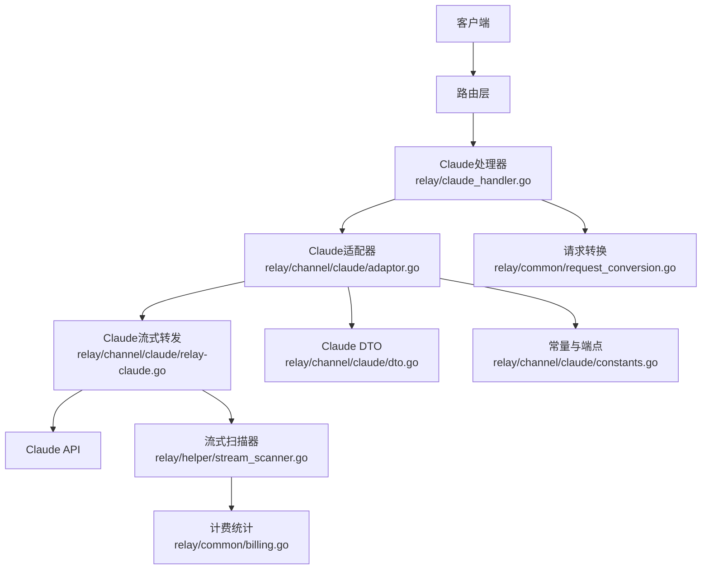
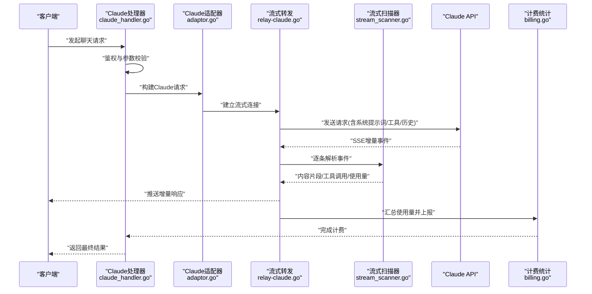
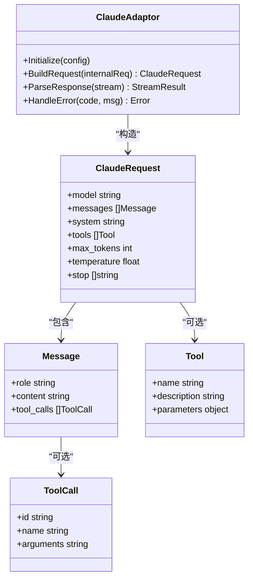
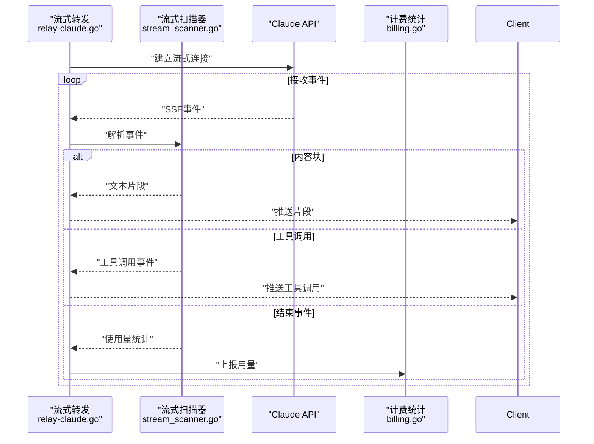
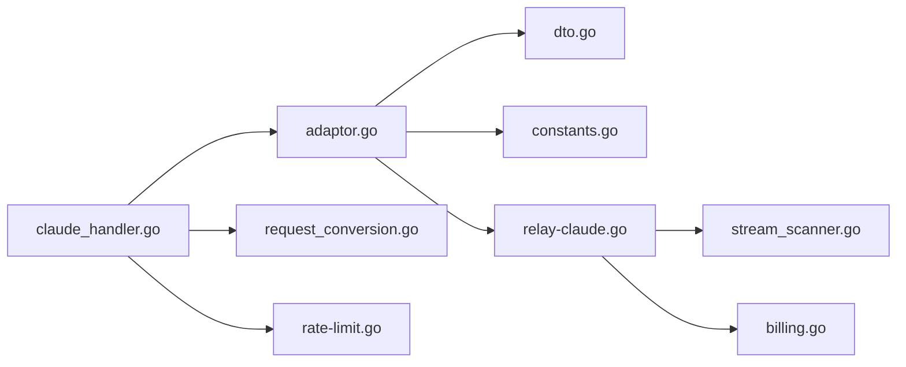

# Claude提供商

<cite>
**本文引用的文件**   
- [relay-claude.go](file://relay/channel/claude/relay-claude.go)
- [adaptor.go](file://relay/channel/claude/adaptor.go)
- [dto.go](file://relay/channel/claude/dto.go)
- [constants.go](file://relay/channel/claude/constants.go)
- [message_delta_usage_patch_test.go](file://relay/channel/claude/message_delta_usage_patch_test.go)
- [relay_claude_test.go](file://relay/channel/claude/relay_claude_test.go)
- [claude_handler.go](file://relay/claude_handler.go)
- [claude.go](file://dto/claude.go)
- [claude.go](file://setting/model_setting/claude.go)
- [channel_settings.go](file://dto/channel_settings.go)
- [relay_adaptor.go](file://relay/relay_adaptor.go)
- [stream_scanner.go](file://relay/helper/stream_scanner.go)
- [stream_result.go](file://relay/helper/stream_result.go)
- [request_conversion.go](file://relay/common/request_conversion.go)
- [billing.go](file://relay/common/billing.go)
- [rate-limit.go](file://middleware/rate-limit.go)
- [model_rate_limit_test.go](file://middleware/model_rate_limit_test.go)
- [openai_request.go](file://dto/openai_request.go)
- [openai_response.go](file://dto/openai_response.go)
</cite>

## 目录
1. [简介](#简介)
2. [项目结构](#项目结构)
3. [核心组件](#核心组件)
4. [架构总览](#架构总览)
5. [详细组件分析](#详细组件分析)
6. [依赖关系分析](#依赖关系分析)
7. [性能考量](#性能考量)
8. [故障排查指南](#故障排查指南)
9. [结论](#结论)
10. [附录](#附录)

## 简介
本文件面向在系统中接入并运行Claude提供商的开发者与运维人员，系统性说明Claude渠道的实现细节、消息格式转换、流式响应处理、配置项与密钥设置、模型参数与速率限制、以及Claude特有功能（系统提示词、工具调用、消息历史管理）等。同时提供与OpenAI格式的兼容性说明、请求与响应示例路径、性能优化建议与常见问题解决方案。

## 项目结构
Claude相关代码主要分布在以下模块：
- 渠道适配层：relay/channel/claude 下的适配器、DTO、常量与流式转发实现
- 统一入口与处理器：relay/claude_handler.go 负责将上游请求路由到Claude渠道
- DTO与模型设置：dto/claude.go 定义Claude请求/响应结构；setting/model_setting/claude.go 提供模型级默认与校验
- 通用能力：relay/common 与 relay/helper 提供计费、流式扫描、请求转换等公共能力
- 中间件：middleware 提供限流、鉴权、日志等横切能力

图表来源
- [relay-claude.go:1-200](file://relay/channel/claude/relay-claude.go#L1-L200)
- [adaptor.go:1-200](file://relay/channel/claude/adaptor.go#L1-L200)
- [dto.go:1-200](file://relay/channel/claude/dto.go#L1-L200)
- [constants.go:1-200](file://relay/channel/claude/constants.go#L1-L200)
- [stream_scanner.go:1-200](file://relay/helper/stream_scanner.go#L1-L200)
- [billing.go:1-200](file://relay/common/billing.go#L1-L200)
- [request_conversion.go:1-200](file://relay/common/request_conversion.go#L1-L200)

章节来源
- [relay-claude.go:1-200](file://relay/channel/claude/relay-claude.go#L1-L200)
- [adaptor.go:1-200](file://relay/channel/claude/adaptor.go#L1-L200)
- [dto.go:1-200](file://relay/channel/claude/dto.go#L1-L200)
- [constants.go:1-200](file://relay/channel/claude/constants.go#L1-L200)
- [claude_handler.go:1-200](file://relay/claude_handler.go#L1-L200)

## 核心组件
- Claude适配器（Adaptor）：封装Claude渠道的初始化、认证、端点选择、请求构造与响应解析
- 流式转发（Relay）：基于HTTP流式接口将Claude的增量输出以事件流形式回传客户端
- DTO与常量：定义Claude特有的消息结构、工具调用字段、使用量统计字段及API端点常量
- 处理器（Handler）：统一入口，负责鉴权、参数校验、请求转换、调用适配器与返回结果
- 流式扫描器（Scanner）：对SSE或JSON Lines流进行增量解析，提取内容片段与使用量信息
- 计费与限流：在请求前后进行用量统计与配额控制

章节来源
- [adaptor.go:1-200](file://relay/channel/claude/adaptor.go#L1-L200)
- [relay-claude.go:1-200](file://relay/channel/claude/relay-claude.go#L1-L200)
- [dto.go:1-200](file://relay/channel/claude/dto.go#L1-L200)
- [constants.go:1-200](file://relay/channel/claude/constants.go#L1-L200)
- [claude_handler.go:1-200](file://relay/claude_handler.go#L1-L200)
- [stream_scanner.go:1-200](file://relay/helper/stream_scanner.go#L1-L200)
- [billing.go:1-200](file://relay/common/billing.go#L1-L200)

## 架构总览
下图展示了从客户端请求到Claude上游的完整流程，包括请求转换、流式转发、增量解析与计费统计。

图表来源
- [claude_handler.go:1-200](file://relay/claude_handler.go#L1-L200)
- [adaptor.go:1-200](file://relay/channel/claude/adaptor.go#L1-L200)
- [relay-claude.go:1-200](file://relay/channel/claude/relay-claude.go#L1-L200)
- [stream_scanner.go:1-200](file://relay/helper/stream_scanner.go#L1-L200)
- [billing.go:1-200](file://relay/common/billing.go#L1-L200)

## 详细组件分析

### Claude适配器（Adaptor）
职责：
- 初始化渠道配置（API密钥、基础URL、超时等）
- 根据模型与参数选择正确的端点与版本
- 将内部请求转换为Claude DTO结构
- 解析Claude响应为内部统一格式

关键点：
- 支持系统提示词、工具调用、消息历史等Claude特有字段映射
- 错误码与异常映射到统一错误体系
- 可插拔的头部与签名策略（如签名算法、鉴权头）

章节来源
- [adaptor.go:1-200](file://relay/channel/claude/adaptor.go#L1-L200)
- [dto.go:1-200](file://relay/channel/claude/dto.go#L1-L200)
- [constants.go:1-200](file://relay/channel/claude/constants.go#L1-L200)

#### 类图（适配器与DTO关系）

图表来源
- [adaptor.go:1-200](file://relay/channel/claude/adaptor.go#L1-L200)
- [dto.go:1-200](file://relay/channel/claude/dto.go#L1-L200)

### 流式转发（Relay）
职责：
- 建立与Claude的HTTP流式连接
- 读取SSE事件并解码为结构化数据
- 将增量内容、工具调用与使用量信息推送给客户端
- 处理连接中断、重试与超时

关键点：
- 增量解析需兼容不同事件类型（内容块、工具调用、结束事件）
- 使用量统计在流结束时汇总上报
- 错误事件需透传并记录上下文

章节来源
- [relay-claude.go:1-200](file://relay/channel/claude/relay-claude.go#L1-L200)
- [stream_scanner.go:1-200](file://relay/helper/stream_scanner.go#L1-L200)
- [stream_result.go:1-200](file://relay/helper/stream_result.go#L1-L200)

#### 序列图（流式处理）

图表来源
- [relay-claude.go:1-200](file://relay/channel/claude/relay-claude.go#L1-L200)
- [stream_scanner.go:1-200](file://relay/helper/stream_scanner.go#L1-L200)
- [billing.go:1-200](file://relay/common/billing.go#L1-L200)

### 处理器（Handler）
职责：
- 统一入口，处理鉴权、参数校验、请求转换
- 调用适配器执行请求，处理非流与流式两种模式
- 返回统一格式响应，包含内容、工具调用与使用量

关键点：
- 支持OpenAI格式兼容层，自动转换差异字段
- 错误处理与重试策略
- 日志与审计记录

章节来源
- [claude_handler.go:1-200](file://relay/claude_handler.go#L1-L200)
- [request_conversion.go:1-200](file://relay/common/request_conversion.go#L1-L200)

### DTO与常量
- Claude DTO：定义请求体、消息结构、工具调用、使用量统计等
- 常量：定义端点路径、版本号、错误码映射等

章节来源
- [dto.go:1-200](file://relay/channel/claude/dto.go#L1-L200)
- [constants.go:1-200](file://relay/channel/claude/constants.go#L1-L200)

### 模型设置与默认值
- 模型级默认参数：最大令牌数、温度、停止符等
- 校验规则：参数范围检查、必填字段验证
- 与渠道配置的联动：覆盖默认值

章节来源
- [claude.go:1-200](file://setting/model_setting/claude.go#L1-L200)
- [channel_settings.go:1-200](file://dto/channel_settings.go#L1-L200)

## 依赖关系分析
Claude渠道依赖以下核心模块：
- 适配器与DTO：定义Claude特定数据结构
- 流式扫描器：解析SSE事件
- 计费统计：记录token使用量
- 请求转换：OpenAI格式与Claude格式互转
- 中间件：限流、鉴权、日志

图表来源
- [claude_handler.go:1-200](file://relay/claude_handler.go#L1-L200)
- [adaptor.go:1-200](file://relay/channel/claude/adaptor.go#L1-L200)
- [dto.go:1-200](file://relay/channel/claude/dto.go#L1-L200)
- [constants.go:1-200](file://relay/channel/claude/constants.go#L1-L200)
- [relay-claude.go:1-200](file://relay/channel/claude/relay-claude.go#L1-L200)
- [stream_scanner.go:1-200](file://relay/helper/stream_scanner.go#L1-L200)
- [billing.go:1-200](file://relay/common/billing.go#L1-L200)
- [request_conversion.go:1-200](file://relay/common/request_conversion.go#L1-L200)
- [rate-limit.go:1-200](file://middleware/rate-limit.go#L1-L200)

章节来源
- [relay_adaptor.go:1-200](file://relay/relay_adaptor.go#L1-L200)
- [rate-limit.go:1-200](file://middleware/rate-limit.go#L1-L200)
- [model_rate_limit_test.go:1-200](file://middleware/model_rate_limit_test.go#L1-L200)

## 性能考量
- 流式传输：优先使用SSE流式响应降低首字节延迟
- 增量解析：避免全量缓冲，按事件块处理减少内存占用
- 连接复用：保持HTTP长连接，减少握手开销
- 并发控制：通过中间件限流保护上游服务
- 缓存策略：对静态配置与模型元数据进行缓存
- 错误重试：对瞬态错误实施指数退避重试

[本节为通用指导，不直接分析具体文件]

## 故障排查指南
常见问题与解决思路：
- 鉴权失败：检查API密钥配置与签名算法
- 参数错误：核对模型支持的参数范围与必填字段
- 流式中断：检查网络稳定性与服务端超时设置
- 使用量统计异常：确认流结束事件是否被正确解析
- 限流触发：调整中间件限流阈值或扩容上游实例

章节来源
- [message_delta_usage_patch_test.go:1-200](file://relay/channel/claude/message_delta_usage_patch_test.go#L1-L200)
- [relay_claude_test.go:1-200](file://relay/channel/claude/relay_claude_test.go#L1-L200)
- [rate-limit.go:1-200](file://middleware/rate-limit.go#L1-L200)
- [model_rate_limit_test.go:1-200](file://middleware/model_rate_limit_test.go#L1-L200)

## 结论
Claude渠道通过适配器模式实现了与上游API的解耦，结合流式扫描器与计费统计提供了高性能、可扩展的集成方案。通过统一的请求转换层，系统能够兼容OpenAI格式并处理Claude特有功能。建议在生产环境中启用限流、监控与日志审计，确保稳定运行。

[本节为总结性内容，不直接分析具体文件]

## 附录

### 配置选项与API密钥设置
- 渠道配置：API密钥、基础URL、超时时间、重试策略
- 模型设置：最大令牌数、温度、停止符、频率惩罚等
- 安全设置：签名算法、头部白名单、SSRF防护

章节来源
- [channel_settings.go:1-200](file://dto/channel_settings.go#L1-L200)
- [claude.go:1-200](file://setting/model_setting/claude.go#L1-L200)

### 模型参数与速率限制
- 模型参数：temperature、top_p、max_tokens、stop等
- 速率限制：全局限流、模型级限流、用户级限流

章节来源
- [rate-limit.go:1-200](file://middleware/rate-limit.go#L1-L200)
- [model_rate_limit_test.go:1-200](file://middleware/model_rate_limit_test.go#L1-L200)

### Claude特有功能
- 系统提示词：通过system字段设置
- 工具调用：支持function calling与tool_use事件
- 消息历史：维护多轮对话上下文

章节来源
- [dto.go:1-200](file://relay/channel/claude/dto.go#L1-L200)
- [constants.go:1-200](file://relay/channel/claude/constants.go#L1-L200)

### OpenAI格式兼容性
- 请求转换：将OpenAI chat completions请求转换为Claude格式
- 响应兼容：将Claude响应转换为OpenAI标准格式
- 差异处理：处理字段名、枚举值、嵌套结构的差异

章节来源
- [request_conversion.go:1-200](file://relay/common/request_conversion.go#L1-L200)
- [openai_request.go:1-200](file://dto/openai_request.go#L1-L200)
- [openai_response.go:1-200](file://dto/openai_response.go#L1-L200)

### 请求与响应示例
- 请求示例：包含系统提示词、消息历史、工具调用、模型参数
- 响应示例：包含增量文本、工具调用、使用量统计

章节来源
- [relay_claude_test.go:1-200](file://relay/channel/claude/relay_claude_test.go#L1-L200)
- [message_delta_usage_patch_test.go:1-200](file://relay/channel/claude/message_delta_usage_patch_test.go#L1-L200)

### 性能优化建议
- 启用流式响应降低延迟
- 合理设置超时与重试策略
- 使用连接池提高并发性能
- 监控关键指标：QPS、延迟、错误率、资源使用

[本节为通用指导，不直接分析具体文件]

### 常见问题解决方案
- 鉴权问题：检查密钥格式与权限
- 参数错误：参考模型文档验证参数
- 流式中断：检查网络与服务端状态
- 限流问题：调整限流阈值或扩容

章节来源
- [rate-limit.go:1-200](file://middleware/rate-limit.go#L1-L200)
- [model_rate_limit_test.go:1-200](file://middleware/model_rate_limit_test.go#L1-L200)